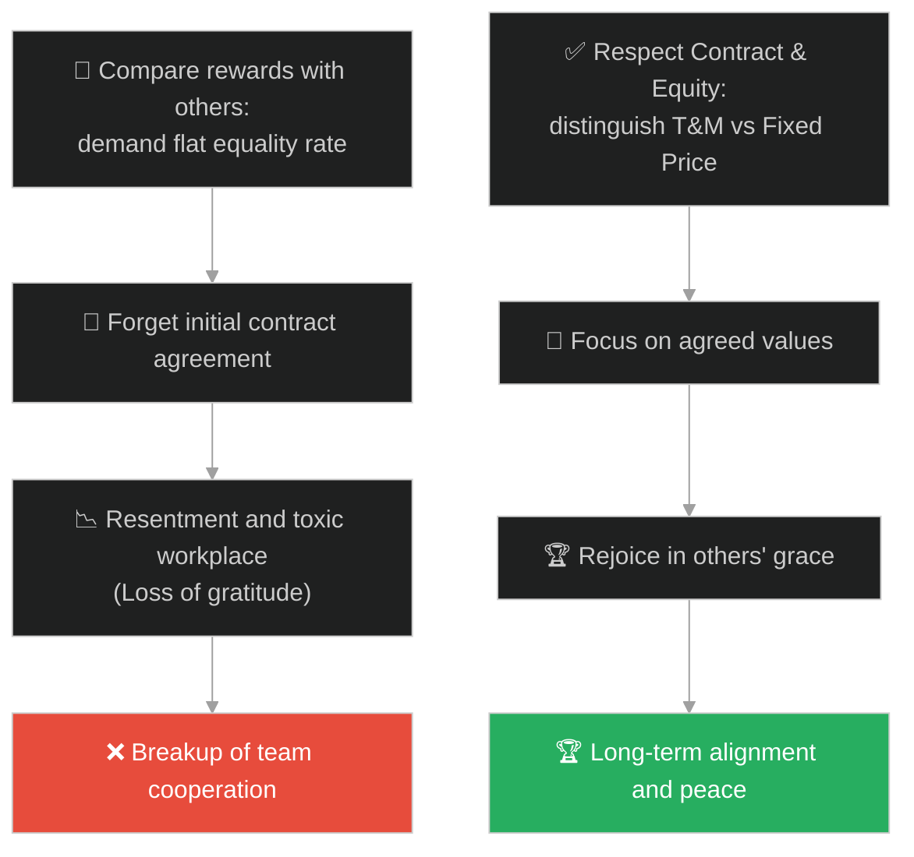
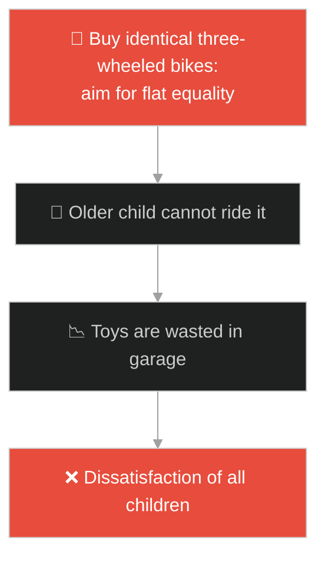
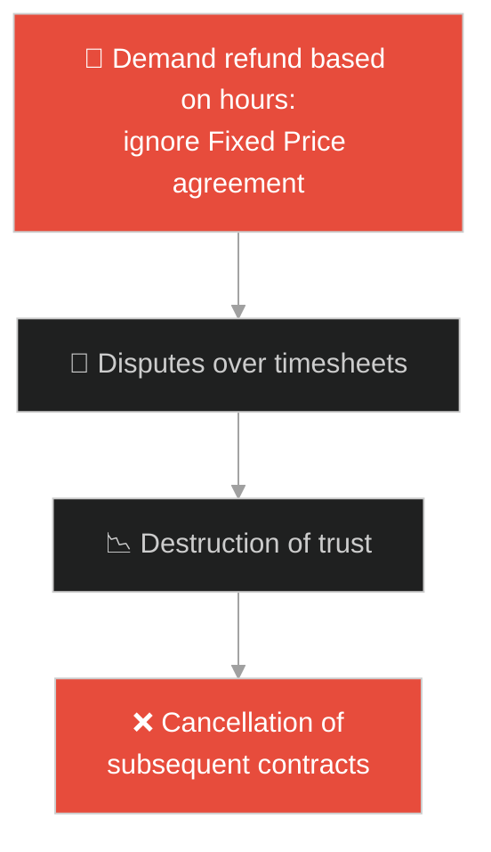
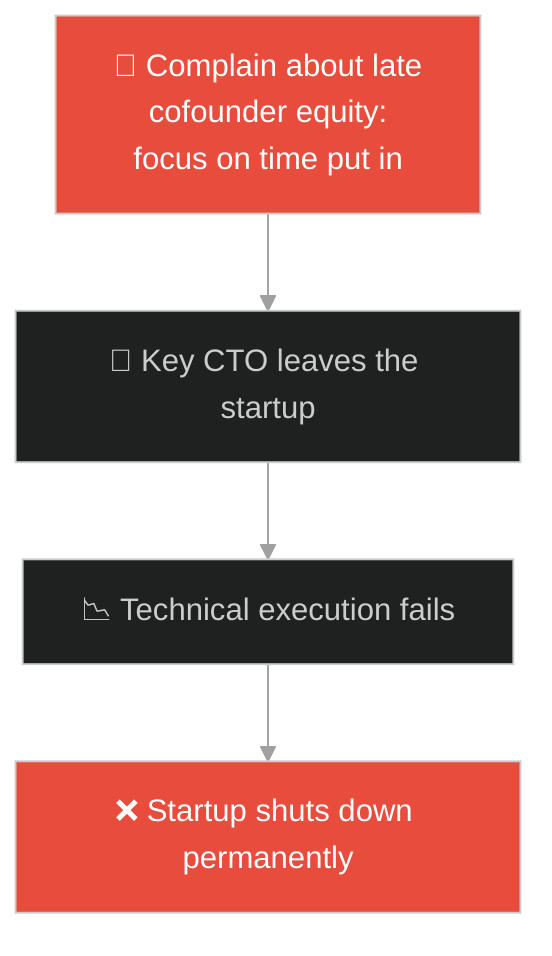
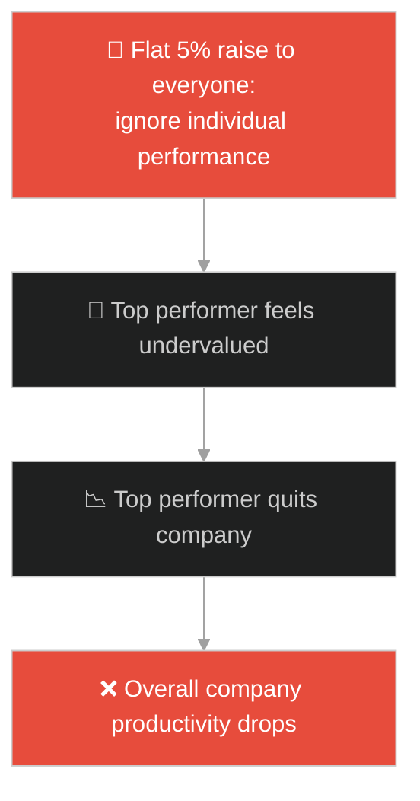
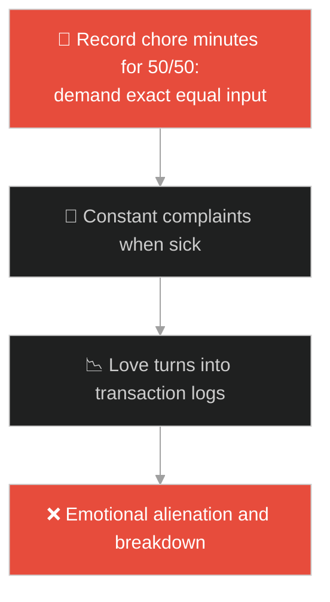
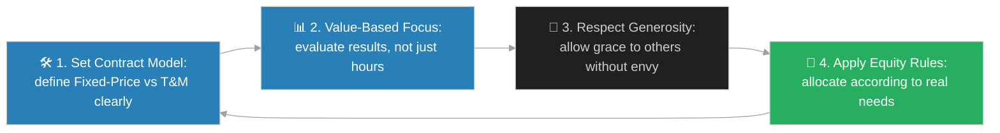

# Equality vs Equity & Time/Materials Contracts (សមភាពនិងសមធម៌ និងកិច្ចសន្យាពេលវេលា/សម្ភារៈ)៖ ក្រុមកម្មករក្នុងចំការទំពាំងបាយជូរ (Equality vs Equity & Time/Materials Contracts & Jesus and the Workers in the Vineyard)

**Author:** ichamrong  
**Date:** 2026-05-28  
**Tags:** #jesus #equity-vs-equality #contracts #compensation #comparison #fairness  
**Category:** Concepts / Parables  
**Read Time:** ~15 min  

---

## 📌 មាតិកា (Table of Contents)
- [អន្ទាក់ផ្លូវចិត្ត (The Trap)](#0)
- [១. រឿងព្រេងនិទាន៖ កម្មករក្នុងចម្ការទំពាំងបាយជូរ (The Legend of the Workers in the Vineyard)](#1)
  - [ការបើកប្រាក់ឈ្នួលស្មើគ្នា និងការមិនពេញចិត្តរបស់ក្រុមម៉ោង ៦ ព្រឹក (The Equal Wage and the Envy of the Early Workers)](#1-1)
- [២. បញ្ហា៖ ការភាន់ច្រឡំរវាងសមភាព និងសមធម៌ ក្នុងការបែងចែកផល និងកិច្ចសន្យាការងារ (The Issue: Conflating Equality with Equity and Flat Rates vs Retainers)](#2)
- [៣. ឧទាហមណ៍ជាក់ស្តែងក្នុងពិភពពិត (Real World Examples)](#3)
  - [ឧទាហរណ៍ទី ១ — កម្រិតស្រាល (គ្រួសារ)៖ ការបែងចែកកាដូដល់កូនៗដោយមើលរំលងតម្រូវការជាក់ស្តែង (Dividing Gifts Equally Regardless of Children's Actual Needs)](#3-1)
  - [ឧទាហរណ៍ទី ២ — កម្រិតមធ្យម (បច្ចេកទេស)៖ កិច្ចសន្យាការងារទូទាត់ថេរធៀបនឹងកិច្ចសន្យា Time & Materials (Fixed Price Contract vs Time & Materials Contracts)](#3-2)
  - [ឧទាហរណ៍ទី ៣ — កម្រិតមធ្យម (ធុរកិច្ច)៖ ការត្អូញត្អែររបស់ដៃគូសហការដើមដំបូងអំពីភាគហ៊ុនរបស់សមាជិកថ្មី (Early Founders complaining about Late Co-founder Equity Allocation)](#3-3)
  - [ឧទាហរណ៍ទី ៤ — កម្រិតមធ្យម (សង្គម/គ្រប់គ្រង)៖ ការតម្លើងប្រាក់ខែសមធម៌ផ្អែកលើការសម្រេចលទ្ធផល (Equity-based Compensation vs Flat Percentage Raise)](#3-4)
  - [ឧទាហរណ៍ទី ៥ — កម្រិតធ្ងន់ (ទំនាក់ទំនង)៖ ដៃគូដែលរាប់នាទីចំណាយលើកិច្ចការផ្ទះដើម្បីទាមទារភាពស្មើគ្នា (Partners Counting Minutes of Chores to Demand Exact 50/50 Split)](#3-5)
- [៤. ដំណោះស្រាយទូទៅ៖ ការកំណត់ទម្រង់កិច្ចសន្យាច្បាស់លាស់ និងការអនុវត្តសមធម៌ (The General Solution: Clear Contract Scopes and Equity-Driven Alignment)](#4)
- [សេចក្តីសន្និដ្ឋាន (Conclusion)](#5)
- [ឯកសារយោង (References)](#6)
- [Related Posts](#7)

---

<a id="0"></a>
## អន្ទាក់ផ្លូវចិត្ត (The Trap)

តើអ្នកធ្លាប់មានអារម្មណ៍ថាជីវិតនេះអយុត្តិធម៌ខ្លាំង នៅពេលឃើញនរណាម្នាក់ទទួលបានផលលទ្ធផលស្មើនឹងអ្នក ទាំងដែលគេចំណាយកម្លាំងតិចជាងអ្នកដែរឬទេ? មនុស្សភាគច្រើនយល់ច្រឡំថា "សមភាព (Equality - ការចែកស្មើគ្នា) គឺជាភាពយុត្តិធម៌តែមួយគត់"។ ប៉ុន្តែនៅក្នុងប្រព័ន្ធគ្រប់គ្រង និងការចាត់ចែង ភាពយុត្តិធម៌ពិតប្រាកដគឺស្ថិតនៅលើ "សមធម៌ (Equity - ការផ្តល់ឱ្យសមស្របតាមកិច្ចសន្យា និងតម្រូវការជាក់ស្តែង)"។

នៅក្នុងការចាត់ចែងប្រាក់ឈ្នួល និងផលលាភ៖
* **យើងងាយនឹងធ្លាក់ក្នុងអន្ទាក់** នៃការប្រៀបធៀបខ្លួនឯងទៅនឹងអ្នកដទៃ (Social Comparison) ដោយប្រើរូបមន្តស្មើភាពរឹងត្អឹង ដែលបំផ្លាញការពេញចិត្តចំពោះកិច្ចសន្យាដែលយើងបានព្រមព្រៀងដោយស្ម័គ្រចិត្តតាំងពីដំបូង។
* **យើងមើលរំលង** កិច្ចសន្យាជាក់ស្តែង (Boundaries) និងសេរីភាពរបស់អ្នកផ្តល់ ដែលពួកគេមានសិទ្ធិបង្ហាញសេចក្តីសប្បុរស (Grace/Generosity) ដល់ភាគីផ្សេងទៀតដោយមិនបំពានលើសិទ្ធិរបស់យើង។

ការបាត់បង់ក្តីសុខដោយសារការច្រណែននឹងលទ្ធផលរបស់អ្នកដទៃ ហៅថា **អន្ទាក់ច្រណែននឹងក្តីមេត្តា (Generosity Envy Trap)**។

ដើម្បីយល់ដឹងពីតុល្យភាពនៃកិច្ចសន្យាការងារ និងការបែងចែកផលលាភ នេះជាផែនទីបង្ហាញផ្លូវ៖
1. **រឿងព្រេងនិទាន (The Legend)** — រឿងរ៉ាវរបស់កម្មករក្នុងចំការទំពាំងបាយជូរ ដែលទទួលបានប្រាក់ឈ្នួល ១ ដេណារីស្មើគ្នា ទោះបីជាចូលធ្វើការម៉ោងខុសគ្នាក៏ដោយ។
2. **បញ្ហា (The Issue)** — ការវិភាគភាពខុសគ្នារវាង Equality vs Equity នៅក្នុងប្រព័ន្ធសំណងការងារ និងកិច្ចសន្យា Fixed Price vs Time & Materials។
3. **ឧទាហមណ៍ជាក់ស្តែងក្នុងពិភពពិត (Real World Examples)** — ពិនិត្យមើលបញ្ហានេះក្នុងកម្រិតគ្រួសារ បច្ចេកវិទ្យា ធុរកិច្ច ការគ្រប់គ្រង និងទំនាក់ទំនង។
4. **ដំណោះស្រាយទូទៅ (The General Solution)** — ការបង្កើតកិច្ចសន្យាច្បាស់លាស់ និងការអនុវត្តប្រព័ន្ធសមធម៌។



---

<a id="1"></a>
## ១. រឿងព្រេងនិទាន៖ កម្មករក្នុងចម្ការទំពាំងបាយជូរ (The Legend of the Workers in the Vineyard)

ព្រះយេស៊ូវបានសម្តែងរឿងប្រៀបប្រដៅមួយអំពីម្ចាស់ចម្ការម្នាក់ ដែលបានចេញទៅរកជួលកម្មករឱ្យមកធ្វើការក្នុងចម្ការទំពាំងបាយជូររបស់គាត់៖
* នៅម៉ោង **៦ ព្រឹក** គាត់បានជួលកម្មករមួយក្រុម ហើយយល់ព្រមបង់ប្រាក់ឈ្នួលចំនួន **១ ដេណារី** (ដែលជាប្រាក់ឈ្នួលសមរម្យសម្រាប់មួយថ្ងៃ)។
* នៅម៉ោង **៩ ព្រឹក**, ម៉ោង **១២ ថ្ងៃត្រង់**, និងម៉ោង **៣ រសៀល** គាត់បានឃើញមនុស្សជាច្រើនគ្មានការងារធ្វើ ក៏បានហៅពួកគេមកធ្វើការដែរ ដោយសន្យាថានឹងបើកប្រាក់ឱ្យទៅតាមការគួរ។
* នៅម៉ោង **៥ ល្ងាច** (សល់តែ ១ ម៉ោងទៀតដល់ម៉ោងឈប់សម្រាក) គាត់ឃើញមនុស្សមួយក្រុមទៀតនៅទំនេរ គាត់ក៏ហៅពួកគេឱ្យចូលមកធ្វើការដែរ ដើម្បីឱ្យពួកគេមានលុយទិញអាហារសម្រាប់គ្រួសារនៅយប់នោះ។

<a id="1-1"></a>
### ការបើកប្រាក់ឈ្នួលស្មើគ្នា និងការមិនពេញចិត្តរបស់ក្រុមម៉ោង ៦ ព្រឹក (The Equal Wage and the Envy of the Early Workers)

នៅម៉ោង ៦ ល្ងាច ម្ចាស់ចម្ការបានបញ្ជាឱ្យអ្នកគ្រប់គ្រងបើកប្រាក់ឈ្នួលដល់កម្មករទាំងអស់ ដោយផ្តើមពីអ្នកដែលមកក្រោយគេបង្អស់៖
* ក្រុមកម្មករដែលមកដល់ម៉ោង ៥ ល្ងាច ទទួលបានម្នាក់ **១ ដេណារី** (ស្មើនឹងប្រាក់ឈ្នួលពេញមួយថ្ងៃ)។
* ក្រុមកម្មករដែលមកតាំងពីម៉ោង ៦ ព្រឹក រំពឹងថានឹងទទួលបានច្រើនជាងនេះ ព្រោះពួកគេបានហត់នឿយពេញមួយថ្ងៃ។ ប៉ុន្តែនៅពេលដល់វេនពួកគេ ពួកគេទទួលបាន **១ ដេណារី** ដូចគ្នា។
* ពួកគេចាប់ផ្តើមត្អូញត្អែរ និងខឹងសម្បារយ៉ាងខ្លាំងដាក់ម្ចាស់ចម្ការថា៖ *"នេះអយុត្តិធម៌ណាស់! ពួកនេះធ្វើការតែ ១ ម៉ោងសោះ ចំណែកយើងហាលថ្ងៃហាលខ្យល់ពេញមួយថ្ងៃ បែរជាលោកឱ្យប្រាក់ស្មើនឹងពួកគេទៅវិញ!"*
* ម្ចាស់ចម្ការបានឆ្លើយទៅកាន់ម្នាក់ក្នុងចំណោមពួកគេថា៖ *"មិត្តអើយ! ខ្ញុំមិនបានកេងប្រវ័ញ្ចអ្នកទេ។ តើយើងមិនបានព្រមព្រៀងគ្នា ១ ដេណារី តាំងពីព្រឹកទេឬ? ចូរយកចំណែករបស់អ្នកហើយទៅចុះ។ តើខ្ញុំគ្មានសិទ្ធិយកលុយរបស់ខ្ញុំទៅធ្វើសប្បុរសធម៌ទេឬ? **ឬមួយក៏អ្នកច្រណែន ដោយសារតែខ្ញុំចិត្តល្អ?**"*

---

<a id="2"></a>
## ២. បញ្ហា៖ ការភាន់ច្រឡំរវាងសមភាព និងសមធម៌ ក្នុងការបែងចែកផល និងកិច្ចសន្យាការងារ (The Issue: Conflating Equality with Equity and Flat Rates vs Retainers)

នៅក្នុងការគ្រប់គ្រង និងច្បាប់កិច្ចសន្យា ការបែងចែកប្រាក់ឈ្នួលត្រូវតែផ្អែកលើការព្រមព្រៀង (Mutual Agreement) និងលក្ខខណ្ឌការងារ។ ប្រសិនបើយើងព្យាយាមដោះស្រាយរាល់កិច្ចសន្យាការងារទាំងអស់ដោយប្រើរូបមន្តស្មើភាពរឹងត្អឹង (Flat Rates) វានឹងបង្កើតជាជម្លោះ និងភាពមិនសមស្រប។

```python
# Bad/Fragile: Hardcoded flat rate billing for all tasks and times, ignoring contract variety (Equality Trap)
class FlatBillingSystem:
    def calculate_payout(self, hours_worked, flat_rate=50):
        # Everything billed at the same flat rate, ignoring custom agreements or value-based outcomes
        return hours_worked * flat_rate

# Good/Resilient: Strategy pattern supporting different billing models (Fixed-Price, T&M, Equity/Retainer)
from abc import ABC, abstractmethod

class BillingStrategy(ABC):
    @abstractmethod
    def calculate_cost(self, hours_worked):
        pass

class FixedPriceContract(BillingStrategy):
    def __init__(self, agreed_amount):
        self.agreed_amount = agreed_amount
        
    def calculate_cost(self, hours_worked):
        # Pay the agreed flat rate regardless of time taken (Stewardship of agreement)
        return self.agreed_amount

class TimeAndMaterialsContract(BillingStrategy):
    def __init__(self, hourly_rate):
        self.hourly_rate = hourly_rate
        
    def calculate_cost(self, hours_worked):
        # Pay exactly for the hours logged
        return hours_worked * self.hourly_rate

class ContractBillingManager:
    def __init__(self, strategy: BillingStrategy):
        self.strategy = strategy
        
    def execute_payout(self, hours_worked):
        return self.strategy.calculate_cost(hours_worked)
```

* **កិច្ចសន្យា Fixed Price (តម្លៃថេរ):** កម្មករម៉ោង ៦ ព្រឹក បានចុះកិច្ចសន្យាតម្លៃថេរ ១ ដេណារី សម្រាប់ការងាររបស់ពួកគេ។ ពួកគេទទួលបានពេញលេញតាមការព្រមព្រៀង។
* **កិច្ចសន្យាសប្បុរសធម៌ (Discretionary Grace):** កម្មករម៉ោង ៥ ល្ងាច ទទួលបានជំនួយសមធម៌ ដើម្បីរស់រានមានជីវិត ដែលវាជាសិទ្ធិផ្តាច់មុខរបស់ម្ចាស់ចម្ការ មិនមែនជាការរំលោភលើកិច្ចសន្យារបស់អ្នកដទៃឡើយ។

---

<a id="3"></a>
## ៣. ឧទាហមណ៍ជាក់ស្តែងក្នុងពិភពពិត

---

<a id="3-1"></a>
### ឧទាហមណ៍ទី ១ — កម្រិតស្រាល (គ្រួសារ)៖ ការបែងចែកកាដូដល់កូនៗដោយមើលរំលងតម្រូវការជាក់ស្តែង (Dividing Gifts Equally Regardless of Children's Actual Needs)

ឪពុកម្តាយម្នាក់ចង់ផ្តល់ភាពស្មើគ្នា (Equality) ក៏បានទិញកង់បីដូចគ្នាចំនួន ៣ គ្រឿងជូនកូនៗទាំង ៣ នាក់។ ប៉ុន្តែកូនច្បងមានអាយុ ១៥ ឆ្នាំ (ត្រូវការកង់ភ្នំធំដើម្បីជិះទៅសាលា) ចំណែកកូនពៅមានអាយុ ៣ ឆ្នាំ (ត្រូវការកង់កូនក្មេងមានកង់ជំនួយ)។ ការបែងចែកស្មើគ្នាដោយគ្មានសមធម៌ (Equity) នេះ ធ្វើឱ្យកូនៗមិនអាចប្រើប្រាស់កង់ទាំងនោះបានឡើយ និងបង្កើតជាភាពខ្ជះខ្ជាយ។



---

<a id="3-2"></a>
### ឧទាហមណ៍ទី ២ — កម្រិតមធ្យម (បច្ចេកទេស)៖ កិច្ចសន្យាការងារទូទាត់ថេរធៀបនឹងកិច្ចសន្យា Time & Materials (Fixed Price Contract vs Time & Materials Contracts)

ក្រុមហ៊ុនអភិវឌ្ឍន៍ Software មួយបានចុះកិច្ចសន្យា Fixed Price ចំនួន ២ ម៉ឺនដុល្លារ ដើម្បីបង្កើតគេហទំព័រមួយឱ្យអតិថិជន។ ពួកគេបញ្ចប់ការងារដោយចំណាយពេលត្រឹមតែ ២ សប្តាហ៍។ អតិថិជនដឹងរឿងនេះ ក៏ខឹងសម្បារយ៉ាងខ្លាំង និងទាមទារសុំបញ្ចុះតម្លៃ ដោយគិតថា ពួកគេគួរតែបង់លុយតាមម៉ោងការងារជាក់ស្តែង (Time & Materials)។ អតិថិជនបំភ្លេចថា ពួកគេបានយល់ព្រមលើតម្លៃ Fixed Price ផ្អែកលើគុណតម្លៃផលិតផលរួចជាស្រេចហើយ។



---

<a id="3-3"></a>
### ឧទាហមណ៍ទី ៣ — កម្រិតមធ្យម (ធុរកិច្ច)៖ ការត្អូញត្អែររបស់ដៃគូសហការដើមដំបូងអំពីភាគហ៊ុនរបស់សមាជិកថ្មី (Early Founders complaining about Late Co-founder Equity Allocation)

សហគ្រិនពីរនាក់បានបង្កើត Startup មួយ ហើយចែកភាគហ៊ុនគ្នា ៥០/៥០។ ពីរឆ្នាំក្រោយមក ដើម្បីទាក់ទាញនាយកផ្នែកបច្ចេកវិទ្យា (CTO) ដ៏ឆ្នើមម្នាក់មកជួយឱ្យក្រុមហ៊ុនមិនឱ្យក្ស័យធន ពួកគេបានសម្រេចចិត្តកាត់ភាគហ៊ុន ១៥% ឱ្យទៅ CTO ថ្មីនោះ។ សហស្ថាបនិកម្នាក់មានអារម្មណ៍ច្រណែន និងត្អូញត្អែរថា CTO ថ្មីធ្វើការតិចជាងខ្លួន តែបានភាគហ៊ុនច្រើនពេក។ ភាពច្រណែននេះធ្វើឱ្យ CTO ថ្មីចាកចេញទៅវិញ ហើយក្រុមហ៊ុនក៏ត្រូវក្ស័យធន។



---

<a id="3-4"></a>
### ឧទាហមណ៍ទី ៤ — កម្រិតមធ្យម (សង្គម/គ្រប់គ្រង)៖ ការតម្លើងប្រាក់ខែសមធម៌ផ្អែកលើការសម្រេចលទ្ធផល (Equity-based Compensation vs Flat Percentage Raise)

ប្រធានក្រុមហ៊ុនម្នាក់បានអនុវត្តការតម្លើងប្រាក់ខែស្មើភាពគ្នា ៥% ដល់បុគ្គលិកគ្រប់គ្នារៀងរាល់ឆ្នាំ។ បុគ្គលិកឆ្នើមម្នាក់ដែលខំប្រឹងប្រែងបង្កើតប្រាក់ចំណូល ៨០% ឱ្យក្រុមហ៊ុន មានអារម្មណ៍ថាគ្មានតុល្យភាព និងយុត្តិធម៌ (Equity) ព្រោះគាត់ទទួលបានការតម្លើងស្មើនឹងបុគ្គលិកដែលខ្ជិលច្រអូស។ គាត់បានសម្រេចចិត្តលាឈប់ពីការងារ ធ្វើឱ្យក្រុមហ៊ុនបាត់បង់ផលិតភាពការងារយ៉ាងខ្លាំង។



---

<a id="3-5"></a>
### ឧទាហមណ៍ទី ៥ — កម្រិតធ្ងន់ (ទំនាក់ទំនង)៖ ដៃគូដែលរាប់នាទីចំណាយលើកិច្ចការផ្ទះដើម្បីទាមទារភាពស្មើគ្នា (Partners Counting Minutes of Chores to Demand Exact 50/50 Split)

នៅក្នុងគ្រួសារមួយ ប្តីនិងប្រពន្ធបានកត់ត្រារាល់ម៉ោង និងនាទីដែលពួកគេចំណាយលើកិច្ចការផ្ទះ (ដូចជាលាងចាន បោសផ្ទះ មើលកូន) ដើម្បីធានាថាវាស្មើគ្នា ៥០/៥០ ឥតខ្ចោះ។ នៅពេលប្រពន្ធឈឺ ហើយប្តីត្រូវលាងចានលើស ១ ម៉ោង គាត់បានត្អូញត្អែរ និងទាមទារឱ្យប្រពន្ធសងវិញនៅថ្ងៃក្រោយ។ ការគិតស្មានតាមគណិតវិទ្យាដ៏រឹងត្អឹងនេះ បំផ្លាញសេចក្តីស្រឡាញ់ និងការយោគយល់គ្នាក្នុងគ្រួសារ។



---

<a id="4"></a>
## ៤. ដំណោះស្រាយទូទៅ៖ ការកំណត់ទម្រង់កិច្ចសន្យាច្បាស់លាស់ និងការអនុវត្តសមធម៌ (The General Solution: Clear Contract Scopes and Equity-Driven Alignment)

ដើម្បីចៀសវាងជម្លោះ និងការបាត់បង់ផលិតភាពដោយសារការភាន់ច្រឡំរវាងសមភាព និងសមធម៌ យើងត្រូវអនុវត្តជំហាន៖



1. **ការកំណត់ទម្រង់កិច្ចសន្យាច្បាស់លាស់ (Define Contract Models):** មុននឹងចាប់ផ្តើមការងារ ត្រូវយល់ព្រមឱ្យបានច្បាស់ថាតើវាជាកិច្ចសន្យា Fixed Price (ទូទាត់លើលទ្ធផលសម្រេច) ឬ Time & Materials (ទូទាត់លើម៉ោងការងារជាក់ស្តែង) ដើម្បីការពារការយល់ច្រឡំ។
2. **ការផ្តោតលើតម្លៃលទ្ធផល (Value-Based Evaluation):** វាយតម្លៃការងារផ្អែកលើផលសម្រេច (Outcome) និងគុណតម្លៃដែលបានបង្កើត ជាជាងការរាប់ត្រឹមតែរយៈពេលដែលពួកគេចំណាយ។
3. **ការគោរពសេចក្តីសប្បុរសចំពោះអ្នកដទៃ (Eradicate Comparison Envy):** នៅពេលឃើញអ្នកដទៃទទួលបានការលើកលែង ឬសេចក្តីសប្បុរសពីចៅហ្វាយនាយ ត្រូវសួរខ្លួនឯងថា *"តើខ្ញុំបានទទួលផលពេញលេញតាមកិច្ចសន្យារបស់ខ្ញុំហើយឬនៅ?"* បើបានហើយ ចូរត្រេកអរនឹងពួកគេចុះ។
4. **ការអនុវត្តសមធម៌ជំនួសឱ្យសមភាពរឹងត្អឹង (Embrace Equity over Flat Equality):** នៅក្នុងភាពជាអ្នកដឹកនាំ និងការអប់រំ ត្រូវផ្តល់ជំនួយ និងធនធានទៅតាមកម្រិតតម្រូវការជាក់ស្តែងរបស់បុគ្គលម្នាក់ៗ។

---

## 🐇 ធ្លាក់ចូលក្នុងរន្ធទន្សាយ (Enter the Rabbit Hole)

ដើម្បីយល់ដឹងពីរបៀបដែលការវាយតម្លៃសមត្ថភាពខ្លួនឯងខុសពីការពិត និងភាពក្រអឺតក្រទម (Dunning-Kruger Effect & Arrogance vs Humility) អាចនាំឱ្យយើងមើលរំលងភាពទន់ខ្សោយរបស់ខ្លួនឯងយ៉ាងដូចម្តេច សូមបន្តដំណើរទៅកាន់៖

* 🚀 **[ចាប់ផ្តើមដំណើររុករក (Start the Journey) ➔ The Parable of the Pharisee and the Tax Collector](./185-jesus-and-the-pharisee-and-tax-collector.md)**

---

<a id="5"></a>
## សេចក្តីសន្និដ្ឋាន (Conclusion)

> **«កុំឱ្យការច្រណែននឹងសេចក្តីសប្បុរសរបស់គេ ចំពោះអ្នកដទៃ មកលួចយកក្តីរីករាយនៃចំណែកដែលអ្នកបានព្រមព្រៀង និងទទួលបានដោយយុត្តិធម៌នោះឡើយ»**

ភាពយុត្តិធម៌ពិតប្រាកដមិនមែនជាការដែលមនុស្សគ្រប់គ្នាទទួលបានដូចគ្នាទាំងអស់នោះទេ គឺស្ថិតនៅលើការគោរពកិច្ចសន្យាដែលបានព្រមព្រៀង និងការផ្តល់ជំនួយសមធម៌ទៅតាមកាលៈទេសៈជាក់ស្តែង។

---

<a id="6"></a>
## ឯកសារយោង (References)

* **Matthew 20:1–16** — *The Parable of the Workers in the Vineyard*, Holy Bible. The scriptural origin of grace, justice, and non-comparative satisfaction.
* **Adams, J. S.** — *Inequity in Social Exchange* (1965). Advances in Experimental Social Psychology. The foundational psychological model of Equity Theory in compensation.

---

<a id="7"></a>
## Related Posts

* [[Concurrency Deadlocks & Resource Releasing](./183-jesus-and-the-unforgiving-servant.md)] — របៀបដោះលែងសោរ និងការអភ័យទោសដើម្បីកុំឱ្យប្រព័ន្ធការងារជួបការគាំងស្ទះ។
* [[Arrogance vs Humility & Dunning-Kruger](./185-jesus-and-the-pharisee-and-tax-collector.md)] — ការយល់ដឹងពីគ្រោះថ្នាក់នៃការវាយតម្លៃខ្លួនឯងខ្ពស់ហួសហេតុ និងការមើលស្រាលអ្នកដទៃ។
