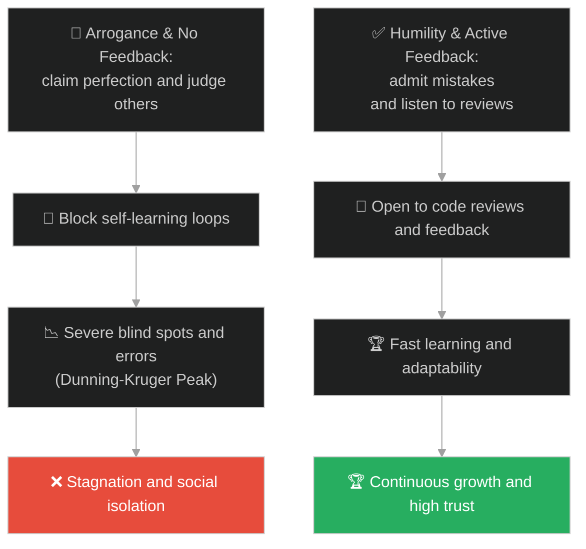
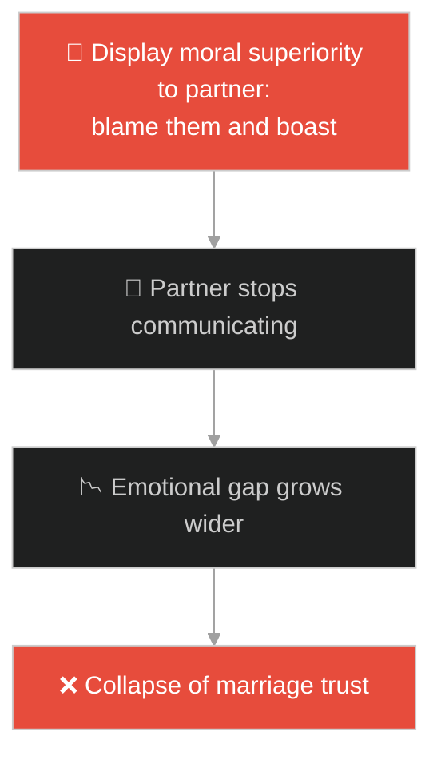
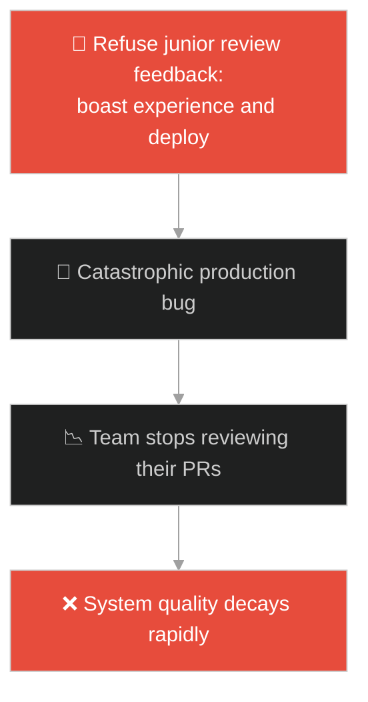
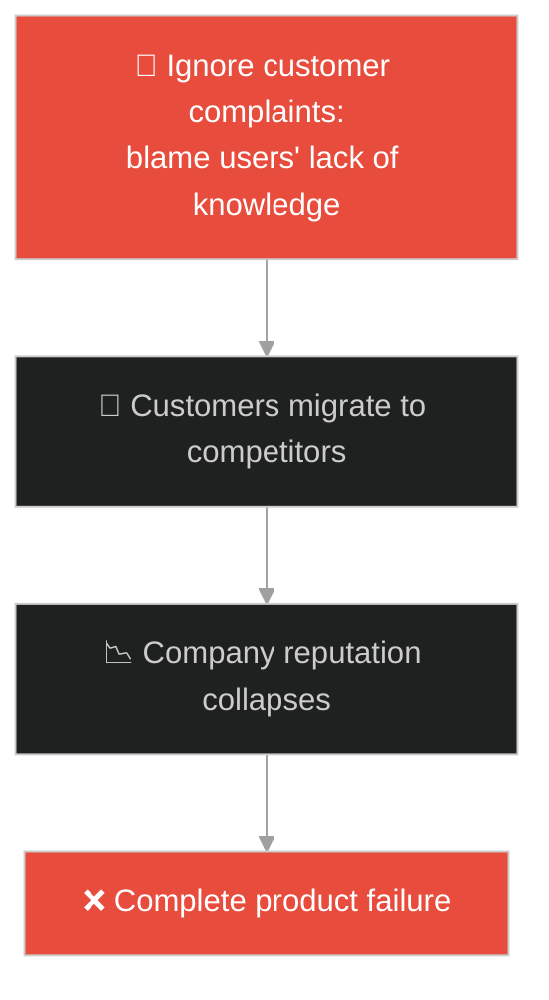
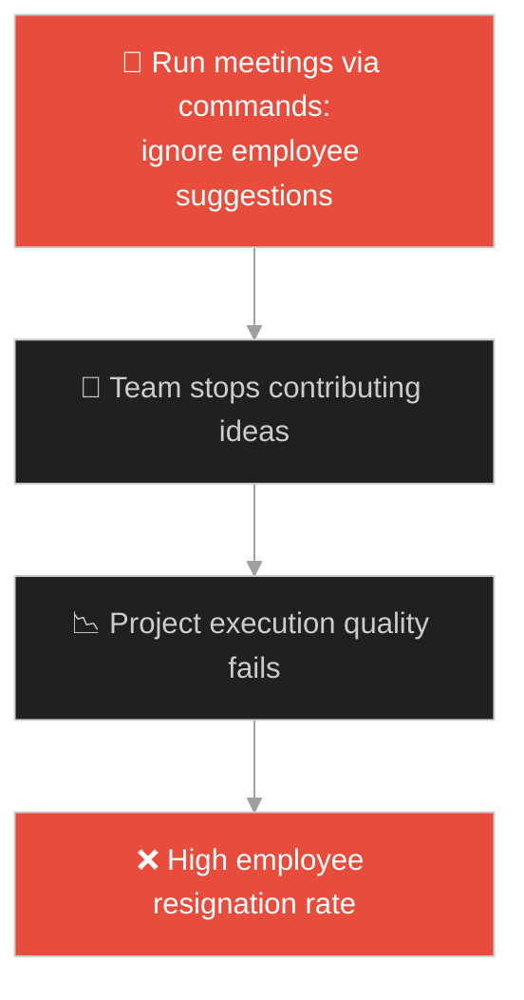
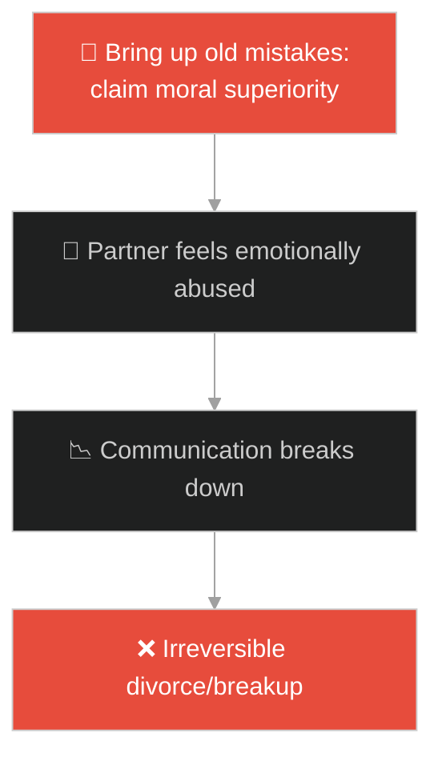
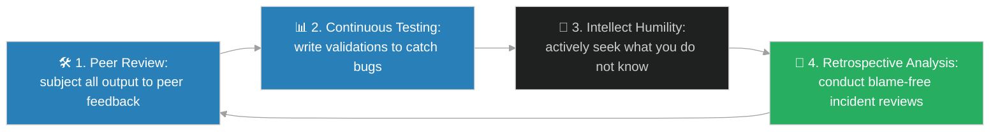

# Arrogance vs Humility & Dunning-Kruger (ភាពក្រអឺតក្រទមធៀបនឹងភាពបន្ទាបខ្លួន និងឥទ្ធិពលដានីង-គ្រូហ្គ័រ)៖ ពួកផារិស៊ី និងអ្នកយកពន្ធ (Arrogance vs Humility & Dunning-Kruger & Jesus and the Pharisee and the Tax Collector)

**Author:** ichamrong  
**Date:** 2026-05-28  
**Tags:** #jesus #humility #dunning-kruger #arrogance #self-awareness #moral-superiority  
**Category:** Concepts / Parables  
**Read Time:** ~15 min  

---

## 📌 មាតិកា (Table of Contents)
- [អន្ទាក់ផ្លូវចិត្ត (The Trap)](#0)
- [១. រឿងព្រេងនិទាន៖ ពួកផារិស៊ី និងអ្នកយកពន្ធ (The Legend of the Pharisee and the Tax Collector)](#1)
  - [ការអធិស្ឋានរបស់បុរសពីរនាក់ និងការវាយតម្លៃលទ្ធផលចុងក្រោយ (The Dual Prayers and the Final Verdict)](#1-1)
- [២. បញ្ហា៖ ភាពលម្អៀងដានីង-គ្រូហ្គ័រ និងការមើលរំលងកំហុសរបស់ខ្លួនឯង (The Issue: Dunning-Kruger Effect and Self-Righteous Assessment)](#2)
- [៣. ឧទាហមណ៍ជាក់ស្តែងក្នុងពិភពពិត (Real World Examples)](#3)
  - [ឧទាហរណ៍ទី ១ — កម្រិតស្រាល (គ្រួសារ)៖ ការបន្ទោសដៃគូឥតឈប់ និងការតាំងខ្លួនជាអ្នកល្អឥតខ្ចោះ (Blaming the Spouse While Displaying Own Virtue)](#3-1)
  - [ឧទាហរណ៍ទី ២ — កម្រិតមធ្យម (បច្ចេកទេស)៖ វិស្វករដែលមិនព្រមទទួលយកមតិស្ថាបនាលើ Pull Request (The Senior Dev Refusing Code Review Feedback)](#3-2)
  - [ឧទាហរណ៍ទី ៣ — កម្រិតមធ្យម (ធុរកិច្ច)៖ ស្ថាបនិកដែលគិតថាផលិតផលរបស់ខ្លួនល្អបំផុតដោយមិនស្តាប់អតិថិជន (The Arrogant Founder Ignoring Customer Feedback)](#3-3)
  - [ឧទាហរណ៍ទី ៤ — កម្រិតមធ្យម (សង្គម/គ្រប់គ្រង)៖ អ្នកដឹកនាំដែលគិតថាខ្លួនដឹងគ្រប់យ៉ាង និងមើលស្រាលសមត្ថភាពក្រុមការងារ (The Know-it-all Manager Ignoring Team Insights)](#3-4)
  - [ឧទាហរណ៍ទី ៥ — កម្រិតធ្ងន់ (ទំនាក់ទំនង)៖ ដៃគូដែលរំលឹកតែពីកំហុសចាស់ៗរបស់ម្ខាងទៀតដើម្បីលើកតម្កើងខ្លួន (Bringing Up Old Mistakes to Establish Moral Dominance)](#3-5)
- [៤. ដំណោះស្រាយទូទៅ៖ ការអនុវត្ត Continuous Feedback និងការបន្ទាបខ្លួនក្នុងការរៀនសូត្រ (The General Solution: Active Feedback Loops and Psychological Humility)](#4)
- [សេចក្តីសន្និដ្ឋាន (Conclusion)](#5)
- [ឯកសារយោង (References)](#6)
- [Related Posts](#7)

---

<a id="0"></a>
## អន្ទាក់ផ្លូវចិត្ត (The Trap)

តើអ្នកធ្លាប់ជួបនរណាម្នាក់ដែលគិតថាខ្លួនឯងពូកែ និងដឹងគ្រប់យ៉ាង តែតាមពិតគ្មានសមត្ថភាពសោះ ហើយតែងតែមើលស្រាលអ្នកដទៃដែរឬទេ? នៅក្នុងការអភិវឌ្ឍសមត្ថភាព និងចិត្តវិទ្យា មនុស្សភាគច្រើនងាយនឹងធ្លាក់ក្នុងអន្ទាក់នៃការវាយតម្លៃខ្លួនឯងខ្ពស់ពេក (Overestimation) នៅពេលពួកគេទើបតែចេះដឹងរឿងរ៉ាវតូចតាចមួយចំនួន។

នៅក្នុងការសិក្សានិងការដឹកនាំ៖
* **យើងងាយនឹងធ្លាក់ក្នុងអន្ទាក់** នៃភាពក្រអឺតក្រទមផ្លូវចិត្ត (Moral and Intellectual Arrogance) ដោយប្រើប្រាស់ចំណេះដឹង ឬសីលធម៌បន្តិចបន្តួចរបស់ខ្លួន ដើម្បីតាំងខ្លួនជា "ចៅក្រម" កាត់ក្តី និងមើលងាយអ្នកដទៃ។
* **យើងមើលរំលង** ភាពទន់ខ្សោយ និងកំហុសឆ្គងផ្ទាល់ខ្លួន ដោយសារតែភ្នែកយើងរវល់តែសម្លឹងមើល និងវាយប្រហារលើចំណុចខ្វះខាតរបស់ភាគីម្ខាងទៀត។

ការជឿជាក់ហួសហេតុលើខ្លួនឯង និងការបដិសេធមិនទទួលយកមតិកែលម្អ ហៅថា **អន្ទាក់អំនួតផារិស៊ី (Pharisaical Arrogance Trap)**។

ដើម្បីយល់ដឹងពីរបៀបកសាងផ្នត់គំនិតបន្ទាបខ្លួន និងការរៀនសូត្រ នេះជាផែនទីបង្ហាញផ្លូវ៖
1. **រឿងព្រេងនិទាន (The Legend)** — រឿងរ៉ាវរបស់ផារិស៊ីដែលអួតពីគុណធម៌ និងអ្នកយកពន្ធដែលបន្ទាបខ្លួនសុំទោសចំពោះកំហុសរបស់ខ្លួន។
2. **បញ្ហា (The Issue)** — ការវិភាគចិត្តវិទ្យា Dunning-Kruger Effect និងគ្រោះថ្នាក់នៃ Self-righteousness ក្នុងក្រុមការងារ។
3. **ឧទាហមណ៍ជាក់ស្តែងក្នុងពិភពពិត (Real World Examples)** — ពិនិត្យមើលបញ្ហានេះក្នុងកម្រិតគ្រួសារ បច្ចេកវិទ្យា ធុរកិច្ច ការគ្រប់គ្រង និងទំនាក់ទំនង។
4. **ដំណោះស្រាយទូទៅ (The General Solution)** — ការអនុវត្តយន្តការ Feedback Loops និងការបន្ទាបខ្លួនក្នុងការអភិវឌ្ឍ (Intellectual Humility)។



---

<a id="1"></a>
## ១. រឿងព្រេងនិទាន៖ ពួកផារិស៊ី និងអ្នកយកពន្ធ (The Legend of the Pharisee and the Tax Collector)

ព្រះយេស៊ូវបានបង្រៀនរឿងប្រៀបប្រដៅមួយ ទៅកាន់អ្នកដែលតាំងខ្លួនឯងជា "មនុស្សសុចរិត (Self-righteous)" ហើយមើលស្រាលអ្នកដទៃ។ ទ្រង់បានលើកឡើងថា មានបុរសពីរនាក់បានឡើងទៅកាន់ព្រះវិហារដើម្បីអធិស្ឋាន៖
* ម្នាក់ជា **ផារិស៊ី (Pharisee)** — ជាក្រុមអ្នកដឹកនាំសាសនាដែលមានឥទ្ធិពល គោរពច្បាប់យ៉ាងតឹងរ៉ឹង និងបង្ហាញខ្លួនជាអ្នកមានសីលធម៌ខ្ពស់បំផុតក្នុងសង្គម។
* ម្នាក់ទៀតជា **អ្នកយកពន្ធ (Tax Collector)** — ជាក្រុមការងារដែលសង្គមសម័យនោះស្អប់ខ្ពើមបំផុត ព្រោះចាត់ទុកថាជាអ្នកកេងប្រវ័ញ្ច និងជាជនក្បត់ជាតិដែលបម្រើអាណាចក្ររ៉ូម។

<a id="1-1"></a>
### ការអធិស្ឋានរបស់បុរសពីរនាក់ និងការវាយតម្លៃលទ្ធផលចុងក្រោយ (The Dual Prayers and the Final Verdict)

នៅក្នុងព្រះវិហារ៖
* **ផារិស៊ី** បានដើរទៅឈរនៅខាងមុខគេ ហើយអធិស្ឋានអួតប្រាប់ព្រះថា៖ *"ឱព្រះអង្គអើយ ទូលបង្គំសូមអរព្រះគុណ ដែលទូលបង្គំមិនមែនជាមនុស្សលោភលន់ អយុត្តិធម៌ ឬល្មោភកាម ដូចមនុស្សដទៃ ហើយពិសេសគឺមិនដូចអាអ្នកយកពន្ធម្នាក់នោះទេ។ ទូលបង្គំតមអាហារពីរដងក្នុងមួយសប្តាហ៍ ហើយថ្វាយដង្វាយមួយភាគដប់នៃទ្រព្យសម្បត្តិជានិច្ច!"* គាត់បានប្រើការអធិស្ឋាន ដើម្បីជាឧបករណ៍បង្ហាញសីលធម៌សិប្បនិម្មិត (Virtue Signaling) របស់ខ្លួន។
* **ចំណែកឯអ្នកយកពន្ធ** បានឈរនៅឆ្ងាយពីគេ មិនទាំងហ៊ានងើបមុខសម្លឹងទៅមើលមេឃឡើយ។ គាត់បានគក់ទ្រូងខ្លួនឯងដោយវិប្បដិសារី និងអធិស្ឋានខ្សឹបៗថា៖ **"ឱព្រះអង្គអើយ សូមអាណិតមេត្តាទូលបង្គំ ដែលជាមនុស្សមានបាបនេះផង!"**

ព្រះយេស៊ូវមានបន្ទូលបញ្ជាក់យ៉ាងច្បាស់ថា៖ *"គឺបុរសអ្នកយកពន្ធនេះហើយ ដែលត្រឡប់ទៅផ្ទះវិញដោយបានទទួលការរាប់ជាសុចរិត (ព្រះទទួលយក) មិនមែនផារិស៊ីនោះឡើយ។ ព្រោះអ្នកណាដែលលើកតម្កើងខ្លួនឯង នឹងត្រូវបន្ទាបចុះ ចំណែកអ្នកណាដែលបន្ទាបខ្លួន នឹងត្រូវលើកតម្កើងឡើងវិញ។"*

---

<a id="2"></a>
## ២. បញ្ហា៖ ភាពលម្អៀងដានីង-គ្រូហ្គ័រ និងការមើលរំលងកំហុសរបស់ខ្លួនឯង (The Issue: Dunning-Kruger Effect and Self-Righteous Assessment)

នៅក្នុងចិត្តវិទ្យា **Dunning-Kruger Effect** គឺជាភាពលម្អៀងនៃការយល់ដឹង ដែលមនុស្សដែលខ្វះសមត្ថភាព មានការជឿជាក់ខ្ពស់ខុសពីការពិត (Mount Stupid) ព្រោះពួកគេមិនមានសមត្ថភាពសូម្បីតែវាស់ស្ទង់ពីភាពល្ងង់ខ្លៅរបស់ខ្លួន។ ផ្ទុយទៅវិញ អ្នកមានចំណេះដឹងពិតប្រាកដ តែងតែមានការបន្ទាបខ្លួន ព្រោះដឹងថានៅមានរឿងរ៉ាវជាច្រើនទៀតដែលពួកគេមិនទាន់ដឹង។

នៅក្នុងការសរសេរកម្មវិធីបច្ចេកវិទ្យា នេះប្រៀបបាននឹងវិស្វករដែលគិតថាខ្លួនឯងល្អឥតខ្ចោះ និងសរសេរកូដគ្មានកំហុស៖

```python
# Bad/Fragile: Arrogant component that assumes its logic is 100% correct and bypasses checks (Dunning-Kruger)
class ArrogantDataValidator:
    def validate(self, data):
        # Bypasses defensive checks, assuming data formats are always perfect because they wrote the schema
        print("Data is 100% correct because I designed the code. No checks needed.")
        # Fails catastrophically if data is missing or null
        return data["username"].strip()

# Good/Resilient: Humble, defensive component that checks its limits, accepts external feedback (Humility)
class HumbleDataValidator:
    def validate(self, data):
        # Acknowledges that inputs can be unpredictable and system state can change
        if not data:
            print("Warning: Input data is null. Gracefully declining validation.")
            return None
        
        try:
            username = data.get("username")
            if not username:
                return None
            return str(username).strip()
        except Exception as e:
            # Active logging and failure containment instead of system crash
            print(f"Defensive containment triggered: {e}")
            return None
```

* **កង្វះការត្រួតពិនិត្យ (No Code Reviews):** វិស្វករដែលក្រអឺតក្រទម តែងតែបដិសេធមិនព្រមឱ្យអ្នកដទៃឆែកកូដ (PR Reviews) ព្រោះគិតថាគ្មាននរណាម្នាក់ពូកែជាងខ្លួនឡើយ។
* **ភាពមិនចេះអភិវឌ្ឍ (Intellectual Stagnation):** ប្រសិនបើមិនបន្ទាបខ្លួនទទួលស្គាល់ថាខ្លួនមិនដឹងទេ វានឹងមិនអាចបើកចិត្តរៀនសូត្របច្ចេកវិទ្យា ឬជំនាញថ្មីៗឡើយ។

---

<a id="3"></a>
## ៣. ឧទាហមណ៍ជាក់ស្តែងក្នុងពិភពពិត

---

<a id="3-1"></a>
### ឧទាហមណ៍ទី ១ — កម្រិតស្រាល (គ្រួសារ)៖ ការបន្ទោសដៃគូឥតឈប់ និងការតាំងខ្លួនជាអ្នកល្អឥតខ្ចោះ (Blaming the Spouse While Displaying Own Virtue)

នៅក្នុងគ្រួសារមួយ ប្តីតែងតែស្តីបន្ទោសប្រពន្ធពីរឿងរៀបចំកិច្ចការផ្ទះមិនបានស្អាត និងគ្រប់គ្រងលុយកាក់មិនល្អ ដោយគាត់តែងតែលើកតម្កើងខ្លួនឯងថាជាអ្នករកលុយ និងមានវិន័យខ្ពស់។ គាត់មិនដែលស្តាប់មតិ ឬជួយសម្រាលការងារប្រពន្ធឡើយ។ ភាពក្រអឺតក្រទមនេះធ្វើឱ្យប្រពន្ធមានអារម្មណ៍បាក់ទឹកចិត្ត និងលែងចង់សន្ទនាជាមួយគាត់។



---

<a id="3-2"></a>
### ឧទាហមណ៍ទី ២ — កម្រិតមធ្យម (បច្ចេកទេស)៖ វិស្វករដែលមិនព្រមទទួលយកមតិស្ថាបនាលើ Pull Request (The Senior Dev Refusing Code Review Feedback)

វិស្វករជាន់ខ្ពស់ (Senior Developer) ម្នាក់ដែលសរសេរកូដយូរឆ្នាំ យល់ថាខ្លួនដឹងគ្រប់យ៉ាង។ នៅពេលសមាជិកក្រុមថ្មីម្នាក់ផ្តល់មតិស្ថាបនា (Feedback) លើកូដរបស់គាត់ថាអាចមាន Bug គាត់បានខឹងសម្បារ និងស្តីបន្ទោសសមាជិកថ្មីនោះភ្លាមៗ។ គាត់បានយល់ព្រមដំឡើងកូដនោះទៅ Production ដោយមិនកែប្រែ ធ្វើឱ្យប្រព័ន្ធទាំងមូលគាំងជាច្រើនម៉ោងនៅយប់នោះ។



---

<a id="3-3"></a>
### ឧទាហមណ៍ទី ៣ — កម្រិតមធ្យម (ធុរកិច្ច)៖ ស្ថាបនិកដែលគិតថាផលិតផលរបស់ខ្លួនល្អបំផុតដោយមិនស្តាប់អតិថិជន (The Arrogant Founder Ignoring Customer Feedback)

ស្ថាបនិកក្រុមហ៊ុនបច្ចេកវិទ្យាម្នាក់ ជឿជាក់យ៉ាងមុតមាំថា ផលិតផលរបស់ខ្លួនមានមុខងារល្អបំផុតលើលោក។ នៅពេលអតិថិជនត្អូញត្អែរថាកម្មវិធីពិបាកប្រើ (Bad UI/UX) គាត់បានស្តីបន្ទោសអតិថិជនថា "ល្ងង់ និងមិនចេះបច្ចេកវិទ្យា"។ ក្នុងរយៈពេល ១ ឆ្នាំ អតិថិជនទាំងអស់បានប្តូរទៅប្រើប្រាស់កម្មវិធីរបស់គូប្រជែងដែលមានភាពសាមញ្ញ និងស្តាប់អតិថិជនជាង។



---

<a id="3-4"></a>
### ឧទាករណ៍ទី ៤ — កម្រិតមធ្យម (សង្គម/គ្រប់គ្រង)៖ អ្នកដឹកនាំដែលគិតថាខ្លួនដឹងគ្រប់យ៉ាង និងមើលស្រាលសមត្ថភាពក្រុមការងារ (The Know-it-all Manager Ignoring Team Insights)

អ្នកគ្រប់គ្រងម្នាក់ចូលចិត្តប្រជុំបង្គាប់បញ្ជាដោយមិនដែលបើកឱកាសឱ្យបុគ្គលិកបញ្ចេញយោបល់ ឬកែតម្រូវគម្រោងឡើយ។ គាត់តែងតែគិតថា បុគ្គលិកថ្នាក់ក្រោមគ្មានចក្ខុវិស័យដូចខ្លួនទេ។ លទ្ធផលគឺ បុគ្គលិកលែងខ្វល់ខ្វាយពីលទ្ធផលការងារ (Passive Resistance) ធ្វើឱ្យគម្រោងទាំងអស់ត្រូវខកខានការប្រគល់ និងជួបបញ្ហាបច្ចេកទេសជាបន្តបន្ទាប់។



---

<a id="3-5"></a>
### ឧទាហរណ៍ទី ៥ — កម្រិតធ្ងន់ (ទំនាក់ទំនង)៖ ដៃគូដែលរំលឹកតែពីកំហុសចាស់ៗរបស់ម្ខាងទៀតដើម្បីលើកតម្កើងខ្លួន (Bringing Up Old Mistakes to Establish Moral Dominance)

នៅក្នុងទំនាក់ទំនងស្នេហា ដៃគូម្នាក់តែងតែលើកយកកំហុសចាស់ដែលធ្លាប់កើតឡើងកាលពី ៣ ឆ្នាំមុនរបស់ភាគីម្ខាងទៀតមកនិយាយជានិច្ច នៅពេលឈ្លោះគ្នា។ ការធ្វើបែបនេះដើម្បីការពារខ្លួន និងបង្កើតអារម្មណ៍ថាខ្លួនមានសីលធម៌ខ្ពស់ជាង (Moral Dominance)។ ភាពក្រអឺតក្រទម និងការមិនព្រមលើកលែងនេះ បំផ្លាញក្តីស្រឡាញ់ និងការយោគយល់គ្នាទាំងស្រុង។



---

<a id="4"></a>
## ៤. ដំណោះស្រាយទូទៅ៖ ការអនុវត្ត Continuous Feedback និងការបន្ទាបខ្លួនក្នុងការរៀនសូត្រ (The General Solution: Active Feedback Loops and Psychological Humility)

ដើម្បីកសាងផ្នត់គំនិតបន្ទាបខ្លួន និងកម្ចាត់ភាពលម្អៀងដានីង-គ្រូហ្គ័រ យើងត្រូវអនុវត្តយន្តការ Feedback៖



1. **ការត្រួតពិនិត្យដោយសមភាគី (Enforce Peer Reviews):** មិនត្រូវអនុញ្ញាតឱ្យមានការងារ ឬកូដណាមួយដំឡើងទៅដោយគ្មានការពិនិត្យពីសមាជិកដទៃឡើយ (សូម្បីតែកូដរបស់នាយកបច្ចេកទេសក៏ដោយ)។
2. **ការទទួលស្គាល់ភាពមិនល្អឥតខ្ចោះ (Embrace Intellectual Humility):** ប្រើប្រាស់ផ្នត់គំនិត *"ខ្ញុំអាចនឹងខុស"*។ នៅពេលមានបញ្ហាកើតឡើង ត្រូវសម្លឹងមើលកំហុសខ្លួនឯងជាមុនសិន មុននឹងស្តីបន្ទោសអ្នកដទៃ។
3. **ការរៀនសូត្រពីកំហុស (Blameless Post-mortems):** បង្កើតវប្បធម៌ប្រជុំកែតម្រូវការងារ (Retrospective) ដែលផ្តោតលើការកែលម្អប្រព័ន្ធ មិនមែនជាការដាក់ទណ្ឌកម្ម ឬស្វែងរកអ្នកខុសដើម្បីជាន់ឈ្លីឡើយ។
4. **ការត្រួតពិនិត្យដោយស្វ័យប្រវត្ត (Automated Validations):** ប្រើប្រាស់ Linting Tools, Compiler, និង Tests ដើម្បីបង្ហាញការពិតនៃគុណភាពការងាររបស់យើង ដោយគ្មានការលម្អៀងខាងអារម្មណ៍។

---

## 🐇 ធ្លាក់ចូលក្នុងរន្ធទន្សាយ (Enter the Rabbit Hole)

ដើម្បីយល់ដឹងពីរបៀបដែលការស្តុកទុកធនធានហួសពីតម្រូវការ និងការរៀបចំផែនការមិនសមស្រប (Storage Provisioning & Garbage Collection) អាចនាំឱ្យប្រព័ន្ធទាំងមូលត្រូវជាប់គាំង និងខូចខាតយ៉ាងដូចម្តេច សូមបន្តដំណើរទៅកាន់៖

* 🚀 **[ចាប់ផ្តើមដំណើររុករក (Start the Journey) ➔ The Parable of the Rich Fool](./186-jesus-and-the-rich-fool.md)**

---

<a id="5"></a>
## សេចក្តីសន្និដ្ឋាន (Conclusion)

> **«អ្នកណាដែលលើកតម្កើងខ្លួនឯងថាជាអ្នកបរិសុទ្ធ នឹងត្រូវបន្ទាបចុះ ចំណែកអ្នកណាដែលបន្ទាបខ្លួនទទួលស្គាល់កំហុស នឹងត្រូវលើកតម្កើងឡើងវិញ»**

ការបន្ទាបខ្លួន និងការបើកចិត្តទទួលយកមតិកែលម្អ មិនមែនជាសញ្ញានៃភាពទន់ខ្សោយនោះទេ តែវាជាគ្រឹះតែមួយគត់ដើម្បីលុបបំបាត់ចំណុចខ្វាក់ (Blind spots) និងនាំមកនូវការលូតលាស់ដ៏ពិតប្រាកដ។

---

<a id="6"></a>
## ឯកសារយោង (References)

* **Luke 18:9–14** — *The Parable of the Pharisee and the Tax Collector*, Holy Bible. The seminal text warning against spiritual and intellectual hubris.
* **Kruger, J., & Dunning, D.** — *Unskilled and Unaware of It: How Difficulties in Recognizing One's Own Incompetence Lead to Inflated Self-Assessments* (1999). Journal of Personality and Social Psychology.

---

<a id="7"></a>
## Related Posts

* [[Equality vs Equity & Time/Materials Contracts](./184-jesus-and-the-workers-in-the-vineyard.md)] — របៀបចាត់ចែងប្រាក់ឈ្នួល និងផលលាភការងារដោយសច្ចធម៌។
* [[Storage Provisioning & Garbage Collection](./186-jesus-and-the-rich-fool.md)] — ការយល់ដឹងពីការគ្រប់គ្រងធនធានបម្រុង និងការសម្អាតកាកសំណល់ដែលលែងប្រើប្រាស់។
