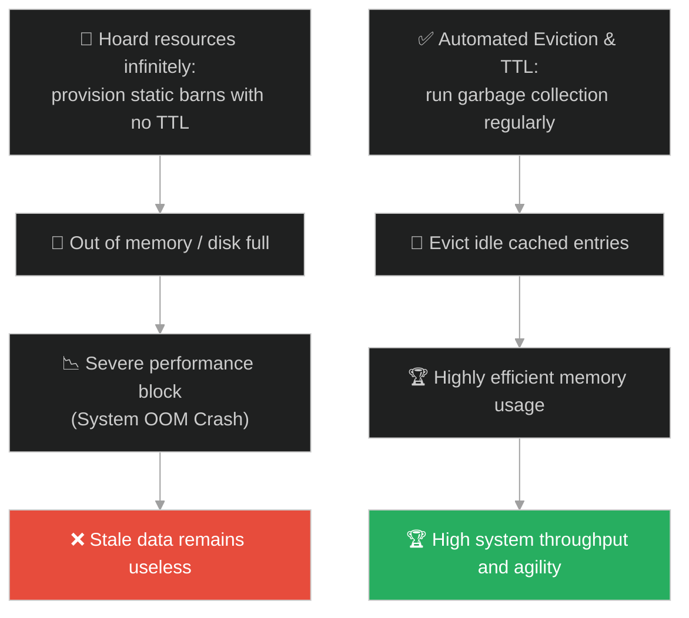
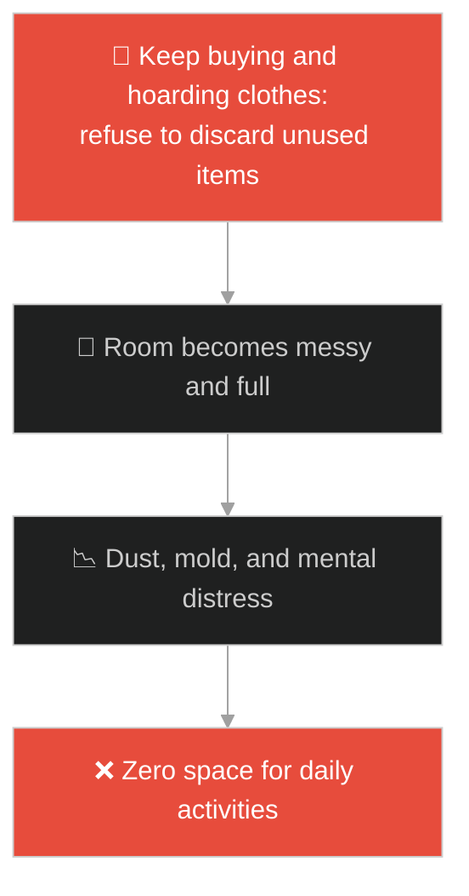
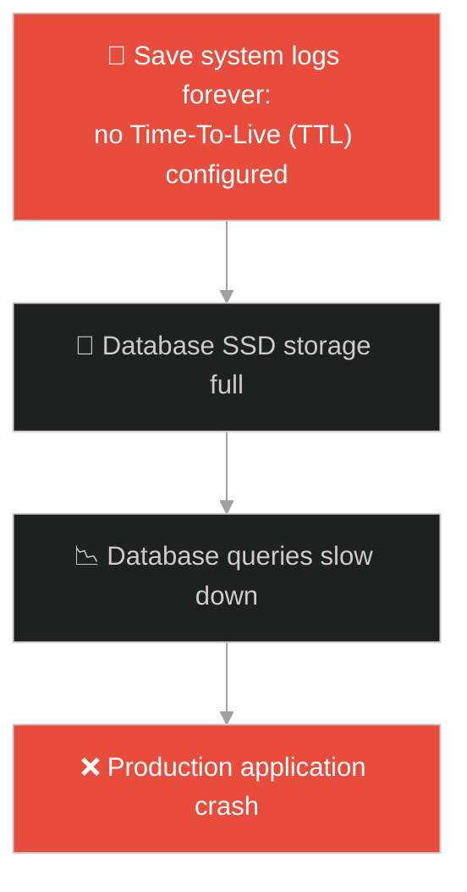
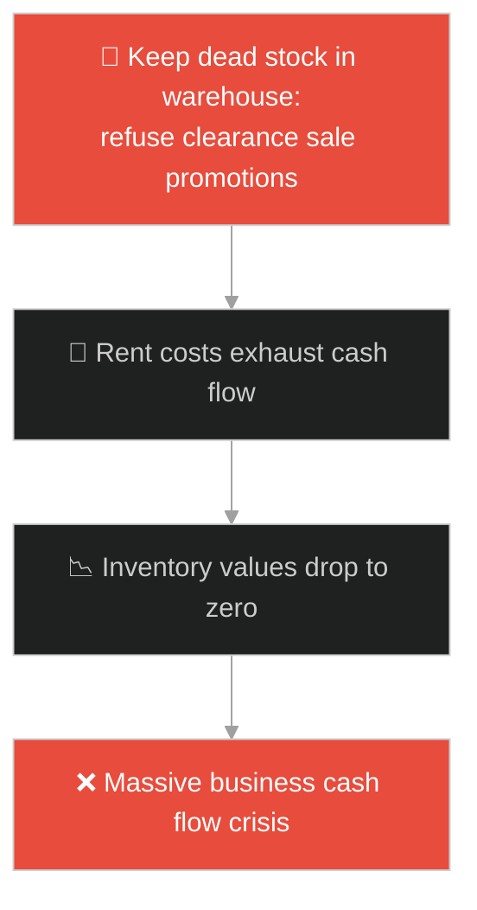
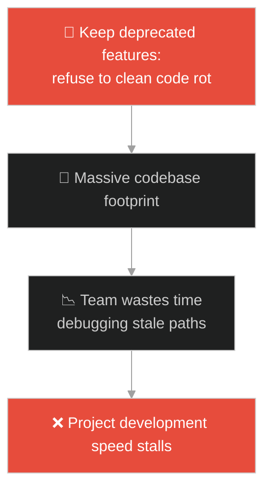
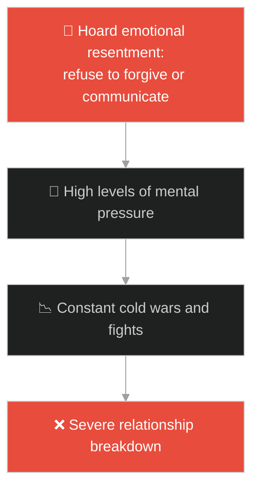
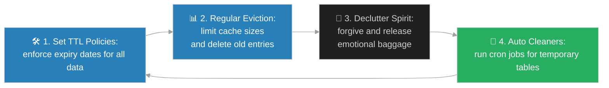

# Storage Provisioning & Garbage Collection (ការបម្រុងទុកទំហំផ្ទុក និងការសម្អាតកាកសំណល់ទិន្នន័យ)៖ សេដ្ឋីល្ងង់ខ្លៅ (Storage Provisioning & Garbage Collection & Jesus and the Rich Fool)

**Author:** ichamrong  
**Date:** 2026-05-28  
**Tags:** #jesus #memory-management #garbage-collection #storage-provisioning #rat-race #clean-up  
**Category:** Concepts / Parables  
**Read Time:** ~15 min  

---

## 📌 មាតិកា (Table of Contents)
- [អន្ទាក់ផ្លូវចិត្ត (The Trap)](#0)
- [១. រឿងព្រេងនិទាន៖ សេដ្ឋី និងជង្រុកស្រូវ (The Legend of the Rich Fool)](#1)
  - [ការរុះរើជង្រុកចាស់ និងសោកនាដកម្មសេចក្តីស្លាប់ជាយថាហេតុ (The New Barns and the Sudden Call for the Soul)](#1-1)
- [២. បញ្ហា៖ ការស្ដុកទុកទិន្នន័យលើសតម្រូវការ និងការភ្លេចសម្អាតកាកសំណល់ (The Issue: Infinite Storage Hoarding and Wasting Garbage Collection)](#2)
- [៣. ឧទាហមណ៍ជាក់ស្តែងក្នុងពិភពពិត (Real World Examples)](#3)
  - [ឧទាហរណ៍ទី ១ — កម្រិតស្រាល (គ្រួសារ)៖ ការទិញឥវ៉ាន់ប្រើប្រាស់គរទុកពេញផ្ទះរហូតគ្មានកន្លែងដើរ (Hoarding Unused Clothes and Electronics in the House)](#3-1)
  - [ឧទាហរណ៍ទី ២ — កម្រិតមធ្យម (បច្ចេកទេស)៖ ការរក្សាទុក Log/Data គ្មានការកំណត់ Expire/TTL (Database Storing Logs Without TTL or Expiry Policies)](#3-2)
  - [ឧទាហរណ៍ទី ៣ — កម្រិតមធ្យម (ធុរកិច្ច)៖ ការជួលឃ្លាំងស្តុកទំនិញឥតប្រយោជន៍ និងការមិនព្រមបញ្ចុះតម្លៃលក់ (Hoarding Dead Stock in Warehouses to Avoid Booking Losses)](#3-3)
  - [ឧទាហរណ៍ទី ៤ — កម្រិតមធ្យម (សង្គម/គ្រប់គ្រង)៖ គម្រោងដែលមិនព្រមបញ្ឈប់មុខងារចាស់ៗលែងប្រើប្រាស់ (Refusing to Deprecate and Clean Legacy System Features)](#3-4)
  - [ឧទាហរណ៍ទី ៥ — កម្រិតធ្ងន់ (ទំនាក់ទំនង)៖ ការរក្សាទុកការឈឺចាប់ និងជម្លោះចាស់ៗក្នុងចិត្តមិនព្រមលែង (Hoarding Emotional Baggage and Resentment From Years Ago)](#3-5)
- [៤. ដំណោះស្រាយទូទៅ៖ ការកំណត់ TTL, Storage Quota, និងយន្តការ Garbage Collection (The General Solution: Enforcing Expiry, TTL, and Active Resource Cleanup)](#4)
- [សេចក្តីសន្និដ្ឋាន (Conclusion)](#5)
- [ឯកសារយោង (References)](#6)
- [Related Posts](#7)

---

<a id="0"></a>
## អន្ទាក់ផ្លូវចិត្ត (The Trap)

តើអ្នកធ្លាប់ជួបបញ្ហាដែលទូរស័ព្ទ ឬកុំព្យូទ័ររបស់អ្នកស្រាប់តែអស់ទំហំផ្ទុក (Storage full) ធ្វើឱ្យដើរយឺតខ្លាំង ដោយសារតែអ្នកមិនព្រមលុបរូបថត ឬឯកសារចាស់ៗដែលលែងប្រើប្រាស់ដែរឬទេ? មនុស្សភាគច្រើនយល់ច្រឡំថា "ការប្រមូល និងរក្សាទុកធនធានឱ្យបានច្រើនឥតកំណត់ គឺជាសេរីភាព និងសុវត្ថិភាព"។ ប៉ុន្តែនៅក្នុងប្រព័ន្ធវិស្វកម្មបច្ចេកវិទ្យា និងការរស់នៅ ការស្តុកទុកធនធានដែលលែងប្រើប្រាស់ដោយគ្មានដែនកំណត់ នឹងបង្កើតជា "ការស្ទះនិងលេចធ្លាយធនធាន (Resource Leak)" ដែលទាញទម្លាក់ដំណើរការទាំងមូល។

នៅក្នុងការគ្រប់គ្រងធនធាន៖
* **យើងងាយនឹងធ្លាក់ក្នុងអន្ទាក់** នៃការប្រមូលផ្តុំ និងក្តោបក្តាប់របស់របរ ព័ត៌មាន ឬទិន្នន័យ (Hoarding / Storage Provisioning) ដោយគ្មានយន្តការសម្អាត ដោយគិតថានឹងយកវាទៅប្រើប្រាស់នៅថ្ងៃណាមួយ។
* **យើងមើលរំលង** យន្តការលុបបំបាត់កាកសំណល់ (Garbage Collection / Release memory) ដែលជាកត្តាសំខាន់បំផុតក្នុងការរក្សាឱ្យប្រព័ន្ធ ឬចិត្តរបស់យើងមានភាពស្រឡះល្អ។

ការស្តុកទុកធនធានលើសចំណុះដោយគ្មានគម្រោងសម្អាតកាកសំណល់ ហៅថា **អន្ទាក់ជង្រុកសេដ្ឋីល្ងង់ (Hoarder Barn Trap)**។

ដើម្បីយល់ដឹងពីរបៀបកំណត់ទំហំផ្ទុក និងការសម្អាតធនធាន នេះជាផែនទីបង្ហាញផ្លូវ៖
1. **រឿងព្រេងនិទាន (The Legend)** — រឿងរ៉ាវរបស់សេដ្ឋីម្នាក់ដែលព្យាយាមសង់ជង្រុកកាន់តែធំដើម្បីស្តុកស្រូវទុក តែត្រូវស្លាប់បាត់បង់ជីវិតនៅយប់នោះ។
2. **បញ្ហា (The Issue)** — ការវិភាគបច្ចេកទេស Storage Provisioning, Memory Leak, និងតួនាទីរបស់ Garbage Collection ក្នុងប្រព័ន្ធ Software។
3. **ឧទាហមណ៍ជាក់ស្តែងក្នុងពិភពពិត (Real World Examples)** — ពិនិត្យមើលបញ្ហានេះក្នុងកម្រិតគ្រួសារ បច្ចេកវិទ្យា ធុរកិច្ច ការគ្រប់គ្រង និងទំនាក់ទំនង។
4. **ដំណោះស្រាយទូទៅ (The General Solution)** — ការអនុវត្តយន្តការ TTL (Time-To-Live), Data Retention Policies, និង Active Resource Cleanup។



---

<a id="1"></a>
## ១. រឿងព្រេងនិទាន៖ សេដ្ឋី និងជង្រុកស្រូវ (The Legend of the Rich Fool)

ព្រះយេស៊ូវបានបង្រៀនឱ្យមនុស្សប្រុងប្រយ័ត្នចំពោះការលោភលន់ និងការគិតតែពីសម្ភារៈនិយម ដោយលើកយករឿងប្រៀបប្រដៅមួយមកសម្តែង៖

មានបុរសសេដ្ឋីម្នាក់ មានដីចម្ការដ៏ធំទូលាយ ដែលទទួលបានផលដំណាំយ៉ាងច្រើនលើសលប់ រហូតដល់គ្មានកន្លែងសម្រាប់ទុកដាក់។ គាត់បានចាប់ផ្តើមព្រួយបារម្ភ និងគិតក្នុងចិត្តថា៖ *"តើខ្ញុំត្រូវធ្វើដូចម្តេចទៅ បើខ្ញុំគ្មានកន្លែងសមរម្យសម្រាប់ទុកដាក់ភោគផលរបស់ខ្ញុំសោះបែបនេះ?"*

ទីបំផុត គាត់បានសម្រេចចិត្តថា៖
* *"ខ្ញុំនឹងរុះរើជង្រុកចាស់ៗរបស់ខ្ញុំចោល រួចសាងសង់ជង្រុកថ្មីដែលមានទំហំធំជាងមុន ដើម្បីប្រមូលស្រូវ និងទ្រព្យសម្បត្តិទាំងអស់របស់ខ្ញុំទុកដាក់ក្នុងនោះ។"*
* *"បន្ទាប់មក ខ្ញុំនឹងប្រាប់ខ្លួនឯងថា៖ ឱខ្លួនខ្ញុំអើយ ឯងមានទ្រព្យសម្បត្តិដ៏ច្រើនសន្ធឹកសន្ធាប់ សម្រាប់ចាយវាយរាប់សិបឆ្នាំទៅមុខទៀតហើយ។ ឥឡូវនេះ ចូលសម្រាក ហូបចុក និងសប្បាយរីករាយចុះ!"*

<a id="1-1"></a>
### ការរុះរើជង្រុកចាស់ និងសោកនាដកម្មសេចក្តីស្លាប់ជាយថាហេតុ (The New Barns and the Sudden Call for the Soul)

ប៉ុន្តែខណៈពេលដែលគាត់កំពុងតែរៀបចំផែនការ និងរីករាយនឹងទ្រព្យសម្បត្តិដែលគរទុកនោះ៖
* ព្រះជាម្ចាស់មានបន្ទូលទៅកាន់គាត់ថា៖ **"ឱមនុស្សល្ងង់អើយ! នៅយប់នេះឯង ព្រលឹងរបស់អ្នកនឹងត្រូវដកយកទៅវិញហើយ។ ចុះតើទ្រព្យសម្បត្តិទាំងឡាយដែលអ្នកបានសន្សំ និងគរទុកនោះ នឹងបានទៅលើនរណា?"**
* ព្រះយេស៊ូវទ្រង់មានបន្ទូលសន្និដ្ឋានថា៖ *"អ្នកណាដែលសន្សំទ្រព្យសម្បត្តិសម្រាប់តែខ្លួនឯង តែគ្មានភាពមានបាននៅចំពោះព្រះ (ខ្វះគុណធម៌ សេចក្តីស្រឡាញ់ និងការចែករំលែក) គឺមានជីវិតបែបនេះឯង។"*

---

<a id="2"></a>
## ២. បញ្ហា៖ ការស្ដុកទុកទិន្នន័យលើសតម្រូវការ និងការភ្លេចសម្អាតកាកសំណល់ (The Issue: Infinite Storage Hoarding and Wasting Garbage Collection)

នៅក្នុងស្ថាបត្យកម្មប្រព័ន្ធកុំព្យូទ័រ ការដែលយើងកក់ទុកទំហំផ្ទុកច្រើនពេក (Over-provisioning) ឬការសរសេរកម្មវិធីរក្សាទុកទិន្នន័យក្នុង Memory (RAM) ដោយគ្មានយន្តការលុបចោល (No Garbage Collection) នឹងបង្កើតជា **Memory Leak**។ មិនយូរប៉ុន្មាន ម៉ាស៊ីន Server នឹងធ្លាក់ចូលទៅក្នុងស្ថានភាពអស់ Memory (OOM - Out of Memory) ហើយគាំងដំណើរការទាំងស្រុង។

```python
# Bad/Fragile: Hoarding memory/objects infinitely without release or TTL, leading to OOM (Rich Fool Barns)
class InfiniteDataHoarder:
    def __init__(self):
        # Static list acting as a memory sink (barn) that grows forever
        self.barn = []
        
    def store_harvest(self, crop_data):
        # Wasting memory with no eviction policies or expiry
        self.barn.append(crop_data)
        print(f"Data accumulated: {len(self.barn)} units. No cleanup scheduled.")

# Good/Resilient: Implementing TTL and active garbage collection/eviction (Prudent Resource Management)
import time

class CleanCacheStorage:
    def __init__(self, ttl_seconds=5):
        self.storage = {}
        self.ttl = ttl_seconds
        
    def store_item(self, key, value):
        # Save key with current timestamp metadata
        self.storage[key] = {
            "value": value,
            "timestamp": time.time()
        }
        
    def retrieve_item(self, key):
        # Perform garbage collection before reading to ensure data freshness
        self.run_garbage_collector()
        if key in self.storage:
            return self.storage[key]["value"]
        return None
        
    def run_garbage_collector(self):
        current_time = time.time()
        # Active eviction logic (Garbage Collection)
        expired_keys = [
            k for k, v in self.storage.items()
            if current_time - v["timestamp"] > self.ttl
        ]
        for key in expired_keys:
            print(f"Garbage Collection: Evicting expired/stale key '{key}' from memory.")
            del self.storage[key]
```

* **ការលេចធ្លាយមេម៉ូរី (Memory Leaks):** កូដដែលបង្កើត Object ថ្មីៗរាល់វិនាទី តែមិនដែលលុបចោល បង្ខំឱ្យប្រព័ន្ធត្រូវចំណាយថ្លៃម៉ាស៊ីនថែមទៀត ទាំងដែលទិន្នន័យចាស់ៗលែងត្រូវការប្រើ។
* **ថ្លៃដើមខ្ពស់ (High Cost Overhead):** ការទិញ Hard Disk បន្ថែមរហូតដោយគ្មានគោលការណ៍លុបចោលទិន្នន័យចាស់ៗ (Retention Policies) ធ្វើឱ្យក្រុមហ៊ុនខាតបង់ថវិកាយ៉ាងច្រើន។

---

<a id="3"></a>
## ៣. ឧទាហមណ៍ជាក់ស្តែងក្នុងពិភពពិត

---

<a id="3-1"></a>
### ឧទាហមណ៍ទី ១ — កម្រិតស្រាល (គ្រួសារ)៖ ការទិញឥវ៉ាន់ប្រើប្រាស់គរទុកពេញផ្ទះរហូតគ្មានកន្លែងដើរ (Hoarding Unused Clothes and Electronics in the House)

សមាជិកគ្រួសារម្នាក់ ចូលចិត្តទិញសម្លៀកបំពាក់ ស្បែកជើង និងឧបករណ៍អេឡិចត្រូនិកចាស់ៗមកគរទុកពេញបន្ទប់។ គាត់គិតថាថ្ងៃណាមួយនឹងត្រូវប្រើវា តែការពិតគឺពួកគេគរទុកចោលរាប់ឆ្នាំរហូតដល់ឡើងធូលី ដី ហើរពណ៌ និងគ្មានកន្លែងដើរក្នុងផ្ទះ។ ផ្ទះមានភាពចង្អៀតណែន និងស្មុគស្មាញផ្លូវចិត្ត ព្រោះខ្វះការលុបចោលរបស់របរដែលលែងប្រើ (Garbage Collection)។



---

<a id="3-2"></a>
### ឧទាហមណ៍ទី ២ — កម្រិតមធ្យម (បច្ចេកទេស)៖ ការរក្សាទុក Log/Data គ្មានការកំណត់ Expire/TTL (Database Storing Logs Without TTL or Expiry Policies)

គេហទំព័រមួយ បង្កើតប្រព័ន្ធរក្សាទុក Log របស់ User ចូលទៅក្នុង Database។ វិស្វករមិនបានកំណត់គោលការណ៍លុបទិន្នន័យចាស់ (No TTL) ឡើយ។ ក្រោយដំណើរការបាន ៦ ខែ Database មានទំហំធំដល់ទៅ ៥ Terabytes ធ្វើឱ្យរាល់សំណួរស្វែងរក (Queries) មានភាពយឺតយ៉ាវខ្លាំង និងត្រូវចំណាយលុយរាប់ពាន់ដុល្លារលើ SSD Storage។



---

<a id="3-3"></a>
### ឧទាហមណ៍ទី ៣ — កម្រិតមធ្យម (ធុរកិច្ច)៖ ការជួលឃ្លាំងស្តុកទំនិញឥតប្រយោជន៍ និងការមិនព្រមបញ្ចុះតម្លៃលក់ (Hoarding Dead Stock in Warehouses to Avoid Booking Losses)

ក្រុមហ៊ុនលក់គ្រឿងសង្ហារឹមមួយ ស្តុកទុកទំនិញដែលលក់លែងដាច់ (Dead Stock) នៅក្នុងឃ្លាំងជួលដ៏ធំមួយ។ នាយកផ្នែកលក់មិនព្រមលក់បញ្ចុះតម្លៃ (Clearance Sale) ឡើយ ព្រោះខ្លាចខាតបង់ប្រាក់ចំណេញក្នុងបញ្ជីគណនេយ្យ។ ជាលទ្ធផល ក្រុមហ៊ុនត្រូវបង់ថ្លៃជួលឃ្លាំងខ្ពស់រៀងរាល់ខែ រហូតដល់ថ្លៃជួលឃ្លាំងនោះលើសពីតម្លៃរបស់ទំនិញទៅទៀត។



---

<a id="3-4"></a>
### ឧទាហមណ៍ទី ៤ — កម្រិតមធ្យម (សង្គម/គ្រប់គ្រង)៖ គម្រោងដែលមិនព្រមបញ្ឈប់មុខងារចាស់ៗលែងប្រើប្រាស់ (Refusing to Deprecate and Clean Legacy System Features)

អ្នកគ្រប់គ្រងគម្រោង Software ម្នាក់មិនព្រមលុបមុខងារចាស់ៗដែលលែងមានអ្នកប្រើប្រាស់ (Legacy Features) ចោលឡើយ ព្រោះបារម្ភថាខ្លាចមានបញ្ហាចៃដន្យ។ លទ្ធផលគឺ កូដរបស់កម្មវិធីមានទំហំធំ និងស្មុគស្មាញខ្លាំង (Code bloat)។ បុគ្គលិកថ្មីៗចំណាយពេលរាប់សប្តាហ៍ដើម្បីសិក្សាកូដចាស់ៗដែលឥតប្រយោជន៍ ធ្វើឱ្យផលិតភាពការងារយឺតយ៉ាវ។



---

<a id="3-5"></a>
### ឧទាហមណ៍ទី ៥ — កម្រិតធ្ងន់ (ទំនាក់ទំនង)៖ ការរក្សាទុកការឈឺចាប់ និងជម្លោះចាស់ៗក្នុងចិត្តមិនព្រមលែង (Hoarding Emotional Baggage and Resentment From Years Ago)

នៅក្នុងទំនាក់ទំនងស្នេហា ដៃគូម្នាក់ឧស្សាហ៍រក្សាទុកទុក្ខព្រួយ ការឈឺចាប់ និងកំហុសឆ្គងតូចតាចរបស់ដៃគូមកគរទុកក្នុងចិត្ត ដោយមិនព្រមជជែកដោះស្រាយ ឬអភ័យទោសលុបចោលឡើយ។ យូរៗទៅ គំនរអារម្មណ៍អវិជ្ជមាននេះមានទំហំធំពេក ធ្វើឱ្យទំនាក់ទំនងនោះលែងមានភាពរីករាយ និងបែកបាក់គ្នាភ្លាមៗនៅពេលមានបញ្ហាបន្តិចបន្តួច។



---

<a id="4"></a>
## ៤. ដំណោះស្រាយទូទៅ៖ ការកំណត់ TTL, Storage Quota, និងយន្តការ Garbage Collection (The General Solution: Enforcing Expiry, TTL, and Active Resource Cleanup)

ដើម្បីការពារវិបត្តិអស់ទំហំផ្ទុក និងការកកស្ទះធនធាន យើងត្រូវអនុវត្តវិធានការសម្អាត៖



1. **ការអនុវត្តគោលការណ៍កំណត់អាយុទិន្នន័យ (Enforce TTL / Expiry Policies):** គ្រប់ទិន្នន័យបណ្តោះអាសន្ន (Sessions, Caches, Logs) ត្រូវតែកំណត់ពេលវេលាផុតកំណត់ច្បាស់លាស់ ដើម្បីឱ្យប្រព័ន្ធអាចលុបវាចោលដោយស្វ័យប្រវត្ត។
2. **ការរចនាប្រព័ន្ធកំណត់ទំហំអតិបរមា (Set Storage Quotas / Eviction):** កំណត់ទំហំផ្ទុកឱ្យមានដែនកំណត់ និងប្រើប្រាស់គោលការណ៍ដូចជា LRU (Least Recently Used) ដើម្បីបណ្តេញទិន្នន័យចាស់ៗចេញ នៅពេលផ្ទុកពេញ។
3. **ការបោសសម្អាតកូដ និងមុខងារចាស់ៗ (Code Refactoring & Deprecation):** បង្កើតវប្បធម៌លុបកូដលែងប្រើប្រាស់ (Dead Code Elimination) ឱ្យបានទៀងទាត់ ដើម្បីឱ្យប្រព័ន្ធមានភាពរហ័សរហួន។
4. **ការដោះលែង និងការរស់នៅបច្ចុប្បន្នកាល (Emotional Decluttering):** រៀនអត់ឱន មិនបារម្ភពីអនាគតហួសហេតុ និងដោះលែងការគុំកួនចាស់ៗ ដើម្បីឱ្យផ្លូវចិត្តទទួលបានសេរីភាព និងកម្លាំងថ្មី។

---

## 🐇 ធ្លាក់ចូលក្នុងរន្ធទន្សាយ (Enter the Rabbit Hole)

ដើម្បីយល់ដឹងពីរបៀបស្វែងរកសមត្ថភាពពិត និងតម្លៃលាក់កំបាំងដែលមិនទាន់បានប្រើប្រាស់ (Core Competence & Dormant Value Optimization) ដើម្បីបង្កើតឧត្តមភាពការងារ សូមបន្តដំណើរទៅកាន់៖

* 🚀 **[ចាប់ផ្តើមដំណើររុករក (Start the Journey) ➔ The Parable of the Hidden Treasure](./187-jesus-and-the-hidden-treasure.md)**

---

<a id="5"></a>
## សេចក្តីសន្និដ្ឋាន (Conclusion)

> **«ជីវិតរបស់មនុស្សមិនស្ថិតនៅលើភាពសំបូរបែបនៃទ្រព្យសម្បត្តិដែលគេសន្សំទុកនោះឡើយ តែស្ថិតនៅលើតម្លៃដែលគេបានបង្កើត និងការដោះលែងរបស់ដែលលែងត្រូវការចេញពីជីវិត»**

ការបង្កើតជង្រុកធំជាងមុន មិនមែនជាដំណោះស្រាយចំពោះកំណើននោះទេ តែការចេះគ្រប់គ្រងទំហំផ្ទុក និងការសម្អាតកាកសំណល់ (Garbage Collection) ទៅវិញទេ ដែលជាគន្លឹះរក្សាឱ្យប្រព័ន្ធ និងជីវិតរត់ទៅមុខដោយរលូន និងមានសុភមង្គល។

---

<a id="6"></a>
## ឯកសារយោង (References)

* **Luke 12:13–21** — *The Parable of the Rich Fool*, Holy Bible. The classic warning against material hoarding and spiritual poverty.
* **Jones, R., Lins, A., & Blackburn, K.** — *Garbage Collection: Algorithms for Automatic Dynamic Memory Management* (1996). John Wiley & Sons.

---

<a id="7"></a>
## Related Posts

* [[Arrogance vs Humility & Dunning-Kruger](./185-jesus-and-the-pharisee-and-tax-collector.md)] — របៀបបន្ទាបខ្លួនក្នុងការរៀនសូត្រដើម្បីចៀសវាងភាពល្ងង់ខ្លៅ។
* [[Core Competence & Dormant Value Optimization](./187-jesus-and-the-hidden-treasure.md)] — ការរុករកកំណប់ទ្រព្យលាក់កំបាំង និងការបង្កើនតម្លៃស្នូល។
