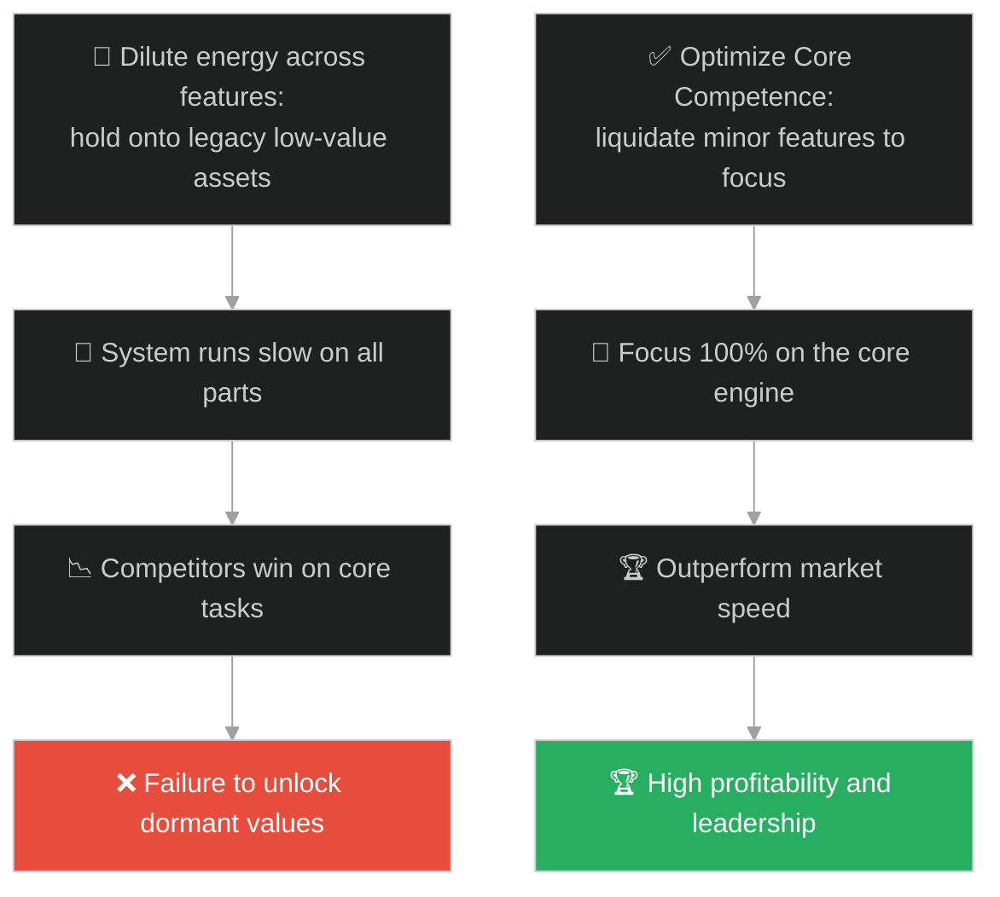
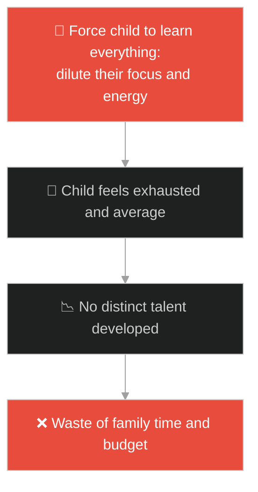
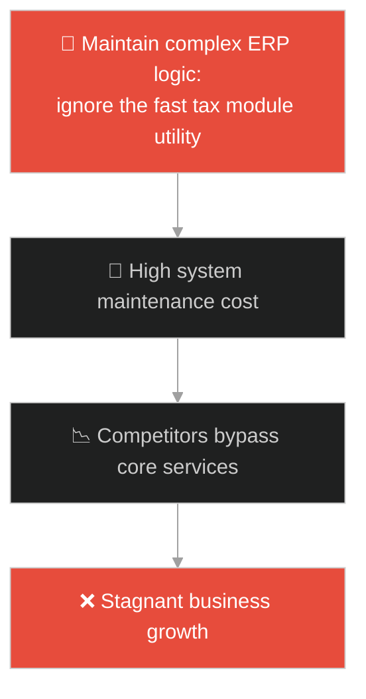
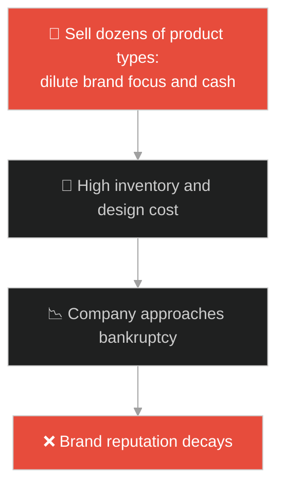
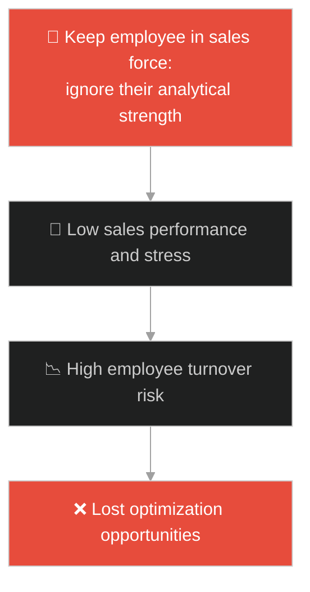
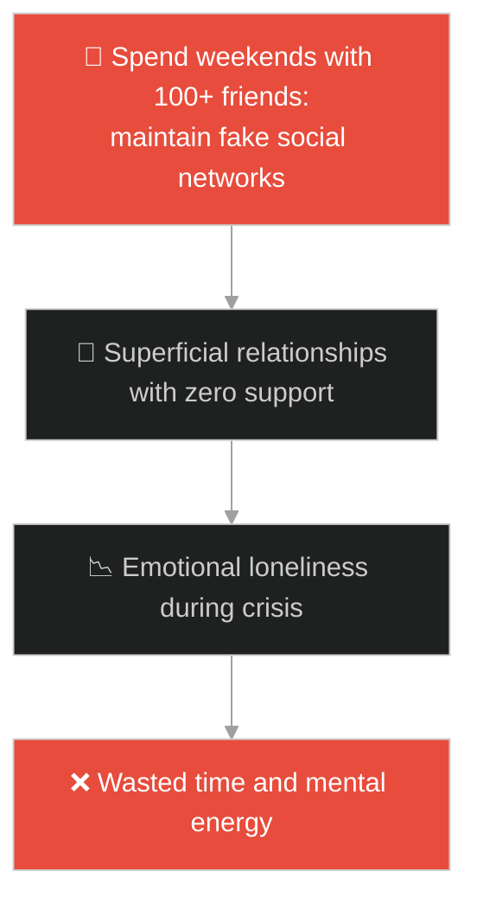
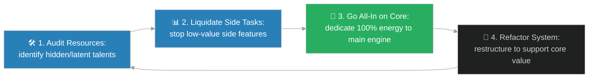

# Core Competence & Dormant Value Optimization (សមត្ថភាពស្នូល និងការបង្កើនតម្លៃលាក់កំបាំង)៖ កំណប់ទ្រព្យលាក់កំបាំង (Core Competence & Dormant Value Optimization & Jesus and the Hidden Treasure)

**Author:** ichamrong  
**Date:** 2026-05-28  
**Tags:** #jesus #core-competence #opportunity-cost #efficiency #refactoring #value-optimization  
**Category:** Concepts / Parables  
**Read Time:** ~15 min  

---

## 📌 មាតិកា (Table of Contents)
- [អន្ទាក់ផ្លូវចិត្ត (The Trap)](#0)
- [១. រឿងព្រេងនិទាន៖ កំណប់ក្នុងចម្ការ (The Legend of the Hidden Treasure)](#1)
  - [ការលក់ទ្រព្យសម្បត្តិទាំងអស់ដើម្បីទិញដីចម្ការ (Selling All Possessions to Secure the Field)](#1-1)
- [២. បញ្ហា៖ ការលាក់កំបាំងនូវតម្លៃស្នូល និងការមិនហ៊ានផ្តោតលើចំណុចខ្លាំង (The Issue: Hiding Core Competence and Failing to Evacuate Dormant Assets)](#2)
- [៣. ឧទាហមណ៍ជាក់ស្តែងក្នុងពិភពពិត (Real World Examples)](#3)
  - [ឧទាហរណ៍ទី ១ — កម្រិតស្រាល (គ្រួសារ)៖ ការស្វែងរកនិងជំរុញទេពកោសល្យលាក់កំបាំងរបស់កូន (Uncovering and Investing in a Child's Hidden Talent)](#3-1)
  - [ឧទាហរណ៍ទី ២ — កម្រិតមធ្យម (បច្ចេកទេស)៖ ការកសាងឡើងវិញនូវម៉ូឌុលស្នូលដែលជាចំណុចខ្លាំងរបស់ប្រព័ន្ធ (Optimizing a Hidden Core Utility in a Massive Codebase)](#3-2)
  - [ឧទាហរណ៍ទី ៣ — កម្រិតមធ្យម (ធុរកិច្ច)៖ ការបោះបង់ផលិតផលរាយរងដើម្បីផ្តោតលើផលិតផលស្នូលដែលលក់ដាច់បំផុត (Selling Side Businesses to Fund the Core Product)](#3-3)
  - [ឧទាហរណ៍ទី ៤ — កម្រិតមធ្យម (សង្គម/គ្រប់គ្រង)៖ ការចាត់ចែងបុគ្គលិកឱ្យចំជំនាញដែលលាក់កំបាំងរបស់ពួកគេ (Redeploying Employees to Unlocking Their Latent Talents)](#3-4)
  - [ឧទាហរណ៍ទី ៥ — កម្រិតធ្ងន់ (ទំនាក់ទំនង)៖ ការលះបង់មិត្តភាពរាយរងដែលឥតប្រយោជន៍ដើម្បីរក្សាមិត្តភាពដ៏ពិតប្រាកដ (Sacrificing Shallow Social Circles for Deep Life Friendships)](#3-5)
- [៤. ដំណោះស្រាយទូទៅ៖ ការកំណត់ Core Competency និងយុទ្ធសាស្ត្រ Diversification Evacuation (The General Solution: Focusing Core Assets and Liquidating Side Liabilities)](#4)
- [សេចក្តីសន្និដ្ឋាន (Conclusion)](#5)
- [ឯកសារយោង (References)](#6)
- [Related Posts](#7)

---

<a id="0"></a>
## អន្ទាក់ផ្លូវចិត្ត (The Trap)

តើអ្នកធ្លាប់ឃើញស្ថាប័ន ឬក្រុមហ៊ុនមួយដែលខំប្រឹងធ្វើកិច្ចការរាប់រយយ៉ាងដើម្បីរស់ ប៉ុន្តែលទ្ធផលមិនសូវល្អសោះ ដោយសារតែពួកគេមិនបានដឹងពី "ទេពកោសល្យ ឬសមត្ថភាពស្នូល (Core Competence)" ពិតប្រាកដរបស់ខ្លួនដែរឬទេ? នៅក្នុងការគ្រប់គ្រង និងការអភិវឌ្ឍ មនុស្សភាគច្រើនចែកចាយកម្លាំង និងពេលវេលាទៅលើរឿងរ៉ាវតូចតាចជាច្រើន ដោយមិនហ៊ានបោះបង់របស់ទាំងនោះ ដើម្បីផ្តោតលើឱកាសមាសតែមួយ។

នៅក្នុងយុទ្ធសាស្ត្រ និងស្ថាបត្យកម្មប្រព័ន្ធ៖
* **យើងងាយនឹងធ្លាក់ក្នុងអន្ទាក់** នៃការរក្សាទុក និងអភិវឌ្ឍសមត្ថភាព ឬផលិតផលធម្មតាៗ (Generalist Trap) ព្រោះមិនចង់បោះបង់ ឬខាតបង់អ្វីមួយ ទោះបីជាដឹងថាវាមិនអាចនាំមកនូវឧត្តមភាពប្រកួតប្រជែងក៏ដោយ។
* **យើងមើលរំលង** "កំណប់លាក់កំបាំង" (Dormant Value) ដែលជាចំណុចខ្លាំងពិតប្រាកដ ដែលប្រសិនបើយើងបណ្តាក់ទុន ១០០% លើវា វានឹងបង្កើតតម្លៃលើសលប់ជាងមុខងារដទៃទាំងអស់បូកបញ្ចូលគ្នា។

ការមិនហ៊ានលុបចោលមុខងារតូចតាចដើម្បីផ្តោតលើតម្លៃស្នូល ហៅថា **អន្ទាក់បំបែកកម្លាំង (Diluted Energy Trap)**។

ដើម្បីយល់ដឹងពីរបៀបកំណត់សមត្ថភាពស្នូល និងបង្កើនតម្លៃលាក់កំបាំង នេះជាផែនទីបង្ហាញផ្លូវ៖
1. **រឿងព្រេងនិទាន (The Legend)** — រឿងរ៉ាវរបស់បុរសម្នាក់ដែលលក់ទ្រព្យសម្បត្តិទាំងអស់ដើម្បីទិញដីចម្ការមួយកន្លែងដែលមានកំណប់លាក់ទុក។
2. **បញ្ហា (The Issue)** — ការវិភាគយុទ្ធសាស្ត្រ Core Competency, Code refactoring, និងការរំលាយចោលនូវ features ដែលគ្មានប្រយោជន៍។
3. **ឧទាហមណ៍ជាក់ស្តែងក្នុងពិភពពិត (Real World Examples)** — ពិនិត្យមើលបញ្ហានេះក្នុងកម្រិតគ្រួសារ បច្ចេកវិទ្យា ធុរកិច្ច ការគ្រប់គ្រង និងទំនាក់ទំនង។
4. **ដំណោះស្រាយទូទៅ (The General Solution)** — ការអនុវត្តយុទ្ធសាស្ត្រ Focusing Core Assets និង Liquidating Side Liabilities។



---

<a id="1"></a>
## ១. រឿងព្រេងនិទាន៖ កំណប់ក្នុងចម្ការ (The Legend of the Hidden Treasure)

ព្រះយេស៊ូវបានបង្រៀនពីតម្លៃដ៏មហាសាលនៃការរកឃើញ "នគរស្ថានសួគ៌" ឬការរកឃើញសេចក្តីពិតពិតប្រាកដនៃជីវិត តាមរយៈរឿងខ្លីមួយ៖

*"នគរស្ថានសួគ៌ ប្រៀបដូចជាកំណប់មួយ ដែលគេលាក់ទុកនៅក្នុងចម្ការ។"*

ថ្ងៃមួយ មានបុរសម្នាក់បានដើរកាត់ ហើយចៃដន្យបានរកឃើញកំណប់នោះលាក់នៅក្រោមដី។ 
* ដោយសារតែដីចម្ការនោះមិនមែនជារបស់គាត់ គាត់មិនអាចជីកយកកំណប់នោះចេញមកដោយបើកចំហបានទេ ព្រោះវានឹងខុសច្បាប់ ហើយម្ចាស់ដីនឹងដកហូតយកទាំងអស់។
* ដូច្នេះ គាត់ក៏សម្រេចចិត្តលាក់កំណប់នោះទុកនៅកន្លែងដើមវិញដោយស្ងាត់កំបាំងបំផុត។

<a id="1-1"></a>
### ការលក់ទ្រព្យសម្បត្តិទាំងអស់ដើម្បីទិញដីចម្ការ (Selling All Possessions to Secure the Field)

បុរសនោះមានសេចក្តីរីករាយ និងរំភើបយ៉ាងខ្លាំង៖
* គាត់បានរត់ត្រឡប់ទៅផ្ទះវិញយ៉ាងលឿន រួច **"លក់អ្វីៗទាំងអស់ដែលគាត់មាន"** ដើម្បីប្រមូលប្រាក់ទាំងអស់ដែលគាត់អាចរកបាន។
* គាត់បានយកប្រាក់ទាំងអស់នោះទៅទិញដីចម្ការនោះពីម្ចាស់ដើម។
* មនុស្សជុំវិញខ្លួនប្រហែលជាគិតថាគាត់ជាមនុស្សឆ្កួត ដែលសុខចិត្តលក់ផ្ទះសម្បែង ទ្រព្យសម្បត្តិ និងរបស់របរមានតម្លៃទាំងអស់ ដើម្បីទៅទិញដីចម្ការទទេ និងស្ងាត់ជ្រងំមួយកន្លែង។ ប៉ុន្តែបុរសនោះដឹងយ៉ាងច្បាស់ថា កំណប់លាក់កំបាំងនៅក្រោមដីនោះ មានតម្លៃច្រើនជាងទ្រព្យសម្បត្តិទាំងអស់ដែលគាត់បានលក់ចោលរាប់ពាន់ដង។

---

<a id="2"></a>
## ២. បញ្ហា៖ ការលាក់កំបាំងនូវតម្លៃស្នូល និងការមិនហ៊ានផ្តោតលើចំណុចខ្លាំង (The Issue: Hiding Core Competence and Failing to Evacuate Dormant Assets)

នៅក្នុងការគ្រប់គ្រងបច្ចេកវិទ្យា និងការអភិវឌ្ឍ Software ក្រុមហ៊ុនជាច្រើនចែកចាយធនធានបច្ចេកទេសរបស់ខ្លួនទៅលើមុខងារតូចតាចរាប់រយ (Features) ដោយមិនបានបង្កើនប្រសិទ្ធភាពនៃម៉ូឌុលស្នូល (Core Module) ដែលជាប្រភពបង្កើតគុណតម្លៃពិតប្រាកដរបស់ក្រុមហ៊ុនឡើយ។

```python
# Bad/Fragile: Diluting resources across generic, unused features (Missing the hidden treasure)
class DilutedApplication:
    def __init__(self):
        self.features = ["weather_widget", "chat_emoji", "core_analytics_engine", "news_feed", "avatar_customizer"]
        
    def allocate_resources(self):
        # Splitting processing power evenly, starving the core engine
        allocation = {}
        for feature in self.features:
            allocation[feature] = 100.0 / len(self.features)
        return allocation

# Good/Resilient: Going all-in on Core Competence (Unlocking dormant value by deprecating side assets)
class CoreOptimizedApplication:
    def __init__(self):
        # Deprecated and removed low-value side features to focus completely on the hidden treasure
        self.core_competence = "core_analytics_engine"
        
    def allocate_resources(self):
        # 100% focus and optimization on core engine
        return {
            self.core_competence: 100.0
        }
```

* **ការបាត់បង់ការផ្តោតអារម្មណ៍ (Diluted Development):** ការចំណាយពេលអភិវឌ្ឍន៍មុខងារដែលគូប្រជែងធ្វើបានល្អជាង (ដូចជា ប្រព័ន្ធ Chat) ជំនួសឱ្យការកែលម្អប្រព័ន្ធស្នូលរបស់ខ្លួន (Core Algorithm)។
* **តម្លៃលាក់កំបាំងដែលលែងដំណើរការ (Dormant Value):** ធនធានទិន្នន័យ (Data assets) ឬបច្ចេកវិទ្យាដែលមានស្រាប់ តែមិនត្រូវបានយកមកអភិវឌ្ឍ ដើម្បីបង្កើតជាប្រភពចំណូលថ្មី។

---

<a id="3"></a>
## ៣. ឧទាហមណ៍ជាក់ស្តែងក្នុងពិភពពិត

---

<a id="3-1"></a>
### ឧទាហមណ៍ទី ១ — កម្រិតស្រាល (គ្រួសារ)៖ ការស្វែងរកនិងជំរុញទេពកោសល្យលាក់កំបាំងរបស់កូន (Uncovering and Investing in a Child's Hidden Talent)

ឪពុកម្តាយម្នាក់ បង្ខំឱ្យកូនរៀនគ្រប់មុខវិជ្ជា (គណិត វិទ្យាសាស្ត្រ ភាសា តន្ត្រី គំនូរ កីឡា) ដើម្បីឱ្យកូនពូកែគ្រប់យ៉ាង។ កូនមានអារម្មណ៍ហត់នឿយ និងមិនលេចធ្លោលើមុខវិជ្ជាណាមួយឡើយ។ ថ្ងៃមួយ ពួកគេសង្កេតឃើញកូនមានសមត្ថភាពពិសេសផ្នែកគូររូបតុក្កតា (Hidden Treasure)។ ពួកគេសម្រេចចិត្តឈប់ឱ្យកូនរៀនគួររញ៉េរញ៉ៃ រួចបង្វែរថវិកា និងពេលវេលាទាំងអស់ទៅគាំទ្រការគូររូបរបស់កូន។ ទីបំផុត កូននោះបានក្លាយជាអ្នករចនាតួអង្គដ៏ល្បីល្បាញ។



---

<a id="3-2"></a>
### ឧទាហមណ៍ទី ២ — កម្រិតមធ្យម (បច្ចេកទេស)៖ ការកសាងឡើងវិញនូវម៉ូឌុលស្នូលដែលជាចំណុចខ្លាំងរបស់ប្រព័ន្ធ (Optimizing a Hidden Core Utility in a Massive Codebase)

ប្រព័ន្ធគ្រប់គ្រងការលក់មួយ (ERP) មានមុខងាររាយរងជាច្រើនដែលដំណើរការយឺត។ វិស្វករម្នាក់បានរកឃើញម៉ូឌុលតូចមួយសម្រាប់គណនាពន្ធ ដែលដំណើរការលឿន និងត្រឹមត្រូវបំផុត តែលាក់ខ្លួនក្នុងកូដចាស់ៗ។ ក្រុមហ៊ុនបានសម្រេចចិត្តរុះរើប្រព័ន្ធចាស់ៗ រួចយកម៉ូឌុលពន្ធនោះមកបង្កើតជាសេវាកម្ម API ផ្ដាច់មុខមួយ (SaaS)។ ទីបំផុត សេវាកម្ម API នេះបានក្លាយជាប្រភពចំណូលដ៏ធំបំផុតរបស់ក្រុមហ៊ុន។



---

<a id="3-3"></a>
### ឧទាហមណ៍ទី ៣ — កម្រិតមធ្យម (ធុរកិច្ច)៖ ការបោះបង់ផលិតផលរាយរងដើម្បីផ្តោតលើផលិតផលស្នូលដែលលក់ដាច់បំផុត (Selling Side Businesses to Fund the Core Product)

ក្រុមហ៊ុន Apple ក្នុងឆ្នាំ ១៩៩៧ លក់ផលិតផលរាប់សិបប្រភេទ (ដូចជា ម៉ាស៊ីនបោះពុម្ព កាមេរ៉ា កុំព្យូទ័រជាច្រើនស៊េរី) ធ្វើឱ្យក្រុមហ៊ុនជិតក្ស័យធន។ ពេល Steve Jobs ត្រឡប់មកវិញ គាត់បានបញ្ជាឱ្យលុបចោល ៧០% នៃផលិតផលទាំងអស់ (លក់ទ្រព្យសម្បត្តិដែលមិនមែនជាស្នូល) ដើម្បីផ្តោតលើកុំព្យូទ័រ Macintosh ស្នូលតែ ៤ គ្រឿងប៉ុណ្ណោះ។ ការសម្រេចចិត្ត "លក់អ្វីៗទាំងអស់" ដើម្បីទិញ "ដីចម្ការស្នូល" នេះ បានសង្គ្រោះក្រុមហ៊ុនឱ្យក្លាយជាយក្សបច្ចេកវិទ្យា។



---

<a id="3-4"></a>
### ឧទាហមណ៍ទី ៤ — កម្រិតមធ្យម (សង្គម/គ្រប់គ្រង)៖ ការចាត់ចែងបុគ្គលិកឱ្យចំជំនាញដែលលាក់កំបាំងរបស់ពួកគេ (Redeploying Employees to Unlocking Their Latent Talents)

នៅក្នុងនាយកដ្ឋានលក់ បុគ្គលិកម្នាក់ធ្វើការមិនសូវបានល្អ និងមិនសូវចូលចិត្តប្រាស្រ័យទាក់ទងជាមួយអតិថិជន។ ប៉ុន្តែអ្នកគ្រប់គ្រងបានសង្កេតឃើញថា គាត់មានជំនាញខ្ពស់ខាងវិភាគទិន្នន័យ និងរៀបចំយុទ្ធសាស្ត្រលក់ (Hidden Talent)។ គាត់បានសម្រេចចិត្តដកបុគ្គលិកនោះពីផ្នែកលក់ផ្ទាល់ រួចផ្ទេរឱ្យទៅធ្វើជាអ្នកវិភាគទិន្នន័យទីផ្សារផ្តាច់មុខ។ លទ្ធផលគឺ នាយកដ្ឋានកើនឡើងលក់ ៥០% ដោយសារយុទ្ធសាស្ត្រទិន្នន័យរបស់គាត់។



---

<a id="3-5"></a>
### ឧទាហមណ៍ទី ៥ — កម្រិតធ្ងន់ (ទំនាក់ទំនង)៖ ការលះបង់មិត្តភាពរាយរងដែលឥតប្រយោជន៍ដើម្បីរក្សាមិត្តភាពដ៏ពិតប្រាកដ (Sacrificing Shallow Social Circles for Deep Life Friendships)

បុគ្គលម្នាក់ចំណាយពេលរាល់ចុងសប្តាហ៍ទៅជប់លៀងជាមួយមិត្តភក្តិរាប់រយនាក់ក្នុងបណ្តាញសង្គម ដើម្បីរក្សាប្រជាប្រិយភាព។ ប៉ុន្តែនៅពេលគាត់ជួបវិបត្តិ គ្មាននរណាម្នាក់ជួយគាត់ឡើយ លើកលែងតែមិត្តភក្តិជិតស្និទ្ធម្នាក់ដែលគាត់ធ្លាប់មើលរំលង។ គាត់សម្រេចចិត្តដកខ្លួនចេញពីក្រុមជប់លៀងឥតប្រយោជន៍ទាំងអស់ ដើម្បីចំណាយពេល និងកម្លាំងចិត្តថែរក្សាតែមិត្តភាពជិតស្និទ្ធម្នាក់នោះ។ នេះធ្វើឱ្យជីវិតគាត់មានន័យ និងពោរពេញដោយការគាំទ្រពិតប្រាកដ។



---

<a id="4"></a>
## ៤. ដំណោះស្រាយទូទៅ៖ ការកំណត់ Core Competency និងយុទ្ធសាស្ត្រ Diversification Evacuation (The General Solution: Focusing Core Assets and Liquidating Side Liabilities)

ដើម្បីស្វែងរក និងអភិវឌ្ឍតម្លៃស្នូល (Core Competence) ឱ្យបានជោគជ័យ យើងត្រូវអនុវត្តជំហាន៖



1. **ការធ្វើសវនកម្មរកចំណុចខ្លាំង (Identify the Hidden Treasure):** វិភាគរកមើលឱ្យឃើញនូវអ្វីដែលជាសមត្ថភាពពិសេសបំផុតរបស់យើង ឬប្រព័ន្ធរបស់យើង ដែលគូប្រជែងមិនងាយនឹងធ្វើតម្រាប់តាមបាន។
2. **ការលះបង់ និងរំលាយចោលនូវរបស់បន្ទាប់បន្សំ (Liquidate Low-Value Assets):** កុំខ្លាចក្នុងការបិទចោលនូវមុខងារ ឬគម្រោងការងារដែលមិនបង្កើតផលចំណេញខ្ពស់ ដើម្បីប្រមូលធនធានមកវិញ។
3. **ការផ្តោតកម្លាំង ១០០% (Go All-In):** បោះទុន ពេលវេលា និងធនធានមនុស្ស ទៅលើចំណុចខ្លាំងនោះ ដើម្បីបង្កើតឧត្តមភាពផ្តាច់មុខ (Unfair Advantage)។
4. **ការរៀបចំរចនាសម្ព័ន្ធគាំទ្រ (Align the Organization):** រៀបចំឱ្យរាល់គោលនយោបាយ ស្ថាបត្យកម្មប្រព័ន្ធ និងវប្បធម៌ការងារ ដើរតួជាអ្នកគាំទ្រ និងជំរុញសមត្ថភាពស្នូលនោះឱ្យដល់កម្រិតកំពូល។

---

## 🐇 ធ្លាក់ចូលក្នុងរន្ធទន្សាយ (Enter the Rabbit Hole)

ដើម្បីយល់ដឹងពីរបៀបដែលការស្វែងយល់ពីថ្លៃដើមឱកាស និងការចាត់អាទិភាពមុខងារការងារ (Opportunity Cost & Feature Prioritization) ជួយឱ្យយើងជ្រើសរើសយកតែរបស់ដែលមានតម្លៃខ្ពស់បំផុតមកអភិវឌ្ឍ សូមបន្តដំណើរទៅកាន់៖

* 🚀 **[ចាប់ផ្តើមដំណើររុករក (Start the Journey) ➔ The Parable of the Pearl of Great Price](./188-jesus-and-the-pearl-of-great-price.md)**

---

<a id="5"></a>
## សេចក្តីសន្និដ្ឋាន (Conclusion)

> **«ការលះបង់ទ្រព្យសម្បត្តិធម្មតាៗទាំងអស់ ដើម្បីដោះដូរយកដីចម្ការដែលមានកំណប់លាក់ទុក មិនមែនជាការបាត់បង់នោះទេ តែជាការវិនិយោគដ៏ឆ្លាតវៃបំផុតដែលគ្មាននរណាម្នាក់គួររុញរាឡើយ»**

ការស្គាល់សមត្ថភាពស្នូល (Core Competence) និងការហ៊ានផ្តោតលើតម្លៃលាក់កំបាំង គឺជាគន្លឹះតែមួយគត់ដើម្បីរំដោះខ្លួនចេញពីភាពមធ្យម និងឈានទៅសម្រេចបាននូវភាពជោគជ័យដ៏អស្ចារ្យបំផុត។

---

<a id="6"></a>
## ឯកសារយោង (References)

* **Matthew 13:44** — *The Parable of the Hidden Treasure*, Holy Bible. The spiritual and strategic foundation for radical prioritization and total commitment.
* **Prahalad, C. K., & Hamel, G.** — *The Core Competence of the Corporation* (1990). Harvard Business Review. The foundational business theory on core competency.

---

<a id="7"></a>
## Related Posts

* [[Storage Provisioning & Garbage Collection](./186-jesus-and-the-rich-fool.md)] — របៀបសម្អាតកាកសំណល់ ដើម្បីរក្សាឱ្យប្រព័ន្ធមានភាពរហ័សរហួន។
* [[Opportunity Cost & Feature Prioritization](./188-jesus-and-the-pearl-of-great-price.md)] — ការជ្រើសរើសគុណតម្លៃដ៏វិសេសវិសាល និងការលះបង់របស់បន្ទាប់បន្សំ។
