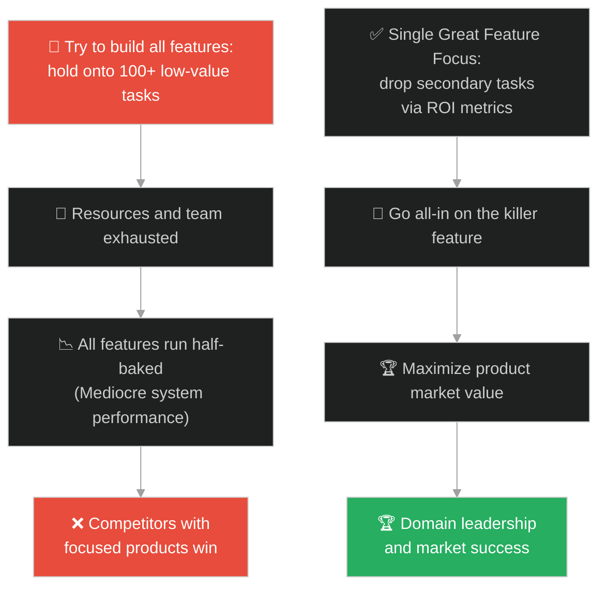
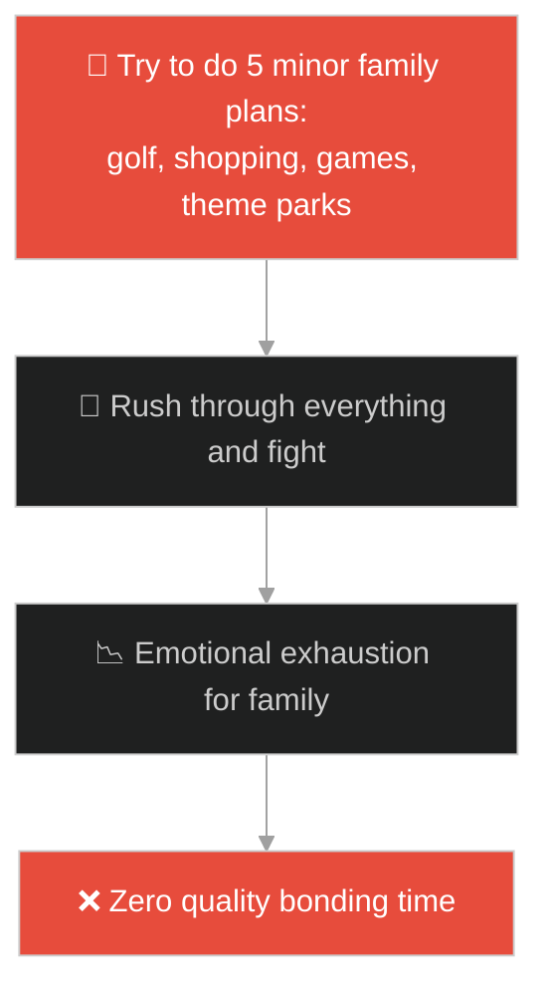
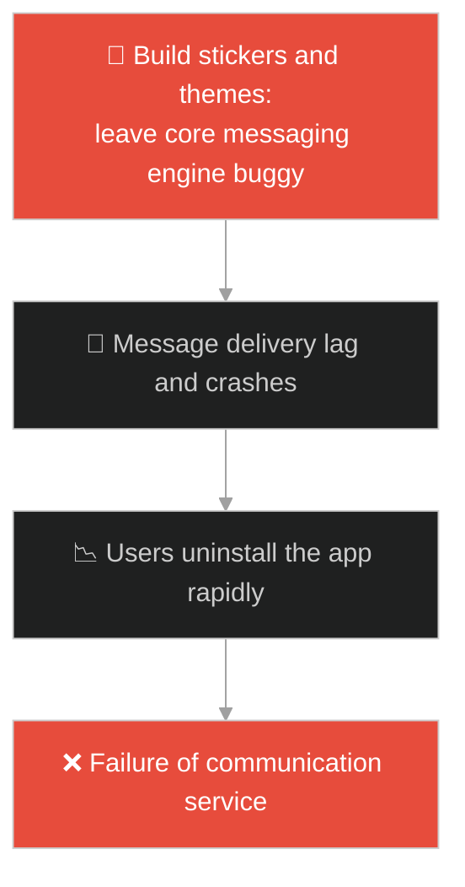
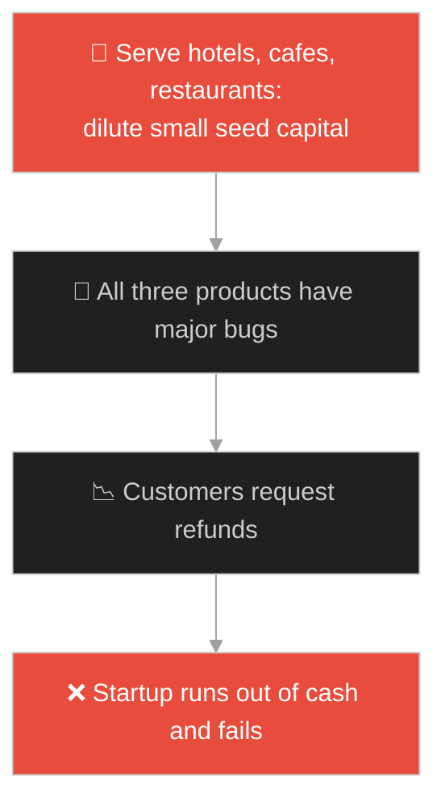
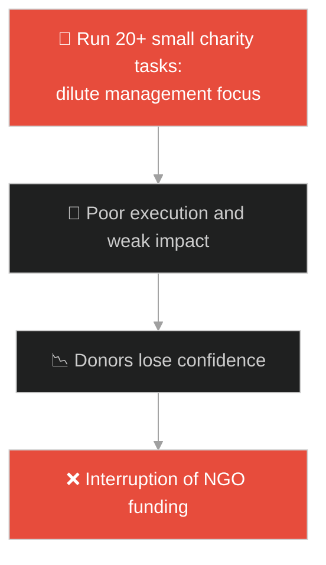
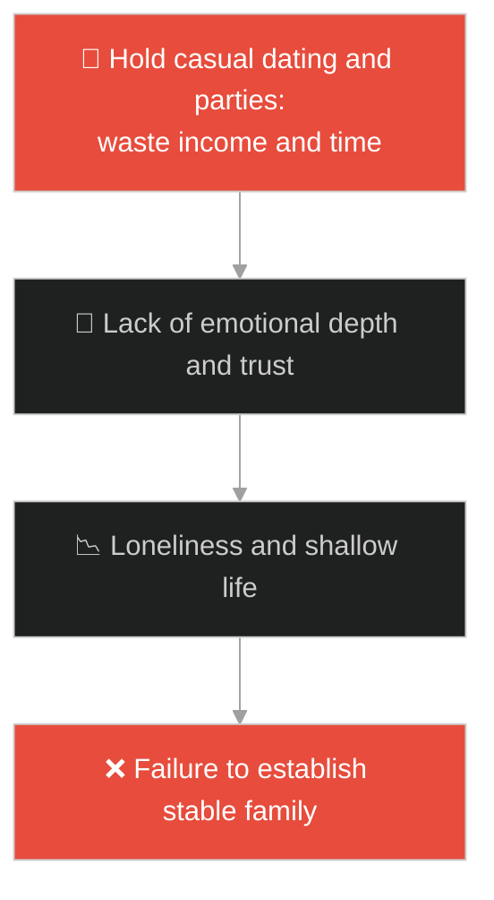
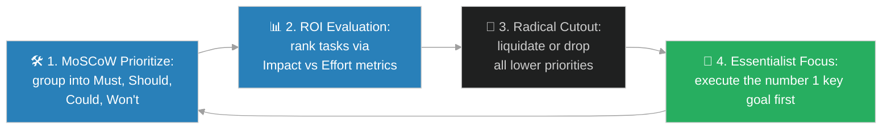

# Opportunity Cost & Feature Prioritization (ថ្លៃដើមឱកាស និងការកំណត់អាទិភាពមុខងារការងារ)៖ គុជខ្យងដ៏មានតម្លៃមហាសាល (Opportunity Cost & Feature Prioritization & Jesus and the Pearl of Great Price)

**Author:** ichamrong  
**Date:** 2026-05-28  
**Tags:** #jesus #prioritization #opportunity-cost #essentialism #focus #product-management  
**Category:** Concepts / Parables  
**Read Time:** ~15 min  

---

## 📌 មាតិកា (Table of Contents)
- [អន្ទាក់ផ្លូវចិត្ត (The Trap)](#0)
- [១. រឿងព្រេងនិទាន៖ គុជខ្យងដ៏មានតម្លៃ (The Legend of the Pearl of Great Price)](#1)
  - [ការលក់គុជខ្យងល្អៗទាំងអស់ដើម្បីទិញយកគុជតែមួយ (Selling All Good Pearls to Buy the Single Great Pearl)](#1-1)
- [២. បញ្ហា៖ ការសាបរលាបធនធាន និងកង្វះការកំណត់អាទិភាព (The Issue: Diluting Feature Focus and the Opportunity Cost of Mediocre Work)](#2)
- [៣. ឧទាហមណ៍ជាក់ស្តែងក្នុងពិភពពិត (Real World Examples)](#3)
  - [ឧទាហរណ៍ទី ១ — កម្រិតស្រាល (គ្រួសារ)៖ ការបោះបង់សកម្មភាពកម្សាន្តចុងសប្តាហ៍ច្រើនមុខដើម្បីរៀបចំដំណើរកម្សាន្តរួមដ៏មានន័យ (Sacrificing Minor Activities for One Meaningful Family Trip)](#3-1)
  - [ឧទាហរណ៍ទី ២ — កម្រិតមធ្យម (បច្ចេកទេស)៖ ការលុបចោលមុខងារទម្រន់ៗដើម្បីផ្តោតលើ Core Feature ដែលដោះស្រាយបញ្ហាអតិថិជន (Deprecating 10 Secondary Features to Build One High-Value Core Module)](#3-2)
  - [ឧទាហរណ៍ទី ៣ — កម្រិតមធ្យម (ធុរកិច្ច)៖ ការផ្តោតធនធានលើផលិតផលតែមួយរបស់ Startup (Focusing a Startup's Capital on a Single Killer Feature)](#3-3)
  - [ឧទាហរណ៍ទី ៤ — កម្រិតមធ្យម (សង្គម/គ្រប់គ្រង)៖ ការបដិសេធគម្រោងខ្នាតតូចដើម្បីប្រមូលកម្លាំងធ្វើគម្រោងយុទ្ធសាស្ត្រជាតិ (Saying No to Small Projects to Focus on a Key Strategic Initiative)](#3-4)
  - [ឧទាហរណ៍ទី ៥ — កម្រិតធ្ងន់ (ទំនាក់ទំនង)៖ ការលះបង់ការដើរលេងសប្បាយយប់ព្រលប់ដើម្បីសាងសង់អនាគតគ្រួសារ (Giving Up Casual Social Dating to Build a Lifelong Marriage Foundation)](#3-5)
- [៤. ដំណោះស្រាយទូទៅ៖ ការអនុវត្តក្របខ័ណ្ឌ MoSCoW, ICE scoring, និងការបដិសេធដោយវៃឆ្លាត (The General Solution: Enforcing MoSCoW, ICE Prioritization, and the Power of Saying No)](#4)
- [សេចក្តីសន្និដ្ឋាន (Conclusion)](#5)
- [ឯកសារយោង (References)](#6)
- [Related Posts](#7)

---

<a id="0"></a>
## អន្ទាក់ផ្លូវចិត្ត (The Trap)

តើអ្នកធ្លាប់ជួបស្ថានភាពដែលក្រុមការងាររបស់អ្នករវល់អភិវឌ្ឍមុខងារការងាររាប់រយយ៉ាង (Features) តែគ្មានមុខងារណាមួយដោះស្រាយបញ្ហាអតិថិជនបានល្អពិតប្រាកដដែរឬទេ? មនុស្សភាគច្រើនយល់ច្រឡំថា "ការធ្វើឱ្យបានច្រើន (Quantity) គឺជាភាពរីកចម្រើន"។ ប៉ុន្តែនៅក្នុងការចាត់ចែងផលិតផល និងការរស់នៅ គុណតម្លៃពិតប្រាកដគឺស្ថិតនៅលើការហ៊ានបោះបង់ចោលនូវជម្រើស "ល្អល្មមៗ" ដើម្បីយកកម្លាំងទាំងអស់ទៅផ្តោតលើជម្រើស "ល្អបំផុតតែមួយគត់"។

នៅក្នុងការកំណត់អាទិភាពការងារ៖
* **យើងងាយនឹងធ្លាក់ក្នុងអន្ទាក់** នៃការឱបក្រសោបគម្រោងការងារ ឬមុខងារតូចតាចជាច្រើន (The Diluted Scope Trap) ព្រោះខ្លាចបាត់បង់ឱកាស ឬខ្លាចអតិថិជនមិនសប្បាយចិត្ត។
* **យើងមើលរំលង** ថ្លៃដើមឱកាស (Opportunity Cost) ដែលថាម៉ោង និងថវិកាដែលយើងចំណាយលើរបស់កំប៉ិកកំប៉ុកទាំងនោះ គឺជាធនធានដែលយើងលួចយកចេញពីការបង្កើតរបស់ដ៏វិសេសវិសាលបំផុត។

ការមិនហ៊ានលែងដៃពីជម្រើសល្អៗជាមធ្យម ដើម្បីចាប់យកឱកាសកំពូល ហៅថា **អន្ទាក់ឱបក្រសោបគុជតូច (Trivial Pearls Trap)**er.

ដើម្បីយល់ដឹងពីរបៀបកំណត់អាទិភាព និងការគ្រប់គ្រងថ្លៃដើមឱកាស នេះជាផែនទីបង្ហាញផ្លូវ៖
1. **រឿងព្រេងនិទាន (The Legend)** — រឿងរ៉ាវរបស់អ្នកជំនួញដែលលក់គុជខ្យងល្អៗទាំងអស់ដែលខ្លួនមាន ដើម្បីទិញយកគុជខ្យងតែមួយគ្រាប់ដែលមានតម្លៃកាត់ថ្លៃមិនបាន។
2. **បញ្ហា (The Issue)** — ការវិភាគ Opportunity Cost, Feature Creep, និងការប្រើប្រាស់ ICE scoring ក្នុងការគ្រប់គ្រងផលិតផល Software។
3. **ឧទាហមណ៍ជាក់ស្តែងក្នុងពិភពពិត (Real World Examples)** — ពិនិត្យមើលបញ្ហានេះក្នុងកម្រិតគ្រួសារ បច្ចេកវិទ្យា ធុរកិច្ច ការគ្រប់គ្រង និងទំនាក់ទំនង។
4. **ដំណោះស្រាយទូទៅ (The General Solution)** — ការអនុវត្តក្របខ័ណ្ឌ MoSCoW និងសិល្បៈនៃការបដិសេធ (The Power of Saying No)។



---

<a id="1"></a>
## ១. រឿងព្រេងនិទាន៖ គុជខ្យងដ៏មានតម្លៃ (The Legend of the Pearl of Great Price)

ព្រះយេស៊ូវបានបន្តពន្យល់ពីតម្លៃនៃនគរស្ថានសួគ៌ តាមរយៈរឿងប្រៀបប្រដៅមួយទៀត៖

*"នគរស្ថានសួគ៌ ក៏ប្រៀបដូចជាអ្នកជំនួញម្នាក់ ដែលដើរស្វែងរកទិញគជ់ខ្យងដ៏ល្អៗ។"*

* បុរសរូបនេះមិនមែនជាមនុស្សធម្មតាដែលដើរជំពប់ជើងប៉ះកំណប់ដោយចៃដន្យនោះទេ គាត់គឺជា **អ្នកជំនាញ (Expert)** ដែលយល់ដឹងពីគុណភាព និងចំណាយពេលពេញមួយជីវិតដើររាវរករបស់ល្អៗ។
* នៅក្នុងដៃរបស់គាត់ មានគជ់ខ្យងល្អៗ និងមានតម្លៃជាច្រើនគ្រាប់រួចជាស្រេចទៅហើយ។

<a id="1-1"></a>
### ការលក់គុជខ្យងល្អៗទាំងអស់ដើម្បីទិញយកគុជតែមួយ (Selling All Good Pearls to Buy the Single Great Pearl)

ថ្ងៃមួយ៖
* គាត់បានទៅប្រទះឃើញ **"គជ់ខ្យងមួយគ្រាប់ដែលមានតម្លៃកាត់ថ្លៃមិនបាន (One Pearl of Great Price)"**។
* វាមានភាពល្អឥតខ្ចោះ ពន្លឺចែងចាំង និងទំហំធំវិសេសវិសាល ដែលគាត់មិនធ្លាប់បានឃើញពីមុនមកក្នុងជីវិតរបស់គាត់។
* គាត់បានដឹងភ្លាមថា នេះគឺជាអ្វីដែលគាត់កំពុងស្វែងរកពេញមួយជីវិត។
* ដោយគ្មានការស្ទាក់ស្ទើរ គាត់បានធ្វើការសម្រេចចិត្តដ៏ក្លាហាន៖ **គាត់បានដើរចេញទៅលក់គជ់ខ្យងល្អៗទាំងអស់ដែលគាត់ធ្លាប់សន្សំ និងលក់ទ្រព្យសម្បត្តិទាំងអស់របស់គាត់** ដើម្បីប្រមូលប្រាក់ទាំងអស់នោះមកទិញយកគុជខ្យងតែមួយគ្រាប់នោះភ្លាម។

---

<a id="2"></a>
## ២. បញ្ហា៖ ការសាបរលាបធនធាន និងកង្វះការកំណត់អាទិភាព (The Issue: Diluting Feature Focus and the Opportunity Cost of Mediocre Work)

នៅក្នុងការគ្រប់គ្រងផលិតផលបច្ចេកវិទ្យា (Product Management) ការមិនព្រមបដិសេធគំនិតថ្មីៗ នាំឱ្យកើតមានបញ្ហា **Feature Creep** (ការបន្ថែមមុខងារច្រើនពេករហូតរញ៉េរញ៉ៃ)។ ធនធានរបស់ក្រុមការងារត្រូវខ្ចាត់ខ្ចាយ ធ្វើឱ្យប្រព័ន្ធទាំងមូលគ្មានមុខងារណាមួយលេចធ្លោ ឬដោះស្រាយបញ្ហាអតិថិជនបានត្រឹមត្រូវឡើយ។

```python
# Bad/Fragile: Processing all requests/features in parallel without prioritization, leading to depletion
class DilutedFeatureBuilder:
    def __init__(self):
        self.backlog = []
        
    def add_feature(self, name, business_value):
        self.backlog.append({"name": name, "value": business_value})
        
    def build_features(self, team_capacity=100):
        processed = {}
        for feature in self.backlog:
            cost = 30 # Each feature takes team resource
            if team_capacity >= cost:
                team_capacity -= cost
                processed[feature["name"]] = "Finished (Mediocre Quality)"
            else:
                processed[feature["name"]] = "Failed (Out of Capacity)"
        return processed

# Good/Resilient: Prioritizing based on Opportunity Cost and ROI (The Pearl of Great Price)
class PrioritizedFeatureBuilder:
    def __init__(self):
        self.backlog = []
        
    def add_feature(self, name, business_value, effort):
        self.backlog.append({
            "name": name,
            "value": business_value,
            "effort": effort,
            "roi": business_value / effort
        })
        
    def build_best_feature(self):
        if not self.backlog:
            return None
        # Sort backlog by ROI descending (Finding the Pearl of Great Price)
        self.backlog.sort(key=lambda x: x["roi"], reverse=True)
        best_feature = self.backlog[0]
        
        # Focus all team resources on this single high-value feature
        print(f"Building key strategic feature: '{best_feature['name']}' with ROI: {best_feature['roi']:.2f}")
        return best_feature
```

* **ថ្លៃដើមឱកាសខ្ពស់ (High Opportunity Cost):** រាល់ម៉ោងដែលចំណាយលើមុខងារបន្ទាប់បន្សំ (ដូចជា ការប្តូរពណ៌ Theme) គឺជាម៉ោងដែលយើងបាត់បង់សម្រាប់ការកែលម្អសុវត្ថិភាពទិន្នន័យ (Security)។
* **ភាពនឿយហត់របស់ក្រុមការងារ (Team Burnout):** ការបង្ខំឱ្យបុគ្គលិកធ្វើកិច្ចការគ្រប់យ៉ាងក្នុងពេលតែមួយ បន្ថយគុណភាពលទ្ធផល និងបង្កើនអត្រាលាលែងការងារ។

---

<a id="3"></a>
## ៣. ឧទាហមណ៍ជាក់ស្តែងក្នុងពិភពពិត

---

<a id="3-1"></a>
### ឧទាហមណ៍ទី ១ — កម្រិតស្រាល (គ្រួសារ)៖ ការបោះបង់សកម្មភាពកម្សាន្តចុងសប្តាហ៍ច្រើនមុខដើម្បីរៀបចំដំណើរកម្សាន្តរួមដ៏មានន័យ (Sacrificing Minor Activities for One Meaningful Family Trip)

គ្រួសារមួយមានផែនការចុងសប្តាហ៍ច្រើនពេក៖ ឪពុកចង់ទៅវាយកូនហ្គោល ម្តាយចង់ទៅផ្សារទិញឥវ៉ាន់ កូនច្បងចង់ទៅលេងហ្គេម ចំណែកកូនពៅចង់ទៅសួនកម្សាន្ត។ ពួកគេព្យាយាមធ្វើគ្រប់យ៉ាង ធ្វើឱ្យចុងសប្តាហ៍មានភាពប្រញាប់ប្រញាល់ ហត់នឿយ និងឈ្លោះប្រកែកគ្នា។ ពួកគេសម្រេចចិត្តបោះបង់សកម្មភាពផ្ទាល់ខ្លួនទាំងអស់ រួចរៀបចំដំណើរកម្សាន្តបោះតង់រួមគ្នាតែមួយ (The Pearl)។ លទ្ធផលគឺ គ្រួសារទទួលបានក្តីស្រឡាញ់ និងការចងចាំដ៏អស្ចារ្យ។



---

<a id="3-2"></a>
### ឧទាហមណ៍ទី ២ — កម្រិតមធ្យម (បច្ចេកទេស)៖ ការលុបចោលមុខងារទម្រន់ៗដើម្បីផ្តោតលើ Core Feature ដែលដោះស្រាយបញ្ហាអតិថិជន (Deprecating 10 Secondary Features to Build One High-Value Core Module)

ក្រុមការងារអភិវឌ្ឍន៍ App ផ្ញើសារមួយ បានចំណាយពេល ៣ ខែបង្កើតមុខងារប្តូរ Background, ផ្ញើ Sticker ពិសេស និងលេងហ្គេមតូចៗ។ ប៉ុន្តែការផ្ញើសារស្នូល (Core Messaging Engine) មានភាពយឺតយ៉ាវ និងធ្លាក់ចុះញឹកញាប់។ ពួកគេសម្រេចចិត្តបង្កកគម្រោងរងទាំងអស់ រួចប្រមូលកម្លាំងវិស្វករទាំងអស់មកសរសេរ Core Messaging ឡើងវិញឱ្យលឿន និងមានសុវត្ថិភាពបំផុត។ App របស់ពួកគេទទួលបានការទាញយកកើនឡើងភ្លាមៗ។



---

<a id="3-3"></a>
### ឧទាហមណ៍ទី ៣ — កម្រិតមធ្យម (ធុរកិច្ច)៖ ការផ្តោតធនធានលើផលិតផលតែមួយរបស់ Startup (Focusing a Startup's Capital on a Single Killer Feature)

Startup មួយបង្កើតប្រព័ន្ធគ្រប់គ្រងសណ្ឋាគារ ភោជនីយដ្ឋាន និងហាងកាហ្វេ។ ពួកគេខ្វះថវិកា និងធនធានមនុស្ស ធ្វើឱ្យផលិតផលទាំងបីគ្មានគុណភាពខ្ពស់។ ស្ថាបនិកបានសម្រេចចិត្តបោះបង់ទីផ្សារសណ្ឋាគារ និងភោជនីយដ្ឋាន រួចយកថវិកាចុងក្រោយទៅអភិវឌ្ឍតែប្រព័ន្ធ POS សម្រាប់ហាងកាហ្វេតែមួយមុខគត់។ យុទ្ធសាស្ត្រផ្តោតលើ "គុជខ្យងតែមួយ" នេះ ធ្វើឱ្យពួកគេក្លាយជាអ្នកដឹកនាំទីផ្សារ POS ហាងកាហ្វេក្នុងប្រទេស។



---

<a id="3-4"></a>
### ឧទាហមណ៍ទី ៤ — កម្រិតមធ្យម (សង្គម/គ្រប់គ្រង)៖ ការបដិសេធគម្រោងខ្នាតតូចដើម្បីប្រមូលកម្លាំងធ្វើគម្រោងយុទ្ធសាស្ត្រជាតិ (Saying No to Small Projects to Focus on a Key Strategic Initiative)

អង្គការក្រៅរដ្ឋាភិបាលមួយ ទទួលធ្វើគម្រោងតូចៗចំនួន ២០ ក្នុងពេលតែមួយ (ដូចជា ចែកសៀវភៅ ជីកអណ្តូង បង្រៀនកាត់ដេរ)។ បុគ្គលិកនឿយហត់ខ្លាំង ហើយផលជះក្នុងសង្គមមានកម្រិតទាប។ នាយកប្រតិបត្តិថ្មីបានសម្រេចចិត្តបដិសេធ និងឈប់ទទួលគម្រោងតូចៗទាំងអស់នោះ រួចផ្តោតថវិកាទាំងអស់លើគម្រោងធំតែមួយ គឺ "កសាងសាលាបច្ចេកវិទ្យាសម្រាប់កុមារក្រីក្រទូទាំងប្រទេស"។ គម្រោងនេះបានផ្លាស់ប្តូរជីវិតកុមាររាប់ម៉ឺននាក់ និងទទួលបានការគាំទ្រពីអន្តរជាតិ។



---

<a id="3-5"></a>
### ឧទាហមណ៍ទី ៥ — កម្រិតធ្ងន់ (ទំនាក់ទំនង)៖ ការលះបង់ការដើរលេងសប្បាយយប់ព្រលប់ដើម្បីសាងសង់អនាគតគ្រួសារ (Giving Up Casual Social Dating to Build a Lifelong Marriage Foundation)

បុរសម្នាក់មានមិត្តស្រីរាប់អានលេងៗជាច្រើននាក់ និងចូលចិត្តដើរលេងផឹកស៊ីរាល់យប់។ គាត់ចំណាយលុយ និងពេលវេលាយ៉ាងច្រើន តែមានអារម្មណ៍ទទេស្អាតក្នុងចិត្ត។ នៅពេលគាត់ជួបនារីម្នាក់ដែលមានចរិតថ្លៃថ្នូរ និងជាដៃគូជីវិតដ៏ពិតប្រាកដ (The Pearl) គាត់បានសម្រេចចិត្តផ្តាច់ទំនាក់ទំនងរញ៉េរញ៉ៃទាំងអស់ លះបង់ការដើរលេងឥតប្រយោជន៍ ដើម្បីសន្សំលុយ និងពេលវេលាសាងសង់គ្រួសារដ៏មានសុភមង្គលជាមួយនាង។



---

<a id="4"></a>
## ៤. ដំណោះស្រាយទូទៅ៖ ការអនុវត្តក្របខ័ណ្ឌ MoSCoW, ICE scoring, និងការបដិសេធដោយវៃឆ្លាត (The General Solution: Enforcing MoSCoW, ICE Prioritization, and the Power of Saying No)

ដើម្បីដោះស្រាយបញ្ហាខ្ចាត់ខ្ចាយធនធាន និងសម្រេចចិត្តជ្រើសរើសជម្រើសដ៏ល្អបំផុត យើងត្រូវអនុវត្តវិធានការ៖



1. **ការប្រើប្រាស់ក្របខ័ណ្ឌ MoSCoW (Apply MoSCoW Framework):** បែងចែករាល់ការងារ ឬមុខងារជា ៤ ក្រុម៖
   * **Must have:** ត្រូវតែមានជាដាច់ខាត (នេះជា គុជខ្យងដ៏មានតម្លៃ)។
   * **Should have:** គួរតែមាន។
   * **Could have:** អាចមានបើមានពេល។
   * **Won't have:** មិនធ្វើទាល់តែសោះ (លុបចោលដើម្បីសន្សំកម្លាំង)។
2. **ការវាយតម្លៃផលចំណេញ (Evaluate via ICE Scoring):** គណនាពិន្ទុផ្អែកលើផលជះ (Impact) ភាពជឿជាក់ (Confidence) និងភាពងាយស្រួល (Ease) ដើម្បីស្វែងរកការងារដែលមាន ROI ខ្ពស់បំផុត។
3. **ការបដិសេធដោយម៉ឺងម៉ាត់ (Develop the Power of Saying No):** យល់ដឹងថា ការយល់ព្រមលើកិច្ចការតូចតាច គឺស្មើនឹងការបដិសេធគម្រោងធំ។ ត្រូវក្លាហានបដិសេធគម្រោងជាមធ្យម ដើម្បីការពារធនធាន។
4. **ការផ្តោតកម្លាំងតែមួយគត់ (The One Thing Focus):** កំណត់គោលដៅកំពូលតែមួយគត់សម្រាប់ឆ្នាំ សម្រាប់ត្រីមាស ឬសម្រាប់ថ្ងៃនេះ រួចបំពេញវាឱ្យបានជោគជ័យមុននឹងចាប់ផ្តើមការងារបន្ទាប់។

---

## 🐇 ធ្លាក់ចូលក្នុងរន្ធទន្សាយ (Enter the Rabbit Hole)

ដើម្បីយល់ដឹងពីរបៀបដែលការរៀបចំផែនការបម្រុង ការធានាសមត្ថភាពការពារ និងការត្រៀមលក្ខណៈសង្គ្រោះបន្ទាន់ (Disaster Readiness & Capacity Reserves) ជួយការពារប្រព័ន្ធពីការដួលរលំភ្លាមៗ សូមបន្តដំណើរទៅកាន់៖

* 🚀 **[ចាប់ផ្តើមដំណើររុករក (Start the Journey) ➔ The Parable of the Ten Virgins](./189-jesus-and-the-ten-virgins.md)**

---

<a id="5"></a>
## សេចក្តីសន្និដ្ឋាន (Conclusion)

> **«ភាពល្អ គឺជាសត្រូវនៃភាពអស្ចារ្យ។ អ្នកមិនអាចចាប់យកគុជខ្យងដ៏មានតម្លៃបំផុតបានឡើយ ប្រសិនបើដៃទាំងពីររបស់អ្នកកំពុងរវល់ក្តោបក្តាប់គុជខ្យងធម្មតាៗមិនព្រមលែង»**

ការយល់ដឹងពីថ្លៃដើមឱកាស (Opportunity Cost) និងការប្តេជ្ញាចិត្តខ្ពស់ក្នុងការកំណត់អាទិភាព គឺជាមាគ៌ាតែមួយគត់ដើម្បីបង្កើតឱ្យមានផលិតផល បច្ចេកវិទ្យា និងជីវិតមួយដែលមានគុណតម្លៃវិសេសវិសាលបំផុត។

---

<a id="6"></a>
## ឯកសារយោង (References)

* **Matthew 13:45–46** — *The Parable of the Pearl of Great Price*, Holy Bible. The theological foundation for essentialism, singular focus, and high-value sacrifice.
* **McKeown, G.** — *Essentialism: The Disciplined Pursuit of Less* (2014). Crown Business. The core management textbook on prioritization.

---

<a id="7"></a>
## Related Posts

* [[Core Competence & Dormant Value Optimization](./187-jesus-and-the-hidden-treasure.md)] — របៀបរុករក និងអភិវឌ្ឍចំណុចខ្លាំងលាក់កំបាំងរបស់ខ្លួន។
* [[Disaster Readiness & Capacity Reserves](./189-jesus-and-the-ten-virgins.md)] — ការរៀបចំខ្លួន និងការបំរុងទុកធនធានដើម្បីទប់ទល់នឹងស្ថានភាពអាសន្ន។
