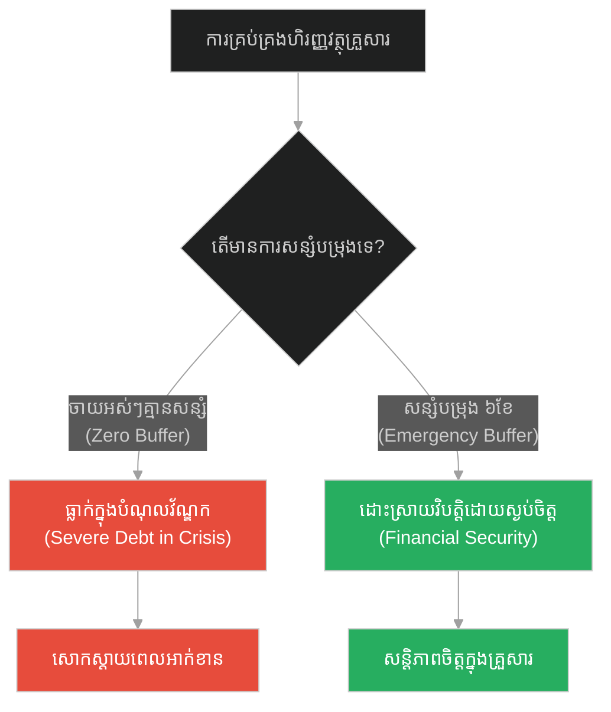
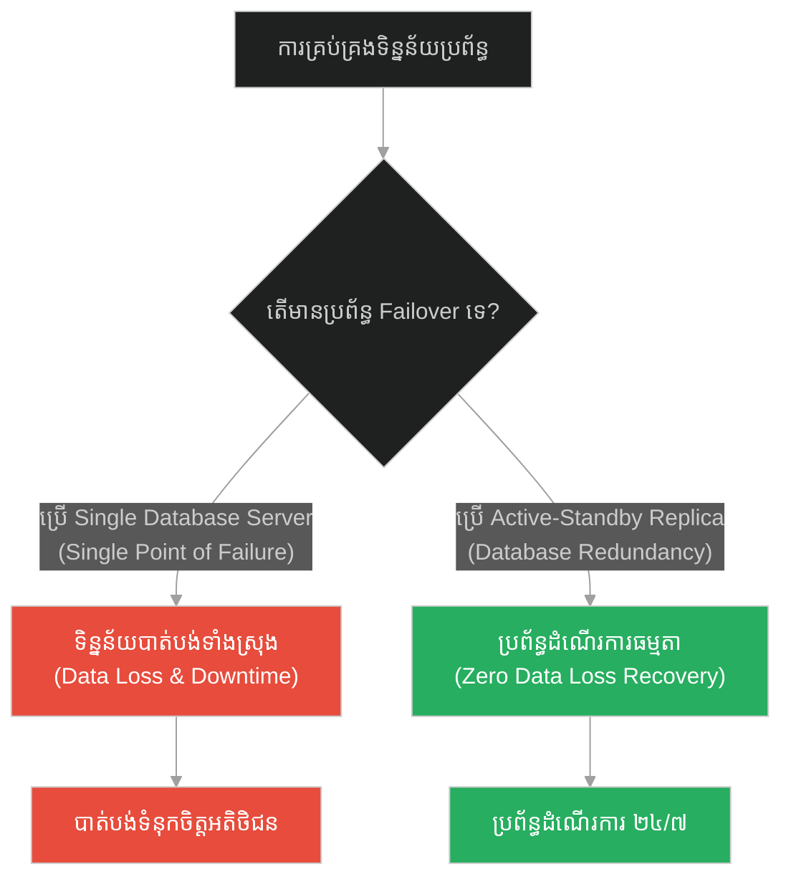
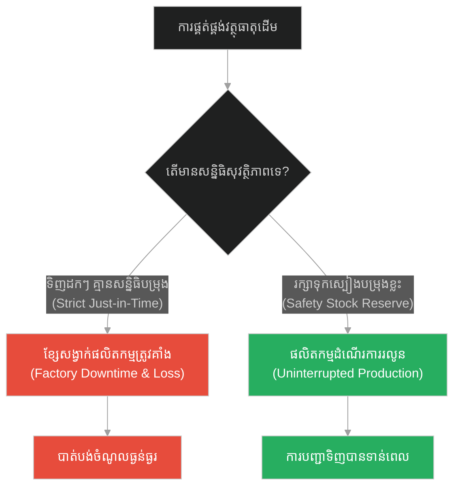
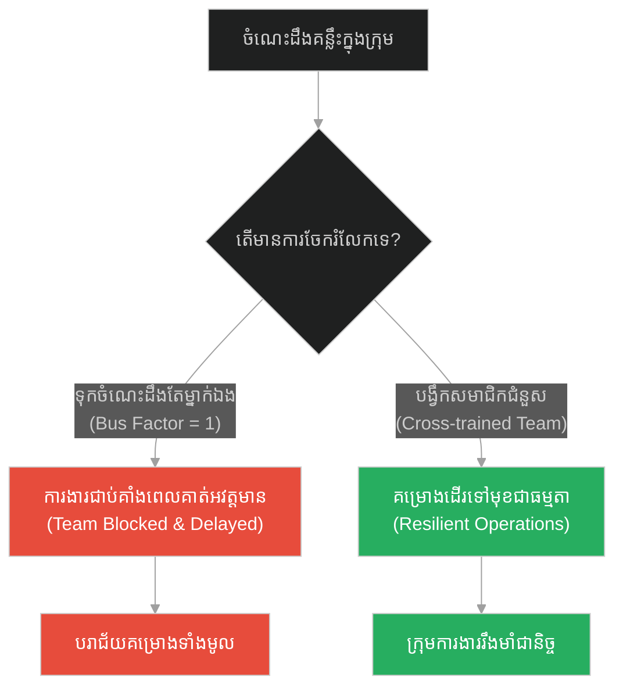
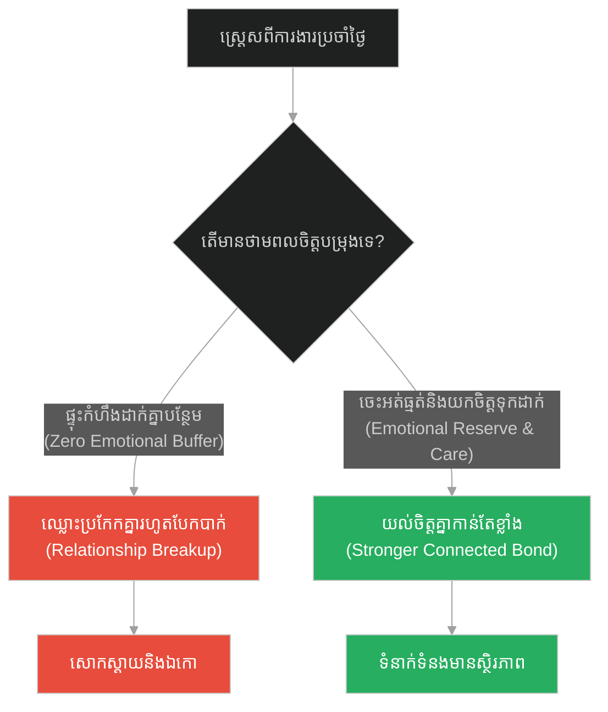
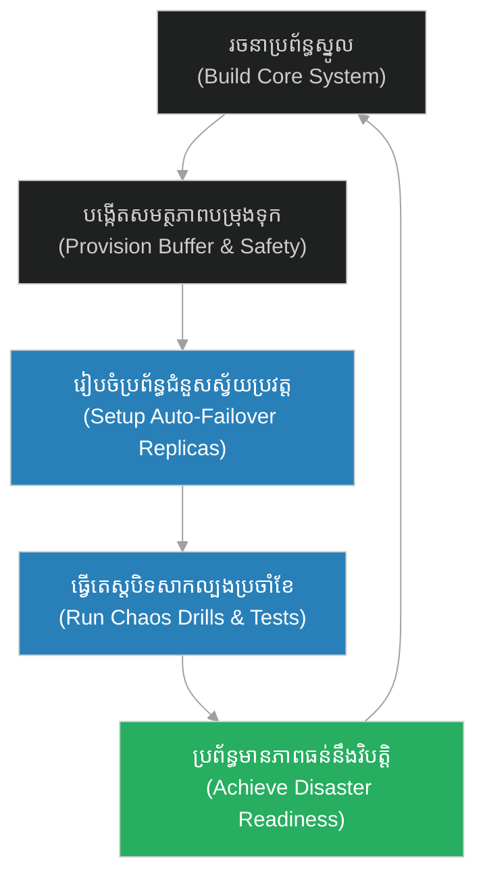

# Disaster Readiness & Capacity Reserves (ក្រមុំព្រហ្មចារីទាំង ១០)៖ ការត្រៀមខ្លួនសម្រាប់គ្រោះមហន្តរាយ និងសមត្ថភាពបម្រុងទុក (Disaster Readiness & Capacity Reserves & Jesus and the Ten Virgins)

**Author:** ichamrong  
**Date:** 2026-05-28  
**Tags:** #jesus #preparation #procrastination #readiness #responsibility #disaster-recovery  
**Category:** Concepts / Parables  
**Read Time:** ~15 min  

---

## 📌 មាតិកា (Table of Contents)
- [អន្ទាក់ផ្លូវចិត្ត (The Trap)](#0)
- [១. រឿងព្រេងនិទាន៖ ក្រមុំព្រហ្មចារីទាំង ១០ នាក់ (The Legend of The Ten Virgins)](#1)
  - [កូនកំលោះយឺតពេល និងចង្កៀងដែលគ្មានប្រេងបម្រុង (The Late Bridegroom and Empty Lamps)](#1-1)
- [២. បញ្ហា៖ វិបត្តិកង្វះសមត្ថភាពបម្រុង និងការគ្មានផែនការសង្គ្រោះ (The Issue: Lack of Capacity Reserves and Disaster Recovery)](#2)
- [៣. ឧទាហមណ៍ជាក់ស្តែងក្នុងពិភពពិត (Real World Examples)](#3)
  - [ឧទាហរណ៍ទី ១ — កម្រិតស្រាល (គ្រួសារ)៖ មូលនិធិសង្គ្រោះបន្ទាន់ និងស្បៀងបម្រុង (The Family Emergency Fund)](#3-1)
  - [ឧទាហរណ៍ទី ២ — កម្រិតមធ្យម (បច្ចេកទេស)៖ ប្រព័ន្ធស្ទួនទិន្នន័យ និង Active-Standby Failover (The Tech System Redundancy)](#3-2)
  - [ឧទាហរណ៍ទី ៣ — កម្រិតមធ្យម (ធុរកិច្ច)៖ សន្និធិសុវត្ថិភាព និងចរន្តផ្គត់ផ្គង់ជំនួស (The Business Supply Chain Safety Stock)](#3-3)
  - [ឧទាហរណ៍ទី ៤ — កម្រិតមធ្យម (សង្គម/គ្រប់គ្រង)៖ ផែនការបណ្តុះបណ្តាលជំនួស និង Bus Factor (The Management Bus Factor Plan)](#3-4)
  - [ឧទាហរណ៍ទី ៥ — កម្រិតធ្ងន់ (ទំនាក់ទំនង)៖ ថាមពលផ្លូវចិត្តបម្រុង និងការយល់យោគគ្នា (The Relationship Emotional Runway)](#3-5)
- [៤. ដំណោះស្រាយទូទៅ៖ ការរៀបចំផែនការធានានិរន្តរភាពអាជីវកម្ម (The General Solution: Business Continuity and Disaster Planning)](#4)
- [សេចក្តីសន្និដ្ឋាន (Conclusion)](#5)
- [ឯកសារយោង (References)](#6)
- [Related Posts](#7)

---

<a id="0"></a>
## អន្ទាក់ផ្លូវចិត្ត (The Trap)

តើអ្នកធ្លាប់ជួបប្រទះការដួលរលំប្រព័ន្ធ ឬការដួលរលំអាជីវកម្មទាំងស្រុង នៅពេលមានវិបត្តិ ឬតម្រូវការកើនឡើងគំហើញដែរឬទេ? នេះគឺជា **«អន្ទាក់នៃការមិនត្រៀមលក្ខណៈបម្រុង និងការរស់នៅក្នុងស្ថានភាពល្អឥតខ្ចោះ (Zero Buffer / Perfection Illusion Trap)»**។ នៅក្នុងការរចនាប្រព័ន្ធបច្ចេកវិទ្យា និងការគ្រប់គ្រង មនុស្សភាគច្រើនតែងតែគណនាធនធានបម្រុងសម្រាប់តែស្ថានភាពធម្មតា (Happy Path) ដោយមិនបានត្រៀមសមត្ថភាពបម្រុង (Capacity Reserves) សម្រាប់គ្រាអាសន្នឡើយ។

*   **Side A (The Trap):** ការដំណើរការប្រព័ន្ធដោយប្រើប្រាស់សមត្ថភាពពេញ ១០០% (Max Utilization) ដោយគ្មានធនធានបម្រុង នាំឱ្យប្រព័ន្ធដួលរលំភ្លាមៗនៅពេលមានបញ្ហា ឬ Traffic កើនឡើងខ្ពស់។
*   **Side B (Resilient Pattern):** ការរក្សានូវទំហំបម្រុងសុវត្ថិភាព (Safety Buffers) និងការរៀបចំផែនការស្តារប្រព័ន្ធឡើងវិញ (Disaster Recovery) ដើម្បីធានាបាននូវនិរន្តរភាពទោះជាជួបវិបត្តិធំប៉ុនណាក៏ដោយ។

---

<a id="1"></a>
## ១. រឿងព្រេងនិទាន៖ ក្រមុំព្រហ្មចារីទាំង ១០ នាក់ (The Legend of The Ten Virgins)

ព្រះយេស៊ូវបានលើកយករឿងប្រៀបប្រដៅមួយទៀតមកសម្តែង ដើម្បីឱ្យសិស្សានុសិស្សយល់ដឹងពីការរៀបចំខ្លួន និងការប្រុងប្រយ័ត្នជានិច្ច។

ទ្រង់មានបន្ទូលថា៖ «នគរស្ថានសួគ៌ប្រៀបដូចជាស្រីក្រមុំ ១០ នាក់ ដែលកាន់ចង្កៀងប្រេងរៀងៗខ្លួន ចេញទៅរង់ចាំទទួលកូនកំលោះក្នុងពិធីមង្គលការមួយនៅពេលយប់»។

នៅក្នុងចំណោមពួកគេទាំង ១០ នាក់នោះ៖
*   **៥ នាក់ជាមនុស្សមានប្រាជ្ញា៖** ពួកគេមិនត្រឹមតែយកចង្កៀងមកប៉ុណ្ណោះទេ ប៉ុន្តែថែមទាំងបានយកដប **ប្រេងបម្រុង** មកជាមួយផងដែរ ក្រែងលោការរង់ចាំចំណាយពេលយូរជាងការរំពឹងទុក។
*   **៥ នាក់ទៀតជាមនុស្សល្ងង់ខ្លៅ៖** ពួកគេយកមកតែចង្កៀងដែលមានប្រេងស្រាប់តែប៉ុណ្ណោះ ដោយគិតថាវាមិនអីទេ មិនបាច់យកប្រេងបម្រុងមកនាំតែធ្ងន់ និងសាំញ៉ាំ។

<a id="1-1"></a>
### កូនកំលោះយឺតពេល និងចង្កៀងដែលគ្មានប្រេងបម្រុង (The Late Bridegroom and Empty Lamps)

កូនកំលោះបានមកយឺតពេលខុសពីការរំពឹងទុករបស់ពួកគេ។ ខណៈពេលដែលរង់ចាំយូរពេក ស្រីក្រមុំទាំង ១០ នាក់ក៏ងងុយដេក ហើយលង់លក់ទៅ។

លុះដល់ពាក់កណ្តាលអធ្រាត្រ ស្រាប់តែមានសម្លេងស្រែកផ្អើលឡើងថា៖ «កូនកំលោះមកដល់ហើយ! ចេញមកទទួលគាត់ទៅ!»។

ស្រីក្រមុំទាំង ១០ នាក់ក៏ភ្ញាក់ឡើងភ្លាម រួចចាប់ផ្តើមរៀបចំអុជចង្កៀងរបស់ខ្លួន។ ពេលនោះ ស្រីក្រមុំល្ងង់ខ្លៅទាំង ៥ នាក់ ឃើញថាចង្កៀងរបស់ពួកគេជិតរលត់អស់ទៅហើយ ព្រោះអស់ប្រេងពីចង្កៀង។ ពួកគេក៏បានសុំប្រេងពីស្ត្រីមានប្រាជ្ញាថា៖ «សុំចែកប្រេងមកយើងខ្លះផង ព្រោះចង្កៀងយើងជិតរលត់ហើយ»។

ស្ត្រីមានប្រាជ្ញាតបថា៖ «យើងមិនអាចចែកឱ្យបានទេ ព្រោះវាប្រហែលជាមិនគ្រប់គ្រាន់សម្រាប់យើងទាំងអស់គ្នាឡើយ។ សូមអ្នកទៅទិញពីអ្នកលក់ប្រេងខ្លួនឯងទៅ»។

ខណៈពេលដែលស្ត្រីល្ងង់ខ្លៅទាំងនោះកំពុងរត់ទៅទិញប្រេង កូនកំលោះក៏បានមកដល់។ អ្នកដែលបានត្រៀមខ្លួនរួចរាល់ ក៏ដើរចូលទៅក្នុងពិធីជប់លៀងជាមួយកូនកំលោះ រួចហើយ **ទ្វារក៏ត្រូវបិទជិត**។ នៅពេលដែលស្រីក្រមុំទាំង ៥ នាក់នោះត្រឡប់មកវិញ ហើយគោះទ្វារសុំចូល កូនកំលោះឆ្លើយតបពីខាងក្នុងមកវិញថា៖ «ខ្ញុំប្រាប់អ្នករាល់គ្នាជាប្រាកដថា ខ្ញុំមិនស្គាល់អ្នករាល់គ្នាទេ»។

---

<a id="2"></a>
## ២. បញ្ហា៖ វិបត្តិកង្វះសមត្ថភាពបម្រុង និងការគ្មានផែនការសង្គ្រោះ (The Issue: Lack of Capacity Reserves and Disaster Recovery)

នៅក្នុងការរចនាប្រព័ន្ធកុំព្យូទ័រ (System Architecture) និងវិស្វកម្ម SRE (Site Reliability Engineering) រឿងនេះឆ្លុះបញ្ចាំងពីវិបត្តិនៃ **Capacity Planning & Disaster Recovery (ការរៀបចំទំហំបម្រុង និងការសង្គ្រោះគ្រោះមហន្តរាយ)**។ 

ប្រសិនបើប្រព័ន្ធដំណើរការនៅកម្រិត ៩៩% CPU/RAM Utilization ជានិច្ចដោយគ្មាន Elastic Buffer ឬ Auto-scaling នោះនៅពេលមានការកើនឡើង Traffic ភ្លាមៗ (Spike) ប្រព័ន្ធនឹងគាំង (Crash) ហើយអ្នកប្រើប្រាស់នឹងមិនអាចចូលប្រើប្រាស់បាន (ទ្វារបិទ)។

យើងត្រូវការប្រព័ន្ធដែលមានទំហំបម្រុង (Over-provisioning/Reserves) និងប្រព័ន្ធ Active-Standby ដែលអាចធានាថា ប្រសិនបើ node មួយគាំង node មួយទៀតនឹងជំនួសការងារបានភ្លាមៗ។

ខាងក្រោមនេះជាការប្រៀបធៀបកូដ៖

### ឧទាហរណ៍កូដគំរូ (Python)

```python
# =====================================================================
# 1. គំរូមិនល្អ (Fragile Design): Zero Capacity Buffer (Crashes instantly on overload)
# =====================================================================
class FragileServer:
    def __init__(self, max_capacity=100):
        self.max_capacity = max_capacity
        self.current_load = 0

    def handle_request(self, request_id):
        # គ្មានយន្តការបម្រុង ឬ Auto-scaling ឡើយ
        if self.current_load >= self.max_capacity:
            print(f"[CRASH] Server overloaded on {request_id}! Door Closed (503 Service Unavailable).")
            return False
        
        self.current_load += 10
        print(f"[SUCCESS] Handled {request_id}. Current load: {self.current_load}%")
        return True

# =====================================================================
# 2. គំរូល្អ (Resilient Design): Capacity Reserve & Hot Standby Failover (Virgin Pattern)
# =====================================================================
class ResilientServerSystem:
    def __init__(self, primary_capacity=100, reserve_capacity=100):
        self.primary_capacity = primary_capacity
        self.primary_load = 0
        
        # ធនធានបម្រុងក្តៅ (Hot Standby Capacity Reserve) -> ប្រេងបម្រុង
        self.reserve_capacity = reserve_capacity
        self.reserve_load = 0
        self.reserve_active = False

    def handle_request(self, request_id):
        # ១. ប្រសិនបើ Primary Node នៅមានសមត្ថភាព
        if self.primary_load < self.primary_capacity:
            self.primary_load += 10
            print(f"[PRIMARY] Handled {request_id}. Primary load: {self.primary_load}%")
            return True
            
        # ២. ប្រសិនបើ Primary ពេញ ត្រូវប្រើប្រាស់ Capacity Reserve ភ្លាមៗ (Failover)
        if not self.reserve_active:
            print("[ALERT] Primary full! Activating Hot Standby Capacity Reserve...")
            self.reserve_active = True
            
        if self.reserve_load < self.reserve_capacity:
            self.reserve_load += 10
            print(f"[RESERVE] Handled {request_id}. Reserve load: {self.reserve_load}%")
            return True
            
        # ៣. ប្រសិនបើអស់សមត្ថភាពទាំងពីរ ទើបបដិសេធសំណើ
        print(f"[FAIL] All capacities exhausted. Rejecting {request_id}.")
        return False
```

---

<a id="3"></a>
## ៣. ឧទាហមណ៍ជាក់ស្តែងក្នុងពិភពពិត (Real World Examples)

<a id="3-1"></a>
### ឧទាហរណ៍ទី ១ — កម្រិតស្រាល (គ្រួសារ)៖ មូលនិធិសង្គ្រោះបន្ទាន់ និងស្បៀងបម្រុង (The Family Emergency Fund)

*   **Dilemma:** ការចាយវាយលុយកាក់អស់ៗពីខ្លួនរាល់ខែ ដោយមិនមានប្រាក់សន្សំ ធ្វើឱ្យគ្រួសារធ្លាក់ក្នុងវិបត្តិបំណុលភ្លាមៗនៅពេលមានសមាជិកគ្រួសារឈឺធ្ងន់។
*   **Resolution:** បង្កើតកញ្ចប់លុយសន្សំបន្ទាន់ស្មើនឹង ៦ ខែនៃការចំណាយប្រចាំខែ (Emergency Fund) ទុកសម្រាប់ដោះស្រាយការងារបន្ទាន់។



<a id="3-2"></a>
### ឧទាហរណ៍ទី ២ — កម្រិតមធ្យម (បច្ចេកទេស)៖ ប្រព័ន្ធស្ទួនទិន្នន័យ និង Active-Standby Failover (The Tech System Redundancy)

*   **Dilemma:** Server ផ្ទុកទិន្នន័យតែមួយកន្លែង និងគ្មានការ Back up ធ្វើឱ្យក្រុមហ៊ុនបាត់បង់ទិន្នន័យអតិថិជនទាំងអស់នៅពេល Server ខូច (Hardware failure)។
*   **Resolution:** រៀបចំ Database replication ទៅកាន់ node ទីពីរក្នុងតំបន់ផ្សេងគ្នា (Multi-region replica) ជាមួយការបម្រុងទុកទិន្នន័យជាប្រចាំថ្ងៃ។



<a id="3-3"></a>
### ឧទាហរណ៍ទី ៣ — កម្រិតមធ្យម (ធុរកិច្ច)៖ សន្និធិសុវត្ថិភាព និងចរន្តផ្គត់ផ្គង់ជំនួស (The Business Supply Chain Safety Stock)

*   **Dilemma:** រោងចក្រផលិតនំបុ័ងបញ្ជាទិញម្សៅពីអ្នកផ្គត់ផ្គង់តែមួយគត់បែប Just-in-Time ធ្វើឱ្យរោងចក្រត្រូវផ្អាកការផលិតភ្លាមៗនៅពេលអ្នកផ្គត់ផ្គង់កកស្ទះដឹកជញ្ជូន។
*   **Resolution:** រក្សាទុកម្សៅបម្រុង (Safety Stock) សម្រាប់ប្រើប្រាស់រយៈពេល ២ សប្តាហ៍ និងចុះកិច្ចសន្យាជាមួយដៃគូផ្គត់ផ្គង់ទីពីរដើម្បីធានាការផ្គត់ផ្គង់។



<a id="3-4"></a>
### ឧទាហរណ៍ទី ៤ — កម្រិតមធ្យម (សង្គម/គ្រប់គ្រង)៖ ផែនការបណ្តុះបណ្តាលជំនួស និង Bus Factor (The Management Bus Factor Plan)

*   **Dilemma:** មានតែប្រធានបច្ចេកទេសម្នាក់គត់ដែលដឹងពីរបៀប Deploy ប្រព័ន្ធ។ នៅពេលគាត់សុំច្បាប់ ឬជួបគ្រោះថ្នាក់ គ្មាននរណាអាចជួសជុលកូដបានឡើយ។
*   **Resolution:** ធ្វើការបណ្តុះបណ្តាលជំនាញខ្វែង (Cross-training) និងកត់ត្រាឯកសារបច្ចេកទេស (Documentation) ដើម្បីឱ្យសមាជិកផ្សេងទៀតអាចធ្វើការជំនួសបាន។



<a id="3-5"></a>
### ឧទាហរណ៍ទី ៥ — កម្រិតធ្ងន់ (ទំនាក់ទំនង)៖ ថាមពលផ្លូវចិត្តបម្រុង និងការយល់យោគគ្នា (The Relationship Emotional Runway)

*   **Dilemma:** ដៃគូទាំងសងខាងអស់កម្លាំងពីការងារ និងស្ត្រេសរៀងៗខ្លួន (Zero emotional reserve) ធ្វើឱ្យមានការឈ្លោះប្រកែកគ្នាធ្ងន់ធ្ងរដោយសារតែរឿងបន្តិចបន្តួច។
*   **Resolution:** រក្សាពេលវេលាផ្ទាល់ខ្លួនសម្រាប់សម្រាកចិត្ត (Self-care) និងបង្កើតទម្លាប់អត់ធ្មត់ យោគយល់គ្នា ដើម្បីត្រៀមដោះស្រាយវិវាទដោយសន្តិវិធី។



---

<a id="4"></a>
## ៤. ដំណោះស្រាយទូទៅ៖ ការរៀបចំផែនការធានានិរន្តរភាពអាជីវកម្ម (The General Solution: Business Continuity and Disaster Planning)

ដើម្បីការពារភាពមហន្តរាយ និងធានាថាប្រព័ន្ធដំណើរការបានជានិច្ច៖

1.  **ការរៀបចំទំហំបម្រុងជាមុន (Capacity Provisioning & Buffer):** រក្សាទុកធនធាន ឬសមត្ថភាពបម្រុងយ៉ាងតិច ២០%-៣០% លើសពីការប្រើប្រាស់ធម្មតា។
2.  **ការអនុវត្តប្រព័ន្ធជំនួសដោយស្វ័យប្រវត្ត (Automated Failover & Redundancy):** រៀបចំប្រព័ន្ធស្ទួន (Standby Nodes/Replicas) ដែលអាចដំណើរការជំនួសគ្នាបានភ្លាមៗនៅពេលមានអាសន្ន។
3.  **ការធ្វើតេស្តសង្គ្រោះបន្ទាន់ជាទៀងទាត់ (Disaster Recovery Simulation):** ធ្វើតេស្តសាកល្បងបិទប្រព័ន្ធ (Chaos Engineering) ដើម្បីផ្ទៀងផ្ទាត់ប្រសិទ្ធភាពនៃយន្តការសង្គ្រោះទិន្នន័យ។



---

## 🐇 ធ្លាក់ចូលក្នុងរន្ធទន្សាយ (Enter the Rabbit Hole)
ដើម្បីយល់ដឹងពីរបៀបដែលប្រព័ន្ធដែលត្រៀមខ្លួនរួចរាល់ អាចដោះស្រាយបញ្ហាដំណាំលូតលាស់ និងការលុបបំបាត់ស្មៅអាក្រក់នៅក្នុងប្រព័ន្ធទិន្នន័យរបស់អ្នក សូមបន្តដំណើរទៅកាន់៖

* 🚀 **[ចាប់ផ្តើមដំណើររុករក (Start the Journey) ➔ Garbage Collection & Stale References Filter](./190-jesus-and-the-weeds.md)**

---

<a id="5"></a>
## សេចក្តីសន្និដ្ឋាន (Conclusion)

> **«កុំរង់ចាំដល់យប់ងងឹតស្លុប ទើបចាប់ផ្តើមដើររកទិញប្រេងចាក់ចង្កៀងនោះឡើយ។»**

គ្រោះមហន្តរាយ ឬឱកាសមាស តែងតែមកដល់ដោយគ្មានការជូនដំណឹងជាមុន។ ការរៀបចំខ្លួន មូលនិធិសង្គ្រោះបន្ទាន់ ឯកសារបច្ចេកទេស និងការរក្សាទុកសមត្ថភាពបម្រុង (Capacity Reserves) មិនមែនជាការខ្ជះខ្ជាយធនធាននោះទេ តែវាគឺជា «ធានារ៉ាប់រងតែមួយគត់» ដែលនឹងការពារប្រព័ន្ធរបស់អ្នក និងជីវិតរបស់អ្នកពីការដួលរលំនៅពេលមានព្យុះវិបត្តិមកដល់។

---

<a id="6"></a>
## ឯកសារយោង (References)

*   **Holy Bible** — *Matthew 25:1–13*. The Parable of the Ten Virgins.
*   **Beyer, Betsy et al.** — *Site Reliability Engineering: How Google Runs Production Systems* (2016). Focuses on capacity planning, failover, and disaster readiness.
*   **Netflix Technology Blog** — *Chaos Engineering: The rise of the resiliency tool* (2012). Explains simulation testing to build resilient systems.

---

<a id="7"></a>
## Related Posts

* [Opportunity Cost & Feature Prioritization (គុជខ្យងដ៏មានតម្លៃ)](./188-jesus-and-the-pearl-of-great-price.md) — របៀបបោះបង់មុខងារមិនចាំបាច់ដើម្បីផ្តោតលើរឿងសំខាន់។
* [Garbage Collection & Stale References Filter (ស្មៅអាក្រក់ក្នុងស្រែ)](./190-jesus-and-the-weeds.md) — របៀបចម្រាញ់ និងសម្អាតធាតុអាក្រក់ចេញពីប្រព័ន្ធលូតលាស់។
