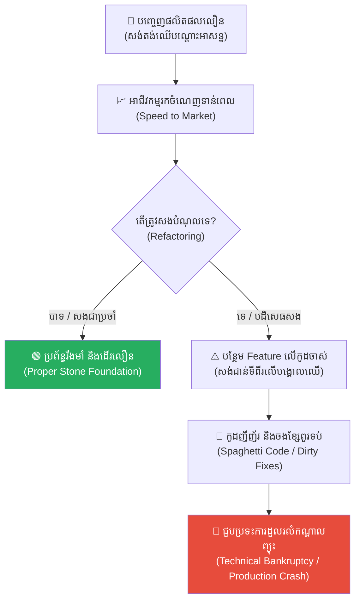
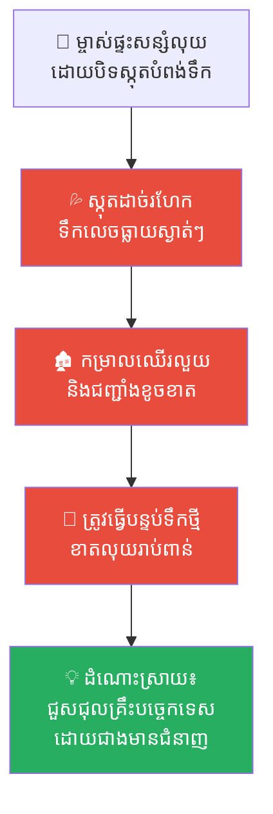
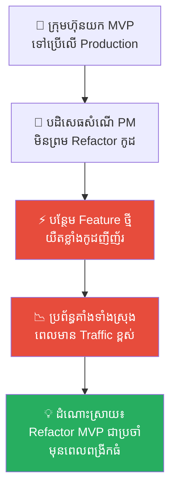
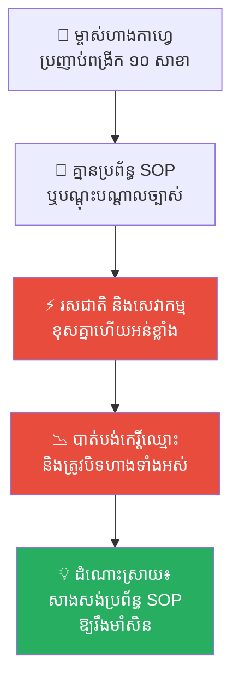
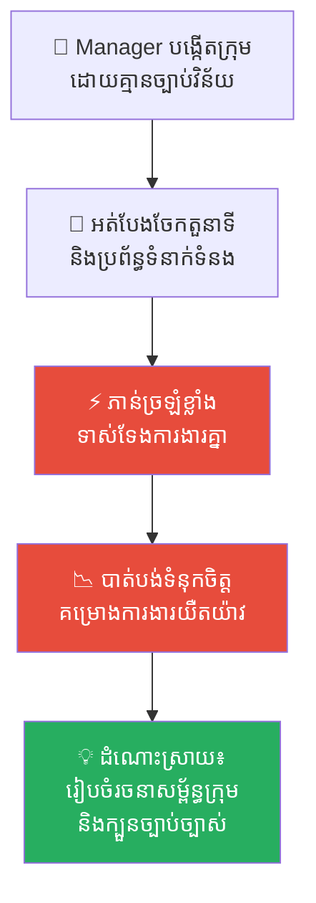
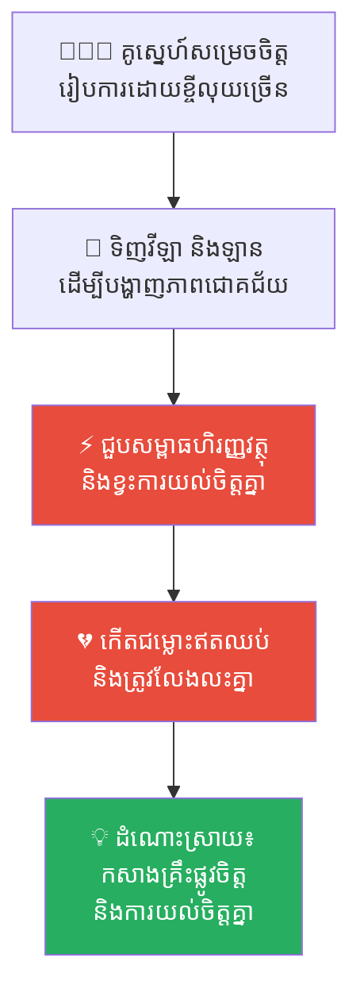
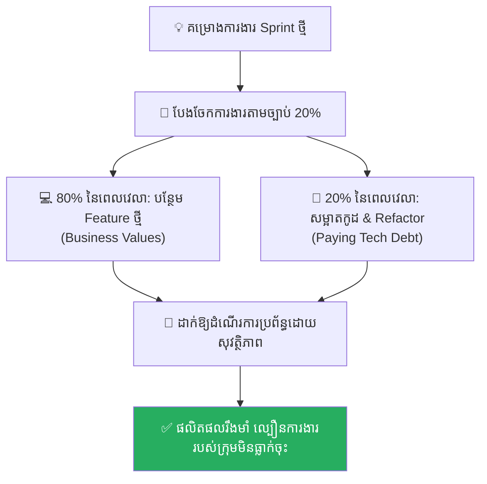

# The Wooden Tent and the Palace of Stone (តង់ឈើបណ្តោះអាសន្ន និងប្រាសាទថ្ម)៖ គ្រោះថ្នាក់នៃការសាងសង់ប្រព័ន្ធប្រញាប់ប្រញាល់ និងមេរៀននៃការសងបំណុលបច្ចេកទេស (Technical Debt)

**Author:** ichamrong  
**Date:** 2026-05-17  
**Tags:** #technical-debt #refactoring #opportunity-cost #code-quality #architecture-design #software-engineering #critical-thinking  
**Category:** Concepts  
**Read Time:** ~15 min  

---

## 📌 មាតិកា (Table of Contents)
- [អន្ទាក់ផ្លូវចិត្ត (The Trap)](#អន្ទាក់ផ្លូវចិត្ត-the-trap)
- [១. រឿងព្រេង៖ តម្រូវការបន្ទាន់របស់សេដ្ឋី ថូម៉ាស (Lord Thomas's Urgent Shelter)](#1)
  - [តង់ឈើបណ្តោះអាសន្ន ឬប្រាសាទគ្រឹះថ្ម? (The Wooden Tent or The Stone Foundation?)](#1-1)
  - [ការសាងសង់ជាន់ទីពីរ និងការបដិសេធសងបំណុល (The Second Floor & Refusing to Pay Debt)](#1-2)
  - [សោកនាដកម្មនៅយប់ព្យុះសង្ឃរា (The Catastrophe in the Storm)](#1-3)
- [២. បញ្ហា៖ ការប្រមូលការប្រាក់នៃកូដ និងការក្ស័យធនបច្ចេកទេស (The Issue: The Compounding Interest of Spaghetti Code)](#2)
- [៣. ឧទាហរណ៍ជាក់ស្តែងក្នុងពិភពពិត (Real World Examples)](#3)
  - [ឧទាហរណ៍ទី ១ — កម្រិតស្រាល (គ្រួសារ)៖ ការជួសជុលផ្ទះលឿនៗដោយជាងគ្មានជំនាញ (The Quick Fix Home Repair)](#3-1)
  - [ឧទាហរណ៍ទី ២ — កម្រិតមធ្យម (បច្ចេកទេស)៖ ការបង្កើត MVP ញីញ័រ និងការបដិសេធមិនព្រម Refactor (The MVP-to-Production Trap)](#3-2)
  - [ឧទាហរណ៍ទី ៣ — កម្រិតមធ្យម (ធុរកិច្ច)៖ ការពង្រីកសាខាអាជីវកម្មទាំងគ្មានប្រព័ន្ធគ្រប់គ្រងរឹងមាំ (Expanding Without Systems)](#3-3)
  - [ឧទាហរណ៍ទី ៤ — កម្រិតមធ្យម (សង្គម/គ្រប់គ្រង)៖ ក្រុមការងារគ្មានក្បួនច្បាប់ និងការដួលរលំនៃស្មារតីក្រុម (The Unstructured Team Storm)](#3-4)
  - [ឧទាហរណ៍ទី ៥ — កម្រិតធ្ងន់ (ទំនាក់ទំនង)៖ អាពាហ៍ពិពាហ៍ដែលសាងសង់លើសម្ភារៈ គ្មានការយល់ចិត្ត (The Materialistic Marriage)](#3-5)
- [៤. ដំណោះស្រាយទូទៅ៖ ច្បាប់ Refactoring ២០% និងការគ្រប់គ្រងបំណុលបច្ចេកទេស (The General Solution: Managing Technical Debt)](#4)
- [សេចក្តីសន្និដ្ឋាន (Conclusion)](#conclusion)
- [ឯកសារយោង (References)](#references)
- [Related Posts](#related-posts)

---

## អន្ទាក់ផ្លូវចិត្ត (The Trap)

តើអ្នកធ្លាប់ជួបស្ថានភាពដែលក្រុមហ៊ុនសម្រេចចិត្តបញ្ចេញផលិតផល ឬ App ថ្មីមួយយ៉ាងលឿនបំផុតដើម្បីដណ្តើមទីផ្សារ ប៉ុន្តែនៅពេលផលិតផលនោះជោគជ័យ ក្រុមហ៊ុនបែរជាបដិសេធមិនព្រមចំណាយពេលជួសជុលគ្រឹះកូដខាងក្នុង ហើយបន្តបន្ថែមមុខងារថ្មីៗរហូតដល់ថ្ងៃមួយដែលប្រព័ន្ធទាំងមូលគាំង និងបាក់រលំទាំងស្រុងដែរឬទេ?

នេះគឺជា **The Technical Debt Trap (អន្ទាក់នៃបំណុលបច្ចេកទេស)**។

នៅក្នុងការអភិវឌ្ឍប្រព័ន្ធបច្ចេកវិទ្យា និងអាជីវកម្ម ជារឿយៗយើងតែងតែខ្ចី «បំណុលគ្រឹះ» (សរសេរកូដលុបៗ គ្មានរៀបចំ architecture ត្រឹមត្រូវ) ដើម្បីដោះដូរយក «ល្បឿនដំបូង» (Speed to Market)។ យុទ្ធសាស្ត្រនេះមិនមែនជាកំហុស ១០០% ឡើយ ព្រោះវាជួយឱ្យយើងចាប់ឱកាសទីផ្សារទាន់ពេល។ ប៉ុន្តែ កំហុសដ៏ធំបំផុតគឺ **ការបដិសេធមិនព្រមសងបំណុលនោះវិញ (Refactoring)** ក្នុងរដូវកាលសមស្រប និងការបន្តសាងសង់បន្ទប់ថ្មីៗពីលើគ្រឹះដែលទន់ជ្រាយ រហូតដល់ថ្ងៃដែលប្រព័ន្ធជួបប្រទះការក្ស័យធនបច្ចេកទេស (Technical Bankruptcy) ដែលនាំមកនូវមហន្តរាយដ៏ខ្មាសអៀនបំផុត។

ដើម្បីយល់ដឹងឱ្យបានគ្រប់ជ្រុងជ្រោយ នេះជាផែនទីបង្ហាញផ្លូវសម្រាប់អត្ថបទនេះ៖
1. **រឿងព្រេងប្រវត្តិសាស្ត្រ (The English Medieval Fable)** — រឿងរ៉ាវរបស់សេដ្ឋី Thomas, ជាងសំណង់ Arthur, ជម្រកតង់ឈើបណ្តោះអាសន្ន និងសោកនាដកម្មរលំស្រុតកណ្តាលព្យុះសង្ឃរា។
2. **បញ្ហា (The Issue)** — ការវិភាគទ្រឹស្តី Technical Debt, អត្រាការប្រាក់នៃកូដ (Interest Rate of Code) និងការក្ស័យធនបច្ចេកទេស។
3. **ឧទាហរណ៍ជាក់ស្តែងក្នុងពិភពពិត (Real World Examples)** — ពិនិត្យមើលឥទ្ធិពលនេះក្នុងកម្រិតគ្រួសារ ការងារបច្ចេកទេស ធុរកិច្ច ការគ្រប់គ្រង និងទំនាក់ទំនងស្នេហា។
4. **ដំណោះស្រាយទូទៅ (The General Solution)** — ការអនុវត្តច្បាប់ Refactoring ២០% ក្នុង Sprint និងការបង្កើតប្រព័ន្ធគ្រប់គ្រងបំណុលបច្ចេកទេសច្បាស់លាស់។

---

## ១. រឿងព្រេង៖ តម្រូវការបន្ទាន់របស់សេដ្ឋី ថូម៉ាស (Lord Thomas's Urgent Shelter)

កាលពីសម័យមជ្ឈិមសម័យនៅក្នុងប្រទេសអង់គ្លេស មានម្ចាស់ដីធ្លីម្នាក់ឈ្មោះ **សេដ្ឋី ថូម៉ាស (Lord Thomas)**។ លោកជាមនុស្សមានគំនិតរកស៊ីរហ័សរហួន និងពូកែចាប់ឱកាសទីផ្សារ។ រដូវច្រូតកាត់ស្រូវជិតមកដល់ ហើយថូម៉ាសចង់បាន **«ជម្រកស្តុកគ្រាប់ស្រូវដ៏ធំមួយ»** ជាបន្ទាន់មុនពេលរដូវវស្សាមកដល់ ដើម្បីប្រមូលទិញស្រូវពីកសិករក្នុងតម្លៃថោក រួចរក្សាទុកលក់យកចំណេញនៅរដូវប្រាំង។

ថូម៉ាស បានទៅជួបមេជាងសំណង់ដ៏ពូកែម្នាក់ឈ្មោះ **អាធ័រ (Master Arthur)** រួចសួរនាំ៖
> *«អាធ័រ! ខ្ញុំត្រូវការជម្រកស្តុកស្រូវដ៏ធំមួយក្នុងរយៈពេលតែ ១៥ ថ្ងៃប៉ុណ្ណោះ។ បើហួសពីនេះ ខ្ញុំនឹងបាត់បង់ឱកាសទិញស្រូវរបស់កសិករទាំងអស់ (Opportunity Cost)។ តើឯងអាចធ្វើបានទេ?»*

---

### តង់ឈើបណ្តោះអាសន្ន ឬប្រាសាទគ្រឹះថ្ម? (The Wooden Tent or The Stone Foundation?)

អាធ័រ បានគិតគូរយ៉ាងហ្មត់ចត់ រួចពន្យល់ពីជម្រើសពីរ៖

1. **ជម្រើសទី១ (ប្រាសាទគ្រឹះថ្ម - Proper Construction)៖**
   * *ការរៀបចំ៖* ត្រូវជីកគ្រឹះយ៉ាងជ្រៅ ចាក់សសរថ្ម និងរៀបឥដ្ឋដ៏ក្រាស់។
   * *លទ្ធផល៖* ប្រើពេល ៣០ ថ្ងៃ (យឺតជាងការចង់បានរបស់ សេដ្ឋី ថូម៉ាស) ប៉ុន្តែរឹងមាំខ្លាំងណាស់ អាចប្រើប្រាស់បាន ៥០ ឆ្នាំ និងអាចបន្ថែមជាន់ទៅថ្ងៃក្រោយដោយគ្មានបញ្ហា។
2. **ជម្រើសទី២ (តង់ឈើបណ្តោះអាសន្ន - Technical Debt)៖**
   * *ការរៀបចំ៖* គ្រាន់តែបោះបង្គោលឈើធ្នង់តូចៗ រួចយកកម្រាលជ័រក្រាស់មកដណ្តប់ពីលើធ្វើជាជម្រកបណ្តោះអាសន្ន (Wooden Tent)។
   * *លទ្ធផល៖* ប្រើពេលត្រឹមតែ ១០ ថ្ងៃប៉ុណ្ណោះ (លឿនទាន់ចិត្ត សេដ្ឋី ថូម៉ាស) អាចការពារស្រូវពីទឹកភ្លៀងបានមួយរយៈខ្លី ប៉ុន្តែជម្រកនេះគ្មានគ្រឹះមាំទាំឡើយ។

អាធ័រ ព្រមានយ៉ាងម៉ត់ចត់៖
> *«លោកម្ចាស់ Thomas! បើលោកជ្រើសរើសជម្រើសទី២ លោកនឹងបានជម្រកលឿនទាន់ចិត្ត។ ប៉ុន្តែ នេះជាការ **ខ្ចីបំណុលគ្រឹះសំណង់ (Technical Debt)**។ នៅពេលរដូវប្រាំងមកដល់ លោកត្រូវតែអនុញ្ញាតឱ្យខ្ញុំរុះរើតង់ឈើនោះចោល រួចចាក់គ្រឹះថ្មឱ្យបានរឹងមាំឡើងវិញ (Refactoring / Paying the Principal)។ បើមិនដូច្នោះទេ ទៅថ្ងៃក្រោយជម្រកនេះនឹងស្រុតរលំពេលមានព្យុះធំ។»*

សេដ្ឋី ថូម៉ាស យល់ព្រមភ្លាមៗដោយគ្មានការស្ទាក់ស្ទើរ៖ *«ល្អណាស់! សង់តង់ឈើបណ្តោះអាសន្នសិនទៅ! ខ្ញុំត្រូវការល្បឿនជាមុន (Speed to Market)!»*

---

### ការសាងសង់ជាន់ទីពីរ និងការបដិសេធសងបំណុល (The Second Floor & Refusing to Pay Debt)

គម្រោងត្រូវបានបញ្ចប់ត្រឹមរយៈពេល ១០ ថ្ងៃ។ សេដ្ឋី ថូម៉ាស សប្បាយចិត្តយ៉ាងខ្លាំង ព្រោះលោកអាចប្រមូលទិញស្រូវបានយ៉ាងច្រើន និងរកចំណេញបានរាប់ម៉ឺនដុល្លារទាន់ពេល។ យុទ្ធសាស្ត្រ «ខ្ចីបំណុលគ្រឹះ» ពិតជាមានប្រសិទ្ធភាពខ្លាំងណាស់នៅដំណាក់កាលដំបូង។

នៅរដូវប្រាំងបន្ទាប់ អាធ័រ បានដើរមកជួប សេដ្ឋី ថូម៉ាស រួចរំលឹក៖
> *«លោកម្ចាស់! ឥឡូវជាពេលរដូវប្រាំងហើយ ស្រូវក្នុងជម្រកក៏លក់អស់ដែរ។ សូមអនុញ្ញាតឱ្យខ្ញុំរុះរើតង់ឈើនេះ រួចចាក់គ្រឹះថ្មឱ្យបានត្រឹមត្រូវ ដើម្បីសងបំណុលគ្រឹះដែលយើងបានជំពាក់កាលពីឆ្នាំមុន។»*

ប៉ុន្តែ សេដ្ឋី ថូម៉ាស សម្លឹងមើលតង់ឈើដែលនៅតែឈរល្អ រួចគិតកំណាញ់៖
> *«អាធ័រ! វានៅតែប្រើការបានតើ! ហេតុអ្វីបានជាត្រូវរុះរើខាតទាំងលុយ និងពេលវេលាទំនេរទៅលើការធ្វើគ្រឹះដែលមើលមិនឃើញពីខាងក្រៅសោះបែបនេះ? ផ្ទុយទៅវិញ ខ្ញុំចង់ពង្រីកជំនួញរបស់ខ្ញុំ ឯងចូរសង់បន្ទប់ជាន់ទីពីរនៅលើតង់ឈើនោះបន្ថែមទៀតភ្លាម ដើម្បីឱ្យខ្ញុំដាក់ស្រូវបានទ្វេដង!»*

អាធ័រ ស្លុតចិត្តយ៉ាងខ្លាំង រួចពន្យល់៖
> *«មិនអាចធ្វើបានទេលោកម្ចាស់! បង្គោលឈើចាស់គ្មានគ្រឹះថ្មឡើយ។ បើលោកបន្ថែមជាន់ទីពីរ ទម្ងន់របស់វានឹងសង្កត់បង្គោលឈើឱ្យស្រុតចុះ។ បើលោកចង់បន្ថែមជាន់ លោកត្រូវតែសងបំណុលគ្រឹះចាស់ជាមុនសិន!»*

ប៉ុន្តែ សេដ្ឋី ថូម៉ាស មិនព្រមស្តាប់ឡើយ ហើយបានគំរាមដកតំណែង អាធ័រ បើគេមិនព្រមសង់។ ដោយគ្មានជម្រើស អាធ័រ បង្ខំចិត្តសង់ជាន់ទីពីរនៅលើបង្គោលឈើចាស់នោះទាំងក្តីបារម្ភជាទីបំផុត។

---

### សោកនាដកម្មនៅយប់ព្យុះសង្ឃរា (The Catastrophe in the Storm)

ដើម្បីទប់ជាន់ទីពីរឱ្យជាប់ អាធ័រ ត្រូវបង្ខំចិត្តយកខ្សែពួររាប់រយខ្សែមកចងទាញបង្គោលឈើចាស់ និងយកឈើច្រកោសរាប់សិបដើមមកទល់ពីខាងក្រោមយ៉ាងញីញ័រ (Dirty Fixes / Spaghetti Code)។ ការងារសាងសង់ជាន់ទីពីរនេះ ជំនួសឱ្យការប្រើពេលត្រឹមតែ ៥ ថ្ងៃ ស្រាប់តែអូសបន្លាយរហូតដល់ ១៥ ថ្ងៃ ព្រោះតែអាធ័រត្រូវចំណាយពេលច្រើនជាងពាក់កណ្តាល ដើម្បីរកវិធីទប់កុំឱ្យជាន់ទីមួយស្រុតបាក់ចុះក្រោមនៅពេលកំពុងធ្វើជាន់ទីពីរ (The High Interest Rate of Technical Debt)។

នៅទីបញ្ចប់ ជាន់ទីពីរក៏ត្រូវបានបញ្ចប់ តែមើលទៅពោរពេញដោយខ្សែពួរចងប្រទាក់ក្រឡាគ្នា និងឈើច្រកោសទល់ទ្រាបពេញកន្លែង មើលទៅគ្មានសណ្តាប់ធ្នាប់ទាល់តែសោះ។

នៅយប់មួយ ព្យុះសង្ឃរាដ៏ធំមួយបានបោកបក់មកលើតំបន់នោះ។ ទឹកភ្លៀងធ្លាក់មកយ៉ាងខ្លាំង ធ្វើឱ្យដីឥដ្ឋខាងក្រោមជម្រកក្លាយជាភក់ល្បាប់ទន់ជ្រាយ។ ជម្រកស្រូវដែលផ្ទុកទម្ងន់ស្រូវរាប់សិបតោនទាំងពីរជាន់ ដោយគ្មានគ្រឹះថ្មរឹងមាំការពារ បានស្រុតចុះក្រោមភ្លាមៗ។

បង្គោលឈើចាស់ៗបាក់ស្រុតចុះក្រោម ខ្សែពួរទាំងអស់ដាច់រហែកខ្ទេចខ្ទី ធ្វើឱ្យជម្រកស្រូវទាំងពីរជាន់ **បាក់ស្រុតរលំខ្ទេចខ្ទីដល់ដីភ្លាមៗ** បំផ្លាញស្រូវទាំងអស់ និងសង្កត់កម្មករជាច្រើននាក់ស្លាប់យ៉ាងអាណោចអាធ័ម (Technical Bankruptcy)។

សេដ្ឋី ថូម៉ាស ឈរសម្លឹងមើលការខាតបង់ទ្រព្យសម្បត្តិទាំងអស់របស់ខ្លួនទាំងទឹកភ្នែក និងក្តីវិប្បដិសារីយ៉ាងខ្លាំង។ លោកដឹងខ្លួនភ្លាមថា ការខ្ចីបំណុលគ្រឹះដើម្បីលឿននៅពេលដំបូងមិនមែនជាកំហុសឡើយ តែ **កំហុសដ៏ធំបំផុតគឺការបដិសេធមិនព្រមសងបំណុលនោះវិញ និងបន្តសាងសង់បន្ថែមពីលើគ្រឹះដែលគ្មានលំនឹង** រហូតដល់ថ្ងៃដែលប្រព័ន្ធបាក់រលំទាំងស្រុង។

---

## ២. បញ្ហា៖ ការប្រមូលការប្រាក់នៃកូដ និងការក្ស័យធនបច្ចេកទេស (The Issue: The Compounding Interest of Spaghetti Code)

រឿងរ៉ាវរបស់តង់ឈើបណ្តោះអាសន្ន ឆ្លុះបញ្ចាំងយ៉ាងច្បាស់ពីគោលការណ៍ **Technical Debt (បំណុលបច្ចេកទេស)** នៅក្នុងវិស័យវិស្វកម្មសូហ្វវែរ។

នៅពេលយើងសម្រេចចិត្តកាត់បន្ថយដំណាក់កាលរៀបចំ architecture ឬការសរសេរ Tests (សង់តង់ឈើ) ដើម្បីឱ្យផលិតផលចេញទៅទីផ្សារបានលឿន យើងកំពុងខ្ចីបំណុល។ បំណុលនេះមាន **ការប្រាក់ (Interest)** របស់វា។ ការប្រាក់នៃកូដ មិនមែនជាលុយកាក់ឡើយ តែវាគឺជា **«ពេលវេលា និងភាពលំបាកដែលកើនឡើងរាល់ពេលយើងចង់បន្ថែម Feature ថ្មី»**៖
1. **Spaghetti Code (កូដញីញ័រ):** កូដដែលគ្មាន structure ច្បាស់លាស់ នឹងប្រែក្លាយទៅជាខ្សែពួរដែលចងទាក់គ្នាពេញប្រព័ន្ធ។
2. **Technical Bankruptcy (ការក្ស័យធនបច្ចេកទេស)៖** នៅពេលបំណុលបច្ចេកទេសកើនឡើងដល់ចំណុចកំពូល ប្រព័ន្ធនឹងលែងអាចប៉ះពាល់បាន។ រាល់ការកែប្រែកូដបន្តិចបន្តួច នឹងធ្វើឱ្យប្រព័ន្ធទាំងមូលដួលរលំភ្លាមៗ បង្ខំឱ្យយើងត្រូវលុបកូដចោលទាំងអស់ ដើម្បីសរសេរឡើងវិញពីដំបូង (Rewrite from Scratch) ដែលខាតបង់ថវិការាប់សែនដុល្លារ។

---

## ៣. ឧទាហរណ៍ជាក់ស្តែងក្នុងពិភពពិត

ដើម្បីយល់ដឹងឱ្យកាន់តែស៊ីជម្រៅ ផ្លូវការសិក្សានឹងនាំអ្នកទៅពិនិត្យមើល **ឧទាហរណ៍ចំនួន ៥ កម្រិតខុសៗគ្នា** ក្នុងជីវិតរស់នៅប្រចាំថ្ងៃ៖

---

### ឧទាហរណ៍ទី ១ — កម្រិតស្រាល (គ្រួសារ)៖ ការជួសជុលផ្ទះលឿនៗដោយជាងគ្មានជំនាញ (The Quick Fix Home Repair)

**ស្ថានភាព៖** ម្ចាស់ផ្ទះម្នាក់ឃើញបំពង់ទឹកក្នុងបន្ទប់ទឹកលេចធ្លាយ ក៏សម្រេចចិត្តយកស្កុតស្អិតមកបិទរុំជុំវិញ ដើម្បីសន្សំលុយ និងពេលវេលាហៅជាងផ្លូវការ។

* **ភាគី A (ម្ចាស់ផ្ទះ)៖** គិតថាការបិទស្កុតស្អិតលឿនរហ័ស (Quick fix) ជួយសន្សំចំណាយ និងដោះស្រាយបញ្ហាបានភ្លាមៗ។
* **ភាគី B (ផ្ទះទាំងមូល)៖** ពីរខែក្រោយមក ស្កុតស្អិតដាច់រហែក ទឹកលេចធ្លាយចូលកម្រាលឈើ និងជញ្ជាំងធ្វើឱ្យរលួយខូចខាតទាំងស្រុង បង្ខំឱ្យត្រូវធ្វើបន្ទប់ទឹកថ្មីឡើងវិញដែលអស់លុយរាប់ពាន់ដុល្លារ។

**ការពិតដ៏ជូរចត់៖**
ការសម្រេចចិត្តជួសជុលលុបៗដោយគ្មានគ្រឹះបច្ចេកទេស ជួយសន្សំចំណាយត្រឹមតែថ្ងៃនេះ តែបង្កើនការខូចខាតទ្វេដងនៅថ្ងៃស្អែក។

---

### ឧទាហរណ៍ទី ២ — កម្រិតមធ្យម (បច្ចេកទេស)៖ ការបង្កើត MVP ញីញ័រ និងការបដិសេធមិនព្រម Refactor (The MVP-to-Production Trap)

**ស្ថានភាព៖** ក្រុមហ៊ុនមួយបានជួល Freelancer ម្នាក់ឱ្យសរសេរកូដបង្កើត App គំរូ (Minimum Viable Product - MVP) ក្នុងរយៈពេល ២ សប្តាហ៍។ នៅពេល App នោះទទួលបានការគាំទ្រ ក្រុមហ៊ុនក៏សម្រេចចិត្តយក MVP នោះទៅប្រើប្រាស់ផ្ទាល់លើ Production តែម្តង ដោយបដិសេធសំណើសុំ Refactor របស់ Developers។

* **ភាគី A (ប្រធានស្ថាប័ន)៖** គិតថា *«App ដើរស្រាប់ហើយ យកទៅសរសេរថ្មីនាំតែខាតលុយ!»*
* **ភាគី B (Developers)៖** ត្រូវចំណាយពេល ៣ សប្តាហ៍ដើម្បីបន្ថែមប៊ូតុងថ្មីមួយកណ្តាលទី ព្រោះកូដចាស់ញីញ័រខ្លាំងពេក រហូតដល់ថ្ងៃមួយដែលប្រព័ន្ធគាំងទាំងស្រុងពេលមានអតិថិជនប្រើប្រាស់ច្រើន (High Traffic)។

**ការពិតដ៏ជូរចត់៖**
ការយក MVP មកធ្វើជាប្រព័ន្ធផ្លូវការដោយគ្មានការ refactor គឺប្រៀបដូចជាការសង់ប្រាសាទថ្មនៅលើតង់ឈើបណ្តោះអាសន្ន។

---

### ឧទាហរណ៍ទី ៣ — កម្រិតមធ្យម (ធុរកិច្ច)៖ ការពង្រីកសាខាអាជីវកម្មទាំងគ្មានប្រព័ន្ធគ្រប់គ្រងរឹងមាំ (Expanding Without Systems)

**ស្ថានភាព៖** ម្ចាស់ហាងកាហ្វេដ៏ល្បីម្នាក់ ចង់ប្រញាប់ពង្រីកសាខាឱ្យបាន ១០ ហាងក្នុងរយៈពេល ៣ ខែ ដើម្បីប្រកួតប្រជែងជាមួយម៉ាកបរទេស ដោយមិនបានរៀបចំស្តង់ដារប្រតិបត្តិការ (SOP) ឬប្រព័ន្ធបណ្តុះបណ្តាលបុគ្គលិកច្បាស់លាស់ឡើយ។

* **ភាគី A (ម្ចាស់ហាង)៖** គិតថាល្បឿនពង្រីកសាខា នឹងជួយយកឈ្នះទីផ្សារមុនគេ។
* **ភាគី B (អតិថិជន)៖** រសជាតិកាហ្វេ និងសេវាកម្មនៅសាខាថ្មីៗខុសគ្នាទាំងស្រុង និងមានកម្រិតអន់ខ្លាំង ធ្វើឱ្យកេរ្តិ៍ឈ្មោះម៉ាកសញ្ញាត្រូវខូចខាត និងត្រូវបិទហាងទាំងអស់វិញក្នុងរយៈពេល ៦ ខែ។

**ការពិតដ៏ជូរចត់៖**
ការពង្រីកអាជីវកម្មលឿនដោយគ្មានប្រព័ន្ធគ្រប់គ្រង (DoR/DoD & System Architecture) គឺជាការរត់ទៅរកការដួលរលំលឿនជាងមុន។

---

### ឧទាហរណ៍ទី ៤ — កម្រិតមធ្យម (សង្គម/គ្រប់គ្រង)៖ ក្រុមការងារគ្មានក្បួនច្បាប់ និងការដួលរលំនៃស្មារតីក្រុម (The Unstructured Team Storm)

**ស្ថានភាព៖** Manager ម្នាក់ចង់បង្កើតក្រុមការងារថ្មីមួយភ្លាមៗ ដោយមិនបានបែងចែកតួនាទី ការទទួលខុសត្រូវ ឬប្រព័ន្ធទំនាក់ទំនងច្បាស់លាស់ឡើយ ព្រោះយល់ថា *«ទុកឱ្យពួកគេសហការគ្នាដោយសេរីទៅបានហើយ!»*

* **ភាគី A (Manager)៖** គិតថាការមិនដាក់ក្បួនច្បាប់ នឹងជួយឱ្យក្រុមការងារមានភាពបត់បែនខ្ពស់ (Agile)។
* **ភាគី B (សមាជិកក្រុម)៖** ជួបប្រទះការភាន់ច្រឡំ ការទាស់ទែងតួនាទីការងារគ្នា និងការបាត់បង់ទំនុកចិត្តគ្នាទៅវិញទៅមក បង្ខំឱ្យគម្រោងត្រូវអូសបន្លាយពេលយូរ។

**ការពិតដ៏ជូរចត់៖**
ភាពគ្មានសណ្តាប់ធ្នាប់ (Organizational Debt) បំផ្លាញនូវផលិតភាព និងស្មារតីសហការរបស់ក្រុមការងារលឿនបំផុត។

---

### ឧទាហរណ៍ទី ៥ — កម្រិតធ្ងន់ (ទំនាក់ទំនង)៖ អាពាហ៍ពិពាហ៍ដែលសាងសង់លើសម្ភារៈ គ្មានការយល់ចិត្ត (The Materialistic Marriage)

**ស្ថានភាព៖** ប្តីប្រពន្ធមួយគូសម្រេចចិត្តរៀបការយ៉ាងធំដុំ ប្រណីតបំផុត និងខ្ចីលុយធនាគាររាប់ម៉ឺនដុល្លារមកទិញឡាន និងផ្ទះវីឡា ដើម្បីបង្ហាញពីភាពជោគជ័យទៅកាន់សង្គម ដោយខ្វះការចំណាយពេលស្វែងយល់ចិត្តគ្នា និងការយោគយល់គ្នា។

* **ភាគី A (ប្តីប្រពន្ធ)៖** គិតថាសម្ភារៈប្រណីតៗខាងក្រៅ នឹងជួយទ្រទ្រង់អាពាហ៍ពិពាហ៍ឱ្យមានសេចក្តីសុខ។
* **ភាគី B (ទំនាក់ទំនង)៖** នៅពេលមានសម្ពាធហិរញ្ញវត្ថុ និងបំណុលធនាគារមកដល់ ពួកគេគ្មានគ្រឹះផ្លូវចិត្តរឹងមាំដើម្បីជជែកគ្នាឡើយ ជម្លោះកើតឡើងឥតឈប់ឈរ និងត្រូវដើរដល់ផ្លូវបំបែក។

**ការពិតដ៏ជូរចត់៖**
អាពាហ៍ពិពាហ៍ដែលគ្មានគ្រឹះនៃការយល់ចិត្ត និងការអត់ធ្មត់ ងាយនឹងបាក់ស្រុតរលំខ្ទេចខ្ទីភ្លាមៗនៅពេលជួបព្យុះជីវិត។

---

## ៤. ដំណោះស្រាយទូទៅ៖ ច្បាប់ Refactoring ២០% និងការគ្រប់គ្រងបំណុលបច្ចេកទេស (The General Solution: Managing Technical Debt)

ដើម្បីការពារប្រព័ន្ធបច្ចេកវិទ្យា និងអាជីវកម្មរបស់អ្នកពីការក្ស័យធន ចូរអនុវត្តយុទ្ធសាស្ត្រគន្លឹះទាំងនេះ៖

### ១. អនុវត្តច្បាប់ Refactoring ២០% (The 20% Rule)
នៅក្នុងគ្រប់ Sprint ការងារទាំងអស់ (ដូចជា Scrum Sprint រយៈពេល ២ សប្តាហ៍) ត្រូវបែងចែកពេលវេលា ២០% នៃធនធានក្រុមការងារ ដើម្បីសម្អាតកូដ កែសម្រួល architecture និងជួសជុលចំណុចខ្សោយ (Refactoring)។ នេះគឺជា **«ការបង់ការប្រាក់ និងសងប្រាក់ដើមជាប្រចាំ»** ដើម្បីកុំឱ្យបំណុលកើនឡើង។

### ២. បង្កើតបញ្ជីតាមដានបំណុល (Technical Debt Backlog)
រាល់ពេលដែលក្រុមការងារសម្រេចចិត្តសរសេរកូដប្រញាប់ប្រញាល់ដើម្បីឱ្យទាន់ Deadline ត្រូវកត់ត្រាវាចូលទៅក្នុង **Technical Debt Backlog** ភ្លាមៗ ជាមួយនឹងកាលបរិច្ឆេទសងច្បាស់លាស់។ កុំទុកឱ្យបំណុលនោះត្រូវបានភ្លេចចោល។

### ៣. អប់រំប្រធានស្ថាប័ន ឬ PM ពី "គណិតវិទ្យានៃបំណុល"
ក្នុងនាមជាអ្នកបច្ចេកទេស ត្រូវមានសមត្ថភាពពន្យល់ PM ឬអតិថិជនឱ្យយល់ថា៖ **«ការបន្ថែម Feature ថ្មីៗដោយគ្មានការ Refactor កូដចាស់ នឹងធ្វើឱ្យល្បឿនការងាររបស់ក្រុមធ្លាក់ចុះ ៣ ដងនៅខែក្រោយ។»** ជួយឱ្យពួកគេយល់ថា ការ Refactoring មិនមែនជាការខាតពេលឡើយ តែវាគឺជា **«ការការពារល្បឿនអនាគត» (Preserving Velocity)**។

---

## សេចក្តីសន្និដ្ឋាន (Conclusion)

> **«ការខ្ចីបំណុលបច្ចេកទេសដើម្បីល្បឿនដំបូង គឺជាយុទ្ធសាស្ត្រវៃឆ្លាតរបស់អាជីវកម្ម។ ប៉ុន្តែការបដិសេធមិនព្រមសងបំណុលនោះវិញ និងបន្តសាងសង់បន្ទប់ថ្មីៗពីលើគ្រឹះតង់ឈើដែលគ្មានលំនឹង គឺជាការបំផ្លាញខ្លួនឯង។»**

ជាងសំណង់ អាធ័រ បានព្រមានសេដ្ឋី ថូម៉ាស តែលោកមិនស្តាប់ រហូតដល់ថ្ងៃដែលព្យុះបោកបក់បំផ្លាញអ្វីៗទាំងអស់។ ចូរកុំទុកឱ្យប្រព័ន្ធរបស់អ្នកក្ស័យធន។

ចូរសងបំណុលបច្ចេកទេសរបស់អ្នកជាប្រចាំ ដើម្បីធានាថាប្រាសាទរបស់អ្នកនឹងឈររឹងមាំអមតៈ។

---

## ឯកសារយោង (References)

* **Fowler, M.** — *Refactoring: Improving the Design of Existing Code* (1999)។ សៀវភៅគ្រឹះនៃការធ្វើ Refactoring និងការគ្រប់គ្រងបំណុលបច្ចេកទេស។
* **Cunningham, W.** — *The WyCash Portfolio Management System* (1992)។ ប្រភពដើមនៃការបង្កើតពាក្យ "Technical Debt Metaphor" ដោយ Ward Cunningham។
* **Brown, W. J., et al.** — *AntiPatterns: Refactoring Software, Architectures, and Projects in Crisis* (1998)។ ការវិភាគលម្អិតអំពី AntiPatterns និងការដួលរលំនៃប្រព័ន្ធ។

---

## Related Posts

* **[The Master Mason and the Readiness Contracts (ជាងឥដ្ឋ គំនូរប្លង់ និងកិច្ចសន្យាត្រៀមខ្លួន)៖ គ្រោះថ្នាក់នៃការសាងសង់ដោយគ្មានផែនការ និងអំណាចនៃកិច្ចសន្យា DoR & DoD ក្នុងការគ្រប់គ្រងគម្រោង](./18-the-master-mason-and-the-readiness-contracts.md)** — Preventing scope creep and unstable baselines using DoR and DoD.
* **[The Weaver and the Emperor's Robe (អ្នកត្បាញសូត្រ និងអាវយ័ន្តអធិរាជ)៖ គ្រោះថ្នាក់នៃការកាត់បន្ថយចំណាយលើផ្នែកសំខាន់ និងមហន្តរាយនៃការមើលរំលងតួនាទីតូចតាច](./16-the-weaver-and-the-emperors-robe.md)** — Tracing how rushing features and skipping inspection causes production crashes.
* **[The Broken Bridge and the Art of Inversion (ស្ពានដែលបាក់ និងវិធានគិតបញ្ច្រាស)៖ របៀបដោះស្រាយបញ្ហាស្មុគស្មាញដោយការចាប់ផ្តើមពីទីបញ្ចប់](./15-the-broken-bridge-and-the-art-of-inversion.md)** — Systematically planning to avoid structural failures.

---

*Last updated: 2026-05-27*
