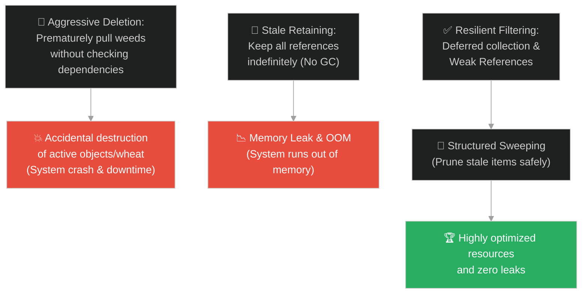
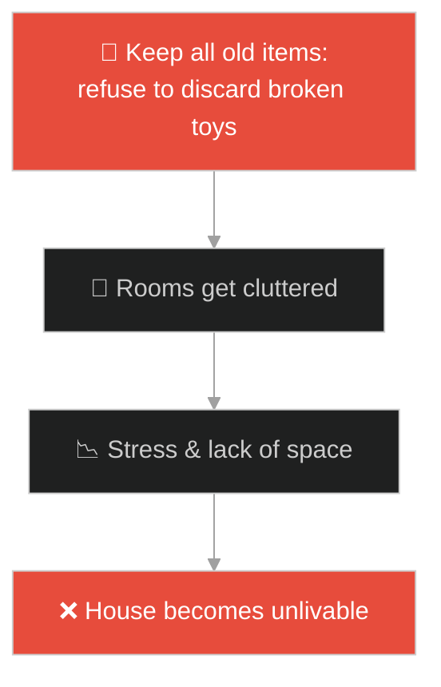
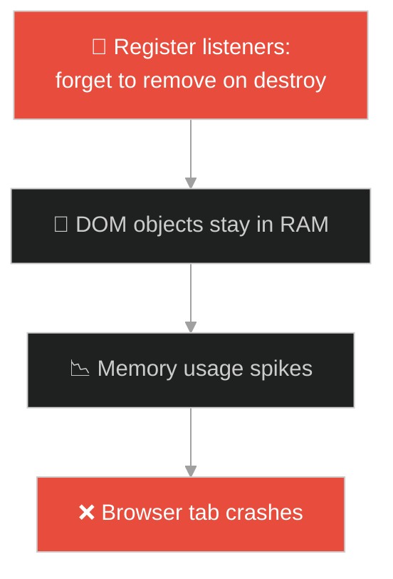
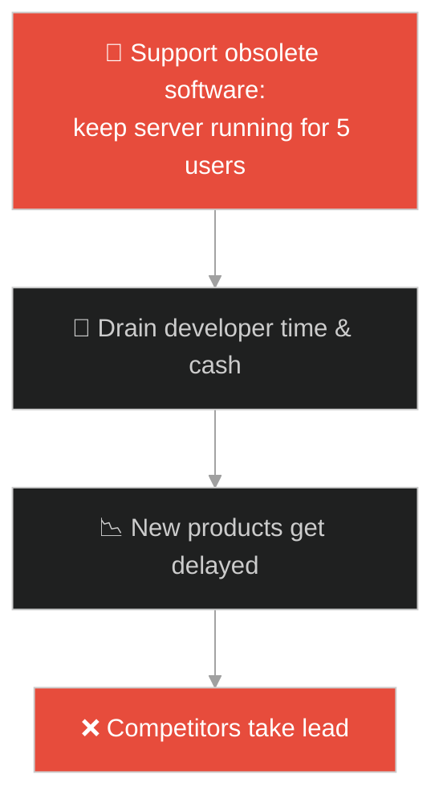
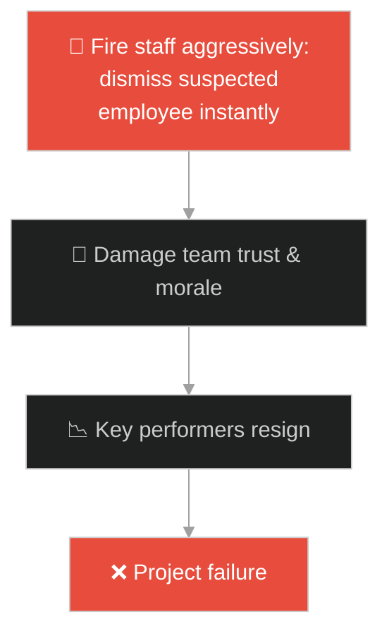
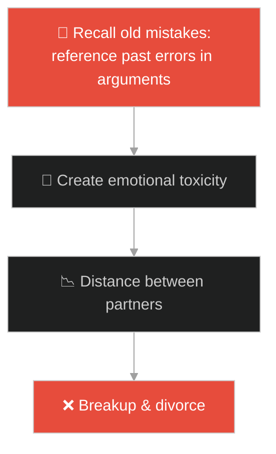
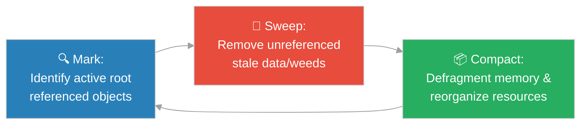

# Garbage Collection & Stale References Filter (ស្រូវសាលី និងស្មៅអាក្រក់)៖ ការបែងចែកផលល្អ និងការបោសសម្អាតកាកសំណល់ប្រព័ន្ធ (Garbage Collection & Stale References Filter & System Memory Cleanup and Stale Resource Management & Wheat and the Tares)

**Author:** ichamrong  
**Date:** 2026-05-28  
**Tags:** #jesus #garbage-collection #memory-leaks #resource-optimization #system-design #software-engineering  
**Category:** Concepts / Parables  
**Read Time:** ~15 min  

---

## 📌 មាតិកា (Table of Contents)
- [អន្ទាក់ផ្លូវចិត្ត (The Trap)](#0)
- [១. រឿងព្រេងនិទាន៖ ស្មៅអាក្រក់ក្នុងចម្ការស្រូវសាលី (The Legend of Wheat and Tares)](#1)
  - [យុទ្ធសាស្ត្រពន្យារពេលវិនិច្ឆ័យដើម្បីការពារផលល្អ (Deferred Judgment for Root Protection)](#1-1)
- [២. បញ្ហា៖ ការលេចធ្លាយអង្គចងចាំ និងការប្រញាប់សម្អាតកូដទាំងបង្ខំ (The Issue: Memory Leaks and Premature Manual Disposal)](#2)
- [៣. ឧទាហមណ៍ជាក់ស្តែងក្នុងពិភពពិត (Real World Examples)](#3)
  - [ឧទាហរណ៍ទី ១ — កម្រិតស្រាល (គ្រួសារ)៖ ការស្តុកទុករបស់ចាស់ៗក្នុងផ្ទះរហូតគ្មានកន្លែងរស់នៅ (Excessive Family Hoarding vs Scheduled Sorting)](#3-1)
  - [ឧទាហរណ៍ទី ២ — កម្រិតមធ្យម (បច្ចេកទេស)៖ ការលេចធ្លាយមេម៉ូរីដោយសារការរក្សាទុក Listeners ហួសសម័យ (Leaking Event Listeners vs WeakRef Cleanup)](#3-2)
  - [ឧទាហរណ៍ទី ៣ — កម្រិតមធ្យម (ធុរកិច្ច)៖ ការថែរក្សាផលិតផលចាស់ៗដែលលែងចំណេញនិងស៊ីធនធានក្រុមហ៊ុន (Maintaining Obsolete Products vs EOL Pruning)](#3-3)
  - [ឧទាហរណ៍ទី ៤ — កម្រិតមធ្យម (សង្គម/គ្រប់គ្រង)៖ ការដេញដោលបុគ្គលិកចេញទាំងបង្ខំបង្កផលប៉ះពាល់ដល់ស្មារតីក្រុម (Premature Firing vs Scheduled Evaluation)](#3-4)
  - [ឧទាហរណ៍ទី ៥ — កម្រិតធ្ងន់ (ទំនាក់ទំនង)៖ ការចងចាំគំនុំចាស់ៗដែលបំផ្លាញសេចក្តីសុខបច្ចុប្បន្ន (Holding Onto Emotional Grudges vs Forgiveness Sweeping)](#3-5)
- [៤. ដំណោះស្រាយទូទៅ៖ ការច្រោះទិន្នន័យហួសសម័យ និងការសម្អាតប្រព័ន្ធ (The General Solution: Garbage Collection and Mark-and-Sweep Cycles)](#4)
- [សេចក្តីសន្និដ្ឋាន (Conclusion)](#5)
- [ឯកសារយោង (References)](#6)
- [Related Posts](#7)

---

<a id="0"></a>
## អន្ទាក់ផ្លូវចិត្ត (The Trap)

តើអ្នកធ្លាប់ជួបបញ្ហាដែលប្រព័ន្ធដំណើរការកាន់តែយឺតទៅៗ ឬធនធានស្មារតីរបស់អ្នកកាន់តែចុះខ្សោយ ដោយសារតែការផ្ទុកនូវព័ត៌មាន ឬឯកសារយោងចាស់ៗដែលលែងប្រើប្រាស់ ប៉ុន្តែមិនត្រូវបានលុបបំបាត់ចោលដែរឬទេ? 

នៅក្នុងស្ថាបត្យកម្មប្រព័ន្ធ និងចិត្តសាស្ត្រ៖
* **យើងងាយនឹងធ្លាក់ក្នុងអន្ទាក់** នៃការប្រញាប់ប្រញាល់កម្ចាត់ "កាកសំណល់" ឬ "របស់អាក្រក់" ចេញភ្លាមៗដោយគ្មានផែនការច្បាស់លាស់ ដែលជាហេតុនាំឱ្យប៉ះពាល់ និងបំផ្លាញដល់រចនាសម្ព័ន្ធល្អៗដែលនៅជុំវិញវា (Premature Deletion)។
* **យើងមើលរំលង** ការពិតដែលថា ការតភ្ជាប់ ឬឯកសារយោងចាស់ៗ (Stale References) ដែលមិនត្រូវបានកាត់ផ្តាច់ នឹងបន្តស៊ីធនធានអង្គចងចាំ (Memory Leak) រហូតដល់ធ្វើឱ្យប្រព័ន្ធទាំងមូលគាំងទាំងស្រុង (Out of Memory - OOM)។

ការស្វែងរកតុល្យភាពរវាងការអត់ធ្មត់មិនបំផ្លាញរបស់ល្អ និងការបោសសម្អាតរបស់ដែលលែងប្រើប្រាស់ ហៅថា **យន្តការច្រោះឯកសារយោងហួសសម័យ (Garbage Collection and Stale References Filtering)**។

ដើម្បីយល់ដឹងពីយន្តការនេះ នេះជាផែនទីបង្ហាញផ្លូវ៖
1. **រឿងព្រេងនិទាន (The Legend)** — រឿងរ៉ាវរបស់ម្ចាស់ចម្ការដែលអត់ធ្មត់ទុកឱ្យស្មៅអាក្រក់និងស្រូវសាលីដុះលូតលាស់ជាមួយគ្នា ដើម្បីការពារឫសរបស់ស្រូវសាលី មុននឹងបែងចែកពួកវានៅរដូវចម្រូត។
2. **បញ្ហា (The Issue)** — ការវិភាគលើបញ្ហា Memory Leaks ក្នុងប្រព័ន្ធបច្ចេកវិទ្យា និងគ្រោះថ្នាក់នៃការបោសសម្អាតធនធានដោយដៃដោយគ្មានសុវត្ថិភាព។
3. **ឧទាហមណ៍ជាក់ស្តែង (Real World Examples)** — ការពិនិត្យមើលផលប៉ះពាល់ និងដំណោះស្រាយក្នុងកម្រិតគ្រួសារ បច្ចេកវិទ្យា ធុរកិច្ច ការគ្រប់គ្រង និងទំនាក់ទំនង។
4. **ដំណោះស្រាយទូទៅ (The General Solution)** — ការបង្កើតប្រព័ន្ធ Garbage Collection ស្វ័យប្រវត្តិតាមរយៈ Mark-and-Sweep និងការប្រើប្រាស់ Weak References។



---

<a id="1"></a>
## ១. រឿងព្រេងនិទាន៖ ស្មៅអាក្រក់ក្នុងចម្ការស្រូវសាលី (The Legend of Wheat and Tares)

ព្រះយេស៊ូវបានបង្រៀនអំពីមូលហេតុដែលមនុស្សអាក្រក់ នៅតែអាចរស់នៅលាយឡំជាមួយមនុស្សល្អនៅក្នុងពិភពលោក។

ទ្រង់មានបន្ទូលថា៖ *"នគរស្ថានសួគ៌ប្រៀបដូចជា បុរសម្នាក់ដែលបានយកគ្រាប់ពូជស្រូវសាលីដ៏ល្អ ទៅសាបព្រោះក្នុងចម្ការរបស់គាត់។ ប៉ុន្តែនៅពេលយប់ ពេលដែលមនុស្សកំពុងដេកលក់ សត្រូវរបស់គាត់បានលួចមកសាបព្រោះគ្រាប់ពូជ **ស្មៅអាក្រក់ (Tares/Weeds - ជាស្មៅពុលដែលដុះមកមានរូបរាងដូចស្រូវសាលីបេះបិទ)** នៅលាយឡំជាមួយស្រូវសាលីនោះ រួចក៏គេចខ្លួនបាត់ទៅ។"*

នៅពេលដែលស្រូវចាប់ផ្តើមដុះពន្លក និងចេញស្លឹក ស្មៅអាក្រក់នោះក៏ដុះឡើងមកព្រមគ្នាដែរ។

---

<a id="1-1"></a>
### យុទ្ធសាស្ត្រពន្យារពេលវិនិច្ឆ័យដើម្បីការពារផលល្អ (Deferred Judgment for Root Protection)

ពួកអ្នកបម្រើបានរត់មកសួរម្ចាស់ចម្ការថា៖ *"លោកម្ចាស់! តើលោកមិនបានព្រោះគ្រាប់ពូជល្អទេឬ? ចុះហេតុអ្វីបានជាមានស្មៅអាក្រក់ពេញចម្ការអញ្ចឹង? តើចង់ឱ្យពួកយើងទៅដកស្មៅទាំងនោះចោលឥឡូវនេះទេ?"*

ម្ចាស់ចម្ការជាមនុស្សមានប្រាជ្ញា គាត់ដឹងថាឫសរបស់ស្មៅនិងឫសរបស់ស្រូវសាលី បានចាក់ស្រាក់ចូលគ្នាអស់ហើយ។ គាត់ក៏តបថា៖ 

> **"ទេ កុំដកអី! ក្រែងលោពេលអ្នកដកស្មៅអាក្រក់ អ្នកនឹងដកទាំងដើមស្រូវសាលីជាប់មកជាមួយដែរ។ ចូរទុកឱ្យវាដុះលូតលាស់ទាំងពីរជាមួយគ្នាសិនចុះ រហូតដល់រដូវចម្រូត។"**

គាត់បានបន្តថា៖ *"ដល់រដូវច្រូតកាត់ ខ្ញុំនឹងប្រាប់អ្នកច្រូត ឱ្យប្រមូលស្មៅអាក្រក់មកចងជាបាច់ដើម្បីយកទៅដុតចោលមុន (Sweeping & Compaction)។ បន្ទាប់មក សឹមប្រមូលស្រូវសាលីដ៏ល្អយកទៅទុកក្នុងជង្រុករបស់ខ្ញុំ។"*

---

<a id="2"></a>
## ២. បញ្ហា៖ ការលេចធ្លាយអង្គចងចាំ និងការប្រញាប់សម្អាតកូដទាំងបង្ខំ (The Issue: Memory Leaks and Premature Manual Disposal)

នៅក្នុងការអភិវឌ្ឍកម្មវិធីបច្ចេកវិទ្យា ការគ្រប់គ្រងអង្គចងចាំ (Memory Management) គឺជាបេះដូងនៃស្ថិរភាពប្រព័ន្ធ៖
1. **លេចធ្លាយមេម៉ូរី (Memory Leaks)៖** កើតឡើងនៅពេលកម្មវិធីរក្សាទុកឯកសារយោងទៅកាន់វត្ថុដែលលែងប្រើប្រាស់ (Stale References) ធ្វើឱ្យ Garbage Collector មិនអាចសម្អាតពួកវាបាន។
2. **ការលុបមុនពេលកំណត់ (Dangling Pointers / Premature Freeing)៖** កើតឡើងនៅពេលវិស្វករព្យាយាមលុបបំបាត់វត្ថុមួយដោយដៃ ប៉ុន្តែវត្ថុនោះកំពុងត្រូវបានប្រើប្រាស់ដោយផ្នែកផ្សេងទៀតនៃប្រព័ន្ធ នាំឱ្យកើតមានករណី NullPointerException ឬដំណើរការខុសប្រក្រតី។

ខាងក្រោមនេះជាការប្រៀបធៀបរវាងការអនុវត្តកូដដែលបង្កហានិភ័យលេចធ្លាយទិន្នន័យ និងការអនុវត្តប្រកបដោយភាពធន់ដោយប្រើ `WeakRef` ឬការលុបបំបាត់តាមលំដាប់លំដោយ៖

### Fragile Implementation (Strong Reference Memory Leak)
កូដខាងក្រោមនេះរក្សាទុកវត្ថុប្រើប្រាស់នៅក្នុង Cache ដោយប្រើ Strong Reference ធម្មតា ដែលធ្វើឱ្យវត្ថុចាស់ៗមិនអាចលុបចេញពី Memory បានឡើយ ទោះបីជាលែងមានអ្នកប្រើប្រាស់វាក៏ដោយ៖

```typescript
// bad_cache.ts
class FragileSessionCache {
    private cache = new Map<string, any>();

    public setSession(id: string, sessionData: any): void {
        // រក្សាទុក Strong Reference ធ្វើឱ្យវត្ថុនេះមិនអាចសម្អាតបានឡើយ (Memory Leak)
        this.cache.set(id, sessionData);
    }

    public getSession(id: string): any {
        return this.cache.get(id);
    }

    // ព្យាយាមលុបដោយដៃទាំងកម្រោល អាចបង្កឱ្យមាន Null Errors លើសកម្មភាពដទៃ
    public forcePurge(id: string): void {
        this.cache.delete(id);
    }
}
```

### Resilient Implementation (Weak References & Lifecycle Filtration)
កូដខាងក្រោមនេះប្រើប្រាស់ `WeakRef` ដើម្បីអនុញ្ញាតឱ្យ Garbage Collector អាចសម្អាត Session ដែលលែងមានការប្រើប្រាស់ដទៃទៀត (No Active References) ដោយស្វ័យប្រវត្តិ៖

```typescript
// resilient_cache.ts
class ResilientSessionCache {
    // ប្រើ WeakRef ដើម្បីកុំឱ្យរារាំង Garbage Collection
    private cache = new Map<string, WeakRef<any>>();

    public setSession(id: string, sessionData: any): void {
        this.cache.set(id, new WeakRef(sessionData));
    }

    public getSession(id: string): any | null {
        const ref = this.cache.get(id);
        if (!ref) return null;

        const data = ref.deref();
        if (data === undefined) {
            // វត្ថុត្រូវបានសម្អាតដោយ Garbage Collector រួចរាល់
            this.cache.delete(id);
            return null;
        }
        return data;
    }

    // ប្រមូល និងបោសសម្អាតកូនសោដែលហួសសម័យ (Garbage Sweeper)
    public cleanStaleKeys(): void {
        for (const [key, ref] of this.cache.entries()) {
            if (ref.deref() === undefined) {
                this.cache.delete(key);
            }
        }
    }
}
```

---

<a id="3"></a>
## ៣. ឧទាហមណ៍ជាក់ស្តែងក្នុងពិភពពិត

---

<a id="3-1"></a>
### ឧទាហមណ៍ទី ១ — កម្រិតស្រាល (គ្រួសារ)៖ ការស្តុកទុករបស់ចាស់ៗក្នុងផ្ទះរហូតគ្មានកន្លែងរស់នៅ (Excessive Family Hoarding vs Scheduled Sorting)

នៅក្នុងគ្រួសារខ្លះ សមាជិកមិនព្រមបោះចោលសម្លៀកបំពាក់ចាស់ៗ ឬវត្ថុដេគ័រដែលខូចឡើយ (Stale References) ដោយគិតថា "ក្រែងលោថ្ងៃក្រោយត្រូវប្រើ"។ យូរៗទៅ ផ្ទះទាំងមូលពេញទៅដោយរបស់របរគ្មានប្រយោជន៍ រហូតលែងមានកន្លែងសម្រាប់រស់នៅប្រកបដោយផាសុកភាព។



---

<a id="3-2"></a>
### ឧទាហមណ៍ទី ២ — កម្រិតមធ្យម (បច្ចេកទេស)៖ ការលេចធ្លាយមេម៉ូរីដោយសារការរក្សាទុក Listeners ហួសសម័យ (Leaking Event Listeners vs WeakRef Cleanup)

នៅក្នុងការសរសេរកម្មវិធី Front-end Single Page Application (SPA) ប្រសិនបើវិស្វករបង្កើត Component ថ្មីៗ ហើយចុះឈ្មោះ Event Listeners ទៅកាន់ Window object តែមិនបានលុបពួកវាវិញនៅពេល Component ត្រូវបានបំផ្លាញចោល (Destroyed)។ អង្គចងចាំនឹងកើនឡើងរាល់ពេលប្តូរទំព័រ រហូតដល់ Browser គាំង។



---

<a id="3-3"></a>
### ឧទាហមណ៍ទី ៣ — កម្រិតមធ្យម (ធុរកិច្ច)៖ ការថែរក្សាផលិតផលចាស់ៗដែលលែងចំណេញនិងស៊ីធនធានក្រុមហ៊ុន (Maintaining Obsolete Products vs EOL Pruning)

ក្រុមហ៊ុនបច្ចេកវិទ្យាមួយនៅតែបន្តរក្សាទុក និងគាំទ្រ (Support) ផលិតផលកម្មវិធីជំនាន់ដំបូងបង្អស់ដែលមានអ្នកប្រើប្រាស់តែ ៥ នាក់។ ការរក្សានេះតម្រូវឱ្យមានក្រុមការងារវិស្វករ ៣ នាក់ និងម៉ាស៊ីន Server ផ្ទាល់ខ្លួន ដែលជាធនធានគួរយកទៅប្រើលើផលិតផលថ្មីៗដែលមានសក្តានុពលជាង។



---

<a id="3-4"></a>
### ឧទាហមណ៍ទី ៤ — កម្រិតមធ្យម (សង្គម/គ្រប់គ្រង)៖ ការដេញដោលបុគ្គលិកចេញទាំងបង្ខំបង្កផលប៉ះពាល់ដល់ស្មារតីក្រុម (Premature Firing vs Scheduled Evaluation)

នៅពេលមានការសង្ស័យថាមានបុគ្គលិកម្នាក់មិនសូវមានប្រសិទ្ធភាពការងារ អ្នកគ្រប់គ្រងបានសម្រេចចិត្តបណ្តេញគាត់ចេញភ្លាមៗទាំងកម្រោល (Premature Deletion)។ ការធ្វើបែបនេះដោយគ្មាននីតិវិធីច្បាស់លាស់ ធ្វើឱ្យសមាជិកដទៃទៀតដែលជា "ស្រូវសាលីល្អ" មានអារម្មណ៍ភ័យខ្លាច គ្មានសុវត្ថិភាពការងារ និងបាត់បង់ទំនុកចិត្តលើថ្នាក់ដឹកនាំ។



---

<a id="3-5"></a>
### ឧទាហមណ៍ទី ៥ — កម្រិតធ្ងន់ (ទំនាក់ទំនង)៖ ការចងចាំគំនុំចាស់ៗដែលបំផ្លាញសេចក្តីសុខបច្ចុប្បន្ន (Holding Onto Emotional Grudges vs Forgiveness Sweeping)

នៅក្នុងទំនាក់ទំនងគូស្រករ ដៃគូម្នាក់តែងតែលើកយកកំហុសឆ្គងតូចតាចតាំងពី ៥ ឆ្នាំមុនមកចោទប្រកាន់ និងឈ្លោះប្រកែកគ្នារាល់ថ្ងៃ។ ការរក្សានូវ "ឯកសារយោងនៃកំហុសចាស់ៗ" នេះ មិនអនុញ្ញាតឱ្យទំនាក់ទំនងរីកចម្រើនទៅមុខបានឡើយ និងបង្កការឈឺចាប់ផ្លូវចិត្តជាបន្តបន្ទាប់។



---

<a id="4"></a>
## ៤. ដំណោះស្រាយទូទៅ៖ ការច្រោះទិន្នន័យហួសសម័យ និងការសម្អាតប្រព័ន្ធ (The General Solution: Garbage Collection and Mark-and-Sweep Cycles)

ដើម្បីរក្សាភាពស្អាតស្អំ ស្ថិរភាព និងប្រសិទ្ធភាពធនធាន ទាំងនៅក្នុងប្រព័ន្ធបច្ចេកវិទ្យានិងជីវិត យើងត្រូវអនុវត្តយន្តការ Garbage Collection៖



ជំហាននៃការអនុវត្ត៖
1. **ដំណាក់កាល Mark (សម្គាល់របស់សកម្ម)៖** ចាប់ផ្តើមស្វែងរកពីឫសគល់ (Root References)។ រាល់វត្ថុ ឬទំនាក់ទំនងណាដែលនៅតែមានការប្រើប្រាស់ និងការភ្ជាប់ពិតប្រាកដ ត្រូវសម្គាល់ថា "សកម្ម" (Active)។
2. **ដំណាក់កាល Sweep (បោសសម្អាតរបស់អសកម្ម)៖** រាល់វត្ថុដែលគ្មានការភ្ជាប់ពី Root ទៀតឡើយ (Unreachable Objects) ត្រូវបានចាត់ទុកថាជាកាកសំណល់ (Stale References) ហើយត្រូវសម្អាតចេញពីអង្គចងចាំ។
3. **ដំណាក់កាល Compact (បង្រួមនិងរៀបចំឡើងវិញ)៖** រៀបចំទីតាំងផ្ទុកធនធានដែលនៅសេសសល់ឡើងវិញឱ្យមានរបៀបរៀបរយ ដើម្បីបង្កើនប្រសិទ្ធភាពប្រើប្រាស់ធនធាន និងការពារការបាក់បែកទីតាំងផ្ទុក (Fragmentation)។
4. **ការប្រើប្រាស់ Weak Relationships៖** ក្នុងជីវិតនិងការងារ មិនត្រូវបង្កើត Strong Attachment ឬការរំពឹងទុកខ្លាំងពេកលើរបស់មិនស្ថិតស្ថេរឡើយ ដើម្បីងាយស្រួលក្នុងការដោះលែង និងបន្តដំណើរទៅមុខ។

---

## 🐇 ធ្លាក់ចូលក្នុងរន្ធទន្សាយ (Enter the Rabbit Hole)

ដើម្បីស្វែងយល់បន្ថែមអំពីរបៀបដែលប្រព័ន្ធមួយអាចផ្តល់ឱកាសឱ្យសមាសភាគដែលមិនសូវមានប្រសិទ្ធភាពអាចដំណើរការបានមួយរយៈសិន មុននឹងសម្រេចចិត្តបណ្តេញវាចេញពីប្រព័ន្ធ តាមរយៈការប្រើប្រាស់ពេលវេលាអនុគ្រោះ និងយន្តការតាមដានសញ្ញាជីវិត សូមបន្តដំណើរទៅកាន់៖

* 🚀 **[ចាប់ផ្តើមដំណើររុករក (Start the Journey) ➔ Grace Periods & Heartbeat Monitors (ដើមល្វាគ្មានផ្លែ)៖ រយៈពេលអនុគ្រោះ និងការតាមដានសញ្ញាជីវិតរបស់ប្រព័ន្ធ](./191-jesus-and-the-barren-fig-tree.md)**

---

<a id="5"></a>
## សេចក្តីសន្និដ្ឋាន (Conclusion)

> **«កុំឱ្យការចង់កម្ចាត់របស់អាក្រក់ បំផ្លាញនូវរបស់ល្អដែលដុះក្បែរវាឡើយ»**

ការយល់ដឹងអំពីយន្តការ Garbage Collection និងការសម្អាតប្រព័ន្ធ ជួយឱ្យយើងអាចរស់នៅ និងអភិវឌ្ឍប្រព័ន្ធបច្ចេកវិទ្យាប្រកបដោយចីរភាព ដោយចេះអត់ធ្មត់ដាំដុះ និងបោសសម្អាតកាកសំណល់ចំពេលវេលាដែលត្រឹមត្រូវបំផុត។

---

<a id="6"></a>
## ឯកសារយោង (References)

* **Parable of the Wheat and the Tares (Matthew 13:24–30)** — The biblical story regarding cooperation, coexistence, and systematic deferred cleanup.
* **Jones, R., Lins, R.** — *Garbage Collection: Algorithms for Automatic Dynamic Memory Management* (1996). The definitive guide on computer memory reclamation algorithms.

---

<a id="7"></a>
## Related Posts

* [[Grace Periods & Heartbeat Monitors](./191-jesus-and-the-barren-fig-tree.md)] — របៀបផ្តល់ឱកាសទីពីរ និងការត្រួតពិនិត្យសុខភាពប្រព័ន្ធមុនការកម្ចាត់។
* [[Privilege Isolation & Sandboxed Execution](./194-jesus-and-the-rich-man-and-lazarus.md)] — ការបំបែកបរិស្ថានការងារដើម្បីកាត់បន្ថយហានិភ័យនៃកំហុសឆ្គង។
