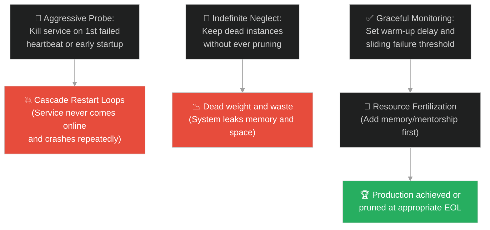
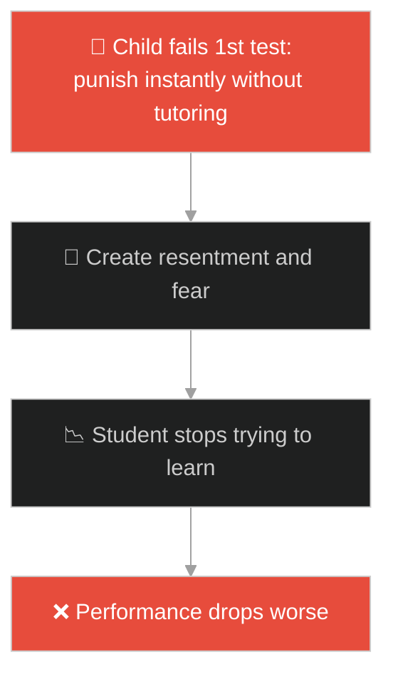
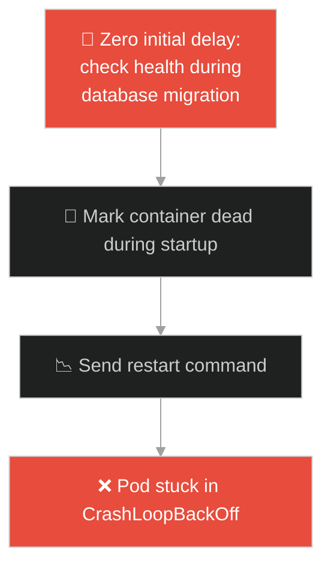
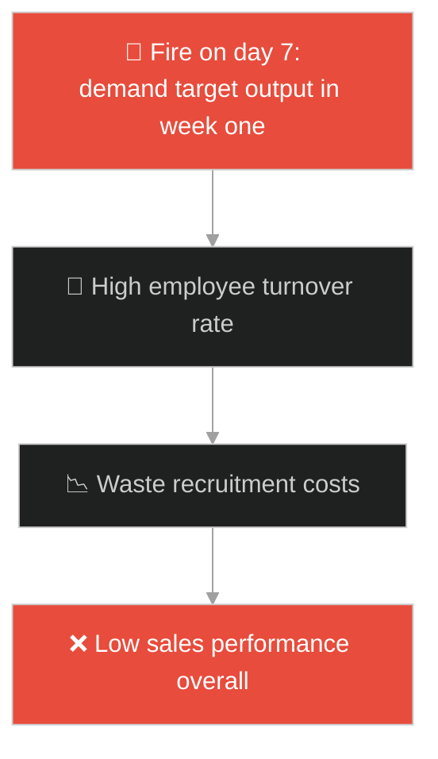
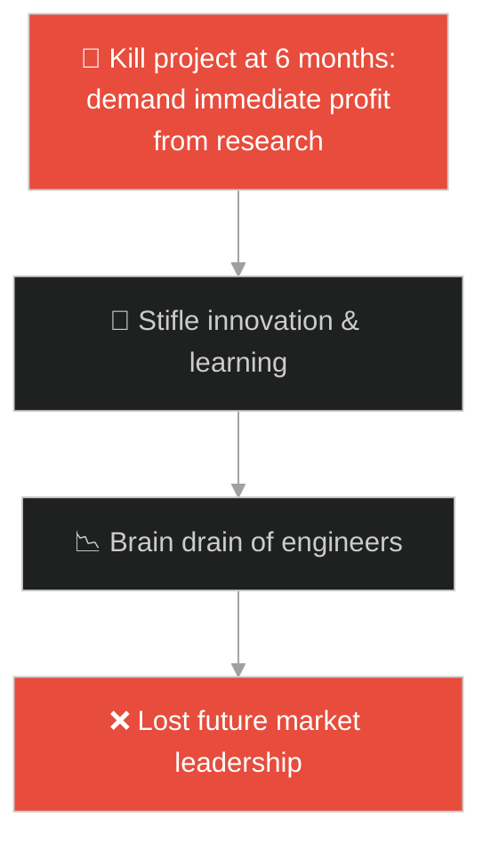
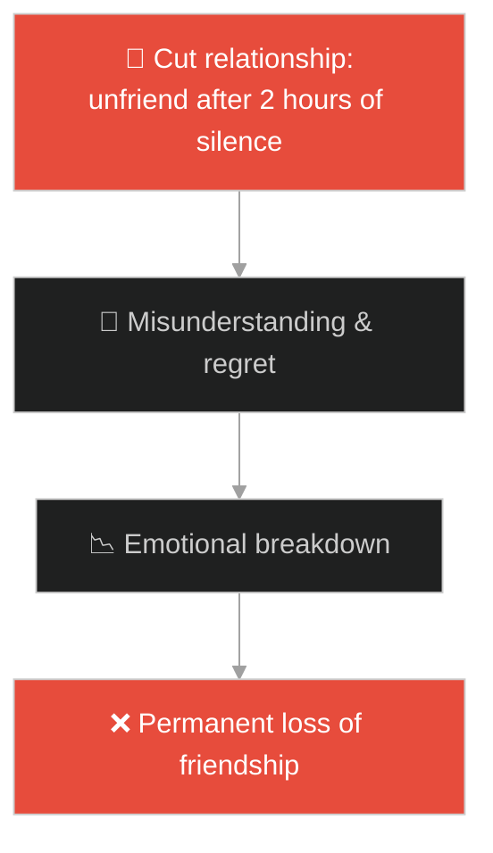
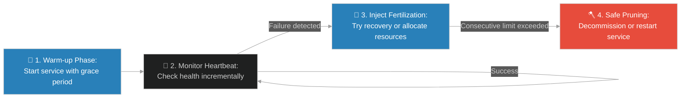

# Grace Periods & Heartbeat Monitors (ដើមល្វាគ្មានផ្លែ)៖ រយៈពេលអនុគ្រោះ និងការតាមដានសញ្ញាជីវិតរបស់ប្រព័ន្ធ (Grace Periods & Heartbeat Monitors & System Health Check and Graceful Recovery Policies & Barren Fig Tree)

**Author:** ichamrong  
**Date:** 2026-05-28  
**Tags:** #jesus #grace-period #heartbeat-monitor #health-checks #kubernetes #devops #resilience  
**Category:** Concepts / Parables  
**Read Time:** ~15 min  

---

## 📌 មាតិកា (Table of Contents)
- [អន្ទាក់ផ្លូវចិត្ត (The Trap)](#0)
- [១. រឿងព្រេងនិទាន៖ ឱកាសទីពីរសម្រាប់ដើមល្វាគ្មានផ្លែ (The Legend of the Barren Fig Tree)](#1)
  - [យុទ្ធសាស្ត្រថែទាំបន្ថែម និងការដាក់ជីបំប៉នជីវិត (Special Nurturing and Extended Monitoring)](#1-1)
- [២. បញ្ហា៖ ការវិនិច្ឆ័យសុខភាពប្រព័ន្ធខុសឆ្គង និងការសម្លាប់ការងារភ្លាមៗ (The Issue: False Positive Health Checks and Instant Kill Instability)](#2)
- [៣. ឧទាហមណ៍ជាក់ស្តែងក្នុងពិភពពិត (Real World Examples)](#3)
  - [ឧទាហរណ៍ទី ១ — កម្រិតស្រាល (គ្រួសារ)៖ ការដាក់ទណ្ឌកម្មកូនភ្លាមៗជំនួសឱ្យការផ្ដល់ជំនួយរៀនសូត្រ (Parental Instant Punishment vs Study Grace Period)](#3-1)
  - [ឧទាហរណ៍ទី ២ — កម្រិតមធ្យម (បច្ចេកទេស)៖ ការកំណត់ Liveness Probes ខ្លីពេកធ្វើឱ្យ Container ចាប់ផ្តើមឡើងវិញមិនចេះចប់ (Aggressive Kubernetes Probes vs Initial Delay)](#3-2)
  - [ឧទាហរណ៍ទី ៣ — កម្រិតមធ្យម (ធុរកិច្ច)៖ ការបណ្តេញបុគ្គលិកផ្នែកលក់សាកល្បងការងារភ្លាមៗ (Firing New Sales Reps Instantly vs 90-Day Ramp Up)](#3-3)
  - [ឧទាហរណ៍ទី ៤ — កម្រិតមធ្យម (សង្គម/គ្រប់គ្រង)៖ ការបិទគម្រោងស្រាវជ្រាវថ្មីដែលមិនទាន់បង្កើតផលចំណេញ (Killing R&D Projects vs Structured Milestone Grace)](#3-4)
  - [ឧទាហរណ៍ទី ៥ — កម្រិតធ្ងន់ (ទំនាក់ទំនង)៖ ការកាត់ផ្តាច់មិត្តភាពដោយសារតែការមិនឆ្លើយតបសារភ្លាមៗ (Instant Unfriend vs Understanding Silence Period)](#3-5)
- [៤. ដំណោះស្រាយទូទៅ៖ ការកំណត់រយៈពេលអនុគ្រោះ និងយន្តការស្តារឡើងវិញ (The General Solution: Grace Periods and Health Check Failure Thresholds)](#4)
- [សេចក្តីសន្និដ្ឋាន (Conclusion)](#5)
- [ឯកសារយោង (References)](#6)
- [Related Posts](#7)

---

<a id="0"></a>
## អន្ទាក់ផ្លូវចិត្ត (The Trap)

តើអ្នកធ្លាប់ជួបបញ្ហាដែលប្រព័ន្ធរបស់អ្នកដំណើរការមិនប្រក្រតី ឬបដិសេធសេវាកម្ម ដោយសារតែវាវិនិច្ឆ័យថាចំណុចតភ្ជាប់ណាមួយបានស្លាប់ រួចក៏កាត់ផ្តាច់វាភ្លាមៗ ទាំងដែលចំណុចនោះគ្រាន់តែត្រូវការពេលវេលាបន្តិចដើម្បីចាប់ផ្តើមការងារ (Warm-up Phase) ដែរឬទេ?

នៅក្នុងចិត្តវិទ្យា និងការគ្រប់គ្រង៖
* **យើងងាយនឹងធ្លាក់ក្នុងអន្ទាក់** នៃការរំពឹងទុកចង់បានលទ្ធផលភ្លាមៗ (Instant Gratification/Production) ហើយវាយតម្លៃកាត់សេចក្តីដោយគ្មានការអត់ធ្មត់ ធ្វើឱ្យបាត់បង់សក្តានុពលពិតប្រាកដដែលត្រូវការពេលវេលាលូតលាស់។
* **យើងមើលរំលង** សារៈសំខាន់នៃការផ្តល់ "រយៈពេលអនុគ្រោះ (Grace Period)" និង "ការដាក់ជីបំប៉នបន្ថែម" ដែលជួយឱ្យប្រព័ន្ធ ឬបុគ្គលិកអាចស្តារសមត្ថភាព និងបង្កើតលទ្ធផលឡើងវិញបាន។

ការយល់ដឹងពីរបៀបកំណត់សុខភាពប្រព័ន្ធ និងការទុកពេលសមស្របសម្រាប់ការស្តារឡើងវិញ ហៅថា **រយៈពេលអនុគ្រោះ និងការតាមដានសញ្ញាជីវិតរបស់ប្រព័ន្ធ (Grace Periods & Heartbeat Monitors)**។

ដើម្បីយល់ដឹងពីយន្តការនេះ នេះជាផែនទីបង្ហាញផ្លូវ៖
1. **រឿងព្រេងនិទាន (The Legend)** — រឿងរ៉ាវរបស់ដើមល្វាដែលមិនបង្កើតផ្លែផ្កាអស់រយៈពេល ៣ ឆ្នាំ ប៉ុន្តែទទួលបានឱកាសទីពីររយៈពេល ១ ឆ្នាំបន្ថែមពីអ្នកថែសួន។
2. **បញ្ហា (The Issue)** — ការវិភាគការបរាជ័យនៃប្រព័ន្ធត្រួតពិនិត្យសុខភាពដែលលឿនហួសហេតុ នាំឱ្យកើតមានបញ្ហាចាប់ផ្តើមឡើងវិញមិនចេះចប់ (Restart Loops)។
3. **ឧទាហមណ៍ជាក់ស្តែង (Real World Examples)** — ពិនិត្យមើលបញ្ហានេះក្នុងកម្រិតគ្រួសារ បច្ចេកវិទ្យា ធុរកិច្ច ការគ្រប់គ្រង និងទំនាក់ទំនង។
4. **ដំណោះស្រាយទូទៅ (The General Solution)** — ការអនុវត្តស្ថាបត្យកម្ម Liveness/Readiness Monitors ជាមួយនឹងការកំណត់ `initialDelaySeconds` និង `failureThreshold`។



---

<a id="1"></a>
## ១. រឿងព្រេងនិទាន៖ ដើមល្វាដែលមិនផ្លែ (The Fruitless Fig Tree)

បុរសម្នាក់បានដាំដើមល្វាមួយដើមនៅក្នុងចម្ការទំពាំងបាយជូររបស់គាត់។ ដើមល្វានោះដុះលូតលាស់មានស្លឹកខៀវស្រងាត់ មើលទៅស្រស់បំព្រងណាស់។

អស់រយៈពេល ៣ ឆ្នាំជាប់គ្នា ម្ចាស់ចម្ការតែងតែដើរមករកបេះផ្លែពីដើមល្វានោះ ប៉ុន្តែគាត់មិនដែលឃើញមានផ្លែសូម្បីតែមួយគ្រាប់។ ទីបំផុត គាត់ក៏ហៅអ្នកថែសួនមកប្រាប់ថា៖ *"មើលចុះ! អស់រយៈពេល ៣ ឆ្នាំហើយ ដែលខ្ញុំមករកផ្លែពីដើមល្វានេះ តែមិនដែលឃើញសោះ។ **កាប់វាចោលទៅ!** ទុកវានាំតែខាតដី និងស៊ីជីជាតិរបស់ដើមឈើផ្សេងៗទៀតឥតប្រយោជន៍។"*

---

<a id="1-1"></a>
### យុទ្ធសាស្ត្រថែទាំបន្ថែម និងការដាក់ជីបំប៉នជីវិត (Special Nurturing and Extended Monitoring)

អ្នកថែសួនមានក្តីអាណិតអាសូរចំពោះដើមឈើមួយដើមនេះ ក៏បានតវ៉ាប្រាប់ម្ចាស់ចម្ការថា៖ 

> *"លោកម្ចាស់! សូមអត់ធ្មត់ និងទុកវាសិនចុះ **សូមទុកពេលឱ្យវាមួយឆ្នាំទៀតទៅ (Leave it alone for one more year)**។ ក្នុងមួយឆ្នាំនេះ ខ្ញុំនឹងជីកដីជុំវិញវា ហើយដាក់ជីបំប៉នឱ្យវាជាពិសេស។"*

អ្នកថែសួនបានបន្តថា៖ *"ប្រសិនបើឆ្នាំក្រោយ វាបង្កើតផ្លែផ្កា នោះជារឿងល្អហើយ។ ប៉ុន្តែប្រសិនបើវានៅតែមិនផ្លែទៀត នោះលោកម្ចាស់ចាំកាប់វាចោល ក៏មិនទាន់ហួសពេលដែរ។"*

---

<a id="2"></a>
## ២. បញ្ហា៖ ការវិនិច្ឆ័យសុខភាពប្រព័ន្ធខុសឆ្គង និងការសម្លាប់ការងារភ្លាមៗ (The Issue: False Positive Health Checks and Instant Kill Instability)

នៅក្នុងវិស្វកម្មប្រព័ន្ធកុំព្យូទ័រ (Systems Engineering)៖
1. **កង្វះរយៈពេលចាប់ផ្តើម (Lack of Startup Warmup)៖** ប្រព័ន្ធធំៗ (ដូចជា ម៉ាស៊ីន Java JVM ឬកម្មវិធីដែលត្រូវទាញយកទិន្នន័យពី Database មកក្រាលក្នុង Cache ជាមុន) តែងត្រូវការពេលវេលាពីរបីវិនាទីទៅនាទីមុននឹងអាចឆ្លើយតបសំណើបាន។ ប្រសិនបើម៉ាស៊ីនត្រួតពិនិត្យសុខភាព (Health Checker) ចាប់ផ្តើមធ្វើតេស្តភ្លាមៗដោយគ្មានរយៈពេលអនុគ្រោះ វានឹងគិតថាដំណើរការនោះបានងាប់ រួចបញ្ជាឱ្យ Restart ភ្លាមៗ បង្កើតជា **CrashLoopBackOff**។
2. **កម្រិតអត់ធ្មត់ទាបបំផុត (Zero Tolerance Checks)៖** ប្រសិនបើប្រព័ន្ធកាត់ផ្តាច់សេវាភ្លាមៗនៅពេលបាត់បង់សញ្ញាជីវិត (Heartbeat) តែម្តង ដោយសារតែការស្ទះបណ្តាញតភ្ជាប់បណ្តោះអាសន្ន (Transient Network Latency) វានឹងធ្វើឱ្យប្រព័ន្ធទាំងមូលមិនស្ថិតស្ថេរ។

ខាងក្រោមនេះជាការប្រៀបធៀបរវាងការសរសេរប្រព័ន្ធឆែកសុខភាពដែលឆាប់ខឹង (Fragile) និងប្រព័ន្ធដែលមានរយៈពេលអនុគ្រោះ (Resilient)៖

### Fragile Implementation (Instant Shutdown on Failure)
កូដនេះសម្លាប់ដំណើរការការងាររបស់ Node ភ្លាមៗពេលដែលវាខកខានការឆ្លើយតប Heartbeat តែម្តង ដោយមិនគិតពីដំណាក់កាលចាប់ផ្តើម (Startup Grace) ឬបញ្ហាបណ្តាញឡើយ៖

```typescript
// fragile_monitor.ts
interface Node {
    id: string;
    isResponding(): boolean;
}

class FragileHeartbeatMonitor {
    public checkNodeHealth(node: Node): void {
        // ប្រសិនបើ Node មិនឆ្លើយតបភ្លាមៗ (សូម្បីតែពេលកំពុងចាប់ផ្តើមដំបូង)
        if (!node.isResponding()) {
            console.error(`[CRITICAL] Node ${node.id} failed heartbeat! Killing node...`);
            this.killNode(node.id); // សម្លាប់ចោលភ្លាមៗដោយគ្មានការអត់ធ្មត់
        }
    }

    private killNode(id: string): void {
        // លុប Node ចេញពីប្រព័ន្ធ
    }
}
```

### Resilient Implementation (Grace Period & Sliding Failure Window)
កូដនេះផ្តល់នូវរយៈពេលអនុគ្រោះ (Startup Grace Period) និងរង់ចាំឱ្យការខកខាន Heartbeat កើនឡើងហួសកម្រិតកំណត់ (Failure Threshold) ទើបវិនិច្ឆ័យថាងាប់ពិតប្រាកដ៖

```typescript
// resilient_monitor.ts
class ResilientHeartbeatMonitor {
    private failureCounts = new Map<string, number>();
    private startupTimestamps = new Map<string, number>();

    constructor(
        private readonly gracePeriodMs: number = 30000, // រយៈពេលអនុគ្រោះ ៣០ វិនាទី
        private readonly failureThreshold: number = 3    // អនុញ្ញាតឱ្យខកខាន ៣ ដង
    ) {}

    public registerNode(nodeId: string): void {
        this.startupTimestamps.set(nodeId, Date.now());
        this.failureCounts.set(nodeId, 0);
    }

    public checkNodeHealth(nodeId: string, isResponding: boolean): void {
        const startupTime = this.startupTimestamps.get(nodeId) || 0;
        const timeSinceStart = Date.now() - startupTime;

        // ១. ពិនិត្យមើលថាតើកំពុងស្ថិតក្នុងរយៈពេលអនុគ្រោះ (Grace Period) ដែរឬទេ
        if (timeSinceStart < this.gracePeriodMs) {
            console.log(`[INFO] Node ${nodeId} is in Grace Period. Ignoring failed checks.`);
            return;
        }

        // ២. ដំណើរការត្រួតពិនិត្យសុខភាពពិតប្រាកដ
        if (isResponding) {
            this.failureCounts.set(nodeId, 0); // ស្ដារសមត្ថភាពឡើងវិញ
        } else {
            const currentFailures = (this.failureCounts.get(nodeId) || 0) + 1;
            this.failureCounts.set(nodeId, currentFailures);

            console.warn(`[WARN] Node ${nodeId} missed heartbeat. Failures: ${currentFailures}/${this.failureThreshold}`);

            // ៣. សម្រេចចិត្តសម្លាប់លុះត្រាតែហួសកំណត់
            if (currentFailures >= this.failureThreshold) {
                console.error(`[CRITICAL] Node ${nodeId} exceeded failure threshold. Pruning...`);
                this.killNode(nodeId);
            }
        }
    }

    private killNode(id: string): void {
        this.failureCounts.delete(id);
        this.startupTimestamps.delete(id);
    }
}
```

---

<a id="3"></a>
## ៣. ឧទាហមណ៍ជាក់ស្តែងក្នុងពិភពពិត

---

<a id="3-1"></a>
### ឧទាហមណ៍ទី ១ — កម្រិតស្រាល (គ្រួសារ)៖ ការដាក់ទណ្ឌកម្មកូនភ្លាមៗជំនួសឱ្យការផ្ដល់ជំនួយរៀនសូត្រ (Parental Instant Punishment vs Study Grace Period)

ឪពុកម្តាយខ្លះដាក់ទណ្ឌកម្ម និងស្តីបន្ទោសកូនយ៉ាងខ្លាំងភ្លាមៗនៅពេលឃើញកូនប្រឡងធ្លាក់មុខវិជ្ជាគណិតវិទ្យាលើកដំបូង។ ជំនួសឱ្យការស្វែងយល់ថាហេត្វអ្វី និងជួលគ្រូបង្រៀនបន្ថែម (ដាក់ជីបំប៉ន) ពួកគេបានកាត់លុយនិងទូរស័ព្ទភ្លាមៗ ធ្វើឱ្យកូនកាន់តែបាក់ទឹកចិត្ត និងមិនចង់រៀនសូត្របន្ត។



---

<a id="3-2"></a>
### ឧទាហមណ៍ទី ២ — កម្រិតមធ្យម (បច្ចេកទេស)៖ ការកំណត់ Liveness Probes ខ្លីពេកធ្វើឱ្យ Container ចាប់ផ្តើមឡើងវិញមិនចេះចប់ (Aggressive Kubernetes Probes vs Initial Delay)

នៅក្នុងការរៀបចំប្រព័ន្ធ Kubernetes Pods ប្រសិនបើអ្នកកំណត់ឱ្យប្រព័ន្ធឆែក Liveness Probe រៀងរាល់ ១ វិនាទី ចាប់ពីវិនាទីដំបូងដែល Pod បង្កើតឡើង ដោយមិនបានកំណត់ `initialDelaySeconds`។ ដោយសារតែ Pod ត្រូវការពេល ១០ វិនាទីដើម្បីទាញទិន្នន័យ (Database Migration) វានឹងត្រូវ Kubernetes សម្លាប់ចោល និង Restart ជាបន្តបន្ទាប់ឥតឈប់ឈរ។



---

<a id="3-3"></a>
### ឧទាហមណ៍ទី ៣ — កម្រិតមធ្យម (ធុរកិច្ច)៖ ការបណ្តេញបុគ្គលិកផ្នែកលក់សាកល្បងការងារភ្លាមៗ (Firing New Sales Reps Instantly vs 90-Day Ramp Up)

ក្រុមហ៊ុនមួយបានជួលបុគ្គលិកផ្នែកលក់ (Sales Representative) ថ្មីម្នាក់។ ជំនួសឱ្យការផ្តល់រយៈពេលសាកល្បងការងារ ៩០ ថ្ងៃ និងបណ្តុះបណ្តាល (Ramp-up grace) ពួកគេបានបណ្តេញគាត់ចេញភ្លាមៗពេលដែលគាត់លក់មិនដាច់ក្នុងសប្តាហ៍ទី ១។ ក្រុមហ៊ុនត្រូវចំណាយលុយរើសបុគ្គលិកថ្មីមិនចេះចប់មិនចេះហើយ ដោយគ្មាននរណាម្នាក់អាចសម្របខ្លួនទាន់ពេលឡើយ។



---

<a id="3-4"></a>
### ឧទាហមណ៍ទី ៤ — កម្រិតមធ្យម (សង្គម/គ្រប់គ្រង)៖ ការបិទគម្រោងស្រាវជ្រាវថ្មីដែលមិនទាន់បង្កើតផលចំណេញ (Killing R&D Projects vs Structured Milestone Grace)

នាយកប្រតិបត្តិម្នាក់បានបញ្ជាឱ្យលុបចោលគម្រោងស្រាវជ្រាវនិងអភិវឌ្ឍន៍ (R&D) ផលិតផលថ្មីមួយភ្លាមៗ បន្ទាប់ពីវាដំណើរការបាន ៦ ខែ ដោយសារតែវាមិនទាន់អាចបង្កើតចំណូលបានភ្លាមៗ។ គាត់បានមើលរំលងថាគម្រោងនេះត្រូវការពន្យារពេល ១ ឆ្នាំបន្ថែមទៀត និងត្រូវការថវិកាស្រាវជ្រាវ (ជីជាតិ) ដើម្បីចម្រាញ់យកបច្ចេកវិទ្យាឈានមុខគេ ដែលអាចបង្កើតផលចំណេញរាប់លាននាពេលអនាគត។



---

<a id="3-5"></a>
### ឧទាហមណ៍ទី ៥ — កម្រិតធ្ងន់ (ទំនាក់ទំនង)៖ ការកាត់ផ្តាច់មិត្តភាពដោយសារតែការមិនឆ្លើយតបសារភ្លាមៗ (Instant Unfriend vs Understanding Silence Period)

មនុស្សម្នាក់បានផ្ញើសារទៅកាន់មិត្តភក្តិជិតស្និទ្ធរបស់ខ្លួន។ នៅពេលដែលឃើញមិត្តភក្តិអានសារហើយមិនទាន់ឆ្លើយតបក្នុងរយៈពេល ២ ម៉ោង គាត់ក៏យល់ច្រឡំថាគេលែងរាប់អាន រួចក៏ផ្ដាច់មិត្តភាពភ្លាមៗ។ គាត់មិនបានដឹងថា មិត្តភក្តិរបស់គាត់កំពុងមានបញ្ហាបន្ទាន់ក្នុងគ្រួសារ (Transient Connection Outage) ដែលត្រូវការពន្យារពេលឆ្លើយតបនោះឡើយ។



---

<a id="4"></a>
## ៤. ដំណោះស្រាយទូទៅ៖ ការកំណត់រយៈពេលអនុគ្រោះ និងយន្តការស្តារឡើងវិញ (The General Solution: Grace Periods and Health Check Failure Thresholds)

ដើម្បីរចនាប្រព័ន្ធដែលមានភាពធន់ខ្ពស់ និងអាចស្តារស្ថានភាពឡើងវិញបាន យើងត្រូវបង្កើតយន្តការត្រួតពិនិត្យសុខភាពប្រកបដោយការអនុគ្រោះ៖



ជំហាននៃការអនុវត្ត៖
1. **ការអនុវត្ត Startup Grace Period៖** ត្រូវតែមានពេលវេលាជាក់លាក់មួយដែលប្រព័ន្ធមិនត្រូវឆែក Liveness ឡើយ (ដូចជា `initialDelaySeconds: 45`) ដើម្បីទុកពេលឱ្យប្រព័ន្ធរៀបចំខ្លួន (Initialize)។
2. **ការប្រើប្រាស់ Sliding Windows និង Thresholds៖** កុំសម្លាប់ការងារភ្លាមៗ។ ត្រូវកំណត់ចំនួនខកខានដែលអាចអនុញ្ញាតបាន (ឧទាហរណ៍ `failureThreshold: 3` ឬ `5`) ដើម្បីត្រងយកតែការបរាជ័យពិតប្រាកដ (Persistent Failures) និងចម្រោះការស្ទះបណ្តាញបណ្តោះអាសន្ន។
3. **យុទ្ធសាស្ត្រ "ដាក់ជី" (Resource Fertilization)៖** នៅពេលប្រព័ន្ធ ឬបុគ្គលិកដំណើរការយឺត ត្រូវមានដំណាក់កាលអន្តរាគមន៍ដោះស្រាយ (ដូចជា ការបកក្រោយការកំណត់សាកល្បង - Revert Configuration, ឬការបង្វឹកការងារបន្ថែម - Mentorship) មុននឹងសម្រេចចិត្តបិទវាចោល។
4. **ការត្រួតពិនិត្យសកម្មភាពជំនួសឱ្យពាក្យសម្តី (Action-Based Evaluation)៖** វាយតម្លៃប្រព័ន្ធ និងមនុស្សដោយផ្អែកលើទិន្នន័យជាក់ស្តែង និងលទ្ធផលចុងក្រោយ មិនមែនផ្អែកលើការស្ទង់មតិមិនច្បាស់លាស់ឡើយ។

---

## 🐇 ធ្លាក់ចូលក្នុងរន្ធទន្សាយ (Enter the Rabbit Hole)

ដើម្បីស្វែងយល់បន្ថែមអំពីរបៀបដែលប្រព័ន្ធដែលទទួលបានសំណើច្រើនលើសលប់ពីអ្នកប្រើប្រាស់ អាចដោះស្រាយបានដោយការប៉ុនប៉ងឡើងវិញជាលំដាប់ ដោយមិនបណ្តាលឱ្យប្រព័ន្ធបម្រើសេវាកម្មដួលរលំ តាមរយៈយុទ្ធសាស្ត្រពន្យារពេលថយក្រោយ សូមបន្តដំណើរទៅកាន់៖

* 🚀 **[ចាប់ផ្តើមដំណើររុករក (Start the Journey) ➔ Exponential Backoff & Retry Policies (ស្រ្តីមេម៉ាយ និងចៅក្រមអយុត្តិធម៌)៖ ការប៉ុនប៉ងឡើងវិញជាលំដាប់ និងយុទ្ធសាស្ត្រមិនបោះបង់](./192-jesus-and-the-unjust-judge.md)**

---

<a id="5"></a>
## សេចក្តីសន្និដ្ឋាន (Conclusion)

> **«ស្លឹកនិងមែកអាចបញ្ឆោតភ្នែកមនុស្សបាន តែវាគឺ "ផ្លែផ្កា" ក្រោមរយៈពេលអនុគ្រោះត្រឹមត្រូវ ដែលបញ្ជាក់ពីតម្លៃពិត»**

ការផ្តល់ឱកាសទីពីររួមជាមួយការជួយជ្រោមជ្រែងដ៏ត្រឹមត្រូវ ជួយឱ្យយើងរក្សាបាននូវសមាសភាគល្អៗក្នុងប្រព័ន្ធ កាត់បន្ថយការចំណាយខ្ជះខ្ជាយ និងធានាបាននូវការលូតលាស់ប្រកបដោយចីរភាពយូរអង្វែង។

---

<a id="6"></a>
## ឯកសារយោង (References)

* **Parable of the Barren Fig Tree (Luke 13:6–9)** — The foundational teaching on systematic patience, grace periods, and resource allocation before decommissioning.
* **Kubernetes Documentation** — *Configure Liveness, Readiness and Startup Probes*. The industry standard guideline for container lifecycle monitoring.

---

<a id="7"></a>
## Related Posts

* [[Exponential Backoff & Retry Policies](./192-jesus-and-the-unjust-judge.md)] — យុទ្ធសាស្ត្រស៊ូទ្រាំព្យាយាមម្តងហើយម្តងទៀត ជាមួយនឹងការពន្យារពេលឆ្លាតវៃ។
* [[Fallback Routing & Dynamic Load Redirection](./193-jesus-and-the-great-banquet.md)] — របៀបបង្វែរទិសដៅការងារនៅពេលសមាសភាគចម្បងជួបបញ្ហា។
