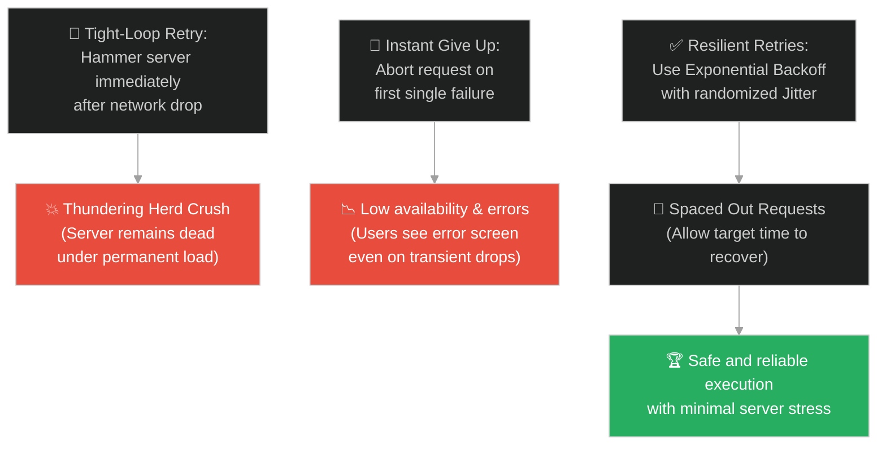
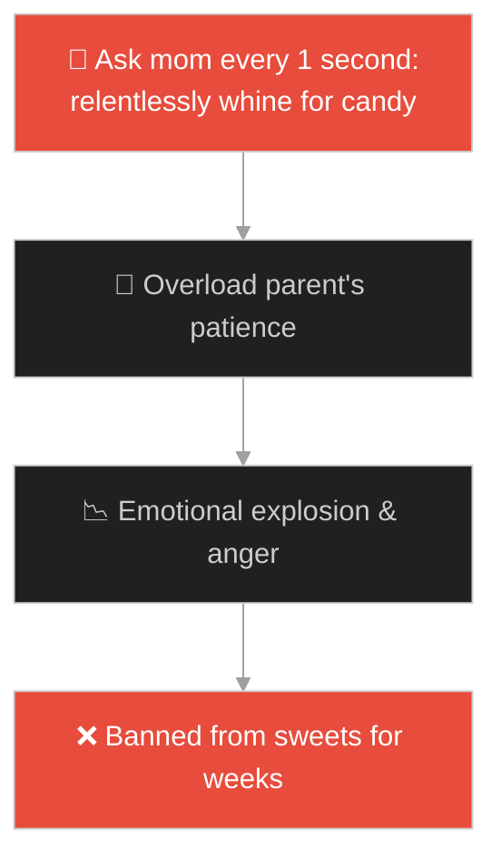
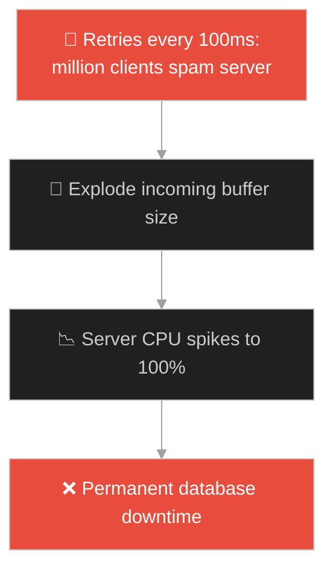
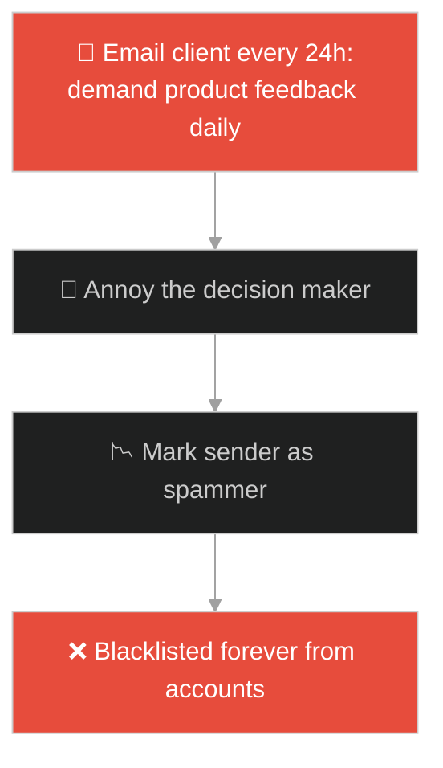
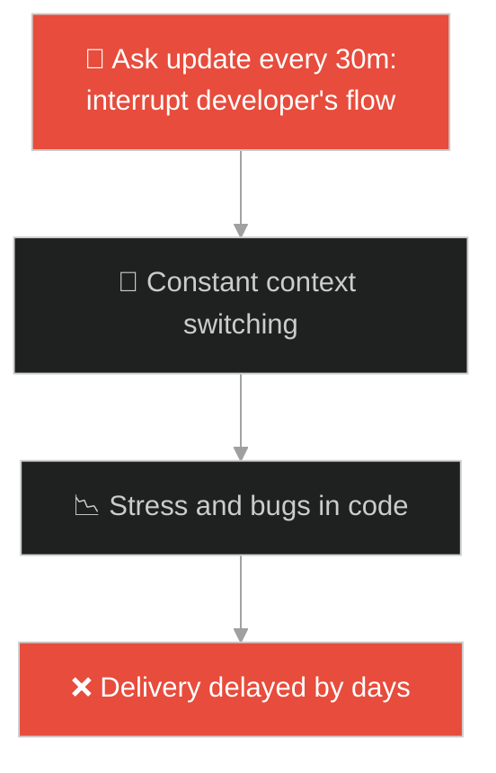
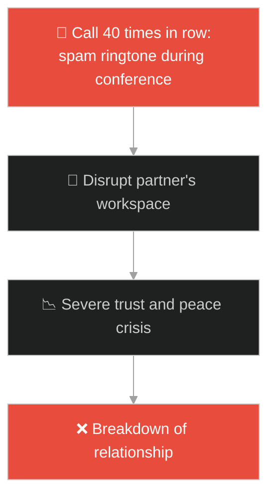
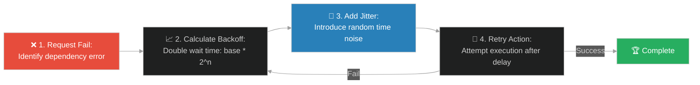

# Exponential Backoff & Retry Policies (ស្រ្តីមេម៉ាយ និងចៅក្រមអយុត្តិធម៌)៖ ការប៉ុនប៉ងឡើងវិញជាលំដាប់ និងយុទ្ធសាស្ត្រមិនបោះបង់ (Exponential Backoff & Retry Policies & Network Request Retries and Congestion Avoidance & Persistent Widow)

**Author:** ichamrong  
**Date:** 2026-05-28  
**Tags:** #jesus #grit #exponential-backoff #retry-policies #network-congestion #system-stability #persistence  
**Category:** Concepts / Parables  
**Read Time:** ~15 min  

---

## 📌 មាតិកា (Table of Contents)
- [អន្ទាក់ផ្លូវចិត្ត (The Trap)](#0)
- [១. រឿងព្រេងនិទាន៖ ស្ត្រីមេម៉ាយក្រីក្រ និងចៅក្រមគ្មានធម៌មេត្តា (The Legend of the Persistent Widow)](#1)
  - [ឥទ្ធិពលនៃការជជីកសួរ និងការបង្ខំឱ្យឆ្លើយតប (Persistence under Relentless Request Pressure)](#1-1)
- [២. បញ្ហា៖ ការវាយប្រហារខ្លួនឯងដោយការប៉ុនប៉ងឥតឈប់ឈរ (The Issue: Self-Induced DDoS and the Thundering Herd Problem)](#2)
- [៣. ឧទាហមណ៍ជាក់ស្តែងក្នុងពិភពពិត (Real World Examples)](#3)
  - [ឧទាហរណ៍ទី ១ — កម្រិតស្រាល (គ្រួសារ)៖ កូនក្មេងទាមទារចង់បានស្ករគ្រាប់មិនចេះចប់ (Child Whining Repeatedly vs Spaced Request Intervals)](#3-1)
  - [ឧទាហរណ៍ទី ២ — កម្រិតមធ្យម (បច្ចេកទេស)៖ កម្មវិធីទូរស័ព្ទបាញ់ Request ទៅម៉ាស៊ីនមេដែលកំពុងគាំង (Mobile App Tight-Loop Retries vs Backoff with Jitter)](#3-2)
  - [ឧទាហរណ៍ទី ៣ — កម្រិតមធ្យម (ធុរកិច្ច)៖ ភ្នាក់ងារលក់ផ្ញើអ៊ីមែលទៅអតិថិជនរាល់ថ្ងៃរហូតត្រូវ Block (Sales Rep Spamming Leads vs Nurturing Sequences)](#3-3)
  - [ឧទាហរណ៍ទី ៤ — កម្រិតមធ្យម (សង្គម/គ្រប់គ្រង)៖ អ្នកគ្រប់គ្រងសួរដេញដោលបុគ្គលិករៀងរាល់ម៉ោង (Micromanaging Status Syncs vs Milestone Check-ins)](#3-4)
  - [ឧទាហរណ៍ទី ៥ — កម្រិតធ្ងន់ (ទំនាក់ទំនង)៖ ការទូរស័ព្ទទៅដៃគូដែលកំពុងជាប់រវល់រាប់សិបដង (Spam Calling During Meetings vs Adaptive Spaced Communication)](#3-5)
- [៤. ដំណោះស្រាយទូទៅ៖ ការអនុវត្ត Exponential Backoff រួមជាមួយ Jitter (The General Solution: Designing Safe Backoff Intervals and Jitter Algorithms)](#4)
- [សេចក្តីសន្និដ្ឋាន (Conclusion)](#5)
- [ឯកសារយោង (References)](#6)
- [Related Posts](#7)

---

<a id="0"></a>
## អន្ទាក់ផ្លូវចិត្ត (The Trap)

តើអ្នកធ្លាប់ជួបបញ្ហាដែលប្រព័ន្ធដួលរលំទាំងស្រុងភ្លាមៗនៅពេលវាព្យាយាមដំណើរការឡើងវិញ ដោយសារតែអតិថិជនរាប់ម៉ឺននាក់ព្យាយាមបាញ់សំណើ (Requests) ចូលមកក្នុងពេលតែមួយដោយគ្មានការបង្អង់ឡើយ (Thundering Herd) ដែរឬទេ?

នៅក្នុងប្រព័ន្ធបច្ចេកវិទ្យា និងការប្រាស្រ័យទាក់ទង៖
* **យើងងាយនឹងធ្លាក់ក្នុងអន្ទាក់** នៃការប៉ុនប៉ងឡើងវិញភ្លាមៗ (Immediate Tight-Loop Retry) ពេលជួបការបដិសេធ ដែលជាហេតុធ្វើឱ្យម៉ាស៊ីនទទួលរងសម្ពាធខ្លាំងរហូតគាំង ឬដួលស្លាប់ទាំងស្រុង (Self-Induced Denial of Service)។
* **យើងមើលរំលង** សារៈសំខាន់នៃការសម្របសម្រួលពេលវេលា និងការពន្យារពេលជាលំដាប់ (Exponential Backoff) ដែលអនុញ្ញាតឱ្យប្រព័ន្ធម្ខាងទៀតមានពេលសម្រាក និងរៀបចំខ្លួនឡើងវិញ។

ការស្វែងរកតុល្យភាពរវាងភាពស្វិតស្វាញក្នុងការប៉ុនប៉ង និងការរក្សាស្ថិរភាពប្រព័ន្ធ ហៅថា **គោលការណ៍ពន្យារពេលប៉ុនប៉ងឡើងវិញជាលំដាប់ (Exponential Backoff & Retry Policies)**។

ដើម្បីយល់ដឹងពីគោលការណ៍នេះ នេះជាផែនទីបង្ហាញផ្លូវ៖
1. **រឿងព្រេងនិទាន (The Legend)** — រឿងរ៉ាវរបស់ស្ត្រីមេម៉ាយដែលព្យាយាមទាមទារយុត្តិធម៌ពីចៅក្រមចិត្តអាក្រក់ដោយមិនបោះបង់ រហូតដល់ចៅក្រមទ្រាំមិនបានក៏ព្រមកាត់ក្តីឱ្យ។
2. **បញ្ហា (The Issue)** — ការវិភាគគណិតវិទ្យានៃបញ្ហា Thundering Herd និងហានិភ័យនៃការបាញ់ Request ផ្ទួនៗគ្នា (Network Flooding)។
3. **ឧទាហមណ៍ជាក់ស្តែង (Real World Examples)** — ពិនិត្យមើលបញ្ហានេះក្នុងកម្រិតគ្រួសារ បច្ចេកវិទ្យា ធុរកិច្ច ការគ្រប់គ្រង និងទំនាក់ទំនង។
4. **ដំណោះស្រាយទូទៅ (The General Solution)** — ការបង្កើតកូដ Retry ជាមួយនឹងការបន្ថែម Jitter (ភាពមិនច្បាស់លាស់នៃពេលវេលា) ដើម្បីការពារការប៉ះទង្គិចគ្នា។



---

<a id="1"></a>
## ១. រឿងព្រេងនិទាន៖ ស្ត្រីមេម៉ាយក្រីក្រ និងចៅក្រមគ្មានធម៌មេត្តា (The Legend of the Persistent Widow)

នៅក្នុងទីក្រុងមួយ មានចៅក្រមម្នាក់ដែល **មិនកោតខ្លាចព្រះ និងមិនខ្វល់ខ្វាយពីមនុស្សទាល់តែសោះ (Unjust Judge)**។ គាត់ច្រើនតែកាត់ក្តីដោយលម្អៀង ឬស៊ីសំណូកពីអ្នកមានអំណាច។

នៅក្នុងក្រុងនោះដែរ មានស្ត្រីមេម៉ាយក្រីក្រម្នាក់ ដែលត្រូវបានគេធ្វើបាប និងរំលោភបំពានសិទ្ធិ។ នាងតែងតែមករកចៅក្រមនោះរាល់ថ្ងៃ ដោយស្រែកអង្វរថា៖ *"សូមជួយរកយុត្តិធម៌ឱ្យខ្ញុំ ទាស់នឹងសត្រូវរបស់ខ្ញុំផង!"* ដោយសារនាងគ្មានលុយនិងគ្មានខ្សែ ចៅក្រមក៏តែងតែបដិសេធ និងមិនព្រមដោះស្រាយរឿងក្តីឱ្យនាងសោះ។

---

<a id="1-1"></a>
### ឥទ្ធិពលនៃការជជីកសួរ និងការបង្ខំឱ្យឆ្លើយតប (Persistence under Relentless Request Pressure)

ទោះបីជាត្រូវគេបដិសេធម្តងហើយម្តងទៀតក៏ដោយ ក៏ស្ត្រីមេម៉ាយនោះមិនព្រមបោះបង់ចោលឡើយ។ នាងនៅតែមករកចៅក្រមនោះរាល់ថ្ងៃ អង្វររាល់ថ្ងៃ រហូតដល់ចៅក្រមចាប់ផ្តើមធុញទ្រាន់ និងមានសម្ពាធផ្លូវចិត្តយ៉ាងខ្លាំង។

ទីបំផុត ចៅក្រមនោះបានគិតក្នុងចិត្តថា៖ 

> *"ទោះបីជាខ្ញុំមិនខ្លាចព្រះ ហើយមិនខ្វល់ពីមនុស្សក៏ដោយ តែដោយសារស្ត្រីមេម៉ាយនេះមករំខានខ្ញុំរាល់ថ្ងៃ ធ្វើឱ្យខ្ញុំហត់នឿយនិងធុញថប់ពេក អញ្ចឹងខ្ញុំនឹងជួយរកយុត្តិធម៌ឱ្យនាងចុះ ដើម្បីកុំឱ្យនាងមកតាមទាមទាររហូតដល់ខ្ញុំឆ្កួតអញ្ចឹងទៀត!"*

ព្រះយេស៊ូវបញ្ជាក់ថា៖ ប្រសិនបើសូម្បីតែចៅក្រមអយុត្តិធម៌ ក៏ព្រមជួយនាងដោយសារតែការតស៊ូមិនចុះចាញ់ ចុះទម្រាំប្រព័ន្ធច្បាប់ ឬសកលលោក តើនឹងមិនបើកទ្វារឱ្យអ្នកដែលមិនព្រមបោះបង់នោះទេឬ?

---

<a id="2"></a>
## ២. បញ្ហា៖ ការវាយប្រហារខ្លួនឯងដោយការប៉ុនប៉ងឥតឈប់ឈរ (The Issue: Self-Induced DDoS and the Thundering Herd Problem)

នៅក្នុងស្ថាបត្យកម្មប្រព័ន្ធចែករំលែក (Distributed Systems)៖
1. **ការវាយប្រហារដោយខ្លួនឯង (Self-Inflicted Outage)៖** នៅពេលដែល Database ឬ Microservice ណាមួយដួលរលំបណ្តោះអាសន្ន រាល់សំណើ (Requests) ទាំងអស់នឹងត្រូវបរាជ័យ។ ប្រសិនបើកម្មវិធី Client ទាំងអស់ព្យាយាមផ្ញើសំណើឡើងវិញភ្លាមៗ (Immediate Retry Loop) នោះ Database ដែលទើបតែងើបឡើងវិញ នឹងត្រូវដួលរលំម្តងទៀតដោយសារកម្លាំងសំណើដ៏ច្រើនលើសលប់។
2. **ការប្រមូលផ្តុំសំណើក្នុងវិនាទីតែមួយ (Synchronized Retries)៖** បើគ្មាន Jitter (ការកែប្រែរយៈពេលចៃដន្យ) ទេនោះ ម៉ាស៊ីន Client ទាំងអស់នឹងបាញ់ Retry នៅរាល់ចន្លោះពេលដូចៗគ្នា (ឧទាហរណ៍ រៀងរាល់ ១ វិនាទី ឬ ២ វិនាទីបេះបិទ) បង្កជាបញ្ហារលកយក្សបោកបក់លើ Server។

### Fragile Implementation (Immediate Tight Loop Retries)
កូដខាងក្រោមនេះព្យាយាម Retry ការតភ្ជាប់បណ្តាញភ្លាមៗនៅពេលមានកំហុស ដោយគ្មានការបង្អង់ពេលវេលាឡើយ ដែលអាចបំផ្លាញ Server៖

```typescript
// fragile_retry.ts
import { makeNetworkRequest } from './api';

export async function fetchWithFragileRetry(url: string): Promise<any> {
    const maxRetries = 5;
    let attempt = 0;

    while (attempt < maxRetries) {
        try {
            attempt++;
            return await makeNetworkRequest(url);
        } catch (error) {
            console.warn(`[WARN] Attempt ${attempt} failed. Retrying immediately!`);
            // គ្មានការពន្យារពេល (Sleep/Delay) ឡើយ នាំឱ្យបោកបក់ទិន្នន័យលើសលប់
            if (attempt >= maxRetries) {
                throw new Error("Max retries reached. Service unavailable.");
            }
        }
    }
}
```

### Resilient Implementation (Exponential Backoff with Jitter)
កូដខាងក្រោមនេះប្រើប្រាស់រូបមន្តស្វ័យគុណ $T = \text{base} \times 2^{\text{attempt}}$ និងបន្ថែម Jitter ចៃដន្យ ដើម្បីចែកចាយពេលវេលាផ្ញើសំណើឱ្យនៅដាច់ពីគ្នា៖

```typescript
// resilient_retry.ts
import { makeNetworkRequest } from './api';

export async function fetchWithResilientRetry(
    url: string,
    maxRetries: number = 5,
    baseDelayMs: number = 1000,
    maxDelayMs: number = 16000
): Promise<any> {
    let attempt = 0;

    while (true) {
        try {
            attempt++;
            return await makeNetworkRequest(url);
        } catch (error) {
            if (attempt >= maxRetries) {
                throw new Error(`[ERROR] Max retries (${maxRetries}) exceeded. Process aborted.`);
            }

            // ១. គណនា Exponential Backoff: base * 2^attempt
            const expDelay = baseDelayMs * Math.pow(2, attempt);
            const cappedDelay = Math.min(expDelay, maxDelayMs);

            // ២. បន្ថែម Full Jitter ចៃដន្យដើម្បីការពារការបាញ់ស្របគ្នា (Collision Avoidance)
            const jitterDelay = Math.random() * cappedDelay;

            console.warn(`[RETRY] Attempt ${attempt} failed. Retrying in ${jitterDelay.toFixed(0)}ms...`);
            
            // ៣. រង់ចាំពេលវេលាមុននឹងប៉ុនប៉ងម្តងទៀត
            await new Promise(resolve => setTimeout(resolve, jitterDelay));
        }
    }
}
```

---

<a id="3"></a>
## ៣. ឧទាហមណ៍ជាក់ស្តែងក្នុងពិភពពិត

---

<a id="3-1"></a>
### ឧទាហមណ៍ទី ១ — កម្រិតស្រាល (គ្រួសារ)៖ កូនក្មេងទាមទារចង់បានស្ករគ្រាប់មិនចេះចប់ (Child Whining Repeatedly vs Spaced Request Intervals)

កូនក្មេងម្នាក់ចង់ញ៉ាំស្ករគ្រាប់ ហើយសួរម្តាយរបស់ខ្លួនរៀងរាល់ ១ វិនាទី៖ *"ម៉ាក់សុំស្ករគ្រាប់! ម៉ាក់សុំស្ករគ្រាប់! ម៉ាក់សុំស្ករគ្រាប់!"*។ ដោយសារសម្ពាធRequest លឿនពេក ម្តាយខឹងយ៉ាងខ្លាំង រួចក៏វាយកូន និងហាមឃាត់មិនឱ្យញ៉ាំស្ករគ្រាប់ពេញមួយសប្តាហ៍។



---

<a id="3-2"></a>
### ឧទាហមណ៍ទី ២ — កម្រិតមធ្យម (បច្ចេកទេស)៖ កម្មវិធីទូរស័ព្ទបាញ់ Request ទៅម៉ាស៊ីនមេដែលកំពុងគាំង (Mobile App Tight-Loop Retries vs Backoff with Jitter)

នៅពេលដែលម៉ាស៊ីន Server របស់ធនាគារជួបបញ្ហាគាំងរយៈពេល ៥ នាទី។ កម្មវិធីទូរស័ព្ទរបស់អ្នកប្រើប្រាស់ ១ លាននាក់មិនទទួលបានចម្លើយ ក៏ចាប់ផ្តើមបាញ់សំណើ Retry រៀងរាល់ ១០០ មីលីវិនាទី។ នៅពេលវិស្វករព្យាយាម Start ម៉ាស៊ីនឡើងវិញ សំណើទាំង ១ លានដែលកំពុងរង់ចាំ បានបោកបក់ចូលមកភ្លាមៗ ធ្វើឱ្យ Server គាំងម្តងទៀតមិនអាចងើបបានឡើយ។



---

<a id="3-3"></a>
### ឧទាហមណ៍ទី ៣ — កម្រិតមធ្យម (ធុរកិច្ច)៖ ភ្នាក់ងារលក់ផ្ញើអ៊ីមែលទៅអតិថិជនរាល់ថ្ងៃរហូតត្រូវ Block (Sales Rep Spamming Leads vs Nurturing Sequences)

បុគ្គលិកផ្នែកលក់ម្នាក់ចង់លក់សេវាកម្មទៅឱ្យក្រុមហ៊ុនធំមួយ។ គាត់ផ្ញើអ៊ីមែលទៅកាន់នាយកក្រុមហ៊ុនជារៀងរាល់ថ្ងៃ៖ *"តើលោកបានមើលសំណើខ្ញុំឬនៅ?"*។ ដោយសារតែចន្លោះពេលខ្លីពេក នាយកក្រុមហ៊ុនមានអារម្មណ៍រំខានយ៉ាងខ្លាំង ហើយបានចុចរាយការណ៍ថាជា **Spam** និងដាក់គណនីរបស់គាត់ទៅក្នុង Blacklist ធ្វើឱ្យក្រុមហ៊ុនបាត់បង់ឱកាសលក់ជារៀងរហូត។



---

<a id="3-4"></a>
### ឧទាហមណ៍ទី ៤ — កម្រិតមធ្យម (សង្គម/គ្រប់គ្រង)៖ អ្នកគ្រប់គ្រងសួរដេញដោលបុគ្គលិករៀងរាល់ម៉ោង (Micromanaging Status Syncs vs Milestone Check-ins)

ក្នុងស្ថានភាពការងារបន្ទាន់ អ្នកគ្រប់គ្រងម្នាក់មានការបារម្ភខ្លាំង ក៏ដើរទៅសួរដេញដោលវិស្វកររៀងរាល់ ៣០ នាទីម្តង៖ *"តើធ្វើជិតរួចឬនៅ? ដល់ណាហើយ?"*។ ការរំខានផ្ទួនៗគ្នានេះធ្វើឱ្យវិស្វករបាត់បង់ការផ្តោតអារម្មណ៍ (Context Switching) បណ្តាលឱ្យការសរសេរកូដកាន់តែយឺត និងជួបកំហុសកាន់តែច្រើន។



---

<a id="3-5"></a>
### ឧទាហមណ៍ទី ៥ — កម្រិតធ្ងន់ (ទំនាក់ទំនង)៖ ការទូរស័ព្ទទៅដៃគូដែលកំពុងជាប់រវល់រាប់សិបដង (Spam Calling During Meetings vs Adaptive Spaced Communication)

នៅពេលឃើញដៃគូមិនទទួលទូរស័ព្ទ មនុស្សម្នាក់បានព្យាយាម Call ទៅម្តងហើយម្តងទៀតចំនួន ៤០ ដងជាប់ៗគ្នាដោយគ្មានការបង្អង់។ សកម្មភាពនេះធ្វើឱ្យទូរស័ព្ទដៃគូឡើងកម្ដៅខ្លាំង និងរំខានដល់កិច្ចប្រជុំការងារធំ។ ទីបំផុត ដៃគូក៏សម្រេចចិត្តបិទទូរស័ព្ទចោល និងមានជម្លោះធ្ងន់ធ្ងរនៅពេលល្ងាចដោយសារតែកង្វះការយល់យោគ។



---

<a id="4"></a>
## ៤. ដំណោះស្រាយទូទៅ៖ ការអនុវត្ត Exponential Backoff រួមជាមួយ Jitter (The General Solution: Designing Safe Backoff Intervals and Jitter Algorithms)

ដើម្បីដោះស្រាយការកកស្ទះ និងទទួលបានការយល់ព្រមពីភាគីម្ខាងទៀតដោយជោគជ័យ យើងត្រូវរៀបចំយុទ្ធសាស្ត្រផ្ញើសំណើដោយឆ្លាតវៃ៖



ជំហាននៃការអនុវត្ត៖
1. **គណនាពេលវេលាពន្យារលូតលាស់ (Exponential Scaling)៖** រាល់ពេលប៉ុនប៉ងបរាជ័យ ត្រូវគុណរយៈពេលរង់ចាំនឹងស្វ័យគុណនៃ ២ (ឧទាហរណ៍ ១ស, ២ស, ៤ស, ៨ស, ១៦ស...) ដើម្បីកាត់បន្ថយសម្ពាធលើប្រព័ន្ធទទួល។
2. **បន្ថែម Jitter (ភាពមិនច្បាស់លាស់ចៃដន្យ)៖** មិនត្រូវឱ្យម៉ាស៊ីនទាំងអស់រង់ចាំពេលវេលាដូចគ្នាបេះបិទឡើយ។ ត្រូវបន្ថែមលេខចៃដន្យ (ឧទាហរណ៍ `cappedDelay * Math.random()`) ដើម្បីបំបែករលកសំណើឱ្យរាយប៉ាយតាមពេលវេលាផ្សេងៗគ្នា។
3. **កំណត់ចំនួនកំណត់អតិបរមា (Max Retry Limit and Capping)៖** ត្រូវកំណត់ពេលវេលារង់ចាំជាអតិបរមា (Max Delay - ឧទាហរណ៍ មិនឱ្យលើសពី ៣០ វិនាទី) និងចំនួនដងសរុប (Max Retries) ដើម្បីការពារកុំឱ្យកម្មវិធីដំណើរការហួសកំណត់។
4. **ការអនុវត្តភាពស្វិតស្វាញក្នុងជីវិត៖** ព្យាយាមរកឱកាស និងយុត្តិធម៌ជានិច្ច ប៉ុន្តែត្រូវបោះជំហាន និងផ្ដល់ពេលវេលាឱ្យសង្គម ឬដៃគូសម្របសម្រួលខ្លួនជាលំដាប់ ជៀសវាងការបង្កើតការរំខានខ្លាំងរហូតត្រូវគេបដិសេធជារៀងរហូត។

---

## 🐇 ធ្លាក់ចូលក្នុងរន្ធទន្សាយ (Enter the Rabbit Hole)

ដើម្បីស្វែងយល់បន្ថែមអំពីរបៀបដែលប្រព័ន្ធមួយអាចធានាបាននូវភាពអាចរកបានខ្ពស់ (High Availability) ទោះបីជាសមាសភាគស្នូលត្រូវខូចខាតទាំងស្រុងក៏ដោយ ដោយការបង្វែរទិសដៅចរាចរណ៍ទៅកាន់ផ្លូវបម្រុង និងការចែកចាយបន្ទុកការងារឌីណាមិក សូមបន្តដំណើរទៅកាន់៖

* 🚀 **[ចាប់ផ្តើមដំណើររុករក (Start the Journey) ➔ Fallback Routing & Dynamic Load Redirection (ពិធីលៀងសាយភោជន៍ដ៏ធំ)៖ ការបង្វែរទិសដៅចរាចរណ៍បម្រុង និងការចែកចាយបន្ទុកការងារ](./193-jesus-and-the-great-banquet.md)**

---

<a id="5"></a>
## សេចក្តីសន្និដ្ឋាន (Conclusion)

> **«ភាពស្វិតស្វាញដោយគ្មានភាពវៃឆ្លាតនៃពេលវេលា គ្រាន់តែជាការបំផ្លិចបំផ្លាញខ្លួនឯងប៉ុណ្ណោះ»**

ការអនុវត្តគោលការណ៍ Exponential Backoff ជួយឱ្យយើងអាចបង្ហាញពីក្តីព្យាយាម និងការតស៊ូ (Grit) ក្នុងការសម្រេចគោលដៅ ទាំងក្នុងវិស្វកម្មប្រព័ន្ធបច្ចេកវិទ្យានិងការរស់នៅប្រចាំថ្ងៃ ដោយមិនបង្កឱ្យមានការបែកបាក់ និងការគាំងស្ទះឡើយ។

---

<a id="6"></a>
## ឯកសារយោង (References)

* **Parable of the Persistent Widow (Luke 18:1–8)** — The biblical background showcasing persistence as a mechanism to win justice.
* **Vasters, C.** — *Retry Patterns and Exponential Backoff with Jitter in Cloud Architectures* (2015). A detailed study on congestion avoidance in cloud systems.

---

<a id="7"></a>
## Related Posts

* [[Fallback Routing & Dynamic Load Redirection](./193-jesus-and-the-great-banquet.md)] — ការរៀបចំផ្លូវឆ្លងកាត់បន្ថែមនៅពេលប្រព័ន្ធដើមមិនព្រមឆ្លើយតប។
* [[Feature Discovery & API Telemetry Visibility](./199-jesus-and-the-lamp-under-a-basket.md)] — ការយល់ដឹងពីសុខភាពប្រព័ន្ធតាមរយៈការប្រើប្រាស់ Telemetry metrics។
