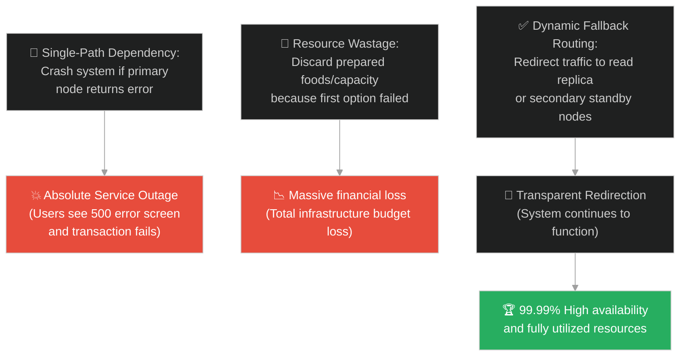
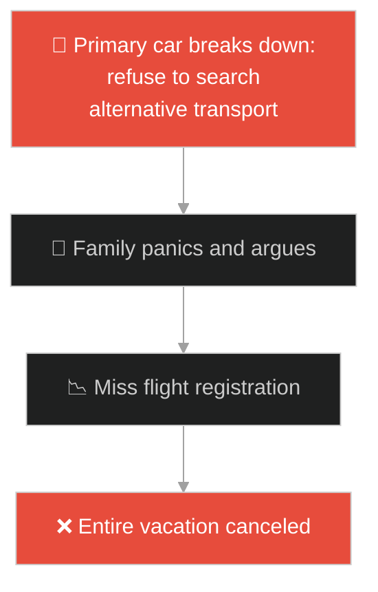
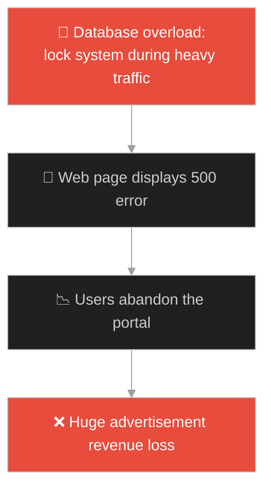
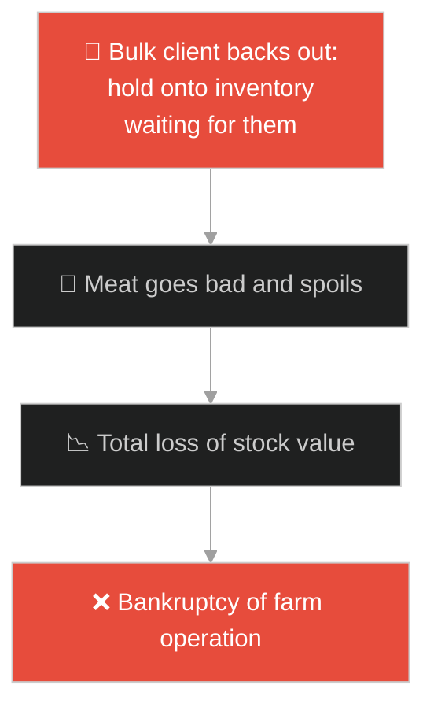
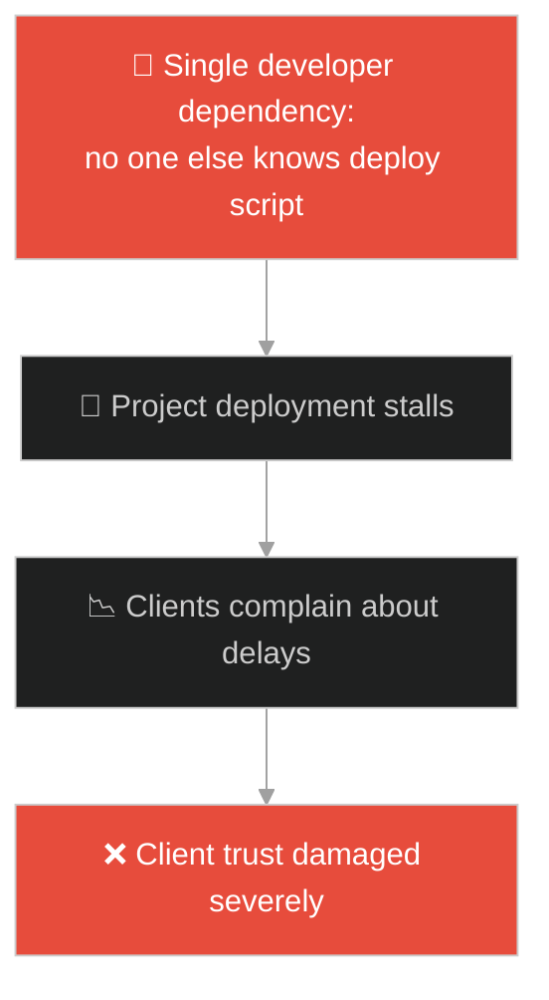
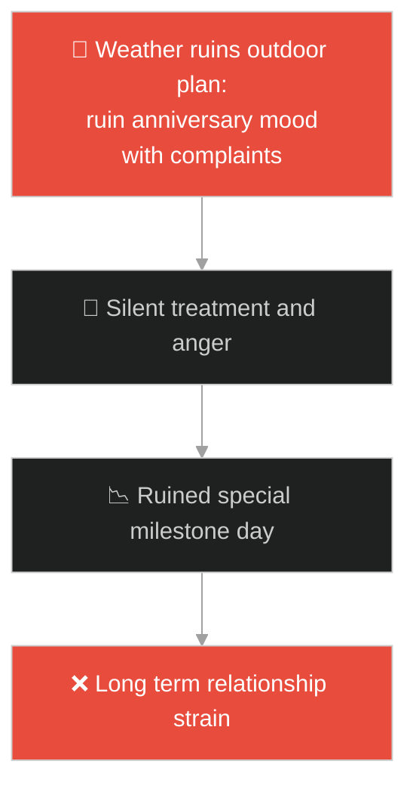
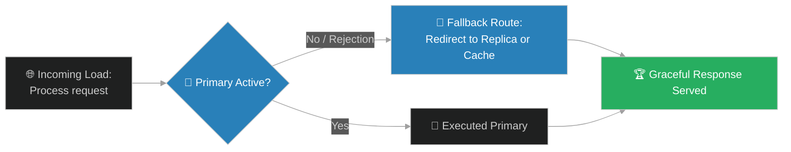

# Fallback Routing & Dynamic Load Redirection (ពិធីលៀងសាយភោជន៍ដ៏ធំ)៖ ការបង្វែរទិសដៅចរាចរណ៍បម្រុង និងការចែកចាយបន្ទុកការងារ (Fallback Routing & Dynamic Load Redirection & Traffic Rerouting and Service Availability Guarantee & Great Banquet)

**Author:** ichamrong  
**Date:** 2026-05-28  
**Tags:** #jesus #fallback-routing #load-balancing #system-availability #circuit-breaker #resilience #networking  
**Category:** Concepts / Parables  
**Read Time:** ~15 min  

---

## 📌 មាតិកា (Table of Contents)
- [អន្ទាក់ផ្លូវចិត្ត (The Trap)](#0)
- [១. រឿងព្រេងនិទាន៖ ពិធីលៀងសាយភោជន៍ និងការបដិសេធរបស់ភ្ញៀវកិត្តិយស (The Legend of the Great Banquet)](#1)
  - [យុទ្ធសាស្ត្របំពេញកៅអីទំនេរ និងការបើកទ្វារសម្រាប់សាធារណជន (Dynamic Allocation for Unused Capacity)](#1-1)
- [២. បញ្ហា៖ ការគាំងសេវាកម្មដោយសារតែកង្វះជម្រើសបម្រុង (The Issue: Service Blackouts and Single Point of Failure Redirection)](#2)
- [៣. ឧទាហមណ៍ជាក់ស្តែងក្នុងពិភពពិត (Real World Examples)](#3)
  - [ឧទាហរណ៍ទី ១ — កម្រិតស្រាល (គ្រួសារ)៖ ឡានចម្បងខូចនៅព្រឹកថ្ងៃធ្វើដំណើរ (Primary Car Break Down vs Dynamic Taxi Fallback)](#3-1)
  - [ឧទាហរណ៍ទី ២ — កម្រិតមធ្យម (បច្ចេកទេស)៖ ម៉ាស៊ីនមេ Database ចម្បងគាំងមិនឆ្លើយតប (Primary Database Failures vs Replica Fallback)](#3-2)
  - [ឧទាហរណ៍ទី ៣ — កម្រិតមធ្យម (ធុរកិច្ច)៖ ដៃគូទិញដុំធំដកខ្លួនចេញពីកិច្ចសន្យា (Wholesaler Canceling Contract vs Consumer Retail Rerouting)](#3-3)
  - [ឧទាហរណ៍ទី ៤ — កម្រិតមធ្យម (សង្គម/គ្រប់គ្រង)៖ វិស្វករសំខាន់ឈឺអំឡុងពេលប្រកាសបញ្ចេញកូដ (Lead Engineer Sick vs Cross-Trained Delegation)](#3-4)
  - [ឧទាហរណ៍ទី ៥ — កម្រិតធ្ងន់ (ទំនាក់ទំនង)៖ គម្រោងដើរកម្សាន្តត្រូវខកខានដោយសារអាកាសធាតុ (Outdoor Trip Canceled vs Indoor Backup Reservation)](#3-5)
- [៤. ដំណោះស្រាយទូទៅ៖ ការរចនាស្ថាបត្យកម្មបង្វែរទិសដៅ និងយន្តការ Circuit Breaker (The General Solution: Designing Dynamic Failover Registries and Fallback Logic)](#4)
- [សេចក្តីសន្និដ្ឋាន (Conclusion)](#5)
- [ឯកសារយោង (References)](#6)
- [Related Posts](#7)

---

<a id="0"></a>
## អន្ទាក់ផ្លូវចិត្ត (The Trap)

តើអ្នកធ្លាប់ជួបបញ្ហាដែលប្រព័ន្ធការងារទាំងមូលត្រូវជាប់គាំង ឬបង្ហាញទំព័រខុសបច្ចេកទេស (500 Internal Error) ភ្លាមៗនៅពេលសមាសភាគចម្បង (Primary Component) មិនអាចដំណើរការបាន ឬបដិសេធការបំពេញភារកិច្ចដែរឬទេ?

នៅក្នុងការគ្រប់គ្រង និងស្ថាបត្យកម្មប្រព័ន្ធ៖
* **យើងងាយនឹងធ្លាក់ក្នុងអន្ទាក់** នៃការរៀបចំប្រព័ន្ធដែលពឹងផ្អែកទាំងស្រុងលើផ្លូវតភ្ជាប់តែមួយ (Single Path Dependency) ដែលនៅពេលមានបញ្ហាកើតឡើង ធនធានដែលបានរៀបចំទុកជាច្រើនត្រូវខូចបង់ និងខាតបង់អសារបង់។
* **យើងមើលរំលង** សារៈសំខាន់នៃការរៀបចំ "ផ្លូវបម្រុង (Fallback Paths)" និងយន្តការបង្វែរទិសដៅចរាចរណ៍ការងារ (Dynamic Load Redirection) ដែលជួយឱ្យប្រព័ន្ធបន្តដំណើរការទៅមុខបាន ទោះបីជាមានការបដិសេធ ឬការខូចខាតសមាសភាគចម្បងក៏ដោយ។

ការរចនាប្រព័ន្ធដែលអាចរក្សាមុខងារការងារបានជានិច្ចតាមរយៈការបង្វែរទិសដៅ ហៅថា **គោលការណ៍ផ្លូវបម្រុង និងការបង្វែរទិសដៅចរាចរណ៍ឌីណាមិក (Fallback Routing & Dynamic Load Redirection)**។

ដើម្បីយល់ដឹងពីគោលការណ៍នេះ នេះជាផែនទីបង្ហាញផ្លូវ៖
1. **រឿងព្រេងនិទាន (The Legend)** — រឿងរ៉ាវរបស់សេដ្ឋីដែលរៀបចំពិធីលៀងសាយភោជន៍ដ៏ធំ ប៉ុន្តែភ្ញៀវដែលបានអញ្ជើញដំបូងបានរកលេសបដិសេធ ធ្វើឱ្យគាត់ត្រូវបង្វែរការអញ្ជើញទៅកាន់ជនក្រីក្រតាមចិញ្ចើមថ្នល់វិញ ដើម្បីបំពេញតុអាហារ។
2. **បញ្ហា (The Issue)** — ការវិភាគលើផលប៉ះពាល់នៃការបាត់បង់សេវាកម្ម (Downtime) និងរបៀបដែលការបង្វែរទិសដៅឌីណាមិកធានាបាននូវការបម្រើសេវាឥតដាច់។
3. **ឧទាហមណ៍ជាក់ស្តែង (Real World Examples)** — ពិនិត្យមើលបញ្ហានេះក្នុងកម្រិតគ្រួសារ បច្ចេកវិទ្យា ធុរកិច្ច ការគ្រប់គ្រង និងទំនាក់ទំនង។
4. **ដំណោះស្រាយទូទៅ (The General Solution)** — ការបង្កើតស្ថាបត្យកម្ម Circuit Breaker និងការកំណត់ចរាចរណ៍បម្រុង (Fallback Policies)។



---

<a id="1"></a>
## ១. រឿងព្រេងនិទាន៖ ពិធីលៀងសាយភោជន៍ និងការបដិសេធរបស់ភ្ញៀវកិត្តិយស (The Legend of the Great Banquet)

មានបុរសសេដ្ឋីម្នាក់បានរៀបចំពិធីជប់លៀងដ៏ធំមួយ។ គាត់បានរៀបចំម្ហូបអាហារដ៏ឆ្ងាញ់ពិសា ហើយបានផ្ញើលិខិតអញ្ជើញទៅកាន់ភ្ញៀវកិត្តិយស និងមិត្តភក្តិជិតស្និទ្ធរបស់គាត់ជាច្រើននាក់ ដើម្បីឱ្យមកចូលរួមនៅពេលល្ងាច។

នៅពេលដល់ម៉ោងជប់លៀង សេដ្ឋីបានចាត់អ្នកបម្រើរបស់គាត់ ឱ្យទៅហៅភ្ញៀវទាំងនោះដោយប្រាប់ថា៖ *"សូមអញ្ជើញមកចុះ ព្រោះឥឡូវនេះអ្វីៗត្រូវបានរៀបចំរួចរាល់អស់ហើយ។"*

ប៉ុន្តែគួរឱ្យភ្ញាក់ផ្អើល ភ្ញៀវដែលបានអញ្ជើញទាំងនោះ បែរជានាំគ្នារកលេសរៀងៗខ្លួន ដើម្បីបដិសេធមិនព្រមមកចូលរួមទៅវិញ៖
* **អ្នកទី ១ ឆ្លើយថា៖** *"ខ្ញុំទើបតែទិញដីមួយកន្លែង ហើយខ្ញុំត្រូវតែទៅមើលដីនោះ។ សូមអភ័យទោសផង!"*
* **អ្នកទី ២ ឆ្លើយថា៖** *"ខ្ញុំទើបតែទិញគោ ៥ នឹម ហើយខ្ញុំត្រូវទៅសាកល្បងមើលកម្លាំងរបស់វា។ សូមអភ័យទោសផង!"*
* **អ្នកទី ៣ ឆ្លើយថា៖** *"ខ្ញុំទើបតែរៀបការប្រពន្ធថ្មី ដូច្នេះខ្ញុំមិនអាចទៅបានទេ!"*

---

<a id="1-1"></a>
### យុទ្ធសាស្ត្របំពេញកៅអីទំនេរ និងការបើកទ្វារសម្រាប់សាធារណជន (Dynamic Allocation for Unused Capacity)

នៅពេលអ្នកបម្រើត្រឡប់មកប្រាប់សេដ្ឋីវិញ សេដ្ឋីខឹងយ៉ាងខ្លាំង។ ដោយសារតែចំណីអាហារធ្វើរួចរាល់អស់ហើយ គាត់មិនព្រមឱ្យវាខូចអត់ប្រយោជន៍ និងមិនព្រមឱ្យតុអាហារនៅទំនេរឡើយ។ គាត់ក៏បញ្ជាទៅអ្នកបម្រើភ្លាមៗថា៖ 

> **"ចូរប្រញាប់ចេញទៅតាមផ្លូវតូច ផ្លូវធំ ក្នុងទីក្រុង ហើយនាំពួកអ្នកក្រ អ្នកពិការ អ្នកខ្វាក់ និងអ្នកខ្វិន ឱ្យចូលមកហូបពិធីជប់លៀងនេះវិញ!"**

ក្រោយពីបានធ្វើរួចហើយ កៅអីខ្លះនៅតែទំនេរ។ ម្ចាស់ផ្ទះបានបញ្ជាបន្តថា៖ *"ចូរចេញទៅតាមផ្លូវលំ និងរបងចម្ការ ហើយបង្ខំឱ្យពួកគេចូលមក ដើម្បីឱ្យផ្ទះរបស់ខ្ញុំបានពេញ!"*

គាត់បានប្រកាសថា ភ្ញៀវកិត្តិយសដំបូងដែលបានបដិសេធ នឹងមិនបានភ្លក់រសជាតិអាហារសូម្បីតែមួយម៉ាត់ឡើយ។ ពិធីលៀងសាយភោជន៍ត្រូវបានបំពេញដោយជោគជ័យ ដោយសារតែការបង្វែរទិសដៅយ៉ាងរហ័ស។

---

<a id="2"></a>
## ២. បញ្ហា៖ ការគាំងសេវាកម្មដោយសារតែកង្វះជម្រើសបម្រុង (The Issue: Service Blackouts and Single Point of Failure Redirection)

នៅក្នុងវិស្វកម្មសូហ្វវែរ (Software Engineering)៖
1. **កំហុសរាលដាល (Cascading Failures)៖** នៅពេលដែល Component មួយខូច (ដូចជា API ឆែកតម្លៃទំនិញ) ហើយប្រព័ន្ធមិនមានយន្តការបម្រុង (Fallback) វានឹងធ្វើឱ្យប្រព័ន្ធ Checkout ទាំងមូលគាំង នាំឱ្យអតិថិជនមិនអាចទិញទំនិញបានឡើយ។
2. **ការខ្ជះខ្ជាយធនធាន (Capacity Waste)៖** ការបង្កើត Server ធំៗប៉ុន្តែទុកវាឱ្យគាំងចោលនៅពេលជួបបញ្ហា គឺជាការខាតបង់ថវិការបស់ក្រុមហ៊ុនយ៉ាងធ្ងន់ធ្ងរ។

ខាងក្រោមនេះជាការប្រៀបធៀបរវាងកូដដែលគ្មានប្រព័ន្ធការពារ និងកូដដែលមាន Fallback Routing ស្វ័យប្រវត្តិ៖

### Fragile Implementation (Immediate Crash on Primary Node Fail)
កូដនេះព្យាយាមទាញយកទិន្នន័យពី Database ចម្បង (Primary DB)។ ប្រសិនបើ Database ចម្បងនោះគាំង ឬយឺត វានឹងបោះកំហុស និងបិទដំណើរការកម្មវិធីភ្លាមៗ៖

```typescript
// fragile_router.ts
import { fetchFromPrimaryDatabase } from './db';

export async function getUserDashboard(userId: string): Promise<any> {
    try {
        // ពឹងផ្អែកទាំងស្រុងលើ Primary DB តែមួយគត់
        const data = await fetchFromPrimaryDatabase(userId);
        return { status: "success", payload: data };
    } catch (error) {
        console.error("[CRITICAL] Primary database is down!");
        // បោះកំហុស 500 ធ្វើឱ្យអ្នកប្រើប្រាស់មិនអាចមើលអ្វីបានទាំងអស់
        throw new Error("HTTP 500: Internal Server Error");
    }
}
```

### Resilient Implementation (Dynamic Fallback Routing and Circuit Breaker)
កូដនេះអនុវត្តយន្តការ Fallback៖ ប្រសិនបើ Primary Database គាំង វានឹងបង្វែរទិសដៅទៅទាញទិន្នន័យពី Read-Replica ជំនួសវិញ។ បើនៅតែមិនដើរ វានឹងអានទិន្នន័យចាស់ពី Redis Cache ដើម្បីធានាថាអ្នកប្រើប្រាស់នៅតែអាចឃើញព័ត៌មាន (Read-Only Graceful Degradation)៖

```typescript
// resilient_router.ts
import { fetchFromPrimaryDatabase, fetchFromReadReplica } from './db';
import { fetchFromLocalCache } from './cache';

export async function getResilientUserDashboard(userId: string): Promise<any> {
    // ព្យាយាមប្រើជម្រើសទី ១: Primary Database
    try {
        const data = await fetchFromPrimaryDatabase(userId);
        return { source: "primary_db", payload: data };
    } catch (primaryError) {
        console.warn(`[WARN] Primary DB unavailable. Rerouting traffic to Replica...`);

        // ព្យាយាមប្រើជម្រើសទី ២: Replica DB (Fallback Route 1)
        try {
            const data = await fetchFromReadReplica(userId);
            return { source: "replica_db", payload: data, warning: "read_only_mode" };
        } catch (replicaError) {
            console.error(`[CRITICAL] Replica DB also failed! Rerouting to Local Cache...`);

            // ព្យាយាមប្រើជម្រើសទី ៣: Local Memory Cache (Fallback Route 2)
            try {
                const cachedData = await fetchFromLocalCache(userId);
                if (cachedData) {
                    return { source: "static_cache", payload: cachedData, warning: "stale_data" };
                }
            } catch (cacheError) {
                console.error(`[FATAL] All data sources exhausted.`);
            }

            // ប្រសិនបើសម្អាតអស់ហើយ នៅតែមិនបាន ត្រូវផ្តល់ព័ត៌មានលំនាំដើមសាមញ្ញ (Default Value)
            return { 
                source: "hardcoded_default", 
                payload: { name: "Guest User", preferences: [] }, 
                warning: "offline_degraded" 
            };
        }
    }
}
```

---

<a id="3"></a>
## ៣. ឧទាហមណ៍ជាក់ស្តែងក្នុងពិភពពិត

---

<a id="3-1"></a>
### ឧទាហមណ៍ទី ១ — កម្រិតស្រាល (គ្រួសារ)៖ ឡានចម្បងខូចនៅព្រឹកថ្ងៃធ្វើដំណើរ (Primary Car Break Down vs Dynamic Taxi Fallback)

គ្រួសារមួយគ្រោងធ្វើដំណើរទៅកាន់ព្រលានយន្តហោះនៅព្រឹកព្រលឹម។ ប៉ុន្តែនៅពេលបញ្ឆេះឡានចម្បង ស្រាប់តែវាខូចធ្លាយទឹក coolant។ ជំនួសឱ្យការឈ្លោះប្រកែកគ្នា និងបោះបង់ចោលការធ្វើដំណើរ ពួកគេបានចុចកក់ឡានតាក់ស៊ី PassApp ភ្លាមៗ (Fallback Routing) ធ្វើឱ្យពួកគេទៅដល់ព្រលានយន្តហោះទាន់ពេលវេលា។



---

<a id="3-2"></a>
### ឧទាហមណ៍ទី ២ — កម្រិតមធ្យម (បច្ចេកទេស)៖ ម៉ាស៊ីនមេ Database ចម្បងគាំងមិនឆ្លើយតប (Primary Database Failures vs Replica Fallback)

គេហទំព័រសារព័ត៌មានដ៏ធំមួយទទួលបានចរាចរណ៍ចូលមើល (Traffic) យ៉ាងខ្លាំងក្នុងអំឡុងពេលបោះឆ្នោត។ Database ចម្បងដែលទទួលកិច្ចការសរសេរនិងអាន ត្រូវគាំងដោយសារលើសចំណុះ។ វិស្វករបានប្តូរការកំណត់ទាញយកព័ត៌មាន (Read Requests) ឱ្យរត់ទៅកាន់ Read-Replica Servers ចំនួន ៥ ជំនួសវិញ ធ្វើឱ្យអ្នកអានរាប់លាននាក់នៅតែអាចមើលព័ត៌មានបានដដែល។



---

<a id="3-3"></a>
### ឧទាហមណ៍ទី ៣ — កម្រិតមធ្យម (ធុរកិច្ច)៖ ដៃគូទិញដុំធំដកខ្លួនចេញពីកិច្ចសន្យា (Wholesaler Canceling Contract vs Consumer Retail Rerouting)

កសិដ្ឋានចិញ្ចឹមមាន់មួយបានត្រៀមសាច់មាន់ ១០ តោនសម្រាប់ផ្គត់ផ្គង់ឱ្យរោងចក្រផលិតអាហារធំមួយ។ មុនថ្ងៃដឹកជញ្ជូន ស្រាប់តែរោងចក្រនោះបានបោះបង់កិច្ចសន្យា (បដិសេធអញ្ជើញ)។ ដើម្បីកុំឱ្យសាច់មាន់ខូចចោល កសិដ្ឋានបានបង្វែរទិសដៅលក់ភ្លាមៗទៅកាន់ផ្សារទំនើបតូចៗ ភោជនីយដ្ឋាន និងលក់រាយបញ្ចុះតម្លៃដល់សាធារណជន ធ្វើឱ្យពួកគេរក្សាបាននូវដើមទុនត្រឡប់មកវិញ។



---

<a id="3-4"></a>
### ឧទាហមណ៍ទី ៤ — កម្រិតមធ្យម (សង្គម/គ្រប់គ្រង)៖ វិស្វករសំខាន់ឈឺអំឡុងពេលប្រកាសបញ្ចេញកូដ (Lead Engineer Sick vs Cross-Trained Delegation)

នៅថ្ងៃដែលក្រុមហ៊ុនត្រូវបញ្ចេញប្រព័ន្ធកម្មវិធីថ្មី (Production Deploy) ស្រាប់តែវិស្វករដឹកនាំគម្រោង (Lead Developer) មានជំងឺគ្រុនឈាមសម្រាកពេទ្យ។ ដោយសារក្រុមហ៊ុនធ្លាប់បានបណ្តុះបណ្តាលសមាជិកដទៃទៀតឱ្យយល់ដឹងពីប្រព័ន្ធដូចគ្នា (Cross-Training) អ្នកគ្រប់គ្រងបានចាត់តាំងវិស្វករម្នាក់ទៀតឱ្យមកកាន់កាប់ជំនួសភ្លាមៗ ធ្វើឱ្យការបញ្ចេញកម្មវិធីទទួលបានជោគជ័យតាមកាលវិភាគដដែល។



---

<a id="3-5"></a>
### ឧទាហមណ៍ទី ៥ — កម្រិតធ្ងន់ (ទំនាក់ទំនង)៖ គម្រោងដើរកម្សាន្តត្រូវខកខានដោយសារអាកាសធាតុ (Outdoor Trip Canceled vs Indoor Backup Reservation)

គូស្នេហ៍មួយគូរៀបចំកម្មវិធីខួបអាពាហ៍ពិពាហ៍នៅភោជនីយដ្ឋានមាត់សមុទ្រខាងក្រៅ (Outdoor)។ ស្រាប់តែពេលល្ងាចមានខ្យល់ព្យុះភ្លៀងធ្លាក់យ៉ាងខ្លាំង។ ជំនួសឱ្យការខឹងសម្បារ និងបំផ្លាញអារម្មណ៍រីករាយ ពួកគេបានប្តូរកម្មវិធីភ្លាមៗទៅជាការញ៉ាំអាហារលក្ខណៈឯកជន និងមើលភាពយន្តមនោសញ្ចេតនានៅក្នុងបន្ទប់សណ្ឋាគារវិញ ដែលបង្កើតបានជាការចងចាំដ៏ផ្អែមល្ហែមមួយបែបផ្សេងទៀត។



---

<a id="4"></a>
## ៤. ដំណោះស្រាយទូទៅ៖ ការរចនាស្ថាបត្យកម្មបង្វែរទិសដៅ និងយន្តការ Circuit Breaker (The General Solution: Designing Dynamic Failover Registries and Fallback Logic)

ដើម្បីបង្កើតស្ថិរភាព និងធានាថា "ពិធីលៀងសាយភោជន៍" របស់យើងត្រូវបានបំពេញជានិច្ច យើងត្រូវអនុវត្តគោលការណ៍ Fallback Routing៖



ជំហាននៃការអនុវត្ត៖
1. **ការកំណត់អត្តសញ្ញាណ Single Point of Failure (SPOF)៖** ស្វែងរកចំណុចសំខាន់ៗទាំងអស់នៅក្នុងប្រព័ន្ធ ដែលប្រសិនបើវាគាំង នឹងធ្វើឱ្យប្រព័ន្ធទាំងមូលគាំងតាម។
2. **ការបង្កើតយន្តការ Circuit Breaker៖** នៅពេលដែលសមាសភាគចម្បងជួបបញ្ហាច្រើនដងហួសកម្រិត (ឧទាហរណ៍ ៥ ដងជាប់គ្នា) ត្រូវបើក Circuit (Open State) ដើម្បីបង្វែររាល់ចរាចរណ៍ការងារទៅកាន់ Fallback ភ្លាមៗដោយស្វ័យប្រវត្តិ ដើម្បីទុកពេលឱ្យសមាសភាគចម្បងស្ដារខ្លួនឡើងវិញ។
3. **ការរចនាទម្រង់ Degraded Response (ការឆ្លើយតបកម្រិតទាបដែលមានសុវត្ថិភាព)៖** បម្រុងទុកទិន្នន័យលំនាំដើម (Default payload) ឬទិន្នន័យចាស់ដែលរក្សាទុកក្នុង Cache ដើម្បីបង្ហាញជូនអ្នកប្រើប្រាស់ ជាជាងការបង្ហាញទំព័រ Error។
4. **ការចែកចាយឱកាស និងសមត្ថភាពក្នុងជីវិត៖** កុំទុកឱ្យធនធាន ឬក្តីសង្ឃឹមរបស់អ្នកផ្អែកលើជម្រើសតែមួយគត់។ ត្រូវតែមានជម្រើសទី ២ និងទី ៣ ជានិច្ច ដើម្បីបំពេញបំណង និងគោលដៅជីវិតរបស់អ្នក។

---

## 🐇 ធ្លាក់ចូលក្នុងរន្ធទន្សាយ (Enter the Rabbit Hole)

ដើម្បីស្វែងយល់បន្ថែមអំពីរបៀបដែលប្រព័ន្ធបែងចែកដែនការងារចេញពីគ្នា ដើម្បីកុំឱ្យកំហុសឆ្គង ឬការបែកធ្លាយទិន្នន័យពីសមាសភាគមួយ អាចឆ្លងរាលដាលទៅបំផ្លាញសមាសភាគដទៃទៀត តាមរយៈការអនុវត្តច្បាប់បំបែកឯកសិទ្ធិ និងប្រអប់ខ្សាច់សុវត្ថិភាព សូមបន្តដំណើរទៅកាន់៖

* 🚀 **[ចាប់ផ្តើមដំណើររុករក (Start the Journey) ➔ Privilege Isolation & Sandboxed Execution (អ្នកមាន និងឡាសារ)៖ ការបំបែកឯកសិទ្ធិ និងការប្រតិបត្តិការងារក្នុងប្រអប់សុវត្ថិភាព](./194-jesus-and-the-rich-man-and-lazarus.md)**

---

<a id="5"></a>
## សេចក្តីសន្និដ្ឋាន (Conclusion)

> **«នៅពេលដែលភ្ញៀវកិត្តិយសរកលេសបដិសេធ ពិធីលៀងសាយភោជន៍ដ៏អស្ចារ្យនៅតែអាចបំពេញបានដោយជនដទៃដែលត្រូវការវាពិតប្រាកដ»**

ការយល់ដឹងពី Fallback Routing ជួយឱ្យយើងកសាងប្រព័ន្ធបច្ចេកវិទ្យាដែលមានស្ថិរភាពខ្ពស់ និងរៀបចំជីវិតផ្ទាល់ខ្លួនប្រកបដោយភាពបត់បែនខ្ពស់ អាចប្រែក្លាយរាល់ឧបសគ្គឱ្យទៅជាឱកាសថ្មីៗបានយ៉ាងងាយស្រួល។

---

<a id="6"></a>
## ឯកសារយោង (References)

* **Parable of the Great Banquet (Luke 14:15–24)** — The historical context of dynamic host relocation and redistribution of values when original paths reject invitations.
* **Nygard, M. T.** — *Release It!: Design and Deploy Production-Ready Software* (2018). Focuses on Circuit Breaker and Fallback patterns for architectural stability.

---

<a id="7"></a>
## Related Posts

* [[Privilege Isolation & Sandboxed Execution](./194-jesus-and-the-rich-man-and-lazarus.md)] — ការការពារប្រព័ន្ធដោយការបែងចែកបរិស្ថានការងារដាច់ស្រឡះពីគ្នា។
* [[Data Filtering & Classification Funnels](./195-jesus-and-the-dragnet.md)] — របៀបត្រងយកតែទិន្នន័យមានតម្លៃ និងបោះចោលកាកសំណល់។
