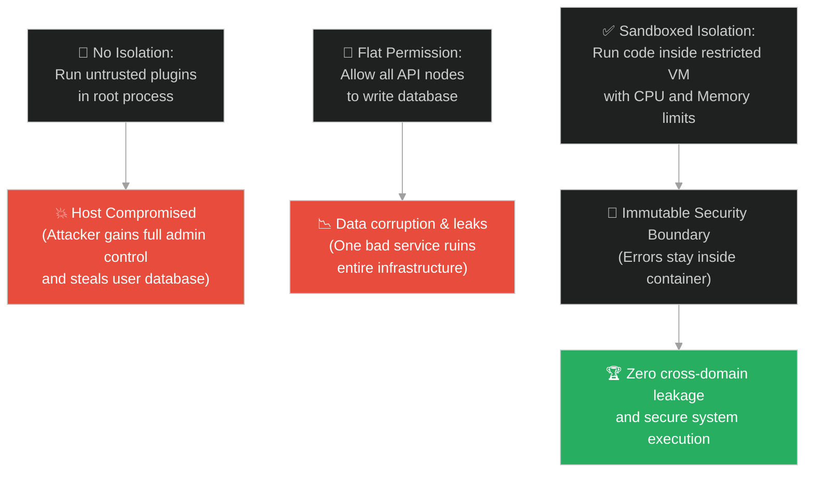
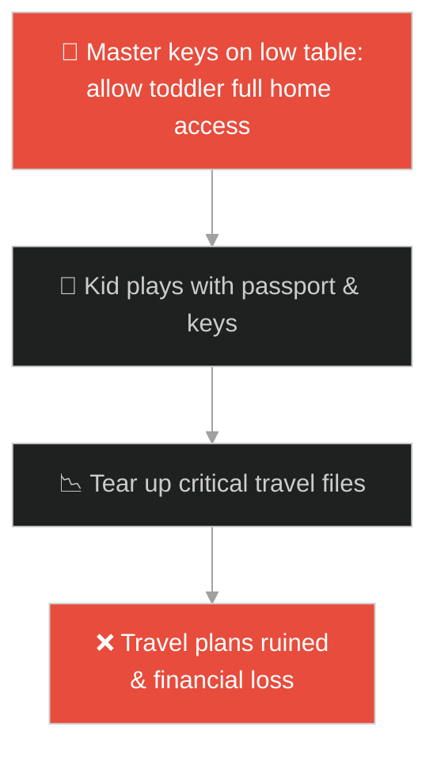
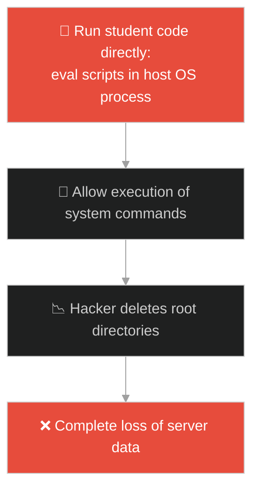
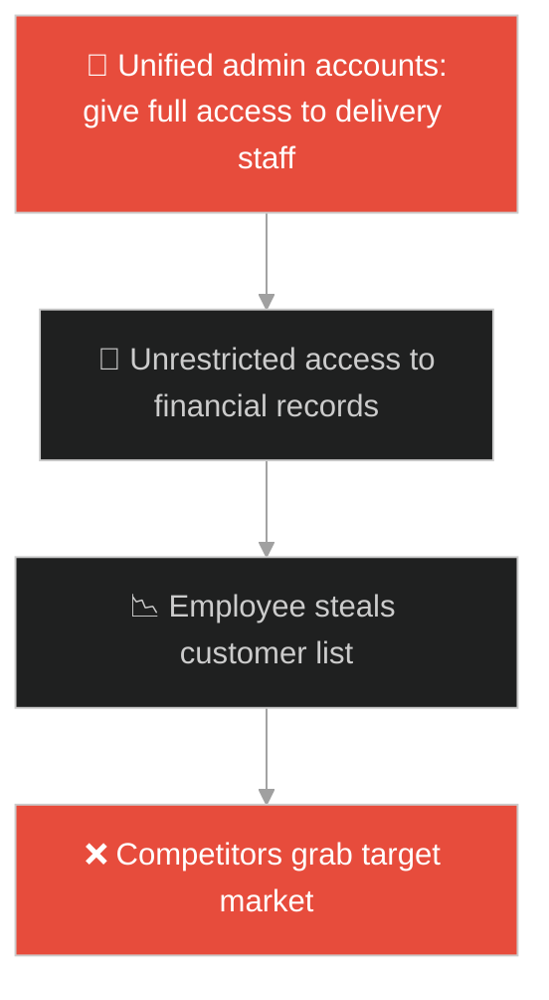
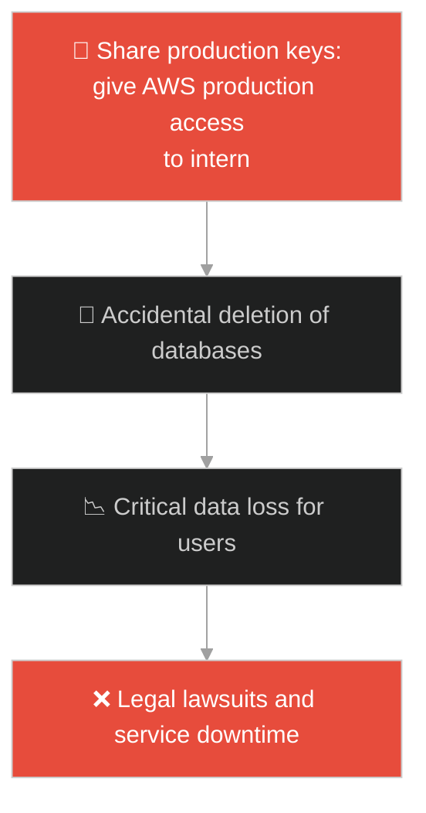
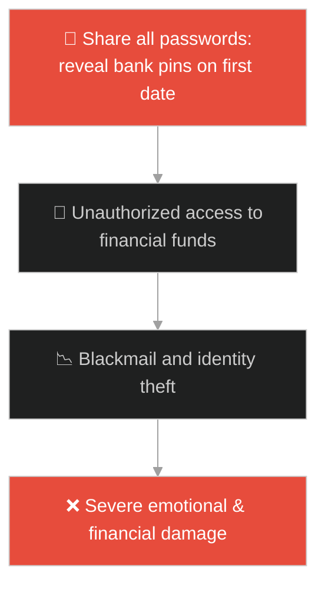
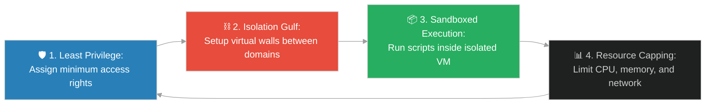

# Privilege Isolation & Sandboxed Execution (អ្នកមាន និងឡាសារ)៖ ការបំបែកឯកសិទ្ធិ និងការប្រតិបត្តិការងារក្នុងប្រអប់សុវត្ថិភាព (Privilege Isolation & Sandboxed Execution & System Domain Separation and Security Boundary Enforcement & Rich Man and Lazarus)

**Author:** ichamrong  
**Date:** 2026-05-28  
**Tags:** #jesus #privilege-isolation #sandboxing #security-boundary #system-design #virtualization #isolation  
**Category:** Concepts / Parables  
**Read Time:** ~15 min  

---

## 📌 មាតិកា (Table of Contents)
- [អន្ទាក់ផ្លូវចិត្ត (The Trap)](#0)
- [១. រឿងព្រេងនិទាន៖ សេដ្ឋី និងអ្នកសុំទានឡាសារ (The Legend of the Rich Man and Lazarus)](#1)
  - [ជ្រោះដ៏ជ្រៅខណ្ឌចែកដែនដី និងការអនុវត្តព្រំដែនសុវត្ថិភាព (The Great Gulf and Immutable Isolation Boundaries)](#1-1)
- [២. បញ្ហា៖ ការលេចធ្លាយសុវត្ថិភាព និងការអនុវត្តកូដគ្មានដែនកំណត់ (The Issue: Privilege Escalation and Unrestricted Script Execution)](#2)
- [៣. ឧទាហមណ៍ជាក់ស្តែងក្នុងពិភពពិត (Real World Examples)](#3)
  - [ឧទាហរណ៍ទី ១ — កម្រិតស្រាល (គ្រួសារ)៖ ការអនុញ្ញាតឱ្យក្មេងលេងកូនសោឡាននិងឯកសារសំខាន់ (Toddler with Master Keys vs Isolated Toy Box)](#3-1)
  - [ឧទាហរណ៍ទី ២ — កម្រិតមធ្យម (បច្ចេកទេស)៖ ការដំណើរការកូដរបស់អតិថិជននៅលើ Server ចម្បង (Running User Plugins in Host Process vs Sandboxed Container)](#3-2)
  - [ឧទាហរណ៍ទី ៣ — កម្រិតមធ្យម (ធុរកិច្ច)៖ ការផ្តល់សិទ្ធិមើលព័ត៌មានហិរញ្ញវត្ថុដល់បុគ្គលិកទាំងអស់ (Full ERP Access for All Employees vs Role-Based Isolation)](#3-3)
  - [ឧទាហរណ៍ទី ៤ — កម្រិតមធ្យម (សង្គម/គ្រប់គ្រង)៖ ការឱ្យបុគ្គលិកថ្មីសាកល្បងការងារលើ Server ធំ (Intern Deploying Directly to Production vs Isolated Staging Environment)](#3-4)
  - [ឧទាហរណ៍ទី ៥ — កម្រិតធ្ងន់ (ទំនាក់ទំនង)៖ ការលុបបំបាត់ព្រំដែនឯកជនភាពក្នុងទំនាក់ទំនងដំបូង (No Privacy Boundaries in Early Dating vs Healthy Space Partition)](#3-5)
- [៤. ដំណោះស្រាយទូទៅ៖ ការអនុវត្តគោលការណ៍បំបែកដែនការងារ និងប្រអប់ខ្សាច់សុវត្ថិភាព (The General Solution: Designing Sandboxed Virtual Machines and Privilege Boundaries)](#4)
- [សេចក្តីសន្និដ្ឋាន (Conclusion)](#5)
- [ឯកសារយោង (References)](#6)
- [Related Posts](#7)

---

<a id="0"></a>
## អន្ទាក់ផ្លូវចិត្ត (The Trap)

តើអ្នកធ្លាប់ជួបបញ្ហាដែលប្រព័ន្ធការងារ ឬព័ត៌មានសម្ងាត់របស់អ្នកត្រូវបានលេចធ្លាយ ឬខូចខាតទាំងស្រុង ដោយសារតែកម្មវិធីតូចតាចមួយដែលគ្មានសុវត្ថិភាព មានសិទ្ធិអាចចូលប្រើប្រាស់ធនធានស្នូលទាំងអស់របស់ម៉ាស៊ីន (Host System) ដែរឬទេ?

នៅក្នុងសុវត្ថិភាពព័ត៌មានវិទ្យា និងការគ្រប់គ្រង៖
* **យើងងាយនឹងធ្លាក់ក្នុងអន្ទាក់** នៃការផ្តល់សិទ្ធិអំណាចពេញលេញ (Administrative Privileges) ទៅឱ្យសមាសភាគការងារផ្សេងៗ ដើម្បីភាពងាយស្រួលក្នុងការសរសេរកូដ ដោយមើលរំលងហានិភ័យនៅពេលសមាសភាគនោះត្រូវរងការវាយប្រហារ (Security Breach)។
* **យើងមើលរំលង** ភាពចាំបាច់នៃការបង្កើត "ជ្រោះខណ្ឌចែកដែនដី (Domain Separation)" ដែលមិនអនុញ្ញាតឱ្យកូដ ឬមនុស្សនៅក្នុងដែនការងារមួយ អាចលូកដៃចូលទៅបំផ្លាញ ឬកែប្រែទិន្នន័យនៅក្នុងដែនការងារមួយទៀតបានឡើយ។

ការបង្កើតរបាំងការពារ និងការបែងចែកសិទ្ធិការងារឱ្យនៅដាច់ស្រឡះពីគ្នា ហៅថា **ការបំបែកឯកសិទ្ធិ និងការប្រតិបត្តិការងារក្នុងប្រអប់សុវត្ថិភាព (Privilege Isolation & Sandboxed Execution)**។

ដើម្បីយល់ដឹងពីគោលការណ៍នេះ នេះជាផែនទីបង្ហាញផ្លូវ៖
1. **រឿងព្រេងនិទាន (The Legend)** — រឿងរ៉ាវរបស់សេដ្ឋី និងឡាសារ ដែលកាលរស់នៅមានជីវិតខុសគ្នាស្រឡះ ហើយក្រោយពេលស្លាប់ត្រូវបានខណ្ឌចែកដោយជ្រោះជ្រៅមួយដែលមិនអាចឆ្លងកាត់បាន។
2. **បញ្ហា (The Issue)** — ហានិភ័យនៃការប្រតិបត្តិកូដគ្មានដែនកំណត់ (Remote Code Execution) និងរបៀបដែល Sandbox ការពារប្រព័ន្ធម៉ាស៊ីនមេ។
3. **ឧទាហមណ៍ជាក់ស្តែង (Real World Examples)** — ពិនិត្យមើលបញ្ហានេះក្នុងកម្រិតគ្រួសារ បច្ចេកវិទ្យា ធុរកិច្ច ការគ្រប់គ្រង និងទំនាក់ទំនង។
4. **ដំណោះស្រាយទូទៅ (The General Solution)** — ការអនុវត្តស្ថាបត្យកម្ម Containers, Virtual Machines (VMs) និងគោលការណ៍ Least Privilege។



---

<a id="1"></a>
## ១. រឿងព្រេងនិទាន៖ សេដ្ឋី និងអ្នកសុំទានឡាសារ (The Legend of the Rich Man and Lazarus)

មានសេដ្ឋីម្នាក់ ដែលរស់នៅយ៉ាងហ៊ឺហា ស្លៀកពាក់សុទ្ធតែក្រណាត់សូត្រថ្លៃៗ និងរៀបចំពិធីជប់លៀងស៊ីផឹកយ៉ាងសប្បាយជារៀងរាល់ថ្ងៃ។ នៅមាត់ទ្វារផ្ទះរបស់សេដ្ឋីនោះ មានអ្នកសុំទានក្រីក្រម្នាក់ឈ្មោះ **ឡាសារ (Lazarus)**។ 

ឡាសារមានដំបៅពេញខ្លួន ហើយគាត់តែងតែប្រាថ្នាចង់បានត្រឹមតែកម្ទេចអាហារដែលធ្លាក់ពីតុរបស់សេដ្ឋី ដើម្បីចម្អែតក្រពះប៉ុណ្ណោះ។ ប៉ុន្តែសេដ្ឋីនោះ មិនដែលអើពើ ឬផ្តល់អាហារដល់ឡាសារសូម្បីតែបន្តិច។ មានតែសត្វឆ្កែទេ ដែលមកលិទ្ធដំបៅរបស់គាត់។

---

<a id="1-1"></a>
### ជ្រោះដ៏ជ្រៅខណ្ឌចែកដែនដី និងការអនុវត្តព្រំដែនសុវត្ថិភាព (The Great Gulf and Immutable Isolation Boundaries)

ក្រោយមក អ្នកសុំទានឡាសារក៏បានស្លាប់ ហើយទេវតាបាននាំព្រលឹងគាត់ទៅឋានសួគ៌ ទៅអង្គុយនែបនិត្យក្បែរលោកអ័ប្រាហាំ។ ចំណែកឯសេដ្ឋីនោះ ក៏បានស្លាប់ ហើយព្រលឹងរបស់គាត់ត្រូវធ្លាក់ទៅក្នុងឋាននរក ដែលមានភ្លើងឆេះយ៉ាងក្តៅក្រហាយ។

ពេលសេដ្ឋីនោះរងទុក្ខវេទនាក្នុងភ្លើង គាត់ងើបមុខឡើងសម្លឹងទៅឆ្ងាយ ក៏ឃើញឡាសារកំពុងមានសេចក្តីសុខក្បែរលោកអ័ប្រាហាំ។ គាត់ស្រែកអង្វរថា៖ *"សូមចាត់ឡាសារឱ្យយកចុងម្រាមដៃជ្រលក់ទឹកបន្តិច មកផ្តក់លើអណ្តាតរបស់ខ្ញុំផង ព្រោះខ្ញុំកំពុងរងទុក្ខវេទនាក្នុងអណ្តាតភ្លើងនេះណាស់។"*

លោកអ័ប្រាហាំបានឆ្លើយតបយ៉ាងម៉ឺងម៉ាត់វិញថា៖

> *"កូនអើយ! ចូរនឹកចាំថា កាលពីអ្នកនៅរស់ អ្នកទទួលបានតែរបស់ល្អៗ ចំណែកឡាសារទទួលបានតែរបស់អាក្រក់។ ឥឡូវនេះ គេត្រូវបានកម្សាន្តចិត្ត រីឯអ្នកត្រូវរងទុក្ខ។ **ម្យ៉ាងទៀត មានជ្រោះដ៏ជ្រៅមួយខណ្ឌរវាងយើង គ្មាននរណាអាចឆ្លងទៅរកអ្នក ឬឆ្លងមករកយើងបានឡើយ (Immutable Isolation Barrier)**។"*

សេដ្ឋីក៏ទាមទារសុំឱ្យចាត់ឡាសារទៅប្រាប់បងប្អូនគាត់នៅឡើយ តែលោកអ័ប្រាហាំបដិសេធ ដោយសារតែដែនដីទាំងពីរកំណត់ដាច់ស្រឡះពីគ្នា រួចជាស្រេចហើយ។

---

<a id="2"></a>
## ២. បញ្ហា៖ ការលេចធ្លាយសុវត្ថិភាព និងការអនុវត្តកូដគ្មានដែនកំណត់ (The Issue: Privilege Escalation and Unrestricted Script Execution)

នៅក្នុងការរចនាប្រព័ន្ធសុវត្ថិភាព៖
1. **ការអនុវត្តកូដដោយគ្មានការត្រួតពិនិត្យ (RCE vulnerability)៖** ប្រសិនបើអ្នកអនុញ្ញាតឱ្យអ្នកប្រើប្រាស់បញ្ចូលកូដ ឬរូបមន្តគណនា (Formula) ហើយប្រព័ន្ធដំណើរការវានៅលើ Process ចម្បងរបស់ម៉ាស៊ីនមេ (Host CPU)។ Attacker អាចបញ្ចូលកូដគ្រោះថ្នាក់ (ដូចជា `process.exit()` ឬ `rm -rf /`) ដើម្បីបំផ្លាញប្រព័ន្ធទាំងមូល។
2. **កង្វះព្រំដែនការងារ (Flat Permissions)៖** ប្រសិនបើប្រព័ន្ធរចនាឡើងឱ្យសមាសភាគទាំងអស់រត់នៅក្រោមសិទ្ធិ `root` តែមួយ នោះនៅពេលមានសមាសភាគណាមួយត្រូវបានវាយលុក គេនឹងអាចគ្រប់គ្រងម៉ាស៊ីនបានទាំងអស់។

ខាងក្រោមនេះជាការប្រៀបធៀបរវាងការដំណើរការកូដគ្មានសុវត្ថិភាព និងការរចនាប្រអប់ខ្សាច់ (Sandbox)៖

### Fragile Implementation (Unrestricted Direct Eval Execution)
កូដនេះទទួលយកកូដ Python/JavaScript ពីអ្នកប្រើប្រាស់ និងវាយតម្លៃវាយ៉ាងសាមញ្ញនៅលើ Process ចម្បង ដែលអាចធ្វើឱ្យ Hacker ចូលលួចទិន្នន័យបរិស្ថានប្រព័ន្ធ (Environment variables) បានភ្លាមៗ៖

```typescript
// fragile_exec.ts
export function executeUserScript(userCode: string): any {
    console.log("[INFO] Evaluating user code on main thread...");
    // ការប្រើ eval() ឬ Function() ផ្ទាល់លើ Main Thread គឺគ្រោះថ្នាក់បំផុត
    // User អាចសរសេរ: "globalThis.process.kill()" ឬលួចយក API keys
    try {
        const result = eval(userCode);
        return result;
    } catch (error) {
        return { status: "error", message: error.message };
    }
}
```

### Resilient Implementation (Privilege Isolation via Secure Subprocess Sandbox)
កូដនេះបង្កើតដំណើរការការងារដាច់ដោយឡែកមួយ (Subprocess) ក្រោមគណនីអ្នកប្រើប្រាស់ដែលគ្មានសិទ្ធិ (Non-privileged User) និងកំណត់ដែនកំណត់ CPU/Memory តឹងរ៉ឹង៖

```typescript
// resilient_sandbox.ts
import { spawn } from 'child_process';

export function executeSandboxedScript(userCode: string): Promise<string> {
    return new Promise((resolve, reject) => {
        console.log("[INFO] Spawning isolated sandboxed container process...");

        // ១. បង្កើត Child Process ដំណើរការក្រោម User 'nobody' (Privilege Isolation)
        // ២. កំណត់ពេលវេលាដំណើរការអតិបរមា (Timeout) ដើម្បីការពារ CPU DoS
        const sandbox = spawn('docker', [
            'run', '--rm',
            '-i',
            '--network', 'none',            // បិទការតភ្ជាប់បណ្តាញ (No network access)
            '--memory', '64m',              // កំណត់ទំហំ RAM អតិបរមា 64MB
            '--cpu-shares', '256',          // កំណត់ការប្រើប្រាស់ CPU
            'node:18-alpine',
            'node', '-e', userCode
        ]);

        let output = '';
        let errorOutput = '';

        sandbox.stdout.on('data', (data) => {
            output += data.toString();
        });

        sandbox.stderr.on('data', (data) => {
            errorOutput += data.toString();
        });

        const timer = setTimeout(() => {
            sandbox.kill();
            reject(new Error("Timeout: Sandboxed script exceeded time limit."));
        }, 5000); // ៥ វិនាទីអតិបរមា

        sandbox.on('close', (code) => {
            clearTimeout(timer);
            if (code === 0) {
                resolve(output.trim());
            } else {
                reject(new Error(`Sandbox execution failed: ${errorOutput}`));
            }
        });
    });
}
```

---

<a id="3"></a>
## ៣. ឧទាហមណ៍ជាក់ស្តែងក្នុងពិភពពិត

---

<a id="3-1"></a>
### ឧទាហមណ៍ទី ១ — កម្រិតស្រាល (គ្រួសារ)៖ ការអនុញ្ញាតឱ្យក្មេងលេងកូនសោឡាននិងឯកសារសំខាន់ (Toddler with Master Keys vs Isolated Toy Box)

ឪពុកម្នាក់បានទុកសោឡានពិតប្រាកដ កាបូបលុយ និងឯកសារលិខិតឆ្លងដែននៅលើតុទាប។ កូនតូចអាយុ ២ ឆ្នាំបានដើរមកយកទៅលេង រួចក៏បោះកូនសោឡានចោលក្នុងធុងសម្រាម និងហែកលិខិតឆ្លងដែនចោល។ ឪពុកគួរតែដាក់របស់របរសំខាន់ៗក្នុងថតទូដែលមានសោ (Isolated) និងផ្តល់ឱ្យកូនលេងតែក្នុងប្រអប់លេងក្មេងលេង (Sandbox) ជំនួសវិញ។



---

<a id="3-2"></a>
### ឧទាហមណ៍ទី ២ — កម្រិតមធ្យម (បច្ចេកទេស)៖ ការដំណើរការកូដរបស់អតិថិជននៅលើ Server ចម្បង (Running User Plugins in Host Process vs Sandboxed Container)

គេហទំព័ររៀនសរសេរកូដមួយ អនុញ្ញាតឱ្យសិស្សសរសេរកូដភាសា C++ រួចចុច Run ដើម្បីដឹងលទ្ធផល។ វិស្វករបានបង្កើតកម្មវិធីដែលចងក្រង (Compile) និង Run កូដនោះនៅលើ Server ចម្បងដោយផ្ទាល់។ សិស្សម្នាក់បានសរសេរកូដដែលលុបឯកសារប្រព័ន្ធចោល (System deletion) ធ្វើឱ្យ Server ទាំងមូលគាំងបាត់បង់ទិន្នន័យ។



---

<a id="3-3"></a>
### ឧទាហមណ៍ទី ៣ — កម្រិតមធ្យម (ធុរកិច្ច)៖ ការផ្តល់សិទ្ធិមើលព័ត៌មានហិរញ្ញវត្ថុដល់បុគ្គលិកទាំងអស់ (Full ERP Access for All Employees vs Role-Based Isolation)

ក្រុមហ៊ុនលក់ទំនិញមួយផ្តល់គណនី Admin សម្រាប់ប្រព័ន្ធគ្រប់គ្រងក្រុមហ៊ុន (ERP) ដល់បុគ្គលិកទាំងអស់ រួមទាំងភ្នាក់ងារដឹកជញ្ជូនផងដែរ ដើម្បីកុំឱ្យពិបាកចុះឈ្មោះគណនីច្រើន។ ភ្នាក់ងារដឹកជញ្ជូនម្នាក់បានចូលទៅមើលរបាយការណ៍ប្រាក់ខែរបស់នាយក និងបញ្ជីអតិថិជនសម្ងាត់ រួចក៏លួចថតចម្លងយកទៅលក់ឱ្យគូប្រជែង។



---

<a id="3-4"></a>
### ឧទាហមណ៍ទី ៤ — កម្រិតមធ្យម (សង្គម/គ្រប់គ្រង)៖ ការឱ្យបុគ្គលិកថ្មីសាកល្បងការងារលើ Server ធំ (Intern Deploying Directly to Production vs Isolated Staging Environment)

អ្នកគ្រប់គ្រងម្នាក់បានផ្តល់សោ AWS Credentials របស់ Production Environment ទៅឱ្យបុគ្គលិកចុះកម្មសិក្សា (Intern) ម្នាក់ដើម្បីបង្កើតម៉ាស៊ីនតេស្តសាកល្បង។ ដោយសារតែមិនយល់ដឹងច្បាស់ បុគ្គលិកនោះបានចុចលុបចោល Database cluster របស់ក្រុមហ៊ុន ដែលផ្ទុកទិន្នន័យអតិថិជនពិតប្រាកដ។ ក្រុមហ៊ុនគួរតែបង្កើគណនី Sandbox ដាច់ដោយឡែកមួយសម្រាប់ចុះកម្មសិក្សា។



---

<a id="3-5"></a>
### ឧទាហមណ៍ទី ៥ — កម្រិតធ្ងន់ (ទំនាក់ទំនង)៖ ការលុបបំបាត់ព្រំដែនឯកជនភាពក្នុងទំនាក់ទំនងដំបូង (No Privacy Boundaries in Early Dating vs Healthy Space Partition)

មនុស្សម្នាក់បានចែករំលែកលេខសម្ងាត់ធនាគារ គណនីហ្វេសប៊ុក និងអាថ៌កំបាំងគ្រួសារទាំងអស់ ទៅឱ្យមិត្តភក្តិដែលទើបតែស្គាល់គ្នារយៈពេល ៣ ថ្ងៃ។ ក្រោយមក នៅពេលពួកគេឈ្លោះប្រកែកគ្នា មិត្តភក្តិថ្មីនោះបានចូលទៅលុបគណនីហ្វេសប៊ុក និងលួចដកលុយចេញពីធនាគាររត់បាត់ស្រមោល។



---

<a id="4"></a>
## ៤. ដំណោះស្រាយទូទៅ៖ ការអនុវត្តគោលការណ៍បំបែកដែនការងារ និងប្រអប់ខ្សាច់សុវត្ថិភាព (The General Solution: Designing Sandboxed Virtual Machines and Privilege Boundaries)

ដើម្បីធានាសុវត្ថិភាព និងស្ថិរភាពប្រព័ន្ធ មិនឱ្យដែនការងារមួយរងការប៉ះពាល់ដោយសារដែនការងារមួយទៀតឡើយ យើងត្រូវអនុវត្តគោលការណ៍ Privilege Isolation៖



ជំហាននៃការអនុវត្ត៖
1. **គោលការណ៍សិទ្ធិទាបបំផុត (Least Privilege)៖** រាល់គណនី មនុស្ស ឬសេវាកម្ម (Microservice) ត្រូវទទួលបានតែសិទ្ធិណាដែលចាំបាច់បំផុតសម្រាប់ការងាររបស់ខ្លួនប៉ុណ្ណោះ។ បិទរាល់សិទ្ធិ Admin ឬ Root ដោយស្វ័យប្រវត្តិ។
2. **ការបង្កើតរបាំងខណ្ឌចែកការងារ (Domain Separation)៖** បែងចែកបរិស្ថានការងារជា ៣ គឺ `Development`, `Staging`, និង `Production` ឱ្យនៅដាច់ពីគ្នាទាំងស្រុងដោយគ្មានការចែករំលែកសោ ឬទិន្នន័យ (ជ្រោះខណ្ឌចែក)។
3. **ការអនុវត្ត Sandbox សម្រាប់កូដមិនស្គាល់អត្តសញ្ញាណ៖** រាល់កូដដែលបញ្ចូលដោយអ្នកប្រើប្រាស់ ត្រូវដំណើរការនៅក្នុង Containers ឯកោ ដែលគ្មានសិទ្ធិភ្ជាប់ទៅកាន់បណ្តាញអ៊ីនធឺណិត និងគ្មានសិទ្ធិចូលទៅកាន់ Hard Disk របស់ម៉ាស៊ីនចម្បង។
4. **ការការពារដែនឯកជនភាពក្នុងជីវិត៖** កសាងទំនុកចិត្តដោយផ្អែកលើពេលវេលា និងភស្តុតាង។ ត្រូវបែងចែកព័ត៌មានឯកជន និងព័ត៌មានសាធារណៈឱ្យច្បាស់លាស់ ដើម្បីការពារខ្លួនពីការក្បត់ ឬការខូចខាតនាពេលអនាគត។

---

## 🐇 ធ្លាក់ចូលក្នុងរន្ធទន្សាយ (Enter the Rabbit Hole)

ដើម្បីស្វែងយល់បន្ថែមអំពីរបៀបដែលទិន្នន័យដ៏ច្រើនលើសលប់ពីប្រភពផ្សេងៗ ត្រូវបានច្រោះយកតែសមាសភាគល្អៗ និងចាត់ចែងចំណាត់ថ្នាក់តាមដំណាក់កាលដោយសុវត្ថិភាព តាមរយៈរចនាសម្ព័ន្ធតម្រងទិន្នន័យ សូមបន្តដំណើរទៅកាន់៖

* 🚀 **[ចាប់ផ្តើមដំណើររុករក (Start the Journey) ➔ Data Filtering & Classification Funnels (សំណាញ់ចាប់ត្រី)៖ ការច្រោះទិន្នន័យ និងរូងចំណាត់ថ្នាក់ព័ត៌មាន](./195-jesus-and-the-dragnet.md)**

---

<a id="5"></a>
## សេចក្តីសნ្និដ្ឋាន (Conclusion)

> **«ជ្រោះដ៏ជ្រៅដែលខណ្ឌចែកដែននរក និងឋានសួគ៌ គឺជាខែលការពារដ៏រឹងមាំបំផុតសម្រាប់ការពារសេចក្តីសុខរបស់ប្រព័ន្ធទាំងមូល»**

ការយល់ដឹង និងការអនុវត្តយន្តការបំបែកឯកសិទ្ធិ (Privilege Isolation) ជួយឱ្យយើងអាចកសាងស្ថាបត្យកម្មប្រព័ន្ធកុំព្យូទ័រដែលធន់នឹងការវាយប្រហារ និងរៀបចំជីវិតរស់នៅប្រកបដោយសុវត្ថិភាព និងភាពស្ងប់សុខខ្ពស់បំផុត។

---

<a id="6"></a>
## ឯកសារយោង (References)

* **Parable of the Rich Man and Lazarus (Luke 16:19–31)** — The biblical allegory highlighting irreversible isolation, logical domains, and boundaries in execution.
* **Saltzer, J. H., Schroeder, M. D.** — *The Protection of Information in Computer Systems* (1975). A seminal paper outlining the design principles of privilege isolation and least privilege.

---

<a id="7"></a>
## Related Posts

* [[Data Filtering & Classification Funnels](./195-jesus-and-the-dragnet.md)] — ការរៀបចំខ្សែសង្វាក់ច្រោះទិន្នន័យដើម្បីដកកាកសំណល់ចេញ។
* [[Least Privilege Access & Role-Based Security](./198-jesus-and-the-lowest-seat.md)] — ការគ្រប់គ្រងការចូលប្រើប្រាស់ធនធានដោយផ្អែកលើតួនាទី និងសិទ្ធិទាបបំផុត។
