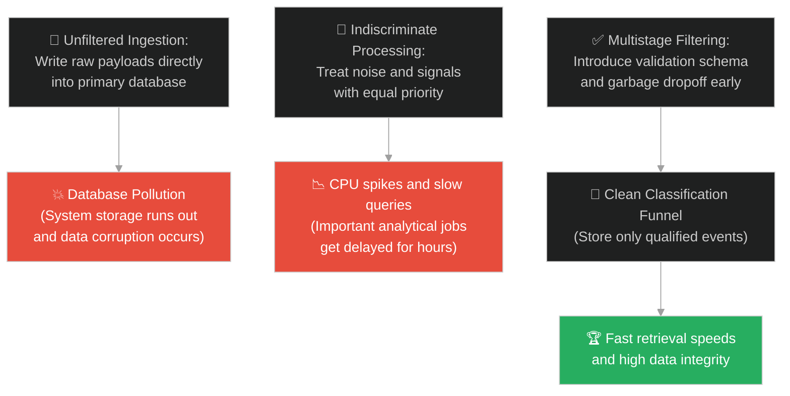
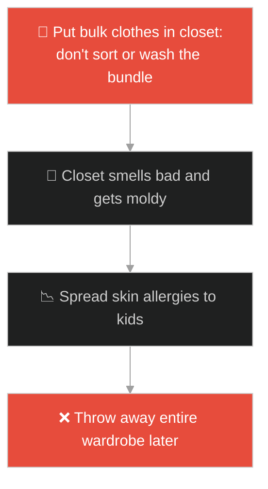
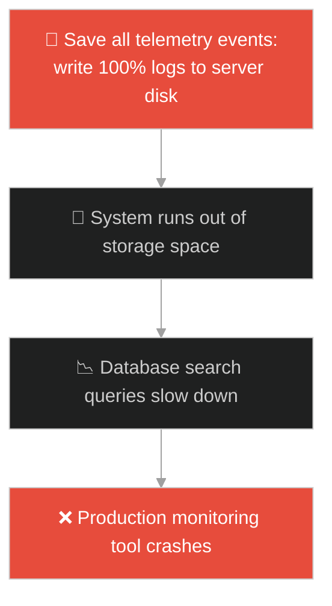
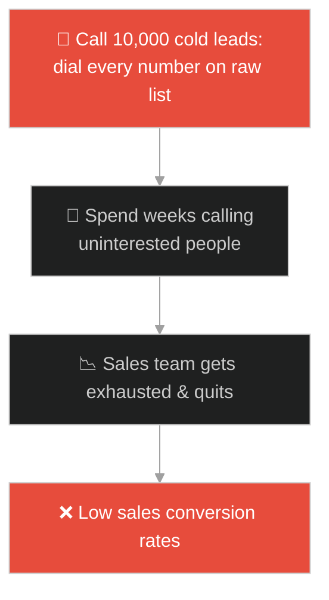
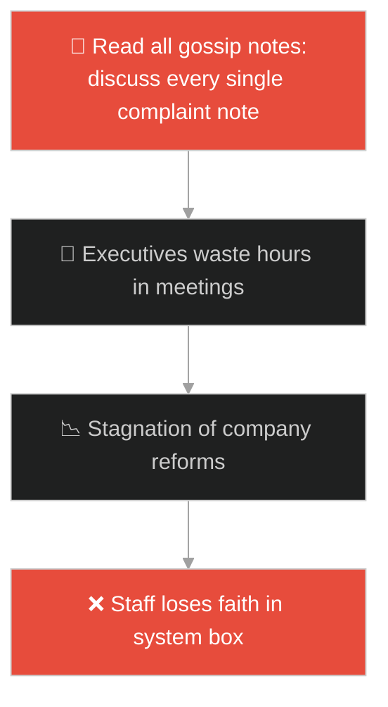
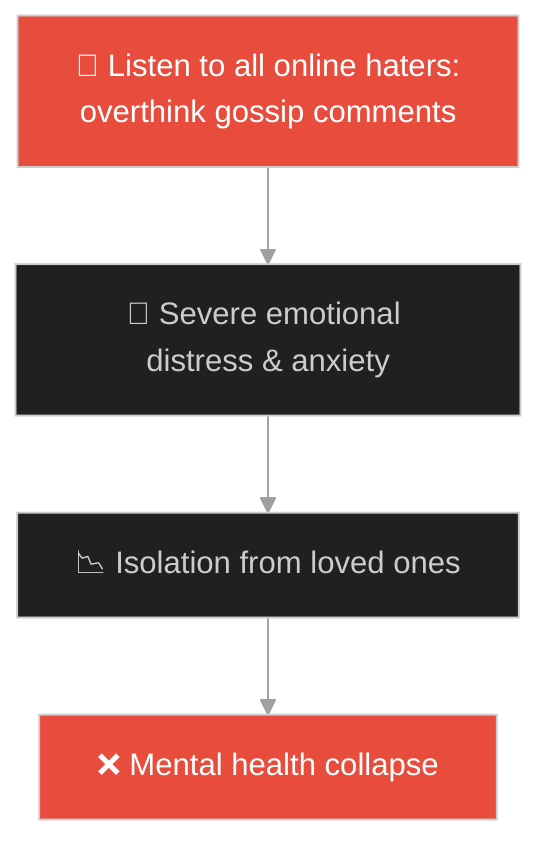
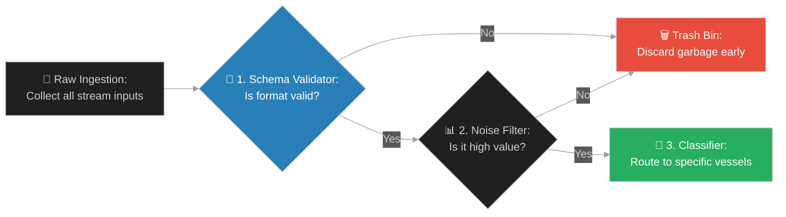

# Data Filtering & Classification Funnels (សំណាញ់ចាប់ត្រី)៖ ការច្រោះទិន្នន័យ និងរូងចំណាត់ថ្នាក់ព័ត៌មាន (Data Filtering & Classification Funnels & Data Classification Pipelines and Stream Filtering & Dragnet)

**Author:** ichamrong  
**Date:** 2026-05-28  
**Tags:** #jesus #data-filtering #data-pipeline #stream-processing #data-classification #validation #clean-architecture  
**Category:** Concepts / Parables  
**Read Time:** ~15 min  

---

## 📌 មាកិកា (Table of Contents)
- [អន្ទាក់ផ្លូវចិត្ត (The Trap)](#0)
- [១. រឿងព្រេងនិទាន៖ សំណាញ់អូសត្រីចម្រុះពណ៌ (The Legend of the Dragnet)](#1)
  - [ការបែងចែកកន្ត្រក និងការលុបបំបាត់សំណល់ឥតប្រយោជន៍ (Vessel Classification and Waste Sorting)](#1-1)
- [២. បញ្ហា៖ ការបំពុលមូលដ្ឋានទិន្នន័យដោយសារព័ត៌មានឥតសណ្តាប់ធ្នាប់ (The Issue: Database Pollution and Unfiltered Data Ingestion)](#2)
- [៣. ឧទាហមណ៍ជាក់ស្តែងក្នុងពិភពពិត (Real World Examples)](#3)
  - [ឧទាហរណ៍ទី ១ — កម្រិតស្រាល (គ្រួសារ)៖ ការទិញខោអាវជជុះជាបាច់មកប្រើប្រាស់ (Sorting Bulk Second-Hand Clothes vs Washing & Discarding)](#3-1)
  - [ឧទាហរណ៍ទី ២ — កម្រិតមធ្យម (បច្ចេកទេស)៖ ការរក្សាទុកទិន្នន័យ Log គ្រប់ប្រភេទដោយគ្មានការត្រង (Storing Raw Debug Logs vs Elasticsearch Filtering Funnel)](#3-2)
  - [ឧទាហរណ៍ទី ៣ — កម្រិតមធ្យម (ធុរកិច្ច)៖ ដំណើរការទាក់ទាញអតិថិជនសក្តានុពលដោយគ្មានការចម្រោះ (Cold Call Lead Lists vs Qualified Lead Pipeline)](#3-3)
  - [ឧទាហរណ៍ទី ៤ — កម្រិតមធ្យម (សង្គម/គ្រប់គ្រង)៖ ការប្រមូលមតិយោបល់បុគ្គលិកមកវិភាគការងារ (Handling Employee Suggestion Box vs Actionable Sorting)](#3-4)
  - [ឧទាហរណ៍ទី ៥ — កម្រិតធ្ងន់ (ទំនាក់ទំនង)៖ ការទទួលយកព័ត៌មាននិងការរិះគន់តាមបណ្តាញសង្គម (Absorbing Social Media Gossip vs Direct Relationship Filtering)](#3-5)
- [៤. ដំណោះស្រាយទូទៅ៖ ការបង្កើតខ្សែសង្វាក់តម្រងទិន្នន័យ និងយន្តការកំណត់សុពលភាព (The General Solution: Designing Multistage Stream Filtering Pipelines and Validators)](#4)
- [សេចក្តីសន្និដ្ឋាន (Conclusion)](#5)
- [ឯកសារយោង (References)](#6)
- [Related Posts](#7)

---

<a id="0"></a>
## អន្ទាក់ផ្លូវចិត្ត (The Trap)

តើអ្នកធ្លាប់ជួបបញ្ហាដែលម៉ាស៊ីនផ្ទុកទិន្នន័យ (Database Storage) របស់អ្នកពេញ ឬដំណើរការយឺតខ្លាំង ដោយសារតែវាត្រូវផ្ទុកនូវរាល់ទិន្នន័យឥតប្រយោជន៍ ទិន្នន័យស្ទួន ឬទិន្នន័យដែលគ្មានសុពលភាព ដែលបាញ់មកពីគ្រប់ទិសទីដែរឬទេ?

នៅក្នុងវិស្វកម្មទិន្នន័យ (Data Engineering) និងការគិតជាប្រព័ន្ធ៖
* **យើងងាយនឹងធ្លាក់ក្នុងអន្ទាក់** នៃការប្រមូលទិន្នន័យគ្រប់យ៉ាង (Bulk Ingestion) ដោយគ្មានការច្រោះ ឬចាត់ចំណាត់ថ្នាក់តាំងពីដំបូង ដោយរំពឹងថានឹងដោះស្រាយវានៅពេលក្រោយ ធ្វើឱ្យប្រព័ន្ធទាំងមូលត្រូវបំពុល និងខូចទម្រង់។
* **យើងមើលរំលង** សារៈសំខាន់នៃការបង្កើត "រូងចម្រោះទិន្នន័យ (Filtering Funnel)" ដែលមានតួនាទីត្រួតពិនិត្យ និងសម្អាតធាតុចូល មុននឹងអនុញ្ញាតឱ្យពួកវាចូលទៅក្នុងប្រព័ន្ធផ្ទុកស្នូល។

ការបង្កើតយន្តការបែងចែក និងជម្រុះកាកសំណល់ចេញពីទិន្នន័យសកម្ម ហៅថា **ការច្រោះទិន្នន័យ និងរូងចំណាត់ថ្នាក់ព័ត៌មាន (Data Filtering & Classification Funnels)**។

ដើម្បីយល់ដឹងពីយន្តការនេះ នេះជាផែនទីបង្ហាញផ្លូវ៖
1. **រឿងព្រេងនិទាន (The Legend)** — រឿងរ៉ាវរបស់អ្នកនេសាទដែលបោះសំណាញ់ចាប់ត្រីបានគ្រប់ប្រភេទ ហើយអូសមកលើច្រាំងដើម្បីរើសយកត្រីល្អដាក់កន្ត្រក និងបោះចោលត្រីស្អុយ។
2. **បញ្ហា (The Issue)** — ផលប៉ះពាល់នៃការបញ្ជូនទិន្នន័យឆៅ (Raw Data) ដោយគ្មានការច្រោះ (Filter) នាំឱ្យកើតមានបញ្ហា Database Bloat និង SQL Injection។
3. **ឧទាហមណ៍ជាក់ស្តែង (Real World Examples)** — ពិនិត្យមើលបញ្ហានេះក្នុងកម្រិតគ្រួសារ បច្ចេកវិទ្យា ធុរកិច្ច ការគ្រប់គ្រង និងទំនាក់ទំនង។
4. **ដំណោះស្រាយទូទៅ (The General Solution)** — ការកសាងស្ថាបត្យកម្ម Multistage Pipelines ជាមួយនឹង Validation, Cleansing និង Classification Stages។



---

<a id="1"></a>
## ១. រឿងព្រេងនិទាន៖ សំណាញ់អូសត្រីចម្រុះពណ៌ (The Legend of the Dragnet)

ព្រះយេស៊ូវបានបង្រៀនសិស្សរបស់ទ្រង់អំពីដំណើរការនៃការបញ្ចប់ ឬការវិនិច្ឆ័យចុងក្រោយ តាមរយៈរឿងនេះ។

ទ្រង់មានបន្ទូលថា៖ *"នគរស្ថានសួគ៌ប្រៀបដូចជា សំណាញ់ដ៏ធំមួយដែលគេបានបោះទៅក្នុងសមុទ្រ។ សំណាញ់នោះ បានប្រមូល និងអូសទាញយកត្រីគ្រប់ប្រភេទទាំងអស់ទាំងតូចទាំងធំ ទាំងល្អទាំងអាក្រក់ រួមទាំងកាកសំណល់ផ្សេងៗ ដែលនៅតាមផ្លូវរបស់វា។"*

នៅក្នុងពិភពលោក យើងស្រូបទាញយកអ្វីៗគ្រប់យ៉ាងមកចូលក្នុងជីវិតរបស់យើង ដូចជាសំណាញ់នេះអញ្ចឹង (មនុស្សល្អ មនុស្សអាក្រក់ ព័ត៌មានពិត ព័ត៌មានក្លែងក្លាយ ទម្លាប់ល្អ និងទម្លាប់អាក្រក់)។

---

<a id="1-1"></a>
### ការបែងចែកកន្ត្រក និងការលុបបំបាត់សំណល់ឥតប្រយោជន៍ (Vessel Classification and Waste Sorting)

ព្រះយេស៊ូវបានបន្តថា៖ 

> *"នៅពេលដែលសំណាញ់នោះពេញ អ្នកនេសាទក៏ទាញវាឡើងមកលើច្រាំង។ បន្ទាប់មក ពួកគេក៏អង្គុយចុះ ហើយចាប់ផ្តើមរើសបែងចែក។ **ពួកគេរើសយកត្រីដែលល្អៗ ដាក់ចូលទៅក្នុងកន្ត្រក (Vessel/Basket) ចំណែកឯត្រីដែលមិនល្អ ឬកាកសំណល់អាក្រក់ៗ ត្រូវបោះចោលទៅក្រៅវិញ**។"*

រឿងនេះស្រដៀងនឹងរឿង "ស្រូវសាលី និងស្មៅអាក្រក់" ដែរ។ នៅក្នុងសមុទ្រ (ពិភពលោក) ល្អនិងអាក្រក់ហែលលាយឡំគ្នា តែនៅចុងបញ្ចប់ អ្នកត្រូវតែឆ្លងកាត់ដំណើរការនៃការរើសជម្រុះ (Sorting/Discernment)។

---

<a id="2"></a>
## ២. បញ្ហា៖ ការបំពុលមូលដ្ឋានទិន្នន័យដោយសារព័ត៌មានឥតសណ្តាប់ធ្នាប់ (The Issue: Database Pollution and Unfiltered Data Ingestion)

នៅក្នុងបច្ចេកវិទ្យាទិន្នន័យ៖
1. **បញ្ហាផ្ទុកកាកសំណល់ (Data Bloating)៖** នៅពេលប្រព័ន្ធស្រូបយក Sensor Telemetry ឬ User Logs ដោយគ្មានការត្រង ៩៥% នៃទិន្នន័យនោះជាព័ត៌មានមិនចាំបាច់ (Noise - ដូចជា ព័ត៌មាន Ping ជោគជ័យ) ដែលធ្វើឱ្យថវិកាផ្ទុកទិន្នន័យ (Cloud Storage Bills) កើនឡើងយ៉ាងគំហុក។
2. **ការបាត់បង់គុណភាពទិន្នន័យ (Low Data Integrity)៖** ប្រសិនបើទិន្នន័យគ្មានទម្រង់ត្រឹមត្រូវ (Unstructured & Malformed) ត្រូវបានអនុញ្ញាតឱ្យចូលរួមជាមួយទិន្នន័យចម្បង វានឹងបង្កផលវិបាកដល់ការធ្វើការវិភាគ (Analytics & ML models)។

ខាងក្រោមនេះជាការប្រៀបធៀបរវាងការសរសេរកូដដែលទទួលយកអ្វីគ្រប់យ៉ាង និងកូដដែលមាន Filter Pipeline ត្រឹមត្រូវ៖

### Fragile Implementation (Unvalidated Database Ingestion)
កូដនេះបញ្ចូលរាល់ Event Payload ដែលផ្ញើមកពីឧបករណ៍ IoT ដោយផ្ទាល់ទៅក្នុង Database ដោយគ្មានការត្រងទិន្នន័យអសកម្ម ឬការផ្ទៀងផ្ទាត់ទម្រង់ (Validation) ឡើយ៖

```typescript
// fragile_ingest.ts
import { saveToDatabase } from './db';

interface RawEvent {
    deviceId: string;
    temperature: number;
    status: string; // "DEBUG", "INFO", "ALERT", "ERROR"
    timestamp: number;
}

export async function ingestRawEvents(events: RawEvent[]): Promise<void> {
    // ទទួលយកនិងសរសេររាល់ទិន្នន័យទាំងអស់ចូល DB ភ្លាមៗ (No Filtering)
    for (const event of events) {
        console.log(`[INGEST] Writing raw event from ${event.deviceId}`);
        await saveToDatabase(event); 
        // បង្កឱ្យ Database ពេញលឿនខ្លាំងដោយសារព័ត៌មាន "DEBUG" រាប់លានជួរ
    }
}
```

### Resilient Implementation (Stream Filter & Classification Funnel)
កូដនេះអនុវត្តការច្រោះទិន្នន័យ៖ ត្រួតពិនិត្យភាពត្រឹមត្រូវ សម្អាតទិន្នន័យឆៅ និងច្រោះយកតែទិន្នន័យណាដែលមានកម្រិតអាទិភាព "ALERT" ឬ "ERROR" និងរក្សាទុកក្នុងកន្ត្រកជាក់លាក់ (Classification Tables)៖

```typescript
// resilient_ingest.ts
import { saveToAlertTable, saveToLogsTable } from './db';

interface RawEvent {
    deviceId: string;
    temperature: number;
    status: string;
    timestamp: number;
}

export async function ingestFilteredEvents(events: RawEvent[]): Promise<void> {
    const validEvents = events
        // ១. ឆែកសុពលភាពទិន្នន័យ (Schema Validation)
        .filter(event => event.deviceId && event.temperature !== undefined && event.timestamp)
        // ២. ត្រងយកតែទិន្នន័យដែលសំខាន់ (Noise Reduction Filter)
        .filter(event => event.status === "ALERT" || event.status === "ERROR" || event.temperature > 50);

    for (const event of validEvents) {
        // ៣. ចាត់ចំណាត់ថ្នាក់ប្រភេទទិន្នន័យ និងដាក់ចូលកន្ត្រកសមស្រប (Classification Funnel)
        if (event.status === "ALERT") {
            console.log(`[ALERT FUNNEL] Directing device ${event.deviceId} to Alert Storage.`);
            await saveToAlertTable(event);
        } else {
            console.log(`[LOG FUNNEL] Directing device ${event.deviceId} to Clean Log Storage.`);
            await saveToLogsTable(event);
        }
    }
}
```

---

<a id="3"></a>
## ៣. ឧទាហមណ៍ជាក់ស្តែងក្នុងពិភពពិត

---

<a id="3-1"></a>
### ឧទាហមណ៍ទី ១ — កម្រិតស្រាល (គ្រួសារ)៖ ការទិញខោអាវជជុះជាបាច់មកប្រើប្រាស់ (Sorting Bulk Second-Hand Clothes vs Washing & Discarding)

គ្រួសារមួយបានទិញសម្លៀកបំពាក់ជជុះមួយបាវធំតម្លៃថោក (អូសសំណាញ់)។ នៅពេលដឹកមកដល់ផ្ទះ ពួកគេមិនបានយកមកប្រើប្រាស់ភ្លាមៗឡើយ។ ពួកគេបានចាក់ចេញលើកម្រាល (ទាញឡើងច្រាំង) រួចរើសយកតែអាវដែលមានសភាពល្អមកបោកគក់ទុកក្នុងទូ (កន្ត្រក) ចំណែកអាវដែលរហែក ឬប្រឡាក់ខ្លាំង ត្រូវយកទៅធ្វើជាក្រណាត់ជូតឥដ្ឋ ឬបោះចោល (បោះចោលក្រៅ)។



---

<a id="3-2"></a>
### ឧទាហមណ៍ទី ២ — កម្រិតមធ្យម (បច្ចេកទេស)៖ ការរក្សាទុកទិន្នន័យ Log គ្រប់ប្រភេទដោយគ្មានការត្រង (Storing Raw Debug Logs vs Elasticsearch Filtering Funnel)

ក្រុមហ៊ុនទូរស័ព្ទមួយទទួលបានទិន្នន័យ Log ពី App របស់អតិថិជនរាប់លាននាក់។ ប្រសិនបើពួកគេសរសេររាល់ Log ចូលទៅក្នុង Elasticsearch Cloud ពួកគេត្រូវបង់ថ្លៃសេវាផ្ទុកទិន្នន័យ ៥០,០០០ ដុល្លារក្នុងមួយខែ។ ក្រោយពីអនុវត្ត Logstash Filter ពួកគេបានបោះចោល Log ប្រភេទ "DEBUG" (Noise) និងរក្សាទុកតែ Log "ERROR" ធ្វើឱ្យការចំណាយធ្លាក់ចុះមកត្រឹម ២,០០០ ដុល្លារ។



---

<a id="3-3"></a>
### ឧទាហមណ៍ទី ៣ — កម្រិតមធ្យម (ធុរកិច្ច)៖ ដំណើរការទាក់ទាញអតិថិជនសក្តានុពលដោយគ្មានការចម្រោះ (Cold Call Lead Lists vs Qualified Lead Pipeline)

ក្រុមហ៊ុន B2B មួយបានទិញបញ្ជីលេខទូរស័ព្ទរបស់ក្រុមហ៊ុន ១០,០០០ នាក់។ ជំនួសឱ្យការឱ្យបុគ្គលិកលក់ Call ទៅកាន់លេខទាំងនោះម្តងមួយៗ (ដែលភាគច្រើនមិនត្រូវការផលិតផល) ពួកគេបានផ្ញើអ៊ីមែលស្ទង់មតិខ្លីមួយជាមុន។ មានតែក្រុមហ៊ុន ៣០០ នាក់ប៉ុណ្ណោះដែលឆ្លើយតបការស្ទង់មតិ (Qualified Leads)។ ក្រុមលក់បានផ្តោតការ Call តែលើក្រុមហ៊ុន ៣០០ នេះ ធ្វើឱ្យល្បឿននៃការលក់កើនឡើង ៥ ដង។



---

<a id="3-4"></a>
### ឧទាហមណ៍ទី ៤ — កម្រិតមធ្យម (សង្គម/គ្រប់គ្រង)៖ ការប្រមូលមតិយោបល់បុគ្គលិកមកវិភាគការងារ (Handling Employee Suggestion Box vs Actionable Sorting)

នៅក្នុងក្រុមហ៊ុនធំមួយ នាយកផ្នែកធនធានមនុស្សបានបើក "ប្រអប់មតិយោបល់អនាមិក (Suggestion Box)"។ ជារៀងរាល់ខែ គាត់ទទួលបានសាររាប់ពាន់ដែលភាគច្រើនជារឿងត្អូញត្អែរផ្ទាល់ខ្លួន ជម្លោះបុគ្គលិក និងរឿងឥតប្រយោជន៍។ គាត់បានបង្កើតគណៈកម្មការតូចមួយដើម្បីច្រោះយកតែ "គំនិតកែលម្អប្រព័ន្ធការងារពិតប្រាកដ" (Actionable Ideas) មកពិភាក្សាជាមួយនាយកប្រតិបត្តិ ដើម្បីកុំឱ្យខាតពេលវេលាប្រជុំ។



---

<a id="3-5"></a>
### ឧទាហមណ៍ទី ៥ — កម្រិតធ្ងន់ (ទំនាក់ទំនង)៖ ការទទួលយកព័ត៌មាននិងការរិះគន់តាមបណ្តាញសង្គម (Absorbing Social Media Gossip vs Direct Relationship Filtering)

មនុស្សម្នាក់មានប្រជាប្រិយភាពលើបណ្តាញសង្គម តែងតែអានរាល់មតិយោបល់រិះគន់ ជេរប្រមាថ និងពាក្យចចាមអារ៉ាមរបស់ជនអនាមិក។ គាត់ទទួលយកពាក្យសម្ដីទាំងនោះមកគិត និងបារម្ភរហូតកើតជំងឺបាក់ទឹកចិត្ត។ ក្រោយមក គាត់បានដំឡើង "Filter" ផ្លូវចិត្ត និងបិទមតិយោបល់របស់ជនមិនស្គាល់មុខ ដោយទទួលយកតែការរិះគន់ស្ថាបនាមកពីមិត្តភក្តិនិងគ្រួសារពិតប្រាកដប៉ុណ្ណោះ។



---

<a id="4"></a>
## ៤. ដំណោះស្រាយទូទៅ៖ ការបង្កើតខ្សែសង្វាក់តម្រងទិន្នន័យ និងយន្តការកំណត់សុពលភាព (The General Solution: Designing Multistage Stream Filtering Pipelines and Validators)

ដើម្បីធានាថាធនធានរបស់យើងស្អាត និងមានគុណតម្លៃខ្ពស់បំផុត ទាំងនៅក្នុងប្រព័ន្ធវិស្វកម្មនិងជីវិត យើងត្រូវអនុវត្តរចនាសម្ព័ន្ធតម្រងទិន្នន័យ (Classification Funnels)៖



ជំហាននៃការអនុវត្ត៖
1. **ដំណាក់កាលឆែកទម្រង់ដំបូង (Schema Validation Stage)៖** បដិសេធរាល់ទិន្នន័យណាដែលគ្មានទម្រង់ច្បាស់លាស់ ឬខូចទ្រង់ទ្រាយតាំងពីមាត់ច្រកចូល (API Gateway Level) ដើម្បីការពារកុំឱ្យវាស៊ីទំហំ RAM ឬ Bandwidth របស់ប្រព័ន្ធ។
2. **ការច្រោះសំឡេងរំខាន (Noise Reduction Filter)៖** កំណត់លក្ខខណ្ឌតម្រងឱ្យបានតឹងរ៉ឹង (ឧទាហរណ៍ មិនកត់ត្រា Log ធម្មតាទេ ត្រងទុកតែ Log Error/Warning) ដើម្បីសន្សំសំចៃទំហំផ្ទុក Database។
3. **ការចាត់ចំណាត់ថ្នាក់តាមកន្ត្រក (Vessel Classification Routing)៖** បែងចែកទិន្នន័យដែលល្អទៅរក្សាទុកតាមតារាង ឬដែនដីរបស់វា (ឧទាហរណ៍ ទិន្នន័យហិរញ្ញវត្ថុ, ទិន្នន័យអ្នកប្រើប្រាស់) ដើម្បីងាយស្រួលក្នុងការស្វែងរក និងវិភាគឡើងវិញ។
4. **ការត្រងយកតែសេចក្តីសុខក្នុងជីវិត៖** កុំអនុញ្ញាតឱ្យរាល់គំនិតអវិជ្ជមាន ព័ត៌មានមិនច្បាស់លាស់ ឬមនុស្សពុល ចូលមកគ្រប់គ្រងចិត្តគំនិតរបស់អ្នកឡើយ។ ត្រូវចេះបើកទ្វារទទួលយកតែអ្វីដែលមានគុណតម្លៃ និងគាំទ្រដល់ការលូតលាស់របស់អ្នក។

---

## 🐇 ធ្លាក់ចូលក្នុងរន្ធទន្សាយ (Enter the Rabbit Hole)

ដើម្បីស្វែងយល់បន្ថែមអំពីរបៀបដែលអ្នកចាត់ចែងការងារម្នាក់ អាចប្រើប្រាស់បច្ចេកទេសបង្រួបបង្រួមធនធាន និងការរក្សាទុកទិន្នន័យបណ្តោះអាសន្ន ដើម្បីសម្រាលបន្ទុកការងារ និងដោះស្រាយវិបត្តិហិរញ្ញវត្ថុបានយ៉ាងមានប្រសិទ្ធភាព សូមបន្តដំណើរទៅកាន់៖

* 🚀 **[ចាប់ផ្តើមដំណើររុករក (Start the Journey) ➔ API Aggregation & Strategic Caching (អ្នកចាត់ចែងមិនស្មោះត្រង់តែវៃឆ្លាត)៖ ការបង្រួបបង្រួម API និងយុទ្ធសាស្ត្ររក្សាទុកទិន្នន័យបណ្តោះអាសន្ន](./196-jesus-and-the-shrewd-manager.md)**

---

<a id="5"></a>
## សេចក្តីសន្និដ្ឋាន (Conclusion)

> **«សំណាញ់អាចទាញយកអ្វីៗគ្រប់យ៉ាងពីសមុទ្របាន តែវាជាការសម្រេចចិត្តរបស់អ្នកនេសាទលើច្រាំង ទើបកំណត់តម្លៃនៃផលនេសាទ»**

ការយល់ដឹងពីយន្តការ Filtering ជួយឱ្យយើងអាចការពារប្រព័ន្ធទិន្នន័យពីភាពស្មុគស្មាញ និងជួយឱ្យជីវិតរស់នៅប្រចាំថ្ងៃមានរបៀបរៀបរយ ស្ងប់ស្ងាត់ និងពោរពេញដោយគុណភាពខ្ពស់បំផុត។

---

<a id="6"></a>
## ឯកសារយោង (References)

* **Parable of the Dragnet (Matthew 13:47–50)** — The historical text describing systematic collection, temporary aggregation, and critical selection on the shore.
* **Kleppmann, M.** — *Designing Data-Intensive Applications: The Big Ideas Behind Reliable, Scalable, and Maintainable Systems* (2017). A complete handbook detailing data flow filters and pipeline architectures.

---

<a id="7"></a>
## Related Posts

* [[API Aggregation & Strategic Caching](./196-jesus-and-the-shrewd-manager.md)] — ការគ្រប់គ្រងធនធានដោយការរួមបញ្ចូល និងរក្សាទុកបណ្តោះអាសន្ន។
* [[Interface Implementations vs Declarative Signatures](./197-jesus-and-the-two-sons.md)] — ការវាយតម្លៃសកម្មភាពជាក់ស្តែងធៀបនឹងការសន្យារបស់ប្រព័ន្ធ។
