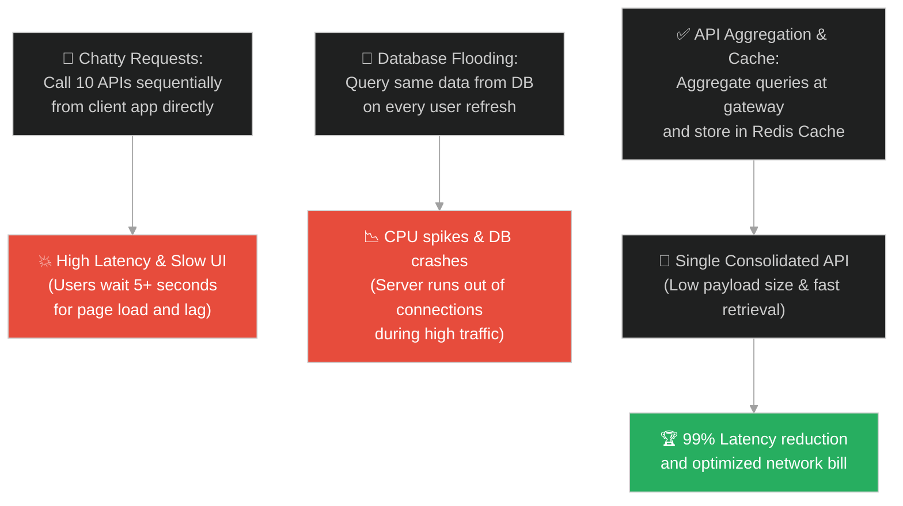
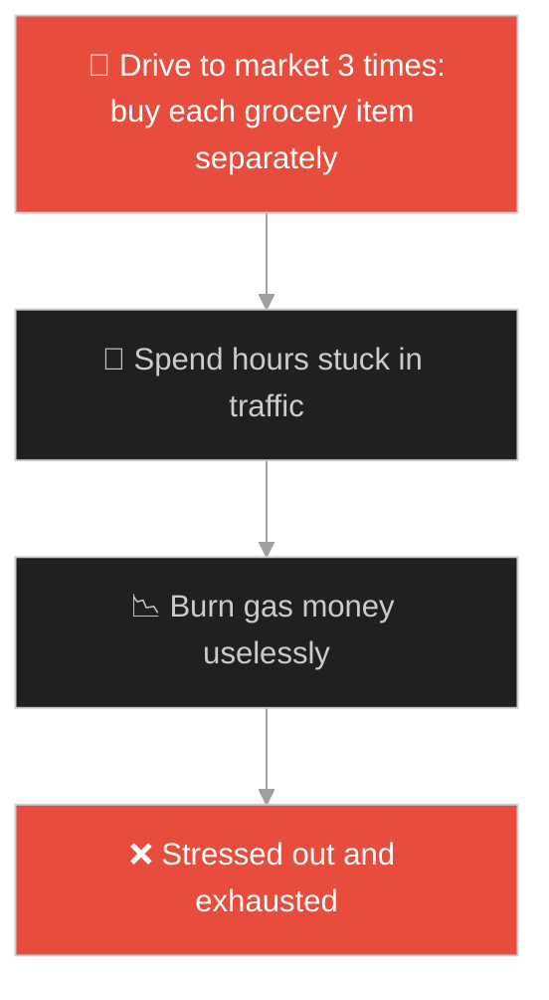
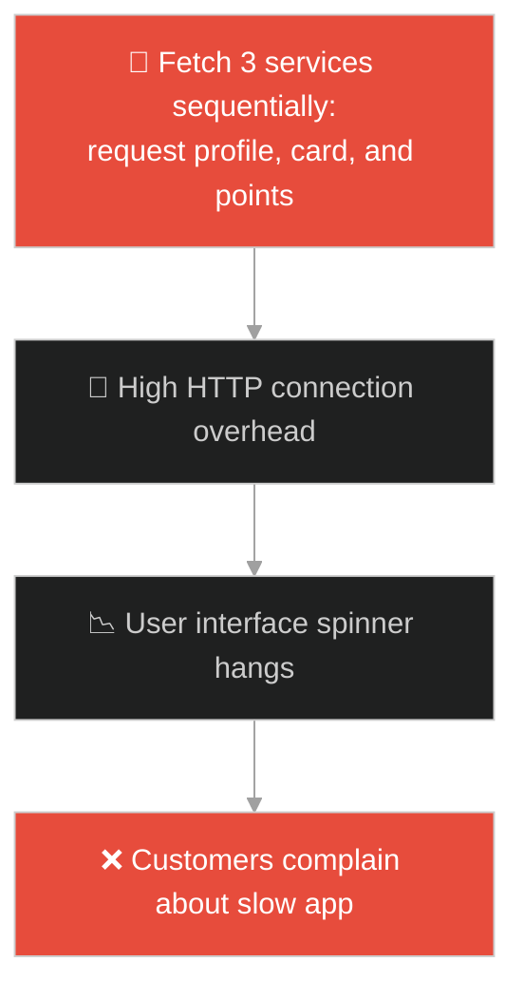
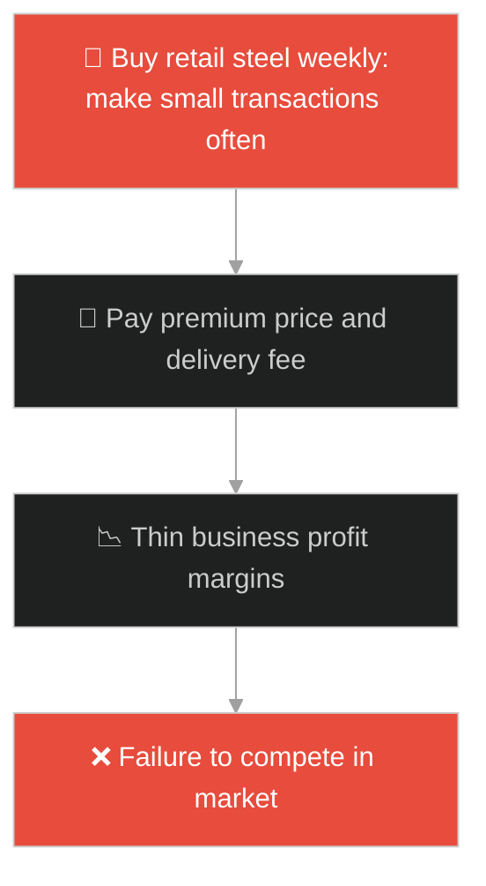
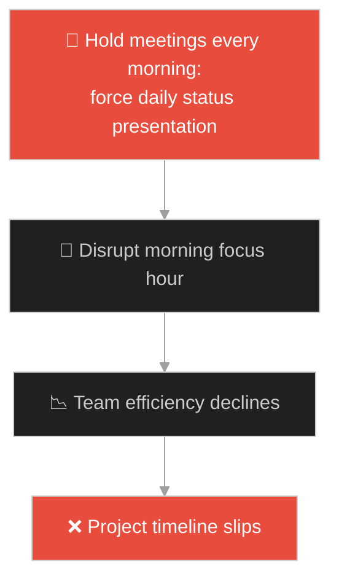
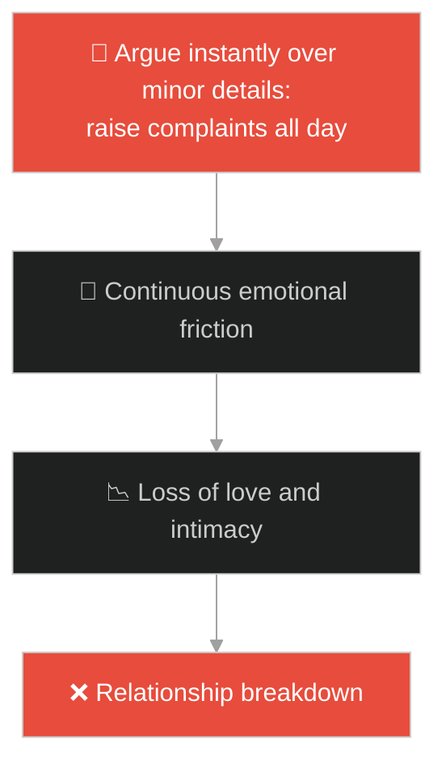

# API Aggregation & Strategic Caching (អ្នកចាត់ចែងមិនស្មោះត្រង់តែវៃឆ្លាត)៖ ការបង្រួបបង្រួម API និងយុទ្ធសាស្ត្ររក្សាទុកទិន្នន័យបណ្តោះអាសន្ន (API Aggregation & Strategic Caching & Strategic Resource Integration and Optimization Caching & Shrewd Manager)

**Author:** ichamrong  
**Date:** 2026-05-28  
**Tags:** #jesus #api-aggregation #caching #redis #api-gateway #system-optimization #latency-reduction #efficiency  
**Category:** Concepts / Parables  
**Read Time:** ~15 min  

---

## 📌 មាតិកា (Table of Contents)
- [អន្ទាក់ផ្លូវចិត្ត (The Trap)](#0)
- [១. រឿងព្រេងនិទាន៖ អ្នកចាត់ចែងទ្រព្យសម្បត្តិដែលនឹងត្រូវបណ្តេញចេញ (The Legend of the Shrewd Manager)](#1)
  - [យុទ្ធសាស្ត្រកាត់បន្ថយបំណុល និងការរក្សាទុកផលប្រយោជន៍អនាគត (Debt Reduction Strategy and Long-term Relationship Capital)](#1-1)
- [២. បញ្ហា៖ ការហៅទិន្នន័យដុះស្លែ និងបន្ទុកបណ្តាញច្រើនហួសប្រមាណ (The Issue: Network Overhead and Redundant Downstream Requests)](#2)
- [៣. ឧទាហមណ៍ជាក់ស្តែងក្នុងពិភពពិត (Real World Examples)](#3)
  - [ឧទាហរណ៍ទី ១ — កម្រិតស្រាល (គ្រួសារ)៖ ការបើកឡានទៅផ្សារទិញឥវ៉ាន់រាល់ពេលត្រូវការ (Frequent Grocery Trips vs Single Consolidated List)](#3-1)
  - [ឧទាហរណ៍ទី ២ — កម្រិតមធ្យម (បច្ចេកទេស)៖ គេហទំព័របាញ់ Request ទៅកាន់ Microservices ដាច់ដោយឡែក (Sequential API Fetches vs Aggregated Gateway with Redis)](#3-2)
  - [ឧទាហរណ៍ទី ៣ — កម្រិតមធ្យម (ធុរកិច្ច)៖ ការបញ្ជាទិញទំនិញរាយពីអ្នកផ្គត់ផ្គង់ច្រើនកន្លែង (Fragmented Bulk Ordering vs Aggregated Volume Discount)](#3-3)
  - [ឧទាហរណ៍ទី ៤ — កម្រិតមធ្យម (សង្គម/គ្រប់គ្រង)៖ ការប្រជុំទាមទាររបាយការណ៍ការងាររាល់ថ្ងៃ (Micromanaged Status Meetings vs Aggregated Weekly Dashboard)](#3-4)
  - [ឧទាហរណ៍ទី ៥ — កម្រិតធ្ងន់ (ទំនាក់ទំនង)៖ ការដោះស្រាយបញ្ហាក្នុងទំនាក់ទំនងរៀងរាល់ម៉ោង (Constant Arguing vs Scheduled Weekly Connection Sync)](#3-5)
- [៤. ដំណោះស្រាយទូទៅ៖ ការកសាង API Gateway Aggregator និងយន្តការ Cache-Aside (The General Solution: Designing Parallel Fetching Gateways and Dynamic TTL Caches)](#4)
- [សេចក្តីសន្និដ្ឋាន (Conclusion)](#5)
- [ឯកសារយោង (References)](#6)
- [Related Posts](#7)

---

<a id="0"></a>
## អន្ទាក់ផ្លូវចិត្ត (The Trap)

តើអ្នកធ្លាប់ជួបបញ្ហាដែលទំព័រដើម (Homepage) នៃកម្មវិធីទូរស័ព្ទរបស់អ្នកចំណាយពេលរហូតដល់ទៅ ៥ វិនាទីដើម្បីដំណើរការ ដោយសារតែវាត្រូវបាញ់សំណើ (Requests) ទៅកាន់សេវាកម្មដទៃទៀតចំនួន ១០ ផ្សេងគ្នាជាបន្តបន្ទាប់គ្នាដែរឬទេ?

នៅក្នុងការគ្រប់គ្រងធនធាន និងការរចនាស្ថាបត្យកម្ម៖
* **យើងងាយនឹងធ្លាក់ក្នុងអន្ទាក់** នៃការបណ្តោយឱ្យ Client ធ្វើការសួរទិន្នន័យដាច់ដោយឡែកពីគ្នា (Chatty APIs) ដែលបង្កឱ្យមានការស្ទះបណ្តាញ (Network Overhead) និងការខ្ជះខ្ជាយថាមពលប្រព័ន្ធ។
* **យើងមើលរំលង** យុទ្ធសាស្ត្ររបស់អ្នកសម្របសម្រួល (Aggregator) ដែលចេះបង្រួបបង្រួមសំណើទាំងអស់មកធ្វើក្នុងពេលតែមួយ និងរក្សាទុកទិន្នន័យដែលទទួលបាននៅក្នុង Cache (Strategic Caching) ដើម្បីប្រើប្រាស់ភ្លាមៗនៅពេលមានតម្រូវការបន្ទាន់។

ការរួមបញ្ចូលទិន្នន័យដើម្បីកាត់បន្ថយទំហំទិន្នន័យឆ្លងកាត់ និងការរក្សាទុកទិន្នន័យបណ្តោះអាសន្ន ហៅថា **យន្តការបង្រួបបង្រួម API និងយុទ្ធសាស្ត្ររក្សាទុកទិន្នន័យបណ្តោះអាសន្ន (API Aggregation & Strategic Caching)**។

ដើម្បីយល់ដឹងពីយន្តការនេះ នេះជាផែនទីបង្ហាញផ្លូវ៖
1. **រឿងព្រេងនិទាន (The Legend)** — រឿងរ៉ាវរបស់អ្នកគ្រប់គ្រងដែលនឹងត្រូវបណ្តេញចេញ ហើយបានប្រើប្រាស់អំណាចដែលនៅសេសសល់ដើម្បីកាត់បន្ថយបំណុលរបស់កូនបំណុលថៅកែ ដើម្បីសាងទំនុកចិត្តអនាគត។
2. **បញ្ហា (The Issue)** — ការវិភាគលើការខាតបង់ Latency ពីការហៅ API បន្តបន្ទាប់គ្នា និងដំណោះស្រាយ Gateway Aggregation។
3. **ឧទាហមណ៍ជាក់ស្តែង (Real World Examples)** — ពិនិត្យមើលបញ្ហានេះក្នុងកម្រិតគ្រួសារ បច្ចេកវិទ្យា ធុរកិច្ច ការគ្រប់គ្រង និងទំនាក់ទំនង។
4. **ដំណោះស្រាយទូទៅ (The General Solution)** — ការអនុវត្តស្ថាបត្យកម្ម GraphQL/BFF (Backend-For-Frontend) និងប្រព័ន្ធ Cache-Aside Pattern។



---

<a id="1"></a>
## ១. រឿងព្រេងនិទាន៖ អ្នកចាត់ចែងទ្រព្យសម្បត្តិដែលនឹងត្រូវបណ្តេញចេញ (The Legend of the Shrewd Manager)

សេដ្ឋីម្នាក់មានអ្នកគ្រប់គ្រងទ្រព្យសម្បត្តិម្នាក់ (Manager)។ ដោយសារតែលឺពាក្យចចាមអារ៉ាមថា អ្នកគ្រប់គ្រងនោះធ្វើការកេងចំណេញ និងខ្ជះខ្ជាយទ្រព្យសម្បត្តិ សេដ្ឋីក៏បានហៅគាត់មក ហើយប្រាប់ថា៖ *"ខ្ញុំនឹងបញ្ឈប់ឯងពីការងារហើយ ដូច្នេះចូរឯងទៅរៀបចំបញ្ជីស្នាមទាំងអស់មកប្រគល់ឱ្យខ្ញុំវិញឱ្យបានឆាប់!"*

អ្នកគ្រប់គ្រងនោះភ័យខ្លាំងណាស់ ក៏គិតក្នុងចិត្តថា៖ *"ឥឡូវថៅកែបញ្ឈប់ខ្ញុំហើយ។ បើឱ្យខ្ញុំទៅកាប់ដី ឬធ្វើកម្មករ ខ្ញុំគ្មានកម្លាំងធ្វើទេ។ បើឱ្យខ្ញុំទៅសុំទានគេ ខ្ញុំខ្មាសគេណាស់។ តើខ្ញុំគួរធ្វើម៉េចទៅ ដើម្បីឱ្យមានគេទទួលខ្ញុំឱ្យស្នាក់នៅផ្ទះរបស់ពួកគេ ពេលដែលខ្ញុំអស់ការងារធ្វើនេះ?"*

---

<a id="1-1"></a>
### យុទ្ធសាស្ត្រកាត់បន្ថយបំណុល និងការរក្សាទុកផលប្រយោជន៍អនាគត (Debt Reduction Strategy and Long-term Relationship Capital)

បន្ទាប់មក គាត់នឹកឃើញល្បិចមួយ។ គាត់បានកោះហៅកូនបំណុលរបស់ថៅកែគាត់ទាំងអស់មកជួបជាសម្ងាត់៖
* គាត់សួរអ្នកទី ១ ថា៖ *"តើអ្នកជំពាក់ប្រេងថៅកែខ្ញុំប៉ុន្មាន?"* កូនបំណុលឆ្លើយថា៖ *"១០០ ធុង"។* អ្នកគ្រប់គ្រងប្រាប់ថា៖ *"យកក្រដាសបំណុលរបស់អ្នកមក កែសរសេរតម្រងចរាចរណ៍តែ **៥០ ធុង** បានហើយ (កាត់បន្ថយបន្ទុក ៥០%)។"*
* គាត់សួរអ្នកទី ២ ថា៖ *"ចុះអ្នកជំពាក់ស្រូវសាលីប៉ុន្មាន?"* កូនបំណុលឆ្លើយថា៖ *"១០០ បាវ"។* គាត់ប្រាប់ថា៖ *"សរសេរតែ **៨០ បាវ** បានហើយ (កាត់បន្ថយបន្ទុក ២០%)។"*

គាត់បានធ្វើបែបនេះចំពោះកូនបំណុលទាំងអស់ ដើម្បីឱ្យពួកគេមានការដឹងគុណចំពោះគាត់។ ពេលដែលគាត់ត្រូវបញ្ឈប់ពីការងារ កូនបំណុលទាំងអស់នោះនឹងស្វាគមន៍គាត់ឱ្យទៅរស់នៅជាមួយ។

នៅពេលថៅកែដឹងរឿងនេះ ថៅកែមិនបានខឹងទេ បែរជា **សរសើរអ្នកគ្រប់គ្រងទុច្ចរិតនោះ ដែលចេះចាត់ចែងការងារយ៉ាងឈ្លាសវៃ (Shrewdly)** ទៅវិញ។ ទ្រង់ចង់បង្រៀនឱ្យយើងចេះប្រើប្រាស់ធនធានបណ្តោះអាសន្ន ដើម្បីបង្កើតតម្លៃស្ថិរភាពយូរអង្វែង។

---

<a id="2"></a>
## ២. បញ្ហា៖ ការហៅទិន្នន័យដុះស្លែ និងបន្ទុកបណ្តាញច្រើនហួសប្រមាណ (The Issue: Network Overhead and Redundant Downstream Requests)

នៅក្នុងវិស្វកម្មទិន្នន័យ និង API Design៖
1. **បញ្ហាហៅ Request ច្រើនតង់ (Underfetching/Overfetching)៖** នៅពេល UI ត្រូវការបង្ហាញព័ត៌មាន (User Profile, Orders, Notifications, and Recommendations)។ ប្រសិនបើកម្មវិធី Client ត្រូវបាញ់ Request ទៅកាន់ API នីមួយៗដាច់ដោយឡែកពីគ្នា វានឹងបង្កើតការតភ្ជាប់ TCP Handshake ច្រើនដង ធ្វើឱ្យកម្មវិធីដំណើរការយឺតខ្លាំងលើបណ្តាញ 3G/4G។
2. **បន្ទុកលើ Database ចម្បង (Database Exhaustion)៖** រាល់ការសួរព័ត៌មានដែលមិនសូវផ្លាស់ប្តូរ (Static Data - ដូចជា ព័ត៌មាន Profile) ទៅកាន់ Database រាល់ពេលមានសកម្មភាព គឺជាការខ្ជះខ្ជាយធនធាន។

ខាងក្រោមនេះជាការប្រៀបធៀបរវាងការហៅទិន្នន័យឆៅ (Fragile) និងការប្រើប្រាស់ API Aggregation រួមជាមួយ Redis Cache (Resilient)៖

### Fragile Implementation (Uncached Sequential REST Calls)
កូដនេះហៅ API នីមួយៗដាច់ដោយឡែកពីគ្នាជាបន្តបន្ទាប់ (Sequential) ដោយគ្មានការរក្សាទុកទិន្នន័យក្នុង Cache ឡើយ នាំឱ្យចំណាយពេលយូរ៖

```typescript
// fragile_aggregator.ts
import { fetchUserProfile, fetchUserOrders, fetchUserNotifications } from './services';

export async function getUserDashboardSequential(userId: string): Promise<any> {
    console.log("[INFO] Running fragile sequential API fetches...");
    
    // ១. ហៅសេវាកម្មទី ១ (រង់ចាំ ១ វិនាទី)
    const profile = await fetchUserProfile(userId);
    
    // ២. ហៅសេវាកម្មទី ២ (រង់ចាំ ១.៥ វិនាទី)
    const orders = await fetchUserOrders(userId);
    
    // ៣. ហៅសេវាកម្មទី ៣ (រង់ចាំ ០.៥ វិនាទី)
    const notifications = await fetchUserNotifications(userId);

    // សរុបពេលវេលារង់ចាំគឺ៖ ៣ វិនាទី (គាំងយូរខ្លាំង)
    return {
        profile,
        orders,
        notifications
    };
}
```

### Resilient Implementation (Parallel Gateway Aggregator with Redis Cache)
កូដនេះប្រើប្រាស់ `Promise.all` ដើម្បីហៅទិន្នន័យក្នុងពេលតែមួយ (Parallel) និងអនុវត្ត Cache-Aside Pattern ដោយប្រើ Redis ដើម្បីកាត់បន្ថយបំណុលពេលវេលារង់ចាំមកត្រឹម O(1)៖

```typescript
// resilient_aggregator.ts
import { fetchUserProfile, fetchUserOrders, fetchUserNotifications } from './services';
import { redisClient } from './redis';

export async function getUserDashboardResilient(userId: string): Promise<any> {
    const cacheKey = `dashboard:user:${userId}`;

    // ១. ព្យាយាមទាញយកពី Cache ជាមុនសិន (Strategic Caching)
    try {
        const cachedData = await redisClient.get(cacheKey);
        if (cachedData) {
            console.log("[CACHE HIT] Returning aggregated data from cache.");
            return JSON.parse(cachedData);
        }
    } catch (err) {
        console.error("[WARN] Redis error, fallback to parallel direct fetches", err);
    }

    console.log("[CACHE MISS] Executing parallel dynamic aggregation...");

    // ២. ហៅសេវាកម្មទាំងអស់ក្នុងពេលតែមួយ (Parallel Aggregation)
    const [profile, orders, notifications] = await Promise.all([
        fetchUserProfile(userId),
        fetchUserOrders(userId),
        fetchUserNotifications(userId)
    ]);

    const aggregatedResult = {
        profile,
        orders,
        notifications,
        timestamp: Date.now()
    };

    // ៣. រក្សាទុកលទ្ធផលក្នុង Cache រយៈពេល ១០ នាទី (TTL: 600 seconds)
    try {
        await redisClient.set(cacheKey, JSON.stringify(aggregatedResult), {
            EX: 600
        });
    } catch (err) {
        console.error("[ERROR] Failed to save to cache", err);
    }

    return aggregatedResult;
}
```

---

<a id="3"></a>
## ៣. ឧទាហមណ៍ជាក់ស្តែងក្នុងពិភពពិត

---

<a id="3-1"></a>
### ឧទាហមណ៍ទី ១ — កម្រិតស្រាល (គ្រួសារ)៖ ការបើកឡានទៅផ្សារទិញឥវ៉ាន់រាល់ពេលត្រូវការ (Frequent Grocery Trips vs Single Consolidated List)

សមាជិកគ្រួសារម្នាក់ បើកឡានទៅផ្សារទិញខ្ទឹមសនៅម៉ោង ៨ ព្រឹក រួចបើកទៅម្តងទៀតទិញសាច់មាន់នៅម៉ោង ១០ ព្រឹក និងទៅម្តងទៀតទិញទឹកដោះគោនៅម៉ោង ២ រសៀល។ សកម្មភាពនេះខាតបង់ប្រេងឡាន ពេលវេលា និងកម្លាំងខ្លាំង។ ដំណោះស្រាយ៖ ពួកគេគួរតែសរសេរបញ្ជីរួមគ្នា (Aggregation) និងទៅទិញតែម្តងគត់សម្រាប់ប្រើប្រាស់ពេញមួយសប្តាហ៍ (Caching)។



---

<a id="3-2"></a>
### ឧទាហមណ៍ទី ២ — កម្រិតមធ្យម (បច្ចេកទេស)៖ គេហទំព័របាញ់ Request ទៅកាន់ Microservices ដាច់ដោយឡែក (Sequential API Fetches vs Aggregated Gateway with Redis)

កម្មវិធីទូរស័ព្ទរបស់ធនាគារមួយ ត្រូវបង្ហាញសមតុល្យគណនី ចំនួនកាតឥណទាន និងពិន្ទុសន្សំនៅលើអេក្រង់ចម្បង។ ប្រសិនបើវាត្រូវទាញយកព័ត៌មានទាំងនេះពីប្រព័ន្ធ ៣ ដាច់ដោយឡែកពីគ្នា កម្មវិធីនឹងដំណើរការយឺតខ្លាំង។ ធនាគារបានបង្កើត API Gateway មួយដើម្បីបង្រួបបង្រួមព័ត៌មានទាំងនេះជា JSON តែមួយ និងរក្សាទុកក្នុង Redis រយៈពេល ៥ នាទី ធ្វើឱ្យល្បឿនបើក App កើនឡើងភ្លាមៗ។



---

<a id="3-3"></a>
### ឧទាហមណ៍ទី ៣ — កម្រិតមធ្យម (ធុរកិច្ច)៖ ការបញ្ជាទិញទំនិញរាយពីអ្នកផ្គត់ផ្គង់ច្រើនកន្លែង (Fragmented Bulk Ordering vs Aggregated Volume Discount)

ភ្នាក់ងារលក់គ្រឿងសំណង់ម្នាក់ បានទិញដែកថែបពីរបីតោនរាល់សប្តាហ៍ពី فរោងចក្រផ្សេងៗគ្នា ធ្វើឱ្យគាត់ត្រូវបង់ថ្លៃដឹកជញ្ជូនថ្លៃ និងមិនទទួលបានតម្លៃបោះដុំ។ ក្រោយមក គាត់បានប្តូរយុទ្ធសាស្ត្រដោយការប្រមូលរាល់បញ្ជាទិញរបស់អតិថិជនទាំងអស់ក្នុងរយៈពេល ៣ ខែបញ្ចូលគ្នា (Aggregation) រួចបញ្ជាទិញម្តងគត់ចំនួន ៥០ តោន ធ្វើឱ្យគាត់ទទួលបានការបញ្ចុះតម្លៃរហូតដល់ ៣០%។



---

<a id="3-4"></a>
### ឧទាហមណ៍ទី ៤ — កម្រិតមធ្យម (សង្គម/គ្រប់គ្រង)៖ ការប្រជុំទាមទាររបាយការណ៍ការងាររាល់ថ្ងៃ (Micromanaged Status Meetings vs Aggregated Weekly Dashboard)

នាយកក្រុមហ៊ុនម្នាក់បានហៅបុគ្គលិករៀបរាប់ពីការងាររបស់ពួកគេរៀងរាល់ព្រឹក (Daily Meeting) ធ្វើឱ្យបុគ្គលិកខាតពេល ១ ម៉ោងរៀងរាល់ថ្ងៃដើម្បីរៀបចំខ្លួន។ ក្រោយមក អ្នកគ្រប់គ្រងម្នាក់បានបង្រួបបង្រួមព័ត៌មានការងារទាំងអស់ទៅលើ Dashboard (ដូចជា Jira/Trello) និងបង្កើតរបាយការណ៍សង្ខេបតែម្តងក្នុងមួយសប្តាហ៍ ធ្វើឱ្យបុគ្គលិកមានពេលស្ងប់ស្ងាត់ដើម្បីសរសេរកូដ និងបង្កើនផលិតភាពការងារ។



---

<a id="3-5"></a>
### ឧទាហមណ៍ទី ៥ — កម្រិតធ្ងន់ (ទំនាក់ទំនង)៖ ការដោះស្រាយបញ្ហាក្នុងទំនាក់ទំនងរៀងរាល់ម៉ោង (Constant Arguing vs Scheduled Weekly Connection Sync)

គូស្នេហ៍ខ្លះតែងតែជជែកដេញដោលគ្នារាល់ពេលឃើញរឿងអាក់អន់ចិត្តតូចតាចពេញមួយថ្ងៃ (Chatty network calls) ធ្វើឱ្យពួកគេទាំងពីរនាក់ហត់នឿយផ្លូវចិត្ត និងគ្មានពេលសប្បាយចិត្ត។ ក្រោយមក ពួកគេបានព្រមព្រៀងគ្នា៖ រក្សាទុកកំហុសឆ្គងតូចតាចក្នុងចិត្តសិន (Cache) និងយកមកពិភាក្សាដោះស្រាយគ្នាយ៉ាងទន់ភ្លន់តែម្តងគត់នៅរៀងរាល់ល្ងាចថ្ងៃអាទិត្យ (Scheduled Aggregated Sync)។



---

<a id="4"></a>
## ៤. ដំណោះស្រាយទូទៅ៖ ការកសាង API Gateway Aggregator និងយន្តការ Cache-Aside (The General Solution: Designing Parallel Fetching Gateways and Dynamic TTL Caches)

ដើម្បីកាត់បន្ថយបំណុលនៃការរង់ចាំ និងសម្រេចបាននូវប្រសិទ្ធភាពការងារខ្ពស់បំផុត យើងត្រូវអនុវត្តប្រព័ន្ធ API Aggregation និង Caching៖


ជំហាននៃការអនុវត្ត៖
1. **ការបង្កើត API Gateway Aggregator៖** ជំនួសឱ្យការឱ្យ Client ហៅសេវាកម្មដាច់ដោយឡែកពីគ្នា ត្រូវបង្កើត Endpoint តែមួយគត់ (ដូចជា GraphQL หรือ JSON Aggregator) ដើម្បីបង្រួបបង្រួមទិន្នន័យនៅលើ Cloud មុនផ្ញើមក Client។
2. **ការអនុវត្ត Cache-Aside Pattern៖** ពិនិត្យមើល Cache ជាមុនសិន។ ប្រសិនបើមានទិន្នន័យ (Cache Hit) ត្រូវផ្ញើត្រឡប់ភ្លាមៗ។ បើគ្មាន (Cache Miss) សឹមទាញយកពី Database និងសរសេរទុកក្នុង Cache សម្រាប់អ្នកប្រើប្រាស់បន្ទាប់។
3. **ការកំណត់អាយុកាលទិន្នន័យ (TTL - Time to Live)៖** កុំរក្សាទុក Cache រហូតជារៀងរហូត។ ត្រូវកំណត់អាយុកាលសមស្រប (ឧទាហរណ៍ ៥ នាទី ឬ ៣០ នាទី) ធានាថាទិន្នន័យថ្មីត្រូវបានបង្ហាញ និងទិន្នន័យចាស់ត្រូវបានបោសសម្អាត។
4. **ការគ្រប់គ្រងធនធានក្នុងជីវិត៖** ប្រើប្រាស់ធនធានបណ្តោះអាសន្ន និងពេលវេលាដែលនៅសល់ដើម្បីកសាង "បណ្តាញទំនាក់ទំនង និងមិត្តភាព (Social Capital)" ដែលជា Cache ដ៏រឹងមាំសម្រាប់ទ្រទ្រង់អ្នកក្នុងពេលមានអាសន្ន។

---

## 🐇 ធ្លាក់ចូលក្នុងរន្ធទន្សាយ (Enter the Rabbit Hole)

ដើម្បីស្វែងយល់បន្ថែមអំពីរបៀបដែលប្រព័ន្ធវាយតម្លៃកិច្ចសន្យាការងារ មិនផ្អែកលើការសន្យា ឬការប្រកាសពីសមត្ថភាពឡើយ ប៉ុន្តែផ្តោតលើការអនុវត្តសកម្មភាពជាក់ស្តែងដើម្បីឆ្លងកាត់ការផ្ទៀងផ្ទាត់ លក្ខណៈកិច្ចសន្យា (Interfaces) សូមបន្តដំណើរទៅកាន់៖

* 🚀 **[ចាប់ផ្តើមដំណើររុករក (Start the Journey) ➔ Interface Implementations vs Declarative Signatures (កូនប្រុសពីរនាក់)៖ ការអនុវត្តការងារជាក់ស្តែង ធៀបនឹងការប្រកាសកិច្ចសន្យា](./197-jesus-and-the-two-sons.md)**

---

<a id="5"></a>
## សេចក្តីសន្និដ្ឋាន (Conclusion)

> **«ភាពប៉ិនប្រសប់ពិតប្រាកដ គឺការយករបស់បណ្តោះអាសន្នទៅបង្កើតនូវទ្រព្យសម្បត្តិ និងបណ្តាញទំនាក់ទំនងដែលមិនចេះរលាយសាបសូន្យ»**

ការអនុវត្ត API Aggregation និង Strategic Caching ជួយឱ្យយើងបង្កើនល្បឿនដំណើរការប្រព័ន្ធបច្ចេកវិទ្យា និងចេះគ្រប់គ្រងជីវិតរស់នៅប្រចាំថ្ងៃដោយឆ្លាតវៃ ត្រៀមខ្លួនរួចជាស្រេចសម្រាប់រាល់វិបត្តិដែលអាចកើតឡើងនាពេលអនាគត។

---

<a id="6"></a>
## ឯកសារយោង (References)

* **Parable of the Unjust Steward (Luke 16:1–13)** — The biblical allegory highlighting strategic foresight, networking, and clever resource reduction.
* **Richardson, C.** — *Microservices Patterns: With Examples in Java* (2018). Focuses on API Gateway and API Composition patterns.

---

<a id="7"></a>
## Related Posts

* [[Interface Implementations vs Declarative Signatures](./197-jesus-and-the-two-sons.md)] — ការវាស់ស្ទង់សមត្ថភាពប្រព័ន្ធតាមរយៈទិន្នន័យជាក់ស្តែង។
* [[Feature Discovery & API Telemetry Visibility](./199-jesus-and-the-lamp-under-a-basket.md)] — ការកត់ត្រា Telemetry និងការបង្ហាញមុខងារការងារឱ្យមានតម្លាភាព។
