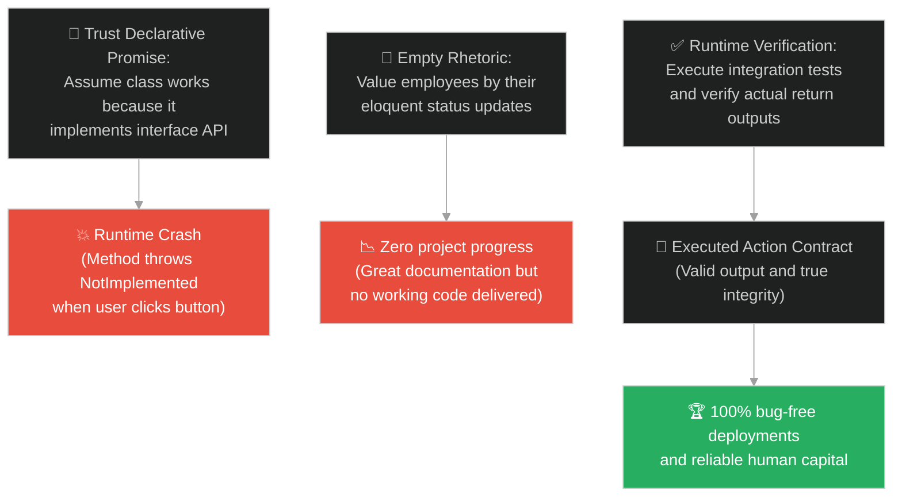
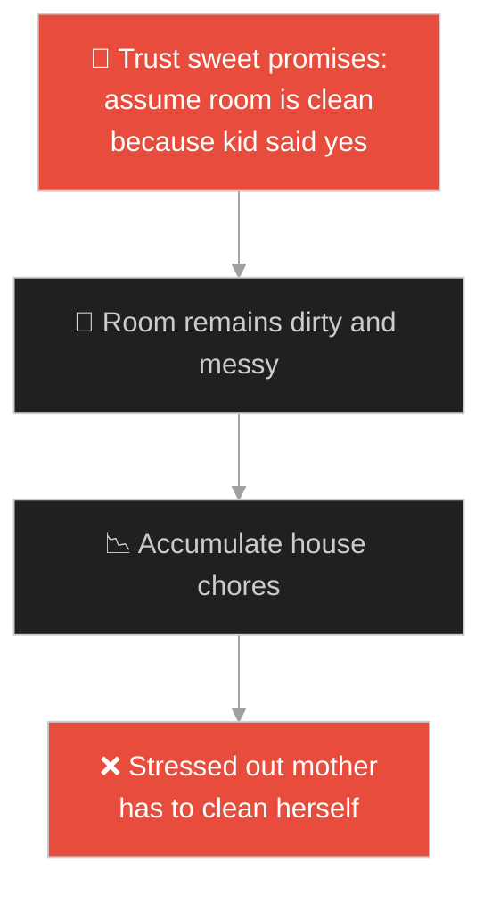
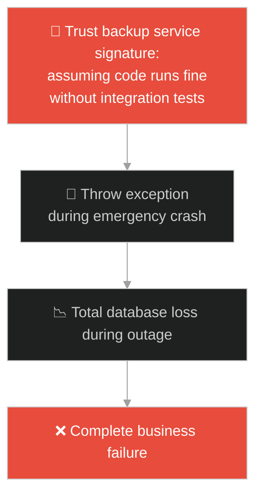
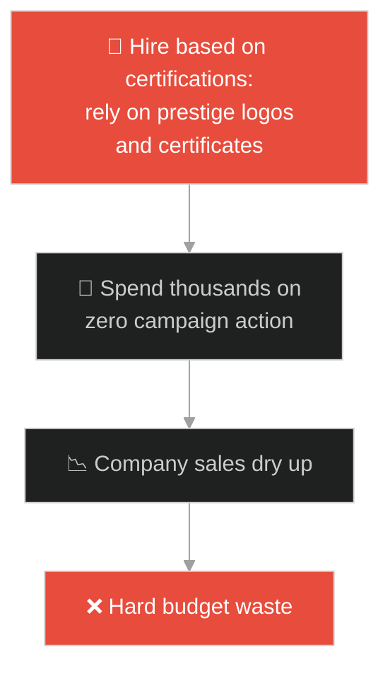
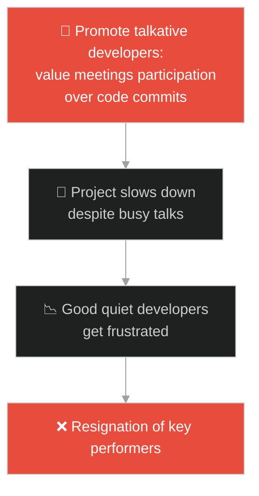
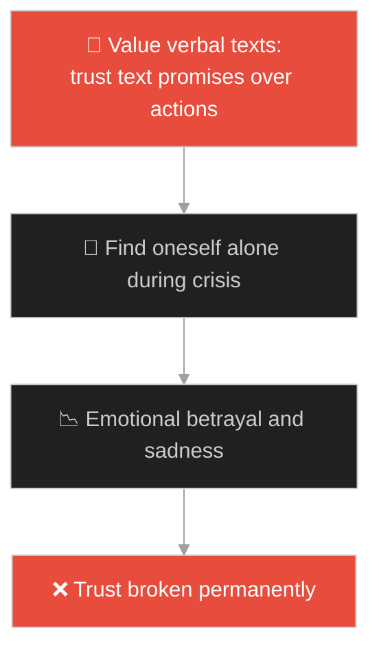
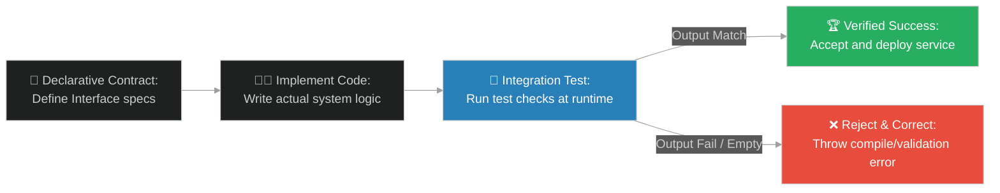

# Interface Implementations vs Declarative Signatures (កូនប្រុសពីរនាក់)៖ ការអនុវត្តការងារជាក់ស្តែង ធៀបនឹងការប្រកាសកិច្ចសន្យា (Interface Implementations vs Declarative Signatures & Runtime Implementation Verification versus Declaration Promises & Two Sons)

**Author:** ichamrong  
**Date:** 2026-05-28  
**Tags:** #jesus #interface-implementation #declarative-signature #runtime-verification #typescript #object-oriented #unit-testing #contract  
**Category:** Concepts / Parables  
**Read Time:** ~15 min  

---

## 📌 មាកិកា (Table of Contents)
- [អន្ទាក់ផ្លូវចិត្ត (The Trap)](#0)
- [១. រឿងព្រេងនិទាន៖ កូនប្រុសពីរនាក់ និងការបញ្ជាការងាររបស់ឪពុក (The Legend of the Two Sons)](#1)
  - [ភាពខុសគ្នារវាងការសន្យានិងការបំពេញភារកិច្ចជាក់ស្តែង (Verbal Assent vs Actual Harvest Execution)](#1-1)
- [២. បញ្ហា៖ ការទុកចិត្តលើកិច្ចសន្យាដែលគ្មានការអនុវត្តជាក់ស្តែង (The Issue: Trusting Declarative Signatures with Empty Runtime Executions)](#2)
- [៣. ឧទាហមណ៍ជាក់ស្តែងក្នុងពិភពពិត (Real World Examples)](#3)
  - [ឧទាហរណ៍ទី ១ — កម្រិតស្រាល (គ្រួសារ)៖ កូនសន្យាថានឹងសម្អាតបន្ទប់គេង (Child Promising to Clean Room vs Child Doing it Silently)](#3-1)
  - [ឧទាហរណ៍ទី ២ — កម្រិតមធ្យម (បច្ចេកទេស)៖ Component ប្រកាសមុខងារតែបោះកំហុសពេលហៅប្រើ (Class Declaring Interface vs Runtime Behavior Verification)](#3-2)
  - [ឧទាហរណ៍ទី ៣ — កម្រិតមធ្យម (ធុរកិច្ច)៖ ភ្នាក់ងារម៉ៅការដែលមានវិញ្ញាបនបត្រច្រើនតែគ្មានសមត្ថភាព (Certified Contractor Failures vs Practical Freelancer Delivery)](#3-3)
  - [ឧទាហរណ៍ទី ៤ — កម្រិតមធ្យម (សង្គម/គ្រប់គ្រង)៖ បុគ្គលិកដែលពូកែនិយាយក្នុងកិច្ចប្រជុំតែគ្មានលទ្ធផល (Eloquent Status Talker vs Quiet High-Output Engineer)](#3-4)
  - [ឧទាហរណ៍ទី ៥ — កម្រិតធ្ងន់ (ទំនាក់ទំនង)៖ ការបង្ហាញក្តីស្រលាញ់តាមរយៈសារទូរស័ព្ទ (Text Message Promises vs Physical Presence and Care)](#3-5)
- [៤. ដំណោះស្រាយទូទៅ៖ ការអនុវត្តស្ថាបត្យកម្មតេស្តសមត្ថភាព និងការផ្ទៀងផ្ទាត់កិច្ចសន្យា (The General Solution: Designing Dynamic Runtime Checks and Behavior-Driven Testing)](#4)
- [សេចក្តីសន្និដ្ឋាន (Conclusion)](#5)
- [ឯកសារយោង (References)](#6)
- [Related Posts](#7)

---

<a id="0"></a>
## អន្ទាក់ផ្លូវចិត្ត (The Trap)

តើអ្នកធ្លាប់ជួបបញ្ហាដែលប្រព័ន្ធការងារជួបកំហុសគាំងដួល (Runtime Error) ដោយសារតែអ្នកបានជឿជាក់លើការប្រកាសមុខងារ (Declarative Signature) របស់សមាសភាគមួយ តែនៅពេលដំណើរការជាក់ស្តែង សមាសភាគនោះមិនមានកូដអនុវត្តការងារទាល់តែសោះ (Not Implemented) ដែរឬទេ?

នៅក្នុងវិស្វកម្មសូហ្វវែរ និងការគ្រប់គ្រង៖
* **យើងងាយនឹងធ្លាក់ក្នុងអន្ទាក់** នៃការវាយតម្លៃប្រព័ន្ធ ឬបុគ្គលិកដោយផ្អែកលើអ្វីដែលពួកគេ "ប្រកាស" ឬ "សន្យា" (Declarative Signature / Empty Promises) ដោយមើលរំលងការពិនិត្យមើលលទ្ធផលការងារជាក់ស្តែង។
* **យើងមើលរំលង** សារៈសំខាន់នៃការផ្ទៀងផ្ទាត់សមត្ថភាពនៅពេលដំណើរការ (Runtime Verification) ដែលជាខែលការពារតែមួយគត់ ដើម្បីធានាថារាល់កិច្ចសន្យាទាំងអស់ត្រូវបានអនុវត្តពិតប្រាកដ។

ការយល់ដឹងពីភាពខុសគ្នារវាងការសន្យាតាមទម្រង់ និងការអនុវត្តការងារ ហៅថា **ការអនុវត្តការងារជាក់ស្តែង ធៀបនឹងការប្រកាសកិច្ចសន្យា (Interface Implementations vs Declarative Signatures)**។

ដើម្បីយល់ដឹងពីគោលការណ៍នេះ នេះជាផែនទីបង្ហាញផ្លូវ៖
1. **រឿងព្រេងនិទាន (The Legend)** — រឿងរ៉ាវរបស់កូនប្រុសពីរនាក់ ដែលម្នាក់និយាយថា "មិនទៅ" តែលួចទៅធ្វើការ និងម្នាក់ទៀតនិយាយថា "ទៅ" តែអវត្តមាន។
2. **បញ្ហា (The Issue)** — ការវិភាគលើបញ្ហានៅពេលកូដប្រកាស Interface Contract តែមិនសរសេរ Logic ខាងក្នុង នាំឱ្យកើតមានកំហុសពេល App ដំណើរការ។
3. **ឧទាហមណ៍ជាក់ស្តែង (Real World Examples)** — ពិនិត្យមើលបញ្ហានេះក្នុងកម្រិតគ្រួសារ បច្ចេកវិទ្យា ធុរកិច្ច ការគ្រប់គ្រង និងទំនាក់ទំនង។
4. **ដំណោះស្រាយទូទៅ (The General Solution)** — ការបង្កើតការសាកល្បងដោយស្វ័យប្រវត្តិតាមរយៈ Unit Tests និង Behavior-Driven Development (BDD)។



---

<a id="1"></a>
## ១. រឿងព្រេងនិទាន៖ កូនប្រុសទាំងពីរ (The Two Sons)

ព្រះយេស៊ូវបានបង្រៀនអ្នកដឹកនាំសាសនាដែលពូកែតែខាងនិយាយ តាមរយៈរឿងប្រៀបប្រដៅដ៏ខ្លីមួយ អំពីបុរសម្នាក់ដែលមានកូនប្រុសពីរនាក់។

ថ្ងៃមួយ ឪពុកបានដើរទៅរកកូនប្រុសទី ១ ហើយប្រាប់ថា៖ *"កូនអើយ! ថ្ងៃនេះ ទៅជួយធ្វើការនៅក្នុងចម្ការទំពាំងបាយជូររបស់ពុកផង។"* 

កូនទី ១ ឆ្លើយយ៉ាងកោងកាចថា៖ **"ខ្ញុំមិនទៅទេ!"** ប៉ុន្តែក្រោយមក គេមានវិប្បដិសារី នឹកអាណិតឪពុក ក៏សម្រេចចិត្តក្រោកដើរទៅជួយធ្វើការនៅចម្ការនោះទៅ (គ្មានសន្យាតែមានទង្វើ)។

---

<a id="1-1"></a>
### ភាពខុសគ្នារវាងការសន្យានិងការបំពេញភារកិច្ចជាក់ស្តែង (Verbal Assent vs Actual Harvest Execution)

បន្ទាប់មក ឪពុកក៏បានដើរទៅរកកូនប្រុសទី ២ ហើយប្រាប់ដូចគ្នា។

កូនទី ២ ឆ្លើយយ៉ាងពីរោះ និងគោរពថា៖ **"បាទលោកពុក! ខ្ញុំនឹងទៅឥឡូវនេះហើយ!"** ប៉ុន្តែរហូតដល់ល្ងាច គេមិនបានទៅធ្វើការនៅចម្ការនោះទាល់តែសោះ (មានសន្យាតែគ្មានទង្វើ)។

ព្រះយេស៊ូវបានសួរអ្នកដឹកនាំសាសនាទាំងនោះថា៖ *"តើក្នុងចំណោមកូនទាំងពីរនេះ មួយណាដែលបានធ្វើតាមបំណងប្រាថ្នារបស់ឪពុក?"*

ពួកគេឆ្លើយថា៖ *"គឺកូនទី ១"*។

ព្រះយេស៊ូវបានបញ្ជាក់ថា ទង្វើជាក់ស្តែងទើបជាអ្វីដែលកំណត់តម្លៃពិត។

---

<a id="2"></a>
## ២. បញ្ហា៖ ការទុកចិត្តលើកិច្ចសន្យាដែលគ្មានការអនុវត្តជាក់ស្តែង (The Issue: Trusting Declarative Signatures with Empty Runtime Executions)

នៅក្នុងស្ថាបត្យកម្មកម្មវិធីកុំព្យូទ័រ (Software Architecture)៖
1. **កិច្ចសន្យាទទេ (Empty Declarative Contract)៖** កើតឡើងនៅពេលដែល Class មួយប្រកាសថាខ្លួន implements Interface ណាមួយ ប៉ុន្តែមុខងារខាងក្នុងត្រូវបានទុកទទេ ឬគ្រាន់តែបោះ Error ចេញមក (Throwing `NotImplementedError`)។
2. **ការទុកចិត្តដោយងងឹតងងុល (Compiler Fallacy)៖** Compiler ប្រហែលជាអនុញ្ញាតឱ្យកូដនេះឆ្លងកាត់ដោយជោគជ័យ (Compile OK) ព្រោះទម្រង់នៃការសរសេរត្រូវតាមលក្ខខណ្ឌ ប៉ុន្តែវានឹងគាំងនៅពេលអ្នកប្រើប្រាស់ចុចដំណើរការមុខងារនោះនៅ Runtime។

ខាងក្រោមនេះជាការប្រៀបធៀបរវាង Class ដែលសន្យាតែមិនអនុវត្ត (Fragile) និងការបង្កើតយន្តការតេស្តសមត្ថភាពពិតប្រាកដ (Resilient)៖

### Fragile Implementation (Declarative Implementation with Runtime Defect)
កូនប្រុសទី ២ (Son2) ប្រកាសថាខ្លួនអនុវត្តភារកិច្ចចម្ការ (`VineyardWorker`) ប៉ុន្តែមុខងារ `workInVineyard` ខាងក្នុងបែរជាទុកទទេ និងគ្មានលទ្ធផលជាក់ស្តែង៖

```typescript
// fragile_implementation.ts
interface VineyardWorker {
    name: string;
    workInVineyard(): void;
}

// កូនប្រុសទី ២: សន្យាយ៉ាងល្អ (Declarative Promise) តែគ្មានសកម្មភាព
export class Son2 implements VineyardWorker {
    public name = "Son Two";

    public workInVineyard(): void {
        console.log(`[LOG] Son Two says: "Yes, father, I will go."`);
        // គ្មានកូដការងារជាក់ស្តែង (Empty implementation)
        // ធនធានចម្ការមិនត្រូវបានប្រមូលផលឡើយ
    }
}
```

### Resilient Implementation (Behavior Verification and Integration Test)
កូនប្រុសទី ១ (Son1) ទោះបីជាបដិសេធដំបូង តែបានអនុវត្តមុខងារពិតប្រាកដ។ យើងបង្កើតតេស្តសាកល្បងសមត្ថភាព (Test Suite) ដើម្បីឆែកលទ្ធផលការងារជាក់ស្តែង (Behavioral Verification) មិនមែនឆែកតែឈ្មោះ Interface ឡើយ៖

```typescript
// resilient_implementation.ts
interface VineyardWorker {
    name: string;
    workInVineyard(): { grapeHarvestedKgs: number };
}

export class Son1 implements VineyardWorker {
    public name = "Son One";

    public workInVineyard() {
        console.log(`[LOG] Son One initially said No, but repented and went to work.`);
        // អនុវត្តសកម្មភាពជាក់ស្តែង
        return { grapeHarvestedKgs: 50 }; 
    }
}

// ម៉ាស៊ីនផ្ទៀងផ្ទាត់លទ្ធផលការងារ (Behavioral Contract Verifier)
export class VineyardAuditSystem {
    public static verifyWorkerPerformance(worker: VineyardWorker): boolean {
        try {
            const result = worker.workInVineyard();
            // ផ្ទៀងផ្ទាត់ថាតើការងារពិតប្រាកដត្រូវបានបង្កើតឡើងដែរឬទេ (Runtime Verification)
            if (result && result.grapeHarvestedKgs > 0) {
                console.log(`[AUDIT SUCCESS] ${worker.name} successfully delivered ${result.grapeHarvestedKgs}kg of grapes.`);
                return true;
            }
            console.error(`[AUDIT FAILURE] ${worker.name} made promises but delivered 0kg grapes.`);
            return false;
        } catch (error) {
            console.error(`[AUDIT FAILURE] Worker ${worker.name} crashed with error:`, error.message);
            return false;
        }
    }
}
```

---

<a id="3"></a>
## ៣. ឧទាហមណ៍ជាក់ស្តែងក្នុងពិភពពិត

---

<a id="3-1"></a>
### ឧទាហមណ៍ទី ១ — កម្រិតស្រាល (គ្រួសារ)៖ កូនសន្យាថានឹងសម្អាតបន្ទប់គេង (Child Promising to Clean Room vs Child Doing it Silently)

កូនប្រុសទី ២ បានសន្យាយ៉ាងផ្អែមល្ហែមជាមួយម្តាយថា៖ *"ម៉ាក់! ខ្ញុំនឹងបោសសំអាតបន្ទប់គេងថ្ងៃនេះ!"*។ ប៉ុន្តែដល់ល្ងាច បន្ទប់នៅតែធូលីដីដដែល ចំណែកកូននោះរវល់តែលេងហ្គេម។ ផ្ទុយទៅវិញ កូនស្រីច្បងដែលរអ៊ូទាំថា៖ *"ខ្ញុំរវល់ណាស់!"* បែរជាឆ្លៀតពេលទៅបោសជូតបន្ទប់ស្អាតមុនពេលម្តាយត្រឡប់មកផ្ទះវិញ។



---

<a id="3-2"></a>
### ឧទាហមណ៍ទី ២ — កម្រិតមធ្យម (បច្ចេកទេស)៖ Component ប្រកាសមុខងារតែបោះកំហុសពេលហៅប្រើ (Class Declaring Interface vs Runtime Behavior Verification)

វិស្វករម្នាក់បានសរសេរ Class មួយសម្រាប់បម្រុងទុកឯកសារ (Backup Service)។ គាត់បានដាក់ឈ្មោះមុខងារថា `public backupDatabase(): void` ដើម្បីឱ្យស្របតាម Interface។ ប៉ុន្តែនៅក្នុងមុខងារនោះ គាត់គ្រាន់តែសរសេរកូដ៖ `throw new Error("Feature not yet supported")`។ នៅពេលប្រព័ន្ធត្រូវការសង្គ្រោះទិន្នន័យ (Recovery) ទិន្នន័យទាំងអស់ត្រូវបាត់បង់ដោយសារតែប្រព័ន្ធបម្រុងទុកមិនដែលដំណើរការជាក់ស្តែងឡើយ។



---

<a id="3-3"></a>
### ឧទាហមណ៍ទី ៣ — កម្រិតមធ្យម (ធុរកិច្ច)៖ ភ្នាក់ងារម៉ៅការដែលមានវិញ្ញាបនបត្រច្រើនតែគ្មានសមត្ថភាព (Certified Contractor Failures vs Practical Freelancer Delivery)

ក្រុមហ៊ុនមួយបានជួលភ្នាក់ងារទីផ្សារដ៏ធំមួយដែលមានពានរង្វាន់ និងវិញ្ញាបនបត្ររាប់សិប (Declarative Signatures)។ ភ្នាក់ងារនោះបានធានាថានឹងបង្កើនអតិថិជន ២០%។ ក្រោយចំណាយថវិកា ២០,០០០ ដុល្លារ ពួកគេមិនបានបង្កើតយុទ្ធនាការអ្វីទាល់តែសោះ។ ផ្ទុយទៅវិញ អ្នករចនាឯករាជ្យ (Freelancer) ម្នាក់ដែលគ្មានពានរង្វាន់ បានផ្ញើគំនូរផ្សព្វផ្សាយ ៥ ផ្ទាំងភ្លាមៗដែលទាក់ទាញអតិថិជនបានរាប់រយនាក់។



---

<a id="3-4"></a>
### ឧទាហមណ៍ទី ៤ — កម្រិតមធ្យម (សង្គម/គ្រប់គ្រង)៖ បុគ្គលិកដែលពូកែនិយាយក្នុងកិច្ចប្រជុំតែគ្មានលទ្ធផល (Eloquent Status Talker vs Quiet High-Output Engineer)

នៅក្នុងក្រុមអភិវឌ្ឍន៍កម្មវិធី មានវិស្វករម្នាក់ដែលពូកែនិយាយខ្លាំងណាស់ក្នុងកិច្ចប្រជុំ (Daily Standup)៖ *"ខ្ញុំនឹងធ្វើ feature នេះរួចរាល់ល្ងាចនេះ!"* តែរាល់ល្ងាចគាត់រកលេសដោះសារជានិច្ច។ ផ្ទុយទៅវិញ វិស្វករស្ងៀមស្ងាត់ម្នាក់មិនសូវនិយាយអ្វីឡើយ តែតែងតែ closed code pull requests ៥ ក្នុងមួយសប្តាហ៍ប្រកបដោយគុណភាពខ្ពស់។



---

<a id="3-5"></a>
### ឧទាហមណ៍ទី ៥ — កម្រិតធ្ងន់ (ទំនាក់ទំនង)៖ ការបង្ហាញក្តីស្រលាញ់តាមរយៈសារទូរស័ព្ទ (Text Message Promises vs Physical Presence and Care)

មនុស្សម្នាក់តែងតែសរសេរសារផ្អែមល្ហែមទៅកាន់គូស្នេហ៍របស់ខ្លួន៖ *"បងស្រលាញ់អូនខ្លាំងណាស់ អូនជាអ្វីៗគ្រប់យ៉ាងរបស់បង!"*។ ប៉ុន្តែនៅពេលដែលដៃគូមានជំងឺធ្ងន់ចូលសម្រាកពេទ្យ គាត់មិនដែលមកសួរសុខទុក្ខ ឬជួយជ្រោមជ្រែងឡើយ។ ផ្ទុយទៅវិញ មិត្តជិតស្និទ្ធម្នាក់ដែលមិនសូវនិយាយស្អែមល្ហែម បែរជាមកដេកចាំមើលថែ និងរៀបចំអាហារក្តៅៗជូនជារៀងរាល់ថ្ងៃ។



---

<a id="4"></a>
## ៤. ដំណោះស្រាយទូទៅ៖ ការអនុវត្តស្ថាបត្យកម្មតេស្តសមត្ថភាព និងការផ្ទៀងផ្ទាត់កិច្ចសន្យា (The General Solution: Designing Dynamic Runtime Checks and Behavior-Driven Testing)

ដើម្បីលុបបំបាត់អន្ទាក់នៃការសន្យាទទេ និងធានាឱ្យមានផលិតភាពពិតប្រាកដ យើងត្រូវអនុវត្តការផ្ទៀងផ្ទាត់លទ្ធផលការងារ (Behavioral Verification)៖



ជំហាននៃការអនុវត្ត៖
1. **ការបង្កើតតេស្តសាកល្បងស្វ័យប្រវត្តិ (Automated Testing)៖** មិនត្រូវពឹងផ្អែកលើការត្រួតពិនិត្យដោយភ្នែកឡើយ។ ត្រូវសរសេរ Unit Tests និង Integration Tests ដើម្បីវាយតម្លៃលទ្ធផលការងាររបស់កូដ (Return Outputs) រាល់ពេលប្តូរកូដ (CI/CD Pipelines)។
2. **ការប្រើប្រាស់ Contract-First Development (ការបង្កើតដោយផ្តោតលើកិច្ចសន្យា)៖** កំណត់ច្បាស់ពីទម្រង់ទិន្នន័យដែលចង់បាន (Expected outputs, Types, and Behaviors)។ រាល់ Class ណាដែលមិនអាចបង្កើតលទ្ធផលតាមតម្រូវការ ត្រូវតែបដិសេធ (Failed compile/test)។
3. **យន្តការស៊ើបអង្កេតលទ្ធផលការងារ (Execution Auditing)៖** កំណត់ Metrics ដើម្បីវាស់ស្ទង់ផលិតភាពការងារជាក់ស្តែង (ឧទាហរណ៍ ចំនួន Tickets ដែលបានដោះស្រាយរួច, កូដដែលរត់ជោគជ័យ) ជំនួសឱ្យការវាស់ស្ទង់លើការនិយាយ ឬការសន្យាក្នុងការប្រជុំ។
4. **ការវាស់ស្ទង់តម្លៃមនុស្សលើទង្វើជាក់ស្តែង៖** នៅក្នុងជីវិតផ្ទាល់ខ្លួន និងការគ្រប់គ្រង ត្រូវផ្តល់តម្លៃខ្លាំងបំផុតទៅលើ "សកម្មភាពពិតប្រាកដ"។ ចូរអត់ធ្មត់នឹងមនុស្សដែលមិនពូកែនិយាយ តែចេះធ្វើការងារ និងមានការប្រុងប្រយ័ត្នចំពោះមនុស្សដែលពូកែសន្យា តែមិនដែលសម្រេចការងារបានឡើយ។

---

## 🐇 ធ្លាក់ចូលក្នុងរន្ធទន្សាយ (Enter the Rabbit Hole)

ដើម្បីស្វែងយល់បន្ថែមអំពីរបៀបដែលប្រព័ន្ធសុវត្ថិភាពខ្ពស់ កំណត់ដែនកំណត់ការចូលប្រើប្រាស់ធនធានរបស់សមាសភាគការងារ ឬអ្នកប្រើប្រាស់ ដោយផ្តល់តែឯកសិទ្ធិទាបបំផុតដែលអាចធ្វើទៅបាន ដើម្បីការពារការលួចទិន្នន័យ សូមបន្តដំណើរទៅកាន់៖

* 🚀 **[ចាប់ផ្តើមដំណើររុករក (Start the Journey) ➔ Least Privilege Access & Role-Based Security (កន្លែងអង្គុយទាបបំផុត)៖ ការផ្ដល់ឯកសិទ្ធិទាបបំផុត និងសុវត្ថិភាពតួនាទីប្រព័ន្ធ](./198-jesus-and-the-lowest-seat.md)**

---

<a id="5"></a>
## សេចក្តីសន្និដ្ឋាន (Conclusion)

> **«កិច្ចសន្យាដែលសរសេរដោយអក្សរមាស គ្មានតម្លៃស្មើនឹងសកម្មភាពមួយដែលបានសម្រេចឡើយ»**

ការយល់ដឹងពីគោលការណ៍ Interface Implementations ជួយឱ្យយើងកសាងប្រព័ន្ធកម្មវិធីបច្ចេកវិទ្យាដែលមានសុវត្ថិភាព និងប្រសិទ្ធភាពខ្ពស់ ព្រមទាំងជួយតម្រង់ទិសជីវិតរស់នៅឱ្យមានទំនុកចិត្ត និងសុចរិតភាពខ្ពស់បំផុត។

---

<a id="6"></a>
## ឯកសារយោង (References)

* **Parable of the Two Sons (Matthew 21:28–32)** — The historical critique on religious declaration without implementation, comparing verbal compliance and behavioral delivery.
* **Martin, R. C.** — *Clean Architecture: A Craftsman's Guide to Software Structure and Design* (2017). A fundamental textbook outlining Interface Segregation and contract enforcement.

---

<a id="7"></a>
## Related Posts

* [[Least Privilege Access & Role-Based Security](./198-jesus-and-the-lowest-seat.md)] — របៀបគ្រប់គ្រងសុវត្ថិភាពប្រព័ន្ធតាមរយៈការបែងចែកតួនាទី។
* [[Feature Discovery & API Telemetry Visibility](./199-jesus-and-the-lamp-under-a-basket.md)] — ការវាស់ស្ទង់ស្ថិរភាពប្រព័ន្ធតាមរយៈការប្រើប្រាស់ Telemetry metrics។
