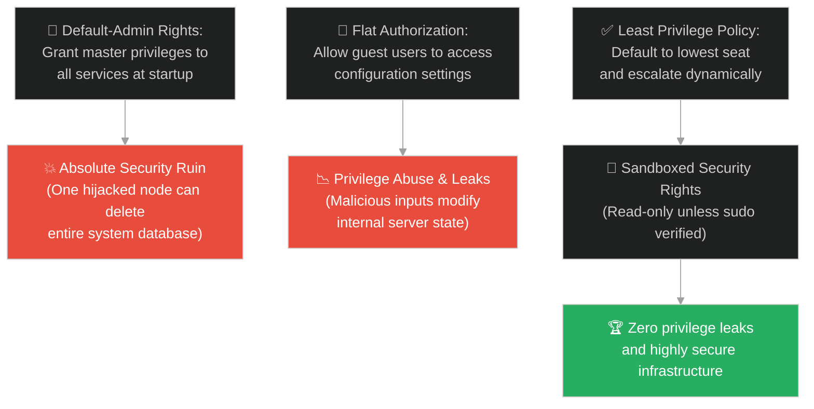
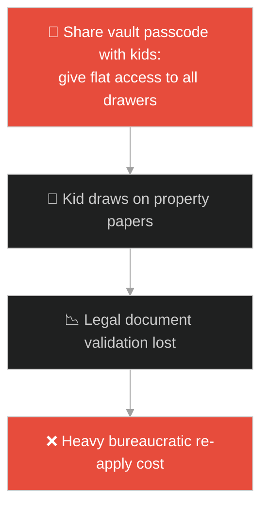
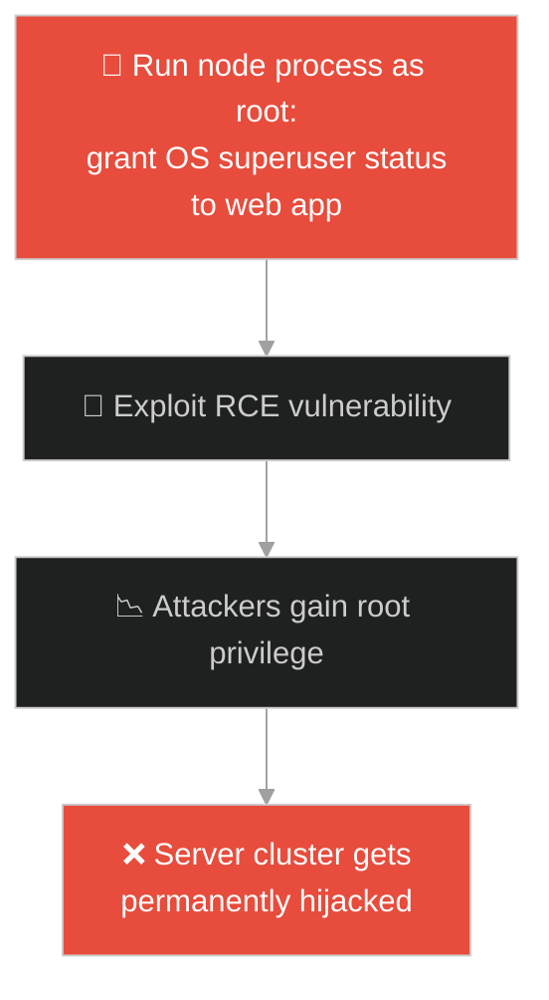
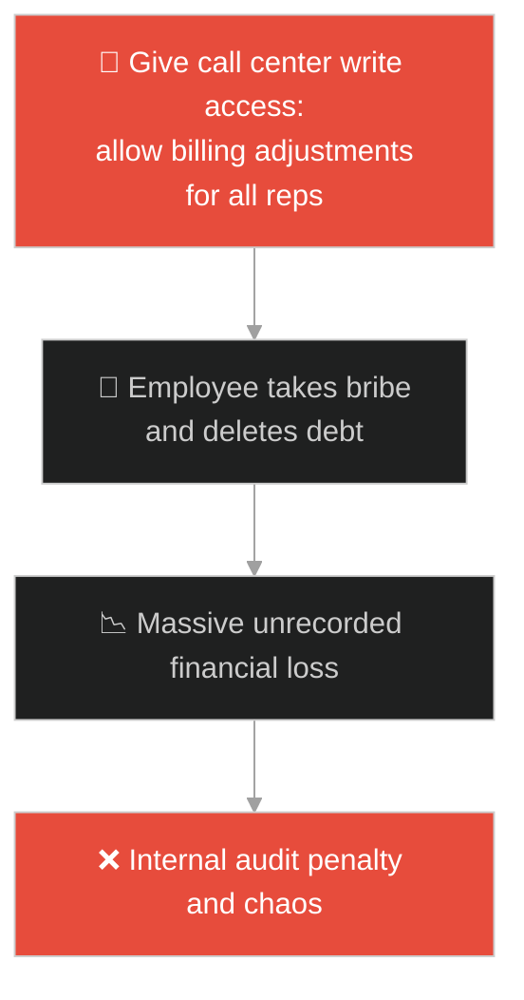
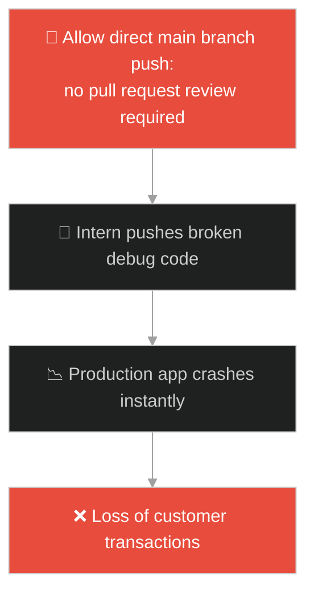
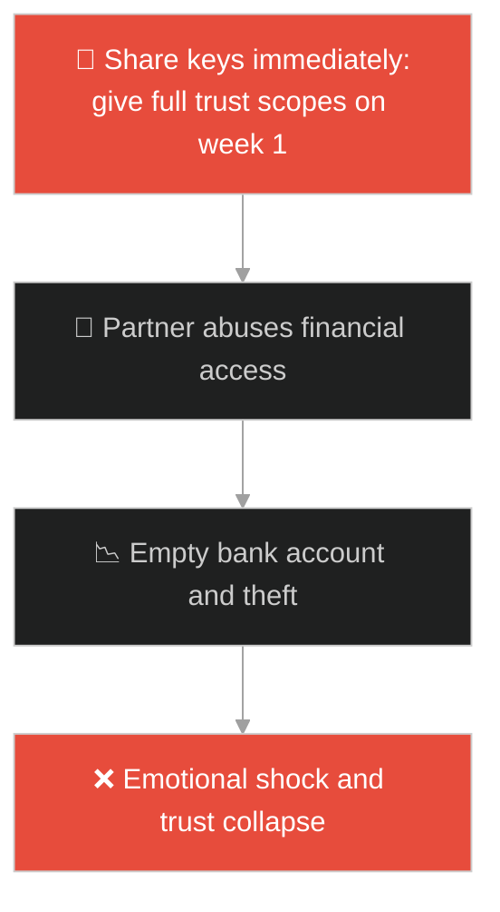
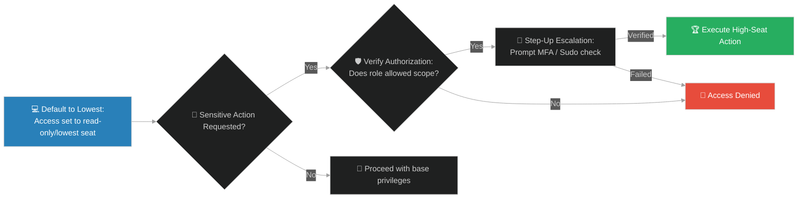

# Least Privilege Access & Role-Based Security (កៅអីកិត្តិយស និងកៅអីចុងគេ)៖ ការផ្ដល់ឯកសិទ្ធិទាបបំផុត និងសុវត្ថិភាពតួនាទីប្រព័ន្ធ (Least Privilege Access & Role-Based Security & Least Privilege Access Control and Dynamic Escalation & Lowest Seat)

**Author:** ichamrong  
**Date:** 2026-05-28  
**Tags:** #jesus #least-privilege #rbac #access-control #security-policy #authorization #humility #escalation  
**Category:** Concepts / Parables  
**Read Time:** ~15 min  

---

## 📌 មាតិកា (Table of Contents)
- [អន្ទាក់ផ្លូវចិត្ត (The Trap)](#0)
- [១. រឿងព្រេងនិទាន៖ កៅអីកិត្តិយស និងទីតាំងចុងក្រោយបង្អស់ (The Legend of the Lowest Seat)](#1)
  - [យុទ្ធសាស្ត្រចាប់ផ្តើមពីចំណុចទាប និងការដំឡើងឋានៈដោយស្វ័យប្រវត្ត (Dynamic Privilege Escalation by Host)](#1-1)
- [២. បញ្ហា៖ ការផ្តល់សិទ្ធិធំទូលាយហួសហេតុ និងហានិភ័យលេចធ្លាយប្រព័ន្ធ (The Issue: Privilege Abuse and Default-Admin Permissions)](#2)
- [៣. ឧទាហមណ៍ជាក់ស្តែងក្នុងពិភពពិត (Real World Examples)](#3)
  - [ឧទាហរណ៍ទី ១ — កម្រិតស្រាល (គ្រួសារ)៖ កូនក្មេងបើកចូលមើលទូរដែករបស់ឪពុកម្តាយ (Toddler accessing Parental Vault vs Restricted Toy Drawers)](#3-1)
  - [ឧទាហរណ៍ទី ២ — កម្រិតមធ្យម (បច្ចេកទេស)៖ កម្មវិធី Web Server ដំណើរការក្រោមសិទ្ធិ Root (Web Application Running as Root vs Low-Privilege Service User)](#3-2)
  - [ឧទាហរណ៍ទី ៣ — កម្រិតមធ្យម (ធុរកិច្ច)៖ ការផ្តល់សិទ្ធិកែប្រែទិន្នន័យហិរញ្ញវត្ថុដល់បុគ្គលិកលក់ (Sales Reps Editing Billing Ledgers vs Role-Based Read-Only Access)](#3-3)
  - [ឧទាហរណ៍ទី ៤ — កម្រិតមធ្យម (សង្គម/គ្រប់គ្រង)៖ ការអនុញ្ញាតឱ្យសរសេរកូដចូល Master Branch ដោយសេរី (Direct Main Commits vs Pull Request Approvals)](#3-4)
  - [ឧទាហរណ៍ទី ៥ — កម្រិតធ្ងន់ (ទំនាក់ទំនង)៖ ការផ្តល់សោផ្ទះនិងគណនីធនាគារដល់មិត្តថ្មី (Sharing Bank Accounts on First Date vs Gradual Trust Scaling)](#3-5)
- [៤. ដំណោះស្រាយទូទៅ៖ ការអនុវត្តគោលការណ៍សិទ្ធិទាបបំផុត និងយន្តការ Escalation (The General Solution: Designing Role-Based Access Control and Step-Up Authentication)](#4)
- [សេចក្តីសន្និដ្ឋាន (Conclusion)](#5)
- [ឯកសារយោង (References)](#6)
- [Related Posts](#7)

---

<a id="0"></a>
## អន្ទាក់ផ្លូវចិត្ត (The Trap)

តើអ្នកធ្លាប់ជួបបញ្ហាដែលប្រព័ន្ធព័ត៌មានវិទ្យារបស់អ្នកត្រូវបានវាយប្រហារ និងបាត់បង់ទិន្នន័យទាំងអស់ ដោយសារតែគណនីបុគ្គលិកធម្មតាម្នាក់ ត្រូវបានផ្តល់សិទ្ធិ Admin (Full Privilege Access) ទាំងដែលពួកគេមិនចាំបាច់ប្រើប្រាស់វាឡើយដែរឬទេ?

នៅក្នុងសុវត្ថិភាពបច្ចេកវិទ្យា និងការគ្រប់គ្រង៖
* **យើងងាយនឹងធ្លាក់ក្នុងអន្ទាក់** នៃការផ្តល់សិទ្ធិចូលប្រើប្រាស់កម្រិតខ្ពស់បំផុត (Highest Seat / Admin Privileges) ទៅឱ្យរាល់សេវាកម្ម និងបុគ្គលិកតាំងពីដំបូង ដើម្បីជៀសវាងការលំបាកក្នុងការកំណត់សិទ្ធិ នាំឱ្យកើតមានការកេងប្រវ័ញ្ច និងការរងគ្រោះថ្នាក់។
* **យើងមើលរំលង** យុទ្ធសាស្ត្រ "ចាប់ផ្តើមពីចំណុចទាបបំផុត (Least Privilege)" និងពឹងផ្អែកលើការផ្ទៀងផ្ទាត់ និងដំឡើងសិទ្ធិតាមតម្រូវការជាក់ស្តែង (Dynamic Privilege Escalation) ដែលជាខែលការពារដ៏មានប្រសិទ្ធភាពបំផុត។

ការកំណត់សិទ្ធិទាបបំផុត និងការអនុញ្ញាតតាមតួនាទី ហៅថា **គោលការណ៍សិទ្ធិទាបបំផុត និងសុវត្ថិភាពតួនាទីប្រព័ន្ធ (Least Privilege Access & Role-Based Security)**។

ដើម្បីយល់ដឹងពីគោលការណ៍នេះ នេះជាផែនទីបង្ហាញផ្លូវ៖
1. **រឿងព្រេងនិទាន (The Legend)** — រឿងរ៉ាវរបស់ភ្ញៀវដែលទៅអង្គុយកៅអីកិត្តិយសខាងមុខ រួចត្រូវគេដេញឱ្យទៅអង្គុយកៅអីក្រោយ និងភ្ញៀវដែលបន្ទាបខ្លួនអង្គុយក្រោយ រួចត្រូវបានម្ចាស់ផ្ទះអញ្ជើញឱ្យឡើងមកមុខ។
2. **បញ្ហា (The Issue)** — ការវិភាគគណិតវិទ្យា និងសុវត្ថិភាពនៃគ្រោះថ្នាក់ Over-Permissioning និងយន្តការ RBAC។
3. **ឧទាហមណ៍ជាក់ស្តែង (Real World Examples)** — ពិនិត្យមើលបញ្ហានេះក្នុងកម្រិតគ្រួសារ បច្ចេកវិទ្យា ធុរកិច្ច ការគ្រប់គ្រង និងទំនាក់ទំនង។
4. **ដំណោះស្រាយទូទៅ (The General Solution)** — ការបង្កើតប្រព័ន្ធ Role-Based Access Control (RBAC) និងយន្តការដំឡើងសិទ្ធិបណ្តោះអាសន្ន (Temporary Escalation)។



---

<a id="1"></a>
## ១. រឿងព្រេងនិទាន៖ កៅអីកិត្តិយស និងទីតាំងចុងក្រោយបង្អស់ (The Legend of the Lowest Seat)

ថ្ងៃមួយ ព្រះយេស៊ូវត្រូវបានអញ្ជើញឱ្យទៅសោយអាហារនៅផ្ទះមេដឹកនាំសាសនាម្នាក់។ ទ្រង់បានសង្កេតឃើញពួកភ្ញៀវកិត្តិយសទាំងអស់ នាំគ្នាប្រជ្រៀតជ្រើសរើសយក "កៅអីកិត្តិយស (កៅអីខាងមុខគេ)" ដើម្បីបង្ហាញពីឋានៈ និងមុខមាត់របស់ពួកគេ។

ឃើញដូច្នេះ ទ្រង់ក៏មានបន្ទូលប្រាប់ពួកគេថា៖ *"នៅពេលគេអញ្ជើញអ្នកទៅហូបការ សូមកុំទៅអង្គុយនៅកៅអីកិត្តិយសខាងមុខគេឱ្យសោះ ក្រែងលោមានភ្ញៀវណាដែលមានកិត្តិយសជាងអ្នកមកដល់។ ពេលនោះ ម្ចាស់ផ្ទះនឹងដើរមកប្រាប់អ្នកថា៖ 'សូមក្រោកចេញ ទុកកៅអីនេះឱ្យលោកខាងនេះអង្គុយវិញ!' ពេលនោះ អ្នកច្បាស់ជាខ្មាសគេ ហើយត្រូវដើរទៅអង្គុយនៅកៅអីខាងក្រោយគេជាមិនខាន (Privilege Demotion/Authorization failure)។"*

---

<a id="1-1"></a>
### យុទ្ធសាស្ត្រចាប់ផ្តើមពីចំណុចទាប និងការដំឡើងឋានៈដោយស្វ័យប្រវត្ត (Dynamic Privilege Escalation by Host)

ព្រះយេស៊ូវបានបង្រៀនបន្តថា៖ 

> *"ផ្ទុយទៅវិញ នៅពេលអ្នកទៅដល់ សូមដើរទៅអង្គុយនៅ **កៅអីចុងគេបង្អស់ (Lowest Seat/Least Privilege)** វិញទៅ។ ពេលម្ចាស់ផ្ទះដើរមកឃើញអ្នក គាត់នឹងនិយាយថា៖ 'មិត្តអើយ! ហេតុអ្វីមកអង្គុយនៅទីនេះ អញ្ជើញឡើងមកអង្គុយនៅកៅអីកិត្តិយសខាងមុខវិញ!' ពេលនោះ អ្នកនឹងទទួលបានកិត្តិយសយ៉ាងធំនៅចំពោះមុខភ្ញៀវទាំងអស់ (Escalation of Privilege/High-status elevation)។"*

ទ្រង់បានសន្និដ្ឋានថា៖ **"អ្នកណាដែលលើកតម្កើងខ្លួនឯង នឹងត្រូវគេបន្ទាបចុះ ចំណែកអ្នកណាដែលបន្ទាបខ្លួន នឹងត្រូវគេលើកតម្កើងឡើង។"**

---

<a id="2"></a>
## ២. បញ្ហា៖ ការផ្តល់សិទ្ធិធំទូលាយហួសហេតុ និងហានិភ័យលេចធ្លាយប្រព័ន្ធ (The Issue: Privilege Abuse and Default-Admin Permissions)

នៅក្នុងវិស្វកម្មប្រព័ន្ធសុវត្ថិភាព (Security Engineering)៖
1. **បញ្ហាលើសសិទ្ធិ (Over-Permissioning)៖** នៅពេលដែលកម្មវិធីមួយដំណើរការដោយសិទ្ធិ `root` ឬ `Administrator`។ ប្រសិនបើ Hacker អាចរកឃើញចន្លោះប្រហោងណាមួយ (ដូចជា Remote Code Execution) ពួកគេនឹងអាចគ្រប់គ្រងកុំព្យូទ័រនោះទាំងមូលភ្លាមៗ។
2. **កង្វះការបែងចែកតួនាទី (Flat Access)៖** ប្រសិនបើគណនីបុគ្គលិកទាំងអស់អាចលុបទិន្នន័យ (Write/Delete) បានដូចគ្នា នោះកំហុសអចេតនារបស់បុគ្គលិកម្នាក់ អាចបំផ្លាញទិន្នន័យក្រុមហ៊ុនទាំងមូល។

ខាងក្រោមនេះជាការប្រៀបធៀបរវាងគំរូសិទ្ធិគ្មានសុវត្ថិភាព និងការអនុវត្តប្រព័ន្ធសិទ្ធិទាបបំផុត៖

### Fragile Implementation (Unrestricted Default Admin Authorization)
កូដនេះផ្តល់សិទ្ធិឱ្យរាល់ User ទាំងអស់អាចធ្វើការកែប្រែ ឬលុបទិន្នន័យបានតាមចិត្ត ដោយចាប់ផ្តើមពីសិទ្ធិអតិបរមា (Default to High Seat)៖

```typescript
// fragile_auth.ts
interface UserSession {
    username: string;
    role: string; // "GUEST", "USER", "ADMIN"
}

export function authorizeAction(user: UserSession, action: string): boolean {
    console.log(`[AUTH] Checking permission for ${user.username} to perform ${action}`);
    
    // បង្កើតកំហុសដោយការអនុញ្ញាតសិទ្ធិ Admin ជា Default ឬឆែកសិទ្ធិធូររលុង
    // គ្រប់គ្នាត្រូវបានអនុញ្ញាតឱ្យធ្វើការងារទាំងអស់ លើកលែងតែមានការហាមឃាត់
    if (action === "DELETE_SYSTEM" && user.role !== "GUEST") {
        // សូម្បីតែ User ធម្មតាក៏អាចលុបប្រព័ន្ធបានដែរ!
        return true;
    }
    return true; 
}
```

### Resilient Implementation (Least Privilege and Step-Up Escalation)
កូដនេះអនុវត្តគោលការណ៍ Least Privilege៖ ចាប់ផ្តើមពីសិទ្ធិទាបបំផុត (Read-Only) ជាមុនសិន។ សិទ្ធិ Admin ត្រូវបានបដិសេធជាដាច់ខាត លុះត្រាតែមានការផ្ទៀងផ្ទាត់តួនាទី និងលេខកូដសម្ងាត់បន្ថែម (Sudo Escalation)៖

```typescript
// resilient_auth.ts
enum Role {
    GUEST = "GUEST",
    MEMBER = "MEMBER",
    ADMIN = "ADMIN"
}

interface UserSession {
    username: string;
    role: Role;
    isSudoVerified?: boolean; // ដូចជាការអញ្ជើញឡើងតុមុខរបស់ម្ចាស់ផ្ទះ
}

const ROLE_PERMISSIONS: Record<Role, string[]> = {
    [Role.GUEST]: ["READ_POSTS"],
    [Role.MEMBER]: ["READ_POSTS", "CREATE_COMMENT", "EDIT_OWN_PROFILE"],
    [Role.ADMIN]: ["READ_POSTS", "CREATE_COMMENT", "EDIT_OWN_PROFILE", "DELETE_SYSTEM", "MANAGE_USERS"]
};

export function authorizeActionResilient(
    user: UserSession,
    action: string
): boolean {
    console.log(`[SECURE-AUTH] Evaluating access for ${user.username} (Role: ${user.role}) for action: ${action}`);

    // ១. ទាញយកបញ្ជីសិទ្ធិដែលអនុញ្ញាតសម្រាប់តួនាទីនេះ (Default to Lowest Seat)
    const allowedActions = ROLE_PERMISSIONS[user.role] || [];

    // ២. ឆែកមើលថាតើសកម្មភាពនេះមានក្នុងបញ្ជីអនុញ្ញាតដែរឬទេ
    if (!allowedActions.includes(action)) {
        console.warn(`[DENIED] User ${user.username} lacks scope: ${action}`);
        return false;
    }

    // ៣. សម្រាប់សកម្មភាពគ្រោះថ្នាក់ (ដូចជា DELETE_SYSTEM) ត្រូវទាមទារ Sudo Escalation (Step-up Auth)
    if (action === "DELETE_SYSTEM") {
        if (!user.isSudoVerified) {
            console.warn(`[DENIED] Action requires temporary elevation (Sudo Verification).`);
            return false;
        }
        console.log(`[ESCALATED SUCCESS] Action authorized via verified elevation.`);
    }

    console.log(`[AUTHORIZED] Access granted to ${user.username}.`);
    return true;
}
```

---

<a id="3"></a>
## ៣. ឧទាហមណ៍ជាក់ស្តែងក្នុងពិភពពិត

---

<a id="3-1"></a>
### ឧទាហមណ៍ទី ១ — កម្រិតស្រាល (គ្រួសារ)៖ កូនក្មេងបើកចូលមើលទូរដែករបស់ឪពុកម្តាយ (Toddler accessing Parental Vault vs Restricted Toy Drawers)

ឪពុកម្តាយខ្លះទុកលេខកូដបើកទូរដែកហិរញ្ញវត្ថុ និងឯកសារសម្ងាត់របស់គ្រួសារនៅកន្លែងដែលកូនៗអាចដឹងបាន (Flat access)។ កូនប្រុសអាយុ ៦ ឆ្នាំបានបើកលេង រួចយកប៊ិចទៅគូរលើលិខិតផ្ទេរសិទ្ធិដីធ្លី។ ដំណោះស្រាយ៖ កូនៗត្រូវទទួលបានសិទ្ធិចូលលេងត្រឹមតែថតតុដាក់ប្រដាប់ក្មេងលេងរបស់ខ្លួនប៉ុណ្ណោះ (Least Privilege) ចំណែកទូរដែកត្រូវចាក់សោស្ងាត់បំផុត។



---

<a id="3-2"></a>
### ឧទាហមណ៍ទី ២ — កម្រិតមធ្យម (បច្ចេកទេស)៖ កម្មវិធី Web Server ដំណើរការក្រោមសិទ្ធិ Root (Web Application Running as Root vs Low-Privilege Service User)

គេហទំព័រមួយដំណើរការកូដ Node.js របស់ខ្លួនក្រោមគណនី `root` របស់ប្រព័ន្ធប្រតិបត្តិការ Linux។ ជនអនាមិកបានរកឃើញចន្លោះប្រហោង Directory Traversal នៅក្នុងកូដ រួចក៏បានចូលទៅអាន និងលុបឯកសារប្រព័ន្ធស្នូល `/etc/shadow` របស់ Server ទាំងមូល។ ដំណោះស្រាយ៖ គេហទំព័រគួរតែដំណើរការក្រោមគណនីគ្មានសិទ្ធិឈ្មោះ `www-data` (Lowest Seat)។



---

<a id="3-3"></a>
### ឧទាហមណ៍ទី ៣ — កម្រិតមធ្យម (ធុរកិច្ច)៖ ការផ្តល់សិទ្ធិកែប្រែទិន្នន័យហិរញ្ញវត្ថុដល់បុគ្គលិកលក់ (Sales Reps Editing Billing Ledgers vs Role-Based Read-Only Access)

ក្រុមហ៊ុនផ្តល់សេវាកម្មទូរស័ព្ទ បានអនុញ្ញាតឱ្យបុគ្គលិកផ្នែកសេវាកម្មអតិថិជន (Call Center) ទាំងអស់អាចកែប្រែ ឬលុបចោលវិក្កយបត្ររបស់អតិថិជនបាន ដើម្បីងាយស្រួលធ្វើការងារ។ បុគ្គលិកម្នាក់បានទទួលសំណូកពីអតិថិជន រួចបានចូលទៅលុបចោលវិក្កយបត្រជំពាក់លុយចំនួន ១០,០០០ ដុល្លារ។ ដំណោះស្រាយ៖ បុគ្គលិក Call Center គួរតែមានត្រឹមតែសិទ្ធិមើល (Read-only) ចំណែកការកែប្រែត្រូវបញ្ជូនសិទ្ធិទៅឱ្យប្រធានផ្នែកហិរញ្ញវត្ថុអនុម័ត (Privilege Escalation)។



---

<a id="3-4"></a>
### ឧទាហមណ៍ទី ៤ — កម្រិតមធ្យម (សង្គម/គ្រប់គ្រង)៖ ការអនុញ្ញាតឱ្យសរសេរកូដចូល Master Branch ដោយសេរី (Direct Main Commits vs Pull Request Approvals)

នៅក្នុងគម្រោងសរសេរកម្មវិធីថ្មីមួយ អ្នកគ្រប់គ្រងបានផ្តល់សិទ្ធិ Push កូដផ្ទាល់ចូល Master Branch ទៅឱ្យវិស្វករទាំងអស់ ទាំងអ្នកចុះកម្មសិក្សា និងអ្នកទើបចូលថ្មី។ វិស្វករថ្មីម្នាក់បានរៀបចំកូដខុសទម្រង់ រួចក៏បាន Push ចូលទៅ Master Branch ធ្វើឱ្យប្រព័ន្ធទាំងមូលគាំងពេញមួយថ្ងៃ។ ដំណោះស្រាយ៖ ត្រូវបិទសិទ្ធិ Push លើ Master Branch (Lowest seat) និងកំណត់ឱ្យរាល់កូដថ្មីត្រូវឆ្លងកាត់ការពិនិត្យ (Pull Request & Code Review) ជាមុនសិន។



---

<a id="3-5"></a>
### ឧទាហមណ៍ទី ៥ — កម្រិតធ្ងន់ (ទំនាក់ទំនង)៖ ការផ្តល់សោផ្ទះនិងគណនីធនាគារដល់មិត្តថ្មី (Sharing Bank Accounts on First Date vs Gradual Trust Scaling)

មនុស្សម្នាក់មានចំណង់ចង់បានទំនាក់ទំនងលឿនរហ័ស បានយកសោផ្ទះ កាតអេធីអឹម និងលេខកូដសម្ងាត់ទាំងអស់ទៅឱ្យដៃគូដែលទើបតែទាក់ទងគ្នារយៈពេល ១ សប្តាហ៍។ ក្រោយមក ដៃគូនោះបានលួចកាតអេធីអឹមទៅដកលុយទិញសម្ភារៈផ្ទាល់ខ្លួន និងនាំមនុស្សចម្លែកមកលេងក្នុងផ្ទះធ្វើឱ្យបាត់បង់ទ្រព្យសម្បត្តិ។ ដំណោះស្រាយ៖ ត្រូវចាប់ផ្តើមទំនាក់ទំនងពីកម្រិតសិទ្ធិទាបបំផុត (Least Privilege) និងដំឡើងសិទ្ធិបន្តិចម្តងៗនៅពេលទំនុកចិត្តត្រូវបានបញ្ជាក់។



---

<a id="4"></a>
## ៤. ដំណោះស្រាយទូទៅ៖ ការអនុវត្តគោលការណ៍សិទ្ធិទាបបំផុត និងយន្តការ Escalation (The General Solution: Designing Role-Based Access Control and Step-Up Authentication)

ដើម្បីការពារធនធាន និងស្ថិរភាពប្រព័ន្ធ យើងត្រូវអនុវត្តគោលការណ៍ Least Privilege Access Control៖



ជំហាននៃការអនុវត្ត៖
1. **គោលការណ៍ Default-Deny (ការបដិសេធជាស្វ័យប្រវត្ត)៖** រាល់សំណើ ឬគណនីបង្កើតថ្មី ត្រូវតែស្ថិតនៅក្នុងស្ថានភាពគ្មានសិទ្ធិ (Default to Lowest Seat) រហូតទាល់តែមានការផ្តល់សិទ្ធិដោយផ្ទាល់ពីអ្នកគ្រប់គ្រង។
2. **ការបែងចែកតួនាទីច្បាស់លាស់ (RBAC Definition)៖** បង្កើតតួនាទីឱ្យស្របតាមតម្រូវការការងារពិតប្រាកដ (ឧទាហរណ៍ `BillingAdmin`, `SupportViewer`, `Developer`) និងកំណត់ឱ្យសមាជិកម្នាក់ៗស្ថិតនៅក្នុងតួនាទីទាបបំផុតដែលអាចដំណើរការការងារបាន។
3. **យន្តការដំឡើងសិទ្ធិបណ្តោះអាសន្ន (Just-In-Time Escalation)៖** កុំផ្តល់សិទ្ធិ Admin ជាប់ជានិច្ច។ ត្រូវប្រើប្រាស់ប្រព័ន្ធដូចជា `sudo` ឬ Multi-Factor Authentication (MFA) ដើម្បីអនុញ្ញាតសិទ្ធិកម្រិតខ្ពស់សម្រាប់តែពេលវេលាខ្លី និងកំណត់កំណត់ត្រាសកម្មភាពជានិច្ច (Auditing logs)។
4. **ការរចនាជីវិតនិងកិត្តិយស៖** ចាប់ផ្តើមរាល់កិច្ចការងារដោយភាពរាបទាប (Humility) ជានិច្ច។ កុំព្យាយាមទាមទារកៅអីជួរមុខ ឬកិត្តិយសដោយបង្ខំ។ បណ្តោយឱ្យស្នាដៃ លទ្ធផលការងារ និងអត្តចរិតរបស់អ្នក ទាញអ្នកឱ្យឡើងទៅកាន់កៅអីកិត្តិយសដោយខ្លួនឯង។

---

## 🐇 ធ្លាក់ចូលក្នុងរន្ធទន្សាយ (Enter the Rabbit Hole)

ដើម្បីស្វែងយល់បន្ថែមអំពីរបៀបដែលប្រព័ន្ធដែលបានបង្កើតឡើងរួចហើយ ផ្សព្វផ្សាយសមត្ថភាព និងស្ថានភាពសុខភាពរបស់ខ្លួនទៅកាន់ពិភពខាងក្រៅតាមរយៈ Telemetry និង Feature Discovery ជៀសវាងការលាក់បាំងសមត្ថភាពការងាររបស់ខ្លួន សូមបន្តដំណើរទៅកាន់៖

* 🚀 **[ចាប់ផ្តើមដំណើររុករក (Start the Journey) ➔ Feature Discovery & API Telemetry Visibility (ចង្កៀងក្រោមថាំង)៖ ការផ្សព្វផ្សាយសមត្ថភាពប្រព័ន្ធ និងភាពមើលឃើញនៃរង្វាស់ទិន្នន័យ](./199-jesus-and-the-lamp-under-a-basket.md)**

---

<a id="5"></a>
## សេចក្តីសន្និដ្ឋាន (Conclusion)

> **«ការចាប់ផ្តើមពីកៅអីទាបបំផុត គឺជាខែលការពារដ៏ល្អបំផុតដើម្បីការពារខ្លួនពីការធ្លាក់ចុះ និងភាពអាម៉ាស់នាពេលអនាគត»**

ការអនុវត្តគោលការណ៍ Least Privilege Access & RBAC ជួយឱ្យយើងកសាងប្រព័ន្ធបច្ចេកវិទ្យាដែលមានសុវត្ថិភាពខ្ពស់ និងតម្រង់ទិសដៅជីវិតឱ្យរស់នៅប្រកបដោយភាពរាបទាប ទំនុកចិត្ត និងសន្តិភាពផ្លូវចិត្តពិតប្រាកដ។

---

<a id="6"></a>
## ឯកសារយោង (References)

* **Parable of the Lowest Seat / The Wedding Feast (Luke 14:7–14)** — The biblical text defining the parameters of social status, self-exaltation prevention, and hosted elevation.
* **National Institute of Standards and Technology (NIST)** — *Role-Based Access Control (RBAC) Standards* (2004). The standard blueprint for logical security architecture and privilege bounds.

---

<a id="7"></a>
## Related Posts

* [[Feature Discovery & API Telemetry Visibility](./199-jesus-and-the-lamp-under-a-basket.md)] — របៀបបង្ហាញសុខភាពប្រព័ន្ធឱ្យមានភាពច្បាស់លាស់។
* [[Garbage Collection & Stale References Filter](./190-jesus-and-the-weeds.md)] — ការគ្រប់គ្រង និងបោសសម្អាតធនធានចាស់ៗដែលអស់តម្លៃ។
