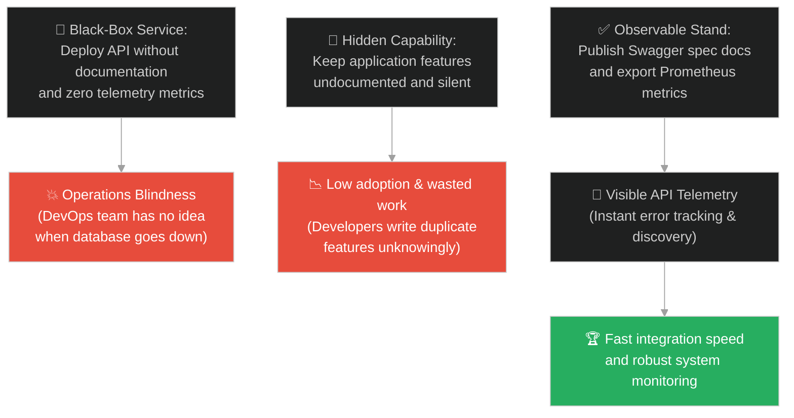
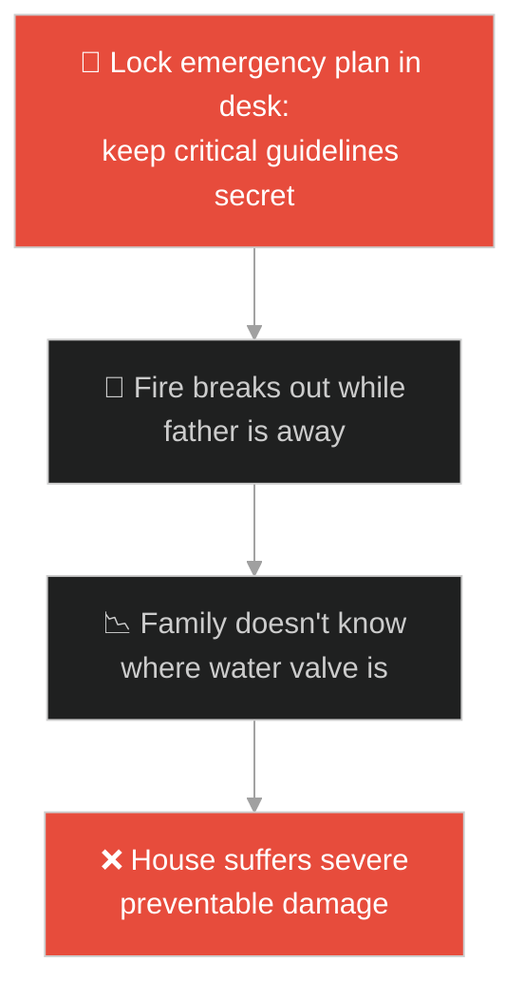
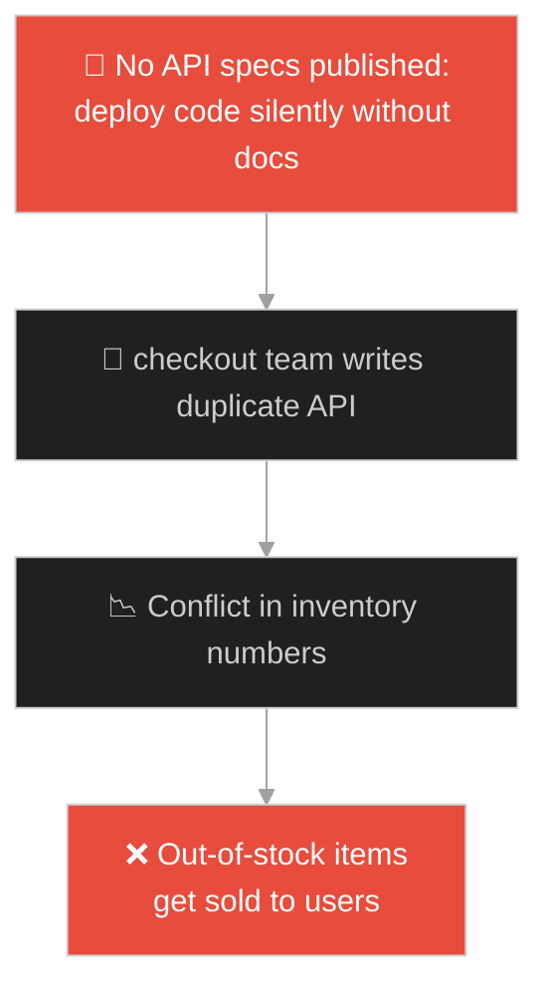
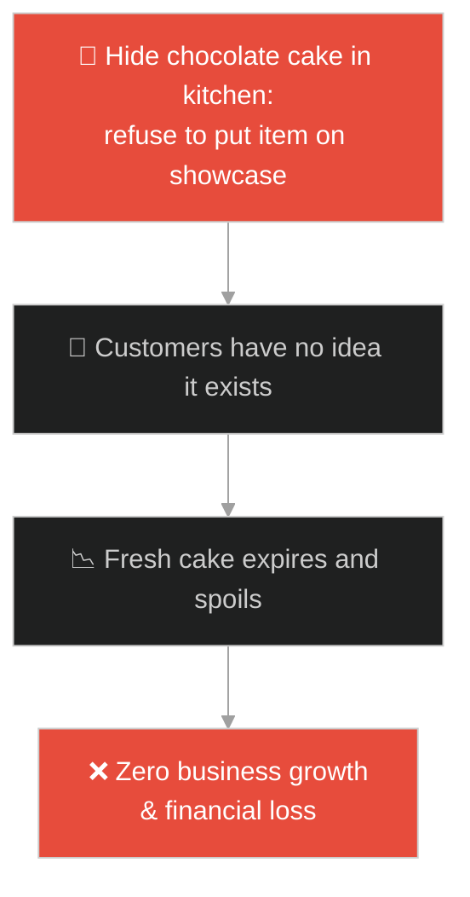
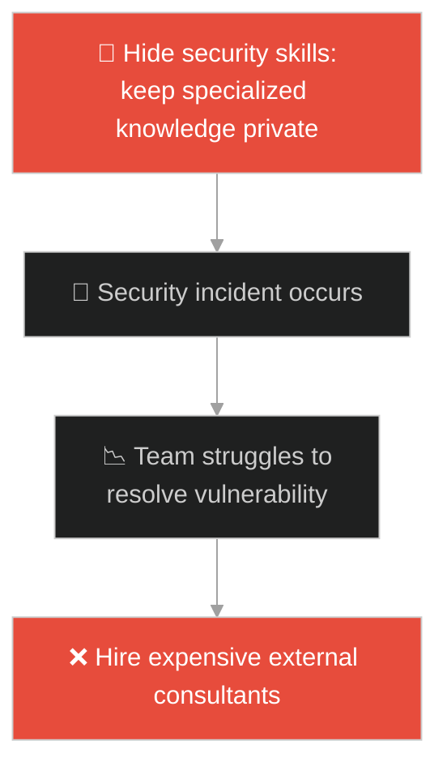
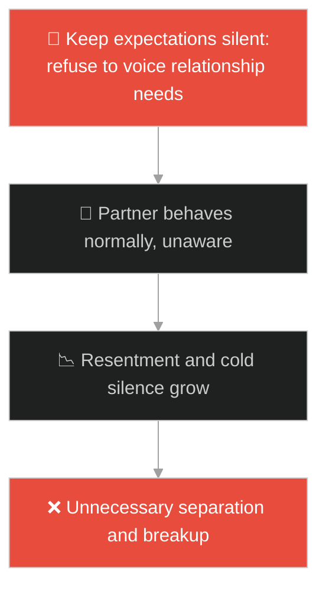
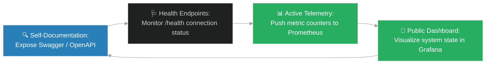

# Feature Discovery & API Telemetry Visibility (ចង្កៀងក្រោមល្អី)៖ ការផ្សព្វផ្សាយសមត្ថភាពប្រព័ន្ធ និងភាពមើលឃើញនៃរង្វាស់ទិន្នន័យ (Feature Discovery & API Telemetry Visibility & API Self-Documentation and Observability & Lamp Under a Basket)

**Author:** ichamrong  
**Date:** 2026-05-28  
**Tags:** #jesus #telemetry #observability #api-documentation #openapi #prometheus #discovery #transparency  
**Category:** Concepts / Parables  
**Read Time:** ~15 min  

---

## 📌 មាតិកា (Table of Contents)
- [អន្ទាក់ផ្លូវចិត្ត (The Trap)](#0)
- [១. រឿងព្រេងនិទាន៖ ពន្លឺចង្កៀងនៅលើជើងទម្រ (The Legend of the Lamp Under a Basket)](#1)
  - [គោលបំណងនៃពន្លឺ និងតួនាទីបំភ្លឺបន្ទប់ទាំងមូល (Illumination Purpose and Public Observability)](#1-1)
- [២. បញ្ហា៖ ភាពងងឹតងងល់នៃប្រព័ន្ធ និងកង្វះទំនាក់ទំនងនៃមុខងារការងារ (The Issue: Black-Box Services and Blind System Deployments)](#2)
- [៣. ឧទាហមណ៍ជាក់ស្តែងក្នុងពិភពពិត (Real World Examples)](#3)
  - [ឧទាហរណ៍ទី ១ — កម្រិតស្រាល (គ្រួសារ)៖ ការលាក់គម្រោងការពារអាសន្នរបស់គ្រួសារ (Hiding Family Emergency Contacts vs Refrigerator Door Placement)](#3-1)
  - [ឧទាហរណ៍ទី ២ — កម្រិតមធ្យម (បច្ចេកទេស)៖ កម្មវិធីដែលគ្មានឯកសារបញ្ជាក់ផ្លូវការងារ (Undocumented REST endpoints vs Swagger & Prometheus Metrics)](#3-2)
  - [ឧទាហរណ៍ទី ៣ — កម្រិតមធ្យម (ធុរកិច្ច)៖ ផលិតផលមានគុណភាពខ្ពស់តែលាក់កំបាំងមិនផ្សព្វផ្សាយ (Elite Product Hidden Under Counter vs Digital Storefront Directory)](#3-3)
  - [ឧទាហរណ៍ទី ៤ — កម្រិតមធ្យម (សង្គម/គ្រប់គ្រង)៖ វិស្វករលាក់ជំនាញពិសេសមិនឱ្យសមាជិកដឹង (Hiding Special Tech Skills vs Documenting Capabilities on Wiki)](#3-4)
  - [ឧទាហរណ៍ទី ៥ — កម្រិតធ្ងន់ (ទំនាក់ទំនង)៖ ការលាក់ទុកនូវការឈឺចាប់និងតម្រូវការផ្លូវចិត្ត (Silent Grudges and Unspoken Needs vs Open Relationship Debriefs)](#3-5)
- [៤. ដំណោះស្រាយទូទៅ៖ ការកំណត់ស្ថាបត្យកម្មលាតត្រដាង និងរង្វាស់ទិន្នន័យសុខភាព (The General Solution: Designing Self-Documenting Routers and System Metrics Handlers)](#4)
- [សេចក្តីសន្និដ្ឋាន (Conclusion)](#5)
- [ឯកសារយោង (References)](#6)
- [Related Posts](#7)

---

<a id="0"></a>
## អន្ទាក់ផ្លូវចិត្ត (The Trap)

តើអ្នកធ្លាប់ជួបបញ្ហាដែលប្រព័ន្ធការងារជួបភាពទាល់ច្រក ដោយសារតែអ្នកមិនអាចដឹងថាមានមុខងារអ្វីខ្លះដែលប្រព័ន្ធមានស្រាប់ (Features) ឬមិនអាចដឹងថាតើម៉ាស៊ីនកំពុងដំណើរការធម្មតាឬមានបញ្ហា (System Health Metrics) ព្រោះមិនមានការបញ្ជូនទិន្នន័យមកក្រៅ (Telemetry) ដែរឬទេ?

នៅក្នុងស្ថាបត្យកម្មប្រព័ន្ធ និងការគ្រប់គ្រង៖
* **យើងងាយនឹងធ្លាក់ក្នុងអន្ទាក់** នៃការបង្កើតកម្មវិធី ឬលទ្ធផលការងារដែល "លាក់ខ្លួនក្នុងភាពងងឹត (Black-Box Service)" ដោយគ្មានការកត់ត្រា Log គ្មានឯកសារណែនាំ (API Docs) និងគ្មានការបង្ហាញស្ថានភាពការងារ ធ្វើឱ្យអ្នកដទៃមិនអាចរកឃើញ និងមិនអាចសហការបាន។
* **យើងមើលរំលង** សារៈសំខាន់នៃការដាក់ចង្កៀងនៅលើជើងទម្រចង្កៀង (Self-Documentation & Observability) ដែលជួយឱ្យប្រព័ន្ធផ្សព្វផ្សាយសមត្ថភាពរបស់ខ្លួន (Feature Discovery) និងបង្ហាញរង្វាស់សុខភាពប្រព័ន្ធ (API Telemetry) ទៅកាន់ពិភពលោក។

ការបង្ហាញមុខងារការងារឱ្យមានតម្លាភាព និងការវាស់ស្ទង់សុខភាពប្រព័ន្ធ ហៅថា **ការផ្សព្វផ្សាយសមត្ថភាពប្រព័ន្ធ និងភាពមើលឃើញនៃរង្វាស់ទិន្នន័យ (Feature Discovery & API Telemetry Visibility)**។

ដើម្បីយល់ដឹងពីគោលការណ៍នេះ នេះជាផែនទីបង្ហាញផ្លូវ៖
1. **រឿងព្រេងនិទាន (The Legend)** — រឿងរ៉ាវនៃការអុជចង្កៀងដែលគ្មាននរណាយកទៅលាក់ក្រោមល្អី ឬក្រោមគ្រែឡើយ គឺត្រូវតែដាក់លើជើងទម្រដើម្បីបំភ្លឺដល់អ្នកនៅក្នុងផ្ទះទាំងអស់។
2. **បញ្ហា (The Issue)** — ផលប៉ះពាល់នៃការដំណើរការប្រព័ន្ធបែប Black Box និងរបៀបដែល Telemetry & Self-Documentation ជួយកាត់បន្ថយពេលវេលាដោះស្រាយវិបត្តិ (MTTR)។
3. **ឧទាហមណ៍ជាក់ស្តែង (Real World Examples)** — ពិនិត្យមើលបញ្ហានេះក្នុងកម្រិតគ្រួសារ បច្ចេកវិទ្យា ធុរកិច្ច ការគ្រប់គ្រង និងទំនាក់ទំនង។
4. **ដំណោះស្រាយទូទៅ (The General Solution)** — ការអនុវត្តប្រព័ន្ធ Swagger/OpenAPI, `/health` Endpoints និងការកត់ត្រា Metric ជាមួយ Prometheus។



---

<a id="1"></a>
## ១. រឿងព្រេងនិទាន៖ ពន្លឺចង្កៀងនៅលើជើងទម្រ (The Legend of the Lamp Under a Basket)

ព្រះយេស៊ូវបានបង្រៀនសិស្សរបស់ទ្រង់អំពីភារកិច្ច និងសក្តានុពលរបស់ពួកគេ ក្នុងការចែករំលែកសេចក្តីពិតនិងសេចក្តីល្អទៅកាន់ពិភពលោក។

ទ្រង់មានបន្ទូលសួរពួកគេថា៖ *"តើមាននរណាម្នាក់អុជចង្កៀង ហើយយកវាទៅដាក់នៅក្រោមល្អី (Basket) ឬនៅក្រោមគ្រែដែរឬទេ?"* 

សិស្សទាំងអស់ឆ្លើយថា *"ទេ"* ព្រោះការធ្វើបែបនោះ វានឹងបិទបាំងពន្លឺមិនឱ្យភ្លឺសោះ។ អុជចង្កៀងហើយលាក់វាទុក តើអុជមានប្រយោជន៍អ្វី?

---

<a id="1-1"></a>
### គោលបំណងនៃពន្លឺ និងតួនាទីបំភ្លឺបន្ទប់ទាំងមូល (Illumination Purpose and Public Observability)

ទ្រង់បានបន្តថា៖ 

> *"គេតែងតែយកចង្កៀងនោះ **ទៅដាក់លើជើងទម្រចង្កៀង (Lampstand)** វិញ ដើម្បីឱ្យវាអាចបំភ្លឺដល់មនុស្សគ្រប់គ្នានៅក្នុងផ្ទះ។ អ្នករាល់គ្នាគឺជាពន្លឺនៃពិភពលោក។ ក្រុងដែលសង់នៅលើកំពូលភ្នំ មិនអាចលាក់កំបាំងបានឡើយ។ **ចូរឱ្យពន្លឺរបស់អ្នក ភ្លឺនៅចំពោះមុខមនុស្សលោក ដើម្បីឱ្យពួកគេបានឃើញអំពើល្អរបស់អ្នកផង**។"*

ទោះបីជាចង្កៀងនោះតូច ក៏វាមិនត្រូវខ្មាសអៀនក្នុងការបញ្ចេញពន្លឺរបស់វាដែរ។ ភារកិច្ចរបស់ពន្លឺ គឺបណ្តេញភាពងងឹត និងជួយឱ្យអ្នកដទៃមើលឃើញផ្លូវដើរបានត្រឹមត្រូវ។

---

<a id="2"></a>
## ២. បញ្ហា៖ ភាពងងឹតងងល់នៃប្រព័ន្ធ និងកង្វះទំនាក់ទំនងនៃមុខងារការងារ (The Issue: Black-Box Services and Blind System Deployments)

នៅក្នុងវិស្វកម្មសូហ្វវែរ៖
1. **កង្វះភាពមើលឃើញ (Zero Observability)៖** នៅពេលដែល Microservice មួយដើរខុសធម្មតា (Error rate ឡើងដល់ ៩០%) ប៉ុន្តែវាលាក់បាំងកំហុសនោះ និងមិនផ្ញើសញ្ញាប្រកាសអាសន្ន (Metrics/Alerts)។ DevOps Team នឹងមិនអាចដឹងឡើយ រហូតទាល់តែមានអតិថិជនខឹងសម្បារ Call មកស្តីបន្ទោស។
2. **បញ្ហាស្វែងរកមុខងារ (Feature Undiscoverability)៖** នៅពេលក្រុមការងារមួយសរសេរ API ដ៏ល្អមួយ តែមិនបានរៀបចំឯកសារណែនាំ (OpenAPI Swagger)។ ក្រុមផ្សេងទៀតមិនដឹង ក៏នាំគ្នាសរសេរ API ដែលមានមុខងារដូចគ្នានោះឡើងវិញ (Duplicate Code) ដែលបង្កឱ្យខាតបង់ថវិកា និងពេលវេលា។

ខាងក្រោមនេះជាការប្រៀបធៀបរវាងការរចនាប្រព័ន្ធបែបលាក់បាំង (Fragile) និងប្រព័ន្ធដែលមាន Observability ខ្ពស់ (Resilient)៖

### Fragile Implementation (Silent Undocumented Express API)
កូដនេះដំណើរការសេវាកម្មដោយគ្មាន Endpoint សម្រាប់ឆែកសុខភាព (`/health`) គ្មានការលាតត្រដាង API Specs និងគ្មានការកត់ត្រា Metrics ឡើយ (ចង្កៀងក្រោមល្អី)៖

```typescript
// fragile_server.ts
import express from 'express';

const app = express();
app.use(express.json());

// មុខងារស្នូលរបស់ប្រព័ន្ធ ប៉ុន្តែគ្មានឯកសារណែនាំ គ្មាននរណាដឹងពីរបៀបហៅប្រើឡើយ
app.post('/api/v1/process-payments', (req, res) => {
    const { amount, currency } = req.body;
    console.log(`[INFO] Processing payment for amount: ${amount}`);
    // ... logic ...
    res.status(200).send({ status: "PAID" });
});

// Server ដំណើរការដោយស្ងាត់ស្ងៀម។ បើ DB គាំង ក៏គ្មានអ្នកណាដឹងឡើយ
app.listen(3000, () => {
    console.log("Server running silently on port 3000. No telemetry exposed.");
});
```

### Resilient Implementation (Self-Documenting observable API with Telemetry)
កូដនេះអនុវត្តការដាក់ចង្កៀងលើជើងទម្រ៖ បើកឱ្យមាន Endpoint `/health` សម្រាប់ឆែកសុខភាពប្រព័ន្ធ បើកមុខងារ OpenAPI Swagger Docs និងវាស់ស្ទង់ Latency/Metrics ជាមួយ Prometheus៖

```typescript
// resilient_server.ts
import express from 'express';
import swaggerUi from 'swagger-ui-express';
import client from 'prom-client';
import { checkDatabaseConnection } from './db';

const app = express();
app.use(express.json());

// ១. បង្កើត Prometheus Registry ដើម្បីវាស់ស្ទង់ Telemetry
const collectDefaultMetrics = client.collectDefaultMetrics;
collectDefaultMetrics({ register: client.register });

const paymentCounter = new client.Counter({
    name: 'payment_processing_total',
    help: 'Total number of payments processed',
    labelNames: ['status']
});

// ២. បើក Endpoint `/metrics` សម្រាប់ឱ្យ Prometheus ទាញទិន្នន័យ (Telemetry Visibility)
app.get('/metrics', async (req, res) => {
    res.setHeader('Content-Type', client.register.contentType);
    res.send(await client.register.metrics());
});

// ៣. បើក Endpoint `/health` សម្រាប់ឱ្យ Kubernetes/DevOps ដឹងពីស្ថានភាពប្រព័ន្ធ (Observability)
app.get('/health', async (req, res) => {
    const isDbConnected = await checkDatabaseConnection();
    if (isDbConnected) {
        res.status(200).send({ status: "UP", database: "CONNECTED", timestamp: Date.now() });
    } else {
        res.status(503).send({ status: "DOWN", database: "DISCONNECTED" });
    }
});

// ៤. បើក Swagger UI សម្រាប់ឱ្យអ្នកដទៃរកឃើញមុខងារ (Feature Discovery)
const swaggerDocument = {
    openapi: "3.0.0",
    info: { title: "Payment API Service", version: "1.0.0" },
    paths: {
        "/api/v1/process-payments": {
            post: {
                summary: "Process user payment transactions",
                responses: { "200": { description: "Payment completed successfully" } }
            }
        }
    }
};
app.use('/api-docs', swaggerUi.serve, swaggerUi.setup(swaggerDocument));

app.post('/api/v1/process-payments', (req, res) => {
    try {
        // processing...
        paymentCounter.inc({ status: 'success' });
        res.status(200).send({ status: "PAID" });
    } catch (err) {
        paymentCounter.inc({ status: 'error' });
        res.status(500).send({ error: "PAYMENT_FAILED" });
    }
});

app.listen(3000, () => {
    console.log("Resilient Server started on port 3000.");
    console.log("API Docs available at http://localhost:3000/api-docs");
    console.log("Telemetry metrics exposed at http://localhost:3000/metrics");
});
```

---

<a id="3"></a>
## ៣. ឧទាហមណ៍ជាក់ស្តែងក្នុងពិភពពិត

---

<a id="3-1"></a>
### ឧទាហមណ៍ទី ១ — កម្រិតស្រាល (គ្រួសារ)៖ ការលាក់គម្រោងការពារអាសន្នរបស់គ្រួសារ (Hiding Family Emergency Contacts vs Refrigerator Door Placement)

ឪពុកម្នាក់បានរៀបចំផែនការជម្លៀសខ្លួន និងលេខទូរស័ព្ទសង្គ្រោះបន្ទាន់យ៉ាងល្អិតល្អន់ រួចកត់ត្រាទុកក្នុងសៀវភៅកំណត់ហេតុផ្ទាល់ខ្លួន ហើយចាក់សោរទុកក្នុងទូធំ។ នៅពេលមានអាសន្នភ្លើងឆេះផ្ទះ គ្មានសមាជិកគ្រួសារណាម្នាក់អាចរកលេខទំនាក់ទំនង ឬដឹងពីរបៀបជួយខ្លួនឯងបានឡើយ។ ដំណោះស្រាយ៖ ឪពុកត្រូវយកក្រដាសណែនាំនោះមកបិទលើទ្វារទូទឹកកក (ជើងទម្រចង្កៀង) ដើម្បីឱ្យគ្រប់គ្នាមើលឃើញ និងដឹងច្បាស់។



---

<a id="3-2"></a>
### ឧទាហមណ៍ទី ២ — កម្រិតមធ្យម (បច្ចេកទេស)៖ កម្មវិធីដែលគ្មានឯកសារបញ្ជាក់ផ្លូវការងារ (Undocumented REST endpoints vs Swagger & Prometheus Metrics)

ប្រព័ន្ធ Microservice គ្រប់គ្រងស្តុកទំនិញ (Inventory) ត្រូវបានបង្កើតឡើងយ៉ាងល្អបំផុត។ ប៉ុន្តែដោយសារគ្មានឯកសារណែនាំ និងគ្មានការផ្សព្វផ្សាយសមត្ថភាព ក្រុមការងារផ្នែក Checkout មិនដឹង ក៏បានសរសេរកូដឆែកស្តុកដោយខ្លួនឯងជាលើកទីពីរ ធ្វើឱ្យប្រព័ន្ធទាំងមូលមានភាពស្មុគស្មាញ និងជួបបញ្ហាទិន្នន័យមិនស្របគ្នា (Data Inconsistency)។



---

<a id="3-3"></a>
### ឧទាហមណ៍ទី ៣ — កម្រិតមធ្យម (ធុរកិច្ច)៖ ផលិតផលមានគុណភាពខ្ពស់តែលាក់កំបាំងមិនផ្សព្វផ្សាយ (Elite Product Hidden Under Counter vs Digital Storefront Directory)

ហាងនំបុ័ងមួយបានផលិតនំសូកូឡាដែលមានរសជាតិឆ្ងាញ់បំផុត និងមានតម្លៃសមរម្យ។ ប៉ុន្តែម្ចាស់ហាងមិនបានដាក់វាបង្ហាញនៅលើធ្នើរខាងមុខ ឬសរសេរលើម៉ឺនុយឡើយ គឺទុកវានៅក្នុងទូផ្ទះបាយខាងក្រោយ ហើយរង់ចាំតែអតិថិជនសួររកប៉ុណ្ណោះ។ ទីបំផុត ក្នុងមួយខែនំនោះលក់បានតែ ២ ដុំប៉ុណ្ណោះ និងខាតបង់ថ្លៃគ្រឿងផ្សំ។ ដំណោះស្រាយ៖ ហាងត្រូវយករូបភាព និងឈ្មោះនំនេះមកដាក់បង្ហាញនៅលើផ្ទាំងផ្សព្វផ្សាយខាងមុខហាង (ជើងទម្រចង្កៀង)។



---

<a id="3-4"></a>
### ឧទាហមណ៍ទី ៤ — កម្រិតមធ្យម (សង្គម/គ្រប់គ្រង)៖ វិស្វករលាក់ជំនាញពិសេសមិនឱ្យសមាជិកដឹង (Hiding Special Tech Skills vs Documenting Capabilities on Wiki)

វិស្វករម្នាក់ពូកែខាងដោះស្រាយបញ្ហាសុវត្ថិភាព Cloud (AWS Security) ខ្លាំងណាស់។ ប៉ុន្តែគាត់មិនដែលប្រាប់នរណាម្នាក់ ឬសរសេរក្នុងប្រវត្តិរូបក្រុមហ៊ុន (Wiki) ឡើយ ព្រោះខ្លាចហត់នឹងការងារ។ នៅពេលក្រុមហ៊ុនជួបបញ្ហាលេចធ្លាយទិន្នន័យ (Data Leak) គ្មាននរណាដឹងថានិយោជិតនេះអាចជួយបានឡើយ ធ្វើឱ្យក្រុមហ៊ុនត្រូវចំណាយលុយ ១០,០០០ ដុល្លារជួលអ្នកជំនាញខាងក្រៅមកដោះស្រាយ។



---

<a id="3-5"></a>
### ឧទាហមណ៍ទី ៥ — កម្រិតធ្ងន់ (ទំនាក់ទំនង)៖ ការលាក់ទុកនូវការឈឺចាប់និងតម្រូវការផ្លូវចិត្ត (Silent Grudges and Unspoken Needs vs Open Relationship Debriefs)

នៅក្នុងទំនាក់ទំនង មនុស្សម្នាក់តែងតែមានការអាក់អន់ចិត្ត និងមានតម្រូវការផ្លូវចិត្តជាច្រើនពីដៃគូ ប៉ុន្តែមិនដែលនិយាយប្រាប់ ឬបង្ហាញឱ្យដៃគូដឹងឡើយ (លាក់ចង្កៀងក្រោមល្អី)។ គាត់រំពឹងថាដៃគូច្បាស់ជាយល់ចិត្តដោយស្វ័យប្រវត្ត។ ទីបំផុត ភាពស្ងៀមស្ងាត់នេះបានវិវត្តទៅជាជម្លោះដ៏ធំ និងការបែកបាក់គ្នាដោយសារការយល់ច្រឡំ។



---

<a id="4"></a>
## ៤. ដំណោះស្រាយទូទៅ៖ ការកំណត់ស្ថាបត្យកម្មលាតត្រដាង និងរង្វាស់ទិន្នន័យសុខភាព (The General Solution: Designing Self-Documenting Routers and System Metrics Handlers)

ដើម្បីធានាថាប្រព័ន្ធរបស់យើងមានប្រយោជន៍ និងអាចសហការបានយ៉ាងរលូន យើងត្រូវអនុវត្តស្ថាបត្យកម្ម Telemetry & Discovery Visibility៖



ជំហាននៃការអនុវត្ត៖
1. **ការធ្វើឱ្យប្រព័ន្ធស្គាល់ខ្លួនឯង (Self-Documentation)៖** មិនត្រូវបង្កើតសេវាកម្មលាក់កំបាំងឡើយ។ រាល់ API ទាំងអស់ត្រូវលាតត្រដាងលក្ខខណ្ឌការងារតាមរយៈ OpenAPI (Swagger Docs) ដើម្បីឱ្យប្រព័ន្ធផ្សេងទៀតអាចដឹង និងសហការបានលឿន។
2. **ការត្រួតពិនិត្យសុខភាពសកម្ម (Active Health Probing)៖** បង្កើត Endpoint `/health` ដែលបង្ហាញពីស្ថានភាពតភ្ជាប់របស់ប្រព័ន្ធជាមួយ Database និង Network ផ្សេងៗ ដើម្បីឱ្យប្រព័ន្ធគ្រប់គ្រង (Kubernetes / Prometheus) អាចដឹង និងដោះស្រាយបញ្ហាបានមុនពេលគាំង។
3. **ការអនុវត្ត Telemetry Metrics (រង្វាស់ទិន្នន័យសកម្ម)៖** កត់ត្រារាល់ចំនួនកំហុស (Error Counters) និងពេលវេលាដំណើរការ (Latency Histograms) ដើម្បីបង្ហាញលើ Dashboard (Grafana) ផ្តល់ភាពងាយស្រួលដល់ក្រុមការងារក្នុងការព្យាករណ៍ និងទប់ស្កាត់បញ្ហា។
4. **ការបញ្ចេញពន្លឺក្នុងជីវិត៖** កុំលាក់បាំងសមត្ថភាព ចំណេះដឹង ឬក្តីស្រលាញ់របស់អ្នកដោយសារភាពភ័យខ្លាច ឬអៀនខ្មាសឡើយ។ ត្រូវបង្ហាញ និងចែករំលែកវាទៅកាន់ពិភពលោក ដើម្បីជួយបំភ្លឺ និងសម្រាលទុក្ខលំបាករបស់អ្នកដទៃ ព្រោះនោះគឺជាជើងទម្រចង្កៀងពិតប្រាកដរបស់អ្នក។

---

## 🐇 ធ្លាក់ចូលក្នុងរន្ធទន្សាយ (Enter the Rabbit Hole)

ដើម្បីបន្តដំណើរស្វែងយល់ទៅកាន់ប្រធានបទបន្ទាប់ អំពីរបៀបដែលប្រព័ន្ធកំណត់ដែនសុវត្ថិភាព និងការឆ្លងកាត់ការត្រួតពិនិត្យដ៏តឹងរ៉ឹងតាមរយៈទ្វារចង្អៀត ដើម្បីធានាបាននូវការត្រួតពិនិត្យគុណភាព និងការអនុវត្តច្បាប់តឹងរ៉ឹង សូមបន្តដំណើរទៅកាន់៖

* 🚀 **[ចាប់ផ្តើមដំណើររុករក (Start the Journey) ➔ Strict Verification & Admission Controls (ទ្វារចង្អៀត)៖ ការត្រួតពិនិត្យការចូលប្រើប្រាស់ និងដែនកំណត់ការអនុញ្ញាតតឹងរ៉ឹង](./200-jesus-and-the-narrow-door.md)**

---

<a id="5"></a>
## សេចក្តីសន្និដ្ឋាន (Conclusion)

> **«ចង្កៀងដែលអុជរួច គ្មានតម្លៃអ្វីទាំងអស់ ប្រសិនបើយើងជ្រើសរើសយកល្អីមកគ្របពីលើវា»**

ការអនុវត្ត Feature Discovery និង API Telemetry Visibility ជួយឱ្យយើងអាចកសាងហេដ្ឋារចនាសម្ព័ន្ធបច្ចេកវិទ្យាដែលមានតម្លាភាព ងាយស្រួលគ្រប់គ្រង និងជួយឱ្យជីវិតរស់នៅប្រចាំថ្ងៃមានប្រយោជន៍ ចែករំលែកពន្លឺ និងបំភ្លឺក្តីសង្ឃឹមដល់សង្គមជាតិទាំងមូល។

---

<a id="6"></a>
## ឯកសារយោង (References)

* **Parable of the Lamp Under a Basket (Matthew 5:14–16)** — The original biblical teaching on visibility, active service, and displaying virtue on a lampstand.
* **Burns, B.** — *Designing Distributed Systems: Patterns and Paradigms for Scalable, Reliable Services* (2018). Focuses on monitoring, logging, and observability sidecar patterns.

---

<a id="7"></a>
## Related Posts

* [[Strict Verification & Admission Controls](./200-jesus-and-the-narrow-door.md)] — ការគ្រប់គ្រងសុវត្ថិភាពទ្វារចូលប្រព័ន្ធដោយការផ្ទៀងផ្ទាត់តឹងរ៉ឹង។
* [[Garbage Collection & Stale References Filter](./190-jesus-and-the-weeds.md)] — ការរក្សាទុក និងសម្អាតទិន្នន័យចាស់ៗដែលអស់ប្រយោជន៍ពីប្រព័ន្ធ។
