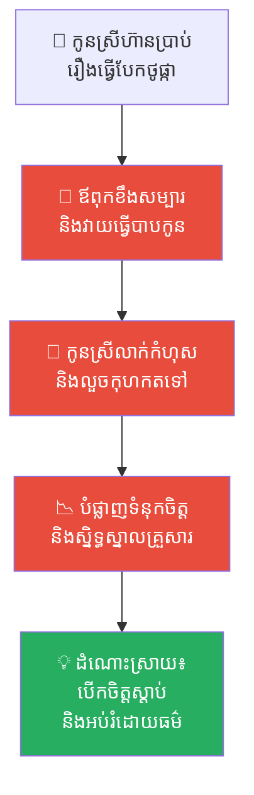
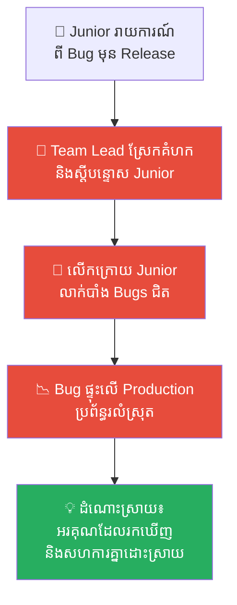
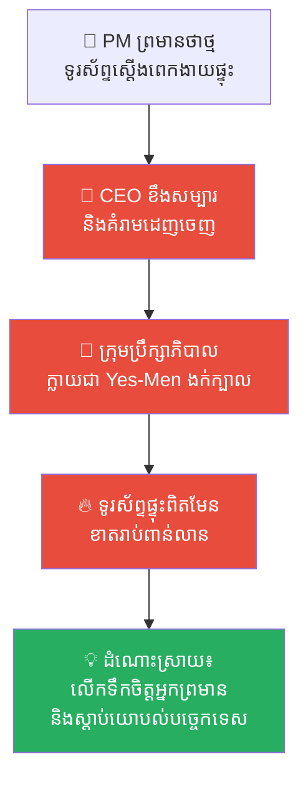
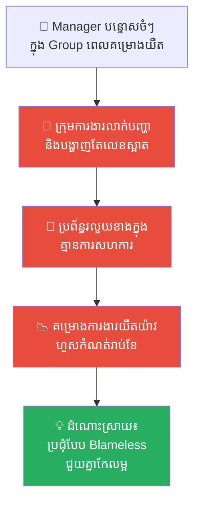
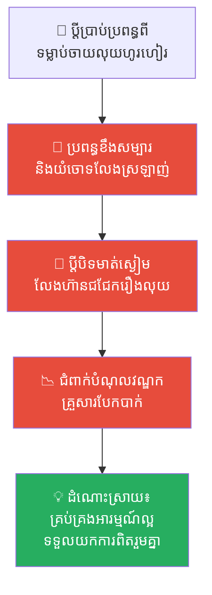
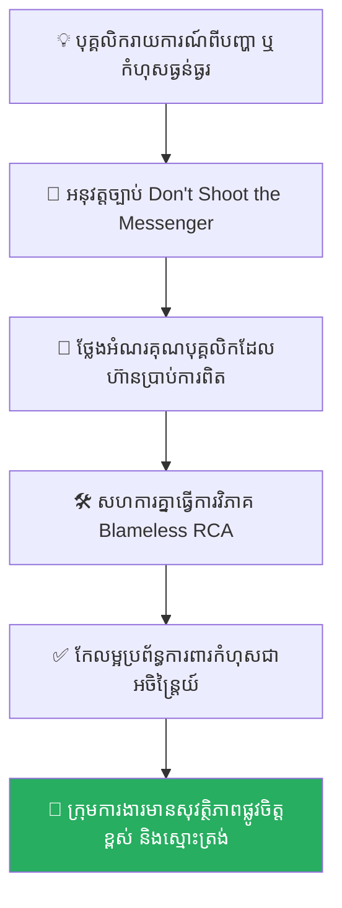

# Cao Cao's Short Song and the Heart of Talent (ចម្រៀងខ្លីរបស់ឆាវឆាវ និងដួងចិត្តនៃអ្នកខ្លាំង)៖ គ្រោះថ្នាក់នៃការបំផ្លាញទំនុកចិត្ត និងសិល្បៈនៃការកសាងសុវត្ថិភាពផ្លូវចិត្ត (Psychological Safety)

**Author:** ichamrong  
**Date:** 2026-05-17  
**Tags:** #multiplier-leadership #psychological-safety #eq-communication #talent-acquisition #three-kingdoms #human-resource #ego-trap #critical-thinking  
**Category:** Concepts  
**Read Time:** ~15 min  

---

## 📌 មាតិកា (Table of Contents)
- [អន្ទាក់ផ្លូវចិត្ត (The Trap)](#អន្ទាក់ផ្លូវចិត្ត-the-trap)
- [១. រឿងព្រេង៖ ពិធីជប់លៀងលើនាវាចម្បាំង និងចម្រៀងរបស់ឆាវឆាវ (The Grand Banquet & Cao Cao's Song)](#1)
  - [អត្ថន័យនៃកំណាព្យ «ចម្រៀងខ្លី» (The Meaning of the "Short Song Style" - Duan Ge Xing)](#1-1)
  - [អន្ទាក់អត្មោនិយម និងដាវកាត់ក្បាលអ្នកនិយាយពិត (The Ego Trap and the Tragic Death of Liu Xi)](#1-2)
  - [វិប្បដិសារី និងបុណ្យសពដ៏ធំធេង (Remorse and the Grand Funeral)](#1-3)
- [២. បញ្ហា៖ អន្ទាក់សម្លាប់អ្នកនាំសារ និងឥទ្ធិពលបំផ្លាញទំនុកចិត្ត (The Issue: The "Kill the Messenger" Syndrome & Trust Bankruptcy)](#2)
- [៣. ឧទាហរណ៍ជាក់ស្តែងក្នុងពិភពពិត (Real World Examples)](#3)
  - [ឧទាហរណ៍ទី ១ — កម្រិតស្រាល (គ្រួសារ)៖ ឪពុកម្តាយដែលខឹងសម្បារពេលកូនប្រាប់ការពិតពីកំហុស (The Truth-Punishing Parent)](#3-1)
  - [ឧទាហរណ៍ទី ២ — កម្រិតមធ្យម (បច្ចេកទេស)៖ Team Lead ដែលស្តីបន្ទោសរាល់ពេល Junior រាយការណ៍ពី Bugs ធ្ងន់ធ្ងរ (The Bug-Blaming Lead)](#3-2)
  - [ឧទាហរណ៍ទី ៣ — កម្រិតមធ្យម (ធុរកិច្ច)៖ CEO ផ្តាច់ការ និងការបិទមាត់ឈរមើលក្រុមហ៊ុនក្ស័យធន (The Yes-Man Executive Board)](#3-3)
  - [ឧទាហរណ៍ទី ៤ — កម្រិតមធ្យម (សង្គម/គ្រប់គ្រង)៖ វប្បធម៌ការងារគ្មានសុវត្ថិភាព និងការលាក់បាំងព័ត៌មានអវិជ្ជមាន (The Negative-News Blamer)](#3-4)
  - [ឧទាហរណ៍ទី ៥ — កម្រិតធ្ងន់ (ទំនាក់ទំនង)៖ ដៃគូជីវិតដែលចងគំនុំរាល់ពេលនិយាយរិះគន់ស្ថាបនា (The Defensive Spouse)](#3-5)
- [៤. ដំណោះស្រាយទូទៅ៖ ការកសាងសុវត្ថិភាពផ្លូវចិត្ត និងការធ្វើជា Multiplier (The General Solution: Establishing Psychological Safety)](#4)
- [សេចក្តីសន្និដ្ឋាន (Conclusion)](#conclusion)
- [ឯកសារយោង (References)](#references)
- [Related Posts](#related-posts)

---

## អន្ទាក់ផ្លូវចិត្ត (The Trap)

តើអ្នកធ្លាប់ជួបស្ថានភាពដែលអ្នកដឹកនាំ ឬប្រធានក្រុមហ៊ុនប្រកាសក្តែងៗថា *«ក្រុមហ៊ុនយើងបើកចំហរចិត្ត និងស្វាគមន៍រាល់គំនិតរិះគន់ស្ថាបនាជានិច្ច!»* ប៉ុន្តែនៅពេលដែលមានបុគ្គលិកម្នាក់ហ៊ានក្រោកឈរនិយាយការពិត ឬចង្អុលបង្ហាញពីបញ្ហា ពួកគេបែរជាត្រូវប្រធាននោះខឹងសម្បារ ដាក់ទណ្ឌកម្ម និងរុញច្រានចេញពីក្រុមការងារវិញដែរឬទេ?

នេះគឺជា **The Ego Trap (អន្ទាក់នៃអត្មោនិយមរបស់អ្នកដឹកនាំ)**។

នៅក្នុងការគ្រប់គ្រង និងដឹកនាំ ជារឿយៗអ្នកដឹកនាំប្រភេទ **Diminisher** តែងតែជឿជាក់ថា ពួកគេជាមនុស្សឆ្លាតវៃ និងត្រឹមត្រូវបំផុតគ្រប់ពេល។ ពួកគេចាត់ទុកការនិយាយការពិត ឬការព្រមានពីហានិភ័យ ដូចជា «ការបំផ្លាញទឹកចិត្ត ឬការប្រឆាំងអំណាច»។ ទង្វើផ្តាច់ការនេះបំផ្លាញចោលនូវ **សុវត្ថិភាពផ្លូវចិត្ត (Psychological Safety)** ទាំងស្រុង ដែលបង្ខំឱ្យសមាជិកក្រុមអនុវត្តយុទ្ធសាស្ត្របិទមាត់ស្ងៀមស្ងាត់ (Silent Rebellion) ឈរមើលគម្រោង ឬក្រុមហ៊ុនជួបមហន្តរាយដោយមិនហ៊ានព្រមាន។ លទ្ធផលចុងក្រោយគឺ ស្ថាប័នទាំងមូលត្រូវជួបក្តីវិនាស ព្រោះគ្មាននរណាម្នាក់ហ៊ាននិយាយការពិត។

ដើម្បីយល់ដឹងឱ្យបានគ្រប់ជ្រុងជ្រោយ នេះជាផែនទីបង្ហាញផ្លូវសម្រាប់អត្ថបទនេះ៖
1. **រឿងព្រេងប្រវត្តិសាស្ត្រ (The Three Kingdoms Legend)** — រឿងរ៉ាវរបស់ស្តេចសង្គ្រាម ឆាវឆាវ, ពិធីជប់លៀងដ៏ធំធេងលើទន្លេយ៉ង់សេ, កំណាព្យចម្រៀងខ្លី, ការសម្លាប់ទីប្រឹក្សា Liu Xi និងមហន្តរាយភ្លើងឆេះនៅសមរភូមិច្រាំងថ្មក្រហម។
2. **បញ្ហា (The Issue)** — ការវិភាគទ្រឹស្តី "Kill the Messenger" Syndrome និងឥទ្ធិពលនៃការបំផ្លាញទំនុកចិត្តក្នុងក្រុមការងារ។
3. **ឧទាហរណ៍ជាក់ស្តែងក្នុងពិភពពិត (Real World Examples)** — ពិនិត្យមើលឥទ្ធិពលនេះក្នុងកម្រិតគ្រួសារ ការងារបច្ចេកទេស ធុរកិច្ច ការគ្រប់គ្រង និងទំនាក់ទំនងស្នេហា។
4. **ដំណោះស្រាយទូទៅ (The General Solution)** — ការកសាងសុវត្ថិភាពផ្លូវចិត្ត (Psychological Safety) និងជំហានបង្កើត Blameless Culture ក្នុងអង្គភាព។

---

<a id="1"></a>
## ១. រឿងព្រេង៖ ពិធីជប់លៀងលើនាវាចម្បាំង និងចម្រៀងរបស់ឆាវឆាវ (The Grand Banquet & Cao Cao's Song)

នាយប់មួយដ៏សែនត្រជាក់ក្នុងរដូវរងា នាឆ្នាំគ.ស. ២០៨ នៅលើផ្ទៃដងទន្លេយ៉ង់សេ (Yangtze River) ដែលមានសភាពស្ងប់ស្ងាត់ប្រៀបបាននឹងផ្ទាំងកញ្ចក់ ស្រាប់តែមានវត្តមាននាវាចម្បាំងរាប់ពាន់គ្រឿង តម្រៀបជួរគ្នាយ៉ាងមហិមា។ នោះគឺកងទ័ពធំ ៨០ ម៉ឺននាក់របស់ **ឆាវឆាវ (Cao Cao)** ដែលទើបតែបានបង្រួបបង្រួមដែនដីភាគខាងជើងទាំងមូលដោយជោគជ័យ។ ពេលនេះ គាត់កំពុងឈរយ៉ាងអង់អាច ត្រៀមខ្លួនប្រកាសសង្គ្រាមវាយកម្ទេចសម្ព័ន្ធមិត្ត ស៊ុន ឈ្វាន (Sun Quan) និង លីវ ប៉ី (Liu Bei) នៅសមរភូមិច្រាំងថ្មក្រហម (Red Cliffs) ដើម្បីក្តោបក្តាប់ជោគវាសនាផែនដីទាំងមូលតែម្នាក់ឯង។

ដើម្បីជម្រុញស្មារតីកងទ័ព និងអបអរសាទរជ័យជម្នះដែលជិតធ្លាក់មកក្នុងដៃ ឆាវឆាវបានរៀបចំពិធីជប់លៀងដ៏សែនអធិកអធមមួយ នៅលើក្បាលនាវាចម្បាំងដ៏ធំបំផុតរបស់ខ្លួន។ ស្រាល្អៗរាប់ពាន់ពាង និងម្ហូបអាហារត្រូវបានរៀបចំយ៉ាងហូរហៀរ។ មេទ័ពរាប់រយនាក់ និងអ្នកប្រាជ្ញជាច្រើនរូប បានអង្គុយជុំគ្នាអបអរ ក្រោមពន្លឺព្រះច័ន្ទដ៏ពេញបូណ៌មីដែលចាំងជះលើផ្ទៃទឹកទន្លេ។

បន្ទាប់ពីក្រេបស្រាអស់ជាច្រើនពែង ឆាវឆាវមានអារម្មណ៍រំភើបពុះកញ្ជ្រោល និងរំជួលចិត្តយ៉ាងខ្លាំង។ លោកបានក្រោកឈរឡើង កាន់លំពែងវែងដ៏មុតស្រួច រួចបោះជំហានយឺតៗទៅកាន់ក្បាលនាវា សម្លឹងមើលទៅលំហអាកាសដ៏ធំល្វឹងល្វើយ និងកងទ័ពដ៏មហិមារបស់ខ្លួន។ ក្នុងគ្រានោះ លោកបានបន្លឺសម្លេងច្រៀងកំណាព្យដ៏ល្បីល្បាញមួយ ដែលមានចំណងជើងថា **«Duan Ge Xing» (短歌行 - ចម្រៀងខ្លី)** ដែលសូម្បីតែអ្នកជំនាន់ក្រោយក៏នៅតែចាត់ទុកថាជាស្នាដៃអក្សរសិល្ប៍ដ៏កម្រ និងអស្ចារ្យបំផុតក្នុងប្រវត្តិសាស្ត្រចិន៖

```text
对酒当歌，人生几何？ (Here is wine, let us sing! For how long does life last?)
譬如朝露，去日苦多。 (It is like the morning dew, the days that have passed are bitter and many.)
```

---

<a id="1-1"></a>
### อត្ថន័យនៃកំណាព្យ «ចម្រៀងខ្លី» (The Meaning of the "Short Song Style")

នៅក្នុងកំណាព្យដ៏ល្បីល្បាញនេះ ឆាវឆាវមិនមែនច្រៀងដើម្បីតែភាពសប្បាយរីករាយឡើយ ប៉ុន្តែវាជាសម្លេងចេញពីជម្រៅចិត្តរបស់អ្នកដឹកនាំម្នាក់ ដែលយល់ច្បាស់ពីតម្លៃនៃពេលវេលា និងការស្រេកឃ្លានចង់បាន «អ្នកខ្លាំង» មកជួយកសាងអាណាចក្រ៖

1. **ជីវិតខ្លីប្រៀបដូចទឹកសន្សើម (The Brevity of Life)៖** ឆាវឆាវ ដឹងច្បាស់ក្នុងចិត្តថា ជីវិតមនុស្សម្នាក់ៗគឺខ្លីណាស់ ទោះបីជាមានអំណាចអាចបញ្ជាកងទ័ពរាប់សែននាក់ក៏ដោយ ក៏មិនអាចយកឈ្នះច្បាប់ធម្មជាតិបានដែរ។ អ្វីដែលលោកអាចធ្វើបាន គឺត្រូវតែប្រញាប់ប្រញាល់សម្រេចមហិច្ឆតាធំឱ្យបានលឿនបំផុត។
2. **ការស្រេកឃ្លានចង់បានអ្នកប្រាជ្ញ (The Longing for Talented Scholars)៖** ឆាវឆាវ ប្រៀបធៀបការចង់បានអ្នកប្រាជ្ញ ទៅនឹងសេចក្តីស្នេហាដ៏ជ្រាលជ្រៅ។ លោកសុខចិត្តលះបង់គ្រប់យ៉ាង បើកទ្វារបេះដូងរង់ចាំ ឱ្យតែបានមនុស្សមានសមត្ថភាពពិតប្រាកដមកចូលរួមសាងអាណាចក្រជាមួយគ្នា។
3. **ការស្វាគមន៍ដោយចិត្តស្មោះស្ម័គ្រ (The Warm Welcome)៖** លោកសន្យាផ្តល់នូវ **«សុវត្ថិភាពផ្លូវចិត្ត» (Psychological Safety)** យ៉ាងពេញលេញដល់អ្នកប្រាជ្ញគ្រប់រូប ដោយធានាថា រាល់បណ្ឌិតដែលដើរចូលមកជ្រកកោនក្រោមដំបូលរបស់លោក នឹងទទួលបានការគោរព តម្លៃ និងការថ្នាក់ថ្នមប្រៀបដូចជាភ្ញៀវកិត្តិយស។
4. **កំពូលគំរូអ្នកដឹកនាំបែប Multiplier (The Ultimate Leadership Paradigm)៖** *«ភ្នំមិនដែលប្រកែកថាខ្លួនខ្ពស់ពេកទេ រីឯមហាសមុទ្រក៏មិនដែលត្អូញត្អែរថាខ្លួនជ្រៅពេកនោះដែរ។»* **ភ្នំកាន់តែខ្ពស់ មហាសមុទ្រកាន់តែជ្រៅ គឺដោយសារតែវាព្រមបន្ទាបខ្លួនទទួលយកដី និងទឹកពីគ្រប់ទិសទីដោយមិនរើសអើង។** ឆាវឆាវ ប្រកាសយ៉ាងឱឡារិកថា លោកគឺជាមេដឹកនាំដែលបើកចំហរចិត្តទទួលយកមនុស្សគ្រប់រូប។

---

<a id="1-2"></a>
### អន្ទាក់អត្មោនិយម និងដាវកាត់ក្បាលអ្នកនិយាយពិត (The Ego Trap and the Tragic Death of Liu Xi)

ខណៈពេលដែល ឆាវឆាវ កំពុងតែស្រែកច្រៀងដោយក្តីមោទនភាព និងរំជួលចិត្ត មេទ័ព និងអ្នកប្រាជ្ញទាំងអស់បាននាំគ្នាទះដៃអបអរសាទរយ៉ាងកងរំពង។ មនុស្សគ្រប់គ្នាកំពុងតែលិចលង់នៅក្នុងភាពអស្ចារ្យ អំណាច និងមហិច្ឆតាដ៏ធំធេងរបស់គាត់។

But, as Cao Cao sang the final verses:
> *«月明星稀，乌鹊南飞。绕树三匝，何枝可依？»*  
> *(ព្រះច័ន្ទរះភ្លឺស្វាង ធ្វើឱ្យពន្លឺផ្កាយប្រែជាស្រពោន ហ្វូងសត្វក្អែកហើរត្រាច់ចរទៅទិសខាងត្បូង។ ពួកវាហើរក្រឡឹងជុំវិញដើមឈើបីជុំ តើមានមែកឈើណាដែលអាចឱ្យពួកវាទុំពឹងផ្អែកបានទៅ?)*

រំពេចនោះ មានទីប្រឹក្សា និងជាអ្នកប្រាជ្ញដ៏ស្មោះត្រង់ម្នាក់ឈ្មោះ **លីវ ស៊ី (Liu Xi)** ដែលហ៊ាននិយាយការពិតមិនចេះលាក់លៀម បានក្រោកឈរឡើង រួចនិយាយបន្លឺសម្លេងយ៉ាងខ្លាំង កាត់ផ្តាច់បរិយាកាសដ៏សប្បាយរីករាយនៃពិធីជប់លៀង៖
> *«សូមទានជ្រាប លោកម្ចាស់! ព្រឹកស្អែកនេះ កងទ័ពយើងជិតចេញច្បាំងធំហើយ។ ប៉ុន្តែឃ្លាកំណាព្យរបស់លោកម្ចាស់ដែលថា "ហ្វូងសត្វក្អែកហើរក្រឡឹងជុំវិញដើមឈើ តែគ្មានមែកឈើណាអាចពឹងពាក់បាន" នេះ គឺជាប្រផ្នូលដ៏សែនអាក្រក់! វាប្រៀបបាននឹងការទស្សន៍ទាយថា ទាហានរបស់យើងនឹងគ្មានទីជម្រក ហើយត្រូវវិនាសអន្តរាយនៅក្នុងសមរភូមិ!»*

សម្តីត្រង់ៗរបស់ លីវ ស៊ី ហាក់បីដូចជាទឹកកកមួយធុងធំ ដែលចាក់ស្រោចលើក្បាលរបស់ ឆាវឆាវ ដែលកំពុងតែស្រវឹងពោរពេញដោយអំណាច។ កំហឹងគួបផ្សំនឹង **អត្មោនិយម (Ego)** របស់ឆាវឆាវ បានឆាបឆេះឡើងភ្លាមៗ។ ក្នុងនាមជាស្តេចសង្គ្រាមដ៏មានមហិទ្ធិឫទ្ធិ លោកពិតជាមិនអាចទទួលយកបានឡើយនូវការ «រិះគន់» ឬការបញ្ចេញមតិដែល «បំបាក់ទឹកចិត្ត» នៅចំកណ្តាលពិធីជប់លៀងដ៏ឧឡារិកបែបនេះ។

ឆាវឆាវ ឡើងសរសៃក មុខក្រហមងាំង រួចស្រែកគំហកថា៖
> *«អាក្បត់! ឯងហ៊ានប្រើសម្តីចង្រៃ បំផ្លាញទឹកចិត្តកងទ័ពរបស់អញផងរឺ!»*

និយាយមិនទាន់ផុតពីមាត់ផង ឆាវឆាវ បានរុញលំពែងវែងនៅក្នុងដៃយ៉ាងពេញទំហឹង ធ្លាយទម្លុះទ្រូង លីវ ស៊ី ឱ្យដួលស្លាប់ភ្លាមៗក្នុងថ្លុកឈាម នៅចំពោះមុខមនុស្សរាប់រយនាក់។ ពិធីជប់លៀងដែលធ្លាប់តែអ៊ូអរអឺងកង ស្រាប់តែប្រែជាស្ងាត់ច្រងំ ត្រជាក់ស្រេបដូចទីបញ្ចុះសព។ គ្មាននរណាម្នាក់ហ៊ានកម្រើកខ្លួន ឬសូម្បីតែដកដង្ហើមខ្លាំងឡើយ។ នៅក្នុងវិនាទីនោះ ពួកគេទើបតែបានឃើញយ៉ាងច្បាស់នូវ **«បិសាចដ៏កាចសាហាវ»** ដែលលាក់ខ្លួនយ៉ាងជិតឈឹង នៅពីក្រោយរបាំងមុខរបស់ «មេដឹកនាំដែលស្រឡាញ់អ្នកប្រាជ្ញ»។

---

<a id="1-3"></a>
### វិប្បដិសារី និងបុណ្យសពដ៏ធំធេង (Remorse and the Grand Funeral)

ព្រឹកព្រលឹមឡើង ឆាវឆាវ បានភ្ញាក់ពីដំណេកស្វាងស្រា រួចសួររក លីវ ស៊ី។ នៅពេលដែលទាហានរំលឹកប្រាប់ពីហេតុការណ៍ដ៏រន្ធត់កាលពីយប់មិញ ឆាវឆាវ ប្រែជាស្លេកមុខ មានវិប្បដិសារី និងខ្លោចចិត្តយ៉ាងខ្លាំងកាត់ថ្លែងពុំបាន។ ការស្រវឹង និង Ego បានរុញច្រានឱ្យលោកសម្លាប់អ្នកប្រាជ្ញដ៏ឆ្នើមម្នាក់ដោយផ្ទាល់ដៃ។

ឆាវឆាវ បានបញ្ជាឱ្យគេរៀបចំបុណ្យសពដ៏ធំធេង និងអធិកអធមបំផុត ដើម្បីផ្តល់កិត្តិយសដល់ លីវ ស៊ី។ លោកបានដើរយឺតៗទៅកាន់ក្តារមឈូស រួចទម្លាក់ខ្លួនយំសម្រក់ទឹកភ្នែកនៅចំពោះមុខកងទ័ពទាំងអស់ រួចពោលពាក្យសោកស្តាយថា៖
> *«លីវ ស៊ី អើយ! ខ្ញុំពិតជាខុសមែនទែនហើយ! កាលពីយប់មិញ ខ្ញុំស្រវឹងស្រា ហើយត្រូវអត្មោនិយមគ្របដណ្តប់ចិត្ត ទើបបណ្តាលឱ្យខ្ញុំសម្លាប់អ្នកដោយគ្មានហេតុផលទាល់តែសោះ។ សម្តីរបស់អ្នក គឺជាសម្តីមាសដែលហ៊ាននិយាយការពិត តែខ្ញុំបែរជាងងឹតងងល់ គ្មានត្រចៀកស្តាប់ទៅវិញ...»*

ទោះបីជា ឆាវឆាវ បានព្យាយាមរៀបចំបុណ្យសពធំដុំ និងសងជំងឺចិត្តយ៉ាងណាក៏ដោយ ក៏រនាំងនៃ **«ទំនុកចិត្ត» (Trust)** និង **«សុវត្ថិភាពផ្លូវចិត្ត»** របស់មេទ័ព និងអ្នកប្រាជ្ញជុំវិញខ្លួន ត្រូវបានបំផ្លាញខ្ទេចខ្ទីអស់ទៅហើយ។ ជាលទ្ធផល នៅក្នុងសមរភូមិច្រាំងថ្មក្រហមដែលកើតឡើងបន្ទាប់ពីនោះ មេទ័ពរាប់រយនាក់លែងហ៊ាននិយាយការពិត ឬព្រមានឆាវឆាវពីឧបសគ្គនិងកំហុសយុទ្ធសាស្ត្រទៀតឡើយ (ឧទាហរណ៍៖ ការចងទូកចម្បាំងចូលគ្នា ដែលជាចន្លោះប្រហោងដ៏ធំ)។ ពួកគេសុខចិត្តបិទមាត់ឈរមើលក្តីវិនាស ព្រោះពួកគេភ័យខ្លាចក្រែងត្រូវស្លាប់ដោយអយុត្តិធម៌ដូច លីវ ស៊ី។ ទីបំផុត កងទ័ព ៨០ ម៉ឺននាក់របស់ឆាវឆាវ ត្រូវភ្លើងឆេះកម្ទេចទាំងស្រុងត្រឹមមួយយប់ ដោយសារតែគ្មានអ្នកហ៊ានប្រាប់ការពិត។

---

<a id="2"></a>
## ២. បញ្ហា៖ អន្ទាក់សម្លាប់អ្នកនាំសារ និងឥទ្ធិពលបំផ្លាញទំនុកចិត្ត (The Issue: The "Kill the Messenger" Syndrome & Trust Bankruptcy)

រឿងរ៉ាវដ៏សែនសោកនាដកម្មរបស់ឆាវឆាវ មិនត្រឹមតែជារឿងប្រវត្តិសាស្ត្រប៉ុណ្ណោះទេ ប៉ុន្តែវាបានឆ្លុះបញ្ចាំងពីការពិតដ៏ស៊ីជម្រៅ នៅក្នុងការគ្រប់គ្រងស្ថាប័ន ឬក្រុមការងារទំនើប។

នៅពេលដែលមេដឹកនាំជួបប្រទះនឹង **«សម្លេងនៃការពិត» (The Voice of Truth)** ដែលផ្ទុយពីគំនិត ឬមោទនភាពរបស់ខ្លួន ហើយបែរជាផ្ទុយទៅវិញ ប្រើប្រាស់អំណាចដើម្បីស្តីបន្ទោស ឬដាក់ទណ្ឌកម្ម (Diminisher Behavior) ពួកគេកំពុងបង្កើតយន្តការ៖
1. **Kill the Messenger (ការសម្លាប់អ្នកនាំសារ)៖** គ្មាននរណាម្នាក់ហ៊ានរាយការណ៍ពីព័ត៌មានអវិជ្ជមាន ឬបញ្ហាពិតប្រាកដទៀតឡើយ។
2. **Trust Bankruptcy (ការក្ស័យធនទំនុកចិត្ត)៖** ក្រុមការងារលែងមានជំនឿចិត្តលើមេដឹកនាំ ពួកគេអនុវត្តយុទ្ធសាស្ត្រ «យល់ព្រមគ្រប់រឿង» (Yes-Man Culture) ដើម្បីការពារខ្លួនឯង ធ្វើឱ្យមេដឹកនាំលែងដឹងពីការពិតនៅលើសមរភូមិ ឬទីផ្សារ។

```mermaid
graph TD
    subgraph "វប្បធម៌រកខុស (Blame Culture)"
        A1["👤 មេដឹកនាំអត្មោនិយមខ្ពស់<br/>(High Ego Leader)"] -->|"សម្លាប់អ្នកនាំសារ<br/>(Kill the Messenger)"| A2["🗣️ បុគ្គលិកនិយាយការពិត<br/>(Whistleblower Punished)"]
        A2 --> A3["🤫 ក្រុមការងារបិទមាត់ស្ងាត់<br/>(Yes-Man Culture / Silence)"]
        A3 --> A4["🔴 ប្រព័ន្ធដួលរលំទាំងស្រុង<br/>(Production Crash / Fire at Red Cliffs)"]
    end
    
    subgraph "វប្បធម៌សុវត្ថិភាព (Psychological Safety)"
        B1["👤 មេដឹកនាំបើកចិត្ត<br/>(High EQ Multiplier)"] -->|"ស្វាគមន៍ព័ត៌មានអវិជ្ជមាន<br/>(Constructive Feedback)"| B2["🗣️ បុគ្គលិកហ៊ានព្រមានកំហុស<br/>(Risk Identified Early)"]
        B2 --> B3["💡 សហការគ្នាស្វែងរកដំណោះស្រាយ<br/>(Blameless RCA)"]
        B3 --> B4["✅ ស្ថាប័នទទួលបានជោគជ័យអមតៈ<br/>(Robust and Anti-fragile)"]
    end

    style A4 fill:#e74c3c,color:#fff
    style B4 fill:#27ae60,color:#fff
```



---

<a id="3"></a>
## ៣. ឧទាហរណ៍ជាក់ស្តែងក្នុងពិភពពិត

ដើម្បីយល់ដឹងឱ្យកាន់តែស៊ីជម្រៅ ផ្លូវការសិក្សានឹងនាំអ្នកទៅពិនិត្យមើល **ឧទាហរណ៍ចំនួន ៥ កម្រិតខុសៗគ្នា** ក្នុងជីវិតរស់នៅប្រចាំថ្ងៃ៖

---

<a id="3-1"></a>
### ឧទាហរណ៍ទី ១ — កម្រិតស្រាល (គ្រួសារ)៖ ឪពុកម្តាយដែលខឹងសម្បារពេលកូនប្រាប់ការពិតពីកំហុស (The Truth-Punishing Parent)

**ស្ថានភាព៖** កូនស្រីម្នាក់បានលួចធ្វើឱ្យបែកថូផ្កាដ៏មានតម្លៃក្នុងផ្ទះ។ នាងសម្រេចចិត្តដើរមកប្រាប់ឪពុកដោយផ្ទាល់ខ្លួនថា៖ *«ពុក! ខ្ញុំសុំទោស ខ្ញុំបានធ្វើឱ្យបែកថូផ្កាហើយ!»* ឪពុកឮភ្លាមផ្ទុះកំហឹងយ៉ាងខ្លាំង ស្រែកជេរប្រមាថ និងវាយធ្វើបាបនាងភ្លាមៗ។

* **ភាគី A (ឪពុក)៖** គិតថាការដាក់ទណ្ឌកម្មធ្ងន់ធ្ងរ នឹងជួយឱ្យកូនមានការប្រុងប្រយ័ត្នខ្ពស់ និងមិនហ៊ានធ្វើឱ្យបែករបស់របរទៀត។
* **ភាគី B (កូនស្រី)៖** នៅពេលនាងធ្វើខុសម្តងទៀតនៅខែក្រោយ នាងសម្រេចចិត្តលាក់បាំងកំហុស ភូតកុហក ឬទម្លាក់កំហុសទៅលើសត្វឆ្មាជំនួសវិញ ដើម្បីចៀសវាងការវាយធ្វើបាប។



**ការពិតដ៏ជូរចត់៖**
ឪពុកបាន «សម្លាប់អ្នកនាំសារ» ក្នុងគ្រួសារ ដែលបំផ្លាញទំនុកចិត្តទាំងស្រុង និងបង្រៀនឱ្យកូនក្លាយជាមនុស្សភូតកុហកដើម្បីរស់។

---

<a id="3-2"></a>
### ឧទាហរណ៍ទី ២ — កម្រិតមធ្យម (បច្ចេកទេស)៖ Team Lead ដែលស្តីបន្ទោសរាល់ពេល Junior រាយការណ៍ពី Bugs ធ្ងន់ធ្ងរ (The Bug-Blaming Lead)

**ស្ថានភាព៖** Junior Developer ម្នាក់បានរកឃើញ Bug ដ៏ធំមួយនៅក្នុងប្រព័ន្ធទូទាត់ប្រាក់ មុនពេល Release តែ ២ ម៉ោង។ គាត់ប្រញាប់រាយការណ៍ទៅកាន់ Team Lead ស្រាប់តែត្រូវបាន Team Lead ស្រែកគំហកបន្ទោសថា៖ *«ហេតុអ្វីបានជាធ្វើការខ្ជីខ្ជាបែបនេះ? សរសេរកូដយ៉ាងម៉េចឱ្យមាន Bug ធំកណ្តាលទីចឹង? ទៅជួសជុលភ្លាម!»*

* **ភាគី A (Team Lead)៖** គិតថាកំពុងតែជម្រុញឱ្យ Junior Dev មានការទទួលខុសត្រូវខ្ពស់លើគុណភាពកូដ។
* **ភាគី B (Junior Dev)៖** នៅលើកក្រោយ គាត់សម្រេចចិត្តបិទមាត់ឈរមើល Bug ធ្លាក់ទៅ Production ព្រោះគាត់គិតថា៖ *«បើខ្ញុំប្រាប់ ខ្ញុំនឹងត្រូវគេជេរ។ បើខ្ញុំមិនប្រាប់ Bug នឹងផ្ទុះលើ Production ហើយមេដឹកនាំនឹងត្រូវបន្ទោសខ្លួនឯង មិនមែនខ្ញុំឡើយ។»*



**ការពិតដ៏ជូរចត់៖**
ការបំផ្លាញសុវត្ថិភាពផ្លូវចិត្តក្នុងក្រុមកូដ បង្ខំឱ្យបុគ្គលិកបិទមាត់ និងបណ្តោយឱ្យប្រព័ន្ធជួបមហន្តរាយដោយស្ងៀមស្ងាត់។

---

<a id="3-3"></a>
### ឧទាហរណ៍ទី ៣ — កម្រិតមធ្យម (ធុរកិច្ច)៖ CEO ផ្តាច់ការ និងការបិទមាត់ឈរមើលក្រុមហ៊ុនក្ស័យធន (The Yes-Man Executive Board)

**ស្ថានភាព៖** CEO របស់ក្រុមហ៊ុនទូរស័ព្ទដៃដ៏ល្បីមួយ ចង់ប្រញាប់ដាក់លក់ម៉ូដែលថ្មីដែលមានកម្រាស់ស្តើងបំផុត។ នៅពេលប្រធានផ្នែកបច្ចេកទេសព្រមានថា *«ថ្មទូរស័ព្ទស្តើងពេក ងាយនឹងផ្ទុះឡើងកណ្តាលទី!»* CEO បានស្រែកស្តីបន្ទោស និងគំរាមបណ្តេញគាត់ចេញពីតំណែង។

* **ភាគី A (CEO)៖** គិតថាចក្ខុវិស័យរបស់ខ្លួនខ្ពង់ខ្ពស់ គ្មាននរណាអាចរារាំងបានឡើយ។
* **ភាគី B (ក្រុមប្រឹក្សាភិបាល)៖** រាល់ប្រធានផ្នែកទាំងអស់ប្រែជា «Yes-Men» ងក់ក្បាលយល់ព្រមគ្រប់គំនិតរបស់ CEO ដើម្បីរក្សាតំណែង។



**ការពិតដ៏ជូរចត់៖**
ក្រុមហ៊ុនត្រូវប្រកាសប្រមូលទូរស័ព្ទត្រឡប់មកវិញរាប់លានគ្រឿង និងខាតបង់ថវិការាប់ពាន់លានដុល្លារ ព្រោះតែគ្មាននរណាម្នាក់ហ៊ានជំទាស់គំនិត CEO ផ្តាច់ការ។

---

<a id="3-4"></a>
### ឧទាហរណ៍ទី ៤ — កម្រិតមធ្យម (សង្គម/គ្រប់គ្រង)៖ វប្បធម៌ការងារគ្មានសុវត្ថិភាព និងការលាក់បាំងព័ត៌មានអវិជ្ជមាន (The Negative-News Blamer)

**ស្ថានភាព៖** Manager ម្នាក់ជឿជាក់យ៉ាងមុតមាំលើ «ច្បាប់វិន័យតឹងរ៉ឹង»។ ឱ្យតែមានបុគ្គលិកណាផ្ញើព័ត៌មានអវិជ្ជមាន ឬបញ្ហាគម្រោងយឺតយ៉ាវចូលក្នុងក្រុម គាត់នឹង Tag ឈ្មោះស្តីបន្ទោសចំៗនៅចំកណ្តាល Group Chat។

* **ភាគី A (Manager)៖** គិតថាកំពុងតែបង្កើតឱ្យមានការប្រកួតប្រជែងការងាររឹងមាំ។
* **ភាគី B (សមាជិកក្រុម)៖** ទាំងអស់គ្នាលាក់បាំងរាល់បញ្ហា និងរបាយការណ៍អវិជ្ជមាន។ ពួកគេបង្ហាញតែ «តួលេខស្អាតៗ និងការងារដែលជោគជ័យ» រហូតដល់ថ្ងៃដែលគម្រោងទាំងមូលត្រូវហួសកាលកំណត់រាប់ខែ។



**ការពិតដ៏ជូរចត់៖**
វប្បធម៌ការងារដែលគ្មានសុវត្ថិភាព បង្ខំឱ្យបុគ្គលិករស់នៅក្នុង «របាំងមុខស្អាតស្អំ» តែគ្រឹះខាងក្នុងកំពុងតែរលួយខ្ទេចខ្ទី។

---

<a id="3-5"></a>
### ឧទាហរណ៍ទី ៥ — កម្រិតធ្ងន់ (ទំនាក់ទំនង)៖ ដៃគូជីវិតដែលចងគំនុំរាល់ពេលនិយាយរិះគន់ស្ថាបនា (The Defensive Spouse)

**ស្ថានភាព៖** ប្តីម្នាក់ចង់ជួយប្រាប់ប្រពន្ធពីទម្លាប់ប្រើប្រាស់លុយកាក់ហូរហៀររបស់នាង។ នៅពេលគាត់និយាយដោយដទន់ភ្លន់ នាងស្រាប់តែខឹងសម្បារ ស្រែកយំ និងចោទប្រកាន់ថាគាត់លែងស្រឡាញ់នាង។

* **ភាគី A (ប្រពន្ធ)៖** គិតថាការរិះគន់របស់ប្តី គឺជាការវាយប្រហារលើតម្លៃផ្ទាល់ខ្លួនរបស់នាង។
* **ភាគី B (ប្តី)៖** សម្រេចចិត្តបិទមាត់ស្ងៀម លែងហ៊ាននិយាយពីបញ្ហាហិរញ្ញវត្ថុគ្រួសារទៀតហើយ រហូតដល់ថ្ងៃដែលគ្រួសារត្រូវជំពាក់បំណុលវណ្ឌក។



**ការពិតដ៏ជូរចត់៖**
ការខ្វះសមត្ថភាពទទួលយកការពិត និងប្រតិកម្មការពារខ្លួនឯងខ្លាំងហួសហេតុ បំផ្លាញនូវស្ថិរភាព និងការជជែកគ្នាក្នុងជីវិតអាពាហ៍ពិពាហ៍។

---

<a id="4"></a>
## ៤. ដំណោះស្រាយទូទៅ៖ ការកសាងសុវត្ថិភាពផ្លូវចិត្ត និងការធ្វើជា Multiplier (The General Solution: Establishing Psychological Safety)

ដើម្បីការពារស្ថាប័នរបស់អ្នកកុំឱ្យជួបក្តីវិនាសដូចកងទ័ពឆាវឆាវនៅច្រាំងថ្មក្រហម ចូរអនុវត្តយុទ្ធសាស្ត្រគន្លឹះទាំងនេះ៖

### ១. អនុវត្តច្បាប់ "Don't Shoot the Messenger"
រាល់ពេលដែលសមាជិកក្រុមរាយការណ៍ពីព័ត៌មានអវិជ្ជមាន ឬបញ្ហាធ្ងន់ធ្ងរ ត្រូវធ្វើការគ្រប់គ្រងអារម្មណ៍ខ្លួនឯងឱ្យបានល្អ រួច **ថ្លែងអំណរគុណពួកគេជាមុនសិន**៖
* *«អរគុណច្រើនដែលអ្នកបានហ៊ានរាយការណ៍ពី Bug សុវត្ថិភាពនេះមកកាន់ខ្ញុំទាន់ពេល។ នេះគឺជាសកម្មភាពដ៏អស្ចារ្យដែលជួយសង្គ្រោះក្រុមហ៊ុនរបស់យើង!»*

### ២. បង្កើតវប្បធម៌ "Blameless RCA" (Root Cause Analysis គ្មានការបន្ទោស)
រាល់ពេលមានកំហុស ឬឧប្បត្តិហេតុកើតឡើង ត្រូវលុបបំបាត់ការសួររក «អ្នកខុស» ចេញពីដំណើរការងារទាំងស្រុង។ ផ្តោតលើការវិភាគ **«ប្រព័ន្ធ និងដំណើរការងារ»** ជំនួសវិញ ដើម្បីការពារកុំឱ្យកំហុសដដែលកើតឡើងនៅថ្ងៃក្រោយ។

### ៣. អនុវត្តយន្តការ "Ego Check" ជាប្រចាំ
ក្នុងនាមជាអ្នកដឹកនាំ ត្រូវដក Ego ផ្ទាល់ខ្លួនចេញ។ ចងចាំថា ភារកិច្ចរបស់អ្នកមិនមែនជាការបង្ហាញថាខ្លួនឯង «ឆ្លាតបំផុត» នោះទេ តែគឺការធ្វើជា **Multiplier** ដែលចេះបើកចិត្តស្តាប់ បណ្តុះបណ្តាល និងពង្រីកសក្តានុពលសមាជិកគ្រប់រូបឱ្យបានខ្លាំងបំផុត។



---

## សេចក្តីសន្និដ្ឋាន (Conclusion)

> **«កំហឹង និងអត្មោនិយមដែលសម្លាប់អ្នកនិយាយការពិតនៅថ្ងៃនេះ គឺជាអណ្តាតភ្លើងដែលនឹងត្រឡប់មកដុតកម្ទេចបន្ទាយរបស់អ្នកឱ្យក្លាយជាផេះផង់នៅថ្ងៃស្អែក។»**

ឆាវឆាវ បានរៀនមេរៀនដ៏សែនជូរចត់កណ្តាលអណ្តាតភ្លើងនៅសមរភូមិច្រាំងថ្មក្រហម ព្រោះតែដាវដែលកាត់ក្បាល លីវ ស៊ី។ ចូរកុំសម្លាប់អ្នកនាំសាររបស់អ្នក។

ចូរធ្វើជា «មហាសមុទ្រ» ដែលហ៊ានបន្ទាបខ្លួនទទួលយកសម្លេងរិះគន់ ដើម្បីកសាងអាណាចក្រការងារដ៏រឹងមាំ និងអមតៈ។

---

## ឯកសារយោង (References)

* **Luo Guanzhong** — *Romance of the Three Kingdoms (三国演义)*។ ប្រភពឯកសារប្រវត្តិសាស្ត្រ និងរឿងនិទានអំពីឆាវឆាវ និងសមរភូមិច្រាំងថ្មក្រហម។
* **Edmondson, A. C.** — *The Fearless Organization: Creating Psychological Safety in the Workplace for Learning, Innovation, and Growth* (2018)។ ការវិភាគលម្អិតអំពីសារៈសំខាន់នៃ Psychological Safety ក្នុងក្រុមការងារ។
* **Wiseman, L.** — *Multipliers: How the Best Leaders Make Everyone Smarter* (2010)។ សៀវភៅគ្រឹះនៃការវិភាគឥទ្ធិពល Multiplier vs. Diminisher ក្នុងស្ថាប័នធំៗ។

---

## Related Posts

* **[The Two Orchestras and the Silent Flute (អ្នកដឹកនាំភ្លេងពីររូប និងល្បែងសម្លេងស្ងាត់)៖ គ្រោះថ្នាក់នៃការបំបិទសំឡេងក្រុម និងគណិតវិទ្យានៃការបង្កើនសក្តានុពលក្រុម](./17-the-two-orchestras-and-the-silent-flute.md)** — Vienna Conductor Sophie vs. Albert: Empathy vs. Fear in Leadership.
* **[The Weaver and the Emperor's Robe (អ្នកត្បាញសូត្រ និងអាវយ័ន្តអធិរាជ)៖ គ្រោះថ្នាក់នៃការកាត់បន្ថយចំណាយលើផ្នែកសំខាន់ និងមហន្តរាយនៃការមើលរំលងតួនាទីតូចតាច](./16-the-weaver-and-the-emperors-robe.md)** — Tracing how systemic QA cuts and blame loops create public disasters.
* **[Learned Helplessness (ការលះបង់ក្តីសង្ឃឹមដោយការរៀនសូត្រ)៖ អន្ទាក់ចិត្តដែលធ្វើឱ្យយើងបោះបង់ការតស៊ូព្រោះតែការបរាជ័យក្នុងអតីតកាល](./10-learned-helplessness.md)** — Understanding how scoldings create imaginary shackles in our minds.

---

*Last updated: 2026-05-27*
