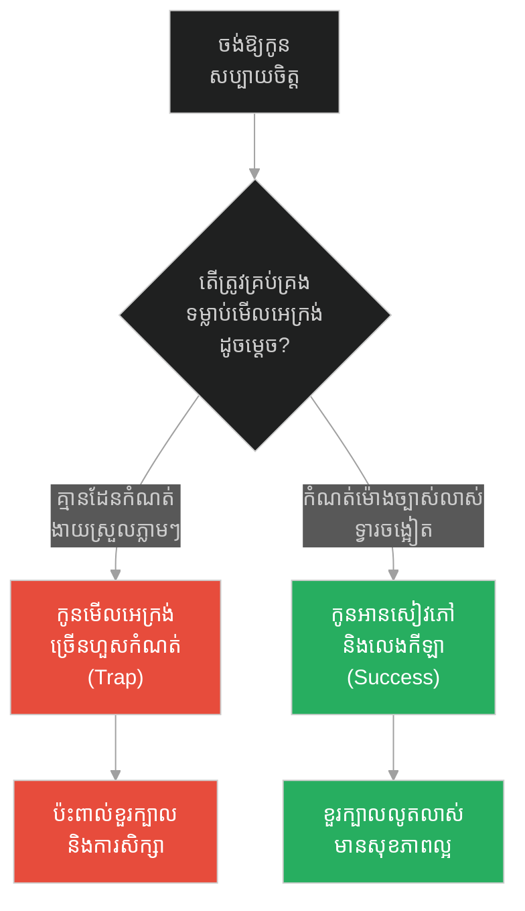
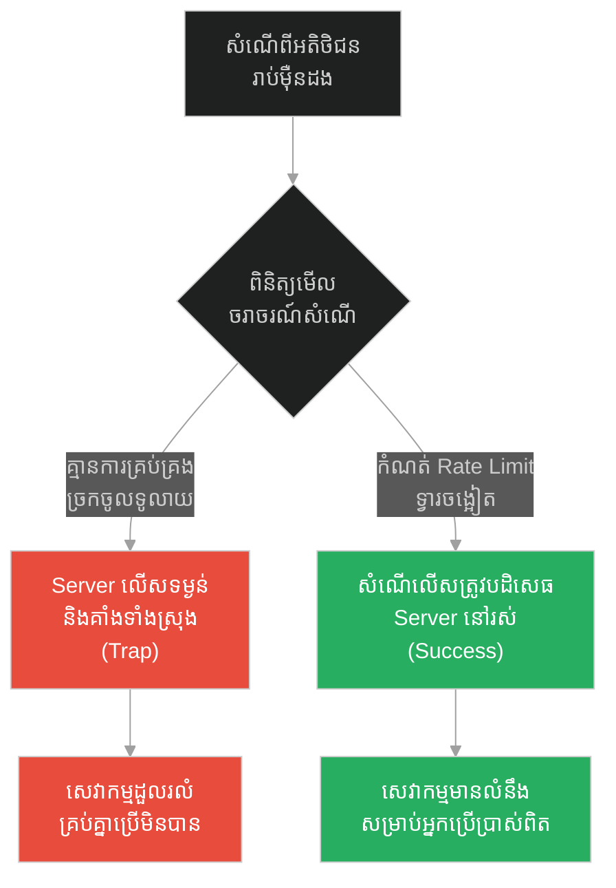
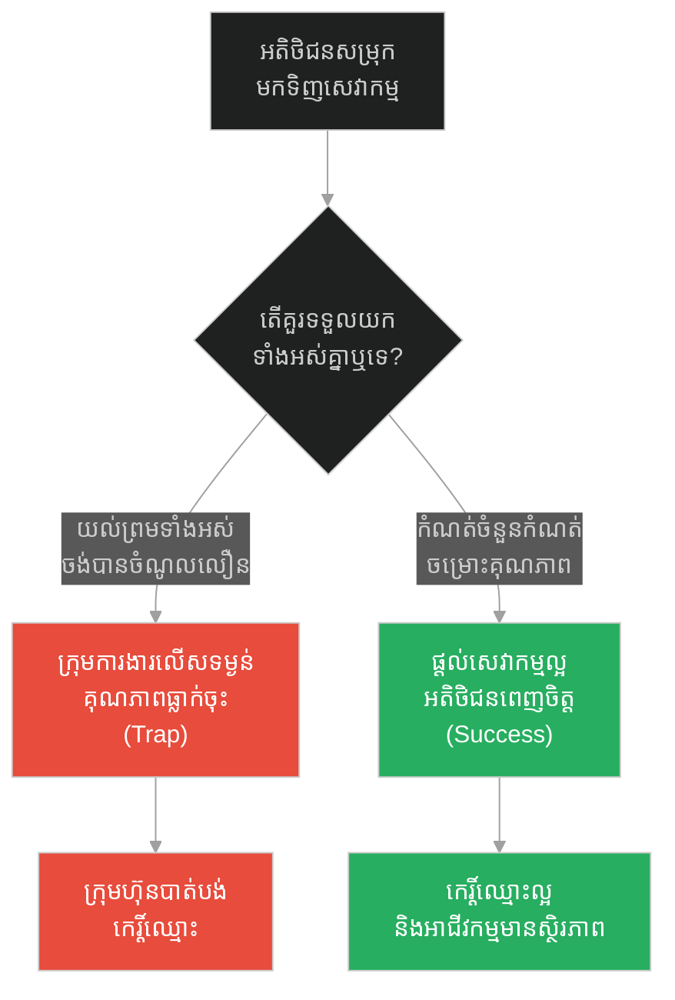
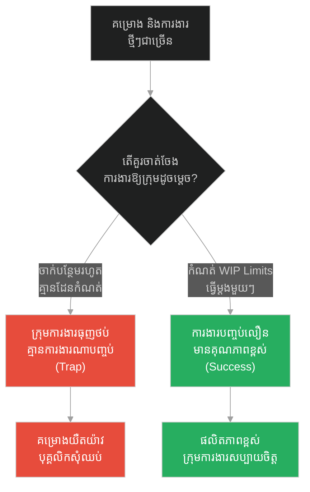
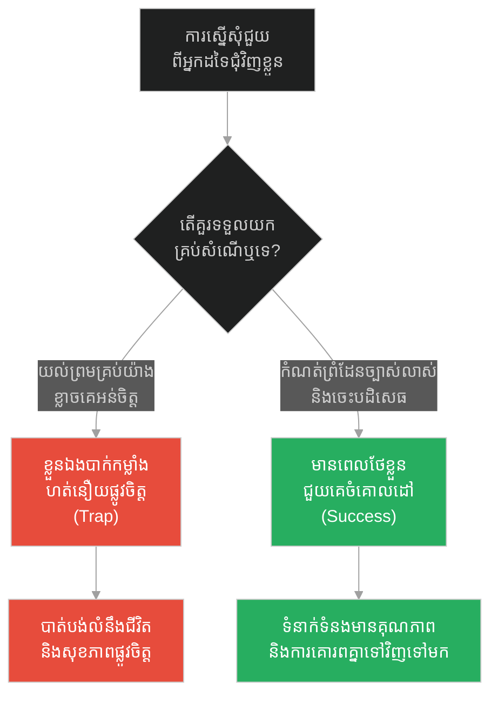
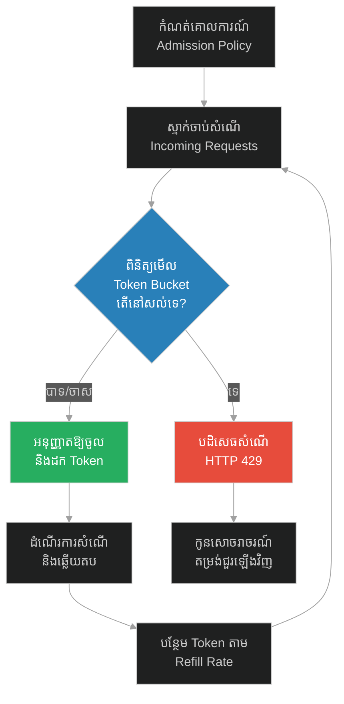

# Rate Limiting & Admission Control (ការកម្រិតល្បឿន និងការគ្រប់គ្រងការចូលប្រើប្រាស់)៖ ទ្វារចង្អៀត និងការជ្រើសរើសចរាចរណ៍សំណើ (Rate Limiting & Admission Control & Jesus and the Narrow Door)

**Author:** ichamrong  
**Date:** 2026-05-28  
**Tags:** #rate-limiting #admission-control #system-design #software-engineering #resilience #jesus  
**Category:** Concepts  
**Read Time:** ~15 min  

---

## 📌 មាតិកា (Table of Contents)
- [អន្ទាក់ផ្លូវចិត្ត (The Trap)](#0)
- [១. រឿងព្រេងនិទាន៖ ព្រះយេស៊ូវ និងទ្វារចង្អៀត (The Legend of Jesus and the Narrow Door)](#1)
  - [ទ្វារចង្អៀតជាស្ពានសុវត្ថិភាព (The Narrow Gate as a Safety Bridge)](#1-1)
- [២. បញ្ហា៖ ការកម្រិតល្បឿន និងការគ្រប់គ្រងការចូលប្រើប្រាស់ (The Issue: Rate Limiting & Admission Control)](#2)
- [៣. ឧទាហមណ៍ជាក់ស្តែងក្នុងពិភពពិត (Real World Examples)](#3)
  - [ឧទាហរណ៍ទី ១ — កម្រិតស្រាល (គ្រួសារ)៖ ការកំណត់អេក្រង់សម្រាប់កុមារ (The Family Screen Time)](#3-1)
  - [ឧទាហរណ៍ទី ២ — កម្រិតមធ្យម (បច្ចេកទេស)៖ ការការពារ API Gateway (The Tech API Protection)](#3-2)
  - [ឧទាហរណ៍ទី ៣ — កម្រិតមធ្យម (ធុរកិច្ច)៖ ការទទួលអតិថិជនថ្មីឱ្យសមស្របនឹងសមត្ថភាពការងារ (The Business Onboarding Capacity)](#3-3)
  - [ឧទាហរណ៍ទី ៤ — កម្រិតមធ្យម (សង្គម/គ្រប់គ្រង)៖ ការគ្រប់គ្រងការងារក្នុងក្រុមតាម Kanban (The Management WIP Limit)](#3-4)
  - [ឧទាហរណ៍ទី ៥ — កម្រិតធ្ងន់ (ទំនាក់ទំនង)៖ ការកំណត់ព្រំដែនផ្ទាល់ខ្លួនដើម្បីចៀសវាងការហត់នឿយចិត្ត (The Relationship Boundaries)](#3-5)
- [៤. ដំណោះស្រាយទូទៅ៖ ការកំណត់ដែនកំណត់ និងការត្រួតពិនិត្យ (The General Solution: Rate Limiting Algorithms)](#4)
- [សេចក្តីសន្និដ្ឋាន (Conclusion)](#5)
- [ឯកសារយោង (References)](#6)
- [Related Posts](#7)

---

<a id="0"></a>
## អន្ទាក់ផ្លូវចិត្ត (The Trap)

តើយើងគួរស្វាគមន៍រាល់គ្រប់ការទាមទារ និងការស្នើសុំទាំងអស់ ដើម្បីបង្ហាញពីភាពរួសរាយរាក់ទាក់ និងចិត្តទូលាយ ឬត្រូវកំណត់ព្រំដែនឱ្យបានច្បាស់លាស់ដើម្បីរក្សាសុវត្ថិភាព និងលំនឹងប្រព័ន្ធ?

* **ការបើកទ្វារចំហឥតដែនកំណត់ (The Open-Gate Fallacy)** — ការយល់ស្របទទួលយកសំណើ និងការងារគ្រប់យ៉ាងដោយគ្មានដែនកំណត់ អាចធ្វើឱ្យប្រព័ន្ធទាំងមូលដួលរលំដោយសារការលើសទម្ងន់ការងារ (Overload)។
* **ការឆ្លងកាត់តាមទ្វារចង្អៀត (The Narrow Door Strategy)** — ការជ្រើសរើសចម្រោះសំណើដោយផ្អែកលើសមត្ថភាពពិតប្រាកដ ទោះបីជាត្រូវបដិសេធសំណើខ្លះជាបណ្តោះអាសន្ន ប៉ុន្តែវាជួយរក្សាស្ថិរភាព និងគុណភាពជីវិត ឬគុណភាពប្រព័ន្ធទាំងមូល។

រឿងរ៉ាវនៃ «ទ្វារចង្អៀត» នឹងបង្ហាញយើងពីយុទ្ធសាស្ត្រ **Rate Limiting (ការកម្រិតល្បឿនសំណើ)** និង **Admission Control (ការគ្រប់គ្រងការចូលប្រើប្រាស់)** ដើម្បីការពារធនធាន និងរៀបចំអាទិភាពការងារឱ្យមានប្រសិទ្ធភាពខ្ពស់។

1. **រឿងព្រេងនិទាន (The Legend)** — ព្រះយេស៊ូវប្រដៅអំពីទ្វារចង្អៀតដែលនាំទៅរកជីវិត និងទ្វារទូលាយដែលនាំទៅរកសេចក្តីវិនាស។
2. **បញ្ហា (The Issue)** — ការខូចខាតធនធានដោយសារគ្មានយន្តការគ្រប់គ្រងការហូរចូលនៃទិន្នន័យ ឬការងារ។
3. **ឧទាហមណ៍ជាក់ស្តែង (Real World Examples)** — ការគ្រប់គ្រងតាមលំដាប់ថ្នាក់ទាំង ៥ ពីកម្រិតគ្រួសាររហូតដល់ប្រព័ន្ធបច្ចេកវិទ្យា និងទំនាក់ទំនងផ្ទាល់ខ្លួន។
4. **ដំណោះស្រាយទូទៅ (The General Solution)** — ការអនុវត្តយន្តការចម្រោះ និងការកម្រិតសំណើតាមស្តង់ដារ។

---

<a id="1"></a>
## ១. រឿងព្រេងនិទាន៖ ព្រះយេស៊ូវ និងទ្វារចង្អៀត (The Legend of Jesus and the Narrow Door)

នៅក្នុងការបង្រៀនរបស់ព្រះយេស៊ូវ ទ្រង់បានលើកឡើងនូវពាក្យប្រៀបប្រដូចដ៏ស៊ីជម្រៅមួយអំពីរបៀបដែលមនុស្សជ្រើសរើសផ្លូវដើរក្នុងជីវិត។ ទ្រង់មានបន្ទូលថា៖ 

> *«ចូរចូលតាមទ្វារចង្អៀតចុះ! ដ្បិតទ្វារធំ ហើយផ្លូវទូលាយ វានាំទៅរកសេចក្តីវិនាស ហើយមានមនុស្សជាច្រើនណាស់ដែលដើរចូលតាមផ្លូវនោះ។ រីឯទ្វារ និងផ្លូវដែលនាំទៅរកជីវិត គឺចង្អៀត ហើយលំបាកណាស់ ហើយមានមនុស្សតិចតួចប៉ុណ្ណោះដែលរកផ្លូវនោះឃើញ។»* (ម៉ាថាយ ៧:១៣-១៤)

ព្រះយេស៊ូវបានពន្យល់ថា «ផ្លូវទូលាយ» គឺងាយស្រួលដើរ មិនបាច់ខំប្រឹងប្រែង មិនបាច់លះបង់អ្វីទាំងអស់ ដូចនេះទើបមានមនុស្សជាច្រើនសម្រុកទៅទីនោះ។ ប៉ុន្តែ ចុងបញ្ចប់នៃផ្លូវទូលាយនោះ គឺការបំផ្លិចបំផ្លាញ និងភាពវឹកវរ។ ផ្ទុយទៅវិញ «ទ្វារចង្អៀត» គឺតឹងរ៉ឹង ទាមទារឱ្យមនុស្សម្នាក់ៗត្រូវសម្រេចចិត្តដោយម៉ត់ចត់ បោះបង់ចោលនូវឥវ៉ាន់ធ្ងន់ៗដែលមិនចាំបាច់ (ដូចជាអំនួត និងទម្លាប់អាក្រក់) ដើម្បីអាចប្រជ្រៀតចូលរួច។

<a id="1-1"></a>
### ទ្វារចង្អៀតជាស្ពានសុវត្ថិភាព (The Narrow Gate as a Safety Bridge)

ទ្វារចង្អៀតមិនមែនជាឧបសគ្គដែលបង្កើតឡើងដើម្បីរារាំងមនុស្សដោយគ្មានហេតុផលនោះទេ ប៉ុន្តែវាជា **យន្តការការពារ (Protective Boundary)**។ ប្រសិនបើច្រកចូលទៅកាន់ទីក្រុងសុវត្ថិភាពត្រូវបានបើកចំហរទូលាយពេក សត្រូវ កាកសំណល់ និងភាពវឹកវរនឹងហូរចូលមកបំផ្លាញទីក្រុងនោះមិនខាន។ ការកម្រិតច្រកចូលឱ្យចង្អៀត ជួយឱ្យអ្នកយាមទ្វារអាចពិនិត្យ ផ្ទៀងផ្ទាត់ និងធានាថាមានតែមនុស្សដែលត្រៀមខ្លួនរួចរាល់ប៉ុណ្ណោះដែលអាចចូលទៅបាន ដោយមិនបង្កឱ្យមានការកកស្ទះ ឬការដួលរលំពីខាងក្នុង។

---

<a id="2"></a>
## ២. បញ្ហា៖ ការកម្រិតល្បឿន និងការគ្រប់គ្រងការចូលប្រើប្រាស់ (The Issue: Rate Limiting & Admission Control)

នៅក្នុងវិស្វកម្មកម្មវិធី (Software Engineering) នៅពេលដែលប្រព័ន្ធមួយមិនមានរបាំងការពារនៅច្រកចូល សំណើ (Requests) រាប់លានអាចសម្រុកចូលទៅកាន់ប្រព័ន្ធក្នុងពេលតែមួយ។ បាតុភូតនេះហៅថា **Spike Traffic** ឬ **Distributed Denial of Service (DDoS)**។ ធនធានរបស់ម៉ាស៊ីនបម្រើ (CPU, Memory, Database Connections) មានកំណត់។ ប្រសិនបើយើងព្យាយាមដំណើរការសំណើទាំងអស់ដោយគ្មានការត្រួតពិនិត្យ នោះប្រព័ន្ធនឹងគាំង (Crash) ហើយសេវាកម្មទាំងមូលនឹងមិនអាចប្រើប្រាស់បានសម្រាប់អ្នកប្រើប្រាស់គ្រប់រូប។

ខាងក្រោមនេះជាការប្រៀបធៀបកូដរវាងការអនុវត្តប្រព័ន្ធដែលគ្មានការការពារ (Fragile) និងប្រព័ន្ធដែលមានការការពារតាមយន្តការ Token Bucket (Resilient)៖

### ❌ ការអនុវត្តបែបផុយស្រួយ (Fragile Implementation)
ប្រព័ន្ធទទួលយកគ្រប់សំណើទាំងអស់ដោយគ្មានដែនកំណត់ ដែលអាចបណ្តាលឱ្យ Database Connection Pool អស់ភ្លាមៗនៅពេលមានសំណើច្រើន។

```python
# fragile_service.py
import time
import random

class DatabaseConnection:
    def query(self):
        # ដំណើរការសំណើដែលមានតម្លៃថ្លៃ (Expensive operation)
        time.sleep(0.5) 
        return "Query Result"

db = DatabaseConnection()

def handle_request_fragile(request_id):
    print(f"[Request {request_id}] ចូលមកដល់...")
    # ព្យាយាមដំណើរការភ្លាមៗដោយគ្មានដែនកំណត់
    try:
        result = db.query()
        print(f"[Request {request_id}] បានជោគជ័យ: {result}")
        return {"status": 200, "data": result}
    except Exception as e:
        # ប្រព័ន្ធអាចគាំងប្រសិនបើ Connection ពេញ
        print(f"[Request {request_id}] បរាជ័យ: {str(e)}")
        return {"status": 500, "error": "System Crash / Database Timeout"}
```

###  ការអនុវត្តប្រកបដោយភាពធន់ (Resilient Implementation - Token Bucket)
ប្រព័ន្ធបង្កើត «ទ្វារចង្អៀត» (Rate Limiter) ដើម្បីធានាថាមានតែសំណើក្នុងកម្រិតកំណត់ប៉ុណ្ណោះដែលអាចចូលដំណើរការបានក្នុងពេលតែមួយ។

```python
# resilient_service.py
import time
from threading import Lock

class TokenBucketRateLimiter:
    def __init__(self, capacity: int, refill_rate: float):
        self.capacity = capacity          # ចំនួន Token អតិបរមាដែលទ្វារអាចផ្ទុក
        self.refill_rate = refill_rate      # ចំនួន Token បន្ថែមក្នុងមួយវិនាទី
        self.tokens = float(capacity)
        self.last_refill = time.time()
        self.lock = Lock()

    def allow_request(self) -> bool:
        with self.lock:
            now = time.time()
            # បន្ថែម Token ទៅតាមរយៈពេលដែលបានកន្លងហួស
            elapsed = now - self.last_refill
            self.tokens = min(self.capacity, self.tokens + elapsed * self.refill_rate)
            self.last_refill = now

            # ពិនិត្យមើលថាតើមាន Token គ្រប់គ្រាន់សម្រាប់សំណើនេះឬទេ
            if self.tokens >= 1.0:
                self.tokens -= 1.0
                return True
            return False

# កំណត់ឱ្យមានអតិបរមា 5 requests និងថែម 1 request/second
rate_limiter = TokenBucketRateLimiter(capacity=5, refill_rate=1.0)
db = DatabaseConnection()

def handle_request_resilient(request_id):
    print(f"[Request {request_id}] មកដល់ទ្វារចូល...")
    
    # ត្រួតពិនិត្យសំណើតាមទ្វារចង្អៀត (Admission Control)
    if not rate_limiter.allow_request():
        print(f"[Request {request_id}] ត្រូវបានបដិសេធ (Rate Limit Exceeded - 429)")
        return {
            "status": 429, 
            "error": "Too Many Requests. Please pass through the narrow door later."
        }
    
    # បើកឱ្យដំណើរការព្រោះស្ថិតក្នុងកម្រិតកំណត់សុវត្ថិភាព
    result = db.query()
    print(f"[Request {request_id}] ដំណើរការជោគជ័យ: {result}")
    return {"status": 200, "data": result}
```

---

<a id="3"></a>
## ៣. ឧទាហមណ៍ជាក់ស្តែងក្នុងពិភពពិត (Real World Examples)

<a id="3-1"></a>
### ឧទាហរណ៍ទី ១ — កម្រិតស្រាល (គ្រួសារ)៖ ការកំណត់អេក្រង់សម្រាប់កុមារ (The Family Screen Time)
ឪពុកម្តាយដែលចង់ឱ្យកូនសប្បាយចិត្តភ្លាមៗដោយគ្មានសម្ពាធ តែងតែអនុញ្ញាតឱ្យកូនមើល iPad ពេញមួយថ្ងៃ (ទ្វារទូលាយ) ដែលនាំទៅរកការញៀនអេក្រង់។ ផ្ទុយទៅវិញ ការកំណត់ម៉ោងច្បាស់លាស់ (ទ្វារចង្អៀត) ជួយឱ្យកូនមានពេលអានសៀវភៅ និងហាត់ប្រាណ។



---

<a id="3-2"></a>
### ឧទាហរណ៍ទី ២ — កម្រិតមធ្យម (បច្ចេកទេស)៖ ការការពារ API Gateway (The Tech API Protection)
នៅក្នុងប្រព័ន្ធ Microservices ការមិនកំណត់ចំនួនសំណើដែលអតិថិជន (Clients) អាចហៅចូលបាន អាចបណ្តាលឱ្យ Server គាំង។ ការកំណត់ Rate Limiting នៅ API Gateway ជួយធានាថា Server មិនលិចទឹកដោយសារសំណើច្រើនហួសប្រមាណ។



---

<a id="3-3"></a>
### ឧទាហរណ៍ទី ៣ — កម្រិតមធ្យម (ធុរកិច្ច)៖ ការទទួលអតិថិជនថ្មីឱ្យសមស្របនឹងសមត្ថភាពការងារ (The Business Onboarding Capacity)
ក្រុមហ៊ុនលក់សេវាកម្មបច្ចេកវិទ្យា (SaaS) ឬទីភ្នាក់ងារផ្សព្វផ្សាយ (Agency) ដែលចេះតែទទួលយកអតិថិជនទាំងអស់ដោយគ្មានដែនកំណត់ នឹងជួបវិបត្តិគុណភាពសេវាកម្ម និងធ្វើឱ្យអតិថិជនចាស់ៗចាកចេញ។ ការកំណត់ចំនួនអតិថិជនដែលត្រូវទទួលក្នុងមួយខែ ធានាបាននូវការថែទាំដ៏ល្អបំផុត។



---

<a id="3-4"></a>
### ឧទាហមណ៍ទី ៤ — កម្រិតមធ្យម (សង្គម/គ្រប់គ្រង)៖ ការគ្រប់គ្រងការងារក្នុងក្រុមតាម Kanban (The Management WIP Limit)
ប្រធានក្រុមដែលចេះតែបោះការងារថ្មីៗទៅឱ្យបុគ្គលិកដោយគ្មានការកំណត់ Work-in-Progress (WIP) នឹងធ្វើឱ្យការងារទាំងអស់ស្ទះពាក់កណ្តាលទី។ ការកំណត់ចំនួនការងារដែលសមាជិកម្នាក់អាចធ្វើបានក្នុងពេលតែមួយ (WIP Limit) ជួយឱ្យការងារបញ្ចប់បានលឿន និងមានប្រសិទ្ធភាព។



---

<a id="3-5"></a>
### ឧទាហរណ៍ទី ៥ — កម្រិតធ្ងន់ (ទំនាក់ទំនង)៖ ការកំណត់ព្រំដែនផ្ទាល់ខ្លួនដើម្បីចៀសវាងការហត់នឿយចិត្ត (The Relationship Boundaries)
មនុស្សដែលមិនចេះបដិសេធ (People-Pleaser) តែងតែទទួលយកសំណើជួយ និងការបបួលគ្រប់យ៉ាងពីមិត្តភក្តិ និងក្រុមគ្រួសារ រហូតដល់ខ្លួនឯងលែងមានពេលផ្ទាល់ខ្លួន និងហត់នឿយផ្លូវចិត្តយ៉ាងធ្ងន់ធ្ងរ។ ការកំណត់ព្រំដែន និងការនិយាយពាក្យថា «ទេ» ចំពោះរឿងខ្លះ ជួយរក្សាស្ថិរភាពផ្លូវចិត្តផ្ទាល់ខ្លួន។



---

<a id="4"></a>
## ៤. ដំណោះស្រាយទូទៅ៖ ការកំណត់ដែនកំណត់ និងការត្រួតពិនិត្យ (The General Solution: Rate Limiting Algorithms)

ដើម្បីអនុវត្តយុទ្ធសាស្ត្រ «ទ្វារចង្អៀត» នៅក្នុងការងារ និងប្រព័ន្ធបច្ចេកវិទ្យា យើងត្រូវអនុវត្តជំហានដោះស្រាយជាប្រព័ន្ធដូចខាងក្រោម៖

1. **ស្វែងរកចំណុចកកស្ទះ (Bottleneck Identification)** — ដឹងឱ្យច្បាស់ពីសមត្ថភាពអតិបរមាដែលប្រព័ន្ធ ឬក្រុមការងារអាចដំណើរការបានដោយសុវត្ថិភាព។
2. **កំណត់គោលការណ៍ត្រួតពិនិត្យ (Define Admission Policy)** — បង្កើតច្បាប់ច្បាស់លាស់ក្នុងការច្រោះយកសំណើ ដូចជា៖
   * តើអ្នកណាខ្លះត្រូវបានអនុញ្ញាតឱ្យចូលមុន (Priority Queuing)?
   * តើសំណើកម្រិតណាដែលត្រូវចាត់ទុកថា «ហួសកម្រិត» (Throttling Threshold)?
3. **អនុវត្តយន្តការ Rate Limiting ឱ្យបានត្រឹមត្រូវ** — ប្រើប្រាស់គំរូដូចជា៖
   * **Token Bucket**: អនុញ្ញាតឱ្យមានការកើនឡើងចរាចរណ៍មួយរំពេច (Burst) ប៉ុន្តែរក្សាលំនឹងជាមធ្យម។
   * **Leaky Bucket**: បញ្ចេញទិន្នន័យក្នុងល្បឿនថេរ មិនឱ្យមានការលោតខ្លាំងឡើយ។



---

## 🐇 ធ្លាក់ចូលក្នុងរន្ធទន្សាយ (Enter the Rabbit Hole)
ដើម្បីស្វែងយល់កាន់តែស៊ីជម្រៅអំពីរបៀបដែលការយល់ចិត្តគ្នាក្នុងប្រព័ន្ធអាចជួយសម្រួលដល់ដំណើរការការងារ សូមចាប់ផ្តើមដំណើររុករករបស់អ្នកដោយចុចលើតំណភ្ជាប់ខាងក្រោម៖

* 🚀 **[ចាប់ផ្តើមដំណើររុករក (Start the Journey) ➔ Unconditional Service & Micro-service Empathy៖ ឆ្កែស្រេកទឹក និងចិត្តធម៌ឥតព្រំដែន](./201-prophet-and-the-thirsty-dog.md)**

---

<a id="5"></a>
## សេចក្តីសន្និដ្ឋាន (Conclusion)

> **«ការគ្រប់គ្រងច្រកចូល មិនមែនជាការរឹតត្បិតសេរីភាពឡើយ ប៉ុន្តែវាជាការការពារសេរីភាពមិនឱ្យក្លាយជាភាពវឹកវរ»**

ការចូលតាមទ្វារចង្អៀត ទាមទារឱ្យយើងមានវិន័យ ការលះបង់ និងសេចក្តីក្លាហានក្នុងការនិយាយពាក្យថា «ទេ» ចំពោះអ្វីៗដែលមិនចាំបាច់ ឬលើសសមត្ថភាព។ មិនថានៅក្នុងស្ថាបត្យកម្មកុំព្យូទ័រ អាជីវកម្ម ឬការរស់នៅប្រចាំថ្ងៃនោះទេ ការចម្រោះ និងការកម្រិតច្រកចូល គឺជាគន្លឹះតែមួយគត់ដើម្បីរក្សាស្ថិរភាព លំនឹង និងគុណភាពខ្ពស់បំផុត។

---

<a id="6"></a>
## ឯកសារយោង (References)

* **Matthew 7:13-14 & Luke 13:24** — *The Parable of the Narrow Gate / Narrow Door* (Holy Bible).
* **Martin Kleppmann** — *Designing Data-Intensive Applications* (2017). Chapter on System Resilience and Rate Limiting.
* **Jocko Willink** — *Discipline Equals Freedom: Field Manual* (2017). Explores how restricting options via discipline leads to long-term freedom.

---

<a id="7"></a>
## Related Posts

* [Loss Aversion & Resource Optimization (ការភ័យខ្លាចការខាតបង់ និងការបង្កើនប្រសិទ្ធភាពធនធាន)៖ ប្រាក់តាលិន និងការចាត់ចែងឱកាស](./190-jesus-and-the-talents.md)
* [Zero-downtime Deployments & Gentle Evictions (ការដាក់ឱ្យប្រើប្រាស់ដោយគ្មានការរំខាន និងការផ្លាស់ទីដោយថ្នមៗ)៖ ឆ្មាកំពុងដេក និងការមិនរំខានដល់ដំណើរការចាស់](./206-prophet-and-the-sleeping-cat.md)
