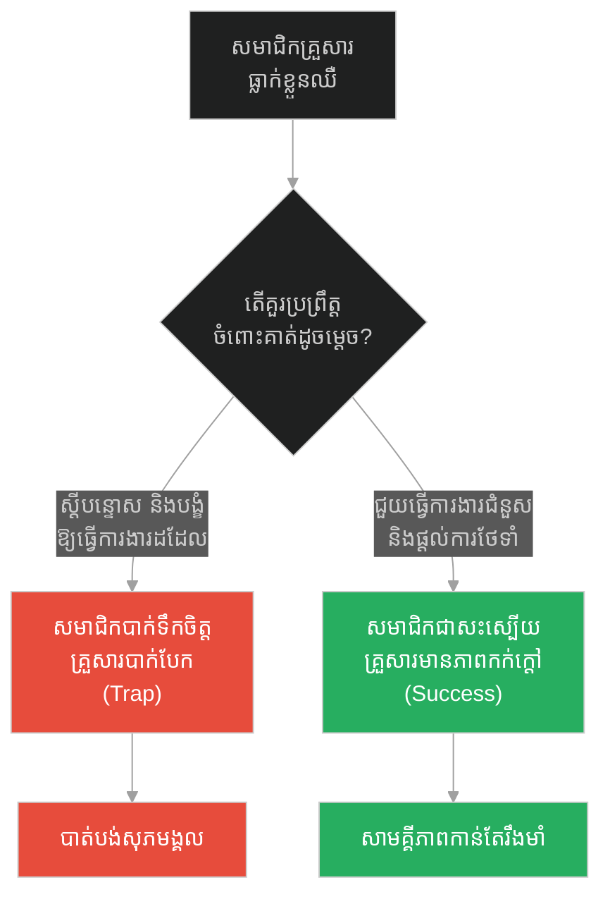
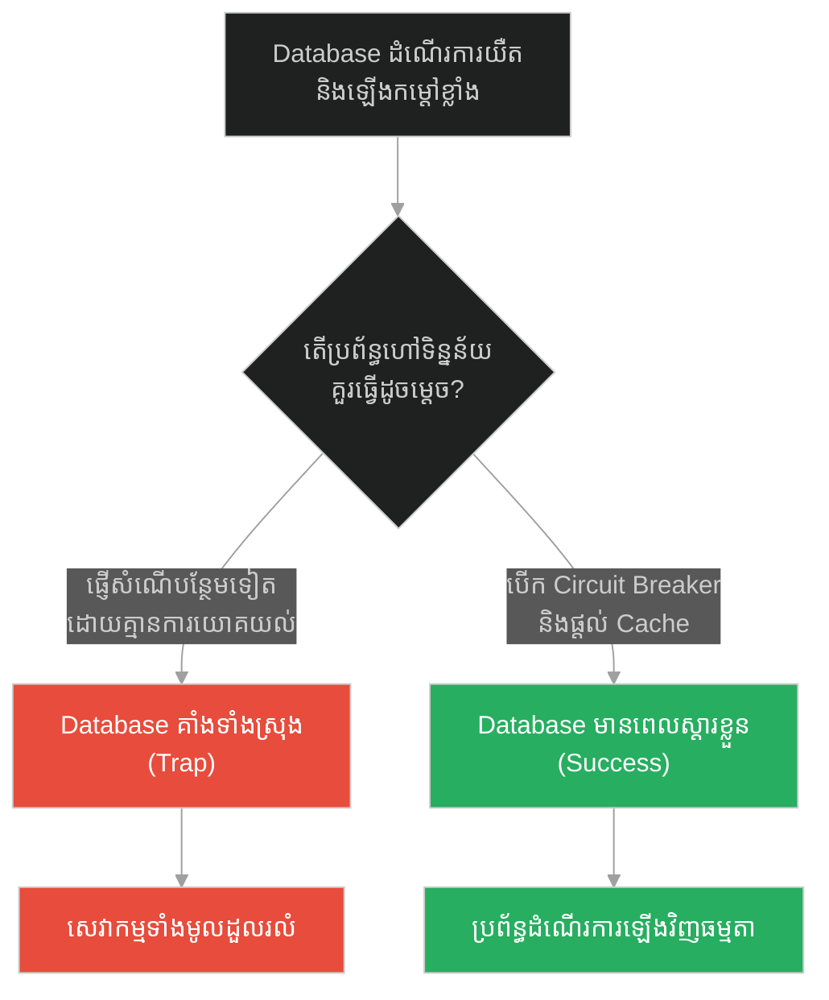
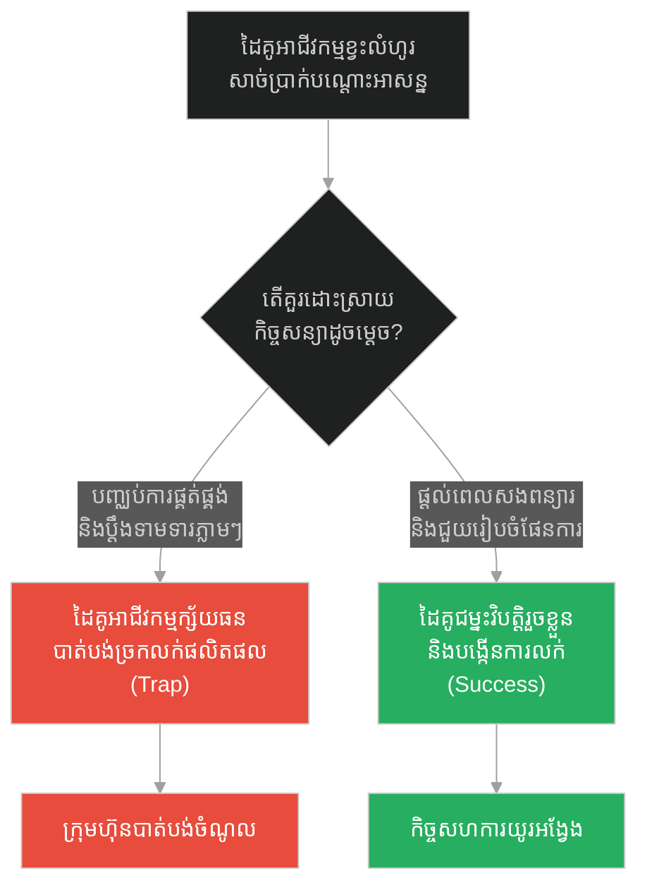
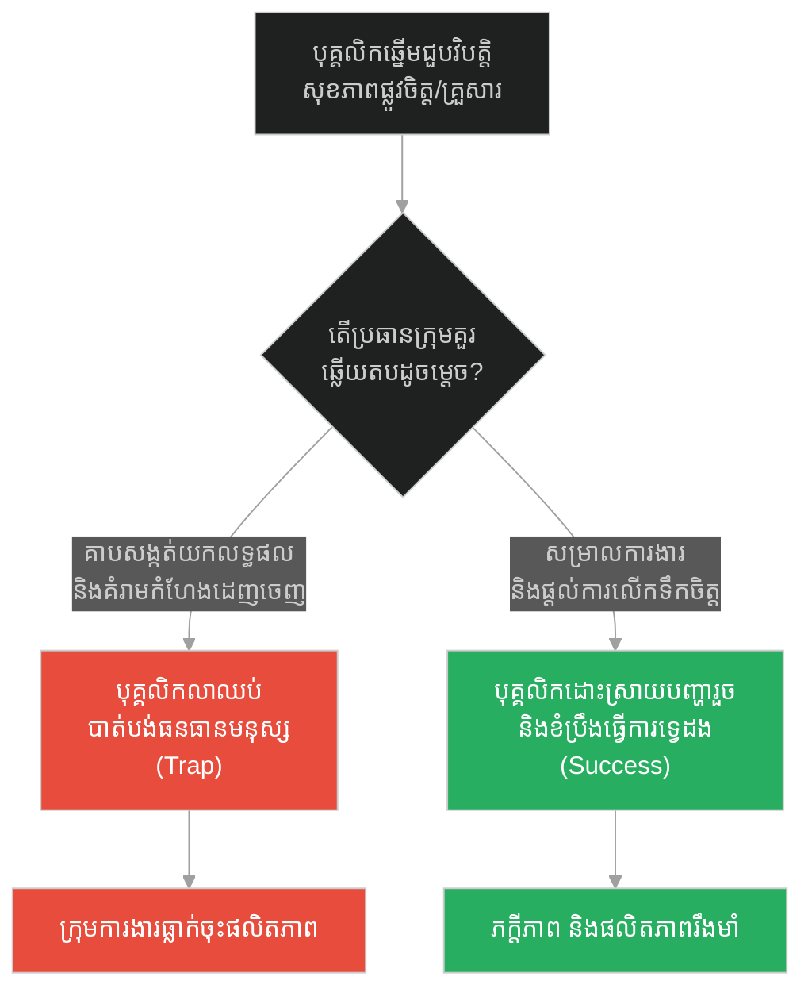
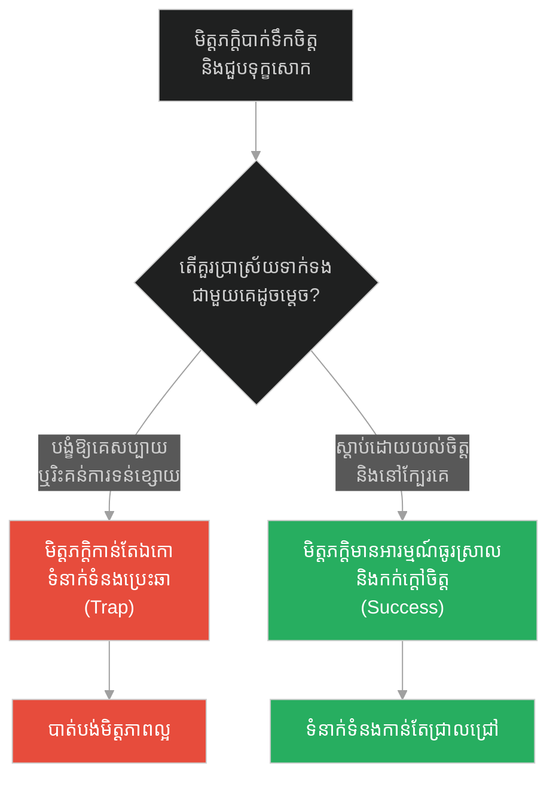
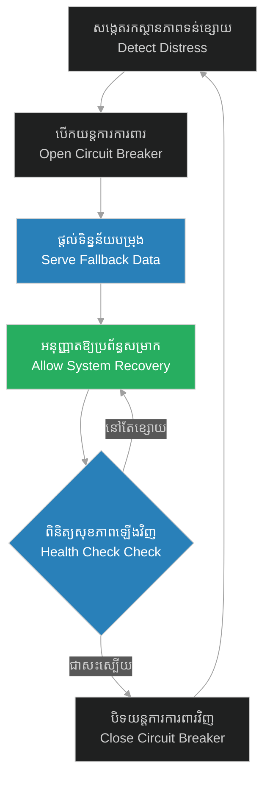

# Unconditional Service & Micro-service Empathy (ការបម្រើដោយគ្មានលក្ខខណ្ឌ និងការយល់ចិត្តគ្នារវាងសេវាកម្ម)៖ ឆ្កែស្រេកទឹក និងចិត្តធម៌ឥតព្រំដែន (Unconditional Service & Micro-service Empathy & Prophet and the Thirsty Dog)

**Author:** ichamrong  
**Date:** 2026-05-28  
**Tags:** #empathy #resilience #software-engineering #microservices #compassion #prophet-muhammad  
**Category:** Concepts  
**Read Time:** ~15 min  

---

## 📌 មាតិកា (Table of Contents)
- [អន្ទាក់ផ្លូវចិត្ត (The Trap)](#0)
- [១. រឿងព្រេងនិទាន៖ ឆ្កែស្រេកទឹក និងស្បែកជើងដួសទឹក (The Legend of the Thirsty Dog)](#1)
  - [សីលធម៌នៃការបម្រើឥតលក្ខខណ្ឌ (The Morality of Unconditional Service)](#1-1)
- [២. បញ្ហា៖ ការបម្រើដោយគ្មានលក្ខខណ្ឌ និងការយល់ចិត្តគ្នារវាងសេវាកម្ម (The Issue: Unconditional Service & Micro-service Empathy)](#2)
- [៣. ឧទាហមណ៍ជាក់ស្តែងក្នុងពិភពពិត (Real World Examples)](#3)
  - [ឧទាហរណ៍ទី ១ — កម្រិតស្រាល (គ្រួសារ)៖ ការគាំទ្រសមាជិកគ្រួសារពេលធ្លាក់ខ្លួនឈឺ (The Family Care)](#3-1)
  - [ឧទាហរណ៍ទី ២ — កម្រិតមធ្យម (បច្ចេកទេស)៖ ការប្រើប្រាស់ Circuit Breakers លើប្រព័ន្ធចុះខ្សោយ (The Tech Circuit Breaker)](#3-2)
  - [ឧទាហរណ៍ទី ៣ — កម្រិតមធ្យម (ធុរកិច្ច)៖ ការផ្តល់លក្ខខណ្ឌបត់បែនដល់ដៃគូអាជីវកម្មជួបវិបត្តិ (The Business Grace Period)](#3-3)
  - [ឧទាហរណ៍ទី ៤ — កម្រិតមធ្យម (សង្គម/គ្រប់គ្រង)៖ ការសម្រាលបន្ទុកបុគ្គលិកដែលមានបញ្ហាផ្ទាល់ខ្លួន (The Management Sick Leave)](#3-4)
  - [ឧទាហរណ៍ទី ៥ — កម្រិតធ្ងន់ (ទំនាក់ទំនង)៖ ការស្តាប់ដោយការយល់ចិត្តចំពោះមិត្តភក្តិដែលបាក់ទឹកចិត្ត (The Relationship Empathy)](#3-5)
- [៤. ដំណោះស្រាយទូទៅ៖ ការចាត់ចែងសេវាកម្មយោគយល់ និងការស្តារឡើងវិញ (The General Solution: Graceful Fallbacks)](#4)
- [សេចក្តីសន្និដ្ឋាន (Conclusion)](#5)
- [ឯកសារយោង (References)](#6)
- [Related Posts](#7)

---

<a id="0"></a>
## អន្ទាក់ផ្លូវចិត្ត (The Trap)

នៅពេលដែលប្រព័ន្ធ ឬបុគ្គលជុំវិញខ្លួនយើងជួបការលំបាក ឬមិនអាចផ្តល់ផលប្រយោជន៍អ្វីមកឱ្យយើងវិញ តើយើងគួរតែព្រងើយកន្តើយ ឬលូកដៃជួយដោយការយល់ចិត្តដើម្បីរក្សាស្ថិរភាពរួម?

* **ការទាមទារលក្ខខណ្ឌល្អឥតខ្ចោះ (The Transactional Trap)** — ការបម្រើ ឬធ្វើការងារតែនៅពេលណាដែលទទួលបានការឆ្លើយតបល្អ និងផលចំណេញភ្លាមៗ ដោយគ្មានការយោគយល់ចំពោះបញ្ហាចុះខ្សោយរបស់ដៃគូ ឬប្រព័ន្ធដទៃ។
* **ការបម្រើដោយការយល់ចិត្ត (Empathy-driven Service)** — ការសម្របសម្រួល និងការលះបង់ដើម្បីជួយសង្គ្រោះប្រព័ន្ធ ឬបុគ្គលដទៃដែលកំពុងចុះខ្សោយ (Degraded State) ដែលចុងក្រោយវាជួយការពារខ្សែសង្វាក់ទាំងមូលកុំឱ្យដួលរលំ។

រឿងរ៉ាវនៃ «ឆ្កែស្រេកទឹក» នឹងលាតត្រដាងនូវគំនិត **Micro-service Empathy (ការយល់ចិត្តគ្នារវាងសេវាកម្ម)** និង **Unconditional Service (ការបម្រើដោយគ្មានលក្ខខណ្ឌ)** ក្នុងប្រព័ន្ធស្មុគស្មាញ។

1. **រឿងព្រេងនិទាន (The Legend)** — ដំណើររឿងបុរសម្នាក់ដោះស្បែកជើងដួសទឹកពីអណ្តូងដ៏ជ្រៅឱ្យឆ្កែស្រេកទឹកជិតស្លាប់។
2. **បញ្ហា (The Issue)** — ការដួលរលំប្រព័ន្ធដោយសារគ្មានការយោគយល់ និងការដោះស្រាយកំហុសនៅពេល dependency ចុះខ្សោយ។
3. **ឧទាហមណ៍ជាក់ស្តែង (Real World Examples)** — ករណីសិក្សាទាំង ៥ កម្រិត ពីកម្រិតបុគ្គលរហូតដល់ប្រព័ន្ធបច្ចេកវិទ្យាធំៗ។
4. **ដំណោះស្រាយទូទៅ (The General Solution)** — ការបង្កើតយន្តការការពារ និងការផ្តល់សេវាកម្មបម្រុង (Fallback)។

---

<a id="1"></a>
## ១. រឿងព្រេងនិទាន៖ ឆ្កែស្រេកទឹក និងស្បែកជើងដួសទឹក (The Legend of the Thirsty Dog)

ព្យាការីម៉ូហាម៉ាត់ (Prophet Muhammad) បានបង្រៀនមេរៀនដ៏ជ្រាលជ្រៅមួយអំពីក្តីមេត្តាធម៌តាមរយៈរឿងរ៉ាវនៃបុរសម្នាក់ធ្វើដំណើរក្នុងវាលខ្សាច់៖

> *«មានបុរសម្នាក់កំពុងធ្វើដំណើរផ្លូវឆ្ងាយកាត់វាលខ្សាច់ដ៏ក្តៅហែង។ គាត់ស្រេកទឹកយ៉ាងខ្លាំង រហូតរកបានអណ្តូងទឹកមួយ។ គាត់ក៏ចុះទៅក្នុងអណ្តូងនោះ ផឹកទឹកទាល់តែឆ្អែត រួចក៏ឡើងមកលើវិញ។ នៅពេលឡើងមកដល់មាត់អណ្តូង គាត់បានឃើញសត្វឆ្កែមួយក្បាល កំពុងលៀនអណ្តាត លិទ្ធដីខ្សាច់សើមៗ ដោយសារតែវាស្រេកទឹកជិតដាច់ខ្យល់ស្លាប់ទៅហើយ។*
>
> *បុរសនោះគិតក្នុងចិត្តថា៖ "សត្វឆ្កែនេះ កំពុងតែស្រេកទឹកវេទនា ដូចជាខ្ញុំស្រេកទឹកអម្បាញ់មិញនេះដែរ!" គាត់ក៏សម្រេចចិត្តចុះទៅក្នុងអណ្តូងដ៏ជ្រៅនោះម្តងទៀត។ ដោយសារអណ្តូងគ្មានធុងយួរទឹក គាត់ក៏ដោះស្បែកជើងរបស់គាត់ ដួសទឹកឱ្យពេញ រួចខាំស្បែកជើងនោះនឹងមាត់ ដើម្បីតោងឡើងមកលើវិញ។ គាត់បានយកទឹកនោះ ទៅឱ្យសត្វឆ្កែនោះផឹក រហូតទាល់តែវាបាត់ស្រេក និងមានជីវិតឡើងវិញ។»* (សាហ៊ី អាល់ប៊ូខារី ២៤៦៦)

នៅពេលដែលសាវ័កសួរថា តើយើងនឹងទទួលបានបុណ្យរង្វាន់ចំពោះការធ្វើល្អលើសត្វដែរឬ? ព្យាការីបានឆ្លើយតបថា៖ *«មានរង្វាន់សម្រាប់រាល់ការធ្វើល្អចំពោះគ្រប់ភាវៈមានជីវិតទាំងអស់។»*

<a id="1-1"></a>
### សីលធម៌នៃការបម្រើឥតលក្ខខណ្ឌ (The Morality of Unconditional Service)

សត្វឆ្កែគ្មានលទ្ធភាពសងគុណ ឬផ្តល់ប្រយោជន៍ហិរញ្ញវត្ថុអ្វីមកកាន់បុរសនោះឡើយ។ ការជួយសង្គ្រោះរបស់បុរសនោះ គឺមិនអាស្រ័យលើលក្ខខណ្ឌផលប្រយោជន៍តបស្នងឡើយ (Unconditional)។ ជាងនេះទៅទៀត ការដែលបុរសនោះដោះស្បែកជើងមកធ្វើជាធុងដួសទឹក និងប្រើប្រាស់មាត់ខាំដើម្បីតោងឡើងមកវិញ គឺឆ្លុះបញ្ចាំងពីការលះបង់ និងការយល់ចិត្តយ៉ាងជ្រាលជ្រៅ (Empathy) ដោយសារគាត់ទើបតែឆ្លងកាត់ការស្រេកទឹកបែបនោះដែរ។ ក្នុងវិស័យបច្ចេកវិទ្យា នេះគឺដូចជាសេវាកម្មមួយសុខចិត្តចំណាយធនធានបម្រុងដើម្បីជួយសង្គ្រោះ Client ដែលកំពុងតែទន់ខ្សោយ និងដាច់ខ្យល់ (Resource-starved Client)។

---

<a id="2"></a>
## ២. បញ្ហា៖ ការបម្រើដោយគ្មានលក្ខខណ្ឌ និងការយល់ចិត្តគ្នារវាងសេវាកម្ម (The Issue: Unconditional Service & Micro-service Empathy)

នៅក្នុងសេវាកម្មបែប Microservices ជាច្រើន ប្រព័ន្ធមួយតែងតែពឹងផ្អែកលើប្រព័ន្ធមួយទៀត (Dependencies)។ ប្រសិនបើសេវាកម្មចម្បង (Main Service) មិនមាន «ការយល់ចិត្ត» ឬយន្តការយោគយល់ (Empathy/Fallback) ចំពោះសេវាកម្មរងដែលកំពុងគាំង ឬដំណើរការយឺតទេ វានឹងព្យាយាមបន្តបញ្ជូនការងារទៅ ដែលធ្វើឱ្យសេវាកម្មរងនោះគាំងកាន់តែខ្លាំង រហូតទាញប្រព័ន្ធទាំងមូលឱ្យដួលរលំតាមគ្នា (Cascading Failure)។

ខាងក្រោមនេះជាការប្រៀបធៀបកូដរវាងការហៅទៅកាន់សេវាកម្មរងដោយគ្មានប្រព័ន្ធការពារ និងការហៅដោយការយល់ចិត្ត និងប្រើ Fallbacks៖

### ❌ ការអនុវត្តបែបផុយស្រួយ (Fragile Implementation)
ប្រព័ន្ធនឹងគាំង ឬផ្តល់កំហុសភ្លាមៗទៅកាន់អ្នកប្រើប្រាស់ ប្រសិនបើសេវាកម្មរងណែនាំផលិតផល (Recommendation Service) មិនអាចឆ្លើយតបបាន។

```python
# fragile_client.py
import requests

def get_user_homepage(user_id):
    # ទាញយកទិន្នន័យគណនី (ចម្បង)
    user_info = {"id": user_id, "name": "Sokha"}
    
    # ទាញយកទិន្នន័យណែនាំ (មិនសូវចាំបាច់) តែគ្មានការការពារ
    # ប្រសិនបើសេវាកម្ម Recommendation គាំង វានឹងបណ្តាលឱ្យទំព័រដើមទាំងមូលមើលមិនឃើញ
    recommendation_response = requests.get(f"http://api.internal/recommendations/{user_id}")
    recommendations = recommendation_response.json() # អាចនឹងគាំងត្រង់នេះ
    
    return {
        "user": user_info,
        "recommendations": recommendations
    }
```

###  ការអនុវត្តប្រកបដោយភាពធន់ (Resilient Implementation - Micro-service Empathy)
ប្រព័ន្ធយល់ថាទិន្នន័យណែនាំមិនមែនជាលក្ខខណ្ឌស្លាប់រស់ទេ ដូច្នេះវាផ្តល់ទិន្នន័យបម្រុង (Fallback/Graceful Degradation) ដើម្បីឱ្យអ្នកប្រើប្រាស់អាចមើលឃើញគណនីចម្បងបាន។

```python
# resilient_client.py
import requests
import logging

# កំណត់ទិន្នន័យបម្រុងទុកជាមុន (Fallback Data)
DEFAULT_RECOMMENDATIONS = [
    {"id": 101, "title": "វគ្គសិក្សាដំបូងអំពី Python (Default)"},
    {"id": 102, "title": "គំនិតរចនាប្រព័ន្ធធន់ (System Design)"}
]

def get_user_homepage_resilient(user_id):
    user_info = {"id": user_id, "name": "Sokha"}
    recommendations = []
    
    try:
        # កំណត់ Timeout ខ្លី ដើម្បីកុំឱ្យស្ទះដំណើរការអ្នកប្រើប្រាស់
        response = requests.get(
            f"http://api.internal/recommendations/{user_id}", 
            timeout=0.8
        )
        if response.status_code == 200:
            recommendations = response.json()
        else:
            # យោគយល់ចំពោះការឆ្លើយតបមិនប្រក្រតី
            recommendations = DEFAULT_RECOMMENDATIONS
    except Exception as e:
        # ការយល់ចិត្តគ្នាក្នុងប្រព័ន្ធ៖ ទោះបីសេវាកម្មរងគាំង ក៏មិនឱ្យប៉ះពាល់ដល់សេវាកម្មចម្បង
        logging.error(f"Recommendation Service ជួបបញ្ហា: {str(e)}. ប្រើប្រាស់ទិន្នន័យបម្រុង។")
        recommendations = DEFAULT_RECOMMENDATIONS
        
    return {
        "user": user_info,
        "recommendations": recommendations
    }
```

---

<a id="3"></a>
## ៣. ឧទាហមណ៍ជាក់ស្តែងក្នុងពិភពពិត (Real World Examples)

<a id="3-1"></a>
### ឧទាហរណ៍ទី ១ — កម្រិតស្រាល (គ្រួសារ)៖ ការគាំទ្រសមាជិកគ្រួសារពេលធ្លាក់ខ្លួនឈឺ (The Family Care)
នៅក្នុងគ្រួសារ ប្រសិនបើយើងមើលឃើញតែផលប្រយោជន៍ និងទាមទារឱ្យម្នាក់ៗត្រូវតែបំពេញកាតព្វកិច្ចល្អឥតខ្ចោះ នោះនៅពេលសមាជិកណាម្នាក់ធ្លាក់ខ្លួនឈឺ គ្រួសារនឹងបែកបាក់។ ការយល់ចិត្ត និងជួយបម្រើគ្នាដោយគ្មានលក្ខខណ្ឌក្នុងគ្រាលំបាក ជួយឱ្យគ្រួសារមានសេចក្តីសុខ និងលំនឹងឡើងវិញ។



---

<a id="3-2"></a>
### ឧទាហរណ៍ទី ២ — កម្រិតមធ្យម (បច្ចេកទេស)៖ ការប្រើប្រាស់ Circuit Breakers លើប្រព័ន្ធចុះខ្សោយ (The Tech Circuit Breaker)
នៅពេល Database ចាប់ផ្តើមដំណើរការយឺត (ស្រេកទឹកជិតស្លាប់) ការព្យាយាមផ្ញើសំណើថ្មីៗទៅបន្ថែម នឹងធ្វើឱ្យវាគាំងទាំងស្រុង។ ការប្រើប្រាស់ **Circuit Breaker** ដើម្បីកាត់ផ្តាច់សំណើមួយរយៈពេល គឺប្រៀបដូចជាការរក្សាទុកថាមពលឱ្យវាដកដង្ហើម និងស្តារខ្លួនឡើងវិញ។



---

<a id="3-3"></a>
### ឧទាហរណ៍ទី ៣ — កម្រិតមធ្យម (ធុរកិច្ច)៖ ការផ្តល់លក្ខខណ្ឌបត់បែនដល់ដៃគូអាជីវកម្មជួបវិបត្តិ (The Business Grace Period)
ក្រុមហ៊ុនលក់ដុំដែលតឹងរ៉ឹងខ្លាំងជាមួយដៃគូទិញបន្ត មិនព្រមពន្យារពេលទូទាត់ប្រាក់ទោះបីជាដៃគូនោះកំពុងជួបបញ្ហាលំហូរទឹកប្រាក់បណ្តោះអាសន្នក៏ដោយ នឹងធ្វើឱ្យដៃគូនោះក្ស័យធន។ ការអនុវត្តលក្ខខណ្ឌបត់បែន (Grace Period) ជួយរក្សាខ្សែសង្វាក់លក់ និងបង្កើតភក្តីភាពយូរអង្វែង។



---

<a id="3-4"></a>
### ឧទាហរណ៍ទី ៤ — កម្រិតមធ្យម (សង្គម/គ្រប់គ្រង)៖ ការសម្រាលបន្ទុកបុគ្គលិកដែលមានបញ្ហាផ្ទាល់ខ្លួន (The Management Sick Leave)
ប្រធានក្រុមការងារដែលយកតែលទ្ធផលការងារ (Transactional Management) ដោយមិនខ្វល់ពីបញ្ហាគ្រួសារ ឬសុខភាពរបស់បុគ្គលិក នឹងធ្វើឱ្យបុគ្គលិកបាក់កម្លាំងចិត្ត និងលាឈប់។ ការយល់ចិត្ត និងសម្រាលបន្ទុកការងារបណ្តោះអាសន្ន ជួយរក្សាបុគ្គលិកពូកែៗឱ្យនៅជាមួយក្រុមហ៊ុន។



---

<a id="3-5"></a>
### ឧទាហរណ៍ទី ៥ — កម្រិតធ្ងន់ (ទំនាក់ទំនង)៖ ការស្តាប់ដោយការយល់ចិត្តចំពោះមិត្តភក្តិដែលបាក់ទឹកចិត្ត (The Relationship Empathy)
នៅពេលមិត្តភក្តិម្នាក់កំពុងស្ថិតក្នុងភាពទុក្ខសោកយ៉ាងធ្ងន់ធ្ងរ (ស្រេកទឹកចិត្តគំនិត) ប្រសិនបើយើងព្យាយាមទាមទារឱ្យគេត្រូវតែរីករាយ ឬផ្តល់ដំបូន្មានបែបគំរាមកំហែង នោះទំនាក់ទំនងនឹងត្រូវដាច់។ ការអង្គុយស្តាប់ដោយស្ងៀមស្ងាត់ និងបង្ហាញការយល់ចិត្ត គឺជាថ្នាំព្យាបាលដ៏ល្អបំផុត។



---

<a id="4"></a>
## ៤. ដំណោះស្រាយទូទៅ៖ ការចាត់ចែងសេវាកម្មយោគយល់ និងការស្តារឡើងវិញ (The General Solution: Graceful Fallbacks)

ដើម្បីកសាងប្រព័ន្ធ ឬទំនាក់ទំនងដែលពោរពេញដោយការយល់ចិត្ត និងភាពធន់ យើងត្រូវអនុវត្តវិធីសាស្ត្រ **Empathy Loop** ដូចខាងក្រោម៖

1. **វាស់ស្ទង់ស្ថានភាពទន់ខ្សោយ (Detect Distress State)** — តាមដានសញ្ញានៃការចុះខ្សោយរបស់ដៃគូ ឬប្រព័ន្ធរង (ដូចជា Timeout, Errors ឬសញ្ញាធ្លាក់ទឹកចិត្ត)។
2. **កាត់បន្ថយសម្ពាធជាបណ្តោះអាសន្ន (Relieve Load)** — បញ្ឈប់ការបញ្ជូនការងារធ្ងន់ៗ ឬការទាមទារដ៏តឹងរ៉ឹងភ្លាមៗ ដើម្បីកុំឱ្យធនធានបន្តបាត់បង់។
3. **ផ្តល់សេវាកម្មបម្រុង (Apply Fallback/Alternative)** — ប្រើប្រាស់ជម្រើសផ្សេងជំនួសឱ្យការទាមទារចម្បង ដូចជាការប្រើទិន្នន័យចាស់ (Stale Cache) ឬការងារងាយៗ។
4. **គាំទ្រការស្តារឡើងវិញ (Facilitate Recovery)** — នៅពេលស្ថានភាពធូរស្រាល ទើបចាប់ផ្តើមដំណើរការការងារពេញលេញឡើងវិញជាលំដាប់។



---

## 🐇 ធ្លាក់ចូលក្នុងរន្ធទន្សាយ (Enter the Rabbit Hole)
ដើម្បីយល់ដឹងពីរបៀបដោះស្រាយស្ថានភាពជម្លោះ និងកំហុសឆ្គងដោយស្ងប់ស្ងាត់ និងសន្តិវិធី សូមបន្តដំណើរទៅកាន់ប្រធានបទបន្ទាប់៖

* 🚀 **[ចាប់ផ្តើមដំណើររុករក (Start the Journey) ➔ De-escalation & Silent Exception Handling៖ ស្ត្រីចំណាស់បោះសំរាម និងអត់ឱនដ៏ឧត្តុង្គឧត្តម](./202-prophet-and-the-old-woman-with-trash.md)**

---

<a id="5"></a>
## សេចក្តីសន្និដ្ឋាន (Conclusion)

> **«កម្លាំងពិតប្រាកដនៃប្រព័ន្ធមួយ មិនមែនវាស់វែងត្រង់ល្បឿនរបស់វាពេលគ្រប់យ៉ាងល្អឥតខ្ចោះនោះទេ ប៉ុន្តែវាស់វែងត្រង់សមត្ថភាពយោគយល់ និងការរក្សាស្ថិរភាពរួមក្នុងគ្រាមានអាសន្ន»**

ការដោះស្បែកជើងដួសទឹកឱ្យសត្វឆ្កែស្រេកទឹក បង្រៀនយើងថា ការលះបង់ចំណែកខ្លះ និងការយល់ចិត្តគ្នាក្នុងគ្រាលំបាក គឺជារឿងសំខាន់បំផុតសម្រាប់និរន្តរភាពរួម។ នៅក្នុងស្ថាបត្យកម្មប្រព័ន្ធ និងការរស់នៅ ការចេះសម្របសម្រួល និងការផ្តល់ Fallbacks មិនមែនជាការចុះចាញ់នោះទេ ប៉ុន្តែវាជាសីលធម៌នៃការបម្រើ និងជាស្ពាននាំទៅរកជោគជ័យយូរអង្វែង។

---

<a id="6"></a>
## ឯកសារយោង (References)

* **Sahih al-Bukhari Hadith 2466** — *The Parable of the Man and the Thirsty Dog* (Book of Oppressions).
* **Michael T. Nygard** — *Release It!: Design and Deploy Production-Ready Software* (2018). Chapter on Stability Patterns (Circuit Breakers & Handshaking).
* **Daniel Goleman** — *Social Intelligence: The New Science of Human Relationships* (2006). Explores the biological and psychological basis of empathy.

---

<a id="7"></a>
## Related Posts

* [Rate Limiting & Admission Control (ការកម្រិតល្បឿន និងការគ្រប់គ្រងការចូលប្រើប្រាស់)៖ ទ្វារចង្អៀត និងការជ្រើសរើសចរាចរណ៍សំណើ](./200-jesus-and-the-narrow-door.md)
* [De-escalation & Silent Exception Handling (ការសម្រកកម្តៅជម្លោះ និងការដោះស្រាយកំហុសដោយស្ងប់ស្ងាត់)៖ ស្ត្រីចំណាស់បោះសំរាម និងអត់ឱនដ៏ឧត្តុង្គឧត្តម](./202-prophet-and-the-old-woman-with-trash.md)
