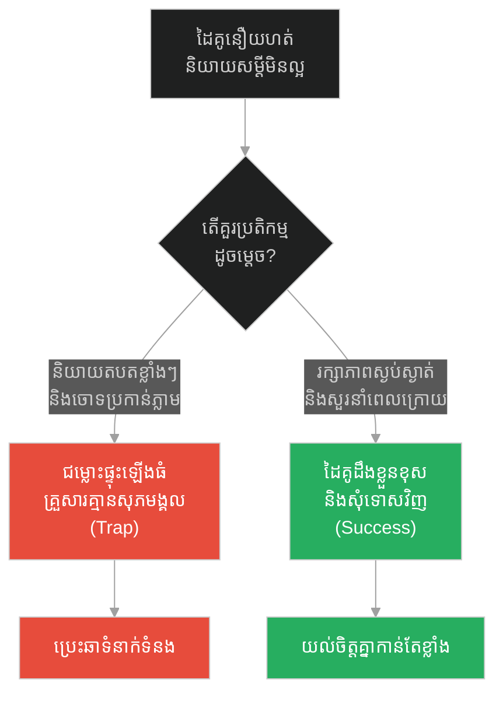
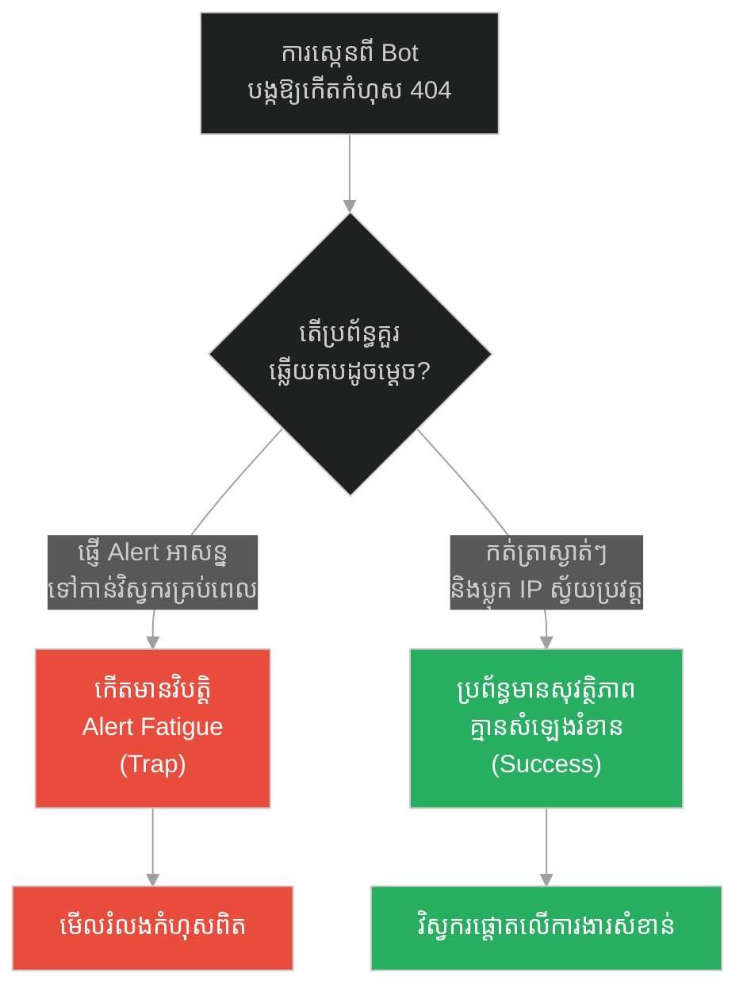
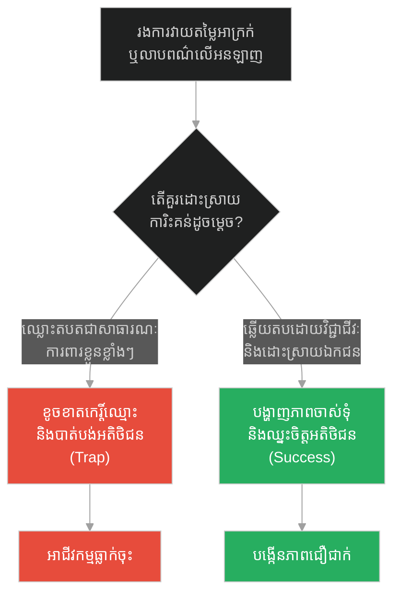
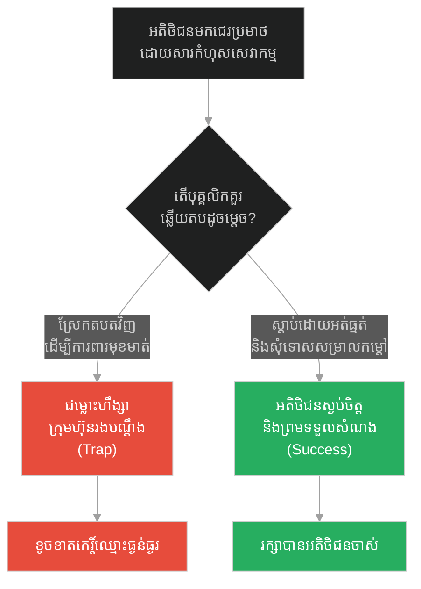
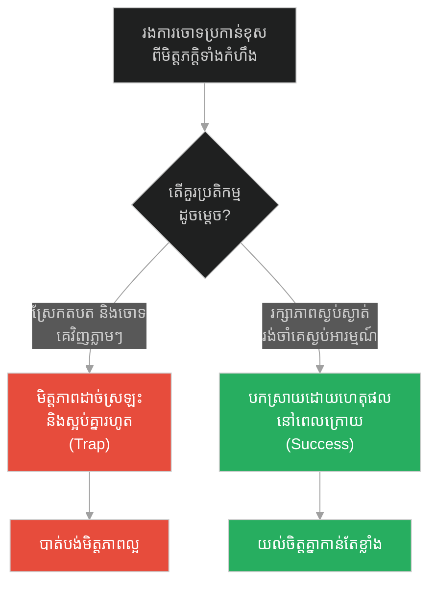
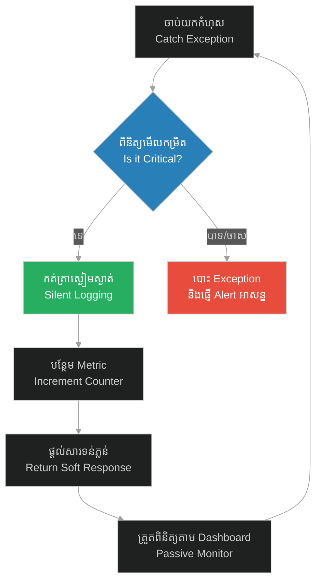

# De-escalation & Silent Exception Handling (ការសម្រកកម្តៅជម្លោះ និងការដោះស្រាយកំហុសដោយស្ងប់ស្ងាត់)៖ ស្ត្រីចំណាស់បោះសំរាម និងអត់ឱនដ៏ឧត្តុង្គឧត្តម (De-escalation & Silent Exception Handling & Prophet and the Old Woman with Trash)

**Author:** ichamrong  
**Date:** 2026-05-28  
**Tags:** #de-escalation #exception-handling #emotional-intelligence #system-design #software-engineering #tolerance  
**Category:** Concepts  
**Read Time:** ~15 min  

---

## 📌 មាតិកា (Table of Contents)
- [អន្ទាក់ផ្លូវចិត្ត (The Trap)](#0)
- [១. រឿងព្រេងនិទាន៖ ស្ត្រីចំណាស់បោះសំរាម (The Legend of the Old Woman and the Trash)](#1)
  - [អំណាចនៃភាពអត់ធ្មត់ និងការលះបង់កំហឹង (The Power of Forbearance)](#1-1)
- [២. បញ្ហា៖ ការសម្រកកម្តៅជម្លោះ និងការដោះស្រាយកំហុសដោយស្ងប់ស្ងាត់ (The Issue: De-escalation & Silent Exception Handling)](#2)
- [៣. ឧទាហមណ៍ជាក់ស្តែងក្នុងពិភពពិត (Real World Examples)](#3)
  - [ឧទាហរណ៍ទី ១ — កម្រិតស្រាល (គ្រួសារ)៖ ការដោះស្រាយជម្លោះពាក្យសម្តីរវាងប្តីប្រពន្ធ (The Family Spat)](#3-1)
  - [ឧទាហរណ៍ទី ២ — កម្រិតមធ្យម (បច្ចេកទេស)៖ ការគ្រប់គ្រង 404 Scans និង Web Crawler Errors (The Tech Crawler Noise)](#3-2)
  - [ឧទាហរណ៍ទី ៣ — កម្រិតមធ្យម (ធុរកិច្ច)៖ ការឆ្លើយតបនឹងការវាយប្រហារព័ត៌មានពីគូប្រជែង (The Business Negative Review)](#3-3)
  - [ឧទាហរណ៍ទី ៤ — កម្រិតមធ្យម (សង្គម/គ្រប់គ្រង)៖ ការគ្រប់គ្រងអតិថិជនដែលមានកំហឹងខ្លាំង (The Management Angry Customer)](#3-4)
  - [ឧទាហរណ៍ទី ៥ — កម្រិតធ្ងន់ (ទំនាក់ទំនង)៖ ការរក្សាភាពស្ងប់ស្ងាត់នៅពេលរងការចោទប្រកាន់ខុស (The Relationship Accusation)](#3-5)
- [៤. ដំណោះស្រាយទូទៅ៖ ការកត់ត្រាកម្រិតកំហុស និងការសម្រាលសម្ពាធ (The General Solution: Error Severity & Silent Mitigation)](#4)
- [សេចក្តីសន្និដ្ឋាន (Conclusion)](#5)
- [ឯកសារយោង (References)](#6)
- [Related Posts](#7)

---

<a id="0"></a>
## អន្ទាក់ផ្លូវចិត្ត (The Trap)

នៅពេលដែលប្រព័ន្ធ ឬជីវិតរបស់យើងជួបនឹងការវាយប្រហារ កំហុស ឬចរាចរណ៍ដែលបង្កបញ្ហា (Noise/Trash) តើយើងគួរតែប្រតិកម្មតបតវិញខ្លាំងៗដើម្បីការពារខ្លួន ឬដោះស្រាយវាដោយស្ងៀមស្ងាត់ និងកាត់បន្ថយកម្តៅភ្លាមៗ?

* **ការឆ្លើយតបតតាំងខ្លាំងក្លា (The Reactive Trap)** — ការបង្កើតការប្រកាសអាសន្ន ឬការប្រតិកម្មខ្លាំងៗចំពោះគ្រប់រឿងតូចតាច ដែលនាំឱ្យកើតមានការនឿយណាយនឹងការព្រមាន (Alert Fatigue) ឬធ្វើឱ្យជម្លោះកាន់តែរីករាលដាល។
* **ការដោះស្រាយដោយស្ងប់ស្ងាត់ (The De-escalation Strategy)** — ការបំប្លែងកំហុសឱ្យទៅជាដំណើរការធម្មតា ការចម្រោះសំឡេងរំខានចោល និងការជួយសង្គ្រោះប្រភពបង្កបញ្ហាដោយសន្តិវិធី ដើម្បីរក្សាបាននូវស្ថិរភាពយូរអង្វែង។

រឿងរ៉ាវនៃ «ស្ត្រីចំណាស់បោះសំរាម» នឹងបង្ហាញយើងពីយុទ្ធសាស្ត្រ **De-escalation (ការសម្រកកម្តៅជម្លោះ)** និង **Silent Exception Handling (ការដោះស្រាយកំហុសដោយស្ងប់ស្ងាត់)** នៅក្នុងរចនាសម្ព័ន្ធជីវិត និងបច្ចេកវិទ្យា។

1. **រឿងព្រេងនិទាន (The Legend)** — ព្យាការីម៉ូហាម៉ាត់ឆ្លើយតបនឹងស្ត្រីចំណាស់ដែលបោះសំរាមដាក់ខ្លួនរាល់ថ្ងៃ ដោយក្តីមេត្តានិងការសួរសុខទុក្ខពេលនាងឈឺ។
2. **បញ្ហា (The Issue)** — ការខាតបង់ធនធាន និងពេលវេលាដោយសារការប្រតិកម្មតបតនឹងកំហុសដែលមិនមានគ្រោះថ្នាក់ (Non-critical Exceptions)។
3. **ឧទាហមណ៍ជាក់ស្តែង (Real World Examples)** — ករណីសិក្សាទាំង ៥ កម្រិត ពីជីវិតគ្រួសាររហូតដល់ប្រព័ន្ធព័ត៌មានវិទ្យា។
4. **ដំណោះស្រាយទូទៅ (The General Solution)** — ការអនុវត្តយន្តការបែងចែកកម្រិតកំហុស និងការដោះស្រាយដោយគ្មានសំឡេងរំខាន។

---

<a id="1"></a>
## ១. រឿងព្រេងនិទាន៖ ស្ត្រីចំណាស់បោះសំរាម (The Legend of the Old Woman and the Trash)

នៅក្នុងសម័យដើមនៃសាសនាឥស្លាម ព្យាការីម៉ូហាម៉ាត់បានជួបប្រទះការជំទាស់ និងការធ្វើទុក្ខបុកម្នេញជាច្រើនពីសំណាក់អ្នកដែលមិនយល់ស្របនឹងការបង្រៀនរបស់លោក។ ក្នុងចំណោមនោះ មានរឿងនិទានដ៏ល្បីល្បាញមួយអំពីស្ត្រីចំណាស់ម្នាក់៖

> *«ស្ត្រីចំណាស់ម្នាក់រស់នៅតាមផ្លូវដែលព្យាការីម៉ូហាម៉ាត់តែងតែដើរទៅវិហារជារៀងរាល់ថ្ងៃ។ ដោយសារតែចិត្តស្អប់ និងចង់ធ្វើបាបលោក នាងតែងតែរង់ចាំនៅលើដំបូលផ្ទះ ហើយបោះសម្រាម ធូលីដី និងកាកសំណល់ស្មោកគ្រោកមកលើក្បាលរបស់លោក។ ទោះបីជាត្រូវរងការប្រមាថបែបនេះរាល់ថ្ងៃក៏ដោយ លោកមិនដែលខឹង មិនដែលស្រែកគំរាម ឬសងសឹកឡើយ។ លោកគ្រាន់តែជូតសម្អាតខ្លួនយ៉ាងស្ងៀមស្ងាត់ រួចបន្តដំណើរទៅមុខ។*
>
> *ថ្ងៃមួយ នៅពេលលោកដើរកាត់ផ្លូវនោះ បែរជាគ្មានសម្រាមធ្លាក់មកលើខ្លួនឡើយ។ ថ្ងៃបន្ទាប់ក៏នៅតែស្ងាត់។ លោកមានការបារម្ភ ហើយក៏បានសាកសួរអ្នកជិតខាង រហូតដឹងថានាងកំពុងឈឺធ្ងន់ និងនៅម្នាក់ឯង។ លោកក៏បានចូលទៅសួរសុខទុក្ខដល់ក្នុងបន្ទប់ ជួយសម្អាតផ្ទះ និងថែទាំនាងយ៉ាងទន់ភ្លន់។ ស្ត្រីចំណាស់នោះមានការភ្ញាក់ផ្អើល និងមានវិប្បដិសារីយ៉ាងខ្លាំង រហូតផ្លាស់ប្តូរចិត្តស្អប់មកជាក្តីគោរពស្រលាញ់ចំពោះលោកវិញ។»*

<a id="1-1"></a>
### អំណាចនៃភាពអត់ធ្មត់ និងការលះបង់កំហឹង (The Power of Forbearance)

ការដែលព្យាការីមិនតបតនឹងសម្រាមរបស់ស្ត្រីចំណាស់ មិនមែនមកពីលោកគ្មានអំណាច ឬខ្លាចនាងនោះទេ ប៉ុន្តែជាការអនុវត្ត **Forbearance (ការអត់ធ្មត់ខ្ពស់បំផុត)**។ លោកដឹងថាកំហឹងរបស់នាងគឺដូចជា «សម្រាមផ្លូវចិត្ត»។ ប្រសិនបើលោកខឹងតបត នោះមានន័យថាលោកបានអនុញ្ញាតឱ្យសម្រាមនោះចូលមកក្នុងចិត្តរបស់លោក ហើយបង្កើតជាជម្លោះកាន់តែធំ។ ការដោះស្រាយដោយស្ងប់ស្ងាត់ (De-escalation) និងការសួរសុខទុក្ខនៅពេលនាងធ្លាក់ខ្លួនឈឺ គឺជាយន្តការលុបបំបាត់បញ្ហាចំគោលដៅ ដោយបំប្លែងសត្រូវឱ្យទៅជាមិត្ត។

---

<a id="2"></a>
## ២. បញ្ហា៖ ការសម្រកកម្តៅជម្លោះ និងការដោះស្រាយកំហុសដោយស្ងប់ស្ងាត់ (The Issue: De-escalation & Silent Exception Handling)

នៅក្នុងវិស្វកម្មកម្មវិធី កំហុស (Exceptions) តែងតែកើតមានឡើងជានិច្ច ដូចជា Input Validation មិនត្រឹមត្រូវ សំណើពី Web Crawlers ស្វែងរកទំព័រដែលមិនមាន (404) ឬបញ្ហាបណ្តាញមួយរំពេច។ ប្រសិនបើប្រព័ន្ធកំណត់ឱ្យគ្រប់កំហុសទាំងអស់ត្រូវបោះ Exception ធំៗ ផ្ញើសារប្រកាសអាសន្នទៅ Slack ឬ Email របស់ក្រុមការងារ (Alert Storms) នោះក្រុមវិស្វករនឹងជួបវិបត្តិ **Alert Fatigue**។ ពួកគេនឹងលែងខ្វល់ពីការព្រមាន ព្រោះវាលោតញឹកញាប់ពេក រហូតមើលរំលងកំហុសពិតប្រាកដដែលបំផ្លាញប្រព័ន្ធ។

ខាងក្រោមនេះជាកូដប្រៀបធៀបរវាងការដោះស្រាយកំហុសបែបប្រតិកម្មខ្លាំង (Fragile) និងការដោះស្រាយបែបស្ងប់ស្ងាត់ (Resilient)៖

### ❌ ការអនុវត្តបែបផុយស្រួយ (Fragile Implementation)
ប្រព័ន្ធប្រតិកម្មខ្លាំងពេកចំពោះកំហុសកម្រិតស្រាល ដោយផ្ញើសារអាសន្នរាល់ពេលដែលមានបញ្ហាបញ្ជាក់ទិន្នន័យ (Validation Error) ពីអ្នកប្រើប្រាស់។

```python
# fragile_app.py
def process_user_age(age_str):
    try:
        age = int(age_str)
        if age < 0 or age > 120:
            raise ValueError("អាយុមិនសមហេតុផល")
        return {"status": "success", "age": age}
    except Exception as e:
        # ប្រតិកម្មខ្លាំងពេក៖ ផ្ញើ Slack Alert អាសន្នរាល់ពេលអ្នកប្រើប្រាស់វាយលេខខុស
        send_urgent_slack_alert(f"CRITICAL: User input error: {str(e)}")
        # បោះ Exception ឡើងលើ ធ្វើឱ្យប្រព័ន្ធទាំងមូលមានសម្ពាធ
        raise e
```

###  ការអនុវត្តប្រកបដោយភាពធន់ (Resilient Implementation - Silent Handling)
ប្រព័ន្ធបែងចែកកម្រិតកំហុស និងដោះស្រាយដោយស្ងប់ស្ងាត់ (Silent Exception Handling) ដោយគ្រាន់តែរាយការណ៍សារណែនាំត្រឹមត្រូវ និងកត់ត្រាត្រឹមកម្រិត INFO/DEBUG សម្រាប់ត្រួតពិនិត្យ។

```python
# resilient_app.py
import logging

# កំណត់ Logging ឱ្យសមស្រប
logger = logging.getLogger("app")
logger.setLevel(logging.INFO)

def process_user_age_resilient(age_str):
    try:
        age = int(age_str)
        if age < 0 or age > 120:
            # កំហុសរបស់អ្នកប្រើប្រាស់ មិនមែនជាកំហុសប្រព័ន្ធទេ
            logger.info(f"User validation failed for input: {age_str}")
            increment_metric("validation.failed_age")
            return {
                "success": False, 
                "error": "សូមវាយបញ្ចូលអាយុចន្លោះពី 0 ដល់ 120 ឆ្នាំ។"
            }, 400
        return {"success": True, "age": age}, 200
    except ValueError:
        # ការដោះស្រាយកំហុសដោយស្ងប់ស្ងាត់ (Silent Exception Handling)
        logger.info(f"Non-integer value provided for age: {age_str}")
        increment_metric("validation.invalid_type")
        return {
            "success": False, 
            "error": "សូមបញ្ចូលជាលេខរៀងឡើងវិញ។"
        }, 400
```

---

<a id="3"></a>
## ៣. ឧទាហមណ៍ជាក់ស្តែងក្នុងពិភពពិត (Real World Examples)

<a id="3-1"></a>
### ឧទាហរណ៍ទី ១ — កម្រិតស្រាល (គ្រួសារ)៖ ការដោះស្រាយជម្លោះពាក្យសម្តីរវាងប្តីប្រពន្ធ (The Family Spat)
នៅពេលប្តី ឬប្រពន្ធមកពីធ្វើការនឿយហត់ ហើយនិយាយសម្តីមិនសមរម្យដាក់ដៃគូ ប្រសិនបើដៃគូម្នាក់ទៀតខឹងតបតភ្លាមៗ (Escalation) នោះជម្លោះនឹងផ្ទុះឡើងធំ។ ការដកដង្ហើមធំ រក្សាចិត្តស្ងប់ (De-escalation) និងរង់ចាំដោះស្រាយពេលស្ងប់ស្ងាត់ ជួយរក្សាស្ថិរភាពគ្រួសារ។



---

<a id="3-2"></a>
### ឧទាហរណ៍ទី ២ — កម្រិតមធ្យម (បច្ចេកទេស)៖ ការគ្រប់គ្រង 404 Scans និង Web Crawler Errors (The Tech Crawler Noise)
គេហទំព័រតែងតែរងការស្កេនពី Crawler ដើម្បីស្វែងរកចន្លោះប្រហោងសុវត្ថិភាព ដែលនាំឱ្យកើតមានកំហុស 404 រាប់ពាន់ដង។ ប្រសិនបើប្រព័ន្ធបង្កើត Alarm alerts រាល់ពេលមាន 404 នោះក្រុមការងារនឹងធុញទ្រាន់។ ការដោះស្រាយដោយស្ងប់ស្ងាត់ គឺកត់ត្រាក្នុង Log ធម្មតា និងរារាំង IP នោះដោយស្វ័យប្រវត្តិតាមរយៈ Firewall។



---

<a id="3-3"></a>
### ឧទាហរណ៍ទី ៣ — កម្រិតមធ្យម (ធុរកិច្ច)៖ ការឆ្លើយតបនឹងការវាយប្រហារព័ត៌មានពីគូប្រជែង (The Business Negative Review)
នៅពេលអាជីវកម្មរងការវាយតម្លៃអាក្រក់ ឬការចោទប្រកាន់មិនពិតនៅលើបណ្តាញសង្គម ប្រសិនបើម្ចាស់អាជីវកម្មប្រតិកម្មតបតទៅវិញដោយកំហឹង និងឈ្លោះប្រកែកជាសាធារណៈ នឹងធ្វើឱ្យខូចខាតកេរ្តិ៍ឈ្មោះ។ ការឆ្លើយតបដោយទន់ភ្លន់ វិជ្ជាជីវៈ និងសុំដោះស្រាយឯកជន ជួយបង្ហាញពីភាពចាស់ទុំរបស់ក្រុមហ៊ុន។



---

<a id="3-4"></a>
### ឧទាហរណ៍ទី ៤ — កម្រិតមធ្យម (សង្គម/គ្រប់គ្រង)៖ ការគ្រប់គ្រងអតិថិជនដែលមានកំហឹងខ្លាំង (The Management Angry Customer)
នៅក្នុងផ្នែកបំរើសេវាកម្មអតិថិជន ប្រសិនបើបុគ្គលិកឆ្លើយតបតទល់នឹងការជេរប្រមាថរបស់អតិថិជន នោះក្រុមហ៊ុននឹងត្រូវប្តឹង ឬខូចឈ្មោះ។ ការបណ្តុះបណ្តាលបុគ្គលិកឱ្យស្តាប់ដោយស្ងៀមស្ងាត់ ទទួលស្គាល់បញ្ហា និងសម្រាលកំហឹង (De-escalation) ជួយដោះស្រាយបញ្ហាបានលឿនបំផុត។



---

<a id="3-5"></a>
### ឧទាហរណ៍ទី ៥ — កម្រិតធ្ងន់ (ទំនាក់ទំនង)៖ ការរក្សាភាពស្ងប់ស្ងាត់នៅពេលរងការចោទប្រកាន់ខុស (The Relationship Accusation)
នៅពេលមិត្តជិតស្និទ្ធ ឬដៃគូជីវិតចោទប្រកាន់យើងខុសទាំងអារម្មណ៍ឆេវឆាវ ប្រសិនបើយើងព្យាយាមដោះស្រាយ និងពន្យល់ភ្លាមៗទាំងកំហឹង នឹងធ្វើឱ្យបញ្ហាកាន់តែស្មុគស្មាញ។ ការរក្សាភាពស្ងៀមស្ងាត់ ជួយជូតសម្អាតសម្រាមអារម្មណ៍ ហើយរង់ចាំពេលសមស្របដើម្បីជជែកវែកញែក ជួយការពារមិត្តភាពបាន។



---

<a id="4"></a>
## ៤. ដំណោះស្រាយទូទៅ៖ ការកត់ត្រាកម្រិតកំហុស និងការសម្រាលសម្ពាធ (The General Solution: Error Severity & Silent Mitigation)

ដើម្បីរចនាប្រព័ន្ធ ឬជីវិតដែលមានសមត្ថភាពដោះស្រាយកំហុសដោយស្ងប់ស្ងាត់ យើងត្រូវអនុវត្តយុទ្ធសាស្ត្រ **Silent Handling Loop** ដូចខាងក្រោម៖

1. **ចំណាត់ថ្នាក់កម្រិតកំហុស (Error Classification)** — បែងចែកឱ្យច្បាស់រវាងកំហុសកម្រិតស្រាល (User/Noise Error) និងកំហុសកម្រិតធ្ងន់ (System/Critical Error)។
2. **ចម្រោះសំឡេងរំខាន (Filter Noise)** — កុំបោះ Exception ឬប្រកាសអាសន្នចំពោះកំហុសកម្រិតស្រាល។ ត្រូវកត់ត្រាស្ងៀមស្ងាត់ (Silent Logging) និងបន្ថែម Metric។
3. **សម្រកកម្តៅជម្លោះ (De-escalate Response)** — ផ្តល់នូវការឆ្លើយតបត្រឡប់ដែលទន់ភ្លន់ និងមានប្រយោជន៍ (Friendly User Message)។
4. **ត្រួតពិនិត្យដោយប្រយោល (Passive Monitoring)** — វិភាគនិន្នាការតាមរយៈ Dashboards ជំនួសឱ្យការប្រើប្រាស់ការផ្ញើសាររំខានផ្ទាល់ខ្លួន។



---

## 🐇 ធ្លាក់ចូលក្នុងរន្ធទន្សាយ (Enter the Rabbit Hole)
ដើម្បីយល់ដឹងពីរបៀបការពារខ្លួនឱ្យបានម៉ត់ចត់បំផុត ដោយការផ្ទៀងផ្ទាត់ និងការរៀបចំយន្តការការពារច្រើនជាន់ សូមបន្តដំណើរទៅកាន់ប្រធានបទបន្ទាប់៖

* 🚀 **[ចាប់ផ្តើមដំណើររុករក (Start the Journey) ➔ Defense in Depth & Verification Checks៖ ជំនឿលើព្រះ និងការចងអូដ្ឋឱ្យជាប់](./203-prophet-and-the-tied-camel.md)**

---

<a id="5"></a>
## សេចក្តីសន្និដ្ឋាន (Conclusion)

> **«ភាពអត់ធ្មត់ មិនមែនជាការចុះចាញ់នោះទេ ប៉ុន្តែវាជាការគ្រប់គ្រងអារម្មណ៍មិនឱ្យធ្លាក់ចូលក្នុងអន្ទាក់ប្រតិកម្មរបស់សត្រូវ»**

ការជូតសម្រាមចេញពីខ្លួនដោយស្ងៀមស្ងាត់ និងការលាតដៃជួយសត្រូវក្នុងគ្រាលំបាករបស់ព្យាការី បង្រៀនយើងថា ការគ្រប់គ្រងអារម្មណ៍ និងការដោះស្រាយបញ្ហាដោយគ្មានការបង្កជម្លោះ គឺជាជម្រើសដ៏មានឥទ្ធិពលបំផុត។ នៅក្នុងការរចនាប្រព័ន្ធព័ត៌មានវិទ្យា និងការរស់នៅ ការចេះបំប្លែងកំហុសឱ្យទៅជាស្ថិរភាព និងការចៀសវាងការភ្ញាក់ផ្អើលឥតប្រយោជន៍ គឺជាគន្លឹះដើម្បីកសាងភាពធន់រឹងមាំពិតប្រាកដ។

---

<a id="6"></a>
## ឯកសារយោង (References)

* **Prophet's Forbearance (Hilm)** — *The Biography of Prophet Muhammad (Al-Sira al-Nabawiyya)*. Chapter on the trials in Mecca.
* **Daniel Goleman** — *Working with Emotional Intelligence* (1998). Explores the critical value of de-escalation in corporate management.
* **Robert C. Martin** — *Clean Code: A Handbook of Agile Software Craftsmanship* (2008). Chapter on Error Handling and logging practices.

---

<a id="7"></a>
## Related Posts

* [Unconditional Service & Micro-service Empathy (ការបម្រើដោយគ្មានលក្ខខណ្ឌ និងការយល់ចិត្តគ្នារវាងសេវាកម្ម)៖ ឆ្កែស្រេកទឹក និងចិត្តធម៌ឥតព្រំដែន](./201-prophet-and-the-thirsty-dog.md)
* [Defense in Depth & Verification Checks (ការការពារស៊ីជម្រៅច្រើនជាន់ និងការផ្ទៀងផ្ទាត់បញ្ជាក់)៖ ជំនឿលើព្រះ និងការចងអូដ្ឋឱ្យជាប់](./203-prophet-and-the-tied-camel.md)
