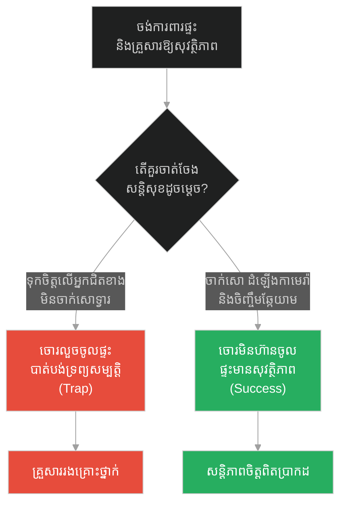
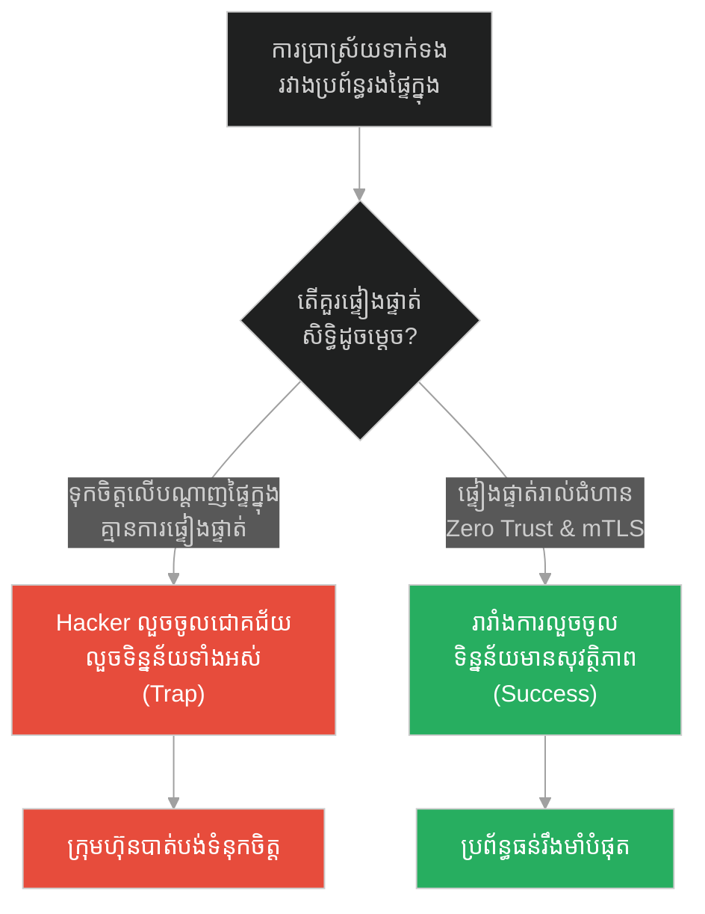
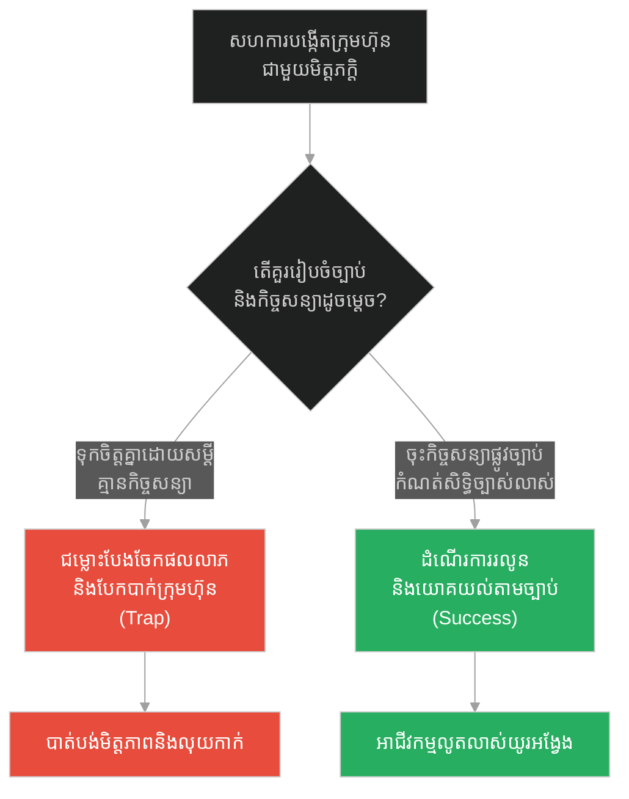
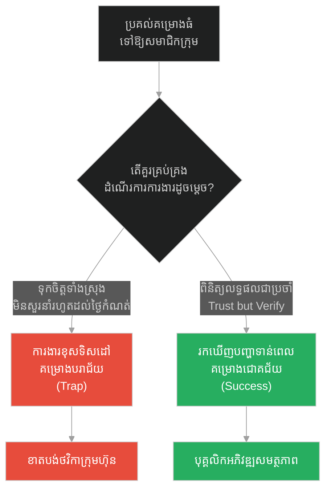
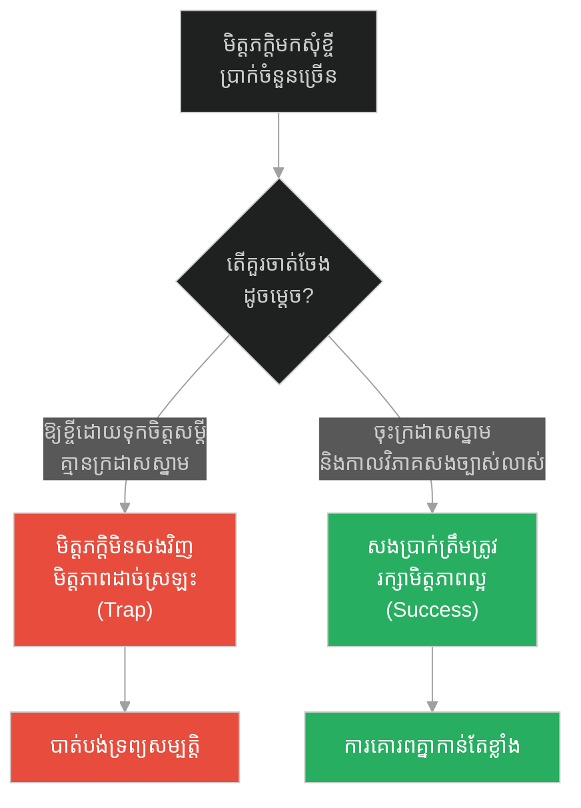
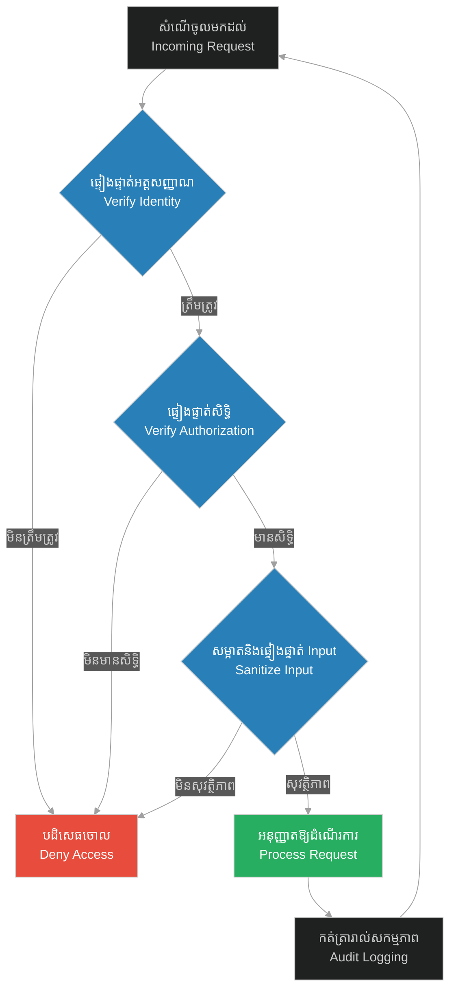

# Defense in Depth & Verification Checks (ការការពារស៊ីជម្រៅច្រើនជាន់ និងការផ្ទៀងផ្ទាត់បញ្ជាក់)៖ ជំនឿលើព្រះ និងការចងអូដ្ឋឱ្យជាប់ (Defense in Depth & Verification Checks & Prophet and the Tied Camel)

**Author:** ichamrong  
**Date:** 2026-05-28  
**Tags:** #defense-in-depth #verification #zero-trust #security #risk-management #prophet-muhammad  
**Category:** Concepts  
**Read Time:** ~15 min  

---

## 📌 មាតិកា (Table of Contents)
- [អន្ទាក់ផ្លូវចិត្ត (The Trap)](#0)
- [១. រឿងព្រេងនិទាន៖ ជំនឿលើព្រះ និងការចងអូដ្ឋឱ្យជាប់ (The Legend of the Untied Camel)](#1)
  - [ជំនឿលើព្រះ និងទំនួលខុសត្រូវផ្ទាល់ខ្លួន (Faith Coupled with Duty)](#1-1)
- [២. បញ្ហា៖ ការការពារស៊ីជម្រៅ និងការផ្ទៀងផ្ទាត់បញ្ជាក់ (The Issue: Defense in Depth & Verification Checks)](#2)
- [៣. ឧទាហមណ៍ជាក់ស្តែងក្នុងពិភពពិត (Real World Examples)](#3)
  - [ឧទាហរណ៍ទី ១ — កម្រិតស្រាល (គ្រួសារ)៖ សន្តិសុខសុវត្ថិភាពគេហដ្ឋាន (The Family Home Security)](#3-1)
  - [ឧទាហរណ៍ទី ២ — កម្រិតមធ្យម (បច្ចេកទេស)៖ ការអនុវត្ត Zero Trust លើប្រព័ន្ធបណ្តាញ (The Tech Zero Trust)](#3-2)
  - [ឧទាហរណ៍ទី ៣ — កម្រិតមធ្យម (ធុរកិច្ច)៖ កិច្ចព្រមព្រៀងសហការអាជីវកម្ម និងកិច្ចសន្យា (The Business Legal Contract)](#3-3)
  - [ឧទាហរណ៍ទី ៤ — កម្រិតមធ្យម (សង្គម/គ្រប់គ្រង)៖ ការត្រួតពិនិត្យការងាររបស់បុគ្គលិក (The Management Audit Check)](#3-4)
  - [ឧទាហរណ៍ទី ៥ — កម្រិតធ្ងន់ (ទំនាក់ទំនង)៖ ការផ្តល់ប្រាក់កម្ចីទៅឱ្យមិត្តភក្តិ ឬសាច់ញាតិ (The Relationship Loan Agreement)](#3-5)
- [៤. ដំណោះស្រាយទូទៅ៖ សន្តិសុខបែបសូន្យទំនុកចិត្ត និងការរៀបចំរបាំងការពារ (The General Solution: Zero Trust & Verification Loops)](#4)
- [សេចក្តីសន្និដ្ឋាន (Conclusion)](#5)
- [ឯកសារយោង (References)](#6)
- [Related Posts](#7)

---

<a id="0"></a>
## អន្ទាក់ផ្លូវចិត្ត (The Trap)

តើយើងគួរពឹងផ្អែកលើការជឿជាក់ថាក្រុមការងារ ប្រព័ន្ធ ឬបរិស្ថានជុំវិញខ្លួនមានសុវត្ថិភាពល្អរួចទៅហើយ (Implicit Trust) ឬត្រូវចាត់វិធានការការពារ និងផ្ទៀងផ្ទាត់គ្រប់ជំហានដើម្បីចៀសវាងហានិភ័យ?

* **ការជឿជាក់ដោយងងឹតងងុល (The Naive Trust Trap)** — ការសន្មត់ថាគ្មានបញ្ហាអាក្រក់កើតឡើងឡើយដោយសារតែយើងមានបំណងល្អ ឬទុកចិត្តលើកត្តាខាងក្រៅ ដោយមិនបានរៀបចំរបាំងការពារផ្ទាល់ខ្លួន។
* **ការទុកចិត្តដោយមានការផ្ទៀងផ្ទាត់ (Trust, But Verify)** — ការរក្សាទំនុកចិត្តខាងផ្លូវចិត្ត ប៉ុន្តែចាត់វិធានការការពារបច្ចេកទេស និងគតិយុត្តឱ្យបានម៉ត់ចត់ជាមុន ដើម្បីធានាសុវត្ថិភាព និងលំនឹងរឹងមាំបំផុត។

រឿងរ៉ាវនៃ «ការចងអូដ្ឋ» នឹងបកស្រាយពីគោលការណ៍ **Defense in Depth (ការការពារស៊ីជម្រៅច្រើនជាន់)** និង **Verification Checks (ការផ្ទៀងផ្ទាត់បញ្ជាក់)** ក្នុងការរចនាប្រព័ន្ធ និងការរស់នៅ។

1. **រឿងព្រេងនិទាន (The Legend)** — ព្យាការីម៉ូហាម៉ាត់ប្រដៅបេឌូអ៊ីនឱ្យចងអូដ្ឋរបស់ខ្លួនជាមុនសិន រួចសឹមទុកចិត្តលើព្រះជាម្ចាស់។
2. **បញ្ហា (The Issue)** — ការធ្វេសប្រហែសផ្នែកសុវត្ថិភាពដោយសារការទុកចិត្តលើប្រព័ន្ធបណ្តាញផ្ទៃក្នុង (Implicit Network Trust)។
3. **ឧទាហមណ៍ជាក់ស្តែង (Real World Examples)** — ការអនុវត្តសកម្មភាព ៥ កម្រិត ពីសុវត្ថិភាពផ្ទះសម្បែងរហូតដល់ប្រព័ន្ធព័ត៌មានវិទ្យា។
4. **ដំណោះស្រាយទូទៅ (The General Solution)** — ការកសាងរចនាសម្ព័ន្ធការពារច្រើនជាន់តាមបែប Zero Trust។

---

<a id="1"></a>
## ១. រឿងព្រេងនិទាន៖ ជំនឿលើព្រះ និងការចងអូដ្ឋឱ្យជាប់ (The Legend of the Untied Camel)

នៅក្នុងសម័យព្យាការីម៉ូហាម៉ាត់ មានរឿងនិទានដ៏ល្បីល្បាញមួយអំពីការយល់ច្រឡំលើសេចក្តីជំនឿ និងការទទួលខុសត្រូវ៖

> *«ថ្ងៃមួយ មានបុរសបេឌូអ៊ីន (អ្នករស់នៅវាលខ្សាច់) ម្នាក់បានជិះអូដ្ឋមកកាន់វិហាររបស់ព្យាការីដើម្បីចូលរួមអធិស្ឋាន។ លោកបានសង្កេតឃើញថា បុរសនោះបានចុះពីលើអូដ្ឋ ហើយដើរចូលមកក្នុងវិហារដោយទុកឱ្យសត្វអូដ្ឋនៅខាងក្រៅយ៉ាងសេរី ដោយមិនបានចងខ្សែវានឹងបង្គោលឡើយ។*
>
> *ព្យាការីម៉ូហាម៉ាត់បានសួរទៅគាត់ថា៖ "ហេតុអ្វីបានជាអ្នកមិនចងអូដ្ឋរបស់អ្នក?"*
>
> *បុរសនោះបានឆ្លើយតបយ៉ាងជឿជាក់ថា៖ "ខ្ញុំមិនបាច់ចងវាទេ ព្រោះខ្ញុំមានជំនឿទុកចិត្តលើព្រះជាម្ចាស់ (អល់ឡោះ) ថាទ្រង់នឹងការពារវាឱ្យខ្ញុំ។"*
>
> *ភ្លាមៗនោះ ព្យាការីម៉ូហាម៉ាត់បានកែតម្រូវការយល់ឃើញដ៏ខុសឆ្គងនេះ ដោយមានប្រសាសន៍ថា៖ **"ចូរចងអូដ្ឋរបស់អ្នកជាមុនសិន រួចសឹមទុកចិត្តលើព្រះជាម្ចាស់! (Tie your camel first, then put your trust in God!)"**»* (ចាមី អាត-ទើមីឌី ២៥១៧)

<a id="1-1"></a>
### ជំនឿលើព្រះ និងទំនួលខុសត្រូវផ្ទាល់ខ្លួន (Faith Coupled with Duty)

ពាក្យទូន្មានរបស់ព្យាការីម៉ូហាម៉ាត់បង្ហាញថា សេចក្តីជំនឿពិតប្រាកដ (Tawakkul) មិនមែនជាលេសសម្រាប់ភាពខ្ជិលច្រអូស ឬការព្រងើយកន្តើយចំពោះការងារដែលខ្លួនត្រូវធ្វើនោះទេ។ ព្រះជាម្ចាស់បានផ្តល់បញ្ញា កម្លាំងកាយ និងមធ្យោបាយដល់មនុស្សជាតិ។ ដូចនេះ មនុស្សត្រូវតែប្រើប្រាស់ធនធានទាំងនោះដើម្បីចាត់វិធានការការពារដែលសមស្របនឹងសមត្ថភាពផ្ទាល់ខ្លួនជាមុនសិន (ការចងអូដ្ឋ) រួចទើបទុកចិត្តលើការគ្រប់គ្រងរបស់ព្រះជាម្ចាស់។ ប្រសិនបើលែងអូដ្ឋចោលដោយមិនចង នោះគឺជាការល្ងង់ខ្លៅ និងការមិនទទួលខុសត្រូវ មិនមែនជាសេចក្តីជំនឿឡើយ។

---

<a id="2"></a>
## ២. បញ្ហា៖ ការការពារស៊ីជម្រៅ និងការផ្ទៀងផ្ទាត់បញ្ជាក់ (The Issue: Defense in Depth & Verification Checks)

នៅក្នុងសន្តិសុខព័ត៌មានវិទ្យា (Information Security) ការសន្មត់ថា «ប្រព័ន្ធបណ្តាញផ្ទៃក្នុង (Internal Network) គឺមានសុវត្ថិភាពរួចហើយ មិនបាច់ការពារខ្លាំងទេ» គឺជាការយល់ឃើញដ៏គ្រោះថ្នាក់បំផុត។ ប្រសិនបើ Hacker អាចជ្រៀតចូលមកក្នុងបណ្តាញផ្ទៃក្នុងបាន ពួកគេអាចកម្ទេចសេវាកម្មទាំងអស់យ៉ាងងាយស្រួល ព្រោះគ្មានការការពារនៅតាមផ្នែកនីមួយៗ (Implicit Trust Trap)។ គោលការណ៍ **Defense in Depth** ទាមទារឱ្យមានរបាំងការពារច្រើនជាន់ (Multi-layered Security) ដូចជា ការផ្ទៀងផ្ទាត់ទិន្នន័យ (Input Validation) ការផ្ទៀងផ្ទាត់សិទ្ធិ (Authentication/Authorization) និងការអ៊ិនគ្រីបទិន្នន័យ (Encryption) ទោះស្ថិតក្នុងបណ្តាញផ្ទៃក្នុងក៏ដោយ។

ខាងក្រោមនេះជាកូដប្រៀបធៀបរវាងការគ្រប់គ្រងឯកសារដែលជឿជាក់លើ Input ទាំងស្រុង និងការការពារម៉ត់ចត់ច្រើនជាន់៖

### ❌ ការអនុវត្តបែបផុយស្រួយ (Fragile Implementation)
ប្រព័ន្ធជឿជាក់លើឈ្មោះឯកសារដែលផ្ញើដោយអតិថិជនទាំងស្រុង ដែលងាយរងគ្រោះថ្នាក់ដោយ Path Traversal (ឧទាហរណ៍៖ `../../etc/passwd`)។

```python
# fragile_security.py
import os

def read_user_file_fragile(filename):
    # ជឿជាក់លើឈ្មោះឯកសាររបស់ Client (លែងអូដ្ឋចោលមិនចង)
    # ងាយរងការវាយប្រហារដើម្បីលួចមើលឯកសារសំខាន់ៗក្នុងម៉ាស៊ីន Server
    base_dir = "/var/www/uploads"
    file_path = os.path.join(base_dir, filename)
    
    with open(file_path, "r") as file:
        return file.read()
```

###  ការអនុវត្តប្រកបដោយភាពធន់ (Resilient Implementation - Defense in Depth)
ប្រព័ន្ធអនុវត្តការការពារច្រើនជាន់៖ សម្អាតឈ្មោះឯកសារ ផ្ទៀងផ្ទាត់ផ្លូវលទ្ធផល និងពិនិត្យអត្ថិភាពមុននឹងបើកឯកសារ។

```python
# resilient_security.py
import os

UPLOAD_DIR = os.path.abspath("/var/www/uploads")

def read_user_file_resilient(filename):
    # ១. ជាន់ទី១៖ ចម្រោះយកតែឈ្មោះឯកសារមូលដ្ឋាន ចៀសវាងសញ្ញា ../
    clean_filename = os.path.basename(filename)
    
    # ២. ជាន់ទី២៖ បង្កើតផ្លូវឯកសារដាច់ខាត (Absolute Path)
    target_path = os.path.abspath(os.path.join(UPLOAD_DIR, clean_filename))
    
    # ៣. ជាន់ទី៣៖ ផ្ទៀងផ្ទាត់ដែនកំណត់នៃផ្លូវឯកសារ (Boundary Check)
    if not target_path.startswith(UPLOAD_DIR):
        raise PermissionError("សុវត្ថិភាព៖ ការប៉ុនប៉ងទាញយកឯកសារក្រៅដែនកំណត់ត្រូវបានរារាំង!")
        
    # ៤. ជាន់ទី៤៖ ពិនិត្យអត្ថិភាពមុនដំណើរការ
    if not os.path.exists(target_path):
        raise FileNotFoundError("រកមិនឃើញឯកសារដែលបានស្នើសុំ។")
        
    with open(target_path, "r") as file:
        return file.read()
```

---

<a id="3"></a>
## ៣. ឧទាហមណ៍ជាក់ស្តែងក្នុងពិភពពិត (Real World Examples)

<a id="3-1"></a>
### ឧទាហរណ៍ទី ១ — កម្រិតស្រាល (គ្រួសារ)៖ សន្តិសុខសុវត្ថិភាពគេហដ្ឋាន (The Family Home Security)
ការជឿជាក់ថាសង្កាត់របស់យើងមានសុវត្ថិភាព ហើយមិនព្រមចាក់សោរទ្វារផ្ទះនៅពេលយប់ គឺជាការធ្វេសប្រហែស។ ការចាក់សោរទ្វារ របងរបារដែក និងការដំឡើងកាមេរ៉ាសុវត្ថិភាព គឺជាការការពារស៊ីជម្រៅដើម្បីការពារសមាជិកគ្រួសារ និងទ្រព្យសម្បត្តិ។



---

<a id="3-2"></a>
### ឧទាហរណ៍ទី ២ — កម្រិតមធ្យម (បច្ចេកទេស)៖ ការអនុវត្ត Zero Trust លើប្រព័ន្ធបណ្តាញ (The Tech Zero Trust)
នៅក្នុងក្រុមហ៊ុនបច្ចេកវិទ្យា ការពឹងផ្អែកតែលើ Firewall ការពារខាងក្រៅបណ្តាញ (Perimeter Security) មិនគ្រប់គ្រាន់ឡើយ។ ការអនុវត្តសូន្យទំនុកចិត្ត (Zero Trust Architecture) ដោយតម្រូវឱ្យមានការផ្ទៀងផ្ទាត់ Token និង Identity Check រាល់ពេលសេវាកម្មរងទំនាក់ទំនងគ្នា ជួយការពារការលេចធ្លាយទិន្នន័យ។



---

<a id="3-3"></a>
### ឧទាហរណ៍ទី ៣ — កម្រិតមធ្យម (ធុរកិច្ច)៖ កិច្ចព្រមព្រៀងសហការអាជីវកម្ម និងកិច្ចសន្យា (The Business Legal Contract)
ការចាប់ផ្តើមអាជីវកម្មជាមួយមិត្តភក្តិដោយគ្មានកិច្ចសន្យាច្បាស់លាស់ ដោយសារការទុកចិត្តគ្នា (Gentlemen's Agreement) តែងតែបញ្ចប់ទៅដោយជម្លោះ និងការបែកបាក់។ ការរៀបចំកិច្ចសន្យាផ្លូវច្បាប់ កំណត់សិទ្ធិ និងផលចំណេញឱ្យបានច្បាស់លាស់ គឺជាការចងអូដ្ឋដ៏រឹងមាំសម្រាប់អាជីវកម្ម។



---

<a id="3-4"></a>
### ឧទាហរណ៍ទី ៤ — កម្រិតមធ្យម (សង្គម/គ្រប់គ្រង)៖ ការត្រួតពិនិត្យការងាររបស់បុគ្គលិក (The Management Audit Check)
ប្រធានគ្រប់គ្រងដែលប្រគល់ការងារសំខាន់ៗទៅឱ្យបុគ្គលិកដោយគ្មានការត្រួតពិនិត្យដំណើរការ (Milestone Reviews) ដោយសារការគិតថាបុគ្គលិកនោះជាមនុស្សពូកែ អាចនឹងជួបវិបត្តិគម្រោងយឺតយ៉ាវ និងខុសបច្ចេកទេស។ ការអនុវត្តយន្តការ «ទុកចិត្ត ប៉ុន្តែត្រូវពិនិត្យ (Trust, but Verify)» ធានាបាននូវការដឹកនាំប្រកបដោយជោគជ័យ។



---

<a id="3-5"></a>
### ឧទាហរណ៍ទី ៥ — កម្រិតធ្ងន់ (ទំនាក់ទំនង)៖ ការផ្តល់ប្រាក់កម្ចីទៅឱ្យមិត្តភក្តិ ឬសាច់ញាតិ (The Relationship Loan Agreement)
ការឱ្យលុយមិត្តភក្តិខ្ចីដោយគ្មានក្រដាសស្នាម ឬការកំណត់កាលបរិច្ឆេទសងច្បាស់លាស់ ដោយសារការយោគយល់ទំនាក់ទំនង តែងតែបណ្តាលឱ្យបាត់បង់ទាំងប្រាក់ និងមិត្តភាព។ ការសរសេរកិច្ចសន្យាខ្ចីប្រាក់ច្បាស់លាស់ ជួយការពារទំនាក់ទំនង និងធានានូវការទទួលខុសត្រូវរបស់ភាគីទាំងសងខាង។



---

<a id="4"></a>
## ៤. ដំណោះស្រាយទូទៅ៖ សន្តិសុខបែបសូន្យទំនុកចិត្ត និងការរៀបចំរបាំងការពារ (The General Solution: Zero Trust & Verification Loops)

ដើម្បីកសាងប្រព័ន្ធការពារដែលរឹងមាំ និងមានការផ្ទៀងផ្ទាត់ម៉ត់ចត់ យើងត្រូវអនុវត្តជំហានដូចខាងក្រោម៖

1. **សូន្យទំនុកចិត្តលំនាំដើម (Zero Trust Default)** — កុំសន្មត់ថាមានតំបន់ណាមួយមានសុវត្ថិភាពទាំងស្រុង។ រាល់សកម្មភាពត្រូវតែឆ្លងកាត់ការពិនិត្យអត្តសញ្ញាណ និងសិទ្ធិ។
2. **ការផ្ទៀងផ្ទាត់នៅគ្រប់ព្រំដែន (Boundary Verification)** — បង្កើតយន្តការត្រួតពិនិត្យរាល់ពេលដែលទិន្នន័យ ឬធនធានត្រូវបានឆ្លងកាត់ពីផ្នែកមួយទៅផ្នែកមួយទៀត។
3. **ការការពារស៊ីជម្រៅ (Apply Defense in Depth)** — ដំឡើងរបាំងការពារច្រើនជាន់ (ឧទាហរណ៍៖ សោទ្វារទី១ សោទ្វារទី២ កូដការពារ និងប្រព័ន្ធប្រកាសអាសន្ន) ដើម្បីធានាថា បើរបាំងមួយត្រូវបានបំបែក របាំងបន្ទាប់នៅតែដំណើរការការពារដដែល។



---

## 🐇 ធ្លាក់ចូលក្នុងរន្ធទន្សាយ (Enter the Rabbit Hole)
ដើម្បីយល់ដឹងពីរបៀបដែលការកម្រិតល្បឿន និងការគ្រប់គ្រងសម្ពាធការងារអាចជួយការពារប្រព័ន្ធពីការគាំង នៅពេលមានតម្រូវការការងារកើនឡើងខ្ពស់ សូមបន្តដំណើរទៅកាន់៖

* 🚀 **[ចាប់ផ្តើមដំណើររុករក (Start the Journey) ➔ Rate Limiter & Backpressure Regulation៖ ការទប់ចិត្ត និងការគ្រប់គ្រងកំហឹង](./204-prophet-and-the-strong-man.md)**

---

<a id="5"></a>
## សេចក្តីសន្និដ្ឋាន (Conclusion)

> **«កុំពឹងផ្អែកលើសំណាង ឬសេចក្តីជំនឿ ដើម្បីជំនួសកិច្ចការដែលអ្នកត្រូវធ្វើ។ ភាពចាស់ទុំ គឺការចងអូដ្ឋឱ្យជាប់ជាមុនសិន រួចទើបបួងសួងសុំសន្តិភាពចិត្ត។»**

រឿងរ៉ាវរបស់បុរសបេឌូអ៊ីន និងការចងអូដ្ឋ បង្រៀនយើងនូវមេរៀនជាក់ស្តែងនិយមដ៏ធំធេង៖ ការរៀបចំខ្លួន ការការពារ និងការផ្ទៀងផ្ទាត់ គឺជាផ្នែកមួយមិនអាចខ្វះបាននៃសកម្មភាពមនុស្សជាតិ។ មិនថានៅក្នុងវិស្វកម្មសន្តិសុខ ទំនាក់ទំនង ឬការគ្រប់គ្រងអាជីវកម្មឡើយ ការអនុវត្តវិធានការការពារច្រើនជាន់ ធានាបាននូវការរស់រានមានជីវិត និងសុវត្ថិភាពពិតប្រាកដ។

---

<a id="6"></a>
## ឯកសារយោង (References)

* **Jami` at-Tirmidhi Hadith 2517** — *The Parable of Tying the Camel* (Hadith on Judgement Day and Heart-Softening).
* **Bruce Schneier** — *Secrets and Lies: Digital Security in a Networked World* (2000). A foundational book on why implicit trust fails in networks and the necessity of defense in depth.
* **Zero Trust Security Model** — Originally framed by John Kindervag (Forrester Research, 2010), outlining "never trust, always verify" concepts.

---

<a id="7"></a>
## Related Posts

* [Rate Limiting & Admission Control (ការកម្រិតល្បឿន និងការគ្រប់គ្រងការចូលប្រើប្រាស់)៖ ទ្វារចង្អៀត និងការជ្រើសរើសចរាចរណ៍សំណើ](./200-jesus-and-the-narrow-door.md)
* [Rate Limiter & Backpressure Regulation (ការគ្រប់គ្រងសម្ពាធ និងការទប់ទល់ល្បឿនសំណើ)៖ ការទប់ចិត្ត និងការគ្រប់គ្រងកំហឹង](./204-prophet-and-the-strong-man.md)
