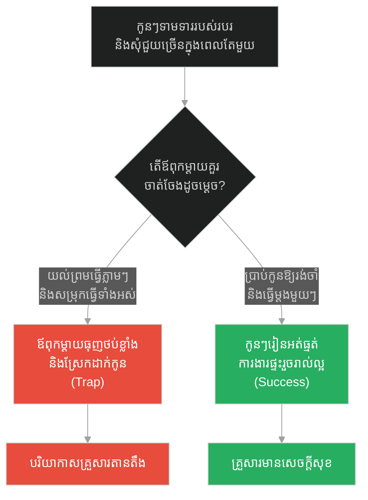
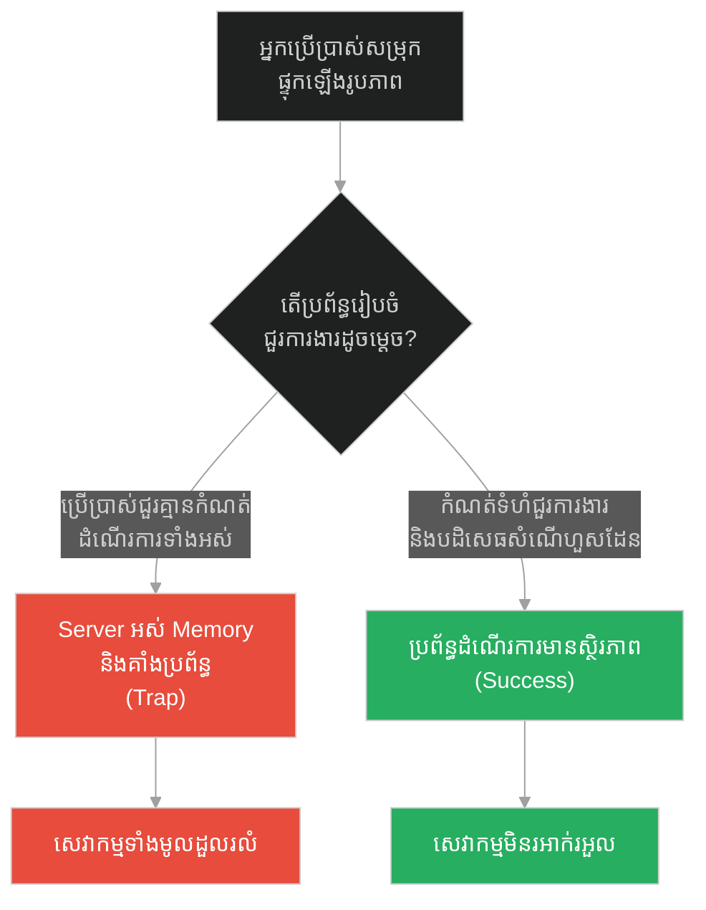
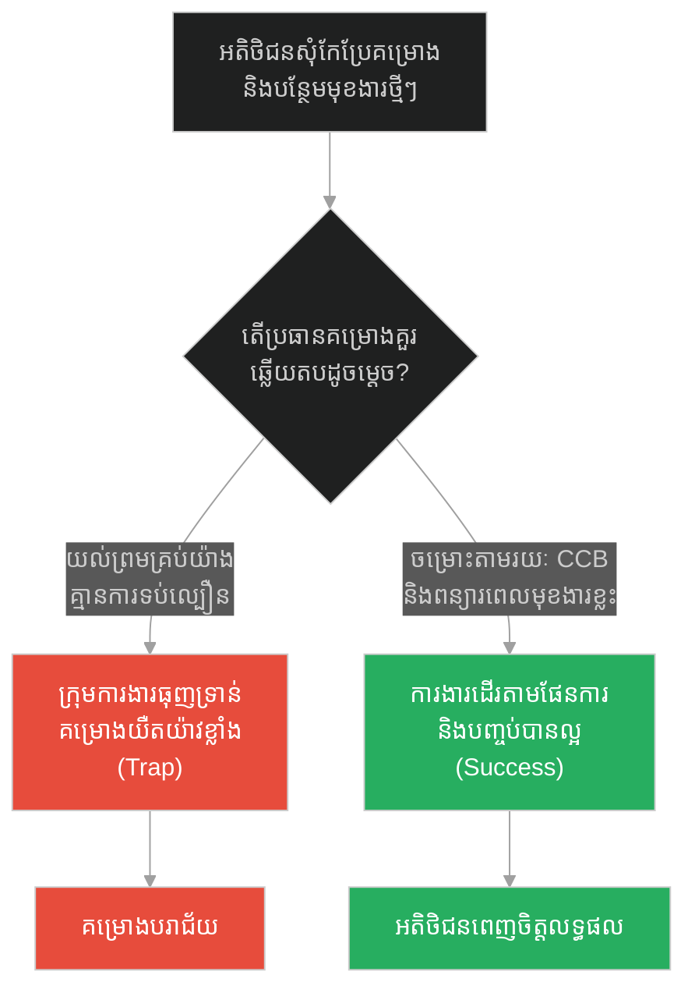
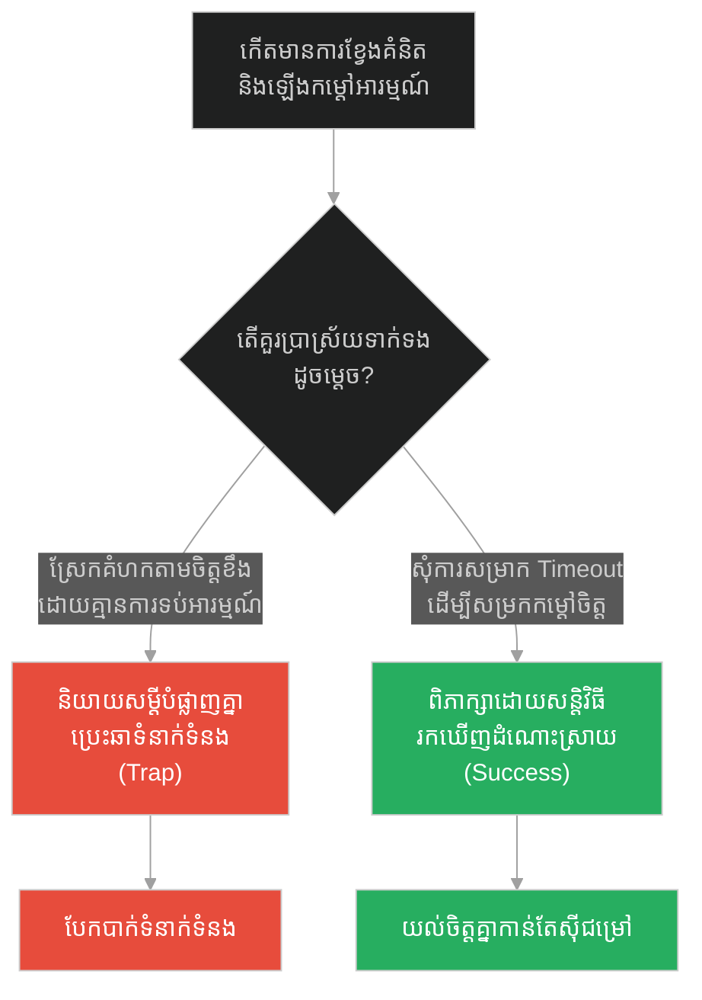
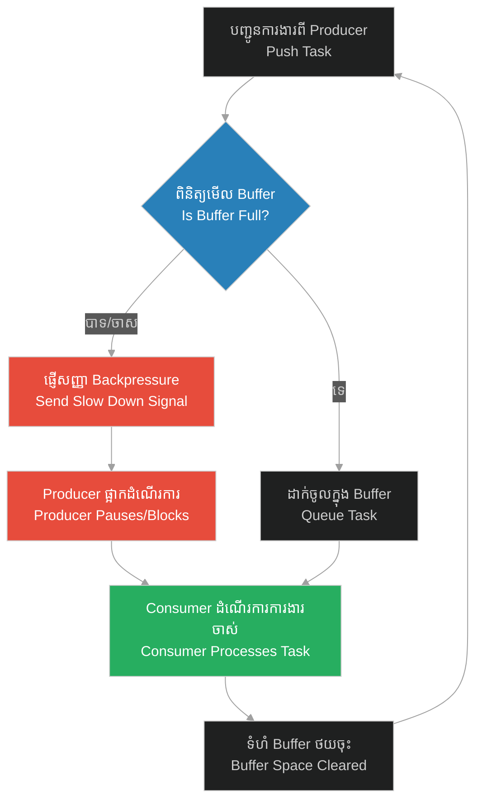

# Rate Limiter & Backpressure Regulation (ការគ្រប់គ្រងសម្ពាធ និងការទប់ទល់ល្បឿនសំណើ)៖ ការទប់ចិត្ត និងការគ្រប់គ្រងកំហឹង (Rate Limiter & Backpressure Regulation & Prophet and the Strong Man)

**Author:** ichamrong  
**Date:** 2026-05-28  
**Tags:** #rate-limiting #backpressure #flow-control #emotional-regulation #software-engineering #prophet-muhammad  
**Category:** Concepts  
**Read Time:** ~15 min  

---

## 📌 មាតិកា (Table of Contents)
- [អន្ទាក់ផ្លូវចិត្ត (The Trap)](#0)
- [១. រឿងព្រេងនិទាន៖ បុរសខ្លាំងពិតប្រាកដ (The Legend of the Strong Man)](#1)
  - [អំណាចនៃការគ្រប់គ្រងស្មារតីផ្ទាល់ខ្លួន (The Strength of Self-Control)](#1-1)
- [២. បញ្ហា៖ ការគ្រប់គ្រងសម្ពាធ និងការទប់ទល់ល្បឿនសំណើ (The Issue: Rate Limiting & Backpressure Regulation)](#2)
- [៣. ឧទាហមណ៍ជាក់ស្តែងក្នុងពិភពពិត (Real World Examples)](#3)
  - [ឧទាហរណ៍ទី ១ — កម្រិតស្រាល (គ្រួសារ)៖ ការគ្រប់គ្រងសម្ពាធការងារផ្ទះ និងតម្រូវការកូនៗ (The Family Chore Overwhelm)](#3-1)
  - [ឧទាហរណ៍ទី ២ — កម្រិតមធ្យម (បច្ចេកទេស)៖ ការទប់សម្ពាធចរាចរណ៍សំណើតាម Bounded Queue (The Tech Worker Backpressure)](#3-2)
  - [ឧទាហរណ៍ទី ៣ — កម្រិតមធ្យម (ធុរកិច្ច)៖ តុល្យភាពល្បឿនផលិតកម្ម និងតម្រូវការទីផ្សារ (The Business JIT System)](#3-3)
  - [ឧទាហរណ៍ទី ៤ — កម្រិតមធ្យម (សង្គម/គ្រប់គ្រង)៖ ការគ្រប់គ្រងសំណើផ្លាស់ប្តូរគម្រោង (The Management Change Request Control)](#3-4)
  - [ឧទាហរណ៍ទី ៥ — កម្រិតធ្ងន់ (ទំនាក់ទំនង)៖ ការទប់កំហឹង និងសុំការសម្រាកបណ្តោះអាសន្នក្នុងការពិភាក្សា (The Relationship Timeout)](#3-5)
- [៤. ដំណោះស្រាយទូទៅ៖ ការគ្រប់គ្រងលំហូរ និងសញ្ញា Backpressure (The General Solution: Flow Control Systems)](#4)
- [សេចក្តីសន្និដ្ឋាន (Conclusion)](#5)
- [ឯកសារយោង (References)](#6)
- [Related Posts](#7)

---

<a id="0"></a>
## អន្ទាក់ផ្លូវចិត្ត (The Trap)

នៅពេលដែលចរាចរណ៍ការងារ ឬកំហឹងសម្រុកចូលមកក្នុងប្រព័ន្ធរបស់យើងយ៉ាងលឿន និងខ្លាំងក្លា តើយើងគួរតែចេះទប់ និងពន្យឺតល្បឿនប្រភពបញ្ជូន (Backpressure) ឬបណ្តោយឱ្យវាហូរចូលមកបំផ្លាញខ្លួនឯង?

* **ការបណ្តោយតាមកំហឹង និងចរាចរណ៍ហួសប្រមាណ (The Overflow Trap)** — ការអនុញ្ញាតឱ្យការងារ ឬកំហឹងហូរចូលដោយគ្មានយន្តការគ្រប់គ្រង ធ្វើឱ្យប្រព័ន្ធផ្ទុះគាំង ឬបាត់បង់ការគ្រប់គ្រងអារម្មណ៍ខ្លួនឯង។
* **ការទប់ទល់ និងការគ្រប់គ្រងសម្ពាធ (The Backpressure Strategy)** — ការផ្ញើសញ្ញាត្រឡប់ទៅប្រភពបញ្ជូនឱ្យផ្អាក ឬបន្ថយល្បឿន (Flow Control) ដើម្បីរក្សាសមត្ថភាពដំណើរការឱ្យមានតុល្យភាព និងប្រសិទ្ធភាព។

រឿងរ៉ាវនៃ «បុរសខ្លាំងពិតប្រាកដ» នឹងបង្ហាញយើងពីយុទ្ធសាស្ត្រ **Backpressure Regulation (ការគ្រប់គ្រងសម្ពាធ)** និង **Rate Limiting** ដើម្បីរក្សាលំនឹងប្រព័ន្ធ។

1. **រឿងព្រេងនិទាន (The Legend)** — ព្យាការីម៉ូហាម៉ាត់កែប្រែនិយមន័យ «បុរសខ្លាំង» ពីអ្នកចំបាប់ពូកែ ទៅជាអ្នកដែលអាចគ្រប់គ្រងកំហឹងខ្លួនឯងបាន។
2. **បញ្ហា (The Issue)** — ការដួលរលំប្រព័ន្ធដោយសារអ្នកទទួល (Consumer) ដំណើរការទិន្នន័យយឺតជាងអ្នកបញ្ជូន (Producer) បញ្ជូនមក។
3. **ឧទាហមណ៍ជាក់ស្តែង (Real World Examples)** — ករណីសិក្សាទាំង ៥ កម្រិត ពីគ្រួសាររហូតដល់ប្រព័ន្ធគ្រប់គ្រង និងបច្ចេកវិទ្យា។
4. **ដំណោះស្រាយទូទៅ (The General Solution)** — ការអនុវត្តយន្តការផ្ញើសញ្ញាគ្រប់គ្រងលំហូរ (Flow Control & Bounded Buffers)។

---

<a id="1"></a>
## ១. រឿងព្រេងនិទាន៖ បុរសខ្លាំងពិតប្រាកដ (The Legend of the Strong Man)

នៅក្នុងការរស់នៅប្រចាំថ្ងៃ មនុស្សភាគច្រើនតែងតែវាយតម្លៃ «ភាពរឹងមាំ ឬភាពខ្លាំង» ទៅលើកម្លាំងសាច់ដុំ ឬសមត្ថភាពយកឈ្នះលើអ្នកដទៃដោយអំពើហិង្សា។ មានរឿងនិទានប្រវត្តិសាស្ត្រមួយបានបង្ហាញពីទស្សនៈខុសប្លែកពីនេះ៖

> *«ថ្ងៃមួយ ព្យាការីម៉ូហាម៉ាត់បានដើរកាត់ក្រុមក្មេងកំលោះមួយក្រុមដែលកំពុងតែប្រកួតចំបាប់គ្នាដើម្បីបង្អួតកម្លាំង។ ក្នុងចំណោមនោះ មានយុវជនម្នាក់ដែលមានសាច់ដុំធំ និងកម្លាំងខ្លាំងក្លាណាស់ គេអាចផ្តួលគូប្រកួតទាំងអស់ឱ្យដួលទៅលើដីបានដោយងាយស្រួល។ មនុស្សគ្រប់គ្នានាំគ្នាទះដៃ និងសរសើរថា យុវជននោះគឺជា "បុរសដែលខ្លាំងបំផុត" នៅក្នុងភូមិ។*
>
> *ព្យាការីម៉ូហាម៉ាត់បានសួរទៅកាន់ពួកគេថា៖ "តើអ្នករាល់គ្នាយល់ថា បុរសខ្លាំងគឺជាអ្នកណា? តើគឺជាអ្នកដែលអាចផ្តួលមនុស្សគ្រប់គ្នាបានអញ្ចឹងឬ?"*
>
> *ពួកគេឆ្លើយថា៖ "បាទ! គឺជាអ្នកដែលគ្មាននរណាអាចវាយឈ្នះបាន។"*
>
> *ព្យាការីម៉ូហាម៉ាត់បានញញឹម រួចបដិសេធនូវការយល់ឃើញនោះ ដោយមានប្រសាសន៍ថា៖ **"បុរសខ្លាំងពិតប្រាកដ មិនមែនជាអ្នកដែលពូកែខាងវាយចំបាប់ផ្តួលគេនោះទេ ប៉ុន្តែបុរសខ្លាំងពិតប្រាកដ គឺជាអ្នកដែលអាចគ្រប់គ្រងកំហឹងរបស់ខ្លួនឯងបាន នៅពេលដែលគេខឹងខ្លាំងបំផុត។ (The strong man is not the good wrestler; the strong man is the one who controls himself when he is angry.)"**»* (សាហ៊ី អាល់ប៊ូខារី ៦១១៤)

<a id="1-1"></a>
### អំណាចនៃការគ្រប់គ្រងស្មារតីផ្ទាល់ខ្លួន (The Strength of Self-Control)

ការយកឈ្នះលើសត្រូវខាងក្រៅដោយកម្លាំងបាយ គឺជារឿងងាយស្រួល និងជាប្រតិកម្មធម្មជាតិ។ ប៉ុន្តែការយកឈ្នះលើ «សត្រូវខាងក្នុង» គឺអារម្មណ៍ក្រោធខឹង និងការចង់វាយតបត គឺជាការប្រយុទ្ធដ៏លំបាកបំផុត។ កំហឹងគឺដូចជាថាមពលដែលហូរចូលមកយ៉ាងគំហក (Spike/Pressure)។ បុរសខ្លាំងពិតប្រាកដ គឺអ្នកដែលមានរបាំងការពារ និងការទប់អារម្មណ៍ (Regulation) មិនឱ្យកំហឹងនោះផ្ទុះឡើងបំផ្លាញទំនាក់ទំនង និងកិត្តិយសខ្លួនឯង។ នេះជាយន្តការ **Backpressure** នៃចិត្តសាស្ត្រ។

---

<a id="2"></a>
## ២. បញ្ហា៖ ការគ្រប់គ្រងសម្ពាធ និងការទប់ទល់ល្បឿនសំណើ (The Issue: Rate Limiting & Backpressure Regulation)

នៅក្នុងប្រព័ន្ធបច្ចេកវិទ្យា បញ្ហាកើតឡើងនៅពេលដែលសេវាកម្មផលិតទិន្នន័យ (Producer) បញ្ជូនទិន្នន័យលឿនពេក ខណៈពេលដែលសេវាកម្មដំណើរការទិន្នន័យ (Consumer) ដំណើរការមិនទាន់។ ប្រសិនបើយើងប្រើប្រាស់ឃ្លាំងផ្ទុកគ្មានដែនកំណត់ (Unbounded Queue/Buffer) នោះទិន្នន័យនឹងកកស្ទះកាន់តែច្រើនឡើងៗ រហូតធ្វើឱ្យអស់ Memory របស់ម៉ាស៊ីន និងគាំងទាំងស្រុង (Out of Memory - OOM Crash)។ យន្តការ **Backpressure** ជួយឱ្យ Consumer ផ្ញើសញ្ញាប្រាប់ Producer ឱ្យផ្អាកការផ្ញើជាបណ្តោះអាសន្ន ឬបន្ថយល្បឿនដើម្បីឱ្យវាដំណើរការទិន្នន័យចាស់អស់សិន។

ខាងក្រោមនេះជាកូដ Python ប្រើប្រាស់ `asyncio` បង្ហាញពីប្រព័ន្ធគ្មានដែនកំណត់ (Fragile) និងប្រព័ន្ធដែលមានការទប់សម្ពាធ (Resilient)៖

### ❌ ការអនុវត្តបែបផុយស្រួយ (Fragile Implementation - No Backpressure)
Producer បញ្ជូនទិន្នន័យលឿនខ្លាំងចូលទៅក្នុង Queue គ្មានកំណត់ ដែលអាចបណ្តាលឱ្យផ្ទុះ Memory ប្រសិនបើ Consumer ដំណើរការយឺត។

```python
# fragile_pipeline.py
import asyncio

# Queue គ្មានដែនកំណត់ទំហំ (Unbounded Queue)
unbounded_queue = asyncio.Queue()

async def producer():
    item_id = 0
    while True:
        item_id += 1
        # ផលិតលឿនខ្លាំង
        await unbounded_queue.put(f"Task-{item_id}")
        print(f"[Producer] បានផ្ញើ Task-{item_id} ចូល Queue. ទំហំ Queue: {unbounded_queue.qsize()}")
        await asyncio.sleep(0.01) # ផ្ញើញឹកញាប់ពេក

async def slow_consumer():
    while True:
        task = await unbounded_queue.get()
        # ដំណើរការយឺត (Expensive Task)
        await asyncio.sleep(1.0) 
        print(f"[Consumer] បានដំណើរការចប់: {task}")
        unbounded_queue.task_done()
```

###  ការអនុវត្តប្រកបដោយភាពធន់ (Resilient Implementation - Bounded Backpressure)
ប្រព័ន្ធកំណត់ទំហំ Queue (Maxsize)។ នៅពេល Queue ពេញ យន្តការ `await queue.put()` នឹងបង្ខំឱ្យ Producer ត្រូវផ្អាកដំណើរការរហូតដល់ Consumer ទំនេរដកទិន្នន័យចេញ។

```python
# resilient_pipeline.py
import asyncio

# កំណត់ទំហំ Queue អតិបរមាត្រឹម 5 (Bounded Queue)
bounded_queue = asyncio.Queue(maxsize=5)

async def producer_resilient():
    item_id = 0
    while True:
        item_id += 1
        print(f"[Producer] ព្យាយាមដាក់ Task-{item_id} ចូល Queue...")
        
        # បើ Queue ពេញ កូដនឹង Block/Wait នៅត្រង់នេះ (Backpressure Regulation)
        # នេះជាការគ្រប់គ្រងសម្ពាធ មិនឱ្យ Producer បន្តបញ្ជូនទិន្នន័យមកបំផ្លាញ Memory
        await bounded_queue.put(f"Task-{item_id}")
        
        print(f"[Producer] ដាក់ Task-{item_id} ជោគជ័យ! ទំហំ Queue: {bounded_queue.qsize()}")
        await asyncio.sleep(0.1)

async def slow_consumer_resilient():
    while True:
        task = await bounded_queue.get()
        # ដំណើរការយឺត
        await asyncio.sleep(1.0) 
        print(f"[Consumer] បានដំណើរការចប់: {task}")
        bounded_queue.task_done()
```

---

<a id="3"></a>
## ៣. ឧទាហមណ៍ជាក់ស្តែងក្នុងពិភពពិត (Real World Examples)

<a id="3-1"></a>
### ឧទាហរណ៍ទី ១ — កម្រិតស្រាល (គ្រួសារ)៖ ការគ្រប់គ្រងសម្ពាធការងារផ្ទះ និងតម្រូវការកូនៗ (The Family Chore Overwhelm)
ឪពុកម្តាយដែលចេះតែយល់ព្រមតាមរាល់សំណើរបស់កូនៗ និងការងារផ្ទះគ្រប់យ៉ាងក្នុងពេលតែមួយ (គ្មានការទប់ល្បឿន) នឹងជួបវិបត្តិបាក់កម្លាំងចិត្ត និងស្រែកគំហកដាក់កូនៗ។ ការប្រាប់កូនៗឱ្យរង់ចាំម្តងមួយៗ (Backpressure) ជួយរក្សាលំនឹង និងសន្តិភាពក្នុងផ្ទះ។



---

<a id="3-2"></a>
### ឧទាហរណ៍ទី ២ — កម្រិតមធ្យម (បច្ចេកទេស)៖ ការទប់សម្ពាធចរាចរណ៍សំណើតាម Bounded Queue (The Tech Worker Backpressure)
នៅក្នុងការរចនាប្រព័ន្ធផ្ទុកឯកសារ ប្រសិនបើគេហទំព័រអនុញ្ញាតឱ្យអ្នកប្រើប្រាស់ផ្ទុកឡើងរូបភាពរាប់លានសន្លឹកដោយគ្មានដែនកំណត់ នោះម៉ាស៊ីនបម្រើនឹងគាំង។ ការកំណត់ទំហំជួរផ្ទុកបណ្តោះអាសន្ន និងការរារាំងសំណើថ្មីៗនៅពេលជួរពេញ (HTTP 429) ជួយការពារប្រព័ន្ធទាំងមូល។



---

<a id="3-3"></a>
### ឧទាហរណ៍ទី ៣ — កម្រិតមធ្យម (ធុរកិច្ច)៖ តុល្យភាពល្បឿនផលិតកម្ម និងតម្រូវការទីផ្សារ (The Business JIT System)
រោងចក្រដែលចេះតែផលិតទំនិញចូលស្តុកដោយគ្មានដែនកំណត់ មិនខ្វល់ពីល្បឿនលក់ចេញរបស់ហាងលក់រាយ នឹងជួបវិបត្តិទំនិញកកស្ទះ និងខាតបង់ថវិកា។ ការប្រើប្រាស់យុទ្ធសាស្ត្រ Just-in-Time (JIT) ដែលតម្រូវការលក់ចេញជាអ្នកកំណត់ល្បឿនផលិត (Pull System) ជួយសន្សំសំចៃធនធាន។

```mermaid
%%{init: {
  'theme': 'dark',
  'themeVariables': {
    'background': '#1e1e1e',
    'primaryTextColor': '#ffffff',
    'lineColor': '#a0a0a0'
  },
  'themeCSS': 'svg { background-color: #1e1e1e !important; padding: 1rem !important; border-radius: 8px !important; } .edgeLabel rect { fill: #1e1e1e !important; } text, tspan { fill: #ffffff !important; }'
}}%%
graph TD
    A["រោងចក្រផលិតទំនិញ<br/>បញ្ជូនទៅកាន់ហាង"] --> B{"តើគួរគ្រប់គ្រង<br/>ល្បឿនផលិតដូចម្តេច?"}
    B -->|ផលិតបន្តបន្ទាប់<br/>ដោយគ្មានការទប់ល្បឿន| C["ទំនិញសល់កកស្ទះស្តុក<br/>ខាតបង់ថវិកាច្រើន<br/>(Trap)"]
    B -->|ផលិតតាមសញ្ញាបញ្ជា<br/>ពីល្បឿនលក់ចេញ (JIT)| D["រក្សាតុល្យភាពស្តុក<br/>ចំណេញលំហូរសាច់ប្រាក់<br/>(Success)"]
    C --> E["ក្រុមហ៊ុនជួបវិបត្តិហិរញ្ញវត្ថុ"]
    D --> F["អាជីវកម្មមានប្រសិទ្ធភាពខ្ពស់"]
    style C fill:#e74c3c,color:#fff
    style E fill:#e74c3c,color:#fff
    style D fill:#27ae60,color:#fff
    style F fill:#27ae60,color:#fff
```

---

<a id="3-4"></a>
### ឧទាហរណ៍ទី ៤ — កម្រិតមធ្យម (សង្គម/គ្រប់គ្រង)៖ ការគ្រប់គ្រងសំណើផ្លាស់ប្តូរគម្រោង (The Management Change Request Control)
ប្រធានគ្រប់គ្រងគម្រោងដែលចេះតែយល់ព្រមទទួលយកសំណើកែប្រែគម្រោង (Scope Creep) ពីអតិថិជនរាល់ថ្ងៃ នឹងធ្វើឱ្យក្រុមការងារបាក់កម្លាំងចិត្ត និងគម្រោងមិនអាចបញ្ចប់បាន។ ការរៀបចំយន្តការគ្រប់គ្រងការផ្លាស់ប្តូរ (Change Control Board) ជួយទប់សម្ពាធការងារឱ្យសមស្របនឹងសមត្ថភាពក្រុម។



---

<a id="3-5"></a>
### ឧទាហរណ៍ទី ៥ — កម្រិតធ្ងន់ (ទំនាក់ទំនង)៖ ការទប់កំហឹង និងសុំការសម្រាកបណ្តោះអាសន្នក្នុងការពិភាក្សា (The Relationship Timeout)
នៅក្នុងការជជែកដេញដោលគ្នារវាងគូស្នេហ៍ ប្រសិនបើភាគីម្ខាងៗបណ្តោយឱ្យកំហឹងផ្ទុះឡើងតាមប្រតិកម្មអារម្មណ៍ (Overflow) នោះទំនាក់ទំនងនឹងត្រូវដាច់។ ការផ្ញើសញ្ញាប្រាប់ដៃគូថា «យើងកំពុងខឹងខ្លាំង សុំសម្រាក ១៥នាទីសិនចាំពិភាក្សាបន្ត» គឺជាការអនុវត្តយន្តការ Backpressure ដើម្បីរក្សាទំនាក់ទំនង។



---

<a id="4"></a>
## ៤. ដំណោះស្រាយទូទៅ៖ ការគ្រប់គ្រងលំហូរ និងសញ្ញា Backpressure (The General Solution: Flow Control Systems)

ដើម្បីអនុវត្តយន្តការគ្រប់គ្រងសម្ពាធការងារ ឬចរាចរណ៍ទិន្នន័យ យើងត្រូវកសាងប្រព័ន្ធគ្រប់គ្រងលំហូរ **Backpressure Loop** ដូចខាងក្រោម៖

1. **ការកំណត់ទំហំផ្ទុកកំណត់ (Define Bounded Queue)** — បង្កើតរបាំង ឬដែនកំណត់អតិបរមាសម្រាប់ការងារដែលកំពុងរង់ចាំ (WIP Limits / Bounded Buffer)។
2. **ការផ្ញើសញ្ញាត្រឡប់ (Feedback Signal)** — នៅពេលទំហំផ្ទុកជិតពេញ ត្រូវផ្ញើសញ្ញាប្រាប់អ្នកបញ្ជូនឱ្យបន្ថយល្បឿន ឬសម្រាកជាបណ្តោះអាសន្ន។
3. **យន្តការសម្របសម្រួល (Rate Co-regulation)** — អនុញ្ញាតឱ្យល្បឿនរបស់ Producer ដើរស្របទៅតាមល្បឿនដោះស្រាយរបស់ Consumer (Reactive Streams)។



---

## 🐇 ធ្លាក់ចូលក្នុងរន្ធទន្សាយ (Enter the Rabbit Hole)
ដើម្បីស្វែងយល់ពីរបៀបចាត់ចែងធនធាន និងការត្រួតពិនិត្យសម្ពាធការងារ ដើម្បីធានាថាក្រុមការងារ ឬម៉ាស៊ីនមិនត្រូវរងការគាបសង្កត់ហួសពីដែនកំណត់ ជួយការពារការ «ស្រែកយំ» ដោយសារហត់នឿយខ្លាំង សូមបន្តដំណើរទៅកាន់៖

* 🚀 **[ចាប់ផ្តើមដំណើររុករក (Start the Journey) ➔ Resource Allocation & Stress Monitoring៖ អូដ្ឋយំ និងការយល់ចិត្តចំពោះបន្ទុកធ្ងន់](./205-prophet-and-the-crying-camel.md)**

---

<a id="5"></a>
## សេចក្តីសន្និដ្ឋាន (Conclusion)

> **«កម្លាំងពិតប្រាកដ មិនមែនជាការរុញច្រានទៅមុខដោយគ្មានដែនកំណត់នោះទេ ប៉ុន្តែវាគឺជាសមត្ថភាពទប់ និងបញ្ជាឱ្យលំហូរដំណើរការយឺត ដើម្បីរក្សាស្ថិរភាពរួម។»**

ពាក្យទូន្មានរបស់ព្យាការីម៉ូហាម៉ាត់អំពីបុរសខ្លាំងពិតប្រាកដ បង្រៀនយើងនូវសច្ចធម៌ដ៏ធំធេង៖ ការគ្រប់គ្រងខ្លួនឯង និងការចេះទប់សម្ពាធអារម្មណ៍ គឺជាកំពូលនៃភាពរឹងមាំ។ នៅក្នុងការរចនាប្រព័ន្ធបច្ចេកវិទ្យា អាជីវកម្ម ឬទំនាក់ទំនងប្រចាំថ្ងៃ ការអនុវត្តយន្តការ Backpressure ដើម្បីសម្របសម្រួលល្បឿនការងារ គឺជាគន្លឹះដើម្បីរក្សាស្ថិរភាព និងភាពរឹងមាំយូរអង្វែង។

---

<a id="6"></a>
## ឯកសារយោង (References)

* **Sahih al-Bukhari Hadith 6114 & Sahih Muslim 2609** — *The Definition of the Strong Man* (Book of Good Manners).
* **Reactive Streams Specification** — A standard for asynchronous stream processing with non-blocking backpressure (reactive-streams.org).
* **Daniel Goleman** — *Emotional Intelligence: Why It Can Matter More Than IQ* (1995). Section on the "Amygdala Hijack" and mechanisms of emotional regulation.

---

<a id="7"></a>
## Related Posts

* [Defense in Depth & Verification Checks (ការការពារស៊ីជម្រៅច្រើនជាន់ និងការផ្ទៀងផ្ទាត់បញ្ជាក់)៖ ជំនឿលើព្រះ និងការចងអូដ្ឋឱ្យជាប់](./203-prophet-and-the-tied-camel.md)
* [Resource Allocation & Stress Monitoring (ការបែងចែកធនធាន និងការត្រួតពិនិត្យសម្ពាធការងារ)៖ អូដ្ឋយំ និងការយល់ចិត្តចំពោះបន្ទុកធ្ងន់](./205-prophet-and-the-crying-camel.md)
