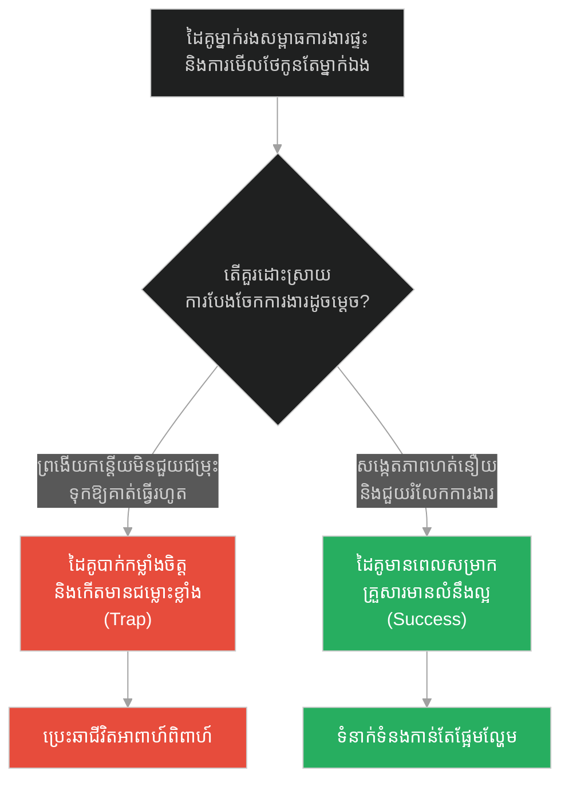
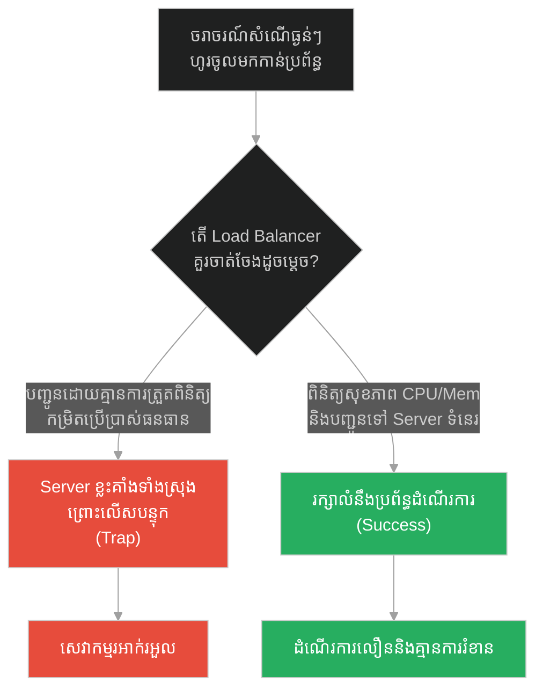
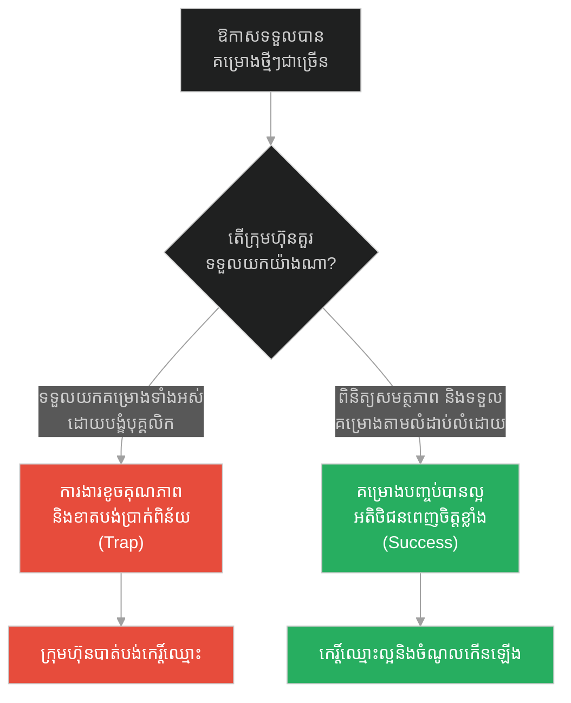
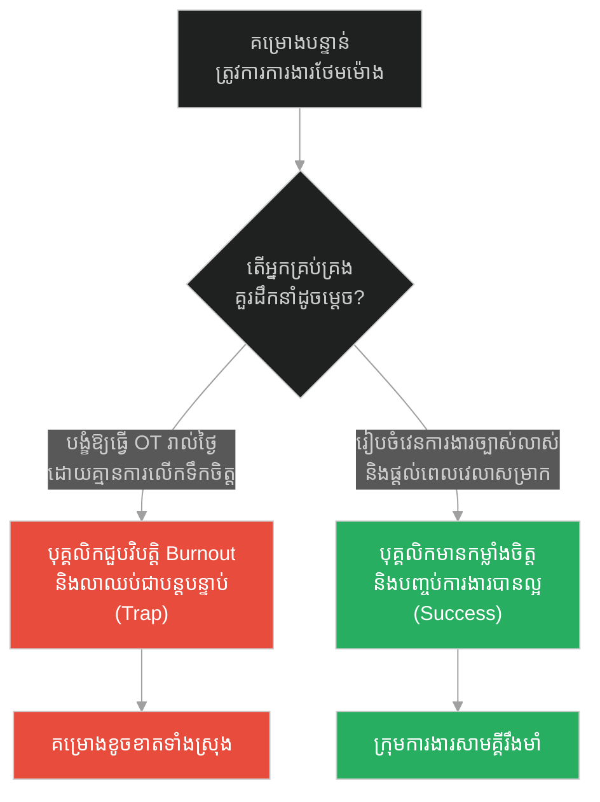
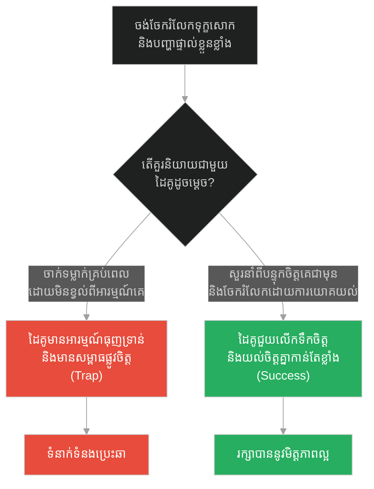

# Resource Allocation & Stress Monitoring (ការបែងចែកធនធាន និងការត្រួតពិនិត្យសម្ពាធការងារ)៖ អូដ្ឋយំ និងការយល់ចិត្តចំពោះបន្ទុកធ្ងន់ (Resource Allocation & Stress Monitoring & Prophet and the Crying Camel)

**Author:** ichamrong  
**Date:** 2026-05-28  
**Tags:** #resource-allocation #stress-monitoring #load-balancing #burnout #system-design #prophet-muhammad  
**Category:** Concepts  
**Read Time:** ~15 min  

---

## 📌 មាតិកា (Table of Contents)
- [អន្ទាក់ផ្លូវចិត្ត (The Trap)](#0)
- [១. រឿងព្រេងនិទាន៖ អូដ្ឋដែលស្រក់ទឹកភ្នែក (The Legend of the Crying Camel)](#1)
  - [ទំនួលខុសត្រូវក្នុងការមើលថែធនធានដែលនៅក្រោមបង្គាប់ (Duty of Care)](#1-1)
- [២. បញ្ហា៖ ការបែងចែកធនធាន និងការត្រួតពិនិត្យសម្ពាធការងារ (The Issue: Resource Allocation & Stress Monitoring)](#2)
- [៣. ឧទាហមណ៍ជាក់ស្តែងក្នុងពិភពពិត (Real World Examples)](#3)
  - [ឧទាហរណ៍ទី ១ — កម្រិតស្រាល (គ្រួសារ)៖ ការបែងចែកការងារផ្ទះ និងភារកិច្ចគ្រួសារ (The Family Workload Balance)](#3-1)
  - [ឧទាហរណ៍ទី ២ — កម្រិតមធ្យម (បច្ចេកទេស)៖ តុល្យភាពលំហូរការងាររបស់ Server (The Tech Resource Monitor)](#3-2)
  - [ឧទាហរណ៍ទី ៣ — កម្រិតមធ្យម (ធុរកិច្ច)៖ ការចាត់ចែងគម្រោងសមស្របនឹងកម្លាំងបុគ្គលិក (The Business Project Bandwidth)](#3-3)
  - [ឧទាហរណ៍ទី ៤ — កម្រិតមធ្យម (សង្គម/គ្រប់គ្រង)៖ ការគ្រប់គ្រង និងទប់ស្កាត់ការហត់នឿយការងារ (The Management Burnout Prevention)](#3-4)
  - [ឧទាហរណ៍ទី ៥ — កម្រិតធ្ងន់ (ទំនាក់ទំនង)៖ តុល្យភាពនៃការចែករំលែកអារម្មណ៍ស្មុគស្មាញ (The Relationship Emotional Capacity)](#3-5)
- [៤. ដំណោះស្រាយទូទៅ៖ ការវាស់ស្ទង់សុខភាព និងការបែងចែកធនធានស្វ័យប្រវត្ត (The General Solution: Stress Monitoring Loops)](#4)
- [សេចក្តីសន្និដ្ឋាន (Conclusion)](#5)
- [ឯកសារយោង (References)](#6)
- [Related Posts](#7)

---

<a id="0"></a>
## អន្ទាក់ផ្លូវចិត្ត (The Trap)

នៅពេលដែលយើងចាត់ចែងការងារ ឬបែងចែកភារកិច្ចឱ្យទៅកាន់ម៉ាស៊ីន ក្រុមការងារ ឬបុគ្គលជុំវិញខ្លួន តើយើងចេះតែផ្ទេរការងារទៅឱ្យពួកគេដោយគ្មានការត្រួតពិនិត្យ ឬត្រូវចេះវាស់ស្ទង់សម្ពាធការងារ (Stress Monitoring) ដើម្បីការពារកុំឱ្យពួកគេគាំង?

* **ការកេងប្រវ័ញ្ច និងការមិនខ្វល់ពីសមត្ថភាព (The Exploitation Trap)** — ការដាក់បន្ទុកការងារធ្ងន់ធ្ងរហួសពីដែនកំណត់ ដោយសារការមើលឃើញតែលទ្ធផលលឿនរហ័ស រហូតធ្វើឱ្យធនធានបាក់កម្លាំង ឬគាំងទាំងស្រុង។
* **ការបែងចែកធនធានដោយការយល់ចិត្ត (The Resilient Allocation)** — ការត្រួតពិនិត្យសុខភាព និងកម្រិតសម្ពាធការងារជាប្រចាំ ដើម្បីបែងចែកបន្ទុកការងារឱ្យមានលំនឹង ធានាបាននូវនិរន្តរភាព និងផលិតភាពខ្ពស់បំផុត។

រឿងរ៉ាវនៃ «អូដ្ឋយំ» នឹងបង្ហាញយើងពីយុទ្ធសាស្ត្រ **Resource Allocation (ការបែងចែកធនធាន)** និង **Stress Monitoring (ការត្រួតពិនិត្យសម្ពាធការងារ)** នៅក្នុងជីវិត និងប្រព័ន្ធបច្ចេកវិទ្យា។

1. **រឿងព្រេងនិទាន (The Legend)** — ព្យាការីម៉ូហាម៉ាត់លួងលោមសត្វអូដ្ឋដែលហត់នឿយខ្លាំង និងស្តីបន្ទោសម្ចាស់របស់វាដែលប្រើវាហួសកម្លាំង។
2. **បញ្ហា (The Issue)** — ការដួលរលំប្រព័ន្ធ ឬការជួបវិបត្តិបាក់កម្លាំង (Burnout) ដោយសារការខ្វះយន្តការត្រួតពិនិត្យ និងវាស់ស្ទង់សុខភាពប្រព័ន្ធ។
3. **ឧទាហមណ៍ជាក់ស្តែង (Real World Examples)** — ការគ្រប់គ្រង ៥ កម្រិត ពីគ្រួសាររហូតដល់ការរៀបចំប្រព័ន្ធបច្ចេកវិទ្យាធំៗ។
4. **ដំណោះស្រាយទូទៅ (The General Solution)** — ការបង្កើតយន្តការវាស់ស្ទង់សុខភាព និងការបែងចែកការងារដោយស្វ័យប្រវត្ត។

---

<a id="1"></a>
## ១. រឿងព្រេងនិទាន៖ អូដ្ឋដែលស្រក់ទឹកភ្នែក (The Legend of the Crying Camel)

នៅក្នុងវប្បធម៌អារ៉ាប់បុរាណ សត្វអូដ្ឋគឺជាមធ្យោបាយដឹកជញ្ជូន និងជាទ្រព្យសម្បត្តិដ៏សំខាន់ ប៉ុន្តែពួកវាជារឿយៗត្រូវបានគេប្រើប្រាស់យ៉ាងធ្ងន់ធ្ងរដោយគ្មានក្តីមេត្តា។ មានរឿងរ៉ាវដ៏រំជួលចិត្តមួយត្រូវបានកត់ត្រាក្នុង Hadith៖

> *«ថ្ងៃមួយ ព្យាការីម៉ូហាម៉ាត់បានដើរចូលទៅក្នុងចម្ការល្មើរបស់បុរសម្នាក់ជាជនជាតិអានសារ (Ansar)។ នៅទីនោះ លោកបានសង្កេតឃើញសត្វអូដ្ឋមួយក្បាល។ នៅពេលដែលសត្វអូដ្ឋនោះបានឃើញព្យាការី វាក៏ចាប់ផ្តើមយំខ្សឹកខ្សួលយ៉ាងគួរឱ្យអាណិត ហើយទឹកភ្នែកក៏ហូរធ្លាក់ចុះមកតាមថ្ពាល់របស់វា។ ព្យាការីម៉ូហាម៉ាត់មានចិត្តអាណិតអាសូរយ៉ាងខ្លាំង លោកក៏ដើរទៅជិតវា អង្អែលក្បាល និងខ្នងរបស់វាថ្នមៗ រហូតទាល់តែវាស្ងប់ចិត្តឈប់យំ។*
>
> *បន្ទាប់មក លោកបានសួររកម្ចាស់របស់វា៖ "តើនរណាជាម្ចាស់អូដ្ឋនេះ?"*
>
> *យុវជនម្នាក់ដើរចេញមកឆ្លើយថា៖ "គឺជារបស់ខ្ញុំ ឱរ៉សូលអល់ឡោះ!"*
>
> *ព្យាការីម៉ូហាម៉ាត់បានស្តីបន្ទោសយុវជននោះយ៉ាងម៉ឺងម៉ាត់៖ **"តើអ្នកមិនខ្លាចព្រះជាម្ចាស់ចំពោះសត្វដែលទ្រង់បានប្រគល់ឱ្យអ្នកគ្រប់គ្រងនេះទេឬ? សត្វនេះបានត្អូញត្អែរប្រាប់ខ្ញុំថា អ្នកបានទុកវាឱ្យអត់ឃ្លាន និងប្រើប្រាស់វាឱ្យធ្វើការងារធ្ងន់ធ្ងរហួសពីកម្លាំងរបស់វា។"**»* (ស៊ូណាន់ អាប៊ីដាវូដ ២៥៤៩)

<a id="1-1"></a>
### ទំនួលខុសត្រូវក្នុងការមើលថែធនធានដែលនៅក្រោមបង្គាប់ (Duty of Care)

សត្វអូដ្ឋមិនអាចនិយាយភាសាមនុស្សដើម្បីប្រាប់ពីភាពហត់នឿយរបស់វាបានឡើយ ប៉ុន្តែវានៅតែបង្ហាញសញ្ញា (Metrics) តាមរយៈការស្រក់ទឹកភ្នែក និងរូបរាងស្គមស្គាំង។ ព្យាការីម៉ូហាម៉ាត់បានបង្រៀនថា ភាពជាម្ចាស់ ឬអ្នកគ្រប់គ្រង មិនមែនជាសិទ្ធិផ្តាច់មុខក្នុងការកេងប្រវ័ញ្ចធនធាននោះទេ ប៉ុន្តែវាជា **កាតព្វកិច្ចក្នុងការថែរក្សា (Duty of Care)**។ ក្នុងនាមជាអ្នកដឹកនាំ យើងត្រូវតែមានសមត្ថភាពស្តាប់ និងសង្កេតមើលសញ្ញានៃការហត់នឿយរបស់ក្រុមការងារ ឬម៉ាស៊ីនដែលយើងគ្រប់គ្រង ដើម្បីធានាបាននូវតុល្យភាពការងារ។

---

<a id="2"></a>
## ២. បញ្ហា៖ ការបែងចែកធនធាន និងការត្រួតពិនិត្យសម្ពាធការងារ (The Issue: Resource Allocation & Stress Monitoring)

នៅក្នុងវិស្វកម្មប្រព័ន្ធ (Systems Engineering) ការចាត់ចែងការងារឱ្យទៅកាន់ម៉ាស៊ីន (Worker Nodes) ដោយមិនបានត្រួតពិនិត្យកម្រិតប្រើប្រាស់ CPU, Memory ឬ Disk I/O នឹងធ្វើឱ្យម៉ាស៊ីននោះឡើងកម្តៅខ្លាំង រហូតគាំងទាំងស្រុង ឬត្រូវបាន OS សម្លាប់ដំណើរការចោល (Out of Memory Killer)។ យន្តការ **Stress Monitoring** ជួយវាស់ស្ទង់សុខភាពរបស់ម៉ាស៊ីនជាប្រចាំ ហើយនៅពេលធនធានជិតពេញ (ឧទាហរណ៍ CPU > 85%) ប្រព័ន្ធនឹងបន្ថយការបញ្ជូនការងារទៅកាន់ម៉ាស៊ីននោះ និងបង្វែរការងារទៅកាន់ម៉ាស៊ីនផ្សេងដែលមានធនធានទំនេរច្រើនជាង (Dynamic Load Balancing)។

ខាងក្រោមនេះជាកូដប្រៀបធៀបរវាងការបែងចែកការងារដោយមិនខ្វល់ពីធនធាន និងការបែងចែកការងារដោយមានការត្រួតពិនិត្យសុខភាពប្រព័ន្ធ៖

### ❌ ការអនុវត្តបែបផុយស្រួយ (Fragile Implementation - Blind Allocation)
ប្រព័ន្ធចេះតែទទួលការងារធ្ងន់ៗមកដំណើរការដោយគ្មានការពិនិត្យស្ថានភាពម៉ាស៊ីន ធ្វើឱ្យ Server គាំងជាញឹកញាប់នៅពេលមានការងារច្រើន។

```python
# fragile_worker.py
def process_expensive_job(job_data):
    # ដំណើរការការងារភ្លាមៗដោយគ្មានការពិនិត្យស្ថានភាព
    # ងាយស្រួលធ្វើឱ្យ Server គាំងនៅពេលមានសំណើច្រើន
    result = execute_cpu_heavy_computation(job_data)
    return result
```

###  ការអនុវត្តប្រកបដោយភាពធន់ (Resilient Implementation - Stress Monitoring)
ប្រព័ន្ធពិនិត្យមើលកម្រិត CPU និង Memory មុននឹងទទួលការងារ។ ប្រសិនបើលើសកម្រិតកំណត់ វានឹងពន្យារពេល ឬផ្ញើសញ្ញាប្រាប់ប្រព័ន្ធឱ្យបង្វែរការងារចេញ។

```python
# resilient_worker.py
import psutil
import logging

# កំណត់ដែនកំណត់សុវត្ថិភាព
CPU_LIMIT = 80.0  # មិនឱ្យលើសពី 80%
MEM_LIMIT = 85.0  # មិនឱ្យលើសពី 85%

def process_expensive_job_resilient(job_data):
    # ត្រួតពិនិត្យកម្រិតសម្ពាធការងារ (Stress Monitoring)
    cpu_usage = psutil.cpu_percent(interval=None)
    mem_usage = psutil.virtual_memory().percent
    
    # ពិនិត្យមើលថាតើធនធានកំពុងស្រែកយំ (Overloaded) ឬទេ
    if cpu_usage > CPU_LIMIT or mem_usage > MEM_LIMIT:
        logging.warning(
            f"ប្រព័ន្ធមានសម្ពាធខ្លាំង! CPU: {cpu_usage}%, Mem: {mem_usage}%. "
            "សូមបង្វែរការងារនេះទៅ Server ផ្សេង។"
        )
        # ផ្ញើសារបដិសេធ ដើម្បីឱ្យ Load Balancer ចាត់ចែងឡើងវិញ
        return {
            "status": "overloaded", 
            "error": "Resource stress limit reached. Shedding load."
        }, 503
        
    # ប្រសិនបើធនធាននៅទំនេរ ដំណើរការធម្មតា
    result = execute_cpu_heavy_computation(job_data)
    return {"status": "success", "data": result}, 200
```

---

<a id="3"></a>
## ៣. ឧទាហមណ៍ជាក់ស្តែងក្នុងពិភពពិត (Real World Examples)

<a id="3-1"></a>
### ឧទាហរណ៍ទី ១ — កម្រិតស្រាល (គ្រួសារ)៖ ការបែងចែកការងារផ្ទះ និងភារកិច្ចគ្រួសារ (The Family Workload Balance)
នៅក្នុងគ្រួសារ ប្រសិនបើដៃគូម្ខាងចេះតែទម្លាក់រាល់ការងារផ្ទះ ការមើលថែកូន និងការងារក្រៅផ្ទះទៅឱ្យដៃគូម្នាក់ទៀតធ្វើរហូតដល់គាត់បាក់កម្លាំង និងកើតជំងឺបាក់ទឹកចិត្ត នោះនឹងនាំឱ្យគ្រួសារបែកបាក់។ ការសង្កេតមើលភាពនឿយហត់ និងការចែករំលែកភារកិច្ចគ្នា ជួយរក្សាក្តីស្រលាញ់ឱ្យមានស្ថិរភាព។



---

<a id="3-2"></a>
### ឧទាហរណ៍ទី ២ — កម្រិតមធ្យម (បច្ចេកទេស)៖ តុល្យភាពលំហូរការងាររបស់ Server (The Tech Resource Monitor)
នៅក្នុងប្រព័ន្ធ Cloud Computing ការប្រើប្រាស់វិធីសាស្ត្របញ្ជូនការងារទៅកាន់ Server នីមួយៗដោយស្មើគ្នា (Round Robin) ដោយមិនពិនិត្យមើលបន្ទុកការងារពិតប្រាកដ អាចធ្វើឱ្យ Server ខ្លះគាំងព្រោះត្រូវចំការងារធ្ងន់ៗ។ ការវាស់ស្ទង់បន្ទុកការងារ (Least Connections / Load Monitoring) ជួយការពារ Server ពីការគាំង។



---

<a id="3-3"></a>
### ឧទាហរណ៍ទី ៣ — កម្រិតមធ្យម (ធុរកិច្ច)៖ ការចាត់ចែងគម្រោងសមស្របនឹងកម្លាំងបុគ្គលិក (The Business Project Bandwidth)
ក្រុមហ៊ុនដែលចេះតែដេញថ្លៃគម្រោងថ្មីៗមកធ្វើដើម្បីបង្កើនចំណូល ដោយមិនខ្វល់ពីចំនួនបុគ្គលិកបច្ចេកទេសដែលមានស្រាប់ នឹងជួបវិបត្តិគម្រោងខូចគុណភាព និងយឺតយ៉ាវ។ ការវាស់ស្ទង់សមត្ថភាពក្រុមការងារ (Team Bandwidth) ជួយឱ្យក្រុមហ៊ុនទទួលបានគម្រោងដែលត្រឹមត្រូវ និងជោគជ័យ។



---

<a id="3-4"></a>
### ឧទាហរណ៍ទី ៤ — កម្រិតមធ្យម (សង្គម/គ្រប់គ្រង)៖ ការគ្រប់គ្រង និងទប់ស្កាត់ការហត់នឿយការងារ (The Management Burnout Prevention)
អ្នកគ្រប់គ្រងដែលបង្ខំបុគ្គលិកឱ្យធ្វើការបន្ថែមម៉ោង (OT) ជាប់ៗគ្នាច្រើនសប្តាហ៍ ដើម្បីសម្រេចគម្រោងលឿន នឹងធ្វើឱ្យបុគ្គលិកលាឈប់ ឬធ្លាក់ខ្លួនឈឺ។ ការបង្កើតរបបវាស់ស្ទង់សុខភាពផ្លូវចិត្ត និងសុខុមាលភាពការងារ ជួយរក្សាតុល្យភាពការងារ និងកាត់បន្ថយអត្រាលាឈប់។



---

<a id="3-5"></a>
### ឧទាហរណ៍ទី ៥ — កម្រិតធ្ងន់ (ទំនាក់ទំនង)៖ តុល្យភាពនៃការចែករំលែកអារម្មណ៍ស្មុគស្មាញ (The Relationship Emotional Capacity)
នៅក្នុងមិត្តភាព ឬគូស្នេហ៍ ប្រសិនបើភាគីម្ខាងចេះតែយកបញ្ហាស្មុគស្មាញ និងទុក្ខសោករបស់ខ្លួនទៅចាក់ទម្លាក់ដាក់ដៃគូគ្រប់ពេលវេល (Trauma Dumping) ដោយមិនបានសួរនាំថាតើគាត់មានកម្លាំងចិត្តស្តាប់ឬទេ នឹងធ្វើឱ្យដៃគូនោះធុញទ្រាន់ និងដកខ្លួនចេញ។ ការសួរសុខទុក្ខ និងស្ទង់មើលអារម្មណ៍មុននឹងចែករំលែក ជួយរក្សាទំនាក់ទំនងឱ្យមានតុល្យភាព។



---

<a id="4"></a>
## ៤. ដំណោះស្រាយទូទៅ៖ ការវាស់ស្ទង់សុខភាព និងការបែងចែកធនធានស្វ័យប្រវត្ត (The General Solution: Stress Monitoring Loops)

ដើម្បីរៀបចំប្រព័ន្ធចាត់ចែងធនធានឱ្យមានតុល្យភាព និងការពារការដួលរលំ យើងត្រូវបង្កើតយន្តការ **Stress Monitoring Loop** ដូចខាងក្រោម៖

1. **ការវាស់ស្ទង់កម្រិតផ្ទុក (Measure Capacity & Load)** — ដំឡើងឧបករណ៍វាស់ស្ទង់ស្ថានភាពធនធាន (Telemetry/Health Checks/Surveys)។
2. **ការកំណត់ដែនកំណត់ព្រមាន (Define Alert thresholds)** — បង្កើតសូចនាករព្រមានទុកជាមុន (ឧទាហរណ៍ ភ្លើងលឿងនៅពេលបន្ទុកការងារឡើងដល់ 75%)។
3. **យន្តការបែងចែកការងារឡើងវិញ (Dynamic Re-routing)** — នៅពេលធនធានណាមួយជួបសម្ពាធ ត្រូវចម្រោះការងារ ឬបង្វែរទៅកាន់ផ្នែកផ្សេងទៀតដែលនៅទំនេរ។
4. **ការផ្តល់ពេលវេលាសម្រាប់ការស្តារខ្លួន (Provide Recovery Windows)** — បង្កើតពេលវេលាសម្រាក និងការថែទាំប្រព័ន្ធឱ្យបានទៀងទាត់។

```mermaid
%%{init: {
  'theme': 'dark',
  'themeVariables': {
    'background': '#1e1e1e',
    'primaryTextColor': '#ffffff',
    'lineColor': '#a0a0a0'
  },
  'themeCSS': 'svg { background-color: #1e1e1e !important; padding: 1rem !important; border-radius: 8px !important; } .edgeLabel rect { fill: #1e1e1e !important; } text, tspan { fill: #ffffff !important; }'
}}%%
graph TD
    A["វាស់ស្ទង់បន្ទុកការងារ<br/>Monitor Load"] --> B{"ពិនិត្យស្ថានភាពបន្ទុក<br/>Is Load > Threshold?"}
    B -->|បាទ/ចាស| C["បើកយន្តការ Load Shedding<br/>Trigger Load Shedding"]
    B -->|ទេ| D["បន្តការងារធម្មតា<br/>Route Normally"]
    C --> E["បង្វែរការងារទៅធនធានផ្សេង<br/>Re-route to Other Nodes"]
    E --> F["ផ្តល់ពេលឱ្យធនធានចាស់សម្រាក<br/>Cooldown Period"]
    F --> A
    D --> A
    style B fill:#2980b9,color:#fff
    style C fill:#e74c3c,color:#fff
    style E fill:#27ae60,color:#fff
```



---

## 🐇 ធ្លាក់ចូលក្នុងរន្ធទន្សាយ (Enter the Rabbit Hole)
ដើម្បីស្វែងយល់ពីរបៀបដែលយើងអាចផ្លាស់ប្តូរ និងដាក់ឱ្យប្រើប្រាស់ប្រព័ន្ធថ្មីៗ ឬការងារថ្មីៗដោយរលូន មិនរំខានដល់ដំណើរការចាស់ដែលកំពុងដំណើរការ (Gentle Eviction) ប្រៀបដូចជាការរក្សាសត្វឆ្មាឱ្យគេងលក់ស្រួល សូមបន្តដំណើរទៅកាន់៖

* 🚀 **[ចាប់ផ្តើមដំណើររុករក (Start the Journey) ➔ Zero-downtime Deployments & Gentle Evictions៖ ឆ្មាកំពុងដេក និងការមិនរំខានដល់ដំណើរការចាស់](./206-prophet-and-the-sleeping-cat.md)**

---

<a id="5"></a>
## សេចក្តីសន្និដ្ឋាន (Conclusion)

> **«ភាពជាអ្នកដឹកនាំដ៏អស្ចារ្យ មិនមែនមើលទៅលើទំហំការងារដែលអ្នកបានបង្ខំឱ្យគេធ្វើនោះទេ ប៉ុន្តែវាស់វែងទៅលើរបៀបដែលអ្នកថែរក្សា និងរក្សាធនធានឱ្យនៅមានស្ថិរភាព និងភាពរីកចម្រើន។»**

រឿងរ៉ាវរបស់សត្វអូដ្ឋដែលស្រក់ទឹកភ្នែក បង្រៀនយើងនូវសច្ចធម៌ដ៏សំខាន់៖ ទ្រព្យសម្បត្តិ ធនធានមនុស្ស ឬប្រព័ន្ធកុំព្យូទ័រ ដែលព្រះជាម្ចាស់ ឬស្ថាប័នបានប្រគល់ឱ្យយើងគ្រប់គ្រង ត្រូវតែទទួលបានការយកចិត្តទុកដាក់ និងថែទាំត្រឹមត្រូវ។ ការត្រួតពិនិត្យសម្ពាធការងារ និងការបែងចែកបន្ទុកការងារឱ្យមានតុល្យភាព គឺជាការធានាតែមួយគត់សម្រាប់ភាពជោគជ័យដ៏យូរអង្វែង និងប្រកបដោយធម៌មេត្តា។

---

<a id="6"></a>
## ឯកសារយោង (References)

* **Sunan Abi Dawud Hadith 2549** — *The Hadith of the Crying Camel* (Book of Jihad / Animal Rights).
* **Brendan Gregg** — *Systems Performance: Enterprise and the Cloud* (2013). Chapter on CPU/Memory Stress Metrics and Monitoring Tools.
* **Christina Maslach** — *Banishing Burnout: Six Strategies for Improving Your Relationship with Work* (2005). Psychological guidelines on workload monitoring and organizational stress.

---

<a id="7"></a>
## Related Posts

* [Rate Limiter & Backpressure Regulation (ការគ្រប់គ្រងសម្ពាធ និងការទប់ទល់ល្បឿនសំណើ)៖ ការទប់ចិត្ត និងការគ្រប់គ្រងកំហឹង](./204-prophet-and-the-strong-man.md)
* [Zero-downtime Deployments & Gentle Evictions (ការដាក់ឱ្យប្រើប្រាស់ដោយគ្មានការរំខាន និងការផ្លាស់ទីដោយថ្នមៗ)៖ ឆ្មាកំពុងដេក និងការមិនរំខានដល់ដំណើរការចាស់](./206-prophet-and-the-sleeping-cat.md)
