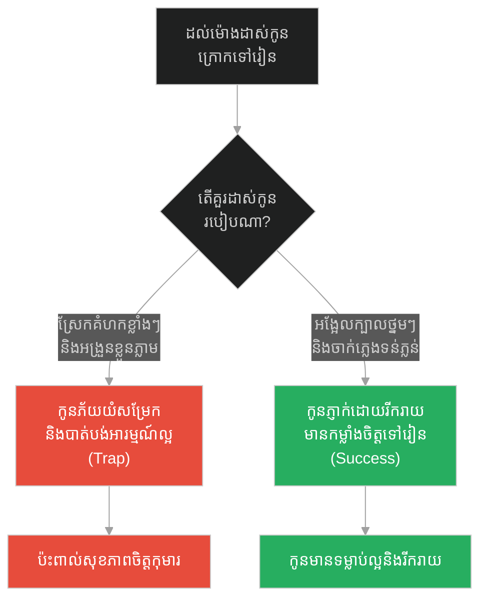
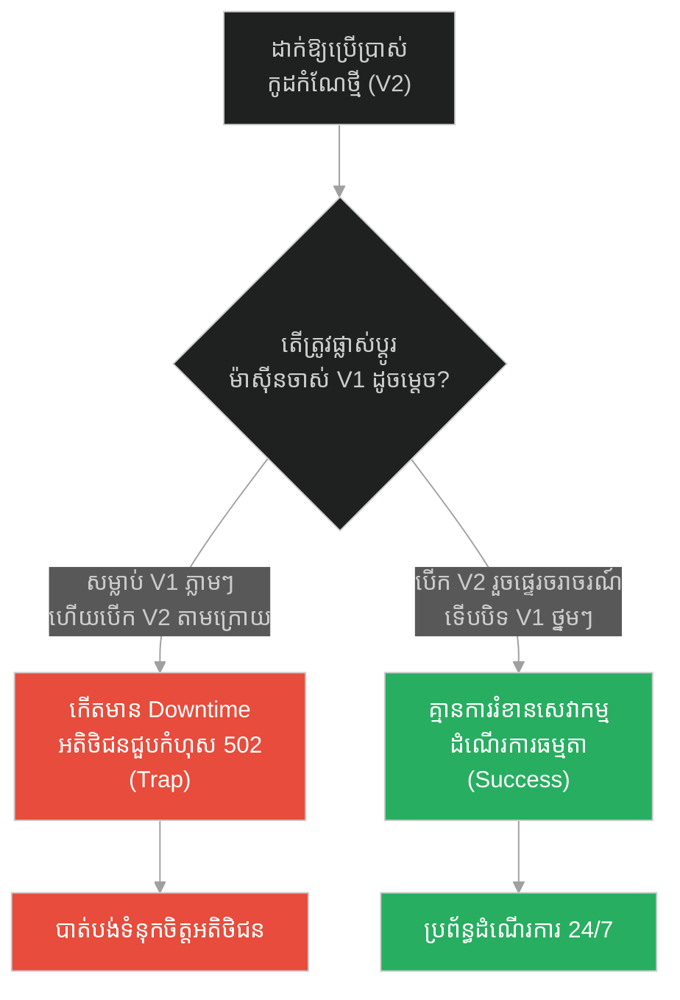
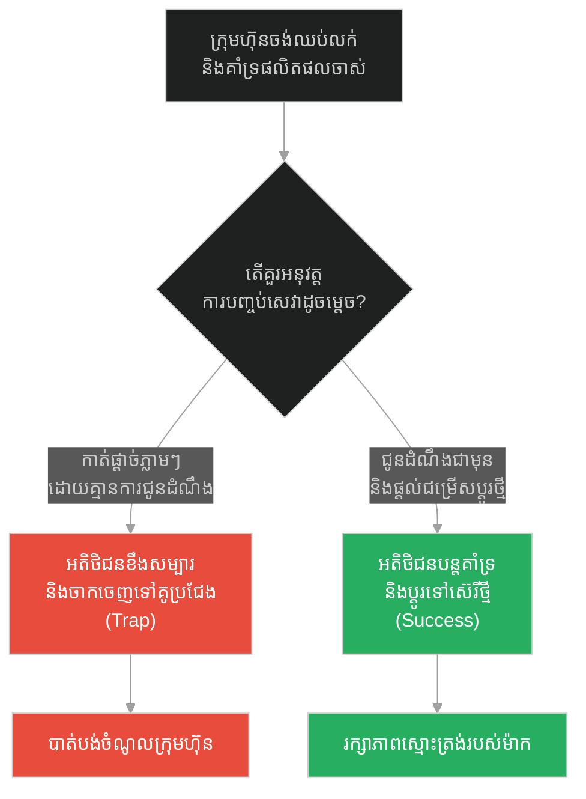
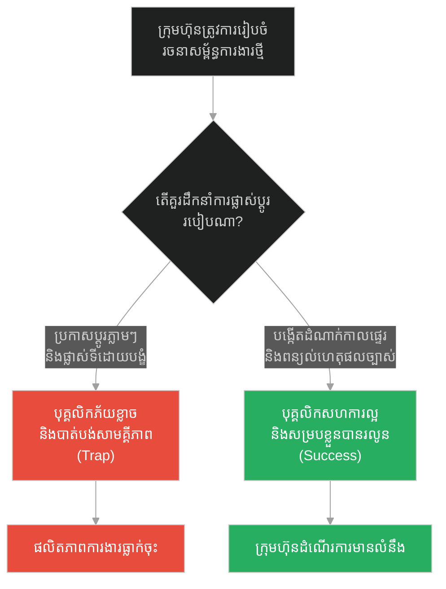
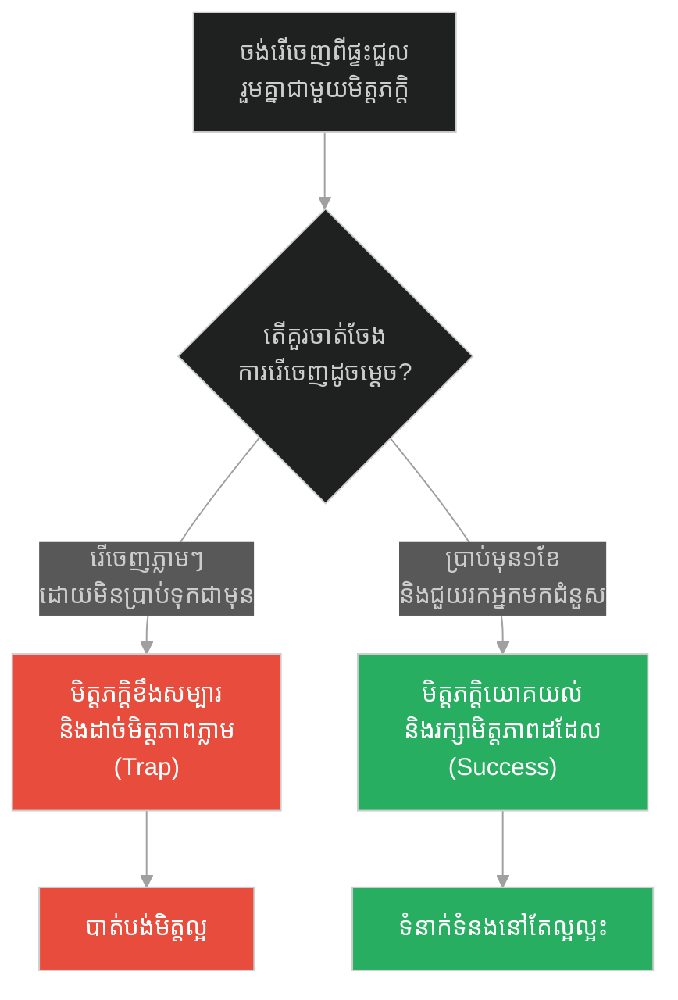
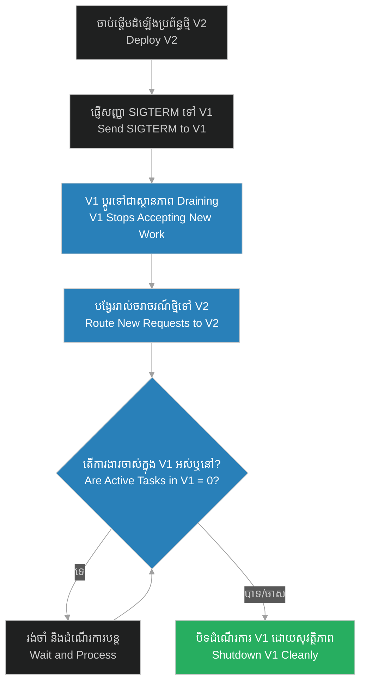

# Zero-downtime Deployments & Gentle Evictions (ការដាក់ឱ្យប្រើប្រាស់ដោយគ្មានការរំខាន និងការផ្លាស់ទីដោយថ្នមៗ)៖ ឆ្មាកំពុងដេក និងការមិនរំខានដល់ដំណើរការចាស់ (Zero-downtime Deployments & Gentle Evictions & Prophet and the Sleeping Cat)

**Author:** ichamrong  
**Date:** 2026-05-28  
**Tags:** #zero-downtime #graceful-shutdown #gentle-eviction #rolling-updates #kubernetes #prophet-muhammad  
**Category:** Concepts  
**Read Time:** ~15 min  

---

## 📌 មាតិកា (Table of Contents)
- [អន្ទាក់ផ្លូវចិត្ត (The Trap)](#0)
- [១. រឿងព្រេងនិទាន៖ ឆ្មាមូអេហ្សា និងការកាត់ដៃអាវ (The Legend of Cutting the Sleeve)](#1)
  - [សីលធម៌នៃការមិនរំខានដល់ដំណើរការចាស់ (The Ethic of Non-disturbance)](#1-1)
- [២. បញ្ហា៖ ការដាក់ឱ្យប្រើប្រាស់ដោយគ្មានការរំខាន និងការផ្លាស់ទីដោយថ្នមៗ (The Issue: Zero-downtime Deployments & Gentle Evictions)](#2)
- [៣. ឧទាហមណ៍ជាក់ស្តែងក្នុងពិភពពិត (Real World Examples)](#3)
  - [ឧទាហរណ៍ទី ១ — កម្រិតស្រាល (គ្រួសារ)៖ ការដាស់កូនៗក្រោកពីគេង (The Family Morning Wake-up)](#3-1)
  - [ឧទាហរណ៍ទី ២ — កម្រិតមធ្យម (បច្ចេកទេស)៖ ការអនុវត្ត Rolling Updates ក្នុង Kubernetes (The Tech Pod Eviction)](#3-2)
  - [ឧទាហរណ៍ទី ៣ — កម្រិតមធ្យម (ធុរកិច្ច)៖ ការបញ្ឈប់ការគាំទ្រផលិតផលចាស់ (The Business Legacy Sunset)](#3-3)
  - [ឧទាហរណ៍ទី ៤ — កម្រិតមធ្យម (សង្គម/គ្រប់គ្រង)៖ ការរៀបចំរចនាសម្ព័ន្ធក្រុមការងារឡើងវិញ (The Management Transition Phase)](#3-4)
  - [ឧទាហរណ៍ទី ៥ — កម្រិតធ្ងន់ (ទំនាក់ទំនង)៖ ការបញ្ចប់កិច្ចសន្យាជួលផ្ទះរួមគ្នា (The Relationship Move-out Notice)](#3-5)
- [៤. ដំណោះស្រាយទូទៅ៖ ការបិទដំណើរការប្រកបដោយភាពទន់ភ្លន់ និងការផ្ទេរការងារ (The General Solution: Graceful Shutdown & Draining)](#4)
- [សេចក្តីសន្និដ្ឋាន (Conclusion)](#5)
- [ឯកសារយោង (References)](#6)
- [Related Posts](#7)

---

<a id="0"></a>
## អន្ទាក់ផ្លូវចិត្ត (The Trap)

នៅពេលដែលយើងត្រូវការកែលម្អប្រព័ន្ធ ប្តូរការងារ ឬធ្វើបច្ចុប្បន្នភាព (Update) តើយើងគួរតែបិទដំណើរការចាស់ៗភ្លាមៗដោយបង្ខំ (Hard Kill) ឬត្រូវចាត់ចែងផ្ទេរការងារដោយថ្នមៗ (Gentle Eviction) ដើម្បីកុំឱ្យប៉ះពាល់ដល់ស្ថិរភាព?

* **ការបិទដំណើរការដោយគំហក (The Disruptive Shutdown Trap)** — ការសម្លាប់ដំណើរការចាស់ចោលភ្លាមៗដើម្បីដាក់ដំណើរការថ្មី ដែលបណ្តាលឱ្យទិន្នន័យដែលកំពុងរត់ត្រូវបាត់បង់ និងបង្កើតជាកំហុសប្រព័ន្ធធ្ងន់ធ្ងរ។
* **ការដាក់ឱ្យប្រើប្រាស់ដោយគ្មានការរំខាន (Zero-downtime Deployment)** — ការលះបង់ចំណែកខ្លះ និងការរង់ចាំឱ្យការងារចាស់ៗបញ្ចប់ដោយរលូន (Connection Draining) មុននឹងបិទប្រព័ន្ធចាស់ទាំងស្រុង។

រឿងរ៉ាវនៃ «ការកាត់ដៃអាវដើម្បីឆ្មាកំពុងដេក» នឹងលាតត្រដាងនូវគំនិត **Zero-downtime Deployments** និង **Gentle Evictions** នៅក្នុងស្ថាបត្យកម្មប្រព័ន្ធ និងជីវិតជាក់ស្តែង។

1. **រឿងព្រេងនិទាន (The Legend)** — ព្យាការីម៉ូហាម៉ាត់សុខចិត្តកាត់ដៃអាវរបស់ខ្លួនដើម្បីកុំឱ្យរំខានដល់ឆ្មាជាទីស្រលាញ់ដែលកំពុងដេកលក់លង់លក់។
2. **បញ្ហា (The Issue)** — ការបាត់បង់ទិន្នន័យ និងការប៉ះពាល់ដល់អតិថិជនដោយសារការបិទដំណើរការចាស់ដោយបង្ខំ។
3. **ឧទាហមណ៍ជាក់ស្តែង (Real World Examples)** — ករណីសិក្សាទាំង ៥ កម្រិត ពីជីវិតរស់នៅរហូតដល់ប្រព័ន្ធគ្រប់គ្រងសហគ្រាស។
4. **ដំណោះស្រាយទូទៅ (The General Solution)** — ការអនុវត្តយន្តការ Graceful Shutdown និង Rolling Updates។

---

<a id="1"></a>
## ១. រឿងព្រេងនិទាន៖ ឆ្មាមូអេហ្សា និងការកាត់ដៃអាវ (The Legend of Cutting the Sleeve)

នៅក្នុងប្រពៃណីនិងរឿងនិទានប្រជាប្រិយឥស្លាម (ជាពិសេសនៅក្នុងទស្សនៈ Sufism) មានរឿងរ៉ាវដ៏ល្បីល្បាញមួយដែលឆ្លុះបញ្ចាំងពីក្តីមេត្តាធម៌ និងការគោរពសេចក្តីសុខរបស់ភាវៈមានជីវិតដទៃរបស់ព្យាការីម៉ូហាម៉ាត់៖

> *«ព្យាការីម៉ូហាម៉ាត់មានសត្វឆ្មាមួយក្បាលដែលលោកស្រលាញ់ខ្លាំងឈ្មោះថា **មូអេហ្សា (Muezza)**។ ថ្ងៃមួយ នៅពេលដល់ម៉ោងដែលត្រូវទៅព្រះវិហារដើម្បីដឹកនាំការអធិស្ឋាន លោកបានរៀបចំខ្លួនក្រោកឈរ។ ប៉ុន្តែលោកបានសង្កេតឃើញថា ឆ្មាមូអេហ្សាកំពុងតែដេកលក់យ៉ាងស្កប់ស្កល់នៅលើដៃអាវធំ (Robe) របស់លោក។*
>
> *ជំនួសឱ្យការទាញដៃអាវចេញ ឬដាស់សត្វឆ្មានោះឱ្យភ្ញាក់ លោកបានសម្រេចចិត្តយកកាំបិតមកកាត់ដៃអាវផ្នែកនោះចេញដោយស្ងៀមស្ងាត់ ដើម្បីទុកឱ្យឆ្មាអាចបន្តការគេងលក់ដោយគ្មានការរំខាន។ លោកក៏បានគ្រងអាវដែលដាច់ដៃម្ខាងនោះទៅកាន់ព្រះវិហារ។ នៅពេលលោកត្រឡប់មកវិញ មូអេហ្សាបានភ្ញាក់ពីគេង ហើយវាបានដើរមកក្រាបចុះសម្តែងការដឹងគុណចំពោះភាពទន់ភ្លន់របស់លោក។»*

<a id="1-1"></a>
### សីលធម៌នៃការមិនរំខានដល់ដំណើរការចាស់ (The Ethic of Non-disturbance)

ដៃអាវរបស់ព្យាការី គឺជាទ្រព្យសម្បត្តិផ្ទាល់ខ្លួនរបស់លោក ប៉ុន្តែលោកសុខចិត្តឱ្យវាខូចខាត (កាត់ដៃអាវ) ប្រសើរជាងការទៅរំខានដល់ «ដំណើរការគេងលក់» របស់សត្វឆ្មា។ នេះគឺជាទស្សនៈ **Gentle Eviction (ការផ្លាស់ទីដោយថ្នមៗ)**។ ព្យាការីដឹងថាតម្រូវការរបស់លោក (ការទៅអធិស្ឋាន) អាចសម្រេចបានដោយមិនបាច់បំផ្លាញសេចក្តីសុខរបស់ឆ្មាឡើយ។ នៅក្នុងវិស័យបច្ចេកវិទ្យា នេះជាគោលការណ៍ចម្បងដែលប្រព័ន្ធចាស់ត្រូវដំណើរការរហូតដល់បញ្ចប់ការងារ ដោយមិនត្រូវរងការសម្លាប់គំហកនៅពេលដាក់ដំណើរការប្រព័ន្ធថ្មីឡើយ។

---

<a id="2"></a>
## ២. បញ្ហា៖ ការដាក់ឱ្យប្រើប្រាស់ដោយគ្មានការរំខាន និងការផ្លាស់ទីដោយថ្នមៗ (The Issue: Zero-downtime Deployments & Gentle Evictions)

នៅក្នុងការអភិវឌ្ឍកម្មវិធី នៅពេលដែលយើងបង្ហោះកូដថ្មី (Deploy) ប្រសិនបើយើងប្រើប្រាស់វិធីសម្លាប់ដំណើរការចាស់ចោលភ្លាមៗ (Force Kill / `kill -9`) ដើម្បីបើកដំណើរការកូដថ្មី នោះរាល់សំណើរបស់អតិថិជនដែលកំពុងដំណើរការ (Active Requests) នឹងត្រូវកាត់ផ្តាច់ពាក់កណ្តាលទី។ នេះធ្វើឱ្យអតិថិជនឃើញសារកំហុស (HTTP 502/504) ឬធ្វើឱ្យទិន្នន័យក្នុង Database ក្លាយជាកាកសំណល់មិនពេញលេញ (Incomplete Writes)។ យន្តការ **Zero-downtime Deployment** តម្រូវឱ្យប្រព័ន្ធចាស់បន្តដំណើរការការងារដែលនៅសល់ឱ្យអស់ ខណៈពេលដែលប្រព័ន្ធថ្មីចាប់ផ្តើមទទួលសំណើថ្មីៗ។

ខាងក្រោមនេះជាកូដ Python ប្រៀបធៀបរវាងការបិទដំណើរការបែបគំហក (Fragile) និងការបិទដោយទន់ភ្លន់ (Resilient Graceful Shutdown)៖

### ❌ ការអនុវត្តបែបផុយស្រួយ (Fragile Implementation - Force Kill)
ប្រព័ន្ធបិទដំណើរការភ្លាមៗពេលទទួលបានសញ្ញា SIGTERM ដែលធ្វើឱ្យសំណើដែលកំពុងដំណើរការត្រូវខូចខាតពាក់កណ្តាលទី។

```python
# fragile_deployment.py
import sys
import signal
import time

def handle_sigterm(signum, frame):
    print("ទទួលបានសញ្ញា SIGTERM. បិទដំណើរការជាបន្ទាន់!!!")
    # សម្លាប់ដំណើរការភ្លាមៗ មិនខ្វល់ពីការងារដែលកំពុងរត់
    sys.exit(1)

signal.signal(signal.SIGTERM, handle_sigterm)

def start_fragile_server():
    print("Server កំពុងរត់...")
    while True:
        # កំពុងដំណើរការការងារអតិថិជន
        time.sleep(1)
```

###  ការអនុវត្តប្រកបដោយភាពធន់ (Resilient Implementation - Gentle Eviction)
ប្រព័ន្ធចាប់យកសញ្ញា SIGTERM ប៉ុន្តែមិនបិទភ្លាមៗឡើយ។ វាឈប់ទទួលការងារថ្មី ហើយរង់ចាំឱ្យការងារដែលកំពុងដំណើរការបញ្ចប់ទាំងអស់សិន រួចទើបបិទដោយសុវត្ថិភាព។

```python
# resilient_deployment.py
import sys
import signal
import time
from threading import Event

# សញ្ញាបញ្ជាក់ការចាប់ផ្តើមបិទប្រព័ន្ធ
shutdown_requested = Event()
active_connections = 0

def handle_sigterm_resilient(signum, frame):
    print("ទទួលបានសញ្ញា SIGTERM. ចាប់ផ្តើមយន្តការបិទដោយទន់ភ្លន់ (Graceful Shutdown)...")
    # ឈប់ទទួលការងារថ្មី (ដូចការកាត់ដៃអាវទុកឱ្យឆ្មាដេក)
    shutdown_requested.set()

signal.signal(signal.SIGTERM, handle_sigterm_resilient)

def handle_client_request():
    global active_connections
    if shutdown_requested.is_set():
        # បង្វែរសំណើថ្មីទៅកាន់ Server ថ្មីវិញ
        return False
        
    active_connections += 1
    # កំពុងដំណើរការការងារអតិថិជន...
    time.sleep(0.5)
    active_connections -= 1
    return True

def start_resilient_server():
    print("Server កំពុងរត់ប្រកបដោយភាពធន់...")
    
    # សាកល្បងដំណើរការសំណើ
    for i in range(10):
        handle_client_request()
        
    # ប្រសិនបើមានការស្នើសុំបិទ (Shutdown)
    if shutdown_requested.is_set():
        # រង់ចាំការងារចាស់ៗបញ្ចប់ (Connection Draining)
        while active_connections > 0:
            print(f"កំពុងរង់ចាំឱ្យការងារចាស់បញ្ចប់សិន ({active_connections} tasks left)...")
            time.sleep(0.2)
            
        print("រាល់សំណើចាស់ៗត្រូវបានដំណើរការចប់សព្វគ្រប់។ បិទម៉ាស៊ីនដោយសុវត្ថិភាព (0% Downtime)!")
        sys.exit(0)
```

---

<a id="3"></a>
## ៣. ឧទាហមណ៍ជាក់ស្តែងក្នុងពិភពពិត (Real World Examples)

<a id="3-1"></a>
### ឧទាហរណ៍ទី ១ — កម្រិតស្រាល (គ្រួសារ)៖ ការដាស់កូនៗក្រោកពីគេង (The Family Morning Wake-up)
ការដាស់កូនឱ្យភ្ញាក់ដោយការអង្រួនខ្លួន ឬស្រែកគំហកដាក់គាត់ខ្លាំងៗ (Hard Kill) នឹងធ្វើឱ្យកូនភ័យខ្លាច យំយែក និងមានអារម្មណ៍មិនល្អពេញមួយថ្ងៃ។ ការដាស់កូនដោយទន់ភ្លន់ លួងលោម ឬចាក់ភ្លេងតិចៗ (Gentle Eviction) ជួយឱ្យកូនភ្ញាក់ឡើងដោយភាពរីករាយ និងស្រស់ស្រាយ។



---

<a id="3-2"></a>
### ឧទាហរណ៍ទី ២ — កម្រិតមធ្យម (បច្ចេកទេស)៖ ការអនុវត្ត Rolling Updates ក្នុង Kubernetes (The Tech Pod Eviction)
នៅក្នុងប្រព័ន្ធ Cluster Orchestration ប្រសិនបើយើងបិទម៉ាស៊ីនចាស់ (Pod) ភ្លាមៗនៅពេលមានកូដថ្មី នឹងនាំឱ្យបាត់បង់ការតភ្ជាប់។ ការប្រើប្រាស់យុទ្ធសាស្ត្រ **Rolling Update** ដែលបង្កើត Pod ថ្មីឱ្យរស់រានមានជីវិតល្អសិន រួចទើបផ្ទេរចរាចរណ៍សំណើ និងបិទ Pod ចាស់ដោយទន់ភ្លន់ ធានាបាននូវការប្រើប្រាស់ 100% Availability។



---

<a id="3-3"></a>
### ឧទាហរណ៍ទី ៣ — កម្រិតមធ្យម (ធុរកិច្ច)៖ ការបញ្ឈប់ការគាំទ្រផលិតផលចាស់ (The Business Legacy Sunset)
ក្រុមហ៊ុនទូរស័ព្ទដែលបញ្ឈប់ការលក់ និងសេវាថែទាំទូរស័ព្ទស៊េរីចាស់ភ្លាមៗដោយគ្មានការជូនដំណឹង នឹងធ្វើឱ្យអតិថិជនចាស់ៗខឹងសម្បារ និងប្តូរទៅប្រើប្រាស់ម៉ាកផ្សេង។ ការផ្តល់ដំណឹងទុកជាមុន ១២ខែ និងការណែនាំផ្លូវផ្លាស់ប្តូរទៅស៊េរីថ្មីដោយផ្តល់ការបញ្ចុះតម្លៃ ជួយរក្សាមូលដ្ឋានអតិថិជនដដែល។



---

<a id="3-4"></a>
### ឧទាហរណ៍ទី ៤ — កម្រិតមធ្យម (សង្គម/គ្រប់គ្រង)៖ ការរៀបចំរចនាសម្ព័ន្ធក្រុមការងារឡើងវិញ (The Management Transition Phase)
ប្រធានក្រុមហ៊ុនដែលផ្លាស់ប្តូរតួនាទីបុគ្គលិក ឬបញ្ឈប់គម្រោងចាស់ភ្លាមៗដោយបង្ខំ នឹងបង្កើតឱ្យមានភាពភ័យខ្លាច និងភាពវឹកវរក្នុងក្រុមហ៊ុន។ ការបង្កើតដំណាក់កាលអន្តរកាល (Transition Phase) ការពន្យល់ពីហេតុផល និងការជួយសម្របសម្រួលតួនាទីថ្មី ជួយឱ្យការផ្លាស់ប្តូរប្រព្រឹត្តទៅដោយរលូន។



---

<a id="3-5"></a>
### ឧទាហរណ៍ទី ៥ — កម្រិតធ្ងន់ (ទំនាក់ទំនង)៖ ការបញ្ចប់កិច្ចសន្យាជួលផ្ទះរួមគ្នា (The Relationship Move-out Notice)
ការសម្រេចចិត្តរើចេញពីផ្ទះជួលរួមគ្នាជាមួយមិត្តភក្តិភ្លាមៗនៅថ្ងៃស្អែក ដោយមិនប្រាប់ទុកជាមុន នឹងធ្វើឱ្យមិត្តភក្តិជួបវិបត្តិហិរញ្ញវត្ថុ និងបំផ្លាញមិត្តភាព។ ការផ្តល់ដំណឹងទុកជាមុន ១ខែ និងជួយស្វែងរកអ្នកជួលថ្មីមកជំនួស គឺជាការបញ្ចប់ដោយទន់ភ្លន់ និងរក្សាមិត្តភាពបានល្អ។



---

<a id="4"></a>
## ៤. ដំណោះស្រាយទូទៅ៖ ការបិទដំណើរការប្រកបដោយភាពទន់ភ្លន់ និងការផ្ទេរការងារ (The General Solution: Graceful Shutdown & Draining)

ដើម្បីអនុវត្តយុទ្ធសាស្ត្រ «កាត់ដៃអាវដើម្បីឆ្មាកំពុងដេក» ក្នុងការផ្លាស់ប្តូរ និងការដាក់ឱ្យប្រើប្រាស់ប្រព័ន្ធ យើងត្រូវដំណើរការតាមជំហាន **Graceful Eviction Loop** ដូចខាងក្រោម៖

1. **ការបញ្ជូនសញ្ញាព្រមាន (Trigger Signal)** — ផ្ញើសញ្ញាបិទដំណើរការ (SIGTERM / Shutdown Signal) ទៅកាន់ប្រព័ន្ធចាស់។
2. **ការកាត់ផ្តាច់ចរាចរណ៍ថ្មី (Draining State)** — ឈប់អនុញ្ញាតឱ្យសំណើ ឬការងារថ្មីៗចូលមកកាន់ប្រព័ន្ធចាស់នេះទៀត (បង្វែរចរាចរណ៍ទៅប្រព័ន្ធថ្មី)។
3. **ការរង់ចាំការងារចាស់បញ្ចប់ (Wait for Active Tasks)** — រក្សាប្រព័ន្ធចាស់ឱ្យដំណើរការរហូតដល់សំណើ ឬការងារដែលកំពុងដំណើរការពីមុនត្រូវបានបញ្ចប់ជោគជ័យ។
4. **ការបិទដោយសុវត្ថិភាព (Safe Terminate)** — នៅពេលចំនួនការងារស្មើ ០ ទើបអនុញ្ញាតឱ្យប្រព័ន្ធចាស់បិទដំណើរការទាំងស្រុង។



---

## 🐇 ធ្លាក់ចូលក្នុងរន្ធទន្សាយ (Enter the Rabbit Hole)
ដើម្បីស្វែងយល់ពីរបៀបដែលការរក្សាទុកប្រព័ន្ធចាស់ ឬទិន្នន័យបណ្តោះអាសន្នចាស់ (Stale Cache) អាចជួយធានានូវការគាំទ្រប្រព័ន្ធចាស់ៗ (Legacy Support) នៅពេលដែលប្រព័ន្ធចម្បងជួបបញ្ហាគាំង សូមបន្តដំណើរទៅកាន់៖

* 🚀 **[ចាប់ផ្តើមដំណើររុករក (Start the Journey) ➔ Stale Cache Preservation & Legacy Support៖ ដើមល្មើទ្រហោយំ និងការរក្សាតម្លៃអតីតកាល](./207-prophet-and-the-date-palm-tree.md)**

---

<a id="5"></a>
## សេចក្តីសន្និដ្ឋាន (Conclusion)

> **«ភាពទន់ភ្លន់ក្នុងការផ្ទេរ និងការមិនរំខានដល់ដំណើរការចាស់ មិនមែនជាការខ្ជះខ្ជាយពេលវេលានោះទេ ប៉ុន្តែវាជាការធានានូវនិរន្តរភាព និងស្ថិរភាពដ៏ល្អឥតខ្ចោះ។»**

ការកាត់ដៃអាវរបស់ព្យាការីម៉ូហាម៉ាត់ដើម្បីរក្សាសេចក្តីសុខរបស់ឆ្មាកំពុងដេក បង្រៀនយើងនូវទស្សនវិជ្ជាការងារដ៏អស្ចារ្យ៖ រាល់ការអភិវឌ្ឍ ឬការផ្លាស់ប្តូរ ត្រូវតែធ្វើឡើងដោយមិនបំពាន ឬបង្កការខូចខាតដល់ដំណើរការចាស់ដែលកំពុងរត់។ មិនថានៅក្នុងស្ថាបត្យកម្ម Microservices ការគ្រប់គ្រងគម្រោង ឬទំនាក់ទំនងប្រចាំថ្ងៃ ការអនុវត្តការបិទដំណើរការដោយទន់ភ្លន់ ធានានូវភាពរលូន និងលំនឹងរឹងមាំយូរអង្វែង។

---

<a id="6"></a>
## ឯកសារយោង (References)

* **The Legend of Muezza** — *Sufi Folktales and Traditions of Compassion*. Chapter on Animal Companionship in the Islamic World.
* **Kubernetes Documentation** — *Pod Lifecycle and Graceful Shutdown* (kubernetes.io). Details connection draining and SIGTERM handling.
* **Sam Newman** — *Building Microservices* (2015). Chapter on Deployment Patterns (Blue-Green, Rolling Updates, Canary Deployments).

---

<a id="7"></a>
## Related Posts

* [Resource Allocation & Stress Monitoring (ការបែងចែកធនធាន និងការត្រួតពិនិត្យសម្ពាធការងារ)៖ អូដ្ឋយំ និងការយល់ចិត្តចំពោះបន្ទុកធ្ងន់](./205-prophet-and-the-crying-camel.md)
* [Stale Cache Preservation & Legacy Support (ការរក្សាទុកទិន្នន័យបណ្តោះអាសន្នចាស់ និងការគាំទ្រប្រព័ន្ធចាស់)៖ ដើមល្មើទ្រហោយំ និងការរក្សាតម្លៃអតីតកាល](./207-prophet-and-the-date-palm-tree.md)
