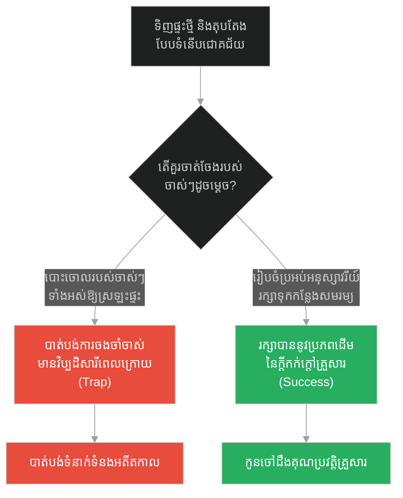
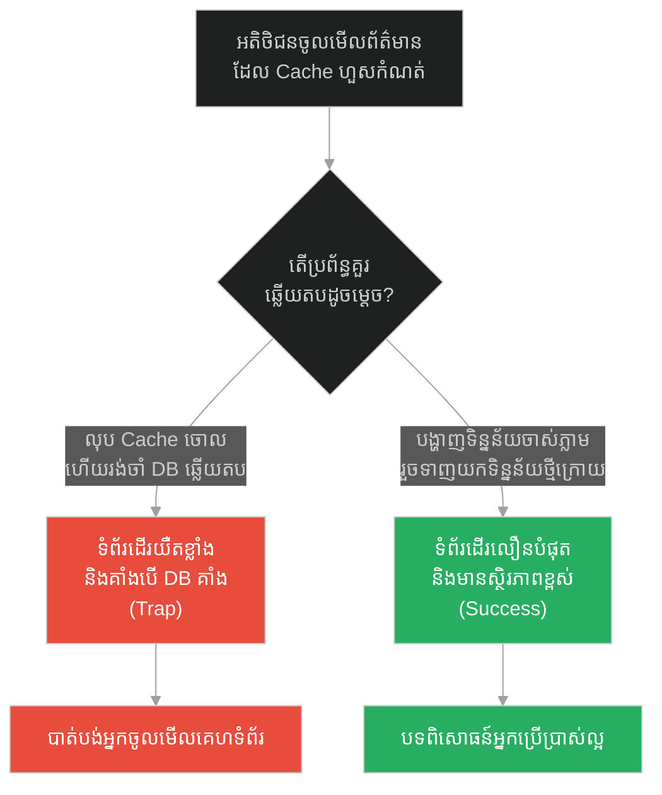
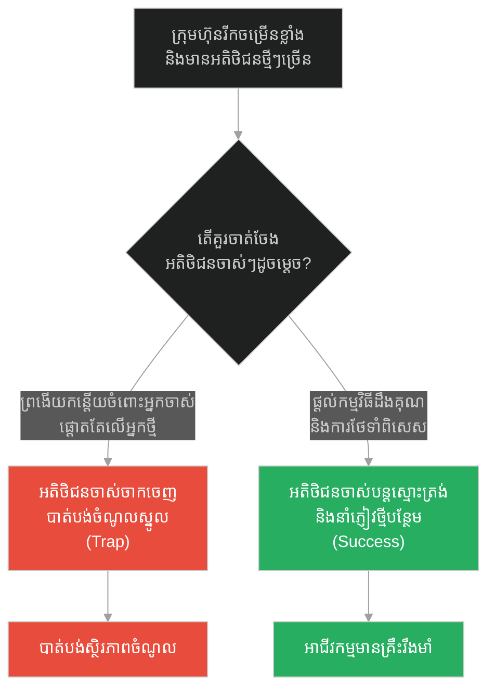
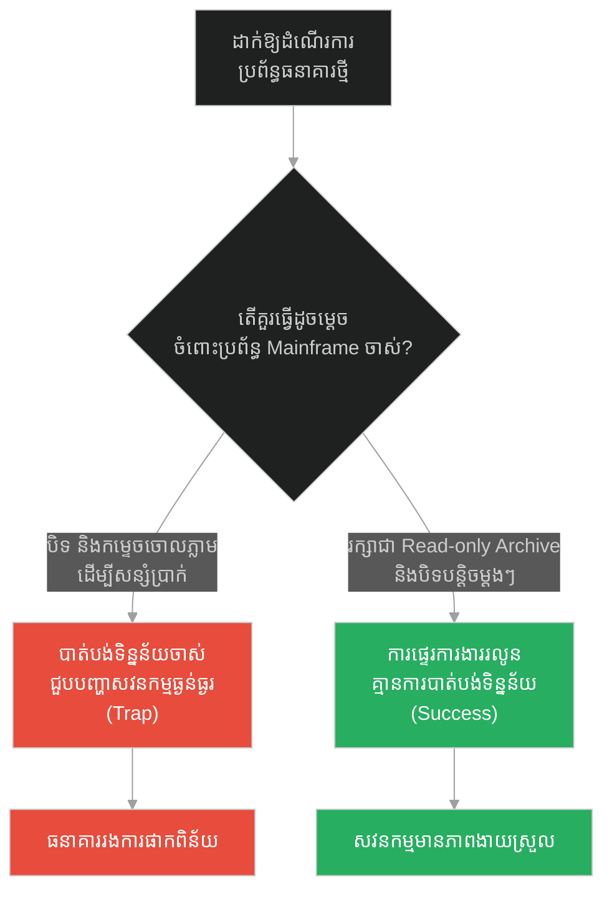
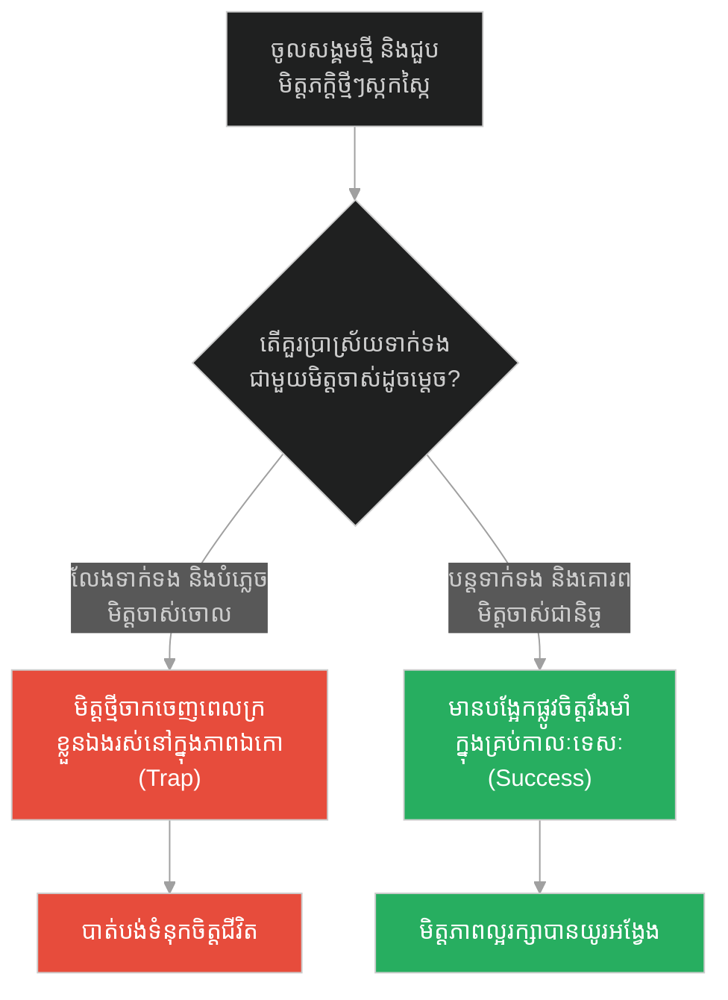
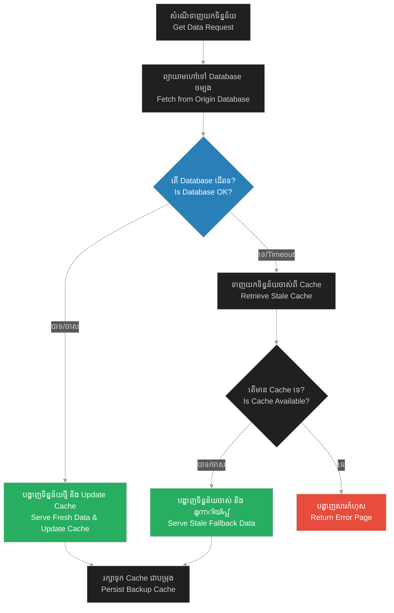

# Stale Cache Preservation & Legacy Support (ការរក្សាទុកទិន្នន័យបណ្តោះអាសន្នចាស់ និងការគាំទ្រប្រព័ន្ធចាស់)៖ ដើមល្មើទ្រហោយំ និងការរក្សាតម្លៃអតីតកាល (Stale Cache Preservation & Legacy Support & Prophet and the Date Palm Tree)

**Author:** ichamrong  
**Date:** 2026-05-28  
**Tags:** #caching #stale-while-revalidate #legacy-support #resilience #system-design #prophet-muhammad  
**Category:** Concepts  
**Read Time:** ~15 min  

---

## 📌 មាតិកា (Table of Contents)
- [អន្ទាក់ផ្លូវចិត្ត (The Trap)](#0)
- [១. រឿងព្រេងនិទាន៖ ដើមល្មើទ្រហោយំ (The Legend of the Crying Date Palm)](#1)
  - [កិត្តិយស និងការរក្សាតម្លៃអតីតកាល (Honor & Continuity)](#1-1)
- [២. បញ្ហា៖ ការរក្សាទុកទិន្នន័យចាស់ និងការគាំទ្រប្រព័ន្ធចាស់ (The Issue: Stale Cache Preservation & Legacy Support)](#2)
- [៣. ឧទាហមណ៍ជាក់ស្តែងក្នុងពិភពពិត (Real World Examples)](#3)
  - [ឧទាហរណ៍ទី ១ — កម្រិតស្រាល (គ្រួសារ)៖ ការរក្សាទុកវត្ថុអនុស្សាវរីយ៍ចាស់ៗរបស់គ្រួសារ (The Family Memory Box)](#3-1)
  - [ឧទាហរណ៍ទី ២ — កម្រិតមធ្យម (បច្ចេកទេស)៖ យន្តការ Stale-While-Revalidate ក្នុង Web Cache (The Tech HTTP Cache)](#3-2)
  - [ឧទាហរណ៍ទី ៣ — កម្រិតមធ្យម (ធុរកិច្ច)៖ ការថែរក្សាអតិថិជនចាស់ៗ និងស្មោះត្រង់ (The Business Loyal Clients)](#3-3)
  - [ឧទាហរណ៍ទី ៤ — កម្រិតមធ្យម (សង្គម/គ្រប់គ្រង)៖ ការគ្រប់គ្រងការផ្ទេរប្រព័ន្ធ Legacy (The Management Mainframe Archive)](#3-4)
  - [ឧទាហរណ៍ទី ៥ — កម្រិតធ្ងន់ (ទំនាក់ទំនង)៖ ភាពស្មោះត្រង់ចំពោះមិត្តចាស់នៅពេលមានមិត្តថ្មី (The Relationship Old Friends)](#3-5)
- [៤. ដំណោះស្រាយទូទៅ៖ ការរក្សាទុកទិន្នន័យបម្រុង និងការគាំទ្រ Legacy API (The General Solution: Stale-if-Error Pattern)](#4)
- [សេចក្តីសន្និដ្ឋាន (Conclusion)](#5)
- [ឯកសារយោង (References)](#6)
- [Related Posts](#7)

---

<a id="0"></a>
## អន្ទាក់ផ្លូវចិត្ត (The Trap)

នៅពេលដែលយើងមានរបស់ថ្មី ប្រព័ន្ធថ្មី ឬបច្ចេកវិទ្យាថ្មីដែលល្អជាងមុន តើយើងគួរតែកម្ទេច ឬបោះបង់របស់ចាស់ចោលភ្លាមៗ ឬត្រូវចេះរក្សាទុកវាជាបម្រុង (Fallback) សម្រាប់ការពារករណីអាសន្ន?

* **ការបោះបង់របស់ចាស់ដោយមិនលិបល (The Legacy Invalidation Trap)** — ការបំផ្លាញចោលប្រព័ន្ធចាស់ ឬទិន្នន័យចាស់ចោលទាំងស្រុងដោយគិតថាលែងមានប្រយោជន៍ ដែលនាំឱ្យប្រព័ន្ធគ្មានជម្រើសបម្រុងនៅពេលប្រព័ន្ធថ្មីជួបបញ្ហាគាំង។
* **ការឱបក្រសោបរបស់ចាស់សម្រាប់សង្គ្រោះអាសន្ន (The Stale Preservation)** — ការរក្សាទុករបស់ចាស់ កូដចាស់ ឬទិន្នន័យចាស់ (Stale Cache) ឱ្យនៅមានដំណើរការ ដើម្បីធានាបាននូវការរស់រាន និងលំនឹងប្រព័ន្ធនៅពេលប្រភពចម្បងជួបវិបត្តិ។

រឿងរ៉ាវនៃ «ដើមល្មើទ្រហោយំ» នឹងលាតត្រដាងនូវគំនិត **Stale Cache Preservation** និង **Legacy Support** ក្នុងប្រព័ន្ធស្មុគស្មាញ និងជីវិត។

1. **រឿងព្រេងនិទាន (The Legend)** — គល់ដើមល្មើចាស់យំស្រែកខ្សឹកខ្សួលដោយសារតែព្យាការីលែងឈរផ្អែកលើវា ហើយលោកក៏ចុះមកឱបវាដើម្បីលួងលោម។
2. **បញ្ហា (The Issue)** — ការគាំងប្រព័ន្ធទាំងស្រុងដោយសារការ Purge Cache ឬសម្លាប់ Legacy code ចោល ខណៈពេល Database កំពុងគាំង។
3. **ឧទាហមណ៍ជាក់ស្តែង (Real World Examples)** — ការអនុវត្តយុទ្ធសាស្ត្រ ៥ កម្រិត ពីវត្ថុអនុស្សាវរីយ៍គ្រួសាររហូតដល់ប្រព័ន្ធ Web Caching។
4. **ដំណោះស្រាយទូទៅ (The General Solution)** — ការប្រើប្រាស់គំរូ Stale-While-Revalidate និង Stale-if-Error។

---

<a id="1"></a>
## ១. រឿងព្រេងនិទាន៖ ដើមល្មើទ្រហោយំ (The Legend of the Crying Date Palm)

នៅក្នុងព្រះវិហារឥស្លាមដំបូងបង្អស់នៅទីក្រុងម៉ាឌីណា មានគល់ដើមល្មើចាស់មួយដើម ដែលព្យាការីម៉ូហាម៉ាត់តែងតែឈរផ្អែកខ្នងទៅលើវា នៅពេលដែលលោកកំពុងទេសនាបង្រៀនប្រជាជន។ មានព្រឹត្តិការណ៍ដ៏គួរឱ្យភ្ញាក់ផ្អើលមួយត្រូវបានកត់ត្រាក្នុងប្រវត្តិសាស្ត្រ៖

> *«ដោយសារតែចំនួនអ្នកមកស្តាប់ធម៌កើនឡើងកាន់តែច្រើន សាវ័កក៏បានសម្រេចចិត្តសាងសង់វេទិកាឈើ (Minbar) ថ្មីមួយដែលមានកាំជណ្តើរខ្ពស់ជាងមុន ដើម្បីឱ្យលោកឈរទេសនាទៅ មនុស្សគ្រប់គ្នាអាចមើលឃើញលោកច្បាស់។*
>
> *នៅថ្ងៃសុក្របន្ទាប់ ព្យាការីម៉ូហាម៉ាត់បានដើរហួសគល់ល្មើចាស់នោះ ហើយឡើងទៅឈរលើវេទិកាថ្មី។ ភ្លាមៗនោះ អ្នកដែលនៅក្នុងព្រះវិហារទាំងអស់ស្រាប់តែឮសម្លេងយំខ្សឹកខ្សួលយ៉ាងខ្លាំង ស្រដៀងនឹងសម្លេងទារក ឬសម្លេងសត្វអូដ្ឋដែលកំពុងនឹកកូន។ សម្លេងយំនោះគឺលឺចេញមកពី **គល់ដើមល្មើចាស់** ដែលត្រូវបានគេទុកចោលនោះឯង។*
>
> *ព្យាការីម៉ូហាម៉ាត់បានចុះពីលើវេទិកាវិញ ដើរទៅរកគល់ឈើនោះ រួចឱបវា និងអង្អែលវាថ្នមៗដើម្បីលួងលោម រហូតទាល់តែសម្លេងយំនោះស្ងាត់ទៅវិញ។ លោកបានមានប្រសាសន៍ថា៖ "វាបានយំដោយសារតែវានឹកដល់ការស្តាប់ធម៌ ដែលធ្លាប់ឮនៅក្បែរវាកាលពីមុន។" បន្ទាប់មកលោកបានបញ្ជាឱ្យគេយកគល់ឈើនោះទៅកប់ទុកនៅក្រោមវេទិកាថ្មី ដើម្បីរក្សាកិត្តិយស និងកេរ្តិ៍ឈ្មោះរបស់វាជារៀងរហូត។»* (សាហ៊ី អាល់ប៊ូខារី ៣៥៨៤)

<a id="1-1"></a>
### កិត្តិយស និងការរក្សាតម្លៃអតីតកាល (Honor & Continuity)

ទោះបីជាវេទិកាថ្មីផ្តល់នូវមុខងារល្អជាងមុន (កាំជណ្តើរខ្ពស់ ងាយស្រួលមើលឃើញ) ក៏ព្យាការីម៉ូហាម៉ាត់មិនបានបំផ្លាញ ឬទាត់ចោលគល់ល្មើចាស់នោះឡើយ។ ការចុះទៅឱបលួងលោម និងការយកវាទៅរក្សាទុកក្រោមវេទិកា គឺជាការគោរពដល់គុណបំណាច់អតីតកាល (Legacy Support)។ នៅក្នុងការរចនាប្រព័ន្ធ គល់ឈើចាស់នោះគឺដូចជា **Stale Cache** ឬ **Legacy system**។ ទោះបីយើងសង់ប្រព័ន្ធថ្មីដ៏ស្អាតក៏ដោយ ក៏យើងមិនត្រូវកាត់ផ្តាច់ប្រព័ន្ធចាស់ចោលទាំងស្រុងដោយគ្មានការសម្របសម្រួលនោះទេ ព្រោះប្រព័ន្ធចាស់ធ្លាប់ជាគ្រឹះទ្រទ្រង់ការងាររបស់យើង។

---

<a id="2"></a>
## ២. បញ្ហា៖ ការរក្សាទុកទិន្នន័យចាស់ និងការគាំទ្រប្រព័ន្ធចាស់ (The Issue: Stale Cache Preservation & Legacy Support)

នៅក្នុងការរចនាប្រព័ន្ធផ្ទុកទិន្នន័យបណ្តោះអាសន្ន (Caching) កំហុសដ៏ធំបំផុតគឺការកំណត់ឱ្យប្រព័ន្ធត្រូវតែ Purge/Delete ទិន្នន័យចាស់ចោលភ្លាមៗនៅពេលវាហួសកំណត់ (Expiration)។ ប្រសិនបើ Database ចម្បងគាំងភ្លាមៗក្នុងពេលនោះ នោះ Server នឹងគ្មានទិន្នន័យអ្វីសម្រាប់បង្ហាញឡើយ ហើយនឹងបង្ហាញសារកំហុស (HTTP 500) ទៅកាន់អ្នកប្រើប្រាស់។ យុទ្ធសាស្ត្រ **Stale-if-Error** ណែនាំឱ្យរក្សាទុកទិន្នន័យចាស់ (Stale Cache) នៅក្នុងប្រព័ន្ធ ហើយនៅពេលដែល Database ជួបបញ្ហា យើងសុខចិត្តផ្ញើទិន្នន័យចាស់នោះទៅឱ្យអ្នកប្រើប្រាស់ជាជាងការបោះសារកំហុស។

ខាងក្រោមនេះជាកូដ Python ប្រៀបធៀបរវាងការគ្រប់គ្រង Cache បែបងាយរងគ្រោះ (Fragile) និងការប្រើប្រាស់ Stale Cache (Resilient)៖

### ❌ ការអនុវត្តបែបផុយស្រួយ (Fragile Implementation - Active Eviction)
ប្រព័ន្ធលុបទិន្នន័យចាស់ចោលភ្លាមៗ ធ្វើឱ្យគាំងទំព័រដើមទាំងស្រុងនៅពេល Database ចម្បងជួបបញ្ហាគាំងបណ្តោះអាសន្ន។

```python
# fragile_cache.py
import requests

class ProductCache:
    def __init__(self):
        self.store = {}

    def get(self, product_id):
        # ទាញយកទិន្នន័យពី Cache
        return self.store.get(product_id)

    def set(self, product_id, data):
        self.store[product_id] = data

cache = ProductCache()

def get_product_page(product_id):
    # ព្យាយាមទាញយកពី DB ព្រោះ Cache ត្រូវបានលុបចោលពេលហួសកំណត់
    try:
        response = requests.get(f"http://database.internal/products/{product_id}", timeout=1.0)
        data = response.json()
        cache.set(product_id, data)
        return {"status": 200, "data": data}
    except Exception:
        # DB គាំង គ្មានទិន្នន័យបម្រុង គាំងទំព័រទាំងស្រុង
        return {"status": 500, "error": "Database Down. No fallback available."}
```

###  ការអនុវត្តប្រកបដោយភាពធន់ (Resilient Implementation - Stale Cache Fallback)
ប្រព័ន្ធរក្សាទុកទិន្នន័យចាស់ (Stale Cache) ទោះជាហួសពេលកំណត់ក៏ដោយ។ ប្រសិនបើ DB គាំង វានឹងឱបគល់ល្មើចាស់ ដោយប្រគល់ទិន្នន័យចាស់នោះទៅកាន់អតិថិជនជាបណ្តោះអាសន្ន។

```python
# resilient_cache.py
import requests
import logging

class ResilientCache:
    def __init__(self):
        # រក្សាទុកទាំងទិន្នន័យ និងសញ្ញាសម្គាល់ស្ថានភាពចាស់ (stale status)
        self.store = {}

    def get(self, product_id):
        return self.store.get(product_id)

    def set(self, product_id, data):
        # រក្សាទុកជានិច្ច គ្មានការលុបចោលដោយបង្ខំឡើយ
        self.store[product_id] = data

resilient_cache = ResilientCache()

def get_product_page_resilient(product_id):
    try:
        # ព្យាយាមទាញយកពី DB ចម្បង
        response = requests.get(f"http://database.internal/products/{product_id}", timeout=1.0)
        if response.status_code == 200:
            data = response.json()
            resilient_cache.set(product_id, data)
            return {"status": 200, "data": data, "source": "origin"}
    except Exception as e:
        # យន្តការឱបគល់ល្មើចាស់៖ DB គាំង ព្យាយាមទាញយកទិន្នន័យចាស់ពី Cache មកប្រើ
        logging.warning(f"Database down: {str(e)}. Serving stale cache fallback data.")
        stale_data = resilient_cache.get(product_id)
        
        if stale_data:
            return {
                "status": 200, 
                "data": stale_data, 
                "source": "stale_cache_fallback",
                "warning": "ទិន្នន័យនេះមិនទាន់សម័យចុងក្រោយទេ តែត្រូវបានរក្សាទុកសម្រាប់សង្គ្រោះអាសន្ន។"
            }
            
        return {"status": 500, "error": "Database Down & No Stale Cache Data Available."}
```

---

<a id="3"></a>
## ៣. ឧទាហមណ៍ជាក់ស្តែងក្នុងពិភពពិត (Real World Examples)

<a id="3-1"></a>
### ឧទាហរណ៍ទី ១ — កម្រិតស្រាល (គ្រួសារ)៖ ការរក្សាទុកវត្ថុអនុស្សាវរីយ៍ចាស់ៗរបស់គ្រួសារ (The Family Memory Box)
ការទិញផ្ទះថ្មីដ៏ទំនើប រួចសម្រេចចិត្តបោះចោលរាល់របស់លេងចាស់ៗ សៀវភៅកំណត់ហេតុ និងអាល់ប៊ុមរូបថតគ្រួសារចាស់ៗចោល (Invalidation) នឹងធ្វើឱ្យយើងបាត់បង់ការចងចាំដ៏មានតម្លៃ។ ការបង្កើតប្រអប់អនុស្សាវរីយ៍ (Memory Box) ជួយរក្សាតម្លៃអតីតកាលសម្រាប់កូនចៅជំនាន់ក្រោយ។



---

<a id="3-2"></a>
### ឧទាហរណ៍ទី ២ — កម្រិតមធ្យម (បច្ចេកទេស)៖ យន្តការ Stale-While-Revalidate ក្នុង Web Cache (The Tech HTTP Cache)
នៅពេលអតិថិជនបើកមើលគេហទំព័រព័ត៌មាន ប្រសិនបើ Cache ត្រូវបានលុបចោលរាល់ពេលផុតកំណត់ វានឹងធ្វើឱ្យទំព័រដំណើរការយឺត។ ការប្រើប្រាស់ **Stale-While-Revalidate** ជួយឱ្យប្រព័ន្ធបង្ហាញទិន្នន័យចាស់ភ្លាមៗទៅកាន់អ្នកអាន រួចដំណើរការផ្ទៀងផ្ទាត់ទិន្នន័យថ្មីនៅខាងក្រោយដោយស្ងៀមស្ងាត់។



---

<a id="3-3"></a>
### ឧទាហរណ៍ទី ៣ — កម្រិតមធ្យម (ធុរកិច្ច)៖ ការថែរក្សាអតិថិជនចាស់ៗ និងស្មោះត្រង់ (The Business Loyal Clients)
ក្រុមហ៊ុនដែលផ្តោតការយកចិត្តទុកដាក់តែលើអតិថិជនថ្មីៗដែលទើបចុះឈ្មោះ និងមិនខ្វល់ពីការថែទាំអតិថិជនចាស់ៗដែលធ្លាប់គាំទ្រតាំងពីបង្កើតដំបូង នឹងធ្វើឱ្យអតិថិជនចាស់ចាកចេញ។ ការផ្តល់សេវាកម្ម និងកម្មវិធីដឹងគុណដល់អតិថិជនចាស់ៗ ធានាបាននូវលំហូរចំណូលមានស្ថិរភាព។



---

<a id="3-4"></a>
### ឧទាហរណ៍ទី ៤ — កម្រិតមធ្យម (សង្គម/គ្រប់គ្រង)៖ ការគ្រប់គ្រងការផ្ទេរប្រព័ន្ធ Legacy (The Management Mainframe Archive)
នៅក្នុងស្ថាប័នធនាគារ ការបិទម៉ាស៊ីន Mainframe ចាស់ភ្លាមៗនៅថ្ងៃដែលប្រព័ន្ធ Cloud ថ្មីដាក់ឱ្យដំណើរការ គឺជាហានិភ័យមហន្តរាយ។ ការរក្សាទុកប្រព័ន្ធចាស់ជាបណ្ណសារសម្រាប់ត្រួតពិនិត្យ (Read-only Archive) ជួយឱ្យការផ្ទេរប្រព្រឹត្តទៅដោយគ្មានហានិភ័យគណនេយ្យ។



---

<a id="3-5"></a>
### ឧទាហរណ៍ទី ៥ — កម្រិតធ្ងន់ (ទំនាក់ទំនង)៖ ភាពស្មោះត្រង់ចំពោះមិត្តចាស់នៅពេលមានមិត្តថ្មី (The Relationship Old Friends)
មនុស្សដែលចោលមិត្តចាស់ចោលទាំងស្រុង (Ghosting) នៅពេលខ្លួនចូលទៅរស់នៅក្នុងសង្គមថ្មី ឬជួបមិត្តភក្តិថ្មីៗដែលហឺហារជាងមុន នឹងក្លាយជាមនុស្សឯកោនៅពេលជួបវិបត្តិជីវិត។ មិត្តចាស់ដែលស្គាល់គ្នាតាំងពីក្រីក្រ គឺជាគ្រឹះបង្អែកដ៏រឹងមាំបំផុតក្នុងជីវិត។



---

<a id="4"></a>
## ៤. ដំណោះស្រាយទូទៅ៖ ការរក្សាទុកទិន្នន័យបម្រុង និងការគាំទ្រ Legacy API (The General Solution: Stale-if-Error Pattern)

ដើម្បីអនុវត្តយុទ្ធសាស្ត្រ «ឱបគល់ល្មើចាស់» ក្នុងការគ្រប់គ្រងប្រព័ន្ធបច្ចេកវិទ្យា និងអាជីវកម្ម យើងត្រូវបង្កើតលំនាំ **Stale preservation loop** ដូចខាងក្រោម៖

1. **ការរក្សាទុកទិន្នន័យបម្រុង (Persist Cache Backup)** — រក្សាទុកទិន្នន័យចុងក្រោយដែលទទួលបានជោគជ័យជានិច្ច (Never delete fallbacks aggressively)។
2. **ការត្រួតពិនិត្យភាពអាចប្រើប្រាស់បាន (Check Upstream Availability)** — ព្យាយាមទាញយកទិន្នន័យថ្មីពី Database ចម្បង (Origin)។
3. **យន្តការដោះស្រាយបញ្ហា (Trigger Fallback on Error)** — ប្រសិនបើប្រភពចម្បងគាំង ត្រូវប្តូរទិសដៅភ្លាមៗទៅកាន់ Cache ចាស់ ដើម្បីបង្ហាញព័ត៌មានជាបណ្តោះអាសន្ន។
4. **ការធ្វើបច្ចុប្បន្នភាពនៅខាងក្រោយ (Asynchronous Revalidation)** — នៅពេលប្រព័ន្ធចម្បងងើបឡើងវិញ ដំណើរការ Update Cache ឡើងវិញដោយមិនរំខានដល់អ្នកប្រើប្រាស់។



---

## 🐇 ធ្លាក់ចូលក្នុងរន្ធទន្សាយ (Enter the Rabbit Hole)
ដើម្បីស្វែងយល់ពីរបៀបដែលយើងអាចប្រាស្រ័យទាក់ទង និងផ្តល់សារណែនាំដល់អ្នកប្រើប្រាស់ដោយទន់ភ្លន់ និងរាក់ទាក់បំផុត ជំនួសឱ្យការបោះសារកំហុសបច្ចេកទេសដ៏គួរឱ្យខ្លាច ដូចជាការជួយកែតម្រូវទង្វើខុសឆ្គងដោយសន្តិវិធី សូមបន្តដំណើរទៅកាន់៖

* 🚀 **[ចាប់ផ្តើមដំណើររុករក (Start the Journey) ➔ Friendly User Error Messages & Soft Validation៖ ជនជាតិបេឌូអ៊ីនក្នុងវិហារ និងការដោះស្រាយកំហុសដោយការអប់រំ](./208-prophet-and-the-bedouin-in-mosque.md)**

---

<a id="5"></a>
## សេចក្តីសន្និដ្ឋាន (Conclusion)

> **«កុំបំផ្លាញគល់ឈើចាស់ចោល នៅពេលដែលអ្នកបានឈរនៅលើវេទិកាថ្មីដ៏ស្កកស្កៃ ព្រោះនៅក្នុងគ្រាអាសន្ន គល់ឈើចាស់នោះហើយគឺជាទីបង្អែកតែមួយគត់របស់អ្នក។»**

ការឱបលួងលោមគល់ដើមល្មើចាស់របស់ព្យាការីម៉ូហាម៉ាត់ បង្រៀនយើងនូវសច្ចធម៌ដ៏ស៊ីជម្រៅ៖ ស្ថិរភាព និងភាពធន់នៃប្រព័ន្ធ ឬជីវិត គឺស្ថិតនៅលើការចេះគោរព និងរក្សាទុកតម្លៃអតីតកាល (Legacy Support & Caching fallbacks)។ ការអនុវត្តយន្តការ Stale Cache Fallback មិនមែនជាការរក្សាភាពយឺតយ៉ាវនោះទេ ប៉ុន្តែវាជាការធានានូវសន្តិសុខ និងលំនឹងរឹងមាំបំផុតសម្រាប់គ្រប់ស្ថានភាពទាំងអស់។

---

<a id="6"></a>
## ឯកសារយោង (References)

* **Sahih al-Bukhari Hadith 3584** — *The Miracle of the Crying Palm Trunk* (Book of Virtues).
* **RFC 5861** — *HTTP Cache-Control Extensions for Stale-While-Revalidate and Stale-If-Error* (ietf.org).
* **Legacy System Modernization** — Guidelines by the Software Engineering Institute (SEI) on preserving legacy integration adapters.

---

<a id="7"></a>
## Related Posts

* [Zero-downtime Deployments & Gentle Evictions (ការដាក់ឱ្យប្រើប្រាស់ដោយគ្មានការរំខាន និងការផ្លាស់ទីដោយថ្នមៗ)៖ ឆ្មាកំពុងដេក និងការមិនរំខានដល់ដំណើរការចាស់](./206-prophet-and-the-sleeping-cat.md)
* [Friendly User Error Messages & Soft Validation (សារកំហុសរាក់ទាក់ចំពោះអ្នកប្រើប្រាស់ និងការផ្ទៀងផ្ទាត់កម្រិតស្រាល)៖ ជនជាតិបេឌូអ៊ីនក្នុងវិហារ និងការដោះស្រាយកំហុសដោយការអប់រំ](./208-prophet-and-the-bedouin-in-mosque.md)
