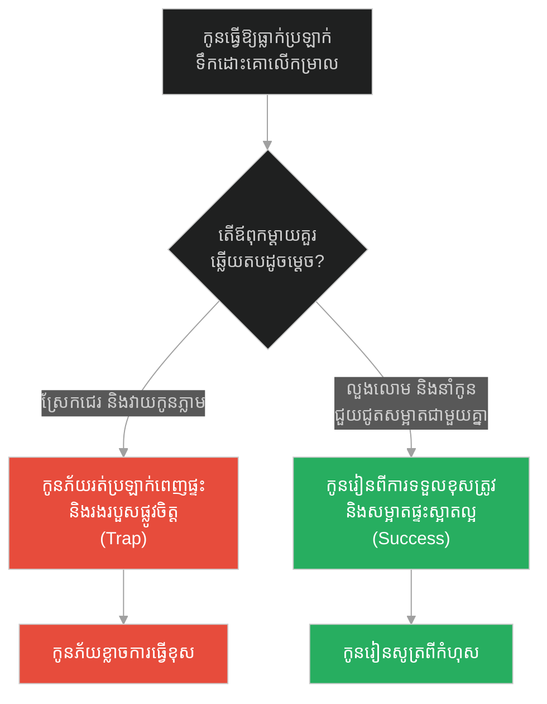
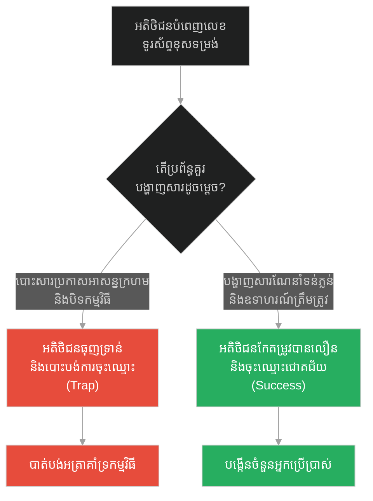
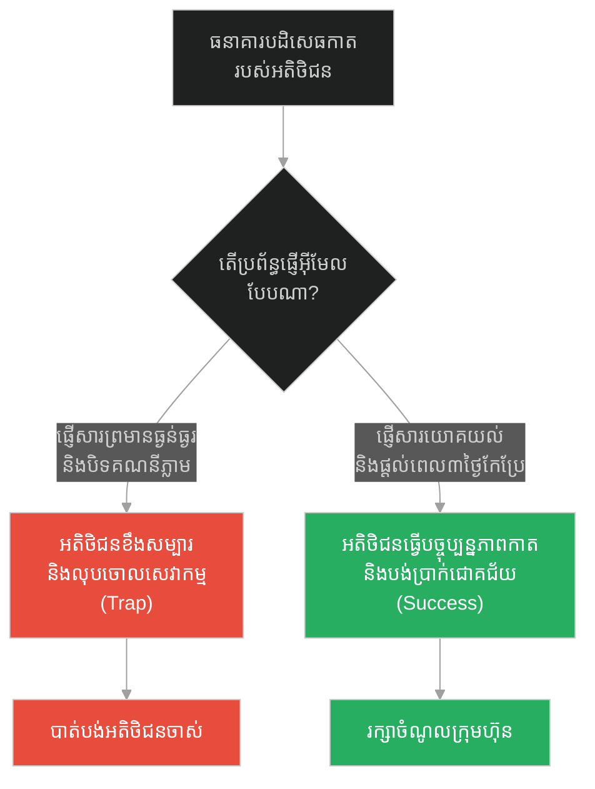
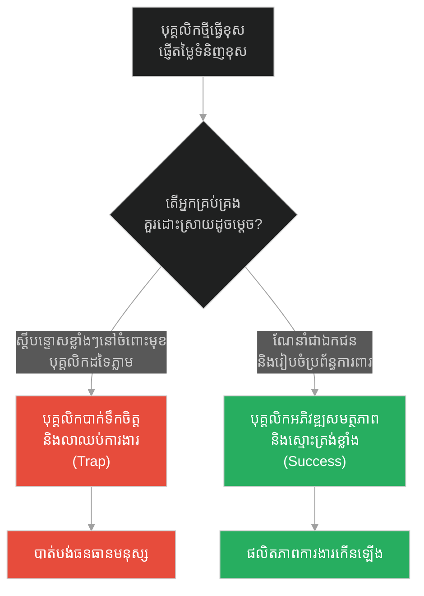
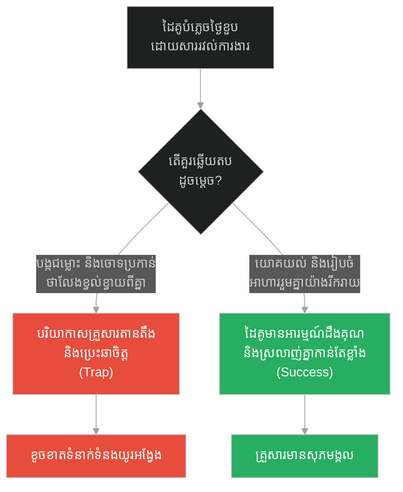
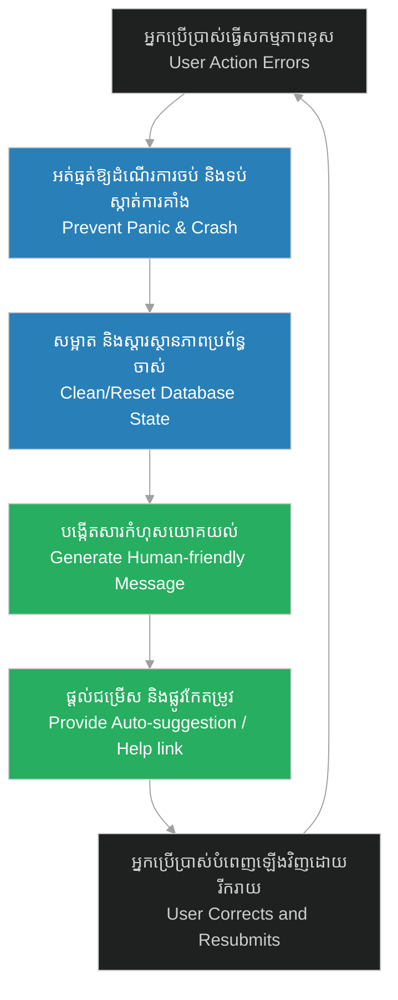

# Friendly User Error Messages & Soft Validation (សារកំហុសរាក់ទាក់ចំពោះអ្នកប្រើប្រាស់ និងការផ្ទៀងផ្ទាត់កម្រិតស្រាល)៖ ជនជាតិបេឌូអ៊ីនក្នុងវិហារ និងការដោះស្រាយកំហុសដោយការអប់រំ (Friendly User Error Messages & Soft Validation & Prophet and the Bedouin in the Mosque)

**Author:** ichamrong  
**Date:** 2026-05-28  
**Tags:** #error-handling #ux-design #validation #soft-validation #de-escalation #prophet-muhammad  
**Category:** Concepts  
**Read Time:** ~15 min  

---

## 📌 មាតិកា (Table of Contents)
- [អន្ទាក់ផ្លូវចិត្ត (The Trap)](#0)
- [១. រឿងព្រេងនិទាន៖ បេឌូអ៊ីននោមក្នុងវិហារ (The Legend of the Bedouin in the Mosque)](#1)
  - [យុទ្ធសាស្ត្រមិនកាត់ផ្តាច់ដំណើរការកណ្តាលទី (Non-disruption of Error Flow)](#1-1)
- [២. បញ្ហា៖ សារកំហុសរាក់ទាក់ និងការផ្ទៀងផ្ទាត់កម្រិតស្រាល (The Issue: Friendly User Error Messages & Soft Validation)](#2)
- [៣. ឧទាហមណ៍ជាក់ស្តែងក្នុងពិភពពិត (Real World Examples)](#3)
  - [ឧទាហរណ៍ទី ១ — កម្រិតស្រាល (គ្រួសារ)៖ កូនធ្វើឱ្យធ្លាក់បែកវត្ថុប្រើប្រាស់ (The Family Accidental Spill)](#3-1)
  - [ឧទាហរណ៍ទី ២ — កម្រិតមធ្យម (បច្ចេកទេស)៖ ការផ្ទៀងផ្ទាត់ទម្រង់ចុះឈ្មោះ (The Tech Form Validation)](#3-2)
  - [ឧទាហរណ៍ទី ៣ — កម្រិតមធ្យម (ធុរកិច្ច)៖ ការទូទាត់ប្រាក់មិនជោគជ័យ (The Business Declined Card)](#3-3)
  - [ឧទាហរណ៍ទី ៤ — កម្រិតមធ្យម (សង្គម/គ្រប់គ្រង)៖ បុគ្គលិកធ្វើការខុសឆ្គងផ្នែកលក់ (The Management Staff Mistake)](#3-4)
  - [ឧទាហរណ៍ទី ៥ — កម្រិតធ្ងន់ (ទំនាក់ទំនង)៖ ដៃគូបំភ្លេចថ្ងៃខួបកំណើត (The Relationship Forgotten Date)](#3-5)
- [៤. ដំណោះស្រាយទូទៅ៖ ការរចនាសារកំហុសបែបស្ថាបនា និងការណែនាំ (The General Solution: Friendly Error Architecture)](#4)
- [សេចក្តីសន្និដ្ឋាន (Conclusion)](#5)
- [ឯកសារយោង (References)](#6)
- [Related Posts](#7)

---

<a id="0"></a>
## អន្ទាក់ផ្លូវចិត្ត (The Trap)

នៅពេលដែលអ្នកប្រើប្រាស់ ឬសមាជិកក្នុងប្រព័ន្ធធ្វើខុសដោយអចេតនា តើយើងគួរតែស្រែកតបត ឬបោះសារកំហុសគួរឱ្យខ្លាច (Screaming Cryptic Errors) ឬត្រូវពន្យល់ណែនាំដោយទន់ភ្លន់ និងរាក់ទាក់ដើម្បីជួយពួកគេដោះស្រាយ?

* **ការបោះសារកំហុសគំរាមកំហែង (The Hostile Error Trap)** — ការបង្ហាញកូដបច្ចេកទេសដ៏សាហាវ ឬការស្រែកបន្ទោសបង្កាច់បង្ខូច ដែលធ្វើឱ្យអ្នកប្រើប្រាស់ភ័យស្លន់ស្លោ និងចាកចេញពីប្រព័ន្ធរបស់យើង។
* **ការអប់រំ និងការផ្ទៀងផ្ទាត់ទន់ភ្លន់ (The Soft Validation)** — ការអត់ធ្មត់អនុញ្ញាតឱ្យពួកគេបញ្ចប់សកម្មភាព រួចផ្តល់សារណែនាំច្បាស់លាស់ពីរបៀបកែតម្រូវកំហុសឱ្យបានត្រឹមត្រូវ និងងាយស្រួល។

រឿងរ៉ាវនៃ «ជនជាតិបេឌូអ៊ីនក្នុងវិហារ» នឹងឆ្លុះបញ្ចាំងពីយុទ្ធសាស្ត្រ **Friendly User Error Messages** និង **Soft Validation** ក្នុងការរចនាប្រព័ន្ធ និងសង្គម។

1. **រឿងព្រេងនិទាន (The Legend)** — ព្យាការីម៉ូហាម៉ាត់រារាំងសាវ័កមិនឱ្យវាយជនជាតិបេឌូអ៊ីនដែលនោមក្នុងវិហារ និងលាងសម្អាតដោយទឹកមួយធុង។
2. **បញ្ហា (The Issue)** — បញ្ហាធ្លាយព័ត៌មានសុវត្ថិភាព និងការបាត់បង់អតិថិជនដោយសារសារកំហុស (Screaming Error Responses)។
3. **ឧទាហមណ៍ជាក់ស្តែង (Real World Examples)** — ការគ្រប់គ្រង ៥ កម្រិត ពីគ្រួសាររហូតដល់ការរចនា UX នៃប្រព័ន្ធបច្ចេកវិទ្យា។
4. **ដំណោះស្រាយទូទៅ (The General Solution)** — ការកសាងស្ថាបត្យកម្មគ្រប់គ្រងកំហុសបែបស្ថាបនា។

---

<a id="1"></a>
## ១. រឿងព្រេងនិទាន៖ បេឌូអ៊ីននោមក្នុងវិហារ (The Legend of the Bedouin in the Mosque)

នៅក្នុង Hadith មានរឿងរ៉ាវល្បីល្បាញបំផុតមួយអំពីវិធីសាស្ត្របង្រៀន និងភាពអត់ធ្មត់ដ៏ខ្ពង់ខ្ពស់របស់ព្យាការីម៉ូហាម៉ាត់ចំពោះកំហុសឆ្គងដែលកើតពីភាពល្ងង់ខ្លៅ៖

> *«ថ្ងៃមួយ ខណៈពេលដែលព្យាការីម៉ូហាម៉ាត់ និងសាវ័កកំពុងគង់នៅក្នុងវិហារ ស្រាប់តែមានបុរសវាលខ្សាច់ម្នាក់ (Bedouin) ដើរចូលមក។ បុរសនោះមិនយល់ពីវិន័យ និងកិត្តិយសនៃវិហារឡើយ គាត់ក៏បានដើរទៅជ្រុងមួយ ហើយឈរនោមដាក់ដីព្រះវិហារយ៉ាងរំភើយ។*
>
> *អ្នកសាវ័កដែលនៅទីនោះឃើញហើយ ក៏ខឹងសម្បារយ៉ាងខ្លាំង ហើយបានក្រោកឈររៀបនឹងស្ទុះទៅវាយដំ និងស្រែកបណ្តេញបុរសនោះ។ ប៉ុន្តែ ព្យាការីម៉ូហាម៉ាត់បានប្រញាប់ឃាត់សាវ័កទាំងអស់ភ្លាមៗ ដោយមានប្រសាសន៍ថា៖ **"ទុកឱ្យគាត់នៅស្ងៀមសិនចុះ កុំរំខានគាត់ (Let him finish his urination)!"***
>
> *បន្ទាប់ពីបុរសនោះបាននោមរួចរាល់ ព្យាការីបានហៅគាត់មកជិត រួចពន្យល់ដោយក្តីមេត្តាថា៖ "ទីកន្លែងនេះគឺព្រះវិហារ វាមិនមែនសម្រាប់នោម ឬចោលសម្រាមឡើយ ប៉ុន្តែវាសម្រាប់អធិស្ឋាន និងការរំលឹកដល់ព្រះជាម្ចាស់។" បន្ទាប់មក លោកបានបញ្ជាឱ្យគេយកទឹកមួយធុងធំ ទៅចាក់លាងកន្លែងនោមនោះជាការស្រេច។»* (សាហ៊ី អាល់ប៊ូខារី ២២០)

<a id="1-1"></a>
### យុទ្ធសាស្ត្រមិនកាត់ផ្តាច់ដំណើរការកណ្តាលទី (Non-disruption of Error Flow)

ប្រសិនបើសាវ័កស្ទុះទៅវាយ ឬស្រែកគំរាមបុរសនោះពេលកំពុងនោម នោះគាត់ច្បាស់ជាភ័យរត់ផ្អើលពេញព្រះវិហារ ដែលធ្វើឱ្យទឹកនោមប្រឡាក់រាលដាលពាសពេញផ្ទៃដីកាន់តែធំជាងមុន និងបង្កឱ្យមានគ្រោះថ្នាក់ដល់សុខភាពគាត់ទៀតផង (នេះដូចជាការកាត់ផ្តាច់ Process កណ្តាលទីដែលធ្វើឱ្យ error កាន់តែធំ)។ ព្យាការីម៉ូហាម៉ាត់បានជ្រើសរើស៖
1. **អត់ធ្មត់ឱ្យចប់ដំណើរការ (Allow process completion)**
2. **សម្អាតកំហុសដោយស្ងាត់ស្ងៀម (Washing error - ទឹកមួយធុង)**
3. **អប់រំណែនាំដោយក្តីមេត្តា (Friendly Correction/Soft Validation)**

---

<a id="2"></a>
## ២. បញ្ហា៖ សារកំហុសរាក់ទាក់ និងការផ្ទៀងផ្ទាត់កម្រិតស្រាល (The Issue: Friendly User Error Messages & Soft Validation)

នៅក្នុងការរចនាប្រព័ន្ធព័ត៌មានវិទ្យា (System Design/UX) នៅពេលអ្នកប្រើប្រាស់បញ្ចូលព័ត៌មានខុស (ឧទាហរណ៍ អ៊ីមែលខុស ឬពាក្យសម្ងាត់ខ្សោយ) ការបោះសារកំហុសគួរឱ្យខ្លាច ដូចជា stack traces, database validation checks (`SQL STATE [23000] Constraint Violation`) ឬសារគម្រាមក្រហមងងឹត គឺជាការរចនាដ៏អាក្រក់។ វាមិនត្រឹមតែធ្វើឱ្យអ្នកប្រើប្រាស់ភ័យ និងយល់ច្រឡំនោះទេ ប៉ុន្តែវាក៏ជួយបង្ហើបពីព័ត៌មានផ្ទៃក្នុងម៉ាស៊ីន (Security Vulnerability) ទៅឱ្យ Hacker ផងដែរ។ ផ្ទុយទៅវិញ យើងត្រូវប្រើប្រាស់ **Soft Validation** និងសារណែនាំរាក់ទាក់ ដើម្បីប្រាប់ពីរបៀបបញ្ចូលព័ត៌មានឱ្យបានត្រឹមត្រូវ។

ខាងក្រោមនេះជាកូដប្រៀបធៀបសារកំហុសបែបគំរាមកំហែង និងសារកំហុសរាក់ទាក់បែបអប់រំ៖

### ❌ ការអនុវត្តបែបផុយស្រួយ (Fragile Implementation - Screaming Database Error)
ប្រព័ន្ធបោះកូដកំហុសបច្ចេកទេស និងទិន្នន័យ Database ផ្ទាល់ទៅកាន់អ្នកប្រើប្រាស់ ធ្វើឱ្យប៉ះពាល់ដល់ UX និងសុវត្ថិភាព។

```python
# fragile_validation.py
import traceback

def create_user_account_fragile(username, password):
    # ប្រសិនបើពាក្យសម្ងាត់ខ្សោយ បោះកំហុសបច្ចេកទេសភ្លាម (ស្រែកដាក់បេឌូអ៊ីន)
    if len(password) < 8:
        raise Exception(
            f"SYSTEM_DB_FATAL: Password constraint violated on DB_USER_TABLE! "
            f"Stacktrace: {traceback.format_exc()}"
        )
    return {"status": "SUCCESS"}
```

###  ការអនុវត្តប្រកបដោយភាពធន់ (Resilient Implementation - Friendly Error)
ប្រព័ន្ធផ្ទៀងផ្ទាត់ទន់ភ្លន់ និងផ្តល់សារណែនាំរាក់ទាក់ មានការណែនាំពីរបៀបកែតម្រូវច្បាស់លាស់ (ដូចទឹកមួយធុងលាងកំហុស)។

```python
# resilient_validation.py
def create_user_account_resilient(username, password):
    # យន្តការផ្ទៀងផ្ទាត់ទន់ភ្លន់ (Soft Validation)
    if len(password) < 8:
        return {
            "success": False,
            "error_type": "WEAK_PASSWORD",
            "message": (
                "សូមអភ័យទោស! ពាក្យសម្ងាត់របស់អ្នកហាក់ដូចជាខ្លីពេក។ "
                "ដើម្បីសុវត្ថិភាពគណនី សូមប្រើប្រាស់ពាក្យសម្ងាត់យ៉ាងតិច ៨តួអក្សរឡើងទៅ។"
            ),
            "guided_action": {
                "suggested_password_length": 12,
                "tip": "អ្នកអាចប្រើប្រាស់អក្សរធំ អក្សរតូច និងលេខបញ្ចូលគ្នា ដើម្បីបង្កើនសុវត្ថិភាព។"
            }
        }
        
    return {"success": True, "message": "គណនីរបស់អ្នកត្រូវបានបង្កើតជោគជ័យ!"}
```

---

<a id="3"></a>
## ៣. ឧទាហមណ៍ជាក់ស្តែងក្នុងពិភពពិត (Real World Examples)

<a id="3-1"></a>
### ឧទាហរណ៍ទី ១ — កម្រិតស្រាល (គ្រួសារ)៖ កូនធ្វើឱ្យធ្លាក់បែកវត្ថុប្រើប្រាស់ (The Family Accidental Spill)
កូនតូចធ្វើឱ្យធ្លាក់ទឹកដោះគោប្រឡាក់កម្រាលឥដ្ឋ។ ឪពុកម្តាយដែលស្រែកកំហែង និងវាយធ្វើបាបកូនភ្លាមៗ (Screaming Error) នឹងធ្វើឱ្យកូនបាក់ស្មារតី និងភ័យយំរត់រហូតប្រឡាក់ពេញផ្ទះខ្លាំងជាងមុន។ ការលួងលោមកូនកុំឱ្យភ័យ និងនាំកូនជួយសម្អាតជាមួយគ្នា ជួយអប់រំកូនឱ្យចេះប្រុងប្រយ័ត្ន។



---

<a id="3-2"></a>
### ឧទាហរណ៍ទី ២ — កម្រិតមធ្យម (បច្ចេកទេស)៖ ការផ្ទៀងផ្ទាត់ទម្រង់ចុះឈ្មោះ (The Tech Form Validation)
នៅលើគេហទំព័រ នៅពេលអតិថិជនវាយបញ្ចូលលេខទូរស័ព្ទខុសទម្រង់ ប្រព័ន្ធដែលបង្ហាញប្រអប់ Alert ពណ៌ក្រហមឆ្អៅថា «កំហុសម៉ាស៊ីន៖ ទម្រង់ទិន្នន័យខុសច្បាប់» នឹងធ្វើឱ្យអតិថិជនចាកចេញ។ ការបង្ហាញពាក្យណែនាំទន់ៗនៅខាងក្រោមប្រអប់វាយបញ្ចូល ជួយណែនាំការបំពេញឱ្យបានត្រឹមត្រូវ។



---

<a id="3-3"></a>
### ឧទាហរណ៍ទី ៣ — កម្រិតមធ្យម (ធុរកិច្ច)៖ ការទូទាត់ប្រាក់មិនជោគជ័យ (The Business Declined Card)
នៅពេលកាតឥណទានរបស់អតិថិជនត្រូវធនាគារបដិសេធ ប្រព័ន្ធដែលផ្ញើអ៊ីមែលគំរាមថា «ការបង់ប្រាក់បរាជ័យ៖ គណនីរបស់អ្នកនឹងត្រូវបិទ» ធ្វើឱ្យពួកគេខឹង។ អ៊ីមែលដែលសរសេរថា «យើងជួបការលំបាកក្នុងការកាត់ប្រាក់ពីកាតរបស់អ្នក សូមពិនិត្យព័ត៌មានកាតឡើងវិញ យើងនឹងព្យាយាមកាត់ប្រាក់ម្តងទៀតក្នុងរយៈពេល ៣ថ្ងៃ» ជួយសម្រួលដល់ពួកគេ។



---

<a id="3-4"></a>
### ឧទាហរណ៍ទី ៤ — កម្រិតមធ្យម (សង្គម/គ្រប់គ្រង)៖ បុគ្គលិកធ្វើការខុសឆ្គងផ្នែកលក់ (The Management Staff Mistake)
បុគ្គលិកថ្មីផ្ញើតម្លៃទំនិញទៅអតិថិជនខុស។ ប្រធានក្រុមហ៊ុនដែលស្រែកជេរប្រមាថ និងដកតំណែងគាត់នៅមុខបុគ្គលិកដទៃ ធ្វើឱ្យគាត់បាក់ទឹកចិត្ត និងលាឈប់។ ប្រធានដែលជួយកែសម្រួលស្ថានភាព ហៅមកប្រដៅណែនាំជាឯកជន និងរៀបចំប្រព័ន្ធការពារកំហុសថ្ងៃក្រោយ ទទួលបានបុគ្គលិកស្មោះត្រង់។



---

<a id="3-5"></a>
### ឧទាហមណ៍ទី ៥ — កម្រិតធ្ងន់ (ទំនាក់ទំនង)៖ ដៃគូបំភ្លេចថ្ងៃខួបកំណើត (The Relationship Forgotten Date)
ដៃគូបំភ្លេចថ្ងៃខួបអាពាហ៍ពិពាហ៍ដោយសារ തിരवល់ការងារ។ ភាគីម្ខាងទៀតស្រែកជេរ ចោទប្រកាន់ថាលែងស្រលាញ់ និងបង្កជម្លោះធំដុំ ធ្វើឱ្យទំនាក់ទំនងប្រេះឆា។ ការរៀបចំអាហារពេលល្ងាចសាមញ្ញ និងនិយាយលេងសើចណែនាំឱ្យគាត់កត់ចំណាំថ្ងៃក្រោយ រក្សាសេចក្តីសុខគ្រួសារ។



---

<a id="4"></a>
## ៤. ដំណោះស្រាយទូទៅ៖ ការរចនាសារកំហុសបែបស្ថាបនា និងការណែនាំ (The General Solution: Friendly Error Architecture)

ដើម្បីបង្កើតប្រព័ន្ធដោះស្រាយកំហុសប្រកបដោយភាពធន់ និងរាក់ទាក់ចំពោះអ្នកប្រើប្រាស់ ត្រូវអនុវត្តតាមជំហាន **Guided Error Recovery Loop**៖

1. **ការអត់ធ្មត់ និងមិនកាត់ផ្តាច់ (Non-disruptive Validation)** — អនុញ្ញាតឱ្យសកម្មភាពដំណើរការដោយរលូន ជៀសវាងការគាំងគំហក ឬការបង្កឱ្យខូចខាតប្រព័ន្ធ។
2. **ការសម្អាត និងដោះស្រាយផលប៉ះពាល់ (Clean the Spot - ទឹកមួយធុង)** — សម្អាត ឬកែប្រែស្ថានភាពខុសឆ្គងភ្លាមៗនៅខាងក្រោយប្រព័ន្ធ (Back-end) ដោយមិនបង្កើតការភ័យខ្លាចដល់អតិថិជន។
3. **ការផ្តល់សារកំហុសរាក់ទាក់ (Provide Constructive Messages)** — បង្ហាញសារកំហុសដែលគ្មានកូដបច្ចេកទេសស្មុគស្មាញ និងពន្យល់ពីអ្វីដែលត្រូវធ្វើបន្ទាប់។
4. **ការណែនាំការកែតម្រូវ (Guided Recovery Path)** — ផ្តល់ជម្រើសកែប្រែ ឬតំណភ្ជាប់ទៅកាន់ការជួយសង្គ្រោះ (Help Links / Inline Suggestions)។



---

## 🐇 ធ្លាក់ចូលក្នុងរន្ធទន្សាយ (Enter the Rabbit Hole)
ដើម្បីស្វែងយល់ពីរបៀបរក្សាតុល្យភាពរវាងការទទួលយកការងារ ការបញ្ចូលព័ត៌មាន (Ingestion) និងនិរន្តរភាពប្រតិបត្តិការយូរអង្វែង ធានាឱ្យក្រុមការងារមិនត្រូវដួលរលំដោយសារការហត់នឿយខ្លាំង សូមបន្តដំណើរទៅកាន់៖

* 🚀 **[ចាប់ផ្តើមដំណើររុករក (Start the Journey) ➔ Balanced Ingestion & Operational Sustainability៖ បងប្អូនប្រុសទាំងពីរ និងនិរន្តរភាពនៃការធ្វើការងារ](./209-prophet-and-the-two-brothers.md)**

---

<a id="5"></a>
## សេចក្តីសន្និដ្ឋាន (Conclusion)

> **«កុំដាស់តឿនអ្នកដទៃដោយការស្រែកគំហក ព្រោះគ្មាននរណាម្នាក់អាចយល់ដឹងពីកំហុសខ្លួនឯងបានឡើយ នៅក្នុងបរិយាកាសនៃភាពភ័យខ្លាច។ ចូរផ្តល់សារណែនាំទន់ភ្លន់ និងជួយសម្អាតកំហុសរបស់ពួកគេដោយក្តីមេត្តា។»**

របៀបដែលព្យាការីម៉ូហាម៉ាត់បានដោះស្រាយទង្វើខុសឆ្គងរបស់ជនជាតិបេឌូអ៊ីន បង្រៀនយើងនូវមេរៀនអប់រំដ៏ធំធេង៖ កំហុសដែលកើតចេញពីការមិនដឹងត្រូវតែដោះស្រាយដោយការអប់រំ និងការណែនាំផ្លូវកែតម្រូវត្រឹមត្រូវ (Soft Validation & Guided Recovery)។ ការរចនាប្រព័ន្ធព័ត៌មានវិទ្យាដែលយល់ចិត្ត និងផ្តល់សារកំហុសរាក់ទាក់ ធានាបាននូវបទពិសោធន៍ប្រើប្រាស់ដ៏រីករាយ និងបង្កើតទំនុកចិត្តខ្ពស់បំផុត។

---

<a id="6"></a>
## ឯកសារយោង (References)

* **Sahih al-Bukhari Hadith 220 & Sahih Muslim 285** — *The Hadith of the Bedouin Urinating in the Mosque* (Book of Purification).
* **Don Norman** — *The Design of Everyday Things* (2013). Chapter on User Error and Error Message Design Principles.
* **Jakob Nielsen** — *Ten Usability Heuristics for User Interface Design* (nngroup.com). Heuristic #9: Help users recognize, diagnose, and recover from errors.

---

<a id="7"></a>
## Related Posts

* [Stale Cache Preservation & Legacy Support (ការរក្សាទុកទិន្នន័យបណ្តោះអាសន្នចាស់ និងការគាំទ្រប្រព័ន្ធចាស់)៖ ដើមល្មើទ្រហោយំ និងការរក្សាតម្លៃអតីតកាល](./207-prophet-and-the-date-palm-tree.md)
* [Balanced Ingestion & Operational Sustainability (ការបញ្ចូលការងារប្រកបដោយតុល្យភាព និងនិរន្តរភាពប្រតិបត្តិការ)៖ បងប្អូនប្រុសទាំងពីរ និងនិរន្តរភាពនៃការធ្វើការងារ](./209-prophet-and-the-two-brothers.md)
