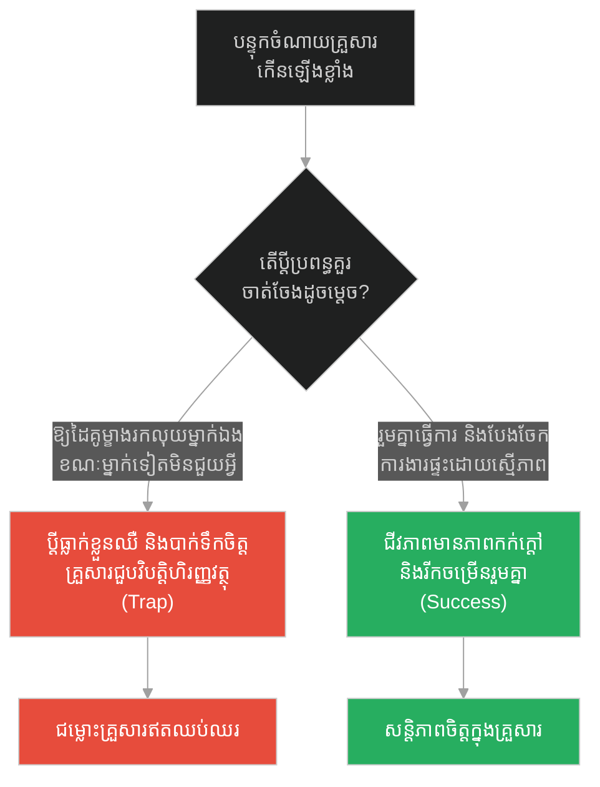
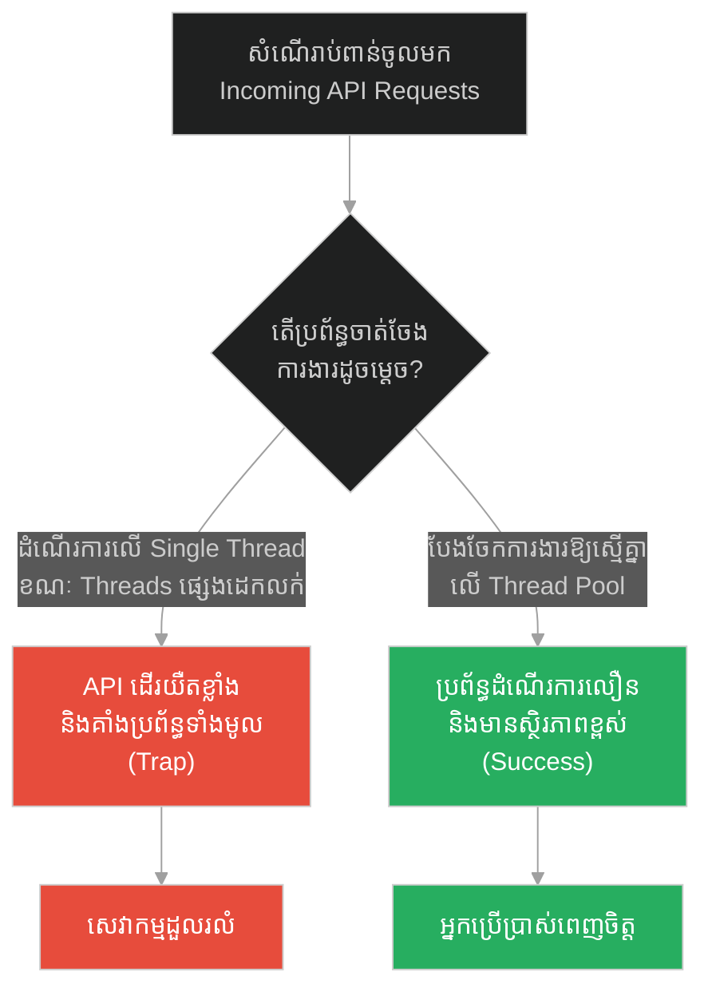
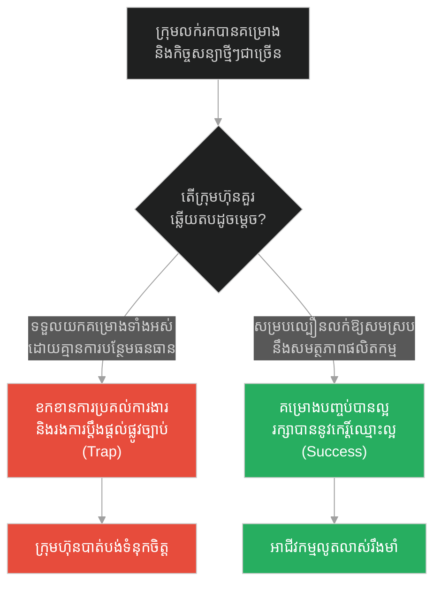
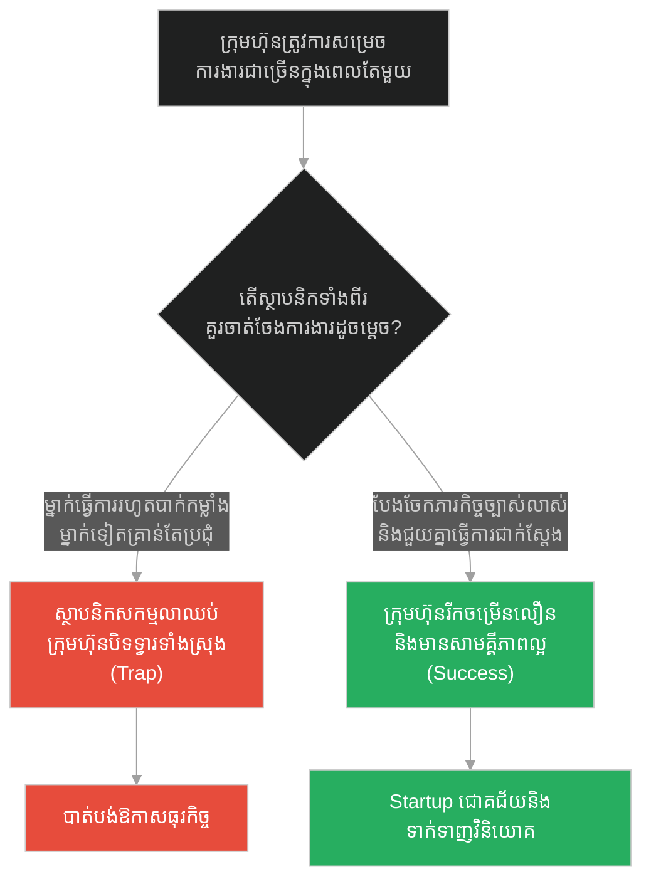
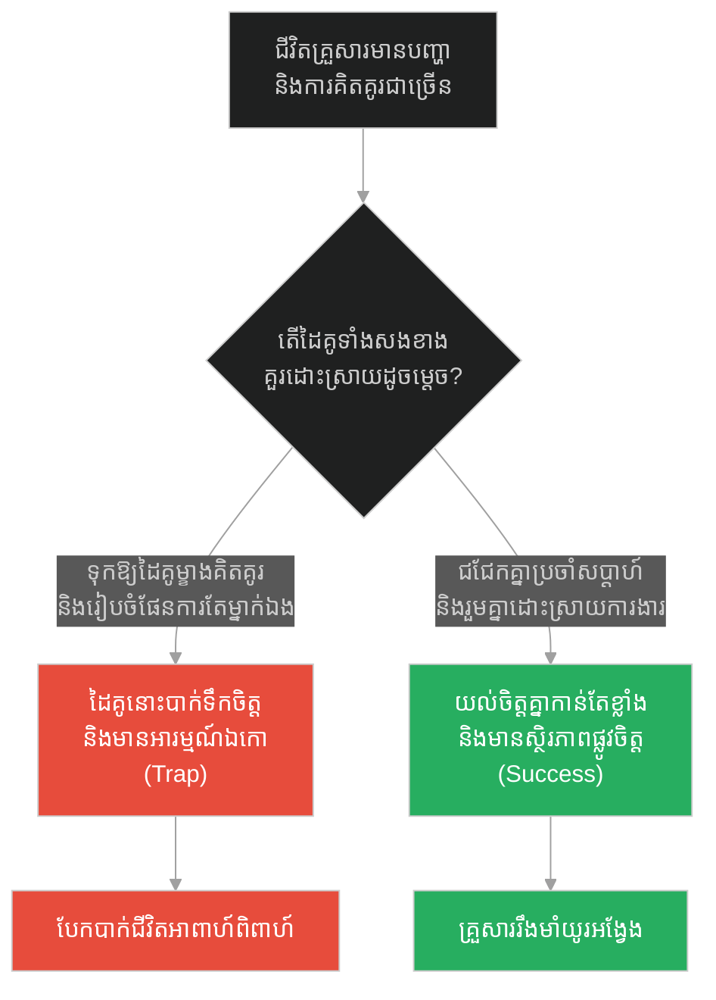
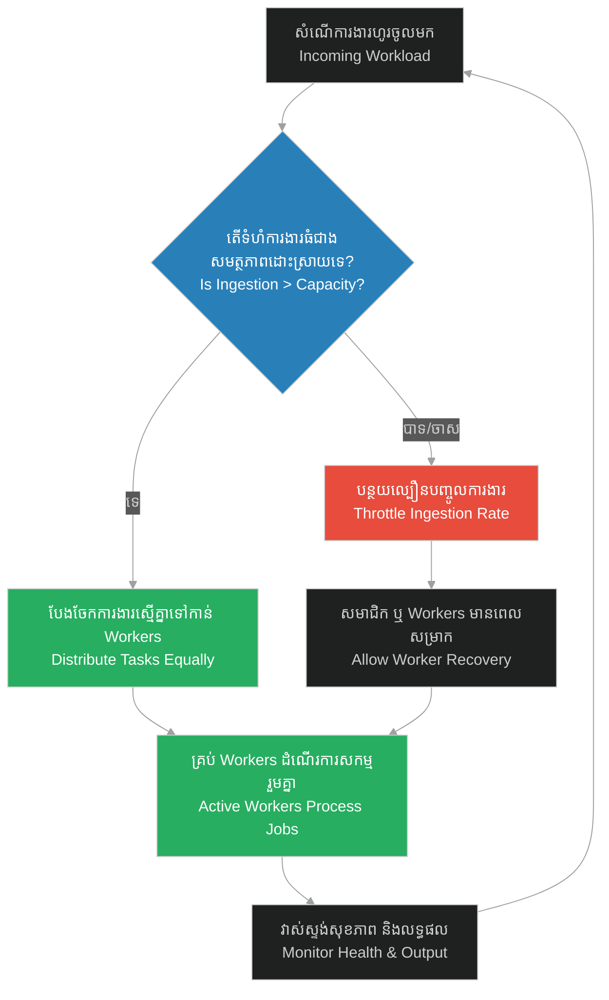

# Balanced Ingestion & Operational Sustainability (ការបញ្ចូលការងារប្រកបដោយតុល្យភាព និងនិរន្តរភាពប្រតិបត្តិការ)៖ បងប្អូនប្រុសទាំងពីរ និងនិរន្តរភាពនៃការធ្វើការងារ (Balanced Ingestion & Operational Sustainability & Prophet and the Two Brothers)

**Author:** ichamrong  
**Date:** 2026-05-28  
**Tags:** #balanced-ingestion #operations #sustainability #thread-pool #load-balancing #prophet-muhammad  
**Category:** Concepts  
**Read Time:** ~15 min  

---

## 📌 មាតិកា (Table of Contents)
- [អន្ទាក់ផ្លូវចិត្ត (The Trap)](#0)
- [១. រឿងព្រេងនិទាន៖ អ្នកធ្វើការ និងអ្នកអធិស្ឋាន (The Legend of the Worker and the Worshipper)](#1)
  - [តម្លៃពិតប្រាកដនៃការងារជាក់ស្តែង (The Spiritual Value of Labor)](#1-1)
- [២. បញ្ហា៖ ការបញ្ចូលការងារប្រកបដោយតុល្យភាព និងនិរន្តរភាពប្រតិបត្តិការ (The Issue: Balanced Ingestion & Operational Sustainability)](#2)
- [៣. ឧទាហមណ៍ជាក់ស្តែងក្នុងពិភពពិត (Real World Examples)](#3)
  - [ឧទាហរណ៍ទី ១ — កម្រិតស្រាល (គ្រួសារ)៖ តុល្យភាពហិរញ្ញវត្ថុ និងបន្ទុកគ្រួសារ (The Family Financial Balance)](#3-1)
  - [ឧទាហរណ៍ទី ២ — កម្រិតមធ្យម (បច្ចេកទេស)៖ ការប្រើប្រាស់ Thread Pool ឱ្យមានប្រសិទ្ធភាព (The Tech Thread Pool Utilization)](#3-2)
  - [ឧទាហរណ៍ទី ៣ — កម្រិតមធ្យម (ធុរកិច្ច)៖ តុល្យភាពរវាងការលក់ និងសមត្ថភាពផលិតកម្ម (The Business Sales vs Production Capacity)](#3-3)
  - [ឧទាហរណ៍ទី ៤ — កម្រិតមធ្យម (សង្គម/គ្រប់គ្រង)៖ ការបែងចែកភារកិច្ចក្នុងក្រុមហ៊ុន Startups (The Startup Task Allocation)](#3-4)
  - [ឧទាហរណ៍ទី ៥ — កម្រិតធ្ងន់ (ទំនាក់ទំនង)៖ តុល្យភាពនៃការទទួលបន្ទុកផ្លូវចិត្តក្នុងគ្រួសារ (The Relationship Mental Load Balance)](#3-5)
- [៤. ដំណោះស្រាយទូទៅ៖ ការសម្របសម្រួលល្បឿនបញ្ចូល និងការបែងចែកធនធាន (The General Solution: Ingestion Balancing & Active Pooling)](#4)
- [សេចក្តីសន្និដ្ឋាន (Conclusion)](#5)
- [ឯកសារយោង (References)](#6)
- [Related Posts](#7)

---

<a id="0"></a>
## អន្ទាក់ផ្លូវចិត្ត (The Trap)

នៅពេលដែលយើងចាត់ចែងការងារ ឬប្រតិបត្តិការ តើយើងបណ្តោយឱ្យធនធានតែមួយ ឬសមាជិកម្នាក់ផ្ទុកបន្ទុកការងារទាំងស្រុង (Single Point of Stress) ខណៈពេលដែលផ្នែកផ្សេងទៀតទំនេរ ឬមិនបង្កើតតម្លៃជាក់ស្តែង?

* **អន្ទាក់នៃភាពមិនស្មើគ្នា និងការកេងប្រវ័ញ្ច (The Parasitic Load Trap)** — ការអនុញ្ញាតឱ្យសេវាកម្ម ឬសមាជិកម្នាក់ធ្វើការរហូតដល់បាក់កម្លាំង ដើម្បីចិញ្ចឹមផ្នែកផ្សេងទៀតដែលអសកម្ម ឬគិតតែពីផែនការទ្រឹស្តី។
* **ការបញ្ចូលការងារប្រកបដោយតុល្យភាព (The Sustainable Ingestion)** — ការបែងចែកការងារឱ្យមានលំនឹងរវាងល្បឿនបញ្ចូល (Ingestion Rate) និងសមត្ថភាពដំណើរការជាក់ស្តែង (Processing Capacity) ដោយធានាថាគ្រប់ផ្នែកទាំងអស់ចូលរួមចំណែកយ៉ាងសកម្ម។

រឿងរ៉ាវនៃ «បងប្អូនប្រុសទាំងពីរ» នឹងបង្រៀនយើងនូវគោលការណ៍ **Balanced Ingestion (ការបញ្ចូលការងារប្រកបដោយតុល្យភាព)** និង **Operational Sustainability (និរន្តរភាពប្រតិបត្តិការ)** ក្នុងប្រព័ន្ធស្មុគស្មាញ។

1. **រឿងព្រេងនិទាន (The Legend)** — ព្យាការីម៉ូហាម៉ាត់លើកតម្កើងប្អូនប្រុសដែលធ្វើការចិញ្ចឹមគ្រួសារ ថាប្រសើរជាងបងប្រុសដែលគិតតែពីអធិស្ឋានក្នុងព្រះវិហារ។
2. **បញ្ហា (The Issue)** — ការដួលរលំប្រតិបត្តិការដោយសារតែការដកធនធានដែលដំណើរការការងារ (Workers) យកទៅធ្វើកិច្ចការដែលមិនបង្កើតផលផ្ទាល់ (Overhead)។
3. **ឧទាហមណ៍ជាក់ស្តែង (Real World Examples)** — ករណីសិក្សាទាំង ៥ កម្រិត ពីជីវភាពរស់នៅរហូតដល់ការចាត់ចែង Thread Pool របស់កុំព្យូទ័រ។
4. **ដំណោះស្រាយទូទៅ (The General Solution)** — ការអនុវត្តយន្តការ Ingestion Rate Limiting និង Active-Active Processing Pool។

---

<a id="1"></a>
## ១. រឿងព្រេងនិទាន៖ អ្នកធ្វើការ និងអ្នកអធិស្ឋាន (The Legend of the Worker and the Worshipper)

នៅក្នុងសម័យព្យាការីម៉ូហាម៉ាត់ មានរឿងនិទានប្រវត្តិសាស្ត្រដ៏ល្បីល្បាញមួយអំពីការយល់ច្រឡំរវាងការអភិវឌ្ឍផ្លូវចិត្ត និងការងារជាក់ស្តែង៖

> *«មានបងប្អូនប្រុសពីរនាក់រស់នៅក្នុងទីក្រុងម៉ាឌីណា៖*
> * * **បងប្រុស** គឺជាអ្នកដែលតែងតែនៅអង្គុយក្នុងព្រះវិហារជានិច្ច គាត់ចំណាយពេលពេញមួយថ្ងៃ ដើម្បីតែការអធិស្ឋាន សូត្រធម៌ និងស្វែងរកសេចក្តីស្ងប់ផ្លូវចិត្ត។*
> * * **ចំណែកឯប្អូនប្រុស** គឺជាអ្នកដែលត្រូវចេញទៅធ្វើការងារយ៉ាងនឿយហត់រាល់ថ្ងៃ ជាអ្នករកស៊ី និងប្រកបរបរចិញ្ចឹមជីវិត ដើម្បីរកលុយមកផ្គត់ផ្គង់អាហារដល់គ្រួសារ រួមទាំងចិញ្ចឹមបងប្រុសរបស់គាត់ផងដែរ។*
>
> *ថ្ងៃមួយ ប្អូនប្រុសមានការហត់នឿយយ៉ាងខ្លាំងនឹងបន្ទុកគ្រួសារ ក៏បានទៅត្អូញត្អែរប្រាប់ព្យាការីម៉ូហាម៉ាត់អំពីបងប្រុសរបស់ខ្លួន ដែលគិតតែពីអង្គុយអធិស្ឋាន ហើយមិនព្រមជួយធ្វើការរកលុយសោះ។ ប្អូនប្រុសនោះគិតថា បងប្រុសរបស់ខ្លួនជាមនុស្ស "បរិសុទ្ធ" ជាងខ្លួន។*
>
> *ព្យាការីម៉ូហាម៉ាត់បានស្តាប់ហើយ ក៏សួរទៅប្អូនប្រុសនោះថា៖ "តើនរណាជាអ្នកផ្តល់អាហារ និងផ្គត់ផ្គង់ការរស់នៅដល់បងប្រុសរបស់អ្នក?"*
>
> *ប្អូនប្រុសឆ្លើយថា៖ "គឺខ្ញុំហើយជាអ្នកធ្វើការរកលុយមកចិញ្ចឹមគាត់។"*
>
> *ព្យាការីម៉ូហាម៉ាត់ក៏មានប្រសាសន៍យ៉ាងច្បាស់លាស់ថា៖ **"ប្រសិនបើដូច្នេះមែន នោះអ្នក (អ្នកដែលធ្វើការ) គឺប្រសើរជាងគាត់ (អ្នកដែលគិតតែពីអធិស្ឋាន) ទៅទៀត។ (You are better than him!)"**»* (ស៊ូណាន់ អាត-ទើមីឌី ២៣៤៥)

<a id="1-1"></a>
### តម្លៃពិតប្រាកដនៃការងារជាក់ស្តែង (The Spiritual Value of Labor)

ពាក្យទូន្មានរបស់ព្យាការីម៉ូហាម៉ាត់កម្ទេចនូវជំនឿខុសឆ្គងដែលថា «ការបោះបង់ការងារជាក់ស្តែងទៅធ្វើពិធីសាសនា គឺជាភាពបរិសុទ្ធខ្ពស់បំផុត»។ លោកចង់បញ្ជាក់ថា ប្រតិបត្តិការផ្ទាល់ខ្លួន និងគ្រួសារត្រូវការ **និរន្តរភាព (Sustainability)**។ ប្រសិនបើប្អូនប្រុសមិនធ្វើការងារ នោះបងប្រុសក៏គ្មានបាយទទួលទានដើម្បីមានកម្លាំងអធិស្ឋានដែរ។ ដូចនេះ ការងារជាក់ស្តែង (Labor) គឺជាទីបង្អែក និងជាទម្រង់នៃការអធិស្ឋានដ៏ខ្ពង់ខ្ពស់បំផុត ព្រោះវាជាអ្នកទ្រទ្រង់ជីវិត និងសង្គម។

---

<a id="2"></a>
## ២. បញ្ហា៖ ការបញ្ចូលការងារប្រកបដោយតុល្យភាព និងនិរន្តរភាពប្រតិបត្តិការ (The Issue: Balanced Ingestion & Operational Sustainability)

នៅក្នុងស្ថាបត្យកម្មប្រព័ន្ធកុំព្យូទ័រ (System Architecture) បញ្ហាអសកម្មភាពកើតឡើងនៅពេលយើងបង្កើត Threads ឬ Workers ច្រើន ប៉ុន្តែមានតែ Thread មួយប៉ុណ្ណោះដែលត្រូវផ្ទុកការងារដំណើរការទាំងអស់ (Single-Thread Overload) ខណៈពេលដែល Threads ផ្សេងទៀតស្ថិតក្នុងស្ថានភាពទំនេរ (Idle/Sleeping) ឬរត់ការងារអត់ប្រយោជន៍ (Overhead)។ ប្រព័ន្ធបែបនេះមិនមាននិរន្តរភាពប្រតិបត្តិការឡើយ ព្រោះវាងាយនឹងធ្វើឱ្យ CPU Core មួយនោះឡើងកម្តៅខ្លាំង និងគាំងប្រព័ន្ធទាំងមូល។ យើងត្រូវរៀបចំយន្តការ **Balanced Ingestion** ដើម្បីបែងចែកការងារឱ្យស្មើគ្នាទៅកាន់គ្រប់ Workers (Worker Pool)។

ខាងក្រោមនេះជាកូដ Python ប្រៀបធៀបរវាងការចាត់ចែងការងារឱ្យទៅតែ Worker តែម្នាក់ (Fragile) និងការប្រើប្រាស់ Thread Pool មានតុល្យភាព (Resilient)៖

### ❌ ការអនុវត្តបែបផុយស្រួយ (Fragile Implementation - Single Worker Load)
ប្រព័ន្ធមាន Thread ពីរ ប៉ុន្តែមាន Thread តែមួយប៉ុណ្ណោះដែលធ្វើការងារទាំងអស់ (ប្អូនប្រុស) ខណៈពេល Thread មួយទៀតទំនេរឥតប្រយោជន៍ (បងប្រុស)។

```python
# fragile_ops.py
import threading
import queue
import time

job_queue = queue.Queue()

# Thread ទី១៖ ទំនេរឥតប្រយោជន៍ មិនជួយដំណើរការការងារ (Idle/Praying Thread)
def idle_prayer_thread():
    while True:
        # មិនធ្វើការងារនៅក្នុង Queue ឡើយ
        time.sleep(1.0)

# Thread ទី២៖ ផ្ទុកការងារចិញ្ចឹមប្រព័ន្ធទាំងមូលតែម្នាក់ឯង (Overloaded Worker)
def overloaded_worker_thread():
    while True:
        job = job_queue.get()
        # ដំណើរការការងារធ្ងន់ៗម្នាក់ឯង
        time.sleep(0.05)
        job_queue.task_done()
        print(f"បានបញ្ចប់ការងារដោយជោគជ័យ៖ {job}")
```

###  ការអនុវត្តប្រកបដោយភាពធន់ (Resilient Implementation - Balanced Worker Pool)
ប្រព័ន្ធបែងចែកការងារដោយស្មើភាពគ្នាទៅកាន់គ្រប់ Workers ទាំងអស់ (Active-Active Workers) ដែលធានាថាមិនមាន Worker ណាត្រូវបានបំផ្លាញដោយសារលើសទម្ងន់ការងារ។

```python
# resilient_ops.py
import threading
import queue
import time
import random

# កំណត់ដែនកំណត់ល្បឿនបញ្ចូលការងារ (Balanced Ingestion Rate)
balanced_queue = queue.Queue(maxsize=50)

# បង្កើត Worker Pool សកម្មទាំងអស់ (Active Thread Pool)
def sustainable_worker(worker_id):
    while True:
        try:
            # ទទួលការងារមកធ្វើតាមលំដាប់លំដោយ និងតុល្យភាព
            job = balanced_queue.get(timeout=2.0)
            print(f"[Worker-{worker_id}] កំពុងដំណើរការ៖ {job}")
            
            # ដំណើរការការងារជាក់ស្តែង
            time.sleep(random.uniform(0.1, 0.3))
            
            balanced_queue.task_done()
        except queue.Empty:
            # សម្រាកនៅពេលគ្មានការងារ (Cooldown)
            continue

def start_resilient_system():
    # ចាប់ផ្តើម Workers ទាំងពីរឱ្យជួយគ្នាធ្វើការងារ (បងប្អូនទាំងពីរនាក់រួមគ្នាធ្វើការ)
    for i in range(2):
        t = threading.Thread(target=sustainable_worker, args=(i,))
        t.daemon = True
        t.start()
        
    print("ប្រព័ន្ធដំណើរការប្រកបដោយតុល្យភាព និងនិរន្តរភាពជោគជ័យ!")
```

---

<a id="3"></a>
## ៣. ឧទាហមណ៍ជាក់ស្តែងក្នុងពិភពពិត (Real World Examples)

<a id="3-1"></a>
### ឧទាហរណ៍ទី ១ — កម្រិតស្រាល (គ្រួសារ)៖ តុល្យភាពហិរញ្ញវត្ថុ និងបន្ទុកគ្រួសារ (The Family Financial Balance)
នៅក្នុងគ្រួសារ ប្រសិនបើមានតែប្តីម្នាក់គត់ដែលចេញទៅធ្វើការរកលុយចិញ្ចឹមគ្រួសារយ៉ាងហត់នឿយ ខណៈពេលដែលប្រពន្ធនៅផ្ទះមិនព្រមជួយចាត់ចែង ឬរកចំណូលបន្ថែមដោយសារតែគិតតែពីការកម្សាន្ត នោះនឹងធ្វើឱ្យប្តីបាក់កម្លាំង និងមានទំនាស់។ ការចែករំលែកភារកិច្ច និងជួយរកចំណូល ឬសន្សំសំចៃរួមគ្នា ធានានូវសភមង្គលគ្រួសារ។



---

<a id="3-2"></a>
### ឧទាហរណ៍ទី ២ — កម្រិតមធ្យម (បច្ចេកទេស)៖ ការប្រើប្រាស់ Thread Pool ឱ្យមានប្រសិទ្ធភាព (The Tech Thread Pool Utilization)
នៅក្នុងការរចនា Web API ប្រសិនបើយើងចាត់ចែងរាល់សំណើរបស់អតិថិជនឱ្យទៅដំណើរការតែលើ Thread តែមួយ វានឹងធ្វើឱ្យ CPU ឡើងកម្តៅខ្លាំង និងដំណើរការយឺត។ ការប្រើប្រាស់ **Multi-core Thread Pool** ដែលបែងចែកការងារស្មើគ្នាទៅកាន់គ្រប់ Cores ជួយបង្កើនប្រសិទ្ធភាពប្រព័ន្ធ។



---

<a id="3-3"></a>
### ឧទាហរណ៍ទី ៣ — កម្រិតមធ្យម (ធុរកិច្ច)៖ តុល្យភាពរវាងការលក់ និងសមត្ថភាពផលិតកម្ម (The Business Sales vs Production Capacity)
ក្រុមហ៊ុនដែលប្រឹងប្រែងរកលក់គម្រោងធំៗជាច្រើន (High Ingestion) ប៉ុន្តែមិនព្រមវិនិយោគលើកម្លាំងផលិតកម្ម ឬវិស្វករទេ នឹងជួបវិបត្តិខូចកេរ្តិ៍ឈ្មោះដោយសារតែគ្មានទំនិញ ឬសេវាកម្មប្រគល់ឱ្យអតិថិជនទាន់ពេល។ ការសម្របសម្រួលល្បឿនលក់ និងសមត្ថភាពផលិត ធានានូវលំនឹងអាជីវកម្ម។



---

<a id="3-4"></a>
### ឧទាហរណ៍ទី ៤ — កម្រិតមធ្យម (សង្គម/គ្រប់គ្រង)៖ ការបែងចែកភារកិច្ចក្នុងក្រុមហ៊ុន Startups (The Startup Task Allocation)
នៅក្នុងក្រុមហ៊ុនបង្កើតថ្មី ប្រសិនបើស្ថាបនិកម្នាក់ (Founder) ត្រូវធ្វើការងារគ្រប់យ៉ាងតាំងពីលក់ សរសេរកូដ រហូតដល់ជូតការិយាល័យ ខណៈពេលសហស្ថាបនិកម្នាក់ទៀតគ្រាន់តែអង្គុយប្រជុំនិយាយពីចក្ខុវិស័យ នោះក្រុមហ៊ុននឹងដួលរលំ។ ការបែងចែក KPIs និងទំនួលខុសត្រូវច្បាស់លាស់ ធានានូវភាពរលូននៃការងារ។



---

<a id="3-5"></a>
### ឧទាហរណ៍ទី ៥ — កម្រិតធ្ងន់ (ទំនាក់ទំនង)៖ តុល្យភាពនៃការទទួលបន្ទុកផ្លូវចិត្តក្នុងគ្រួសារ (The Relationship Mental Load Balance)
នៅក្នុងជីវិតអាពាហ៍ពិពាហ៍ ប្រសិនបើដៃគូម្ខាងត្រូវទទួលរងបន្ទុកផ្លូវចិត្តទាំងអស់ (Mental Load) ដូចជា ការបារម្ភពីការបង់ថ្លៃទឹកភ្លើង ថ្លៃរៀនកូន ថ្លៃផ្ទះ និងការរៀបចំផែនការអនាគត ខណៈម្នាក់ទៀតរស់នៅដោយព្រងើយកន្តើយ នោះនឹងបណ្តាលឱ្យបែកបាក់គ្នា។ ការពិភាក្សា និងចែករំលែកការគិតគូររួមគ្នា រក្សានូវលំនឹងស្នេហា។



---

<a id="4"></a>
## ៤. ដំណោះស្រាយទូទៅ៖ ការសម្របសម្រួលល្បឿនបញ្ចូល និងការបែងចែកធនធាន (The General Solution: Ingestion Balancing & Active Pooling)

ដើម្បីធានានូវលំនឹងប្រតិបត្តិការ និងការបែងចែកការងារឱ្យមាននិរន្តរភាព យើងត្រូវបង្កើតប្រព័ន្ធ **Sustainable Operational Loop** ដូចខាងក្រោម៖

1. **ការវាស់ស្ទង់សមត្ថភាពដោះស្រាយ (Measure Processing Capacity)** — វាស់ស្ទង់សមត្ថភាពពិតប្រាកដរបស់ Workers ទាំងអស់នៅក្នុងប្រព័ន្ធ។
2. **ការកម្រិតល្បឿនបញ្ចូល (Control Ingestion Rate)** — កំណត់ទំហំការងារដែលហូរចូលមកកុំឱ្យលើសពីល្បឿនដំណើរការ (Apply Bounded Buffers & Rate Limiting)។
3. **យន្តការបែងចែកការងារស្មើភាព (Equal Resource Pooling)** — បង្កើត Worker Pool ដែលធានាថាគ្រប់ធនធានទាំងអស់ដំណើរការសកម្មរួមគ្នា (Active-Active Workers)។
4. **ការត្រួតពិនិត្យ និងវាយតម្លៃឡើងវិញ (Regular Review & Audit)** — ត្រួតពិនិត្យសុខភាពប្រព័ន្ធ ឬកម្រិតហត់នឿយរបស់សមាជិកដើម្បីកែសម្រួលល្បឿនការងារឱ្យស្របតាមស្ថានភាពជាក់ស្តែង។



---

## 🐇 ធ្លាក់ចូលក្នុងរន្ធទន្សាយ (Enter the Rabbit Hole)
ដើម្បីស្វែងយល់ពីរបៀបដែលការកែប្រែទម្លាប់ ឬការផ្លាស់ប្តូរផ្នត់គំនិតផ្ទាល់ខ្លួន អាចជួយឱ្យយើងកសាងប្រព័ន្ធដែលមានស្ថិរភាព និងជៀសវាងការធ្លាក់ចូលក្នុងអន្ទាក់នៃការចង់ផ្លាស់ប្តូរភ្លាមៗដោយគ្មានការរៀបចំគ្រឹះឱ្យបានរឹងមាំជាមុនសិន សូមបន្តដំណើរទៅកាន់៖

* 🚀 **[ចាប់ផ្តើមដំណើររុករក (Start the Journey) ➔ Habit Formation & Incremental Change៖ ព្យាការី និងក្មេងប្រុសចូលចិត្តញ៉ាំល្មើ](./210-prophet-and-the-boy-who-loved-dates.md)**

---

<a id="5"></a>
## សេចក្តីសន្និដ្ឋាន (Conclusion)

> **«តម្លៃនៃជីវិត និងនិរន្តរភាពនៃប្រព័ន្ធ មិនមែនស្ថិតនៅលើចំនួននៃការបួងសួង ឬទ្រឹស្តីផែនការនោះឡើយ ប៉ុន្តែវាស់វែងទៅលើញើស និងសកម្មភាពជាក់ស្តែងរបស់សមាជិកគ្រប់រូបដែលជួយគ្នាធ្វើការងារ។»**

ពាក្យទូន្មានរបស់ព្យាការីម៉ូហាម៉ាត់អំពីបងប្អូនប្រុសទាំងពីរ បង្រៀនយើងនូវសច្ចធម៌ការងារដ៏អស្ចារ្យ៖ គ្មានប្រព័ន្ធណាអាចដំណើរការបានយូរអង្វែងឡើយ ប្រសិនបើមានតែសមាជិកម្នាក់គត់ដែលត្រូវទ្របន្ទុកការងារទាំងស្រុង។ ការអនុវត្តយន្តការបញ្ចូលការងារប្រកបដោយតុល្យភាព (Balanced Ingestion) និងការកសាងក្រុមការងារដែលជួយគ្នាទៅវិញទៅមក ធានាបាននូវនិរន្តរភាព ស្ថិរភាព និងភាពរីកចម្រើនឥតឈប់ឈរ។

---

<a id="6"></a>
## ឯកសារយោង (References)

* **Sunan al-Tirmidhi Hadith 2345** — *Narration of the Praying Brother and the Working Brother* (Book of Asceticism).
* **Concurrency in Go / Multi-threading Patterns** — Software architectural concepts regarding Work Stealing Algorithms and Thread Pools.
* **Stephen Covey** — *The 7 Habits of Highly Effective People* (1989). Habit 7: "Sharpen the Saw" (Operational Sustainability & Work-life Balance).

---

<a id="7"></a>
## Related Posts

* [Friendly User Error Messages & Soft Validation (សារកំហុសរាក់ទាក់ចំពោះអ្នកប្រើប្រាស់ និងការផ្ទៀងផ្ទាត់កម្រិតស្រាល)៖ ជនជាតិបេឌូអ៊ីនក្នុងវិហារ និងការដោះស្រាយកំហុសដោយការអប់រំ](./208-prophet-and-the-bedouin-in-mosque.md)
* [Habit Formation & Incremental Change (ការបង្កើតទម្លាប់ និងការកែប្រែបន្តិចម្តងៗ)៖ ព្យាការី និងក្មេងប្រុសចូលចិត្តញ៉ាំល្មើ](./210-prophet-and-the-boy-who-loved-dates.md)
