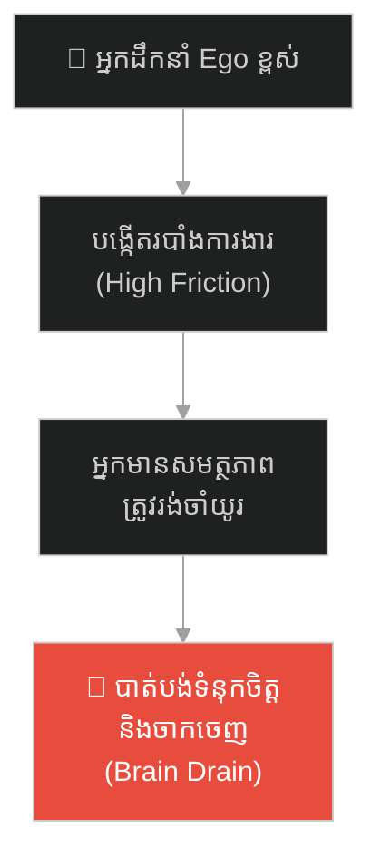
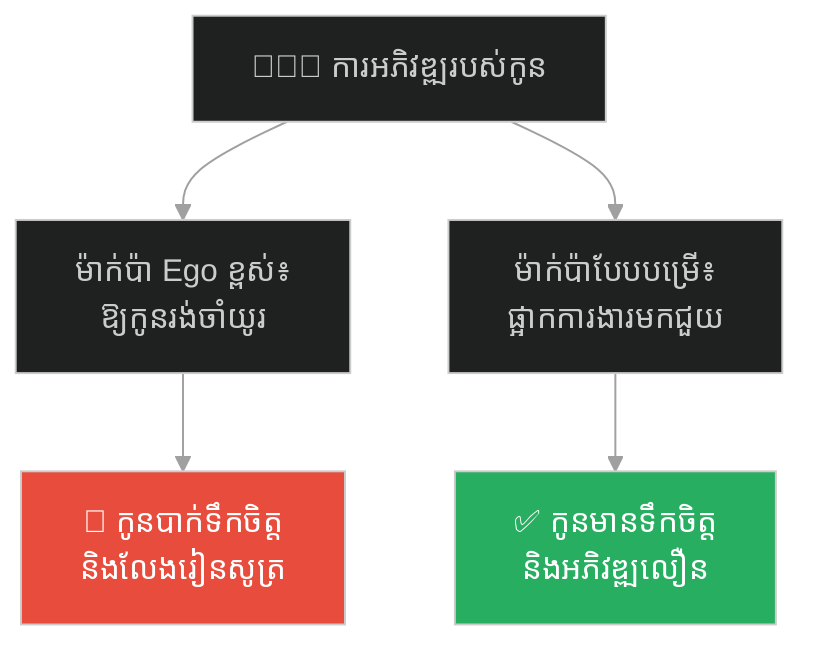
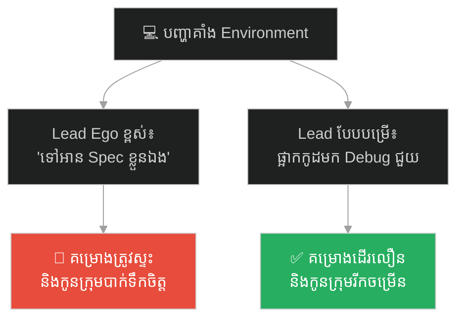
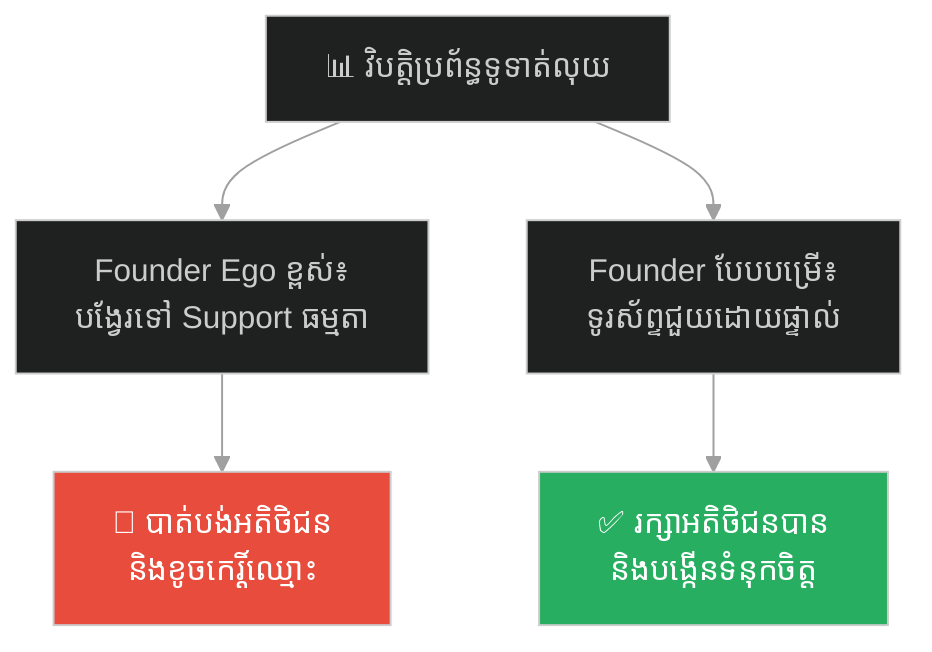
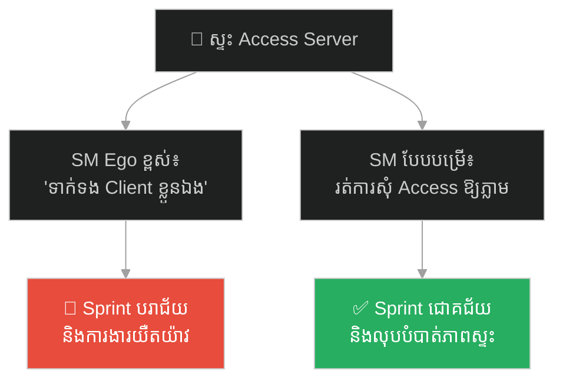
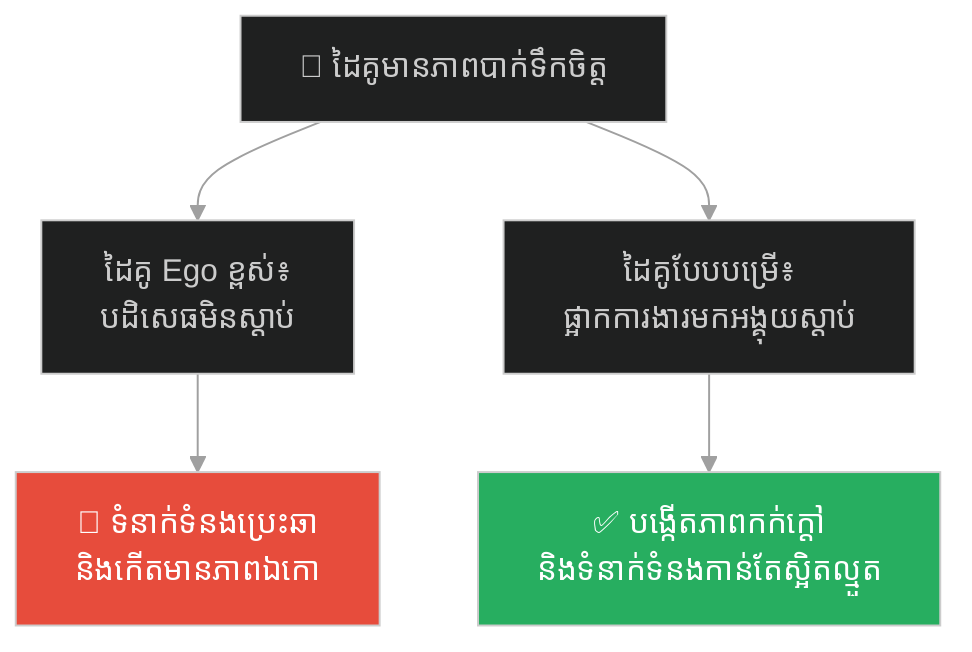
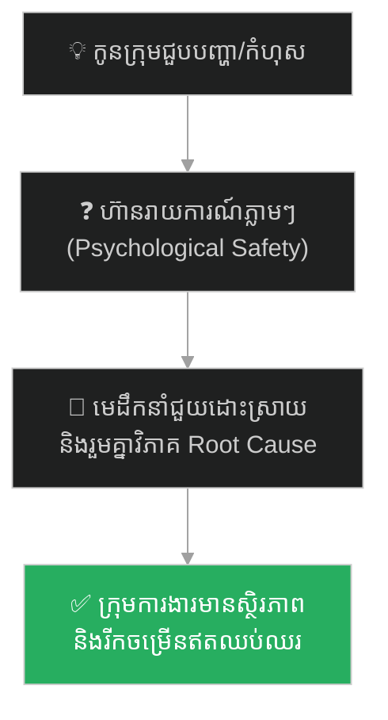

# The Duke of Zhou and the Welcoming of Scholars (ព្រះអង្គម្ចាស់ជូកុង និងការខ្ជាក់អាហារស្វាគមន៍អ្នកប្រាជ្ញ)៖ ភាពបន្ទាបខ្លួនរបស់មេដឹកនាំ និងសិល្បៈនៃការស្រូបទាញបុគ្គលិកឆ្នើម

**Author:** ichamrong  
**Date:** 2026-05-27  
**Tags:** #servant-leadership #multiplier-leadership #talent-acquisition #humility #ancient-china #management #eq  
**Category:** Concepts / Parables  
**Read Time:** ~15 min  

---

## 📌 មាតិកា (Table of Contents)
- [អន្ទាក់ផ្លូវចិត្ត (The Trap)](#អន្ទាក់ផ្លូវចិត្ត-the-trap)
- [១. រឿងព្រេងប្រវត្តិសាស្ត្រចិន៖ ព្រះអង្គម្ចាស់ ជូកុង (The Legend of the Duke of Zhou)](#1)
  - [ការខ្ជាក់អាហារ និងការក្តាប់សក់ (Spitting Food and Wringing Wet Hair)](#1-1)
  - [មេរៀននៃការបន្ទាបខ្លួនដល់បុត្រា (The Father's Lesson of Humility)](#1-2)
- [២. បញ្ហា៖ របាំងអត្មោនិយម និងការបាត់បង់មនុស្សពូកែ (The Issue: The Ego Barrier & Brain Drain)](#2)
- [៣. ឧទាហរណ៍ជាក់ស្តែងក្នុងពិភពពិត (Real World Examples)](#3)
  - [ឧទាហរណ៍ទី ១ — កម្រិតស្រាល (គ្រួសារ)៖ ការគាំទ្រ និងការលុបបំបាត់ឧបសគ្គរបស់ឪពុកម្តាយ (The Block-Removing Parent)](#3-1)
  - [ឧទាហរណ៍ទី ២ — កម្រិតមធ្យម (បច្ចេកទេស)៖ Tech Lead និងការដោះស្រាយ Blocker ឱ្យក្រុមការងារ (The Servant Tech Lead)](#3-2)
  - [ឧទាហរណ៍ទី ៣ — កម្រិតមធ្យម (ធុរកិច្ច)៖ ស្ថាបនិក និងការចុះដោះស្រាយបញ្ហាអតិថិជនផ្ទាល់ (The Accessible Founder)](#3-3)
  - [ឧទាហរណ៍ទី ៤ — កម្រិតមធ្យម (សង្គម/គ្រប់គ្រង)៖ Scrum Master និងការលុបបំបាត់របាំងការងារ (The Impediment Buster)](#3-4)
  - [ឧទាហរណ៍ទី ៥ — កម្រិតធ្ងន់ (ទំនាក់ទំនង)៖ ការលះបង់ Ego ដើម្បីស្តាប់ដៃគូជីវិត (Active Empathy in Relationships)](#3-5)
- [៤. ដំណោះស្រាយទូទៅ៖ ការដឹកនាំបែបបម្រើ និងការកសាង Psychological Safety (The General Solution: Servant Leadership)](#4)
- [សេចក្តីសន្និដ្ឋាន (Conclusion)](#conclusion)
- [ឯកសារយោង (References)](#references)
- [Related Posts](#related-posts)

---

## អន្ទាក់ផ្លូវចិត្ត (The Trap)

តើអ្នកធ្លាប់ឆ្ងល់ទេថា ហេតុអ្វីបានជាស្ថាប័ន ឬក្រុមការងារខ្លះ អាចទាក់ទាញ និងរក្សាទុកមនុស្សពូកែៗឱ្យនៅបម្រើការងារបានយ៉ាងយូរ ខណៈពេលដែលស្ថាប័នខ្លះទៀត ជួបវិបត្តិបាត់បង់បុគ្គលិកឆ្នើម (Brain Drain) ឥតឈប់ឈរ ទោះបីជាផ្តល់ប្រាក់ខែខ្ពស់ក៏ដោយ?

មនុស្សជាច្រើនជឿថា៖
* **អ្នកដឹកនាំ** ត្រូវតែមានភាពអស្ចារ្យ ខ្ពង់ខ្ពស់ និងធ្វើឱ្យគេគោរពកោតខ្លាច។
* **កូនចៅ** ត្រូវតែតម្រង់ជួររង់ចាំទទួលបញ្ជា និងបង្ហាញការគោរពជាមុនសិន។

ប៉ុន្តែ នៅក្នុងពិភពពិត មេដឹកនាំដែលអាងតែអំណាច និងមាន Ego ខ្ពស់ គឺជាអ្នកកាត់ផ្តាច់ខ្លួនឯងពីសច្ចភាពជាក់ស្តែង និងធ្វើឱ្យអ្នកមានសមត្ថភាពដើរចេញពីខ្លួន។ នេះហៅថា **អន្ទាក់អត្មោនិយមរបស់មេដឹកនាំ (The Arrogant Leadership Trap)**។

ដើម្បីយល់ដឹងពីរបៀបលុបបំបាត់ Ego និងការស្រូបទាញបុគ្គលិកឆ្នើម នេះជាផែនទីបង្ហាញផ្លូវសម្រាប់អត្ថបទនេះ៖
1. **រឿងព្រេងប្រវត្តិសាស្ត្រ (The Historic Legend)** — វីរភាពរបស់ព្រះអង្គម្ចាស់ ជូកុង ដែលសុខចិត្តខ្ជាក់អាហារពីមាត់ និងក្តាប់សក់សើមដើម្បីទទួលស្វាគមន៍អ្នកប្រាជ្ញសាមញ្ញ។
2. **បញ្ហា (The Issue)** — តើរបាំងអត្មោនិយមរារាំងសក្តានុពលក្រុម និងបំផ្លាញទំនុកចិត្តយ៉ាងដូចម្តេច?
3. **ឧទាហរណ៍ជាក់ស្តែងក្នុងពិភពពិត (Real World Examples)** — ពិនិត្យមើលឥទ្ធិពលនៃការដឹកនាំបែបបម្រើក្នុងកម្រិតគ្រួសារ ការងារបច្ចេកទេស ធុរកិច្ច ការគ្រប់គ្រង និងទំនាក់ទំនងស្នេហា។
4. **ដំណោះស្រាយទូទៅ (The General Solution)** — ការផ្លាស់ប្តូរទៅកាន់ **«ការដឹកនាំបែបបម្រើ» (Servant Leadership)** និងការបង្កើត Psychological Safety។

---

## ១. រឿងព្រេងប្រវត្តិសាស្ត្រចិន៖ ព្រះអង្គម្ចាស់ ជូកុង (The Legend of the Duke of Zhou)

កាលពីជាង ៣,០០០ ឆ្នាំមុន នៅក្នុងយុគសម័យរាជវង្សចូវ (Zhou Dynasty) នៃប្រទេសចិន មានរាជទាយាទ និងជាអ្នករាជការកំពូលម្នាក់ព្រះនាម **ជូកុង (Duke of Zhou)**។ ក្រោយពេលដែលព្រះរៀមរបស់ទ្រង់បានសោយទិវង្គត ជូកុង បានក្លាយជាអ្នកក្តោបក្តាប់អំណាចកំពូលបំផុតនៅក្នុងអាណាចក្រ ដើម្បីមើលការខុសត្រូវ និងការពាររាជបល្ល័ង្កជំនួសព្រះរាជបុត្រដែលនៅក្មេងវ័យ។

ទោះបីជាមានអំណាចអាចបញ្ជាមនុស្សរាប់លាននាក់ និងមានទ្រព្យសម្បត្តិហូរហៀរក៏ពិតមែន ប៉ុន្តែ ជូកុង មិនដែលបង្ហាញអាកប្បកិរិយាអួតអាង ក្អេងក្អាង ឬមើលងាយមនុស្សសូម្បីតែបន្តិចឡើយ។ ท្រង់ដឹងថា ការថែរក្សាអាណាចក្រឱ្យមានស្ថិរភាព មិនមែនពឹងលើកម្លាំងបាយ និងបញ្ជាឡើយ តែអាស្រ័យលើការប្រមូលផ្តុំមនុស្សពូកែៗ និងអ្នកប្រាជ្ញ (Talent Attraction)។

---

### ការខ្ជាក់អាហារ និងការក្តាប់សក់ (Spitting Food and Wringing Wet Hair)

មានពាក្យស្លោកចិនបុរាណមួយឃ្លាដែលត្រូវបានគេចងក្រងទុកដើម្បីកោតសរសើរពីវីរភាពរបស់ព្រះអង្គគឺ៖ **«一沐三捉发，一饭三吐哺» (ងូតទឹកមួយដង ក្តាប់សក់បីដង ហូបបាយមួយពេល ខ្ជាក់អាហារបីដង)**។

តើពាក្យនេះមានន័យដូចម្តេច?

ជារៀងរាល់ថ្ងៃ នៅពេលដែល ជូកុង កំពុងតែស្រង់ទឹក កក់សក់ ប្រសិនបើមានទាហានមករាយការណ៍ថា មានអ្នកប្រាជ្ញ ឬបណ្ឌិតណាម្នាក់ធ្វើដំណើរមកសុំជួប ទ្រង់មិនព្រមបន្តងូតទឹកឱ្យរួចរាល់ ឬឱ្យភ្ញៀវរង់ចាំឡើយ។ ទ្រង់ប្រញាប់ប្រញាល់យកដៃក្តាប់ពូតទឹកចេញពីសក់ដែលកំពុងសើមជោក រួចរត់ចេញមកទទួលស្វាគមន៍ភ្ញៀចភ្លាមៗកណ្តាលទី។ 

កាន់តែអស្ចារ្យជាងនេះទៅទៀត ប្រសិនបើមានភ្ញៀវមកដល់ចំពេលដែលទ្រង់កំពុងតែសោយក្រយា (ហូបបាយ) ទ្រង់សុខចិត្ត **ខ្ជាក់អាហារចេញពីមាត់** ដាក់ក្នុងចានវិញ រួចប្រញាប់រត់ចេញទៅក្រៅដើម្បីទទួលស្វាគមន៍អ្នកប្រាជ្ញនោះដោយក្តីគោរពបំផុត ព្រោះទ្រង់ខ្លាចក្រែងការទំពារអាហារយឺតយ៉ាវ ធ្វើឱ្យអ្នកប្រាជ្ញនោះមានអារម្មណ៍ថាមិនត្រូវបានគេផ្តល់តម្លៃ និងដើរចេញបាត់ទៅវិញ។

---

### មេរៀននៃការបន្ទាបខ្លួនដល់បុត្រា (The Father's Lesson of Humility)

ថ្ងៃមួយ បុត្រារបស់ទ្រង់ព្រះនាម **ប៉ូ ឈីន (Bo Qin)** ដែលទើបតែត្រូវបានតែងតាំងជាស្តេចត្រាញ់នៅតំបន់លូ បានសួរទៅកាន់បិតាដោយក្តីឆ្ងល់ថា៖
> *«បិតា! យើងជារាជវង្សកំពូល មានអំណាចគ្របដណ្តប់ពេញផែនដី។ ហេតុអ្វីបានជាបិតាត្រូវបន្ទាបខ្លួន រហូតដល់ថ្នាក់ខ្ជាក់អាហារពីមាត់ និងរត់ទាំងសក់សើម ដើម្បីតែទៅទទួលស្វាគមន៍ជនសាមញ្ញ និងអ្នកប្រាជ្ញក្រីក្រទាំងនោះ? តើនេះមិនមែនជាការបន្ទាបកិត្តិយសខ្លួនឯងទេឬ?»*

ជូកុង បានញញឹម រួចបង្រៀនបុត្រាវិញដោយសម្តីដ៏មានអត្ថន័យថា៖
> *«បុត្រាអើយ! ឯងត្រូវចាំថា **អំណាចមិនអាចកសាងរដ្ឋបានទេ គឺមានតែមនុស្សមានសមត្ថភាពទើបអាចកសាងរដ្ឋបាន។** ភ្នំមិនដែលប្រកែកថាខ្លួនខ្ពស់ពេកទេ រីឯមហាសមុទ្រក៏មិនដែលត្អូញត្អែរថាខ្លួនជ្រៅពេកនោះដែរ ទើបវាអាចប្រមូលផ្តុំដីនិងទឹកបានច្រើន។ បើយើងអាងខ្លួនថាមានអំណាច រួចធ្វើខ្លួនក្រអឺតក្រទម មើលងាយអ្នកដទៃ នោះមនុស្សពូកែៗនៅលើលោក នឹងរត់ចោលយើងមិនខាន។ បើគ្មានអ្នកប្រាជ្ញជួយគិតគូរ តើឯងយកអ្វីទៅការពាររាជបល្ល័ង្ក និងប្រជារាស្ត្រទៅ?»*

ភាពរាបទាបរបស់ ជូកុង បានធ្វើឱ្យអ្នកប្រាជ្ញ និងមនុស្សពូកែៗពីគ្រប់ទិសទីទូទាំងផែនដី ស្ម័គ្រចិត្តធ្វើដំណើរមកបម្រើរាជវង្សចូវ ធ្វើឱ្យអាណាចក្រនេះមានភាពរុងរឿង និងស្ថិតស្ថេរបានយូរអង្វែងបំផុតនៅក្នុងប្រវត្តិសាស្ត្រចិន (ជាង ៨០០ ឆ្នាំ)។

---

## ២. បញ្ហា៖ របាំងអត្មោនិយម និងការបាត់បង់មនុស្សពូកែ (The Issue: The Ego Barrier & Brain Drain)

នៅក្នុងចិត្តវិទ្យាគ្រប់គ្រង (Management Psychology) បាតុភូតនេះឆ្លុះបញ្ចាំងពីការប្រជែងគ្នារវាង **«មេដឹកនាំបែបបង្គាប់ការ» (Diminisher/Command-and-Control Leader)** និង **«មេដឹកនាំបែបបម្រើ» (Servant/Multiplier Leader)**។

នៅពេលអ្នកដឹកនាំមាន Ego ខ្ពស់៖
* ពួកគេចាត់ទុកខ្លួនឯងជាចំណុចកណ្តាលនៃប្រព័ន្ធ (The Hero Mode)។
* ពួកគេបង្កើតរបាំងព័ត៌មាន (Information Barriers) ដោយធ្វើឱ្យអ្នកដទៃចូលជួប ឬរាយការណ៍បានពិបាក។
* ពួកគេឱ្យតម្លៃលើ «ឋានៈ និងសណ្តាប់ធ្នាប់» ខ្ពស់ជាង «ការដោះស្រាយបញ្ហាជាក់ស្តែង»។

---

## ៣. ឧទាហរណ៍ជាក់ស្តែងក្នុងពិភពពិត

ដើម្បីយល់ដឹងឱ្យកាន់តែស៊ីជម្រៅ ផ្លូវការសិក្សានឹងនាំអ្នកទៅពិនិត្យមើល **ឧទាហរណ៍ចំនួន ៥ កម្រិតខុសៗគ្នា** ក្នុងជីវិតរស់នៅប្រចាំថ្ងៃ៖

---

### ឧទាហរណ៍ទី ១ — កម្រិតស្រាល (គ្រួសារ)៖ ការគាំទ្រ និងការលុបបំបាត់ឧបសគ្គរបស់ឪពុកម្តាយ (The Block-Removing Parent)

**ស្ថានភាព៖** កូនប្រុសកំពុងព្យាយាមរៀនសរសេរកម្មវិធីកុំព្យូទ័រនៅផ្ទះ ប៉ុន្តែជួបបញ្ហាគាំងកូដ ឬខូចកុំព្យូទ័រ។

* **ភាគី A (ឪពុកម្តាយ Ego ខ្ពស់)៖** យល់ថាការរៀនសូត្ររបស់កូនជាកិច្ចការបន្ទាប់បន្សំ។ ពេលកូនសុំជំនួយ ពួកគេឆ្លើយតបថា៖ *«កុំរំខាន! ម៉ាក់ប៉ាកំពុងហូបបាយ/សម្រាក។ ចាំស្អែកទៅ!»* បង្ខំឱ្យកូនរង់ចាំយូរ និងបាក់ទឹកចិត្តក្នុងការរៀនសូត្រ។
* **ភាគី B (ឪពុកម្តាយបែបបម្រើ)៖** យល់ថាសេចក្តីប្រាថ្នារបស់កូនជាអាទិភាព។ ពួកគេសុខចិត្តផ្អាកសកម្មភាពផ្ទាល់ខ្លួនភ្លាមៗ ដើម្បីជួយដោះស្រាយបញ្ហា ឬស្វែងរកជាងមកជួសជុល ដើម្បីកុំឱ្យការរៀនសូត្ររបស់កូនត្រូវស្ទះ។

---

### ឧទាហរណ៍ទី ២ — កម្រិតមធ្យម (បច្ចេកទេស)៖ Tech Lead និងការដោះស្រាយ Blocker ឱ្យក្រុមការងារ (The Servant Tech Lead)

**ស្ថានភាព៖** Junior Developer ជួបបញ្ហា Environment គាំង មិនអាច Deploy កូដទៅតេស្តបាន។

* **ភាគី A (Tech Lead Ego ខ្ពស់)៖** ផ្តោតតែលើការសរសេរកូដផ្ទាល់ខ្លួន ដើម្បីយកស្នាដៃ។ ពេល Junior សុំជំនួយ ពួកគេឆ្លើយតប៖ *«ទៅអាន Spec ឡើងវិញទៅ ខ្ញុំកំពុងរវល់សរសេរ Core Feature!»* ទុកឱ្យ Junior ស្ទះការងាររាប់ម៉ោង។
* **ភាគី B (Tech Lead បែបបម្រើ)៖** សុខចិត្តផ្អាកការសរសេរកូដរបស់ខ្លួន ដើម្បីជួយ Debug និងដោះស្រាយ Blocker ឱ្យ Junior ភ្លាមៗ ព្រោះពួកគេដឹងថា ផលិតភាពរបស់ក្រុមទាំងមូល សំខាន់ជាងលទ្ធផលបុគ្គល។

---

### ឧទាហរណ៍ទី ៣ — កម្រិតមធ្យម (ធុរកិច្ច)៖ ស្ថាបនិក និងការចុះដោះស្រាយបញ្ហាអតិថិជនផ្ទាល់ (The Accessible Founder)

**ស្ថានភាព៖** អតិថិជនសំខាន់ម្នាក់របស់ក្រុមហ៊ុន Startup ជួបបញ្ហាប្រព័ន្ធទូទាត់លុយមិនដំណើរការ និងគំរាមលុបចោលកិច្ចសន្យា។

* **ភាគី A (Founder Ego ខ្ពស់)៖** យល់ថាខ្លួនជាប្រធានក្រុមហ៊ុន មិនត្រូវចុះទៅដោះស្រាយបញ្ហាតូចតាចឡើយ។ ពួកគេបង្វែរអតិថិជនទៅកាន់ភ្នាក់ងារគាំទ្រធម្មតា (Support layers) ធ្វើឱ្យបញ្ហាអូសបន្លាយជាច្រើនថ្ងៃ។
* **ភាគី B (Founder បែបបម្រើ)៖** ទុកការងារប្រជុំចោល រួចទូរស័ព្ទទៅកាន់អតិថិជនដោយផ្ទាល់ ដើម្បីសុំទោស និងសម្របសម្រួលជាមួយក្រុមវិស្វករដោះស្រាយភ្លាមៗកណ្តាលយប់ បង្ហាញពីការផ្តល់តម្លៃដាច់ខាត។

---

### ឧទាហរណ៍ទី ៤ — កម្រិតមធ្យម (សង្គម/គ្រប់គ្រង)៖ Scrum Master និងការលុបបំបាត់របាំងការងារ (The Impediment Buster)

**ស្ថានភាព៖** ក្នុងអំឡុងពេល Sprint, ក្រុមការងារជួបបញ្ហាខ្វះគណនី Access ទៅកាន់ Server របស់ Client។

* **ភាគី A (Scrum Master បែបចៅហ្វាយ)៖** ចាត់ទុក Daily Standup ជាកន្លែង «ឆែកវត្តមាន និងតាមដានការងារ»។ ពេលដឹងពីបញ្ហា ពួកគេគ្រាន់តែចុះកំណត់ត្រាទុក រួចប្រាប់ឱ្យកូនក្រុមទាក់ទងទៅ Client ខ្លួនឯង។
* **ភាគី B (Scrum Master បែបបម្រើ)៖** ចាត់ទុកខ្លួនឯងជា «អ្នកឈូសឆាយផ្លូវ» (Impediment Buster)។ ពួកគេប្រញាប់ទាក់ទងទៅ Client និងដេញដោលសុំគណនី Access ឱ្យបានភ្លាមៗ ដើម្បីកុំឱ្យវិស្វករត្រូវខាតពេលវេលាអង្គុយរង់ចាំ។

---

### ឧទាហរណ៍ទី ៥ — កម្រិតធ្ងន់ (ទំនាក់ទំនង)៖ ការលះបង់ Ego ដើម្បីស្តាប់ដៃគូជីវិត (Active Empathy in Relationships)

**ស្ថានភាព៖** ដៃគូជីវិតត្រឡប់មកពីធ្វើការវិញដោយភាពនឿយណាយ និងមានអារម្មណ៍បាក់ទឹកចិត្តដោយសារបញ្ហាកន្លែងការងារ។

* **ភាគី A (ដៃគូ Ego ខ្ពស់)៖** យល់ថាការងារ និងភាពហត់នឿយរបស់ខ្លួនឯងធំជាងគេជានិច្ច។ ពេលដៃគូចង់និយាយចែករំលែក ពួកគេបដិសេធ៖ *«កុំទើបនិយាយអី! ខ្ញុំក៏ហត់ណាស់ដែរ! ចាំពេលក្រោយទៅ!»*
* **ភាគី B (ដៃគូបែបបម្រើ)៖** សុខចិត្តបិទកុំព្យូទ័រ/ទូរស័ព្ទ ផ្អាកការងារផ្ទាល់ខ្លួន រួចអង្គុយស្តាប់ដៃគូដោយយកចិត្តទុកដាក់បំផុត បង្ហាញថា «សេចក្តីស្ងប់ផ្លូវចិត្តរបស់ដៃគូ» គឺសំខាន់ជាងអ្វីៗទាំងអស់។

---

## ៤. ដំណោះស្រាយទូទៅ៖ ការដឹកនាំបែបបម្រើ និងការកសាង Psychological Safety (The General Solution: Servant Leadership)

ដើម្បីបំបែកខ្លួនចេញពីរបាំងអត្មោនិយម និងក្លាយជាមេដឹកនាំដែលមនុស្សពូកែៗចង់នៅក្បែរ អ្នកត្រូវអនុវត្តជំហានសំខាន់ៗទាំងនេះ៖

### ១. អនុវត្តគោលការណ៍ "មេដឹកនាំជាអ្នកបោសសម្អាតផ្លូវ" (The Road Sweeper)
តួនាទីរបស់អ្នកមិនមែនជាការអង្គុយចាំបញ្ជា ឬឆែកមើលវត្តមានឡើយ។ ចូរចាត់ទុកខ្លួនឯងជា «អ្នកបោសសម្អាតរបាំងការងារ (Blockers)» ឱ្យកូនក្រុម។ បើកទ្វារឱ្យពួកគេងាយស្រួលចូលជួប និងដោះស្រាយបញ្ហាឱ្យពួកគេបានលឿនបំផុត។

### ២. បន្ថយ Ego បង្កើនទំនុកចិត្ត (Ego Depletion)
លះបង់ក្តីស្រឡាញ់ចំពោះ «ឋានៈ» ចោល។ នៅចំពោះមុខសមត្ថភាព និងការរីកចម្រើនរបស់ក្រុម ចូរមានភាពរាបទាបដូចព្រះអង្គម្ចាស់ ជូកុង។ ភាពរាបទាបមិនមែនជាភាពទន់ខ្សោយទេ តែវាជាមេដែកយុទ្ធសាស្ត្រក្នុងការស្រូបយកបណ្ឌិត និងអ្នកប្រាជ្ញ។

### ៣. បង្កើតប្រព័ន្ធ "Feedback Loop" ដោយគ្មានការស្តីបន្ទោស (Blameless Environment)
ធានាថា រាល់ពេលដែលកូនក្រុមហ៊ាននិយាយការពិត ឬបង្ហាញចំណុចខ្សោយ ពួកគេមិនត្រូវបានទទួលការស្តីបន្ទោស ឬកាត់ទោសឡើយ។ នេះហៅថា **សុវត្ថិភាពផ្លូវចិត្ត (Psychological Safety)** ដែលជាគ្រឹះនៃក្រុមការងារដែលមានសមត្ថភាពខ្ពស់។

---

## 🐇 ធ្លាក់ចូលក្នុងរន្ធទន្សាយ (Enter the Rabbit Hole)
ដើម្បីស្វែងយល់កាន់តែស៊ីជម្រៅអំពីការកសាង Psychological Safety និងឥទ្ធិពលនៃការគ្រប់គ្រង Ego របស់មេដឹកនាំឆ្នើមក្នុងប្រវត្តិសាស្ត្រ សូមបន្តដំណើររុករករបស់អ្នក៖

* 🚀 **[ចាប់ផ្តើមដំណើររុករក (Start the Journey) ➔ Cao Cao's Short Song and the Heart of Talent](./20-cao-cao-short-song-and-the-heart-of-talent.md)**

---

## សេចក្តីសន្និដ្ឋាន (Conclusion)

> **«អំណាចមិនអាចកសាងរដ្ឋបានទេ គឺមានតែមនុស្សមានសមត្ថភាពទើបអាចកសាងរដ្ឋបាន។ ភ្នំមិនដែលប្រកែកថាខ្លួនខ្ពស់ពេកទេ រីឯមហាសមុទ្រក៏មិនដែលត្អូញត្អែរថាខ្លួនជ្រៅពេកនោះដែរ ទើបវាអាចប្រមូលផ្តុំដីនិងទឹកបានច្រើន។»**

ការបន្ទាបខ្លួនមិនមែនជាការបាត់បង់អំណាចនោះឡើយ ប៉ុន្តែវាគឺជាវិធីសាស្ត្រតែមួយគត់ដើម្បីបើកចិត្តមនុស្ស និងប្រមូលផ្តុំធនធានខួរក្បាលដ៏អស្ចារ្យមកកសាងភាពជោគជ័យរួម។

ចូរកុំធ្វើខ្លួនជាប្រធានដែលគេខ្លាច តែចូរធ្វើខ្លួនជាមេដឹកនាំដែលគេស្រឡាញ់ និងគោរព។

---

## ឯកសារយោង (References)

* **Sima Qian (司馬遷)** — *Records of the Grand Historian (Shiji / 史記)*។ ប្រភពឯកសារប្រវត្តិសាស្ត្រផ្លូវការដែលកត់ត្រាលម្អិតពីវីរភាពរបស់ព្រះអង្គម្ចាស់ ជូកុង និងការបង្កើតអាណាចក្រចូវ។
* **Greenleaf, Robert K.** — *Servant Leadership: A Journey into the Nature of Legitimate Power and Greatness* (1977)។ ទ្រឹស្តីស្នូលនៃការដឹកនាំបែបបម្រើ និងការគ្រប់គ្រងស្ថាប័នទំនើប។
* **Wiseman, Liz** — *Multipliers: How the Best Leaders Make Everyone Smarter* (2010)។ របៀបដែលមេដឹកនាំឆ្លាតវៃជម្រុញ និងពង្រីកសមត្ថភាពរបស់កូនក្រុម។

---

## Related Posts

* **[Cao Cao's Short Song and the Heart of Talent](./20-cao-cao-short-song-and-the-heart-of-talent.md)** — Understanding how ego and lack of humility lead to communication failures.
* **[Multiplier vs. Diminisher Leadership: Unleashing the True Intelligence of Teams](../articles/12-multiplier-leadership.md)** — Servant leadership in modern engineering setups.
* **[The Two Orchestras and the Silent Flute](./17-the-two-orchestras-and-the-silent-flute.md)** — How psychological safety drives team productivity.

---

*Last updated: 2026-05-27*

## Related

- [💡 Concepts README](../README.md)
- [📚 Main Repository README](../../../README.md)
- [Developer Habits](../../developer-habits/README.md)
- [Mental Health & Well-being](../../mental-health/README.md)
- [Management & SDLC](../../management/README.md)
