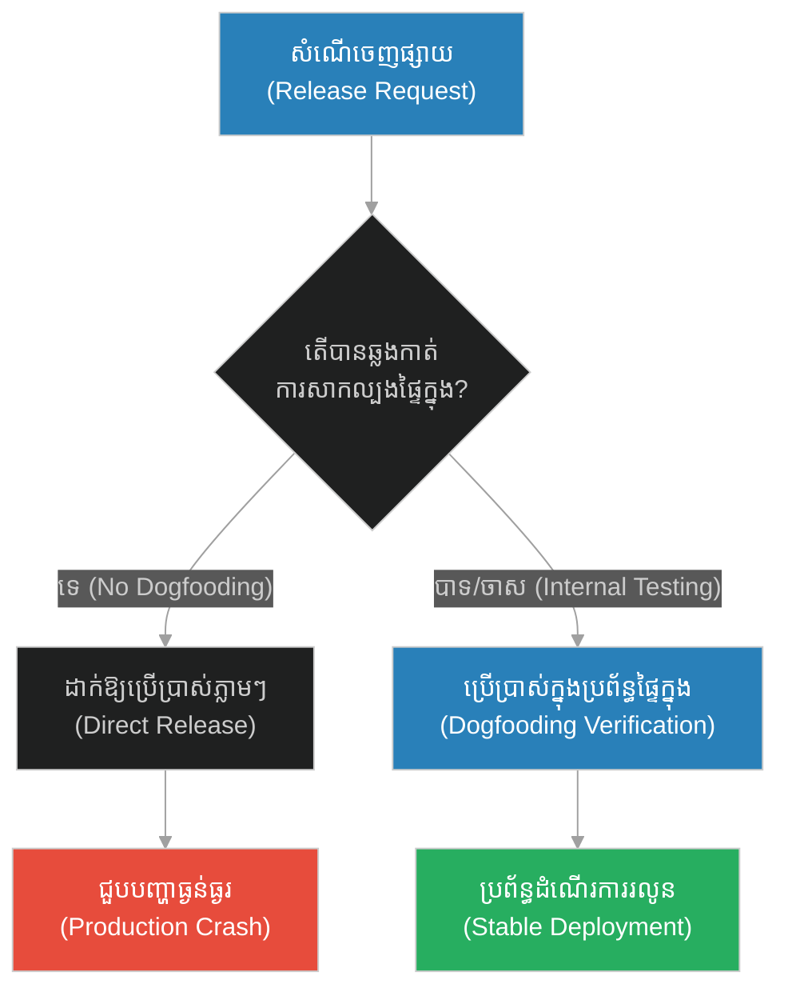
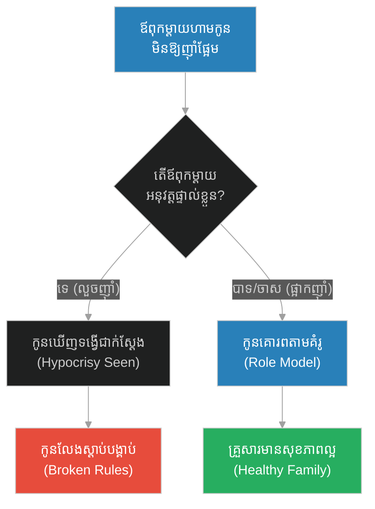
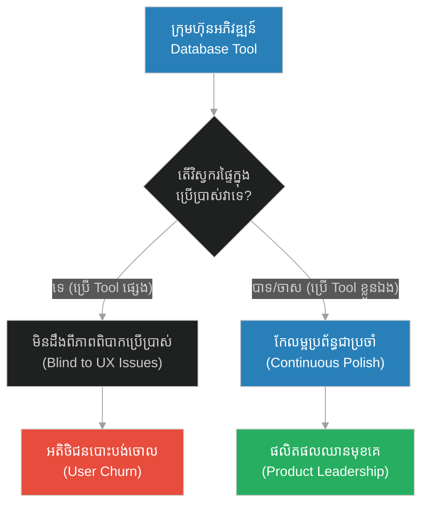
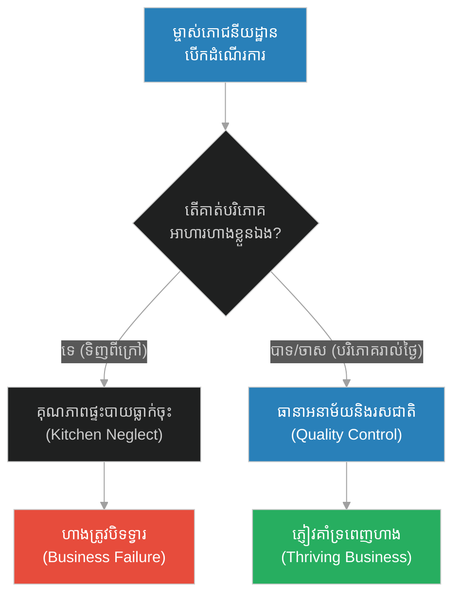
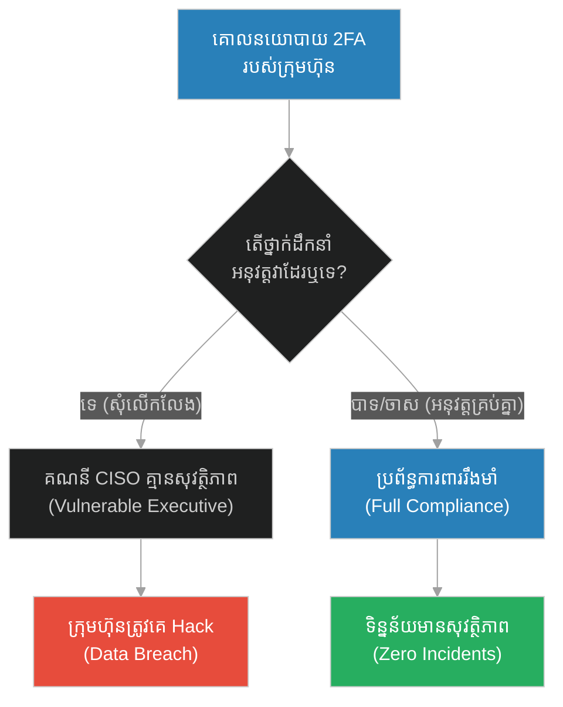
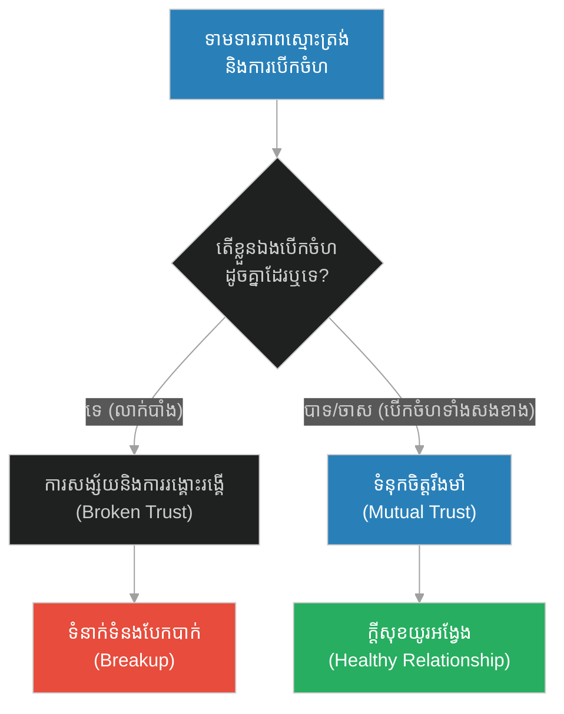
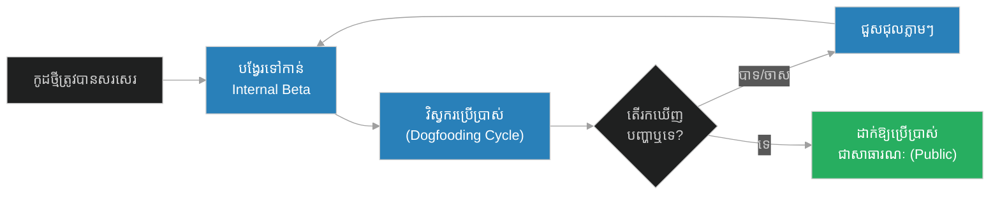

# Dogfooding & Practice-Before-Publish Policy (ក្មេងប្រុស និងផ្លែល្មើ)៖ ការសាកល្បងប្រើប្រាស់ប្រព័ន្ធផ្ទាល់ខ្លួន និងភាពត្រឹមត្រូវនៃការអនុវត្ត (Dogfooding & Practice-Before-Publish Policy & Internal Testing and Pre-release Validation & The Boy and the Dates)

**Author:** ichamrong  
**Date:** 2026-05-28  
**Tags:** #dogfooding #testing-policy #software-quality #integrity #release-engineering  
**Category:** Concepts  
**Read Time:** ~15 min  

---

## 📌 មាតិកា (Table of Contents)
- [អន្ទាក់ផ្លូវចិត្ត (The Trap)](#0)
- [១. រឿងព្រេងនិទាន៖ ក្មេងប្រុស និងផ្លែល្មើ (The Legend of The Boy and the Dates)](#1)
  - [សុំពេល ៤០ ថ្ងៃ (Forty Days Later)](#1-1)
- [២. បញ្ហា៖ Dogfooding & Practice-Before-Publish Policy (The Issue: Dogfooding & Practice-Before-Publish Policy)](#2)
- [៣. ឧទាហរណ៍ជាក់ស្តែងក្នុងពិភពពិត (Real World Examples)](#3)
  - [ឧទាហរណ៍ទី ១ — កម្រិតស្រាល (គ្រួសារ)៖ ទម្លាប់បរិភោគ និងការប្រដៅកូន (The Family Diet Dilemma)](#3-1)
  - [ឧទាហរណ៍ទី ២ — កម្រិតមធ្យម (បច្ចេកទេស)៖ ការប្រើប្រាស់កម្មវិធីផ្ទាល់ខ្លួនមុនពេលដាក់ឱ្យដំណើរការ (The Dev Tools Disconnect)](#3-2)
  - [ឧទាហរណ៍ទី ៣ — កម្រិតមធ្យម (ធុរកិច្ច)៖ ស្ថាបនិកប្រើប្រាស់សេវាកម្មរបស់ខ្លួន (The Restaurant Owner Test)](#3-3)
  - [ឧទាហរណ៍ទី ៤ — កម្រិតមធ្យម (សង្គម/គ្រប់គ្រង)៖ គោលនយោបាយផ្ទៃក្នុង និងការអនុវត្តរបស់មេដឹកនាំ (The Corporate 2FA Exemption)](#3-4)
  - [ឧទាហរណ៍ទី ៥ — កម្រិតធ្ងន់ (ទំនាក់ទំនង)៖ ការសន្យា និងទម្ងន់នៃទង្វើជាក់ស្តែង (The Double Standard Relationship)](#3-5)
- [៤. ដំណោះស្រាយទូទៅ៖ ការសាកល្បងប្រើប្រាស់ផ្ទៃក្នុង និងការបញ្ជាក់សុពលភាព (The General Solution: Internal Dogfooding and Pre-release Verification)](#4)
- [សេចក្តីសន្និដ្ឋាន (Conclusion)](#5)
- [ឯកសារយោង (References)](#6)
- [Related Posts](#7)

---

<a id="0"></a>
## អន្ទាក់ផ្លូវចិត្ត (The Trap)

តើមានញឹកញាប់ប៉ុនណាដែលយើងបង្កើតច្បាប់ ឬប្រព័ន្ធមួយដែលខ្លួនយើងផ្ទាល់មិនចង់អនុវត្ត ឬប្រើប្រាស់វា? នៅក្នុងការអភិវឌ្ឍកម្មវិធី ការបញ្ជូនមុខងារថ្មីៗទៅកាន់អ្នកប្រើប្រាស់ដោយគ្មានការសាកល្បងផ្ទៃក្នុង គឺជាអន្ទាក់ដ៏ធំមួយ។

* **ការចេញផ្សាយលឿន (Rapid Release)** — បញ្ជូនកូដថ្មីៗទៅកាន់អតិថិជនភ្លាមៗដើម្បីបានលទ្ធផលលឿន ប៉ុន្តែមិនបានសាកល្បងប្រើប្រាស់ផ្ទាល់ខ្លួន ដែលអាចបង្កឱ្យមានបញ្ហាលាក់កំបាំង និងការបាត់បង់ទំនុកចិត្ត។
* **ការសាកល្បងជាក់ស្តែង (Dogfooding Verification)** — ចំណាយពេលប្រើប្រាស់ប្រព័ន្ធដោយខ្លួនឯងជាមុន ដើម្បីធានាបាននូវគុណភាពខ្ពស់ និងភាពត្រឹមត្រូវ ទោះបីជាវាត្រូវពន្យារពេលការចេញផ្សាយខ្លះក៏ដោយ។



1. **រឿងព្រេងនិទាន (The Legend)** — រឿងក្មេងប្រុសញៀនផ្លែល្មើ និងការសម្រេចចិត្តផ្អាក ៤០ ថ្ងៃដើម្បីកែប្រែខ្លួនឯងជាមុនរបស់ព្យាការី។
2. **បញ្ហា (The Issue)** — ការខ្វះខាត Dogfooding និងបញ្ហាដែលកើតឡើងនៅពេលកូដមិនត្រូវបានប្រើប្រាស់ដោយអ្នកបង្កើត។
3. **ឧទាហរណ៍ជាក់ស្តែង (Real World Examples)** — ករណីសិក្សាទាំង ៥ កម្រិត ពីគ្រួសារ រហូតដល់ទំនាក់ទំនង និងប្រព័ន្ធបច្ចេកវិទ្យា។
4. **ដំណោះស្រាយទូទៅ (The General Solution)** — ការបង្កើតប្រព័ន្ធ Routing សម្រាប់សាកល្បងផ្ទៃក្នុង (Dogfooding Pipeline)។

---

<a id="1"></a>
## ១. រឿងព្រេងនិទាន៖ ក្មេងប្រុស និងផ្លែល្មើ (The Legend of The Boy and the Dates)

មានម្តាយម្នាក់ មានការព្រួយបារម្ភយ៉ាងខ្លាំង ដោយសារតែកូនប្រុសរបស់គាត់ញៀននឹងការហូបផ្លែល្មើ (Dates) ច្រើនពេក ដែលធ្វើឱ្យខូចធ្មេញ និងប៉ះពាល់ដល់សុខភាព។ អ្នកម្តាយបានណែនាំកូនយ៉ាងណាក៏កូនមិនព្រមស្តាប់។ ដោយអស់ជម្រើស អ្នកម្តាយក៏បាននាំកូនប្រុសនោះ ធ្វើដំណើរផ្លូវឆ្ងាយមកជួបព្យាការីម៉ូហាម៉ាត់ ដើម្បីសុំឱ្យលោកជួយប្រៀនប្រដៅកូនរបស់គាត់ ព្រោះក្មេងនោះគោរពលោកខ្លាំងណាស់។

គាត់និយាយថា៖ *"ឱលោកគ្រូ! សូមលោកជួយប្រាប់កូនប្រុសខ្ញុំ ឱ្យឈប់ហូបផ្លែល្មើច្រើនពេកផង។"*

<a id="1-1"></a>
### សុំពេល ៤០ ថ្ងៃ (Forty Days Later)

ជំនួសឱ្យការស្តីបន្ទោសក្មេងនោះភ្លាមៗ ព្យាការីម៉ូហាម៉ាត់បានប្រាប់ម្តាយក្មេងនោះថា៖ **"សូមអ្នកនាំកូនត្រឡប់ទៅផ្ទះវិញសិនចុះ ហើយ ៤០ ថ្ងៃក្រោយ សឹមត្រឡប់មកជួបខ្ញុំម្តងទៀត។"** 

ម្តាយមានការងឿងឆ្ងល់ តែគាត់គោរពតាមការណែនាំ។ ៤០ ថ្ងៃក្រោយមក គាត់បាននាំកូនប្រុសមកជួបលោកម្តងទៀត។ លើកនេះ ព្យាការីម៉ូហាម៉ាត់បានអង្គុយចុះ សម្លឹងមើលមុខក្មេងប្រុសនោះដោយក្តីមេត្តា ហើយនិយាយយ៉ាងទន់ភ្លន់ថា៖ **"ក្មួយប្រុសអើយ... សូមក្មួយឈប់ហូបផ្លែល្មើច្រើនពេកទៅ វាធ្វើឱ្យខូចសុខភាពហើយ។"** ក្មេងប្រុសនោះងក់ក្បាល រួចសន្យាថានឹងធ្វើតាម។

ម្តាយក្មេងនោះនៅតែឆ្ងល់ ក៏សួរថា៖ *"លោកគ្រូ! បើត្រឹមតែនិយាយប្រយោគមួយឃ្លានេះ ហេតុអ្វីក៏លោកគ្រូមិននិយាយតាំងពី ៤០ ថ្ងៃមុន? ហេតុអ្វីចាំបាច់ឱ្យពួកខ្ញុំធ្វើដំណើរទៅមកអញ្ចឹង?"*

ព្យាការីម៉ូហាម៉ាត់ញញឹមហើយតបថា៖ **"កាលពី ៤០ ថ្ងៃមុន ខ្ញុំខ្លួនឯងក៏ញ៉ាំផ្លែល្មើច្រើនដែរ។ ខ្ញុំមិនអាចប្រាប់ក្មេងនេះឱ្យឈប់ធ្វើទម្លាប់មួយ ខណៈដែលខ្ញុំនៅតែធ្វើវាដដែលនោះទេ។ ខ្ញុំត្រូវចំណាយពេល ៤០ ថ្ងៃនេះ ដើម្បីផ្តាច់ការញ៉ាំផ្លែល្មើរបស់ខ្ញុំសិន ទើបសម្តីរបស់ខ្ញុំមានឥទ្ធិពលលើគេ។"**

---

<a id="2"></a>
## ២. បញ្ហា៖ Dogfooding & Practice-Before-Publish Policy (The Issue: Dogfooding & Practice-Before-Publish Policy)

នៅក្នុងវិស្វកម្មប្រព័ន្ធ (Systems Engineering) អសង្គតិភាពរវាង **អ្វីដែលយើងបង្កើត** និង **អ្វីដែលយើងប្រើប្រាស់** ត្រូវបានគេហៅថា "កង្វះខាតនៃការធ្វើ Dogfooding" (Eating your own dog food)។ នៅពេលដែលក្រុមអភិវឌ្ឍន៍មិនព្រមសាកល្បងផលិតផលផ្ទាល់ខ្លួននៅក្នុងការងារប្រចាំថ្ងៃ ពួកគេនឹងមិនអាចដឹងពីបញ្ហាហូរហែ និងចំណុចខ្វះខាតដែលអ្នកប្រើប្រាស់ពិតប្រាកដជួបប្រទះឡើយ។

សម្តីដែលគ្មានការអនុវត្តជាក់ស្តែង គឺដូចជាប្រព័ន្ធដែលចេញផ្សាយដោយមិនបានធ្វើតេស្តផ្ទៃក្នុង។

### Code Example: Fragile vs. Resilient Release System

ខាងក្រោមនេះជាការប្រៀបធៀបក្នុងភាសា TypeScript រវាងប្រព័ន្ធបញ្ជូនការផ្លាស់ប្តូរ (Deployment Pipeline) ដែលគ្មានការសាកល្បងផ្ទៃក្នុង និងប្រព័ន្ធដែលអនុវត្តគោលការណ៍ `Practice-Before-Publish` (Dogfooding)។

```typescript
// ==========================================
// FRAGILE PATH: No Internal Testing / Dogfooding
// ==========================================
class FragileDeploymentService {
  private currentVersion: string = "v1.0.0";

  // Deploy directly to production without internal verification
  public deployFeature(newVersion: string, codeChanges: string): void {
    console.log(`[Fragile] Deploying version ${newVersion} directly to public production...`);
    
    // Simulate immediate release to all users
    this.currentVersion = newVersion;
    this.executePublicTraffic(codeChanges);
  }

  private executePublicTraffic(changes: string): void {
    if (changes.includes("bug")) {
      console.error("[Fragile] ERROR: Public users hit a critical bug! System crashed!");
    } else {
      console.log("[Fragile] Deploy successful, but users are unverified guinea pigs.");
    }
  }
}

// ==========================================
// RESILIENT PATH: Dogfooding & Pre-release Policy
// ==========================================
class ResilientDeploymentService {
  private currentVersion: string = "v1.0.0";
  private isDogfoodingActive: boolean = false;
  private dogfoodingFeedbackCount: number = 0;

  // Enforce Dogfooding before public promotion
  public deployFeature(newVersion: string, codeChanges: string): void {
    console.log(`\n[Resilient] Initiating Dogfooding Phase for ${newVersion}...`);
    this.isDogfoodingActive = true;
    this.dogfoodingFeedbackCount = 0;

    // Route only internal developers and testers to the new version
    const internalFeedback = this.simulateInternalUsage(codeChanges);

    if (internalFeedback.hasBugs) {
      console.warn(`[Resilient] WARNING: Internal team caught bug: "${internalFeedback.errorMessage}". Aborting release!`);
      this.rollback();
    } else {
      console.log("[Resilient] 40 Days (internal test cycle) complete. Internal feedback: 100% stable.");
      this.promoteToProduction(newVersion);
    }
  }

  private simulateInternalUsage(changes: string): { hasBugs: boolean; errorMessage: string } {
    console.log("[Resilient] Routing company internal traffic to new version...");
    
    // Internal developers run their daily work on the RC build
    if (changes.includes("bug")) {
      return { hasBugs: true, errorMessage: "Null pointer error in User Profile Dashboard" };
    }
    return { hasBugs: false, errorMessage: "" };
  }

  private promoteToProduction(version: string): void {
    this.isDogfoodingActive = false;
    this.currentVersion = version;
    console.log(`[Resilient] SUCCESS: Promoting ${version} to all external public users.`);
  }

  private rollback(): void {
    this.isDogfoodingActive = false;
    console.log("[Resilient] System rolled back to safe state. Public users unaffected.");
  }
}

// Execution Demonstration
const codeWithBug = "Feature: User Profile Update (contains: bug)";
const cleanCode = "Feature: New Dark Mode Toggle UI";

// 1. Run Fragile System
const fragilePipeline = new FragileDeploymentService();
fragilePipeline.deployFeature("v1.1.0", codeWithBug);

// 2. Run Resilient System
const resilientPipeline = new ResilientDeploymentService();
resilientPipeline.deployFeature("v1.1.0", codeWithBug); // Bug caught internally
resilientPipeline.deployFeature("v1.2.0", cleanCode);   // Successful deployment
```

---

<a id="3"></a>
## ៣. ឧទាហរណ៍ជាក់ស្តែងក្នុងពិភពពិត (Real World Examples)

<a id="3-1"></a>
### ឧទាហរណ៍ទី ១ — កម្រិតស្រាល (គ្រួសារ)៖ ទម្លាប់បរិភោគ និងការប្រដៅកូន (The Family Diet Dilemma)
ឪពុកម្តាយដែលហាមឃាត់កូនមិនឱ្យទទួលទានអាហារផ្អែម និងភេសជ្ជៈកំប៉ុងដើម្បីការពារសុខភាព ប៉ុន្តែខ្លួនឯងតែងតែលួចបរិភោគវានៅចំពោះមុខកូន ឬពេលកូនគេងលក់។



<a id="3-2"></a>
### ឧទាហរណ៍ទី ២ — កម្រិតមធ្យម (បច្ចេកទេស)៖ ការប្រើប្រាស់កម្មវិធីផ្ទាល់ខ្លួនមុនពេលដាក់ឱ្យដំណើរការ (The Dev Tools Disconnect)
ក្រុមហ៊ុនផលិតកម្មវិធីគ្រប់គ្រង Database មួយ បង្ខំឱ្យអតិថិជនប្រើប្រាស់ UI ថ្មី ប៉ុន្តែវិស្វករផ្ទៃក្នុងរបស់ខ្លួន បែរជាប្រើប្រាស់ Command Line Tool របស់គូប្រជែងដើម្បីធ្វើការងារប្រចាំថ្ងៃទៅវិញ។



<a id="3-3"></a>
### ឧទាហរណ៍ទី ៣ — កម្រិតមធ្យម (ធុរកិច្ច)៖ ស្ថាបនិកប្រើប្រាស់សេវាកម្មរបស់ខ្លួន (The Restaurant Owner Test)
ម្ចាស់ភោជនីយដ្ឋានម្នាក់ មិនដែលញ៉ាំអាហារដែលចម្អិននៅក្នុងផ្ទះបាយរបស់ខ្លួនឡើយ ដោយសារតែបារម្ភពីបញ្ហាអនាម័យ និងគុណភាពគ្រឿងផ្សំ រួចទៅទិញអាហារពីហាងផ្សេងមកបរិភោគ។



<a id="3-4"></a>
### ឧទាហរណ៍ទី ៤ — កម្រិតមធ្យម (សង្គម/គ្រប់គ្រង)៖ គោលនយោបាយផ្ទៃក្នុង និងការអនុវត្តរបស់មេដឹកនាំ (The Corporate 2FA Exemption)
នាយកប្រតិបត្តិផ្នែកសន្តិសុខព័ត៌មាន (CISO) បានបង្កើតគោលនយោបាយតឹងរ៉ឹងបង្ខំឱ្យបុគ្គលិកប្រើប្រាស់ 2-Factor Authentication (2FA) គ្រប់កម្មវិធីទាំងអស់ ប៉ុន្តែខ្លួនគាត់ផ្ទាល់បានស្នើសុំលើកលែងមិនប្រើ 2FA លើគណនីរបស់គាត់ព្រោះវា "រំខានការងាររបស់គាត់"។



<a id="3-5"></a>
### ឧទាហរណ៍ទី ៥ — កម្រិតធ្ងន់ (ទំនាក់ទំនង)៖ ការសន្យា និងទម្ងន់នៃទង្វើជាក់ស្តែង (The Double Standard Relationship)
ដៃគូម្ខាងទាមទារឱ្យដៃគូម្ខាងទៀតត្រូវតែបង្ហាញទីតាំង និងចែករំលែកលេខកូដទូរស័ព្ទដើម្បីបង្ហាញភាពស្មោះត្រង់ ប៉ុន្តែខ្លួនឯងផ្ទាល់តែងតែលាក់បាំងសកម្មភាព និងមានលេខកូដសម្ងាត់ដែលមិនឱ្យដៃគូដឹង។



---

<a id="4"></a>
## ៤. ដំណោះស្រាយទូទៅ៖ ការសាកល្បងប្រើប្រាស់ផ្ទៃក្នុង និងការបញ្ជាក់សុពលភាព (The General Solution: Internal Dogfooding and Pre-release Verification)

ដើម្បីកសាងប្រព័ន្ធដែលមានទំនុកចិត្ត និងដំណើរការបានល្អ វិស្វករប្រព័ន្ធ និងអ្នកដឹកនាំត្រូវតែប្រកាន់ខ្ជាប់នូវគោលការណ៍ `Dogfooding` តាមរយៈយន្តការខាងក្រោម៖

1. **Mandatory Canary Deployment to Internal Users**: ត្រូវបញ្ជូនកំណែកូដថ្មី (Beta/Release Candidate) ទៅកាន់បុគ្គលិក និងអ្នកអភិវឌ្ឍន៍ផ្ទៃក្នុង ដើម្បីប្រើប្រាស់ក្នុងការងារប្រចាំថ្ងៃជាមុនសិន។
2. **Execution under Reality (កុំធ្វើតេស្តតែលើក្រដាស)**៖ ត្រូវប្រើប្រាស់ទិន្នន័យពិតប្រាកដក្នុងទំហំជាក់ស្តែង (Real Load) ដើម្បីជៀសវាងការខុសគ្នារវាងការធ្វើតេស្តក្នុង Lab និងទីផ្សារជាក់ស្តែង។
3. **The "40-Day Rule" for Critical Changes**: ចំពោះការផ្លាស់ប្តូរធំៗ ត្រូវទុកពេលឱ្យបានគ្រប់គ្រាន់សម្រាប់ការសាកល្បងផ្ទៃក្នុង (Internal Test Cycle) ដើម្បីឱ្យបញ្ហាលាក់កំបាំងអាចលេចចេញមក។



---

<a id="5"></a>
## សេចក្តីសន្និដ្ឋាន (Conclusion)

> **«មុននឹងប្រាប់ឱ្យពិភពលោកផ្លាស់ប្តូរ សូមផ្លាស់ប្តូរខ្លួនឯងជាមុនសិន។ ប្រព័ន្ធដែលល្អ កើតចេញពីការសាកល្បង និងប្រើប្រាស់ដោយអ្នកបង្កើតផ្ទាល់។»**

ការបង្កើតច្បាប់ ឬប្រព័ន្ធមួយដែលគ្មានការសាកល្បង និងការអនុវត្តជាគំរូពីស្ថាបនិក ឬអ្នកអភិវឌ្ឍន៍ផ្ទាល់ គឺគ្រាន់តែជាការបង្កើតការបំភាន់ភ្នែកប៉ុណ្ណោះ។ ភាពត្រឹមត្រូវ និងទម្ងន់នៃពាក្យសម្តី ឬកូដរបស់អ្នក កើតចេញពីសកម្មភាពជាក់ស្តែងដែលអ្នកបានធ្វើ។

---

<a id="6"></a>
## ឯកសារយោង (References)

*   **The Boy and the Dates** — A classic narrative highlighting integrity and behavior-driven alignment of guidance within Sufi moral teachings.
*   **Dogfooding History** — Originating in Microsoft (1988) under Paul Maritz, demanding that engineers use the software they build internally.
*   **Continuous Integration and Release Verification** — Software engineering practices highlighting Canary Releases and internal user routing.

---

<a id="7"></a>
## Related Posts

* [[211-prophet-and-the-blind-man.md]](211-prophet-and-the-blind-man.md) — Fairness in Scheduling & Priority Inversion Avoidance

## 🐇 ធ្លាក់ចូលក្នុងរន្ធទន្សាយ (Enter the Rabbit Hole)
ដើម្បីស្វែងយល់បន្ថែមអំពី សមធម៌ក្នុងការកំណត់អាទិភាព និងការការពារការក្រឡាប់អាទិភាព សូមបន្តដំណើរទៅកាន់៖

* 🚀 **[ចាប់ផ្តើមដំណើររុករក (Start the Journey) ➔ Fairness in Scheduling & Priority Inversion Avoidance (បុរសពិការភ្នែក និងការងាកចេញ)](./211-prophet-and-the-blind-man.md)**
