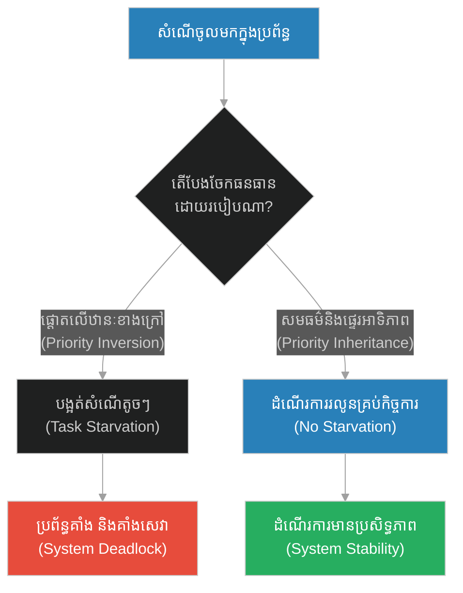
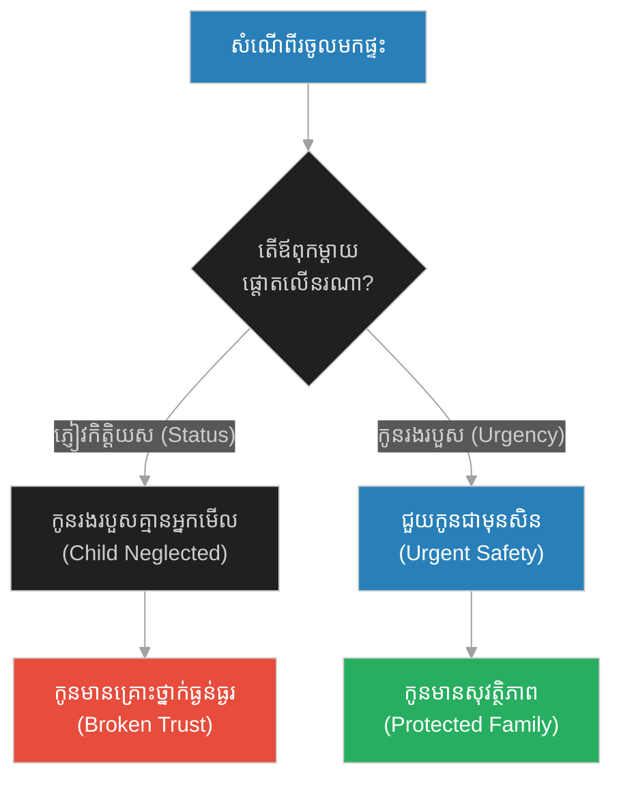
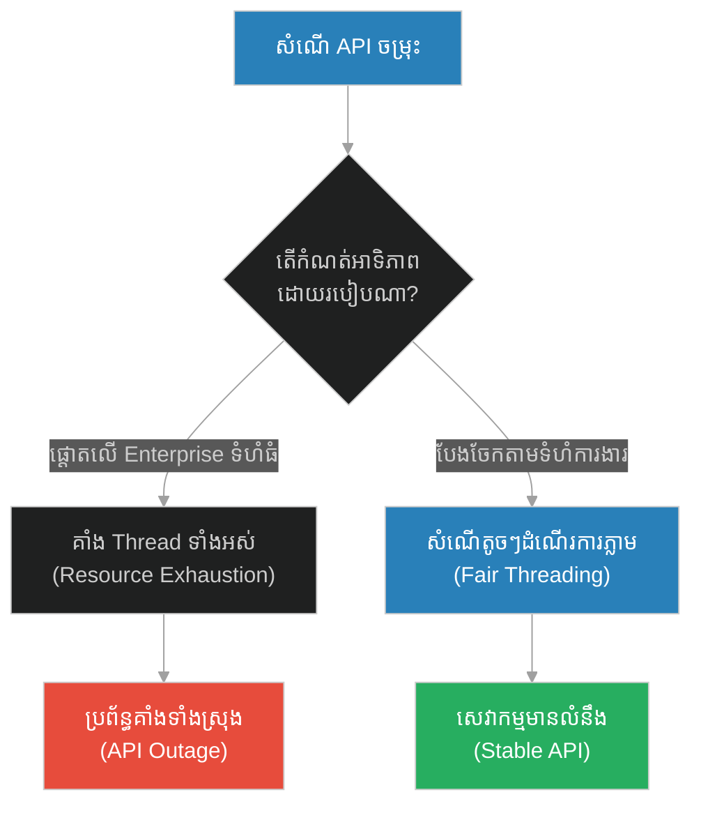
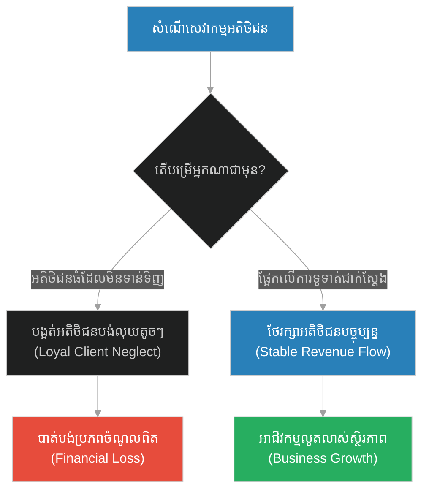
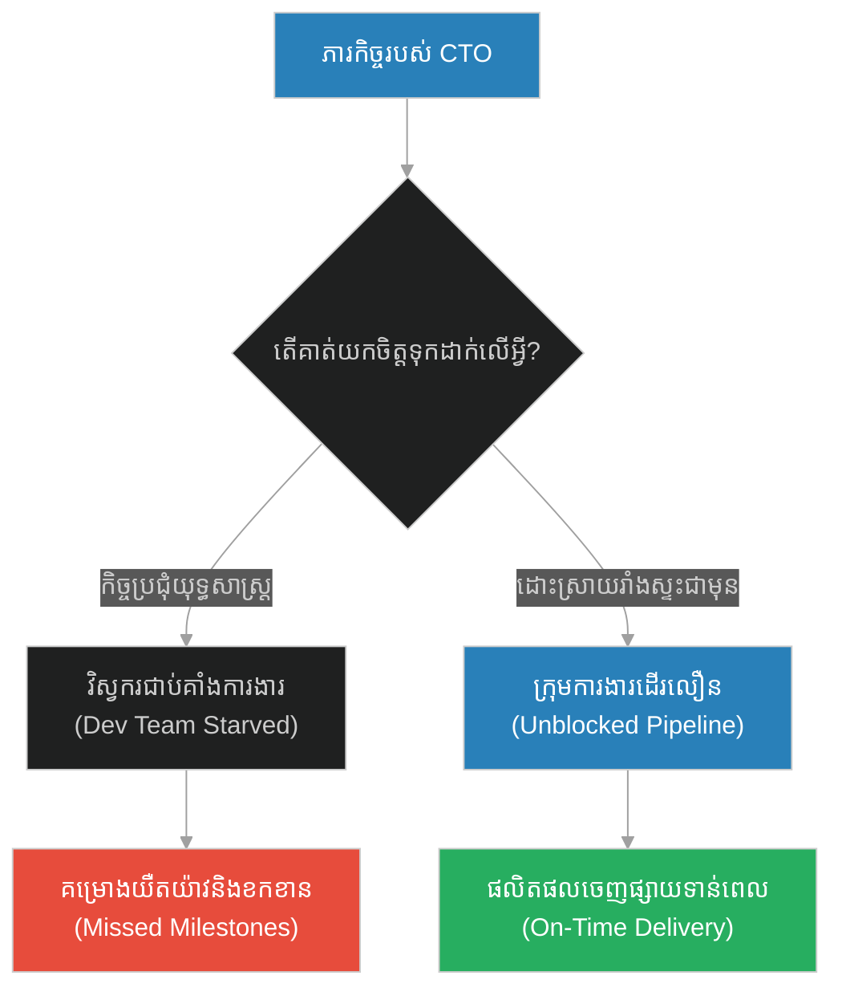
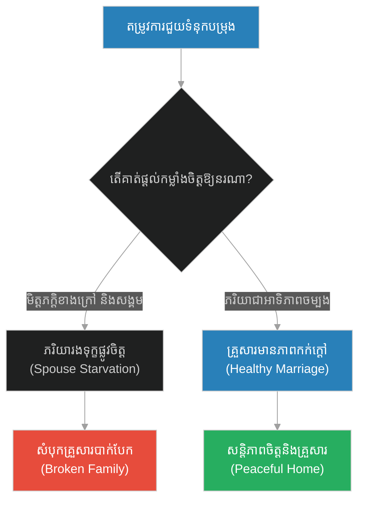

# Fairness in Scheduling & Priority Inversion Avoidance (បុរសពិការភ្នែក និងការងាកចេញ)៖ សមធម៌ក្នុងការកំណត់អាទិភាព និងការការពារការក្រឡាប់អាទិភាព (Fairness in Scheduling & Priority Inversion Avoidance & Equitable CPU Scheduling and Priority Inversion Prevention & The Frowning at the Blind Man)

**Author:** ichamrong  
**Date:** 2026-05-28  
**Tags:** #scheduling #priority-inversion #fairness #starvation #operating-systems  
**Category:** Concepts  
**Read Time:** ~15 min  

---

## 📌 មាតិកា (Table of Contents)
- [អន្ទាក់ផ្លូវចិត្ត (The Trap)](#0)
- [១. រឿងព្រេងនិទាន៖ បុរសពិការភ្នែក និងការងាកចេញ (The Legend of The Frowning at the Blind Man)](#1)
  - [ការបន្ទោសពីព្រះជាម្ចាស់ (The Divine Correction)](#1-1)
- [២. បញ្ហា៖ Fairness in Scheduling & Priority Inversion Avoidance (The Issue: Fairness in Scheduling & Priority Inversion Avoidance)](#2)
- [៣. ឧទាហរណ៍ជាក់ស្តែងក្នុងពិភពពិត (Real World Examples)](#3)
  - [ឧទាហរណ៍ទី ១ — កម្រិតស្រាល (គ្រួសារ)៖ ការយកចិត្តទុកដាក់ចំពោះភ្ញៀវ និងកូន (The Guest over Child Dilemma)](#3-1)
  - [ឧទាហរណ៍ទី ២ — កម្រិតមធ្យម (បច្ចេកទេស)៖ ការទូទាត់សំណើគណនីធំ និងគណនីធម្មតា (The Enterprise Premium Blockade)](#3-2)
  - [ឧទាហរណ៍ទី ៣ — កម្រិតមធ្យម (ធុរកិច្ច)៖ ការផ្តល់សេវាអតិថិជនមានអំណាច និងអតិថិជនស្មោះត្រង់ (The Whale vs. Loyal Client)](#3-3)
  - [ឧទាហរណ៍ទី ៤ — កម្រិតមធ្យម (សង្គម/គ្រប់គ្រង)៖ កិច្ចប្រជុំថ្នាក់ដឹកនាំ និងបញ្ហារាំងស្ទះរបស់ក្រុមការងារ (The Executive Meeting Starvation)](#3-4)
  - [ឧទាហរណ៍ទី ៥ — កម្រិតធ្ងន់ (ទំនាក់ទំនង)៖ ការចង់បានការទទួលស្គាល់ពីខាងក្រៅ និងដៃគូជីវិត (The Social Status over Spouse Trap)](#3-5)
- [៤. ដំណោះស្រាយទូទៅ៖ ពិធីសារផ្ទេរអាទិភាព និងសមធម៌ក្នុងការបែងចែកធនធាន (The General Solution: Priority Inheritance & Fair-Share Scheduling)](#4)
- [សេចក្តីសន្និដ្ឋាន (Conclusion)](#5)
- [ឯកសារយោង (References)](#6)
- [Related Posts](#7)

---

<a id="0"></a>
## អន្ទាក់ផ្លូវចិត្ត (The Trap)

តើយើងធ្លាប់បំភាយពេលវេលារបស់យើងទៅលើកិច្ចការដែលមើលទៅ "ធំដុំ ឬមានឋានៈខ្ពស់" តែមិនបានផ្តល់ផលប្រយោជន៍អ្វីសោះ ហើយព្រងើយកន្តើយនឹងកិច្ចការតូចតាចដែលត្រូវការជំនួយពិតប្រាកដដែរឬទេ? នៅក្នុងការគ្រប់គ្រងប្រព័ន្ធដំណើរការ (Task Scheduling) នេះជាអន្ទាក់នៃការបង្អត់ធនធាន (Starvation) និងការក្រឡាប់អាទិភាព (Priority Inversion)។

* **ការផ្តល់អាទិភាពតាមឋានៈ (Prestige-based Scheduling)** — ផ្តោតទៅលើតែសំណើដែលមានឋានៈខ្ពស់ ឬអតិថិជនធំៗ ទោះបីជាពួកគេមិនទាន់ត្រូវការជាបន្ទាន់ ឬមិនផ្តល់កិច្ចសហការ ដែលបណ្តាលឱ្យសំណើតូចៗតែមានសារៈសំខាន់ត្រូវរង់ចាំរហូតដល់ងាប់។
* **សមធម៌ក្នុងការបែងចែក (Fair-Share Scheduling)** — បែងចែកពេលវេលាដំណើរការស្មើភាព និងផ្ទេរអាទិភាពឡើងវិញដើម្បីធានាថារាល់កិច្ចការទាំងអស់ទទួលបានធនធានសមស្រប និងមិនមានកិច្ចការណាមួយត្រូវបានបង្អត់។



1. **រឿងព្រេងនិទាន (The Legend)** — រឿងព្យាការីម៉ូហាម៉ាត់ ងាកចេញពីបុរសពិការភ្នែក ដើម្បីបញ្ចុះបញ្ចូលមេដឹកនាំកំពូល Quraysh។
2. **បញ្ហា (The Issue)** — ការពន្យល់ពី Priority Inversion និង Starvation នៅក្នុងប្រព័ន្ធកុំព្យូទ័រ។
3. **ឧទាហរណ៍ជាក់ស្តែង (Real World Examples)** — ករណីសិក្សាទាំង ៥ កម្រិត ចាប់ពីគ្រួសាររហូតដល់ប្រព័ន្ធដំណើរការសង្គម។
4. **ដំណោះស្រាយទូទៅ (The General Solution)** — ការប្រើប្រាស់ Priority Inheritance Protocol ដើម្បីជៀសវាងការគាំងប្រព័ន្ធ។

---

<a id="1"></a>
## ១. រឿងព្រេងនិទាន៖ បុរសពិការភ្នែក និងការងាកចេញ (The Legend of The Frowning at the Blind Man)

ថ្ងៃមួយ ព្យាការីម៉ូហាម៉ាត់កំពុងជាប់រវល់យ៉ាងខ្លាំង ក្នុងការប្រជុំនិងពន្យល់ធម៌ទៅកាន់មេដឹកនាំកំពូលៗរបស់កុលសម្ព័ន្ធ Quraysh (អ្នកមានអំណាចនិងទ្រព្យសម្បត្តិ)។ លោកសង្ឃឹមយ៉ាងមុតមាំថា ប្រសិនបើមេដឹកនាំទាំងនេះព្រមទទួលយកសេចក្តីពិត នោះប្រជាជនរបស់ពួកគេរាប់ពាន់នាក់ ក៏នឹងដើរតាមផ្លូវត្រូវដែរ។

ស្របពេលនោះ មានបុរសពិការភ្នែកម្នាក់ឈ្មោះ Abdullah ibn Umm Maktum (ដែលជាអ្នកក្រីក្រ និងពិការ) បានដើរចូលមក រួចស្រែកសួរព្យាការីម៉ូហាម៉ាត់ឱ្យបង្រៀនធម៌ដល់គាត់។ ដោយសារតែគាត់ពិការភ្នែក គាត់មើលមិនឃើញទេថា ព្យាការីម៉ូហាម៉ាត់កំពុងតែប្រជុំជាមួយមេដឹកនាំកំពូលៗនោះ។

ព្យាការីម៉ូហាម៉ាត់មានការរំខានបន្តិច ព្រោះលោកកំពុងផ្តោតលើការបញ្ចុះបញ្ចូលអ្នកធំទាំងនោះ។ លោកមិនបាននិយាយអ្វីទេ គ្រាន់តែ **"ងក់ចិញ្ចើម (Frowned)" ហើយងាកមុខចេញពីបុរសពិការភ្នែកនោះ** ដើម្បីបន្តការសន្ទនាជាមួយមេដឹកនាំទាំងនោះវិញ។

<a id="1-1"></a>
### ការបន្ទោសពីព្រះជាម្ចាស់ (The Divine Correction)

ភ្លាមៗនោះ គម្ពីរគួរអាន (Quran) ក៏ត្រូវបានបើកបង្ហាញមក ដោយមានបន្ទូលបន្ទោសព្យាការីម៉ូហាម៉ាត់យ៉ាងត្រង់ៗថា៖ 

**"គាត់បានងក់ចិញ្ចើម ហើយងាកមុខចេញ ដោយសារតែបុរសពិការភ្នែកនោះដើរមករកគាត់។ តើអ្នកដឹងទេថា បុរសពិការភ្នែកនោះអាចនឹងកែប្រែខ្លួនឱ្យបរិសុទ្ធ? ចំណែកអ្នកមានអំណាចដែលអ្នកកំពុងតែយកចិត្តទុកដាក់នោះ គេមិនខ្វល់ពីអ្នកទាល់តែសោះ។"**

ទោះបីជាព្យាការីម៉ូហាម៉ាត់មានបំណងល្អ (ចង់ជួយសង្គមធំ) ក៏ព្រះជាម្ចាស់ចង់ដាស់តឿនលោកថា មិនត្រូវវាយតម្លៃមនុស្សដោយសារតែ "ឋានៈ ឬរូបរាងខាងក្រៅ" ហើយបង្អត់ឱកាសអ្នកដែលត្រូវការជាក់ស្តែងនោះឡើយ។ តាំងពីពេលនោះមក ព្យាការីម៉ូហាម៉ាត់តែងតែទទួលស្វាគមន៍បុរសពិការភ្នែកនោះយ៉ាងកក់ក្តៅ ដោយពាក្យថា៖ *"សូមស្វាគមន៍បុរស ដែលធ្វើឱ្យព្រះជាម្ចាស់បន្ទោសខ្ញុំ!"*

---

<a id="2"></a>
## ២. បញ្ហា៖ Fairness in Scheduling & Priority Inversion Avoidance (The Issue: Fairness in Scheduling & Priority Inversion Avoidance)

នៅក្នុងវិទ្យាសាស្ត្រកុំព្យូទ័រ និងប្រព័ន្ធប្រតិបត្តិការ (Operating Systems) **Priority Inversion (ការក្រឡាប់អាទិភាព)** កើតឡើងនៅពេលដែលកិច្ចការដែលមានអាទិភាពទាប (Low Priority Task) កំពុងកាន់កាប់ធនធានមួយ (Shared Resource) ដែលត្រូវការដោយកិច្ចការដែលមានអាទិភាពខ្ពស់ (High Priority Task)។ ខណៈពេលនោះ កិច្ចការដែលមានអាទិភាពមធ្យម (Medium Priority Task) បែរជាចូលមកដណ្តើមយក CPU ធ្វើឱ្យកិច្ចការទាបមិនអាចបញ្ចប់ការងារ ដើម្បីព្រលែងធនធានឱ្យកិច្ចការខ្ពស់បានឡើយ។

ជាលទ្ធផល កិច្ចការខ្ពស់ (High Priority) ត្រូវរងចាំកិច្ចការមធ្យម (Medium Priority) ដែលនេះជាការផ្ទុយពីតក្កវិជ្ជានៃការកំណត់អាទិភាព។

### Code Example: Priority Scheduling Simulation

ខាងក្រោមនេះជាការប្រៀបធៀបក្នុងភាសា TypeScript រវាងប្រព័ន្ធរៀបចំកិច្ចការ (Task Scheduler) ដែលងាយរងគ្រោះនឹងការបង្អត់ធនធាន (Starvation) និងប្រព័ន្ធដែលមានយន្តការបង្ការ (Priority Inheritance)។

```typescript
interface Task {
  id: string;
  priority: number; // 1 = Low, 2 = Medium, 3 = High
  needsResource: boolean;
  workUnits: number;
}

// ==========================================
// FRAGILE PATH: Naive Priority Scheduler
// ==========================================
class FragileTaskScheduler {
  private queue: Task[] = [];

  public addTask(task: Task): void {
    this.queue.push(task);
    // Sort tasks strictly by priority (High to Low)
    this.queue.sort((a, b) => b.priority - a.priority);
  }

  public runNextTask(): void {
    if (this.queue.length === 0) return;

    const task = this.queue.shift()!;
    console.log(`[Fragile] Running Task ${task.id} (Priority: ${task.priority})`);
    
    // Simulate starvation of low priority tasks
    if (task.priority === 3) {
      console.log(`[Fragile] Task ${task.id} completed. High priority executed.`);
    } else {
      console.log(`[Fragile] Task ${task.id} executed slowly due to starvation.`);
    }
  }
}

// ==========================================
// RESILIENT PATH: Priority Inheritance Scheduler
// ==========================================
class ResilientTaskScheduler {
  private queue: Task[] = [];
  private resourceLockedBy: string | null = null;

  public addTask(task: Task): void {
    this.queue.push(task);
  }

  public runSchedule(): void {
    // 1. Detect Priority Inversion
    // If a High priority task (priority 3) is waiting for a resource 
    // held by a Low priority task (priority 1), promote the Low task's priority.
    
    const lowTask = this.queue.find(t => t.priority === 1 && t.needsResource);
    const highTask = this.queue.find(t => t.priority === 3 && t.needsResource);

    if (lowTask && highTask) {
      console.log(`\n[Resilient] Priority Inversion Detected!`);
      console.log(`[Resilient] Promoting Task ${lowTask.id} priority from 1 to 3 to release resource.`);
      lowTask.priority = 3; // Temporary Promotion (Inheritance)
    }

    // 2. Sort and execute
    this.queue.sort((a, b) => b.priority - a.priority);
    
    while (this.queue.length > 0) {
      const current = this.queue.shift()!;
      console.log(`[Resilient] Executing Task ${current.id} (Active Priority: ${current.priority})`);
      
      if (current.id === lowTask?.id) {
        console.log(`[Resilient] Task ${current.id} finished work and released the resource.`);
      }
    }
  }
}

// Demonstration
const lowTask: Task = { id: "Abdullah (Blind Man)", priority: 1, needsResource: true, workUnits: 2 };
const medTask: Task = { id: "Busywork (Quraysh Leaders)", priority: 2, needsResource: false, workUnits: 5 };
const highTask: Task = { id: "Critical Instruction", priority: 3, needsResource: true, workUnits: 1 };

// Fragile execution: High task blocks because resource is locked by low task, but medium task preempts low task.
console.log("--- Fragile System ---");
const fragile = new FragileTaskScheduler();
fragile.addTask(highTask);
fragile.addTask(medTask);
fragile.addTask(lowTask);
fragile.runNextTask(); // Runs High
fragile.runNextTask(); // Runs Med (Low task is starved, High task remains blocked on resource!)

// Resilient execution
console.log("\n--- Resilient System ---");
const resilient = new ResilientTaskScheduler();
resilient.addTask(lowTask);
resilient.addTask(medTask);
resilient.addTask(highTask);
resilient.runSchedule();
```

---

<a id="3"></a>
## ៣. ឧទាហរណ៍ជាក់ស្តែងក្នុងពិភពពិត (Real World Examples)

<a id="3-1"></a>
### ឧទាហរណ៍ទី ១ — កម្រិតស្រាល (គ្រួសារ)៖ ការយកចិត្តទុកដាក់ចំពោះភ្ញៀវ និងកូន (The Guest over Child Dilemma)
ឪពុកម្តាយម្នាក់ ព្យាយាមយកចិត្តទុកដាក់ និងជជែកលេងជាមួយភ្ញៀវកិត្តិយសដែលមកលេងផ្ទះ (High Status) តែបែរជាងាកមុខចេញ និងមិនអើពើនឹងកូនរបស់ខ្លួនដែលកំពុងយំសួររកជំនួយព្រោះមានរបួស (Urgent/Low Status)។



<a id="3-2"></a>
### ឧទាហរណ៍ទី ២ — កម្រិតមធ្យម (បច្ចេកទេស)៖ ការទូទាត់សំណើគណនីធំ និងគណនីធម្មតា (The Enterprise Premium Blockade)
API Gateway ដែលកំណត់អាទិភាពសំណើពី Enterprise Customers ខ្ពស់ជាង Free Tier។ ប៉ុន្តែនៅពេលគណនី Enterprise បញ្ជូនសំណើធំៗ និងយឺត (Slow Queries) វាកាន់កាប់ Thread Block ទាំងអស់ ធ្វើឱ្យគណនី Free Tier (ដែលសំណើតូច និងលឿន) ត្រូវគាំងសេវាទាំងអស់។



<a id="3-3"></a>
### ឧទាហរណ៍ទី ៣ — កម្រិតមធ្យម (ធុរកិច្ច)៖ ការផ្តល់សេវាអតិថិជនមានអំណាច និងអតិថិជនស្មោះត្រង់ (The Whale vs. Loyal Client)
ក្រុមហ៊ុនប្រឹក្សាយោបល់មួយ ព្យាយាមចំណាយពេលរាប់ខែដើម្បីរត់ការ និងផ្គាប់ចិត្តក្រុមហ៊ុនយក្សមួយដែលទាមទារសេវាកម្មច្រើន តែមិនទាន់សម្រេចចិត្តទិញ (Whale Client) ខណៈពេលដែលពួកគេមិនអើពើ និងពន្យារពេលសំណើរបស់អតិថិជនស្មោះត្រង់ខ្នាតតូចដែលបង់លុយជាប្រចាំ។



<a id="3-4"></a>
### ឧទាហរណ៍ទី ៤ — កម្រិតមធ្យម (សង្គម/គ្រប់គ្រង)៖ កិច្ចប្រជុំថ្នាក់ដឹកនាំ និងបញ្ហារាំងស្ទះរបស់ក្រុមការងារ (The Executive Meeting Starvation)
ប្រធានផ្នែកបច្ចេកវិទ្យា (CTO) ម្នាក់ចំណាយពេលពេញមួយសប្តាហ៍ចូលរួមកិច្ចប្រជុំយុទ្ធសាស្ត្រមិនចេះចប់មិនចេះហើយជាមួយក្រុមប្រឹក្សាភិបាល (High Status) តែមិនព្រមចំណាយពេល ៥ នាទីដើម្បី Approve ប្រព័ន្ធបំពេញការងាររបស់វិស្វករដែលកំពុងជាប់គាំងការងារ (Blocked Developer)។



<a id="3-5"></a>
### ឧទាហរណ៍ទី ៥ — កម្រិតធ្ងន់ (ទំនាក់ទំនង)៖ ការចង់បានការទទួលស្គាល់ពីខាងក្រៅ និងដៃគូជីវិត (The Social Status over Spouse Trap)
ស្វាមីម្នាក់ចំណាយពេល និងថាមពលទាំងអស់ដើម្បីឆ្លើយតប និងជួយដោះស្រាយបញ្ហាធុរៈមិត្តភក្តិ ឬអ្នកគាំទ្រលើបណ្តាញសង្គម (Social Status) តែងាកចេញ និងងក់ចិញ្ចើមដាក់ភរិយាដែលកំពុងមានទុក្ខព្រួយ និងសុំជំនួយផ្លូវចិត្តនៅផ្ទះ (Loyal Partner)។



---

<a id="4"></a>
## ៤. ដំណោះស្រាយទូទៅ៖ ពិធីសារផ្ទេរអាទិភាព និងសមធម៌ក្នុងការបែងចែកធនធាន (The General Solution: Priority Inheritance & Fair-Share Scheduling)

ដើម្បីជៀសវាងការក្រឡាប់អាទិភាព (Priority Inversion) និងធានានូវយុត្តិធម៌ក្នុងការបែងចែកធនធាន វិស្វករប្រព័ន្ធគួរតែអនុវត្តយន្តការដូចខាងក្រោម៖

1. **Priority Inheritance Protocol (PIP)**: នៅពេលដែលកិច្ចការដែលមានអាទិភាពទាប (Low Priority Task) កាន់កាប់សោរ (Lock) ដែលកិច្ចការខ្ពស់ (High Priority Task) កំពុងរង់ចាំ ត្រូវដំឡើងអាទិភាពរបស់កិច្ចការទាបឱ្យស្មើនឹងកិច្ចការខ្ពស់ជាបណ្តោះអាសន្ន ដើម្បីឱ្យវាបញ្ចប់ការងារបានលឿន និងលែងសោរនោះ។
2. **Fair-Share Round-Robin**: ប្រើប្រាស់យន្តការដែលធានាថារាល់សំណើទាំងអស់ ទោះមានអាទិភាពទាបក៏ដោយ ត្រូវតែទទួលបានចំណែកពេលវេលា CPU (Time Slice) យ៉ាងហោចណាស់ក៏បន្តិចបន្តួចដែរ ដើម្បីការពារកុំឱ្យមានការបង្អត់សេវាទាំងស្រុង (Anti-Starvation)។
3. **Decoupled Outbox and Queue**: ញែកសំណើដែលពឹងផ្អែកលើការសម្រេចចិត្តខាងក្រៅ ឬសំណើធំៗយឺតយ៉ាវ ចេញពី Main Event Loop ដើម្បីការពារការរាំងស្ទះ។

```mermaid
%%{init: {
  'theme': 'dark',
  'themeVariables': {
    'background': '#1e1e1e',
    'primaryTextColor': '#ffffff',
    'lineColor': '#a0a0a0'
  },
  'themeCSS': 'svg { background-color: #1e1e1e !important; padding: 1rem !important; border-radius: 8px !important; } .edgeLabel rect { fill: #1e1e1e !important; } text, tspan { fill: #ffffff !important; }'
}}%%
graph LR
    Low["កិច្ចការទាប (Low Task)<br/>កាន់កាប់ធនធាន"] --> Wait["កិច្ចការខ្ពស់ (High Task)<br/>រង់ចាំធនធាន"]
    Wait --> PIP["ពិធីសារ PIP ធ្វើការ<br/>(Inheritance Phase)"]
    PIP --> Upgrade["ដំឡើងកិច្ចការទាប<br/>ទៅជា អាទិភាពខ្ពស់"]
    Upgrade --> Release["បញ្ចប់ការងារលឿន<br/>និងព្រលែងធនធាន"]
    Release --> ExecuteHigh["កិច្ចការខ្ពស់<br/>ចូលដំណើរការបានភ្លាម"]
    
    style PIP fill:#2980b9,color:#fff
    style Upgrade fill:#2980b9,color:#fff
    style ExecuteHigh fill:#27ae60,color:#fff
```



---

<a id="5"></a>
## សេចក្តីសន្និដ្ឋាន (Conclusion)

> **«កុំវាស់វែងតម្លៃ ឬតម្រូវការរបស់មនុស្សម្នាក់ ដោយផ្អែកលើឋានៈខាងក្រៅរបស់គេឡើយ។ សមធម៌ពិតកើតឡើងនៅពេលយើងផ្តល់តម្លៃដល់អ្នកដែលត្រូវការជំនួយពិតប្រាកដ ដោយគ្មានការរើសអើង។»**

ការបំភាយកម្លាំងចិត្ត និងពេលវេលាទៅលើតែអ្វីដែលផ្តល់ផលប្រយោជន៍ ឬឋានៈខ្ពស់ គឺជារូបមន្តឆ្ពោះទៅរកការបាក់បែក និងការគាំងប្រព័ន្ធនៅក្នុងវិស័យទាំងឡាយ។ ការយកចិត្តទុកដាក់ស្មើភាព គឺជាគន្លឹះរក្សាលំនឹងរបស់ប្រព័ន្ធទាំងមូល។

---

<a id="6"></a>
## ឯកសារយោង (References)

*   **Surah Abasa (Quran 80:1-10)** — The historical Islamic revelation addressing the importance of equitability and addressing sincere requests without status-based bias.
*   **Priority Inversion on Mars Pathfinder (1997)** — A famous real-world system failure on Mars caused by priority inversion in VxWorks real-time operating system.
*   **Operating Systems: Three Easy Pieces** — Chapter on CPU Scheduling and fairness protocols.

---

<a id="7"></a>
## Related Posts

* [[210-prophet-and-the-boy-who-loved-dates.md]](210-prophet-and-the-boy-who-loved-dates.md) — Dogfooding & Practice-Before-Publish Policy
* [[212-prophet-and-the-stone-on-stomach.md]](212-prophet-and-the-stone-on-stomach.md) — Shared Leadership & Symmetric Node Clustering

## 🐇 ធ្លាក់ចូលក្នុងរន្ធទន្សាយ (Enter the Rabbit Hole)
ដើម្បីស្វែងយល់បន្ថែមអំពី ភាពជាអ្នកដឹកនាំរួមសុខរួមទុក្ខ និងចម្កោមម៉ាស៊ីនស្មើភាព សូមបន្តដំណើរទៅកាន់៖

* 🚀 **[ចាប់ផ្តើមដំណើររុករក (Start the Journey) ➔ Shared Leadership & Symmetric Node Clustering (ថ្មទប់ការស្រេកឃ្លាន)](./212-prophet-and-the-stone-on-stomach.md)**
