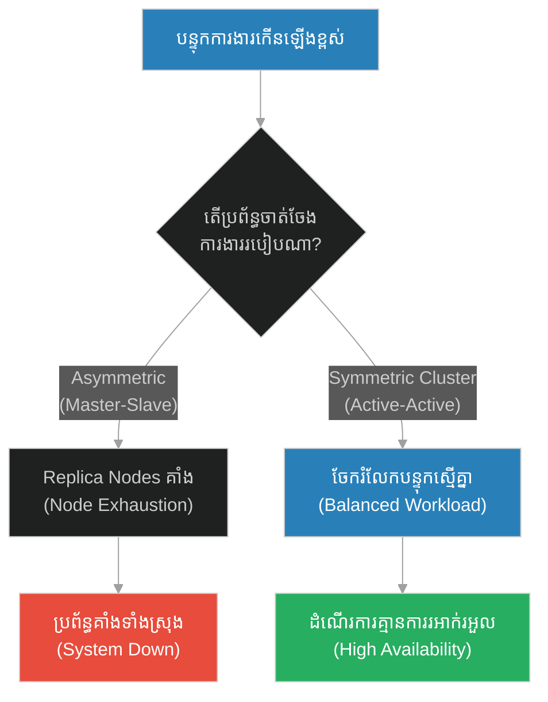
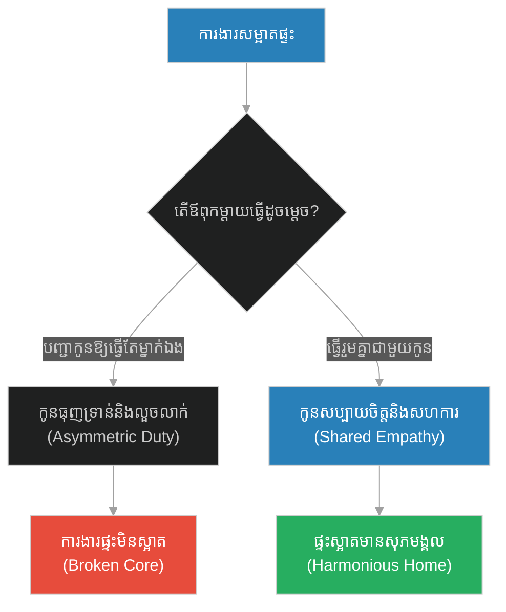
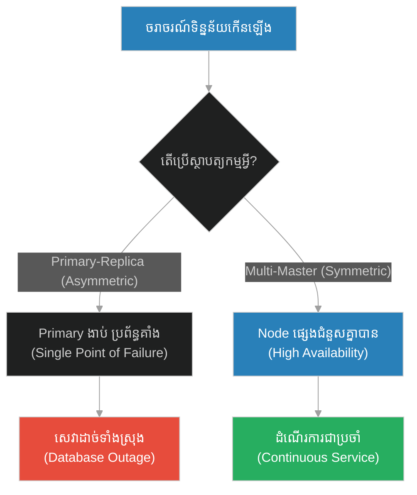
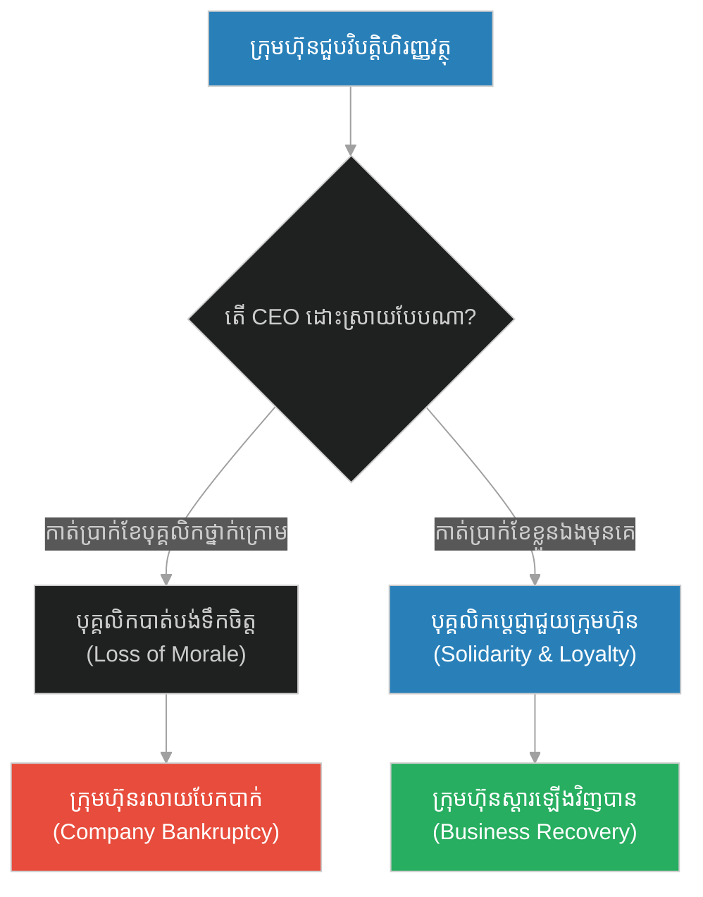
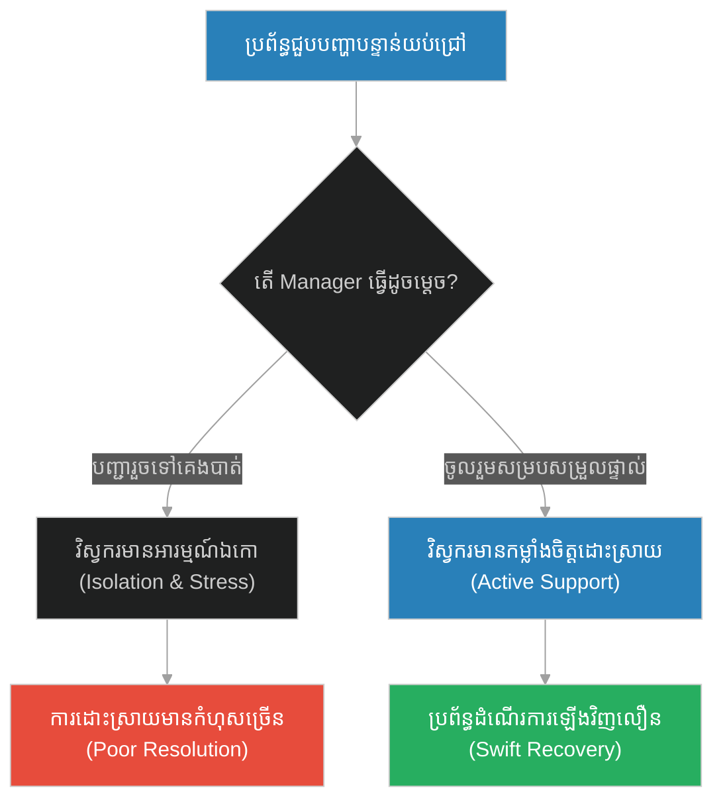
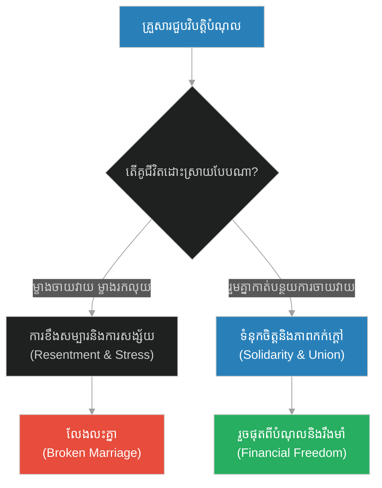
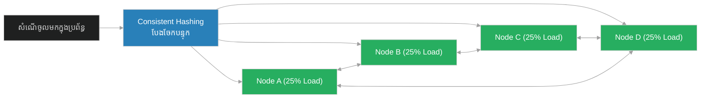

# Shared Leadership & Symmetric Node Clustering (ថ្មទប់ការស្រេកឃ្លាន)៖ ភាពជាអ្នកដឹកនាំរួមសុខរួមទុក្ខ និងចម្កោមម៉ាស៊ីនស្មើភាព (Shared Leadership & Symmetric Node Clustering & Symmetric Multi-Active Cluster Architecture & The Stones of Hunger)

**Author:** ichamrong  
**Date:** 2026-05-28  
**Tags:** #symmetric-clustering #active-active #shared-leadership #resilience #p2p  
**Category:** Concepts  
**Read Time:** ~15 min  

---

## 📌 មាតិកា (Table of Contents)
- [អន្ទាក់ផ្លូវចិត្ត (The Trap)](#0)
- [១. រឿងព្រេងនិទាន៖ ថ្មទប់ការស្រេកឃ្លាន (The Legend of The Stones of Hunger)](#1)
  - [ថ្មពីរដុំ (The Two Stones)](#1-1)
- [២. បញ្ហា៖ Shared Leadership & Symmetric Node Clustering (The Issue: Shared Leadership & Symmetric Node Clustering)](#2)
- [៣. ឧទាហរណ៍ជាក់ស្តែងក្នុងពិភពពិត (Real World Examples)](#3)
  - [ឧទាហរណ៍ទី ១ — កម្រិតស្រាល (គ្រួសារ)៖ ការបោសសម្អាតផ្ទះ និងការរួមដៃគ្នា (The Shared Housework Test)](#3-1)
  - [ឧទាហរណ៍ទី ២ — កម្រិតមធ្យម (បច្ចេកទេស)៖ ចម្កោមម៉ាស៊ីន Primary-Replica និង Multi-Master (The Primary-Replica Overload)](#3-2)
  - [ឧទាហរណ៍ទី ៣ — កម្រិតមធ្យម (ធុរកិច្ច)៖ វិបត្តិហិរញ្ញវត្ថុ និងការកាត់បន្ថយប្រាក់ខែថ្នាក់ដឹកនាំ (The CEO Salary Sacrifice)](#3-3)
  - [ឧទាហរណ៍ទី ៤ — កម្រិតមធ្យម (សង្គម/គ្រប់គ្រង)៖ ការដោះស្រាយបញ្ហាបន្ទាន់របស់ក្រុមការងារ (The Late-Night Critical Patch)](#3-4)
  - [ឧទាហរណ៍ទី ៥ — កម្រិតធ្ងន់ (ទំនាក់ទំនង)៖ ការដោះស្រាយបំណុលរួមរបស់គូជីវិត (The Shared Debt Struggle)](#3-5)
- [៤. ដំណោះស្រាយទូទៅ៖ ចម្កោមម៉ាស៊ីនស្មើភាព និងគ្មានចំនុចខ្សោយទោល (The General Solution: Active-Active Peer-to-Peer Clusters)](#4)
- [សេចក្តីសន្និដ្ឋាន (Conclusion)](#5)
- [ឯកសារយោង (References)](#6)
- [Related Posts](#7)

---

<a id="0"></a>
## អន្ទាក់ផ្លូវចិត្ត (The Trap)

នៅក្នុងប្រព័ន្ធបច្ចេកវិទ្យា និងការគ្រប់គ្រង តើយើងធ្លាប់ឃើញរចនាសម្ព័ន្ធដែលមេដឹកនាំ (ឬ Node មេ) ឈរនៅទំនេរប្រកបដោយឯកសិទ្ធិ ខណៈពេលដែលកូនចៅ (ឬ Node រណប) ត្រូវធ្វើការធ្ងន់រហូតដល់គាំងសេវាដែរឬទេ? នេះគឺជាអន្ទាក់នៃការបែងចែកការងារមិនស្មើភាព និងចំណុចខ្សោយទោល (Single Point of Failure - SPOF)។

* **ចម្កោមលម្អៀង (Asymmetric Cluster)** — Node មេ (Primary) គ្រាន់តែបញ្ជា និងចាត់ចែងការងារ ចំណែកឯ Node រណប (Replica) ត្រូវទ្រាំទ្រនឹងទម្ងន់ការងារធ្ងន់ធ្ងររហូតដល់ប្រព័ន្ធគាំងទាំងស្រុង។
* **ចម្កោមស្មើភាព (Symmetric Active-Active)** — រាល់ Node ទាំងអស់មានឋានៈ និងសមត្ថភាពស្មើគ្នា ចែករំលែកទាំងទិន្នន័យ និងបន្ទុកការងារស្មើៗគ្នា ហើយនៅពេលមានវិបត្តិ គ្រប់ Node ទាំងអស់ស៊ូទ្រាំរួមគ្នា។



1. **រឿងព្រេងនិទាន (The Legend)** — ព្យាការីម៉ូហាម៉ាត់ និងការចងថ្មពីរដុំនៅនឹងពោះក្នុងសមរភូមិលេណដ្ឋាន។
2. **បញ្ហា (The Issue)** — ការប្រៀបធៀបរវាង Asymmetric Primary-Replica និង Symmetric Active-Active Clustering។
3. **ឧទាហរណ៍ជាក់ស្តែង (Real World Examples)** — ការអនុវត្តគោលការណ៍រួមសុខរួមទុក្ខក្នុង ៥ កម្រិតខុសៗគ្នា។
4. **ដំណោះស្រាយទូទៅ (The General Solution)** — ការរៀបចំស្ថាបត្យកម្ម P2P Cluster (Peer-to-Peer)។

---

<a id="1"></a>
## ១. រឿងព្រេងនិទាន៖ ថ្មទប់ការស្រេកឃ្លាន (The Legend of The Stones of Hunger)

នៅក្នុងការរៀបចំការពារទីក្រុងម៉ាឌីណាពីការវាយប្រហាររបស់សត្រូវ (សមរភូមិលេណដ្ឋាន - Battle of the Trench) អ្នកសាវ័កទាំងអស់ត្រូវជីកប្រឡាយយ៉ាងជ្រៅ និងវែងជុំវិញទីក្រុង។ វាជាពេលវេលាដ៏លំបាកបំផុត អាកាសធាតុត្រជាក់ខ្លាំង ហើយពួកគេជួបប្រទះនឹងការខ្វះខាតស្បៀងអាហារយ៉ាងធ្ងន់ធ្ងរ។ ពួកគេត្រូវជីកប្រឡាយទាំងយប់ទាំងថ្ងៃ រហូតដល់ហត់នឿយនិងឃ្លានស្ទើរតែដាច់ខ្យល់។

ដើម្បីកាត់បន្ថយការឈឺចាប់និងអាការៈរមួលក្រពើដោយសារការស្រេកឃ្លាន អ្នកសាវ័កមួយចំនួនបានយកដុំថ្មមួយដុំ មកចងភ្ជាប់នឹងពោះរបស់ពួកគេដោយប្រើក្រណាត់រុំឱ្យតឹង ដើម្បីទប់ក្រពះកុំឱ្យឈឺចាប់ពេក។

<a id="1-1"></a>
### ថ្មពីរដុំ (The Two Stones)

ថ្ងៃមួយ អ្នកសាវ័កម្នាក់មិនអាចទ្រាំទ្រនឹងការស្រេកឃ្លានបានទៀតទេ គាត់ក៏ដើរទៅរកព្យាការីម៉ូហាម៉ាត់ ដើម្បីត្អូញត្អែរនិងសុំជំនួយ។ គាត់បានបើកអាវរបស់គាត់ បង្ហាញដុំថ្មមួយដុំដែលចងនៅជាប់នឹងពោះរបស់គាត់ឱ្យលោកមើល។ គាត់រំពឹងថា ក្នុងនាមជាអ្នកដឹកនាំកំពូល ព្យាការីម៉ូហាម៉ាត់ប្រាកដជាមានលាក់អាហារខ្លះ ឬកំពុងហូបចុកគ្រប់គ្រាន់នៅក្នុងតង់ជាមិនខាន។

ប៉ុន្តែជំនួសឱ្យការឆ្លើយតប ព្យាការីម៉ូហាម៉ាត់បានញញឹមដោយក្តីមេត្តា រួច **លោកក៏បានបើកអាវរបស់លោកបង្ហាញគាត់វិញ**។ អ្នកសាវ័កនោះរន្ធត់ចិត្តយ៉ាងខ្លាំង នៅពេលដែលគាត់បានឃើញ **មានថ្មដល់ទៅពីរដុំ (Two Stones)** ត្រូវបានចងយ៉ាងតឹងនៅលើពោះរបស់ព្យាការីម៉ូហាម៉ាត់។

មានន័យថា មេដឹកនាំរបស់ពួកគេ កំពុងតែស្រេកឃ្លាន និងរងទុក្ខវេទនា ខ្លាំងជាងកូនចៅទ្វេដងទៅទៀត ប៉ុន្តែលោកមិនដែលត្អូញត្អែរសូម្បីតែមួយម៉ាត់ ហើយលោកនៅតែបន្តរួមសុខរួមទុក្ខ និងធ្វើការងារធ្ងន់ជាមួយអ្នកគ្រប់គ្នា។

---

<a id="2"></a>
## ២. បញ្ហា៖ Shared Leadership & Symmetric Node Clustering (The Issue: Shared Leadership & Symmetric Node Clustering)

នៅក្នុងស្ថាបត្យកម្មប្រព័ន្ធចែករំលែក (Distributed Systems Architecture) ប្រព័ន្ធដែលផ្អែកលើ **Primary-Replica (Master-Slave)** គឺងាយរងគ្រោះបំផុត។ Node មេ (Primary) ទទួលបន្ទុកតែលើការសរសេរ (Writes) រួចបង្វែរការអាន (Reads) ទៅកាន់ Replicas។ ប្រសិនបើមានចរាចរណ៍អានកើនឡើងភ្លាមៗ Replicas នឹងត្រូវគាំង (Overload) ខណៈពេលដែល Primary ទំនេរ។

ផ្ទុយទៅវិញ **Symmetric Clustering (Active-Active)** អនុញ្ញាតឱ្យរាល់ Node ទាំងអស់ក្នុងចម្កោមមានសិទ្ធិសរសេរ និងអានដូចៗគ្នា។ គ្មាន Node ណាទទួលបានឯកសិទ្ធិជាង Node ណាឡើយ។ ពួកគេបែងចែកបន្ទុកការងារស្មើគ្នា និងគាំទ្រគ្នាទៅវិញទៅមកនៅពេល Node ណាមួយរងការខូចខាត។

### Code Example: Symmetric vs. Asymmetric Cluster

ខាងក្រោមនេះជាការប្រៀបធៀបក្នុងភាសា TypeScript រវាងប្រព័ន្ធចម្កោមម៉ាស៊ីន Asymmetric និង Symmetric Active-Active Cluster។

```typescript
interface Request {
  id: string;
  type: "WRITE" | "READ";
}

// ==========================================
// FRAGILE PATH: Asymmetric (Master-Slave)
// ==========================================
class AsymmetricCluster {
  private primaryNodeLoad: number = 0;
  private replicaNodesLoad: number[] = [0, 0, 0]; // 3 replicas

  public handleRequest(req: Request): void {
    if (req.type === "WRITE") {
      // Master handles writes
      this.primaryNodeLoad += 10;
      console.log(`[Asymmetric] Master handles WRITE. Master Load: ${this.primaryNodeLoad}`);
    } else {
      // Replicas handle all reads
      const replicaId = Math.floor(Math.random() * this.replicaNodesLoad.length);
      this.replicaNodesLoad[replicaId] += 30; // Heavy read load
      console.log(`[Asymmetric] Replica ${replicaId} handles READ. Replica Load: ${this.replicaNodesLoad[replicaId]}`);
      
      if (this.replicaNodesLoad[replicaId] > 80) {
        console.error(`[Asymmetric] CRITICAL: Replica ${replicaId} crashed due to overload!`);
      }
    }
  }
}

// ==========================================
// RESILIENT PATH: Symmetric Active-Active P2P Cluster
// ==========================================
class SymmetricActiveActiveCluster {
  private nodes: { id: string; load: number }[] = [
    { id: "Node-A", load: 0 },
    { id: "Node-B", load: 0 },
    { id: "Node-C", load: 0 },
    { id: "Node-D", load: 0 }
  ];

  public handleRequest(req: Request): void {
    // Shared Leadership: Find the node with the lowest load, regardless of request type (Write/Read)
    this.nodes.sort((a, b) => a.load - b.load);
    const targetNode = this.nodes[0];

    // Every node can write and read
    const loadIncrease = req.type === "WRITE" ? 15 : 15; // Symmetric load impact
    targetNode.load += loadIncrease;

    console.log(`[Symmetric] ${targetNode.id} coordinates ${req.type}. Balanced Load: ${targetNode.load}`);
    this.checkHealth();
  }

  private checkHealth(): void {
    const overloadedNode = this.nodes.find(n => n.load > 80);
    if (overloadedNode) {
      console.warn(`[Symmetric] Node ${overloadedNode.id} is heavily loaded, sharing burden to peers...`);
      // Redistribute load to other nodes
      overloadedNode.load -= 20;
      this.nodes.find(n => n.id !== overloadedNode.id)!.load += 20;
    }
  }
}

// Demonstration
console.log("--- Fragile Asymmetric Cluster ---");
const fragile = new AsymmetricCluster();
for (let i = 0; i < 5; i++) {
  fragile.handleRequest({ id: `req-${i}`, type: "READ" });
}

console.log("\n--- Resilient Symmetric Cluster ---");
const resilient = new SymmetricActiveActiveCluster();
for (let i = 0; i < 5; i++) {
  resilient.handleRequest({ id: `req-${i}`, type: "READ" });
}
```

---

<a id="3"></a>
## ៣. ឧទាហរណ៍ជាក់ស្តែងក្នុងពិភពពិត (Real World Examples)

<a id="3-1"></a>
### ឧទាហរណ៍ទី ១ — កម្រិតស្រាល (គ្រួសារ)៖ ការបោសសម្អាតផ្ទះ និងការរួមដៃគ្នា (The Shared Housework Test)
ឪពុកម្តាយដែលបញ្ជាឱ្យកូនៗសម្អាតផ្ទះ និងលាងចាន ខណៈពេលខ្លួនឯងកំពុងដេកមើលទូរទស្សន៍ (Asymmetric) ធៀបនឹង គ្រួសារដែលឪពុកម្តាយចុះមកជូតឥដ្ឋ និងរៀបចំផ្ទះជាមួយកូនៗ (Symmetric)។



<a id="3-2"></a>
### ឧទាហរណ៍ទី ២ — កម្រិតមធ្យម (បច្ចេកទេស)៖ ចម្កោមម៉ាស៊ីន Primary-Replica និង Multi-Master (The Primary-Replica Overload)
ប្រព័ន្ធគ្រប់គ្រងមូលទិន្នន័យ (Database Cluster) ដែលមានតែ Node Primary មួយគត់ដែលទទួលការសរសេរ ធ្វើឱ្យប្រព័ន្ធគាំងទាំងស្រុងនៅពេល Primary ងាប់ (SPOF) ធៀបនឹង ប្រព័ន្ធ Multi-Master (ដូចជា Cassandra) ដែលរាល់ Node ទាំងអស់ទទួលការសរសេរ និងអានស្មើៗគ្នា។



<a id="3-3"></a>
### ឧទាហរណ៍ទី ៣ — កម្រិតមធ្យម (ធុរកិច្ច)៖ វិបត្តិហិរញ្ញវត្ថុ និងការកាត់បន្ថយប្រាក់ខែថ្នាក់ដឹកនាំ (The CEO Salary Sacrifice)
នៅពេលក្រុមហ៊ុនជួបវិបត្តិសេដ្ឋកិច្ច ថ្នាក់ដឹកនាំកាត់បន្ថយបុគ្គលិក និងប្រាក់ខែបុគ្គលិកថ្នាក់ទាប ប៉ុន្តែរក្សាប្រាក់ខែ និងប្រាក់លើកទឹកចិត្ត (Bonus) របស់ខ្លួនដដែល ធៀបនឹង នាយកប្រតិបត្តិ (CEO) ដែលសុខចិត្តទទួលប្រាក់ខែ $1 និងកាត់បន្ថយប្រាក់ខែថ្នាក់ដឹកនាំមុនគេដើម្បីការពារការបញ្ឈប់បុគ្គលិក។



<a id="3-4"></a>
### ឧទាហរណ៍ទី ៤ — កម្រិតមធ្យម (សង្គម/គ្រប់គ្រង)៖ ការដោះស្រាយបញ្ហាបន្ទាន់របស់ក្រុមការងារ (The Late-Night Critical Patch)
នៅពេលប្រព័ន្ធផលិតកម្មជួបបញ្ហាធ្ងន់ធ្ងរនៅពាក់កណ្តាលយប់ ប្រធានក្រុមការងារ (Manager) គ្រាន់តែផ្ញើសារបញ្ជាឱ្យវិស្វករដោះស្រាយ រួចខ្លួនឯងទៅដេកបាត់ ធៀបនឹង ប្រធានក្រុមដែលចូលរួម Zoom Call ជាមួយវិស្វករ ដើម្បីជួយសម្របសម្រួល និងគាំទ្រផ្លូវចិត្តរហូតដល់បញ្ហាត្រូវបានដោះស្រាយ។



<a id="3-5"></a>
### ឧទាហរណ៍ទី ៥ — កម្រិតធ្ងន់ (ទំនាក់ទំនង)៖ ការដោះស្រាយបំណុលរួមរបស់គូជីវិត (The Shared Debt Struggle)
គូស្វាមីភរិយាដែលជួបប្រទះបញ្ហាបំណុលគ្រួសារ ប៉ុន្តែដៃគូម្ខាងនៅតែបន្តចាយវាយខ្ជះខ្ជាយលើសម្ភារៈនិយម និងរំពឹងឱ្យដៃគូម្ខាងទៀតធ្វើការពីរឬបីកន្លែងដើម្បីសងបំណុល ធៀបនឹង គូជីវិតដែលព្រមលះបង់ការចាយវាយផ្ទាល់ខ្លួន និងខិតខំរកចំណូលរួមគ្នាដើម្បីដោះស្រាយបំណុល។



---

<a id="4"></a>
## ៤. ដំណោះស្រាយទូទៅ៖ ចម្កោមម៉ាស៊ីនស្មើភាព និងគ្មានចំនុចខ្សោយទោល (The General Solution: Active-Active Peer-to-Peer Clusters)

ដើម្បីកសាងប្រព័ន្ធដែលមានភាពធន់ខ្ពស់ និងរចនាសម្ព័ន្ធរួមសុខរួមទុក្ខពិតប្រាកដ គួរអនុវត្តគោលការណ៍ខាងក្រោម៖

1. **Symmetric Architecture (Active-Active)**: លុបបំបាត់តួនាទី Master/Slave ដោយរៀបចំឱ្យរាល់ Node ទាំងអស់មានលទ្ធភាពដូចគ្នា និងដំណើរការឯករាជ្យ (Peer-to-Peer)។
2. **Dynamic Workload Shedding (ការចែករំលែកបន្ទុក)**: នៅពេល Node មួយជួបប្រទះការងារធ្ងន់ (ដូចជាការចងថ្មពីរដុំ) Node ជិតខាងត្រូវលាតដៃទទួលយកការងារមួយផ្នែកដោយស្វ័យប្រវត្តិ។
3. **Consistent Hashing**: ប្រើប្រាស់ក្បួនដោះស្រាយចែកទិន្នន័យស្មើគ្នាទៅកាន់ Nodes ទាំងអស់ ដើម្បីធានាថាមិនមាន Node ណាមួយទំនេរ ឬលើសទម្ងន់ការងារនោះឡើយ។



---

<a id="5"></a>
## សេចក្តីសន្និដ្ឋាន (Conclusion)

> **«អ្នកដឹកនាំពិតប្រាកដ មិនមែនជាអ្នកដែលឈរបញ្ជានៅកន្លែងស្រណុកសុខស្រួលឡើយ។ ភាពជាអ្នកដឹកនាំដ៏អស្ចារ្យ គឺការហ៊ានរងទុក្ខលំបាកខ្លាំងជាងកូនចៅ ដើម្បីកសាងជំនឿទុកចិត្ត និងស្មារតីសាមគ្គីភាពរួមគ្នា។»**

នៅក្នុងប្រព័ន្ធបច្ចេកវិទ្យា និងការគ្រប់គ្រង សមភាព និងការលុបបំបាត់ចំណុចខ្សោយទោល គឺជាគ្រឹះដ៏រឹងមាំសម្រាប់ទប់ទល់នឹងរាល់ការវាយប្រហារ និងវិបត្តិធំៗទាំងឡាយ។

---

<a id="6"></a>
## ឯកសារយោង (References)

*   **The Battle of the Trench (627 CE)** — A key historical military defense where the Prophet participated in physical labor and endured hunger alongside his companions.
*   **DynamoDB: Amazon's Highly Available Key-Value Store (2007)** — A foundational paper introducing decentralized, symmetric, peer-to-peer storage clusters.
*   **Leaders Eat Last by Simon Sinek** — A study on how great leaders sacrifice their own comfort for the safety of their organization.

---

<a id="7"></a>
## Related Posts

* [[211-prophet-and-the-blind-man.md]](211-prophet-and-the-blind-man.md) — Fairness in Scheduling & Priority Inversion Avoidance
* [[213-prophet-and-the-graves-of-uhud.md]](213-prophet-and-the-graves-of-uhud.md) — Legacy System Archives & Backward Compatibility

## 🐇 ធ្លាក់ចូលក្នុងរន្ធទន្សាយ (Enter the Rabbit Hole)
ដើម្បីស្វែងយល់បន្ថែមអំពី ការរក្សាទុកប្រព័ន្ធចាស់ៗ និងភាពស៊ីគ្នាច្រាសទិស សូមបន្តដំណើរទៅកាន់៖

* 🚀 **[ចាប់ផ្តើមដំណើររុករក (Start the Journey) ➔ Legacy System Archives & Backward Compatibility (អ្នកស្លាប់នៅអ៊ូហ៊ូដ)](./213-prophet-and-the-graves-of-uhud.md)**
