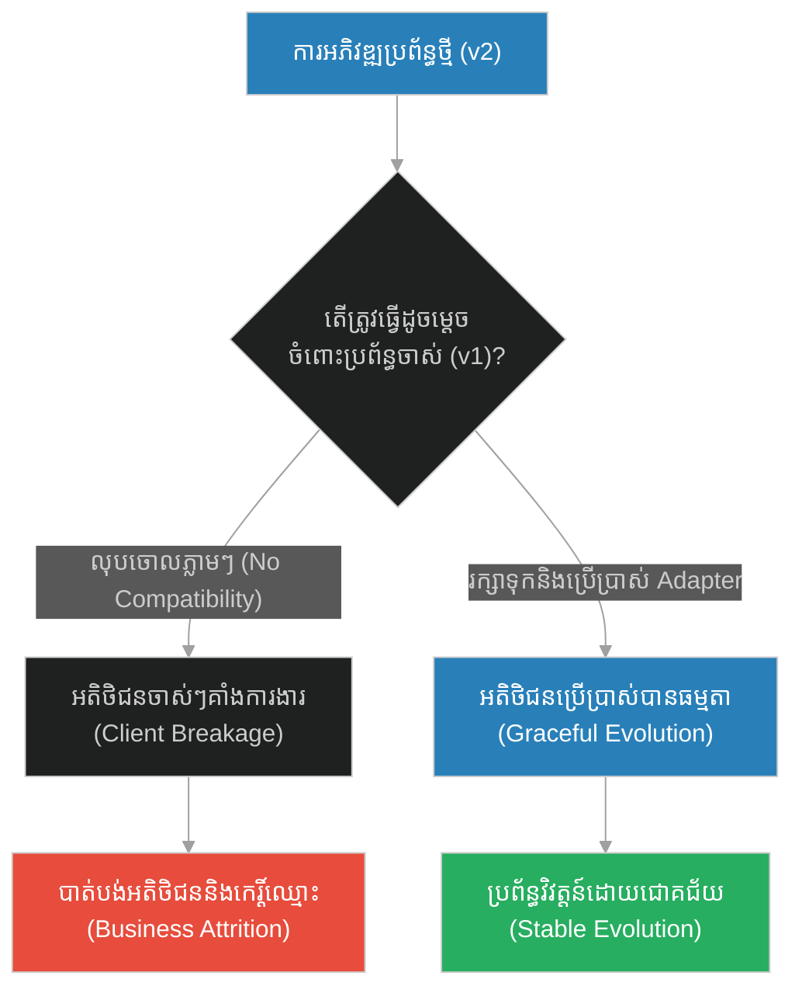
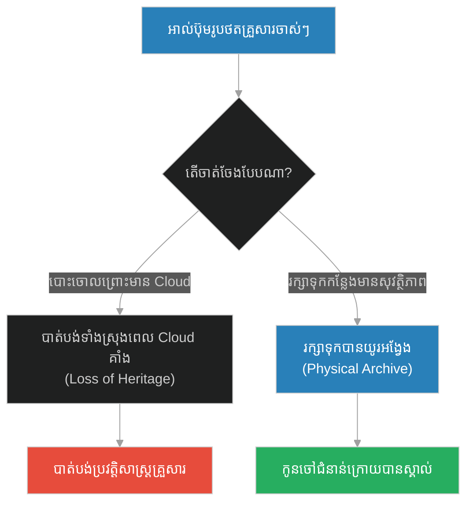
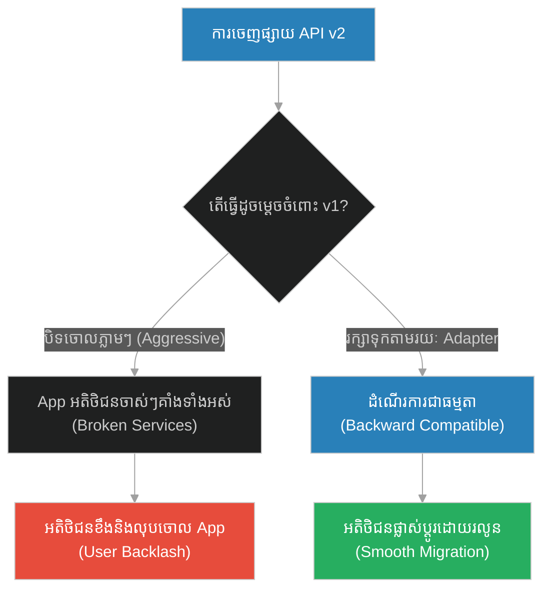
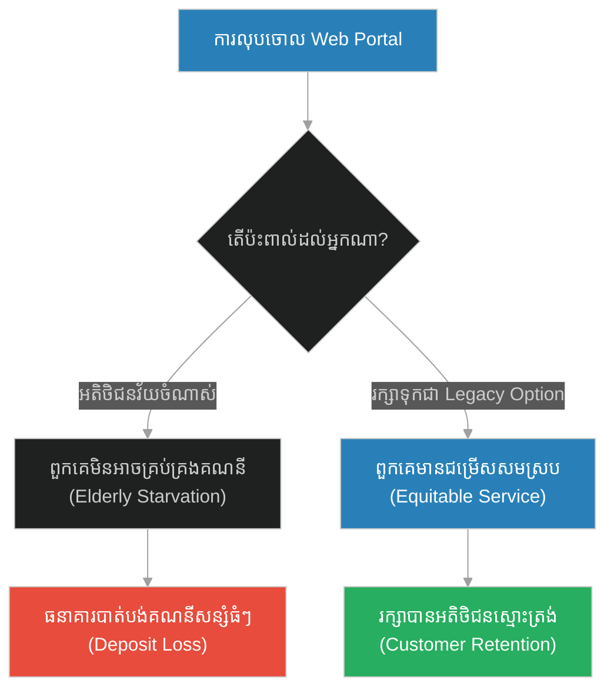
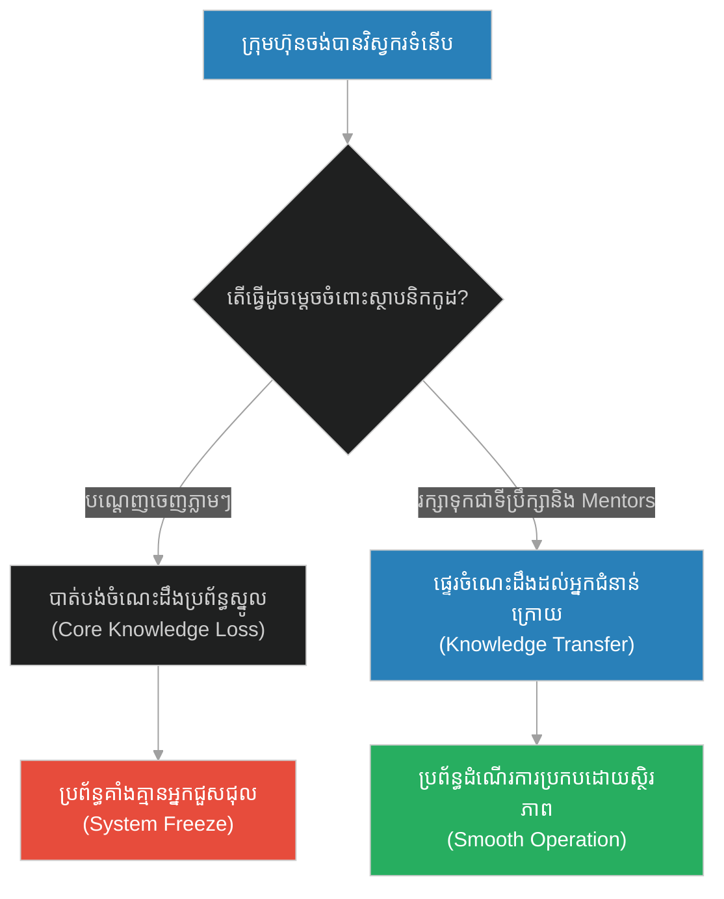
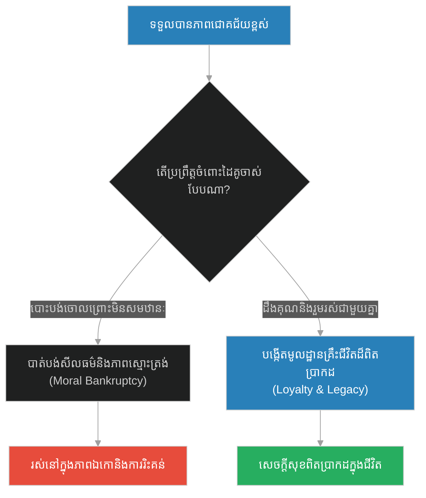
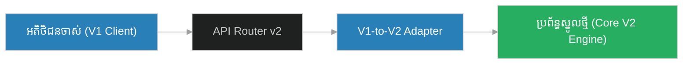

# Legacy System Archives & Backward Compatibility (អ្នកស្លាប់នៅអ៊ូហ៊ូដ)៖ ការរក្សាទុកប្រព័ន្ធចាស់ៗ និងភាពស៊ីគ្នាច្រាសទិស (Legacy System Archives & Backward Compatibility & System Archival and Backward Compatibility Maintenance & The Martyrs of Uhud)

**Author:** ichamrong  
**Date:** 2026-05-28  
**Tags:** #backward-compatibility #legacy-systems #archival #system-evolution #clean-architecture  
**Category:** Concepts  
**Read Time:** ~15 min  

---

## 📌 មាតិកា (Table of Contents)
- [អន្ទាក់ផ្លូវចិត្ត (The Trap)](#0)
- [១. រឿងព្រេងនិទាន៖ អ្នកស្លាប់នៅអ៊ូហ៊ូដ (The Legend of The Martyrs of Uhud)](#1)
  - [ការគោរពវិញ្ញាណក្ខន្ធរៀងរាល់ឆ្នាំ (The Annual Visit)](#1-1)
- [២. បញ្ហា៖ Legacy System Archives & Backward Compatibility (The Issue: Legacy System Archives & Backward Compatibility)](#2)
- [៣. ឧទាហរណ៍ជាក់ស្តែងក្នុងពិភពពិត (Real World Examples)](#3)
  - [ឧទាហរណ៍ទី ១ — កម្រិតស្រាល (គ្រួសារ)៖ ការថែរក្សាអាល់ប៊ុមរូបថតចាស់ៗ (The Physical Photo Archive)](#3-1)
  - [ឧទាហរណ៍ទី ២ — កម្រិតមធ្យម (បច្ចេកទេស)៖ ការកាត់ផ្តាច់ API Version 1 (The Broken Mobile Integrations)](#3-2)
  - [ឧទាហរណ៍ទី ៣ — កម្រិតមធ្យម (ធុរកិច្ច)៖ ការធ្វើបច្ចុប្បន្នភាព App ធនាគារ និងអ្នកប្រើប្រាស់វ័យចំណាស់ (The Stranded Elderly Customers)](#3-3)
  - [ឧទាហរណ៍ទី ៤ — កម្រិតមធ្យម (សង្គម/គ្រប់គ្រង)៖ ការបណ្តេញស្ថាបនិកបច្ចេកវិទ្យា (The Expelled Founding Engineers)](#3-4)
  - [ឧទាហរណ៍ទី ៥ — កម្រិតធ្ងន់ (ទំនាក់ទំនង)៖ ការបំភ្លេចចោលដៃគូគ្រាក្រអត់ (The Successful Partner Betrayal)](#3-5)
- [៤. ដំណោះស្រាយទូទៅ៖ លំនាំ Adaptor និងគោលការណ៍បញ្ឈប់ដំណើរការដោយព្រមព្រៀង (The General Solution: Adapter Patterns & Graceful Deprecation Policies)](#4)
- [សេចក្តីសន្និដ្ឋាន (Conclusion)](#5)
- [ឯកសារយោង (References)](#6)
- [Related Posts](#7)

---

<a id="0"></a>
## អន្ទាក់ផ្លូវចិត្ត (The Trap)

នៅពេលដែលយើងលូតលាស់ រីកចម្រើន ឬធ្វើបច្ចុប្បន្នភាពប្រព័ន្ធទៅជំនាន់ថ្មី តើយើងងាយនឹងបំភ្លេច និងកម្ទេចប្រព័ន្ធចាស់ៗ (Legacy Systems) ដែលធ្លាប់ជាគ្រឹះទ្រទ្រង់យើងតាំងពីដំបូងដែរឬទេ? នេះគឺជាអន្ទាក់នៃការបំបែកភាពស៊ីគ្នា (Breaking Backward Compatibility) ដែលអាចបំផ្លាញអតិថិជន និងបាត់បង់ប្រវត្តិទិន្នន័យសំខាន់ៗ។

* **ការកម្ទេចអតីតកាល (Aggressive Deprecation)** — លុបចោលកូដចាស់ៗ និង API ចាស់ៗភ្លាមៗដើម្បីសម្រួលដល់ការអភិវឌ្ឍជំនាន់ថ្មី ដែលធ្វើឱ្យអតិថិជនប្រើប្រាស់ប្រព័ន្ធចាស់ជួបការរអាក់រអួលខ្លាំង។
* **ការរក្សានិរន្តរភាព (Backward Compatibility & Archiving)** — រក្សាទុកប្រព័ន្ធចាស់ៗនៅក្នុងបណ្ណសារ (Archives) និងប្រើប្រាស់ Adapter ដើម្បីគាំទ្រអតិថិជនចាស់ៗ ខណៈពេលកំពុងផ្លាស់ប្តូរទៅកាន់ប្រព័ន្ធថ្មី។



1. **រឿងព្រេងនិទាន (The Legend)** — ព្យាការីម៉ូហាម៉ាត់ និងការធ្វើដំណើរទៅសួរសុខទុក្ខវិញ្ញាណក្ខន្ធអ្នកចម្បាំងនៅអ៊ូហ៊ូដជារៀងរាល់ឆ្នាំ។
2. **បញ្ហា (The Issue)** — បញ្ហាគាំងប្រព័ន្ធ និងការខូចខាតនៃការមិនគាំទ្រ Backward Compatibility ក្នុងសង្វាក់ផលិតកម្ម។
3. **ឧទាហរណ៍ជាក់ស្តែង (Real World Examples)** — ករណីសិក្សាទាំង ៥ កម្រិត ពីបណ្ណសារផ្ទះ រហូតដល់ស្ថាបត្យកម្មកូដធំៗ។
4. **ដំណោះស្រាយទូទៅ (The General Solution)** — ការអនុវត្ត Adapter Pattern និងគោលនយោបាយ Deprecation ដែលមានសុវត្ថិភាព។

---

<a id="1"></a>
## ១. រឿងព្រេងនិទាន៖ អ្នកស្លាប់នៅអ៊ូហ៊ូដ (The Legend of The Martyrs of Uhud)

សមរភូមិអ៊ូហ៊ូដ (Battle of Uhud) គឺជាសមរភូមិមួយដែលអ្នកកាន់សាសនាឥស្លាមបានទទួលរងបរាជ័យ និងបាត់បង់ជីវិតអ្នកចម្បាំងដ៏ក្លាហានជាច្រើននាក់ (Martyrs) រួមទាំងលោក Hamza ដែលជាពូបង្កើតរបស់ព្យាការីម៉ូហាម៉ាត់ផងដែរ។ វាគឺជាការបាត់បង់ដ៏ឈឺចាប់បំផុត នៅក្នុងប្រវត្តិសាស្ត្រដំបូងរបស់ពួកគេ។ អ្នកស្លាប់ទាំងអស់ ត្រូវបានបញ្ចុះនៅតំបន់ជើងភ្នំអ៊ូហ៊ូដនោះឯង។

<a id="1-1"></a>
### ការគោរពវិញ្ញាណក្ខន្ធរៀងរាល់ឆ្នាំ (The Annual Visit)

ទោះបីជាពេលវេលាកន្លងផុតទៅច្រើនឆ្នាំ ហើយព្យាការីម៉ូហាម៉ាត់ទទួលបានជោគជ័យ សន្តិភាព និងអំណាចកាន់តែធំធេងយ៉ាងណាក៏ដោយ ក៏លោកមិនដែលបំភ្លេចវីរបុរសដែលបានស្លាប់ ដើម្បីការពារសាសនា និងសហគមន៍តាំងពីគ្រាដំបូងនោះឡើយ។

ជារៀងរាល់ឆ្នាំ ព្យាការីម៉ូហាម៉ាត់តែងតែធ្វើដំណើរទៅកាន់ទីបញ្ចុះសពនៃអ្នកស្លាប់នៅភ្នំអ៊ូហ៊ូដ (Graves of Uhud)។ លោកនឹងឈរនៅទីនោះយ៉ាងស្ងៀមស្ងាត់ អធិស្ឋានសុំពរជ័យ និងរំលឹកដល់ការលះបង់របស់ពួកគេ។ សូម្បីតែនៅថ្ងៃចុងក្រោយជិតការចូលទិវង្គតរបស់លោក ក៏លោកនៅតែព្យាយាមទៅសួរសុខទុក្ខពួកគេជាលើកចុងក្រោយដែរ។

លោកតែងតែមានប្រសាសន៍ថា៖ *"ពួកគេគឺជាអ្នកដែលបានលះបង់អ្វីៗទាំងអស់ ក្នុងពេលដែលពួកយើងទន់ខ្សោយបំផុត។ យើងមិនត្រូវបំភ្លេចពួកគេឡើយ។"*

---

<a id="2"></a>
## ២. បញ្ហា៖ Legacy System Archives & Backward Compatibility (The Issue: Legacy System Archives & Backward Compatibility)

នៅក្នុងការរចនាប្រព័ន្ធព័ត៌មានវិទ្យា (System Design) វិស្វករតែងតែចង់បានកូដដែលស្អាត និងទំនើប ដោយយល់ឃើញថាកូដចាស់ៗ និង Module ចាស់ៗ (Legacy Systems) គឺជា "សំរាមបច្ចេកវិទ្យា" (Technical Debt) ដែលគួរតែកម្ទេចចោល។ ប៉ុន្តែ ប្រសិនបើប្រព័ន្ធថ្មីមិនផ្តល់យន្តការគាំទ្រ **Backward Compatibility (ភាពស៊ីគ្នាច្រាសទិស)** ទេនោះ រាល់ App របស់ដៃគូ ឬអតិថិជនចាស់ៗ ដែលមិនទាន់មានលទ្ធភាព Upgrade នឹងត្រូវគាំងការងារទាំងស្រុង។

ការចងចាំអតីតកាលក្នុងសង្គម ស្មើនឹងការថែរក្សាកូដចាស់ៗ (Legacy Support) នៅក្នុងកម្មវិធី ដើម្បីធានាបាននូវនិរន្តរភាពអាជីវកម្ម។

### Code Example: Versioning and Adapter Pattern

ខាងក្រោមនេះជាការប្រៀបធៀបក្នុងភាសា TypeScript រវាងប្រព័ន្ធ API Gateway ដែលលុបចោលកំណែចាស់ភ្លាមៗ និងប្រព័ន្ធដែលប្រើប្រាស់ Adapter Pattern ដើម្បីរក្សា Backward Compatibility សម្រាប់អតិថិជនចាស់ៗ។

```typescript
// Legacy Request Payload Format (v1)
interface LegacyUserRequest {
  user_id: number;
  full_name: string; // Combined field
}

// Modern Request Payload Format (v2)
interface ModernUserRequest {
  id: string; // UUID instead of number
  firstName: string;
  lastName: string;
}

// ==========================================
// FRAGILE PATH: No Backward Compatibility (v1 broken)
// ==========================================
class FragileAPIGateway {
  public processRequest(payload: any): void {
    console.log("[Fragile Gateway] Processing request...");
    
    // Strict requirement for v2, completely ignoring legacy format
    const req = payload as ModernUserRequest;
    if (req.id === undefined || req.firstName === undefined) {
      console.error("[Fragile Gateway] CRITICAL: Invalid V2 payload format! Legacy V1 client has crashed.");
      throw new Error("HTTP 400 Bad Request");
    } else {
      console.log(`[Fragile Gateway] User V2 processed: ${req.firstName} ${req.lastName}`);
    }
  }
}

// ==========================================
// RESILIENT PATH: Graceful Adapter System
// ==========================================
class ResilientAPIGateway {
  
  public processRequest(payload: any): void {
    console.log("\n[Resilient Gateway] Routing request...");

    // Check if the payload is from a legacy V1 client
    if (this.isLegacyPayload(payload)) {
      console.log("[Resilient Gateway] Legacy V1 payload detected. Visiting Uhud (Adapting Legacy V1)...");
      const legacyReq = payload as LegacyUserRequest;
      
      // Adapt Legacy V1 to Modern V2 format internally
      const adaptedReq: ModernUserRequest = this.adaptV1ToV2(legacyReq);
      this.executeModernPipeline(adaptedReq);
    } else {
      // Direct execute modern V2
      this.executeModernPipeline(payload as ModernUserRequest);
    }
  }

  private isLegacyPayload(payload: any): boolean {
    return payload.user_id !== undefined && payload.full_name !== undefined;
  }

  private adaptV1ToV2(legacy: LegacyUserRequest): ModernUserRequest {
    const names = legacy.full_name.split(" ");
    return {
      id: `legacy-${legacy.user_id}`,
      firstName: names[0] || "",
      lastName: names.slice(1).join(" ") || ""
    };
  }

  private executeModernPipeline(req: ModernUserRequest): void {
    console.log(`[Resilient Gateway] SUCCESS: Executed request for ${req.firstName} ${req.lastName} (ID: ${req.id})`);
  }
}

// Execution Demonstration
const legacyClientPayload: LegacyUserRequest = { user_id: 101, full_name: "Hamza Uhud" };
const modernClientPayload: ModernUserRequest = { id: "uuid-99", firstName: "Ali", lastName: "Talib" };

// 1. Run Fragile Gateway (Breaks Legacy Client)
const fragileGateway = new FragileAPIGateway();
try {
  fragileGateway.processRequest(modernClientPayload); // Works
  fragileGateway.processRequest(legacyClientPayload); // Crashes
} catch (e) {
  console.log("Fragile Gateway aborted execution.");
}

// 2. Run Resilient Gateway (Both clients work)
const resilientGateway = new ResilientAPIGateway();
resilientGateway.processRequest(modernClientPayload);
resilientGateway.processRequest(legacyClientPayload); // Legacy adapted smoothly
```

---

<a id="3"></a>
## ៣. ឧទាហរណ៍ជាក់ស្តែងក្នុងពិភពពិត (Real World Examples)

<a id="3-1"></a>
### ឧទាហរណ៍ទី ១ — កម្រិតស្រាល (គ្រួសារ)៖ ការថែរក្សាអាល់ប៊ុមរូបថតចាស់ៗ (The Physical Photo Archive)
ការបោះចោល ឬដុតបំផ្លាញអាល់ប៊ុមរូបថតក្រដាសចាស់ៗរបស់ជីដូនជីតា ដោយសារតែយើងបានថតចម្លងវាទុកក្នុង Cloud រួចរាល់ (Asymmetric) ធៀបនឹង ការរក្សាទុកអាល់ប៊ុមរូបថតនោះក្នុងប្រអប់ការពារសំណើម និងរៀបចំទុកដាក់ឱ្យបានល្អដើម្បីទុកជាកេរដំណែលប្រវត្តិសាស្ត្រគ្រួសារ (Resilient Archiving)។



<a id="3-2"></a>
### ឧទាហរណ៍ទី ២ — កម្រិតមធ្យម (បច្ចេកទេស)៖ ការកាត់ផ្តាច់ API Version 1 (The Broken Mobile Integrations)
ក្រុមហ៊ុនបច្ចេកវិទ្យាមួយ បានចេញផ្សាយ API v2 រួចបិទចរាចរណ៍ API v1 ភ្លាមៗ ដែលធ្វើឱ្យកម្មវិធីទូរស័ព្ទរបស់អតិថិជនរាប់ពាន់នាក់ដែលមិនទាន់បាន Update ត្រូវគាំង និងមិនអាច Login ចូលប្រើប្រាស់សេវាកម្មបាន។



<a id="3-3"></a>
### ឧទាហរណ៍ទី ៣ — កម្រិតមធ្យម (ធុរកិច្ច)៖ ការធ្វើបច្ចុប្បន្នភាព App ធនាគារ និងអ្នកប្រើប្រាស់វ័យចំណាស់ (The Stranded Elderly Customers)
ធនាគារមួយបានលុបចោលគេហទំព័រសម្រាប់កុំព្យូទ័រ (Web Portal) របស់ខ្លួនទាំងស្រុង ដើម្បីបង្ខំឱ្យអតិថិជនប្រើប្រាស់តែ Smart App លើទូរស័ព្ទដៃ ដែលធ្វើឱ្យអតិថិជនវ័យចំណាស់ៗរាប់ពាន់នាក់ដែលមិនចេះប្រើស្មាតហ្វូន មិនអាចធ្វើការផ្ទេរប្រាក់បាន។



<a id="3-4"></a>
### ឧទាហរណ៍ទី ៤ — កម្រិតមធ្យម (សង្គម/គ្រប់គ្រង)៖ ការបណ្តេញស្ថាបនិកបច្គេកវិទ្យា (The Expelled Founding Engineers)
ក្រុមហ៊ុនបច្ចេកវិទ្យាដែលរីកចម្រើនធំធាត់ បានបណ្តេញវិស្វករចាស់ៗដែលសរសេរកូដជំនាន់ដំបូង (Legacy Core) ចេញដោយសារតែពួកគេមិនចេះបច្ចេកវិទ្យាថ្មីៗ រហូតដល់ថ្ងៃមួយដែលប្រព័ន្ធស្នូលជួបបញ្ហាធ្ងន់ធ្ងរ ហើយគ្មានវិស្វករថ្មីណាម្នាក់យល់ពីរបៀបជួសជុលវា។



<a id="3-5"></a>
### ឧទាហរណ៍ទី ៥ — កម្រិតធ្ងន់ (ទំនាក់ទំនង)៖ ការបំភ្លេចចោលដៃគូគ្រាក្រអត់ (The Successful Partner Betrayal)
មនុស្សម្នាក់ដែលធ្លាប់ទទួលបានការទំនុកបម្រុង និងជំនួយគ្រប់បែបយ៉ាងពីដៃគូជីវិតក្នុងកំឡុងពេលសិក្សា ឬគ្រាក្រលំបាក ប៉ុន្តែនៅពេលទទួលបានជោគជ័យ និងមានទ្រព្យសម្បត្តិស្តុកស្តម្ភ បែរជាបោះបង់ដៃគូចាស់នោះចោល ដើម្បីទៅជ្រើសរើសដៃគូថ្មីដែលមានឋានៈខ្ពស់ជាង។



---

<a id="4"></a>
## ៤. ដំណោះស្រាយទូទៅ៖ លំនាំ Adaptor និងគោលការណ៍បញ្ឈប់ដំណើរការដោយព្រមព្រៀង (The General Solution: Adapter Patterns & Graceful Deprecation Policies)

ដើម្បីធានាបាននូវការវិវត្តន៍ដ៏រលូនរបស់ប្រព័ន្ធ និងការរក្សាទំនាក់ទំនងដ៏ល្អ វិស្វករប្រព័ន្ធគួរតែអនុវត្តយន្តការដូចខាងក្រោម៖

1. **The Adapter Pattern (លំនាំអាដាប់ទ័រ)**: បង្កើតស្រទាប់ស្ពានចម្លង (Interface Adapter Layer) ដែលដើរតួជាអ្នកបកប្រែសំណើពី V1 ទៅ V2 ដើម្បីឱ្យប្រព័ន្ធទំនើបអាចដំណើរការជាមួយសំណើចាស់ៗបានដោយស្វ័យប្រវត្តិ។
2. **Graceful Deprecation Policy**: ត្រូវប្រកាសទុកជាមុន (ឧទាហរណ៍៖ ១២ ខែមុន) នូវការបញ្ឈប់សេវាកម្មចាស់ៗ និងផ្តល់សេចក្តីណែនាំក្នុងការធ្វើចំណាកស្រុក (Migration Guide) ច្បាស់លាស់។
3. **Legacy Cold Storage**: កុំលុបទិន្នន័យចាស់ៗចោល។ ត្រូវរក្សាវាទុកក្នុងទីតាំងផ្ទុកត្រជាក់ (Cold Storage / Archival Database) ដែលចំណាយថវិកាទាប ប៉ុន្តែអាចទាញយកមកវិញបាននៅពេលត្រូវការ។



---

<a id="5"></a>
## សេចក្តីសន្និដ្ឋាន (Conclusion)

> **«ភាពជោគជ័យ និងភាពរុងរឿងក្នុងពេលបច្ចុប្បន្ន ត្រូវបានសាងសង់នៅលើការលះបង់ និងគ្រឹះប្រព័ន្ធចាស់ៗដែលបានដើរមុនយើង។ ការរក្សាភាពស៊ីគ្នាច្រាសទិស និងការដឹងគុណ គឺជាគន្លឹះនៃភាពរឹងមាំយូរអង្វែង។»**

នៅក្នុងប្រព័ន្ធបច្ចេកវិទ្យា និងជីវិតជាក់ស្តែង ការមិនបំភ្លេចឫសគល់ (Legacy Support) និងការធានាថាការផ្លាស់ប្តូរថ្មីៗមិនបំផ្លាញរចនាសម្ព័ន្ធចាស់ គឺជាសញ្ញាសម្គាល់នៃភាពចាស់ទុំ និងភាពធន់ដ៏រឹងមាំ។

---

<a id="6"></a>
## ឯកសារយោង (References)

*   **Visiting the Graves of Uhud** — A historically documented practice highlighting loyalty, historical preservation, and constant connection with foundations.
*   **RFC 3470: IETF Guidelines for Protocol Extensibility** — Standard design guidelines emphasizing backward compatibility and interoperability.
*   **Clean Architecture by Robert C. Martin** — Chapter on Boundary Adapters and protecting stable core business rules from external changes.

---

<a id="7"></a>
## Related Posts

* [[212-prophet-and-the-stone-on-stomach.md]](212-prophet-and-the-stone-on-stomach.md) — Shared Leadership & Symmetric Node Clustering
* [[214-prophet-and-the-piece-of-flesh.md]](214-prophet-and-the-piece-of-flesh.md) — Root Brain & Central Orchestrator State

## 🐇 ធ្លាក់ចូលក្នុងរន្ធទន្សាយ (Enter the Rabbit Hole)
ដើម្បីស្វែងយល់បន្ថែមអំពី ដុំសាច់បញ្ជានិងរដ្ឋសម្របសម្រួលកណ្តាល សូមបន្តដំណើរទៅកាន់៖

* 🚀 **[ចាប់ផ្តើមដំណើររុករក (Start the Journey) ➔ Root Brain & Central Orchestrator State (ដុំសាច់មួយដុំ)](./214-prophet-and-the-piece-of-flesh.md)**
