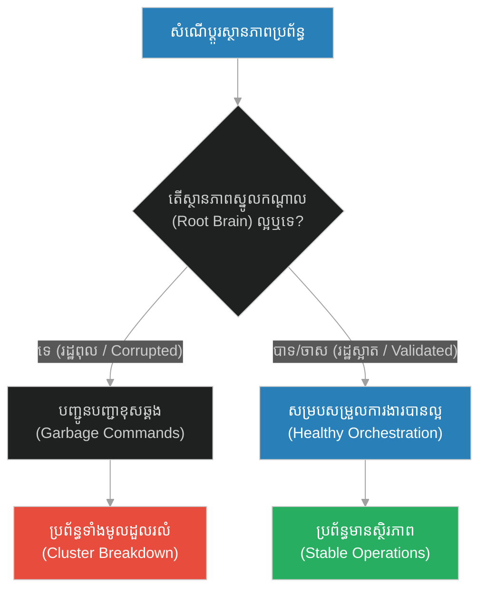
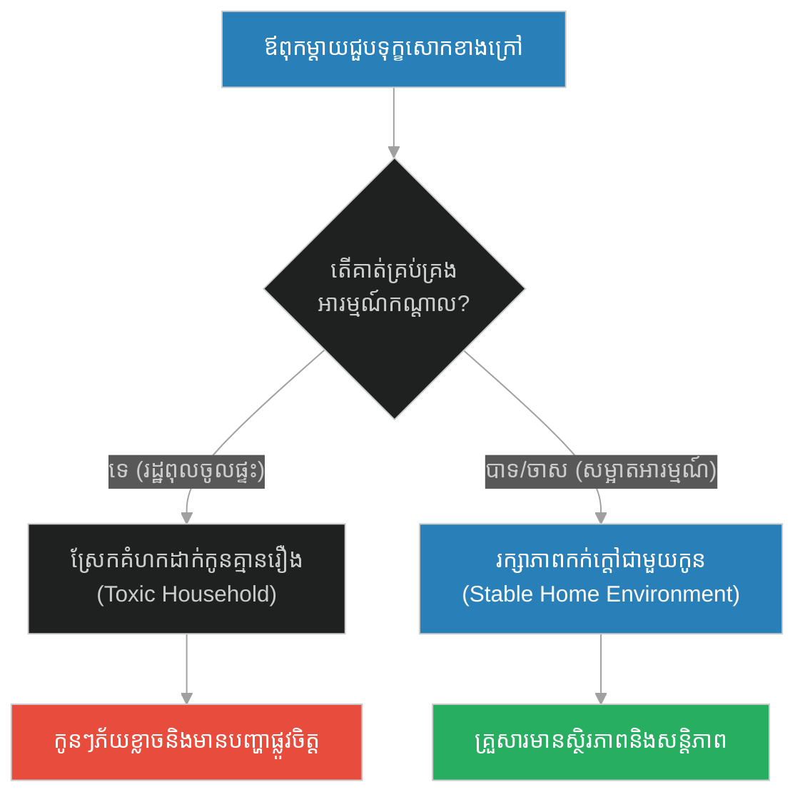
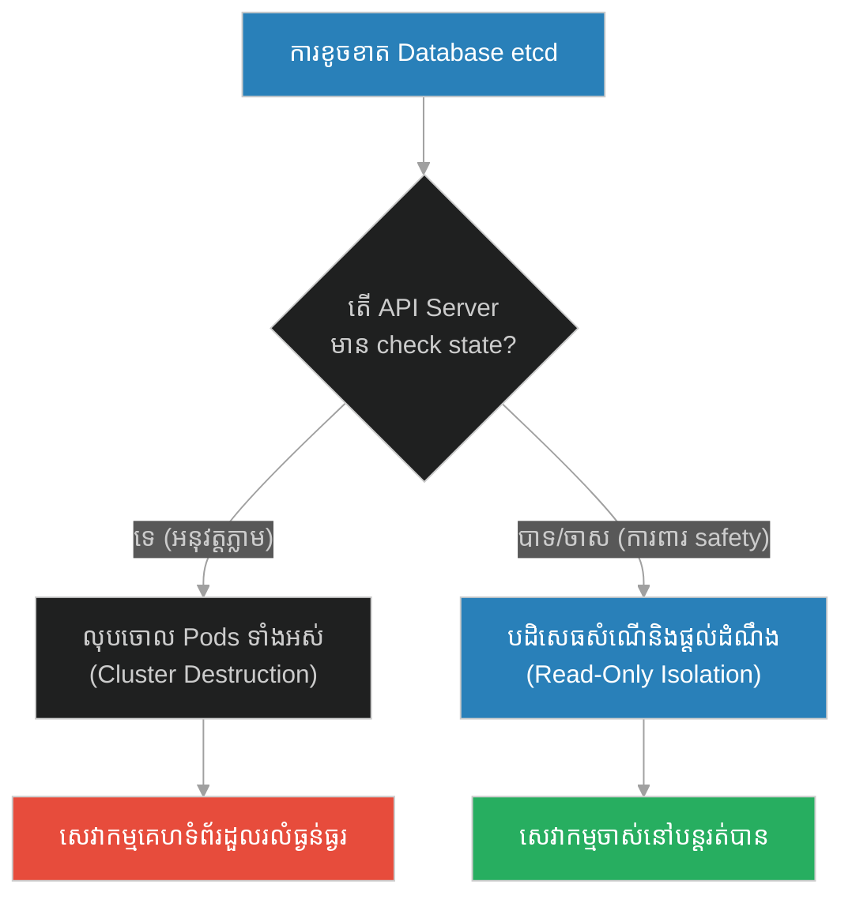
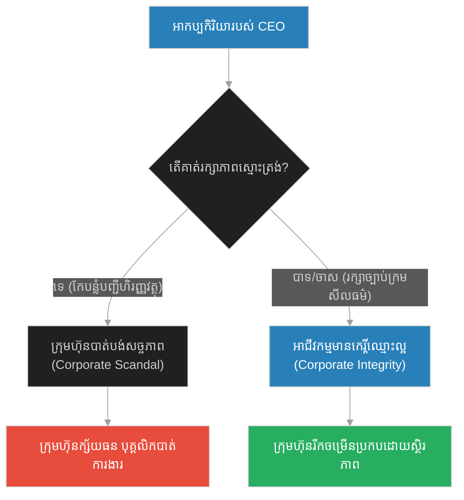
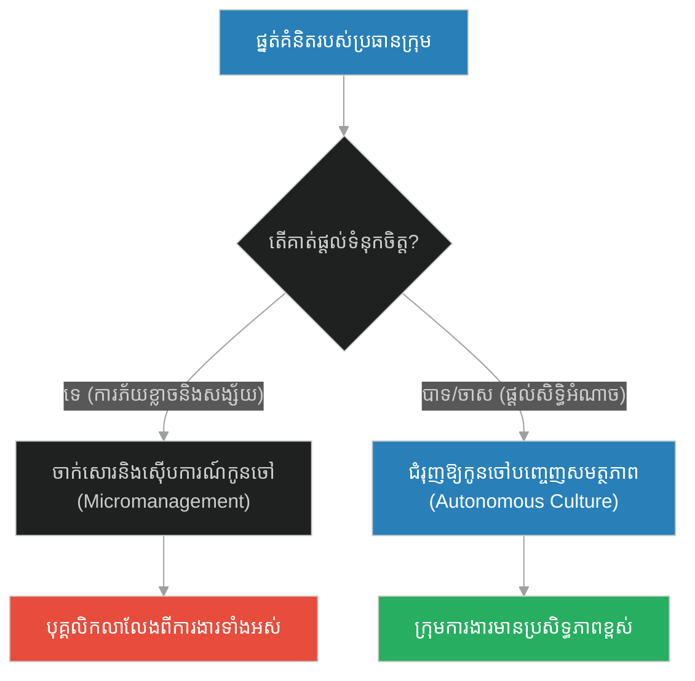
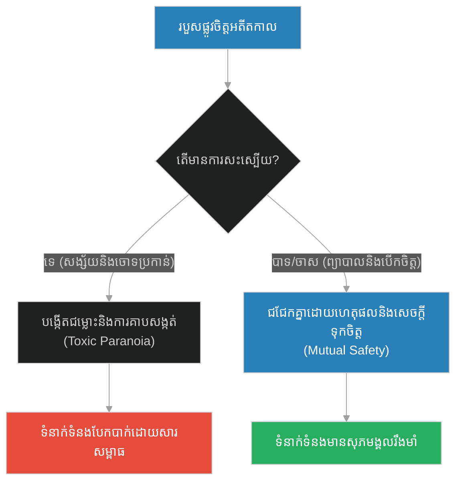
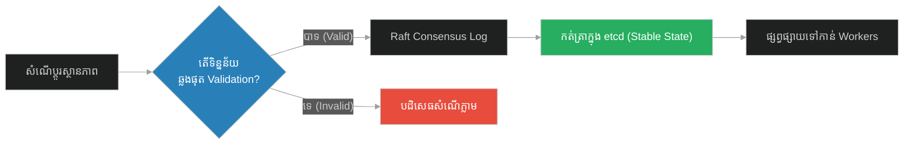

# Root Brain & Central Orchestrator State (ដុំសាច់មួយដុំ)៖ ដុំសាច់បញ្ជានិងរដ្ឋសម្របសម្រួលកណ្តាល (Root Brain & Central Orchestrator State & Central Controller State and Cluster Health Management & The Piece of Flesh)

**Author:** ichamrong  
**Date:** 2026-05-28  
**Tags:** #control-plane #orchestrator #distributed-systems #raft-consensus #system-integrity  
**Category:** Concepts  
**Read Time:** ~15 min  

---

## 📌 មាតិកា (Table of Contents)
- [អន្ទាក់ផ្លូវចិត្ត (The Trap)](#0)
- [១. រឿងព្រេងនិទាន៖ ដុំសាច់មួយដុំ (The Legend of The Piece of Flesh)](#1)
  - [សភាពនៃបេះដូង (Condition of the Heart)](#1-1)
- [២. បញ្ហា៖ Root Brain & Central Orchestrator State (The Issue: Root Brain & Central Orchestrator State)](#2)
- [៣. ឧទាហរណ៍ជាក់ស្តែងក្នុងពិភពពិត (Real World Examples)](#3)
  - [ឧទាហរណ៍ទី ១ — កម្រិតស្រាល (គ្រួសារ)៖ ស្ថានភាពផ្លូវចិត្តរបស់មេគ្រួសារ (The Parental Mood Trigger)](#3-1)
  - [ឧទាហរណ៍ទី ២ — កម្រិតមធ្យម (បច្ចេកទេស)៖ ការខូចខាតទិន្នន័យរបស់ etcd ក្នុង Kubernetes (The Corrupted Control Plane)](#3-2)
  - [ឧទាហរណ៍ទី ៣ — កម្រិតមធ្យម (ធុរកិច្ច)៖ សីលធម៌របស់អគ្គនាយក និងការដួលរលំក្រុមហ៊ុន (The Corrupted CEO Scandal)](#3-3)
  - [ឧទាហរណ៍ទី ៤ — កម្រិតមធ្យម (សង្គម/គ្រប់គ្រង)៖ ផ្នត់គំនិតគ្រប់គ្រងបែបលម្អៀង (The Micromanager Paranoia)](#3-4)
  - [ឧទាហរណ៍ទី ៥ — កម្រិតធ្ងន់ (ទំនាក់ទំនង)៖ របួសផ្លូវចិត្តមិនទាន់ជាសះស្បើយ និងការសង្ស័យ (The Unhealed Trauma Trap)](#3-5)
- [៤. ដំណោះស្រាយទូទៅ៖ ការបំបែក Control Plane ពី Data Plane និងការធានាភាពត្រឹមត្រូវនៃរដ្ឋ (The General Solution: Decoupled Control-Data Planes & State Validation)](#4)
- [សេចក្តីសន្និដ្ឋាន (Conclusion)](#5)
- [ឯកសារយោង (References)](#6)
- [Related Posts](#7)

---

<a id="0"></a>
## អន្ទាក់ផ្លូវចិត្ត (The Trap)

នៅក្នុងប្រព័ន្ធកុំព្យូទ័រ និងការដឹកនាំមនុស្ស តើយើងធ្លាប់ឃើញប្រព័ន្ធដែលសមាជិក ឬ Worker Nodes ដំណើរការបានល្អឥតខ្ចោះ ប៉ុន្តែប្រព័ន្ធទាំងមូលត្រូវដួលរលំដោយសារតែ "គំនិតបញ្ជាកណ្តាល" (Central State) ជួបភាពមិនប្រក្រតីដែរឬទេ? នេះគឺជាអន្ទាក់នៃការមិនយកចិត្តទុកដាក់លើសុខភាពរបស់ Control Plane ឬ Root Brain។

* **ការតុបតែងសំបកក្រៅ (Outward Focus)** — ផ្តោតលើការកែលម្អ Worker Nodes ឬសមាជិកថ្នាក់ក្រោម ខណៈពេលទុកឱ្យរដ្ឋសម្របសម្រួលកណ្តាល (Central State) ពោរពេញដោយភាពច្របូកច្របល់ និងកំហុសឆ្គង។
* **ការធានាសុខភាពស្នូល (Core-State Integrity)** — សម្អាត និងការពារស្ថានភាពស្នូលកណ្តាល (Root Brain) ឱ្យមានសុវត្ថិភាព និងភាពត្រឹមត្រូវជានិច្ច ដើម្បីឱ្យប្រព័ន្ធទាំងមូលដំណើរការដោយរលូនតាមវា។



1. **រឿងព្រេងនិទាន (The Legend)** — ព្យាការីម៉ូហាម៉ាត់ និងការប្រៀនប្រដៅអំពី "ដុំសាច់បញ្ជា" នៅក្នុងរាងកាយមនុស្ស (បេះដូង)។
2. **បញ្ហា (The Issue)** — ការពន្យល់អំពី Control Plane State និងផលប៉ះពាល់នៃការខូចខាតស្ថានភាពកណ្តាលក្នុងប្រព័ន្ធចែករំលែក។
3. **ឧទាហរណ៍ជាក់ស្តែង (Real World Examples)** — ករណីសិក្សាទាំង ៥ កម្រិត ពីអារម្មណ៍ក្នុងផ្ទះ រហូតដល់ស្ថាបត្យកម្ម Kubernetes។
4. **ដំណោះស្រាយទូទៅ (The General Solution)** — ការប្រើប្រាស់យន្តការ Consensus (Raft/Paxos) និងការបំបែក Control-Data Planes។

---

<a id="1"></a>
## ១. រឿងព្រេងនិទាន៖ ដុំសាច់មួយដុំ (The Legend of The Piece of Flesh)

ព្យាការីម៉ូហាម៉ាត់បានបង្រៀនសិស្សរបស់លោក អំពីប្រភពដើមពិតប្រាកដនៃអំពើល្អនិងអំពើអាក្រក់របស់មនុស្ស។ មនុស្សតែងតែវាយតម្លៃគ្នាទៅលើរូបរាង ទ្រព្យសម្បត្តិ និងចំណេះដឹងខាងក្រៅ ប៉ុន្តែលោកបានបង្វែរការចាប់អារម្មណ៍ទៅកាន់ "អ្វីដែលលាក់កំបាំងនៅខាងក្នុង" វិញ។

លោកបានមានប្រសាសន៍ថា៖ 
**"ចូរប្រយ័ត្ន! នៅក្នុងរាងកាយរបស់មនុស្ស មានដុំសាច់តូចមួយដុំ (A Piece of Flesh)។ ប្រសិនបើដុំសាច់មួយដុំនេះល្អបរិសុទ្ធ នោះរាងកាយទាំងមូលរបស់វាក៏ល្អបរិសុទ្ធដែរ។ ប៉ុន្តែប្រសិនបើដុំសាច់មួយដុំនេះខូចរលួយ នោះរាងកាយទាំងមូលរបស់វាក៏ខូចរលួយដែរ។ ដឹងទេថា ដុំសាច់នោះគឺជាអ្វី? វាគឺជា បេះដូង (The Heart)!"**

<a id="1-1"></a>
### សភាពនៃបេះដូង (Condition of the Heart)

តាមរយៈប្រសាសន៍នេះ លោកចង់បញ្ជាក់ថា "បេះដូង (Qalb)" មិនមែនគ្រាន់តែជាសរីរាង្គសម្រាប់បូមឈាមនោះទេ ប៉ុន្តែវាគឺជាមជ្ឈមណ្ឌលនៃចេតនា (Intentions) ការគិតសីលធម៌ និងអារម្មណ៍របស់មនុស្ស។

ប្រសិនបើបេះដូងរបស់អ្នកពោរពេញដោយការច្រណែនឈ្នានីស ភាពលោភលន់ និងការស្អប់ខ្ពើម (បេះដូងរលួយ) ទោះបីជាអ្នកស្លៀកពាក់ស្អាតបាត មានមុខតំណែងធំ ឬធ្វើជាញញឹមយ៉ាងណាក៏ដោយ ក៏សកម្មភាពរបស់អ្នកនៅតែជះក្លិនស្អុយនៃភាពអាក្រក់ដដែល។ ប៉ុន្តែបើបេះដូងរបស់អ្នកមានភាពស្មោះត្រង់ និងក្តីមេត្តា ទោះជាអ្នកក្រីក្រក៏ដោយ ក៏ជីវិតរបស់អ្នកមានពន្លឺដែរ។

---

<a id="2"></a>
## ២. បញ្ហា៖ Root Brain & Central Orchestrator State (The Issue: Root Brain & Central Orchestrator State)

នៅក្នុងស្ថាបត្យកម្មប្រព័ន្ធចែករំលែក (Distributed Systems) **Control Plane (ប្លង់បញ្ជា)** ដូចជា Kubernetes API Server, HashiCorp Nomad, ឬ RabbitMQ Broker ដើរតួជា "បេះដូង" សម្របសម្រួលសកម្មភាពរបស់ Worker Nodes (Data Plane)។ ប្រសិនបើស្ថានភាពទិន្នន័យកណ្តាល (Central State Store / etcd) ត្រូវខូចខាត (Corrupt) ឬជួបបញ្ហា Split-Brain វានឹងបញ្ជូនបញ្ជាខុសឆ្គង ដូចជាការបញ្ជាឱ្យលុបចោល Container ទាំងអស់នៅក្នុង Cluster ទោះបីជា Worker Nodes ទាំងនោះមិនមានបញ្ហាអ្វីសោះក៏ដោយ។

សុខភាពរបស់ Worker Node នីមួយៗគ្មានន័យអ្វីឡើយ ប្រសិនបើ "ដុំសាច់បញ្ជាកណ្តាល" (Control Plane State) ត្រូវខូចរលួយ។

### Code Example: Cluster Orchestration Failure Simulation

ខាងក្រោមនេះជាការប្រៀបធៀបក្នុងភាសា TypeScript រវាង Orchestrator ដែលខ្វះការបញ្ជាក់សុពលភាពស្ថានភាព (Corrupted State) និង Orchestrator ដែលមានយន្តការការពាររឹងមាំ (Self-Healing Control Plane)។

```typescript
interface NodeCommand {
  action: "RUN" | "TERMINATE" | "REBOOT";
  targetNodeId: string;
}

// ==========================================
// FRAGILE PATH: Unvalidated Orchestrator State
// ==========================================
class FragileClusterOrchestrator {
  private isStateCorrupt: boolean = false;

  public corruptCentralState(): void {
    this.isStateCorrupt = true;
    console.log("[Fragile Orchestrator] Alert: Central memory state is corrupted!");
  }

  public getCommands(): NodeCommand[] {
    if (this.isStateCorrupt) {
      // Sends corrupt commands (e.g. terminating healthy workers)
      return [
        { action: "TERMINATE", targetNodeId: "Worker-01" },
        { action: "TERMINATE", targetNodeId: "Worker-02" }
      ];
    }
    return [{ action: "RUN", targetNodeId: "Worker-01" }];
  }
}

// ==========================================
// RESILIENT PATH: Decoupled and Validated Orchestrator
// ==========================================
class ResilientClusterOrchestrator {
  private isStateCorrupt: boolean = false;
  private stateChecksum: string = "VALID_HASH";

  public corruptCentralState(): void {
    this.isStateCorrupt = true;
    console.log("\n[Resilient Orchestrator] Attempted memory state corruption...");
  }

  public getCommands(): NodeCommand[] {
    // Audit check before executing or dispatching state actions
    if (this.isStateCorrupt || this.isChecksumInvalid()) {
      console.warn("[Resilient Orchestrator] STATE AUDIT FAILED! Core State is corrupt.");
      console.log("[Resilient Orchestrator] Isolating Control Plane. Rejecting state-based commands to protect workers.");
      
      // Safety Fallback: Keep workers running on last-known-good local state (Data Plane Isolation)
      return [{ action: "RUN", targetNodeId: "Worker-01" }];
    }
    return [{ action: "RUN", targetNodeId: "Worker-01" }];
  }

  private isChecksumInvalid(): boolean {
    // Simulate checksum verification
    return this.isStateCorrupt;
  }
}

// Demonstration
const fragile = new FragileClusterOrchestrator();
fragile.corruptCentralState();
const fragileCmds = fragile.getCommands();
console.log(`[Fragile Workers Action] Executing: ${JSON.stringify(fragileCmds)} -> Cluster Crashed!`);

const resilient = new ResilientClusterOrchestrator();
resilient.corruptCentralState();
const resilientCmds = resilient.getCommands();
console.log(`[Resilient Workers Action] Executing: ${JSON.stringify(resilientCmds)} -> System remains safe.`);
```

---

<a id="3"></a>
## ៣. ឧទាហរណ៍ជាក់ស្តែងក្នុងពិភពពិត (Real World Examples)

<a id="3-1"></a>
### ឧទាហរណ៍ទី ១ — កម្រិតស្រាល (គ្រួសារ)៖ ស្ថានភាពផ្លូវចិត្តរបស់មេគ្រួសារ (The Parental Mood Trigger)
ឪពុកម្តាយដែលត្រឡប់មកពីធ្វើការងារវិញជាមួយអារម្មណ៍ខឹងសម្បារ ឬសោកសៅយ៉ាងខ្លាំង (បេះដូងកខ្វក់/រដ្ឋពុល) ហើយស្រែកគំហកដាក់កូនៗ និងគោះតុទាត់កៅអី ធ្វើឱ្យសមាជិកគ្រួសារទាំងអស់ជួបបរិយាកាសតានតឹង ទោះបីជាពួកគេមិនបានធ្វើខុសអ្វីសោះក៏ដោយ។



<a id="3-2"></a>
### ឧទាហរណ៍ទី ២ — កម្រិតមធ្យម (បច្ចេកទេស)៖ ការខូចខាតទិន្នន័យរបស់ etcd ក្នុង Kubernetes (The Corrupted Control Plane)
នៅក្នុង Kubernetes Cluster ស្ថានភាពនៃ Pods ទាំងអស់ត្រូវបានរក្សាទុកក្នុង Database `etcd`។ ប្រសិនបើទិន្នន័យ `etcd` ត្រូវខូចខាត វានឹងរាយការណ៍ទៅ API Server ថាគ្មាន Pod ណាមួយកំពុងដំណើរការឡើយ ធ្វើឱ្យ API Server ចេញបញ្ជាឱ្យលុបចោល និងបង្កើត Pod ឡើងវិញរាប់ពាន់ដង នាំឱ្យគាំង physical servers ទាំងអស់។



<a id="3-3"></a>
### ឧទាហរណ៍ទី ៣ — កម្រិតមធ្យម (ធុរកិច្ច)៖ សីលធម៌របស់អគ្គនាយក និងការដួលរលំក្រុមហ៊ុន (The Corrupted CEO Scandal)
ក្រុមហ៊ុនសវនកម្ម ឬហិរញ្ញវត្ថុដ៏ធំមួយ (ដូចជា Enron) ដែលមានបុគ្គលិករាប់ម៉ឺននាក់ខិតខំធ្វើការងារប្រកបដោយសេចក្តីថ្លៃថ្នូរ ប៉ុន្តែត្រូវបានដួលរលំទាំងស្រុង និងក្ស័យធន ដោយសារតែនាយកប្រតិបត្តិ (CEO) ម្នាក់ប្រព្រឹត្តអំពើពុករលួយ និងកែបន្លំបញ្ជីគណនេយ្យកណ្តាល (Corrupted Heart)។



<a id="3-4"></a>
### ឧទាហរណ៍ទី ៤ — កម្រិតមធ្យម (សង្គម/គ្រប់គ្រង)៖ ផ្នត់គំនិតគ្រប់គ្រងបែបលម្អៀង (The Micromanager Paranoia)
ប្រធាននាយកដ្ឋានម្នាក់មានបញ្ហាផ្លូវចិត្តមិនទុកចិត្តនរណាម្នាក់ (Paranoia State) ធ្វើឱ្យគាត់បង្កើតយន្តការចាក់សោរ និងត្រួតពិនិត្យរាល់អ៊ីមែល ឬសាររបស់បុគ្គលិកគ្រប់វិនាទី បង្កើតឱ្យមានបរិយាកាសការងារភ័យខ្លាច និងបាក់ស្មារតីពេញក្រុមហ៊ុន។



<a id="3-5"></a>
### ឧទាហរណ៍ទី ៥ — កម្រិតធ្ងន់ (ទំនាក់ទំនង)៖ របួសផ្លូវចិត្តមិនទាន់ជាសះស្បើយ និងការសង្ស័យ (The Unhealed Trauma Trap)
មនុស្សម្នាក់ដែលមានរបួសផ្លូវចិត្ត ឬការក្បត់កាលពីអតីតកាលដែលមិនទាន់ជាសះស្បើយ (Corrupt Heart State) តែងតែចោទប្រកាន់ និងសង្ស័យដៃគូបច្ចុប្បន្នរបស់ខ្លួនថាផិតក្បត់រាល់ពេលដែលពួកគេមិនបានឆ្លើយទូរស័ព្ទភ្លាមៗ ទោះបីជាដៃគូនោះស្មោះត្រង់ខ្លាំងណាស់ក៏ដោយ។



---

<a id="4"></a>
## ៤. ដំណោះស្រាយទូទៅ៖ ការបំបែក Control Plane ពី Data Plane និងការធានាភាពត្រឹមត្រូវនៃរដ្ឋ (The General Solution: Decoupled Control-Data Planes & State Validation)

ដើម្បីរក្សាភាពសុខសាន្ត និងស្ថិរភាពរបស់ប្រព័ន្ធទាំងមូល វិស្វករប្រព័ន្ធគួរតែអនុវត្តយន្តការដូចខាងក្រោម៖

1. **Decoupled Architecture**: ត្រូវញែកបំបាក់ឱ្យដាច់រវាង **Control Plane** (ការសម្រេចចិត្ត) និង **Data Plane** (ការបញ្ជូនទិន្នន័យ)។ ទោះបីជា Control Plane ដួលរលំក៏ដោយ ក៏ Data Plane ត្រូវតែបន្តរត់ទៅមុខទៀតដោយប្រើប្រាស់ Cache Local State ចុងក្រោយ។
2. **State Validation & Checksums**: រាល់ការផ្លាស់ប្តូរស្ថានភាពកណ្តាល ត្រូវតែឆ្លងកាត់ការបញ្ជាក់សុពលភាព (Sanitization & Constraint Checks) ដើម្បីធានាថាគ្មានទិន្នន័យពុលត្រូវបានរក្សាទុកឡើយ។
3. **Consensus Protocols (Raft / Paxos)**: ប្រើប្រាស់យន្តការ Consensus ដើម្បីធានាថារដ្ឋកណ្តាល (Central State) ត្រូវបានចម្លង (Replicated) និងយល់ស្របដោយ Nodes ភាគច្រើន ការពារការខូចខាតពី Node តែមួយ។



---

<a id="5"></a>
## សេចក្តីសន្និដ្ឋាន (Conclusion)

> **«នៅក្នុងប្រាង្គប្រាសាទនៃជីវិត និងបច្ចេកវិទ្យា ស្ថានភាពនៃបេះដូង ឬខួរក្បាលបញ្ជាកណ្តាល គឺជាអ្នកកំណត់ជោគវាសនារបស់សរីរាង្គទាំងមូល។ ចូរសម្អាតបេះដូងរបស់អ្នកឱ្យបរិសុទ្ធ នោះសកម្មភាពរបស់អ្នកនឹងល្អបរិសុទ្ធតាមវាជាមិនខាន។»**

ការថែរក្សាគុណភាពសីលធម៌ និងភាពត្រឹមត្រូវនៃចេតនាខាងក្នុង គឺជាគន្លឹះដោះស្រាយរាល់ជម្លោះ និងភាពច្របូកច្របល់នៅខាងក្រៅទាំងឡាយ។

---

<a id="6"></a>
## ឯកសារយោង (References)

*   **Hadith on the Piece of Flesh (Sahih al-Bukhari 52)** — The famous prophetic narration highlighting the heart as the moral and behavioral compass of the human body.
*   **Kubernetes Control Plane Architecture** — Systems design overview mapping the API Server and etcd state boundary.
*   **In Search of an Understandable Consensus Algorithm (Raft Paper, 2014)** — Introducing distributed consensus to protect central state integrity.

---

<a id="7"></a>
## Related Posts

* [[213-prophet-and-the-graves-of-uhud.md]](213-prophet-and-the-graves-of-uhud.md) — Legacy System Archives & Backward Compatibility
* [[215-prophet-and-the-traveler-under-a-tree.md]](215-prophet-and-the-traveler-under-a-tree.md) — Ephemeral States & Serverless Execution

## 🐇 ធ្លាក់ចូលក្នុងរន្ធទន្សាយ (Enter the Rabbit Hole)
ដើម្បីស្វែងយល់បន្ថែមអំពី ស្ថានភាពបណ្តោះអាសន្ន និងការគណនាគ្មានម៉ាស៊ីនបម្រើ សូមបន្តដំណើរទៅកាន់៖

* 🚀 **[ចាប់ផ្តើមដំណើររុករក (Start the Journey) ➔ Ephemeral States & Serverless Execution (អ្នកដំណើរក្រោមម្លប់ឈើ)](./215-prophet-and-the-traveler-under-a-tree.md)**
