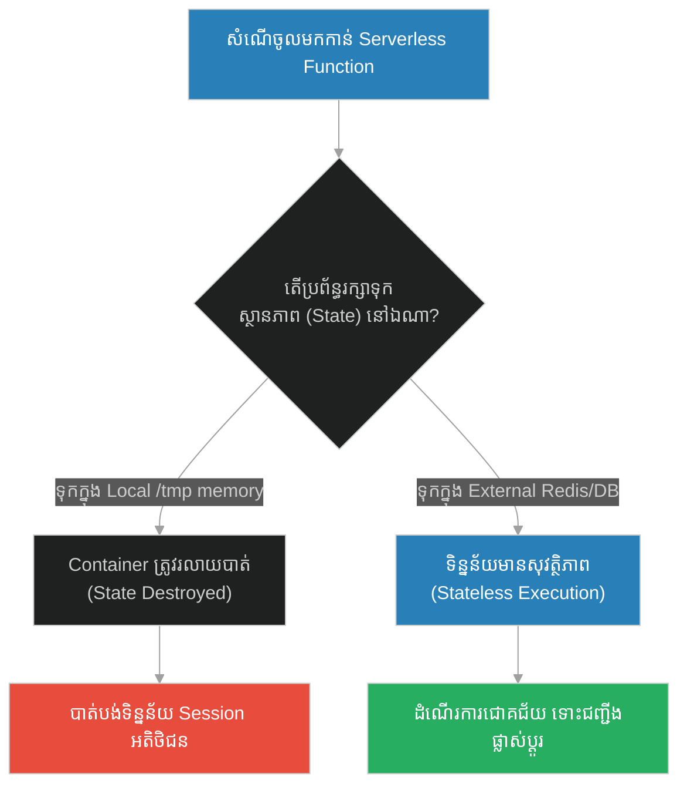
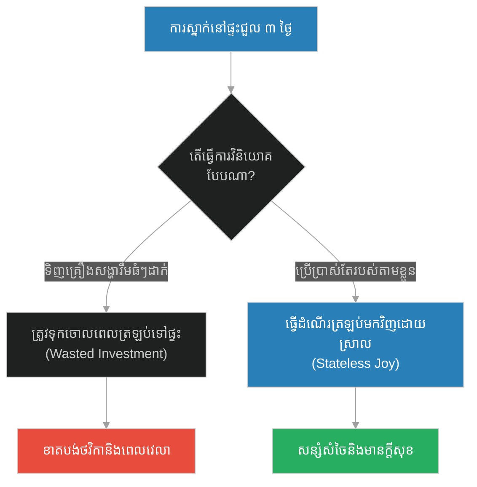
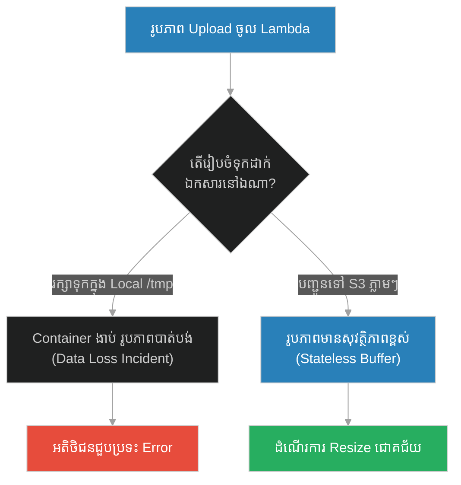
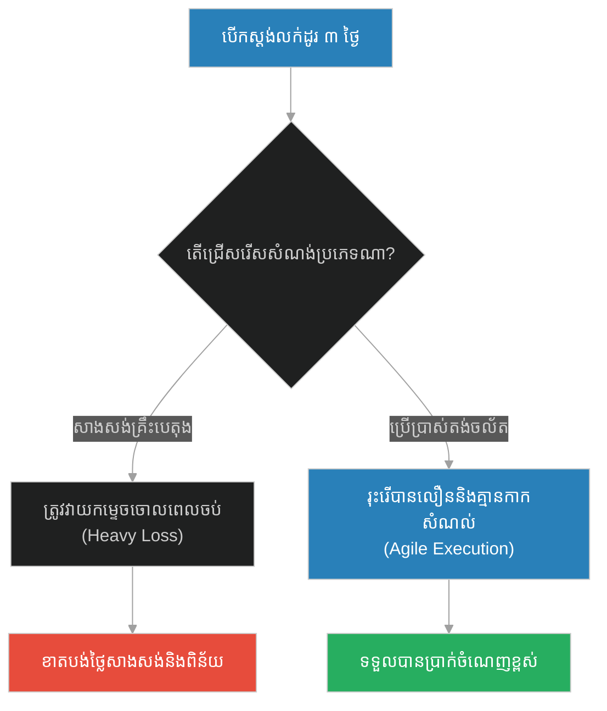
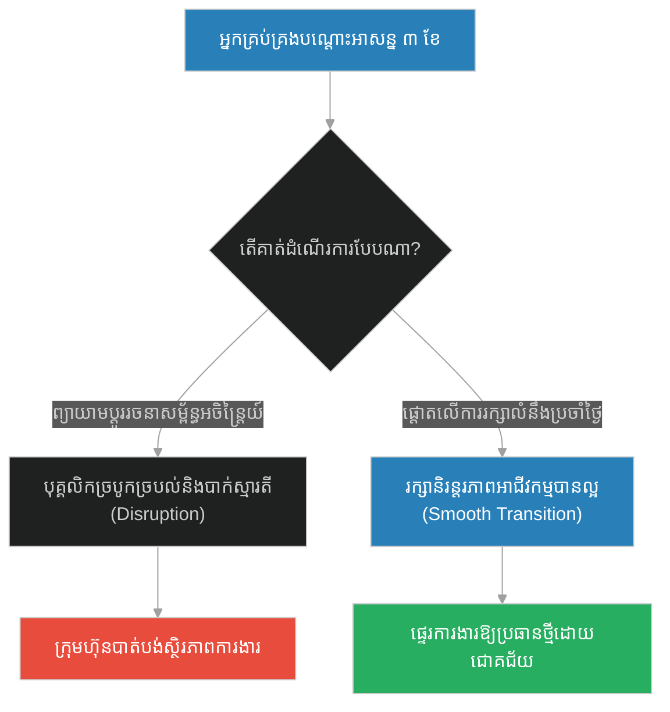
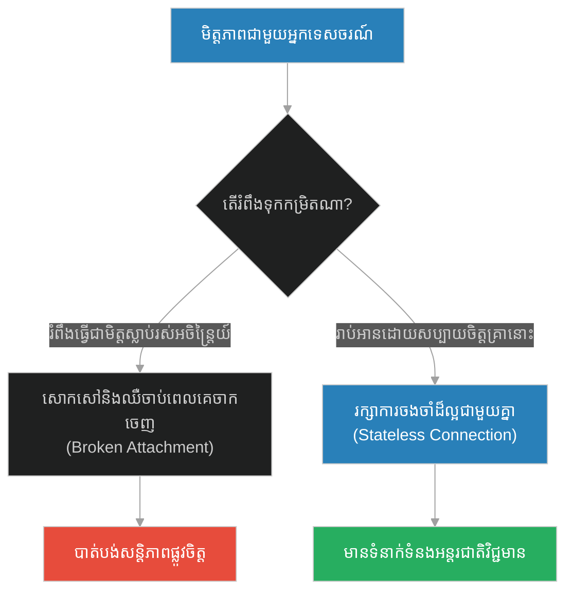
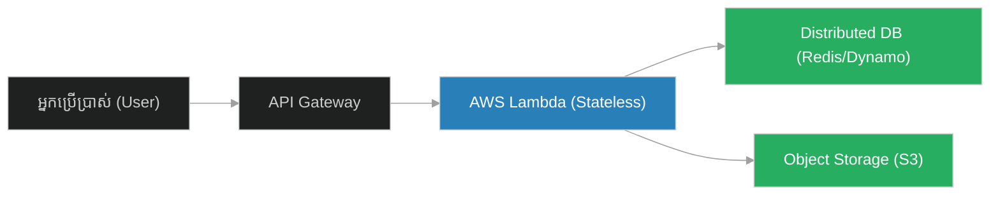

# Ephemeral States & Serverless Execution (អ្នកដំណើរក្រោមម្លប់ឈើ)៖ ស្ថានភាពបណ្តោះអាសន្ន និងការគណនាគ្មានម៉ាស៊ីនបម្រើ (Ephemeral States & Serverless Execution & Stateless Compute and Fleeting Resource Management & The Traveler Under a Tree)

**Author:** ichamrong  
**Date:** 2026-05-28  
**Tags:** #serverless #ephemeral-state #stateless #cloud-computing #aws-lambda  
**Category:** Concepts  
**Read Time:** ~15 min  

---

## 📌 មាតិកា (Table of Contents)
- [អន្ទាក់ផ្លូវចិត្ត (The Trap)](#0)
- [១. រឿងព្រេងនិទាន៖ អ្នកដំណើរក្រោមម្លប់ឈើ (The Legend of The Traveler Under a Tree)](#1)
  - [អ្នកដំណើរ និងម្លប់ឈើ (The Traveler and the Shade)](#1-1)
- [២. បញ្ហា៖ Ephemeral States & Serverless Execution (The Issue: Ephemeral States & Serverless Execution)](#2)
- [៣. ឧទាហរណ៍ជាក់ស្តែងក្នុងពិភពពិត (Real World Examples)](#3)
  - [ឧទាហរណ៍ទី ១ — កម្រិតស្រាល (គ្រួសារ)៖ ការតុបតែងផ្ទះជួលបណ្តោះអាសន្ន (The Rented Vacation Cabin)](#3-1)
  - [ឧទាហរណ៍ទី ២ — កម្រិតមធ្យម (បច្ចេកទេស)៖ ការរក្សាទុក File ក្នុង Folder /tmp របស់ AWS Lambda (The Lost File Uploads)](#3-2)
  - [ឧទាហរណ៍ទី ៣ — កម្រិតមធ្យម (ធុរកិច្ច)៖ ហាងលក់ទំនិញបណ្តោះអាសន្នពិព័រណ៍ (The Pop-up Festival Kiosk)](#3-3)
  - [ឧទាហរណ៍ទី ៤ — កម្រិតមធ្យម (សង្គម/គ្រប់គ្រង)៖ តួនាទីអ្នកគ្រប់គ្រងបណ្តោះអាសន្ន (The Interim Manager Trap)](#3-4)
  - [ឧទាហរណ៍ទី ៥ — កម្រិតធ្ងន់ (ទំនាក់ទំនង)៖ ការរំពឹងទុកលើមិត្តភក្តិអ្នកដំណើរ (The Fleeting Tourist Friend)](#3-5)
- [៤. ដំណោះស្រាយទូទៅ៖ ស្ថាបត្យកម្មគ្មានរដ្ឋ និងការបំបែកកន្លែងផ្ទុកទិន្នន័យ (The General Solution: Stateless Architecture & Shared State Stores)](#4)
- [សេចក្តីសន្និដ្ឋាន (Conclusion)](#5)
- [ឯកសារយោង (References)](#6)
- [Related Posts](#7)

---

<a id="0"></a>
## អន្ទាក់ផ្លូវចិត្ត (The Trap)

នៅក្នុងស្ថាបត្យកម្មពពក (Cloud Architecture) និងការរស់នៅ តើយើងតែងតែព្យាយាមបង្កើត "សំណង់អចិន្ត្រៃយ៍" ឬរក្សាទុកទិន្នន័យនៅក្នុងកន្លែងដែលត្រូវបានរចនាឡើងសម្រាប់តែការប្រើប្រាស់ "បណ្តោះអាសន្ន" ដែរឬទេ? នេះគឺជាអន្ទាក់នៃការលាយឡំរវាង ស្ថានភាពបណ្តោះអាសន្ន (Ephemeral State) និងស្ថានភាពអចិន្ត្រៃយ៍ (Persistent State)។

* **ការជាប់ជំពាក់នឹងបរិស្ថាន (Stateful Attachment)** — ព្យាយាមរក្សាទុកទិន្នន័យសំខាន់ៗនៅក្នុងអង្គចងចាំមូលដ្ឋាន ឬ Disk របស់ Serverless Container ដែលនឹងត្រូវកម្ទេចចោលភ្លាមៗនៅពេលបញ្ចប់ការងារ។
* **ភាពគ្មានរដ្ឋ និងការចម្លង (Stateless compute)** — ចាត់ទុកបរិស្ថានដំណើរការជាអ្នកដំណើរដែលគ្មានការជាប់ជំពាក់ ដោយបញ្ជូនរាល់ទិន្នន័យដែលត្រូវការរក្សាទុកទៅកាន់ Database ខាងក្រៅភ្លាមៗ។



1. **រឿងព្រេងនិទាន (The Legend)** — ព្យាការីម៉ូហាម៉ាត់ គេងលើកម្រាលរឹង និងមេរៀនប្រៀបធៀបខ្លួនទៅនឹង "អ្នកដំណើរសម្រាកក្រោមម្លប់ឈើ"។
2. **បញ្ហា (The Issue)** — ការពន្យល់ពី Ephemeral States ក្នុង Serverless Environment និងកំហុសឆ្គងនៃការរចនា Stateful Compute។
3. **ឧទាហរណ៍ជាក់ស្តែង (Real World Examples)** — ករណីសិក្សាទាំង ៥ កម្រិត ពីតង់លក់ដូរពិព័រណ៍រហូតដល់ AWS Lambda Function។
4. **ដំណោះស្រាយទូទៅ (The General Solution)** — ការកសាងប្រព័ន្ធ Stateless 12-Factor App និងយន្តការ Shared Memory។

---

<a id="1"></a>
## ១. រឿងព្រេងនិទាន៖ អ្នកដំណើរក្រោមម្លប់ឈើ (The Legend of The Traveler Under a Tree)

ថ្ងៃមួយ អ្នកសាវ័ក Umar (អូម៉ារ) បានចូលទៅក្នុងបន្ទប់របស់ព្យាការីម៉ូហាម៉ាត់ ហើយឃើញលោកកំពុងតែដេកនៅលើកម្រាលស្លឹកត្នោតដ៏រឹង និងរដុប។ នៅពេលលោកក្រោកឡើង Umar បានឃើញស្នាមកម្រាលស្លឹកត្នោតដក់ជាប់នៅលើខ្នង និងចំហៀងខ្លួនរបស់លោកយ៉ាងច្បាស់។

Umar មានការរំជួលចិត្តរហូតដល់ស្រក់ទឹកភ្នែក ហើយនិយាយថា៖ *"ឱរ៉សូលអល់ឡោះ! ស្តេចរ៉ូម និងស្តេចភើស៊ី កំពុងតែរស់នៅក្នុងរាជវាំង គេងលើពូកសូត្រយ៉ាងទន់ល្មើយ។ ចំណែកឯលោក ដែលជាអ្នកនាំសាររបស់ព្រះជាម្ចាស់ បែរជាមកគេងលើកម្រាលរឹងបែបនេះទៅវិញ? សូមអនុញ្ញាតឱ្យពួកយើងរៀបចំគ្រែដ៏ទន់ល្អមួយសម្រាប់លោកទៅ!"*

<a id="1-1"></a>
### អ្នកដំណើរ និងម្លប់ឈើ (The Traveler and the Shade)

ព្យាការីម៉ូហាម៉ាត់បានញញឹម រួចឆ្លើយតបទៅ Umar វិញដោយប្រើឧទាហរណ៍ដ៏ស៊ីជម្រៅមួយថា៖

**"តើខ្ញុំមានជាប់ពាក់ព័ន្ធអ្វីជាមួយពិភពលោកនេះ? ជីវិតរបស់ខ្ញុំនៅក្នុងពិភពលោកនេះ គឺប្រៀបដូចជា អ្នកដំណើរម្នាក់ ដែលដើរយ៉ាងហត់នឿយ ហើយក៏ឈប់សម្រាកនៅក្រោមម្លប់ដើមឈើមួយដើម (ដើម្បីគេចពីកម្តៅថ្ងៃ)។ ក្រោយពីសម្រាកបន្តិចរួច គាត់ក៏ត្រូវក្រោកបន្តដំណើរទៅមុខទៀត ដោយទុកដើមឈើនោះចោលនៅកន្លែងដើម។"**

លោកចង់ពន្យល់ថា ពិភពលោកនេះ គ្រាន់តែជា "ម្លប់ដើមឈើ" បណ្តោះអាសន្នប៉ុណ្ណោះ។ ការប្រមូលទ្រព្យសម្បត្តិ និងជាប់ជំពាក់ខ្លាំងជាមួយម្លប់ឈើ គឺជារឿងឥតប្រយោជន៍ ព្រោះអ្នកដំណើរមិនអាចយកវាទៅតាមជាមួយបានឡើយនៅពេលដល់ម៉ោងបន្តដំណើរ។

---

<a id="2"></a>
## ២. បញ្ហា៖ Ephemeral States & Serverless Execution (The Issue: Ephemeral States & Serverless Execution)

នៅក្នុងគំរូគណនីទំនើប **Serverless Computing (FaaS)** ដូចជា AWS Lambda, Cloudflare Workers, ឬ Google Cloud Functions ម៉ាស៊ីននិម្មិត (Containers) ត្រូវបានបង្កើតឡើងមកភ្លាមៗ (Cold Start) ដើម្បីដំណើរការកូដ នៅពេលមានសំណើចូលមក រួចត្រូវកម្ទេចចោលភ្លាមៗ (Tear Down) ក្រោយដំណើរការរួច។ 

ប្រសិនបើវិស្វកររចនាកម្មវិធីដោយសន្មត់ថា អង្គចងចាំ (In-memory Cache) ឬឯកសារដែលរក្សាទុកក្នុង Folder `/tmp` នឹងនៅបន្តមានសម្រាប់សំណើបន្ទាប់ ពួកគេនឹងជួបប្រទះការបាត់បង់ទិន្នន័យជាមិនខាន។ ពីព្រោះសំណើបន្ទាប់អាចនឹងត្រូវដំណើរការនៅលើ Container ថ្មីមួយផ្សេងទៀតដែលទើបតែបង្កើតឡើង។

គូសបញ្ជាក់ថា៖ **Serverless Computation ត្រូវតែជា Stateless (គ្មានរដ្ឋ)**។

### Code Example: Stateful vs. Stateless Serverless Function

ខាងក្រោមនេះជាការប្រៀបធៀបក្នុងភាសា TypeScript រវាង Serverless Function ដែលដំណើរការខុសឆ្គង (សន្មត់ថាមាន Local Memory State) និង Serverless Function ដែលមានស្ថាបត្យកម្មល្អ (ប្រើប្រាស់ External State Store)។

```typescript
// Shared External Database Mock (The Persistent World)
class ExternalRedisDatabase {
  private store = new Map<string, string>();

  public async getSession(key: string): Promise<string | null> {
    return this.store.get(key) || null;
  }

  public async setSession(key: string, val: string): Promise<void> {
    this.store.set(key, val);
  }
}

const sharedDB = new ExternalRedisDatabase();

// ==========================================
// FRAGILE PATH: Stateful Serverless Function (Assuming memory persists)
// ==========================================
class FragileLambdaFunction {
  // Ephemeral Memory (The Traveler's shade)
  private localSessionCache = new Map<string, string>();

  public async handleRequest(userId: string, sessionData: string): Promise<void> {
    console.log(`[Fragile Lambda] Checking local cache for User: ${userId}`);
    
    if (!this.localSessionCache.has(userId)) {
      console.log(`[Fragile Lambda] Cache Miss! Saving session info in-memory...`);
      this.localSessionCache.set(userId, sessionData);
    } else {
      console.log(`[Fragile Lambda] Cache Hit! Session loaded: ${this.localSessionCache.get(userId)}`);
    }
  }
}

// ==========================================
// RESILIENT PATH: Stateless Serverless Function (No local attachment)
// ==========================================
class ResilientLambdaFunction {
  
  public async handleRequest(userId: string, sessionData: string): Promise<void> {
    console.log(`\n[Resilient Lambda] Accessing stateless function...`);
    
    // Fetch session from external distributed database (Persistent Store)
    const activeSession = await sharedDB.getSession(userId);

    if (!activeSession) {
      console.log("[Resilient Lambda] Session not found in DB. Storing session to Redis...");
      await sharedDB.setSession(userId, sessionData);
    } else {
      console.log(`[Resilient Lambda] SUCCESS: Session retrieved from Redis: ${activeSession}`);
    }
  }
}

// Demonstration of Serverless Lifecycles (Containers spinning up and down)
async function runDemo() {
  console.log("--- Container 01 executes first request ---");
  const container1 = new FragileLambdaFunction();
  await container1.handleRequest("user_abc", "TOKEN_XYZ");

  console.log("\n--- Container 01 scale down. Container 02 spins up for next request ---");
  const container2 = new FragileLambdaFunction();
  // Container 2 has no memory of user_abc session!
  await container2.handleRequest("user_abc", "TOKEN_XYZ"); // Forced logout/re-authorization

  console.log("\n--- Executing Resilient Stateless System ---");
  const resilientContainer1 = new ResilientLambdaFunction();
  await resilientContainer1.handleRequest("user_abc", "TOKEN_XYZ");

  const resilientContainer2 = new ResilientLambdaFunction();
  // Works flawlessly because state is saved externally
  await resilientContainer2.handleRequest("user_abc", "TOKEN_XYZ"); 
}

runDemo();
```

---

<a id="3"></a>
## ៣. ឧទាហរណ៍ជាក់ស្តែងក្នុងពិភពពិត (Real World Examples)

<a id="3-1"></a>
### ឧទាហរណ៍ទី ១ — កម្រិតស្រាល (គ្រួសារ)៖ ការតុបតែងផ្ទះជួលបណ្តោះអាសន្ន (The Rented Vacation Cabin)
គ្រួសារមួយដែលទៅលេងកម្សាន្តនៅតំបន់ភ្នំរយៈពេល ៣ ថ្ងៃ ហើយសម្រេចចិត្តចំណាយលុយរាប់ពាន់ដុល្លារលាបថ្នាំជញ្ជាំង និងទិញគ្រែឈើធំៗដាក់ក្នុងផ្ទះជួលបណ្តោះអាសន្ននោះ (Stateful Attachment) ធៀបនឹង គ្រួសារដែលរីករាយនឹងដំណើរកម្សាន្តដោយយកតាមខ្លួនតែស្ពាយស្ពាយសាមញ្ញៗ (Stateless Travel)។



<a id="3-2"></a>
### ឧទាហរណ៍ទី ២ — កម្រិតមធ្យម (បច្ចេកទេស)៖ ការរក្សាទុក File ក្នុង Folder /tmp របស់ AWS Lambda (The Lost File Uploads)
អ្នកអភិវឌ្ឍន៍កម្មវិធីម្នាក់ រចនាប្រព័ន្ធ Upload រូបភាពរបស់អតិថិជន ដោយរក្សាទុកឯកសារនោះនៅក្នុង Folder `/tmp` របស់ AWS Lambda Function ជាបណ្តោះអាសន្ន រួចដំណើរការ resize។ នៅពេលមានចំនួនអ្នកប្រើប្រាស់កើនឡើងភ្លាមៗ Lambda បង្កើត Container ថ្មី ធ្វើឱ្យរូបភាពដែលរក្សាទុកក្នុង `/tmp` មុននោះបាត់បង់ទាំងស្រុង មុនពេលវាត្រូវបានផ្ញើទៅ S3 Bucket។



<a id="3-3"></a>
### ឧទាហរណ៍ទី ៣ — កម្រិតមធ្យម (ធុរកិច្ច)៖ ហាងលក់ទំនិញបណ្តោះអាសន្នពិព័រណ៍ (The Pop-up Festival Kiosk)
សហគ្រិនម្នាក់ បើកស្តង់លក់ភេសជ្ជៈនៅក្នុងពិព័រណ៍រយៈពេល ៣ ថ្ងៃ ដោយសាងសង់គ្រឹះថ្មបេតុង និងដំឡើងម៉ាស៊ីនត្រជាក់អចិន្ត្រៃយ៍ (Stateful Store) ធៀបនឹង សហគ្រិនដែលប្រើប្រាស់តង់ចល័តដែលអាចដំឡើង និងរុះរើបានក្នុងរយៈពេល ១ ម៉ោង (Stateless/Ephemeral Store)។



<a id="3-4"></a>
### ឧទាហរណ៍ទី ៤ — កម្រិតមធ្យម (សង្គម/គ្រប់គ្រង)៖ តួនាទីអ្នកគ្រប់គ្រងបណ្តោះអាសន្ន (The Interim Manager Trap)
អ្នកគ្រប់គ្រងបណ្តោះអាសន្នម្នាក់ (Interim Manager) ដែលត្រូវបានជួលមកដើម្បីបំពេញការងាររយៈពេល ៣ ខែ ក្នុងចន្លោះពេលរង់ចាំប្រធានថ្មី ប៉ុន្តែព្យាយាមកែប្រែរចនាសម្ព័ន្ធរបស់ក្រុមហ៊ុនទាំងស្រុង និងបណ្តេញបុគ្គលិកចាស់ៗចោល បង្កើតជាភាពវឹកវរធំធេង។



<a id="3-5"></a>
### ឧទាហរណ៍ទី ៥ — កម្រិតធ្ងន់ (ទំនាក់ទំនង)៖ ការរំពឹងទុកលើមិត្តភក្តិអ្នកដំណើរ (The Fleeting Tourist Friend)
យើងសេពគប់មិត្តភក្តិម្នាក់ដែលជាអ្នកទេសចរណ៍មកលេងស្រុកខ្មែររយៈពេល ២ សប្តាហ៍ ប៉ុន្តែយើងព្យាយាមទាមទារឱ្យគេសន្យាធ្វើជាមិត្តស្លាប់រស់ និងចំណាយពេលវេលាទាំងអស់មកលើរូបយើង (Stateful expectation) ដែលនាំឱ្យមានការឈឺចាប់ពេលគេត្រឡប់ទៅស្រុកគេវិញ។



---

<a id="4"></a>
## ៤. ដំណោះស្រាយទូទៅ៖ ស្ថាបត្យកម្មគ្មានរដ្ឋ និងការបំបែកកន្លែងផ្ទុកទិន្នន័យ (The General Solution: Stateless Architecture & Shared State Stores)

ដើម្បីកសាងប្រព័ន្ធ Serverless ដែលមានស្ថិរភាព និងជៀសវាងបញ្ហាបាត់បង់ទិន្នន័យ វិស្វករប្រព័ន្ធគួរតែអនុវត្តយន្តការដូចខាងក្រោម៖

1. **Strict Stateless Execution**: រាល់ Serverless Instance ទាំងអស់ ត្រូវតែត្រូវបានចាត់ទុកថាអាចត្រូវបានបំផ្លាញចោលគ្រប់វិនាទី។ គ្មានទិន្នន័យ Session ណាមួយត្រូវបានរក្សាទុកក្នុង local variables ឡើយ។
2. **Shared Distributed Cache**: ត្រូវប្រើប្រាស់ប្រព័ន្ធផ្ទុកទិន្នន័យខាងក្រៅដែលមានល្បឿនលឿន (ដូចជា Redis ឬ Memcached) ដើម្បីរក្សាទុកស្ថានភាពការងារ (Shared State)។
3. **Decoupled File Storage**: រាល់ឯកសារដែលអតិថិជន Upload ចូលមក ត្រូវតែបញ្ជូនទៅកាន់ Object Storage (ដូចជា AWS S3) ដោយផ្ទាល់ ជាជាងរក្សាទុកក្នុង Local Storage។



---

<a id="5"></a>
## សេចក្តីសន្និដ្ឋាន (Conclusion)

> **«ជីវិត និងការគណនាពពក គឺប្រៀបដូចជាការឈប់សម្រាកនៅក្រោមម្លប់ឈើបណ្តោះអាសន្នប៉ុណ្ណោះ។ ការមិនជាប់ជំពាក់ និងការចាត់ទុករបស់ក្រៅខ្លួនជាវត្ថុបណ្តោះអាសន្ន គឺជាអាថ៌កំបាំងនៃសេរីភាព និងភាពធន់ពិតប្រាកដ។»**

ការរស់នៅដោយមានសតិដឹងថាអ្វីៗជាវត្ថុបណ្តោះអាសន្ន ជួយឱ្យយើងមិនរងទុក្ខវេទនានៅពេលដែលមានការផ្លាស់ប្តូរ និងត្រៀមខ្លួនជានិច្ចសម្រាប់ជំហានបន្ទាប់។

---

<a id="6"></a>
## ឯកសារយោង (References)

*   **The Traveler Hadith (Sunan al-Tirmidhi 2377)** — The famous prophetic quote outlining the transient nature of life using the metaphor of a resting traveler.
*   **The 12-Factor App: Stateless Processes** — Architectural guidelines stating that apps must execute as one or more stateless processes.
*   **Serverless Computing: State of the Art and Challenges** — ACM survey detailing state management in Function-as-a-Service (FaaS) systems.

---

<a id="7"></a>
## Related Posts

* [[214-prophet-and-the-piece-of-flesh.md]](214-prophet-and-the-piece-of-flesh.md) — Root Brain & Central Orchestrator State
* [[216-prophet-and-the-man-asking-for-money.md]](216-prophet-and-the-man-asking-for-money.md) — Dependency Injection & Self-Provisioning Infrastructure

## 🐇 ធ្លាក់ចូលក្នុងរន្ធទន្សាយ (Enter the Rabbit Hole)
ដើម្បីស្វែងយល់បន្ថែមអំពី ការចាក់បញ្ចូលការពឹងផ្អែក និងហេដ្ឋារចនាសម្ព័ន្ធស្វ័យផ្គត់ផ្គង់ សូមបន្តដំណើរទៅកាន់៖

* 🚀 **[ចាប់ផ្តើមដំណើររុករក (Start the Journey) ➔ Dependency Injection & Self-Provisioning Infrastructure (បុរសដែលសុំទាន)](./216-prophet-and-the-man-asking-for-money.md)**
