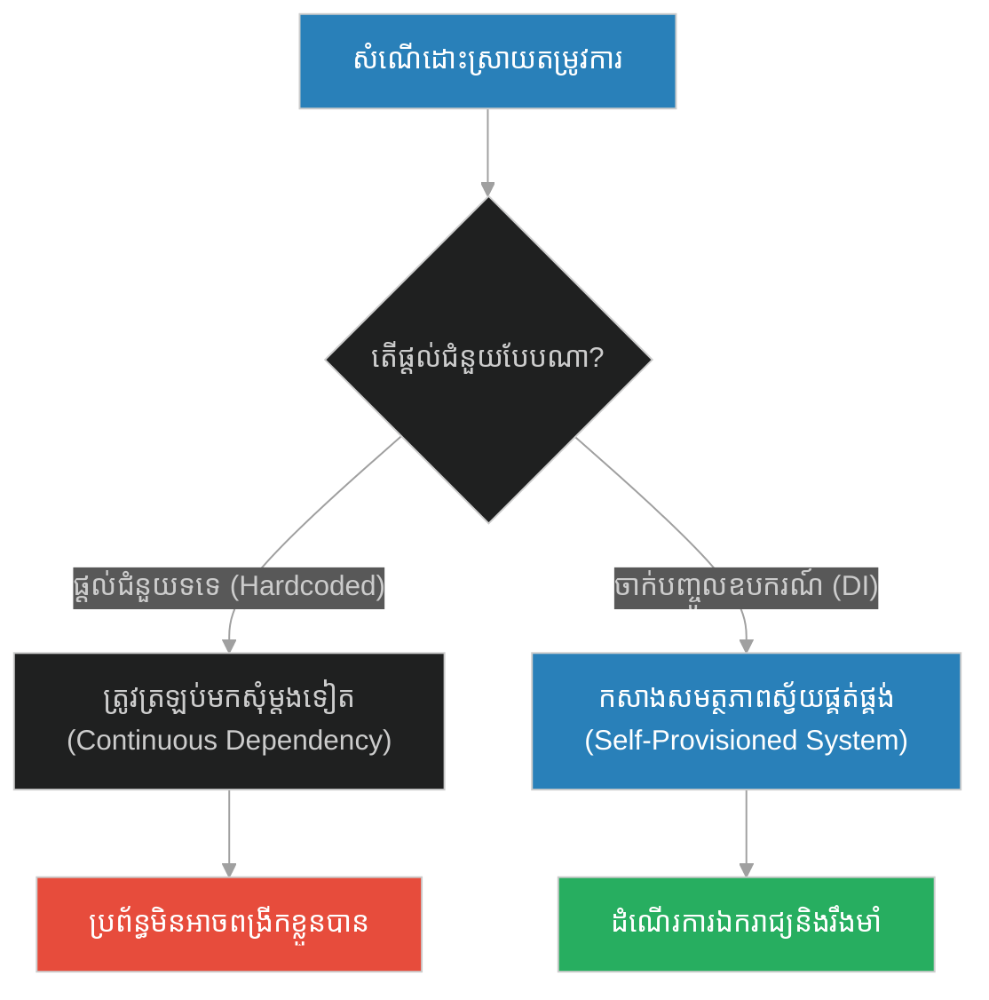
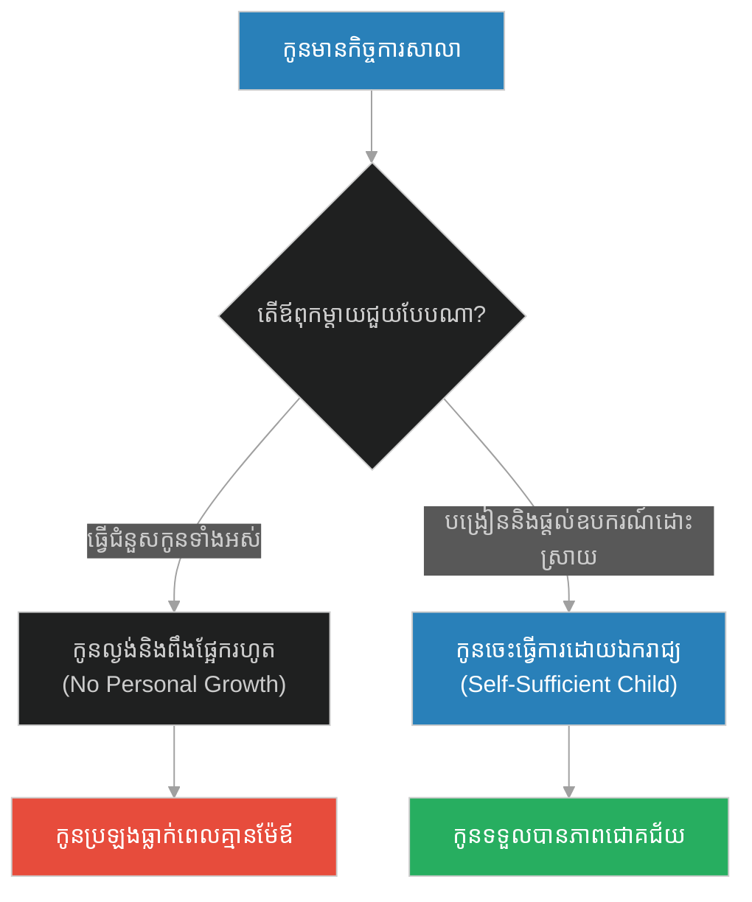
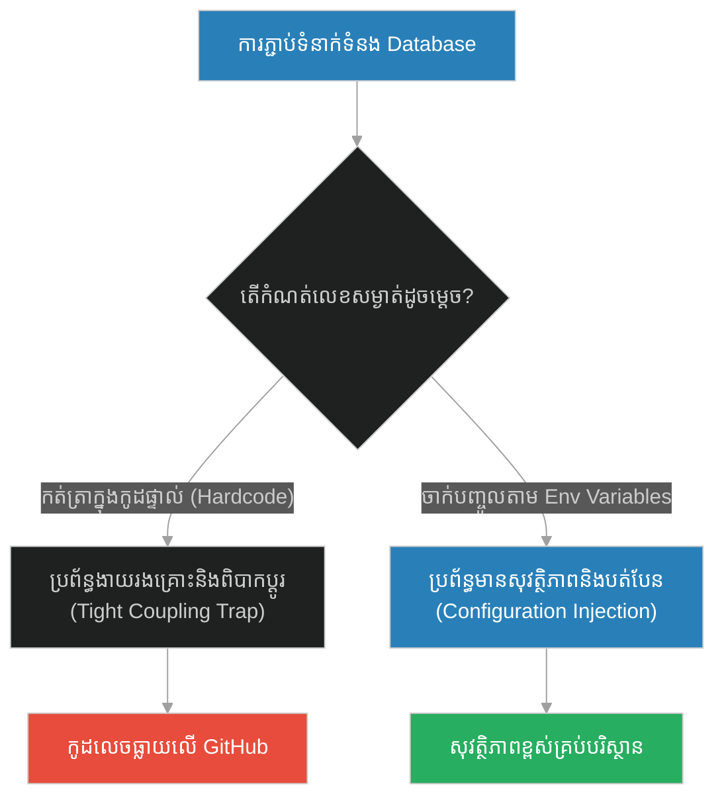
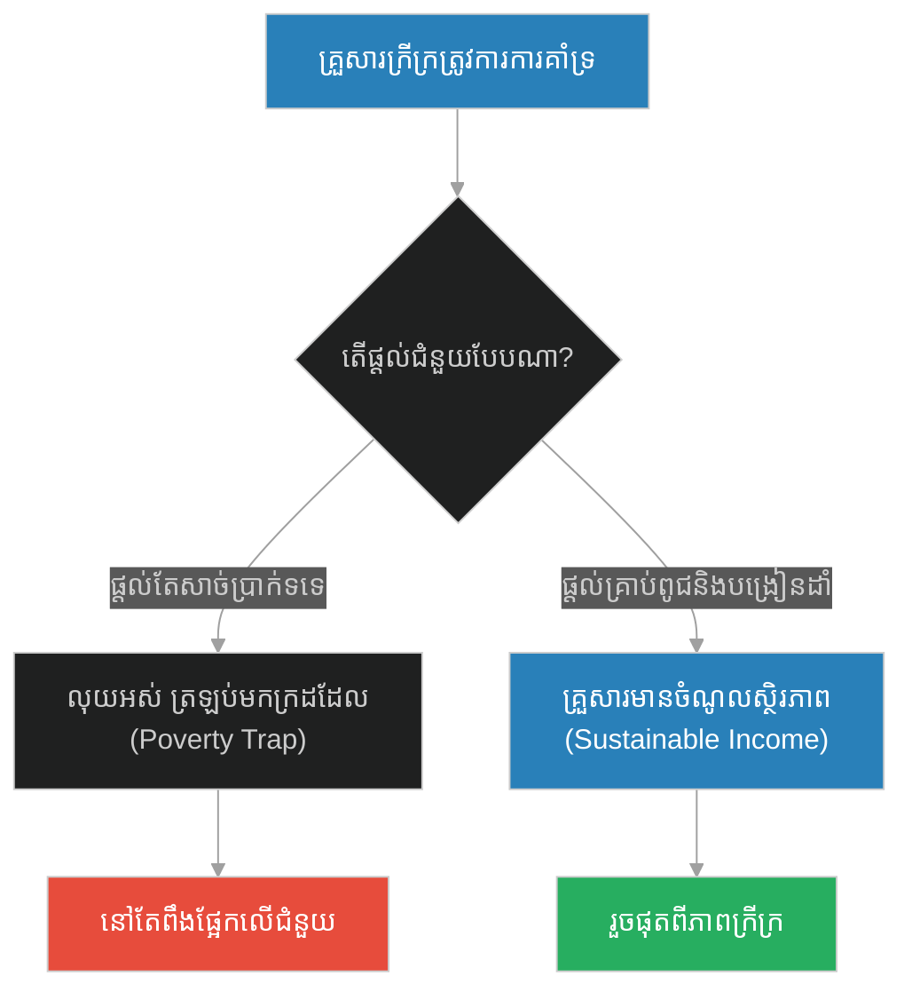
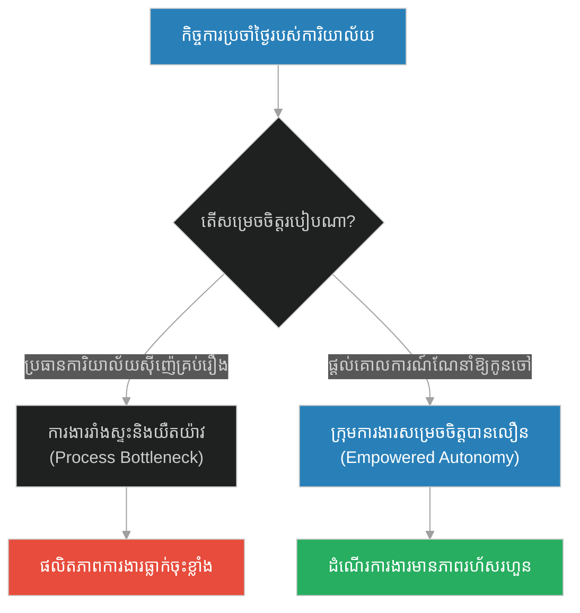
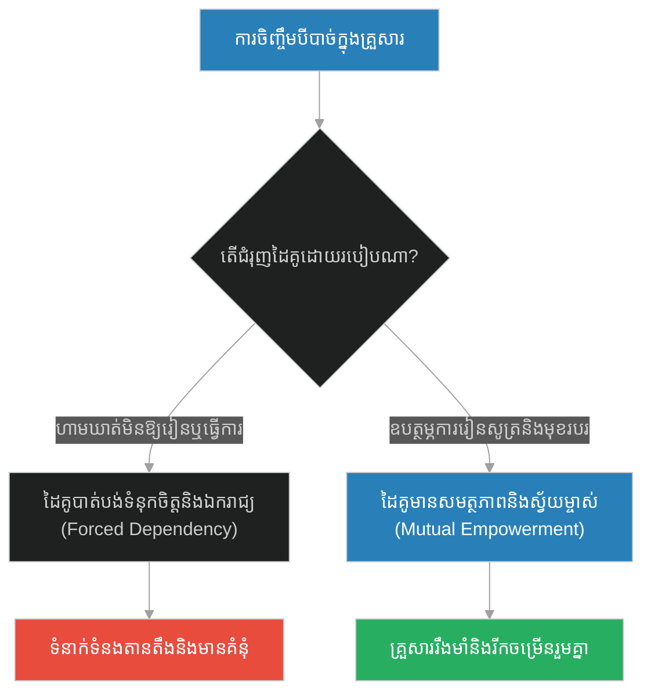
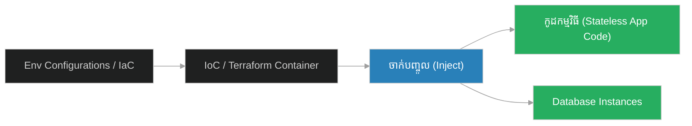

# Dependency Injection & Self-Provisioning Infrastructure (បុរសដែលសុំទាន)៖ ការចាក់បញ្ចូលការពឹងផ្អែក និងហេដ្ឋារចនាសម្ព័ន្ធស្វ័យផ្គត់ផ្គង់ (Dependency Injection & Self-Provisioning Infrastructure & Dependency Decoupling and Self-Bootstrapping Resources & The Man Who Asked for Charity)

**Author:** ichamrong  
**Date:** 2026-05-28  
**Tags:** #dependency-injection #self-provisioning #inversion-of-control #loose-coupling #infrastructure-as-code  
**Category:** Concepts  
**Read Time:** ~15 min  

---

## 📌 មាតិកា (Table of Contents)
- [អន្ទាក់ផ្លូវចិត្ត (The Trap)](#0)
- [១. រឿងព្រេងនិទាន៖ បុរសដែលសុំទាន (The Legend of The Man Who Asked for Charity)](#1)
  - [ការជួយដែលត្រឹមត្រូវ (The Right Way to Help)](#1-1)
- [២. បញ្ហា៖ Dependency Injection & Self-Provisioning Infrastructure (The Issue: Dependency Injection & Self-Provisioning Infrastructure)](#2)
- [៣. ឧទាហរណ៍ជាក់ស្តែងក្នុងពិភពពិត (Real World Examples)](#3)
  - [ឧទាហរណ៍ទី ១ — កម្រិតស្រាល (គ្រួសារ)៖ ការធ្វើលំហាត់ជំនួសកូន (The Homework Handout)](#3-1)
  - [ឧទាហរណ៍ទី ២ — កម្រិតមធ្យម (បច្ចេកទេស)៖ ការកត់ត្រាលេខកូដសម្ងាត់ Database ក្នុងកូដ (The Hardcoded Credentials Trap)](#3-2)
  - [ឧទាហរណ៍ទី ៣ — កម្រិតមធ្យម (ធុរកិច្ច)៖ ការផ្តល់ប្រាក់កម្ចីទទេដល់សហគ្រិន (The Cash Handout vs. Business Incubator)](#3-3)
  - [ឧទាហរណ៍ទី ៤ — កម្រិតមធ្យម (សង្គម/គ្រប់គ្រង)៖ ការសម្រេចចិត្តគ្រប់រឿងជំនួសក្រុមការងារ (The Decisional Dependency Trap)](#3-4)
  - [ឧទាហរណ៍ទី ៥ — កម្រិតធ្ងន់ (ទំនាក់ទំនង)៖ ការបង្អត់ឱកាសសិក្សារបស់ដៃគូ (The Dependency Control Trap)](#3-5)
- [៤. ដំណោះស្រាយទូទៅ៖ ការគ្រប់គ្រងបញ្ច្រាស និងហេដ្ឋារចនាសម្ព័ន្ធជាកូដ (The General Solution: Inversion of Control & Infrastructure as Code)](#4)
- [សេចក្តីសន្និដ្ឋាន (Conclusion)](#5)
- [ឯកសារយោង (References)](#6)
- [Related Posts](#7)

---

<a id="0"></a>
## អន្ទាក់ផ្លូវចិត្ត (The Trap)

នៅក្នុងស្ថាបត្យកម្មប្រព័ន្ធព័ត៌មានវិទ្យា និងការគ្រប់គ្រង តើយើងតែងតែដោះស្រាយបញ្ហាដោយផ្តល់ "ជំនួយបណ្តោះអាសន្ន" ឬតភ្ជាប់សមាសភាគផ្សេងៗឱ្យពឹងផ្អែកគ្នាខ្លាំងពេក (Tight Coupling) រហូតដល់ពួកវាលែងមានលទ្ធភាពដំណើរការដោយឯករាជ្យដែរឬទេ? នេះគឺជាអន្ទាក់នៃការពឹងផ្អែកគ្នា និងការខ្វះខាតលទ្ធភាពស្វ័យផ្គត់ផ្គង់។

* **ការជួយបែបបង្កការពឹងផ្អែក (Hardcoded Dependency)** — ផ្តល់ជំនួយជាលុយកាក់ទទេ (ឬសរសេរកូដដែលបង្កប់ឧបករណ៍ក្នុងខ្លួនផ្ទាល់) ដែលធ្វើឱ្យប្រព័ន្ធ ឬមនុស្សត្រូវត្រឡប់មកសុំជំនួយជារៀងរាល់ថ្ងៃ។
* **ការចាក់បញ្ចូលឧបករណ៍ និងការបង្វែរការគ្រប់គ្រង (Dependency Injection)** — ផ្តល់ឱ្យនូវឧបករណ៍ កម្លាំងពលកម្ម និងវិធីសាស្ត្រ ដើម្បីឱ្យពួកគេអាចគ្រប់គ្រង និងស្វ័យផ្គត់ផ្គង់តម្រូវការរបស់ខ្លួនបានដោយឯករាជ្យ។



1. **រឿងព្រេងនិទាន (The Legend)** — ព្យាការីម៉ូហាម៉ាត់ និងការបដិសេធមិនផ្តល់លុយសុំទាន តែផ្តល់ពូថៅដំដងឈើឱ្យទៅកាប់អុស។
2. **បញ្ហា (The Issue)** — ការពន្យល់ពី Dependency Injection និងភាពខុសគ្នារវាង Tight Coupling និង Inversion of Control។
3. **ឧទាហរណ៍ជាក់ស្តែង (Real World Examples)** — ករណីសិក្សាទាំង ៥ កម្រិត ពីការអភិវឌ្ឍសមត្ថភាពកូនរហូតដល់ API Database Configurations។
4. **ដំណោះស្រាយទូទៅ (The General Solution)** — ការប្រើប្រាស់ Container សម្រាប់ចាក់បញ្ចូលការពឹងផ្អែក (DI Container) និង Infrastructure as Code (IaC)។

---

<a id="1"></a>
## ១. រឿងព្រេងនិទាន៖ បុរសដែលសុំទាន (The Legend of The Man Who Asked for Charity)

ថ្ងៃមួយ មានបុរសក្រីក្រម្នាក់មកពីក្រុមកុលសម្ព័ន្ធ Ansar បានមកជួបព្យាការីម៉ូហាម៉ាត់ ដើម្បីសុំលុយធ្វើជាអំណោយទាន ដោយសារតែគាត់គ្មានអ្វីហូបសោះនៅផ្ទះ។ ជំនួសឱ្យការឱ្យលុយទៅគាត់ភ្លាមៗ ព្យាការីម៉ូហាម៉ាត់បានសួរគាត់ថា៖ *"តើនៅផ្ទះរបស់អ្នក មាននៅសល់របស់អ្វីខ្លះ?"*

បុរសនោះឆ្លើយថា៖ *"មានតែក្រណាត់មួយផ្ទាំង សម្រាប់ស្លៀកពាក់ខ្លះនិងក្រាលដេកខ្លះ និងកែវឈើមួយសម្រាប់ផឹកទឹកប៉ុណ្ណោះ។"*

ព្យាការីម៉ូហាម៉ាត់ប្រាប់ឱ្យគាត់ទៅយករបស់ទាំងពីរនោះមក។ ពេលគាត់យកមកដល់ លោកបានយករបស់នោះទៅប្រកាសលក់ដេញថ្លៃ (Auction) នៅចំពោះមុខអ្នកសាវ័កផ្សេងទៀត។ លោកលក់របស់ទាំងនោះបានប្រាក់ ២ ឌៀរហាម (Dirhams)។

<a id="1-1"></a>
### ការជួយដែលត្រឹមត្រូវ (The Right Way to Help)

លោកបានប្រគល់ប្រាក់ ២ ឌៀរហាមនោះទៅឱ្យបុរសក្រីក្រនោះ រួចណែនាំថា៖ **"យក ១ ឌៀរហាមទៅទិញអាហារសម្រាប់គ្រួសារអ្នក ហើយយក ១ ឌៀរហាមទៀតទៅទិញ 'ផ្លែពូថៅ' មួយ រួចយកវាមកឱ្យខ្ញុំ។"**

ពេលបុរសនោះយកផ្លែពូថៅមក ព្យាការីម៉ូហាម៉ាត់ផ្ទាល់បានយកដំបងឈើមួយ មកដំធ្វើជាដងពូថៅឱ្យគាត់ (ដំឡើងឧបករណ៍) រួចប្រាប់គាត់ថា៖ **"ឥឡូវនេះ យកពូថៅនេះទៅកាប់អុសនៅក្នុងព្រៃ ហើយយកមកលក់ចុះ។ កុំឱ្យខ្ញុំឃើញមុខអ្នករយៈពេល ១៥ ថ្ងៃ។"**

បុរសនោះធ្វើតាមការណែនាំ។ ១៥ ថ្ងៃក្រោយមក គាត់ត្រឡប់មកវិញដោយទឹកមុខញញឹម ហើយរាយការណ៍ថា គាត់រកប្រាក់ចំណេញបាន ១០ ឌៀរហាម ដែលគ្រប់គ្រាន់សម្រាប់ទិញទាំងសម្លៀកបំពាក់ និងអាហារឱ្យគ្រួសារគាត់ដោយខ្លួនឯង ដោយមិនបាច់សុំទានគេទៀតទេ។

---

<a id="2"></a>
## ២. បញ្ហា៖ Dependency Injection & Self-Provisioning Infrastructure (The Issue: Dependency Injection & Self-Provisioning Infrastructure)

នៅក្នុងស្ថាបត្យកម្មកម្មវិធី (Software Architecture) ប្រព័ន្ធដែលគ្មាន **Dependency Injection (DI)** គឺប្រៀបដូចជាបុរសដែលចាំតែសុំទានគេ។ ថ្នាក់នីមួយៗ (Classes) បង្កើតឧបករណ៍ ឬការពឹងផ្អែក (Dependencies) របស់ខ្លួននៅក្នុង Constructor ដោយផ្ទាល់ (ឧទាហរណ៍៖ database connection, logger, email client)។ នេះធ្វើឱ្យប្រព័ន្ធទាំងមូលមានលក្ខណៈ **Tightly Coupled (ជាប់ជំពាក់គ្នាខ្លាំង)**។ ប្រសិនបើ Database ផ្លាស់ប្តូរប្រភេទ វិស្វករត្រូវសរសេរកូដគ្រប់ថ្នាក់ឡើងវិញទាំងអស់។

ផ្ទុយទៅវិញ **Inversion of Control (IoC)** តាមរយៈ Dependency Injection បង្វែរការទទួលខុសត្រូវក្នុងការស្វែងរកឧបករណ៍។ ថ្នាក់នីមួយៗគ្រាន់តែប្រកាសថាខ្លួនត្រូវការ "ពូថៅ" (Axe Interface) ហើយប្រព័ន្ធខាងក្រៅ (DI Container) នឹងចាក់បញ្ចូល (Inject) ពូថៅនោះឱ្យនៅពេលដំណើរការ។

### Code Example: Hardcoded Dependency vs. Dependency Injection

ខាងក្រោមនេះជាការប្រៀបធៀបក្នុងភាសា TypeScript រវាងប្រព័ន្ធដោះស្រាយបញ្ហាដែលបង្កប់ឧបករណ៍ផ្ទាល់ខ្លួន និងប្រព័ន្ធប្រើប្រាស់ Dependency Injection។

```typescript
// 1. Defining the Dependency Interface
interface AxeTool {
  chopWood(): string;
}

class PineWoodAxe implements AxeTool {
  public chopWood(): string {
    return "High quality pine wood logs";
  }
}

class OakWoodAxe implements AxeTool {
  public chopWood(): string {
    return "Heavy duty oak logs";
  }
}

// ==========================================
// FRAGILE PATH: Hardcoded Dependency (No Injection)
// ==========================================
class FragileWoodcutter {
  // Hardcoded PineWoodAxe inside the class
  private tool: PineWoodAxe;

  constructor() {
    // Highly coupled. Cannot change the tool to OakWoodAxe without editing code here.
    this.tool = new PineWoodAxe(); 
  }

  public gatherResources(): void {
    console.log(`[Fragile Woodcutter] Chopping using: ${this.tool.chopWood()}`);
  }
}

// ==========================================
// RESILIENT PATH: Dependency Injection
// ==========================================
class ResilientWoodcutter {
  // Loosely coupled to the Interface, not the concrete implementation
  private tool: AxeTool;

  // The tool (Dependency) is injected from outside (via constructor)
  constructor(injectedTool: AxeTool) {
    this.tool = injectedTool;
  }

  public gatherResources(): void {
    console.log(`[Resilient Woodcutter] Chopping using: ${this.tool.chopWood()}`);
  }
}

// Demonstration
console.log("--- Fragile Coupled System ---");
const fragileCutter = new FragileWoodcutter();
fragileCutter.gatherResources(); // Only chops Pine

console.log("\n--- Resilient Decoupled System ---");
const pineAxe = new PineWoodAxe();
const oakAxe = new OakWoodAxe();

// Injecting Pine Axe
const resilientCutter1 = new ResilientWoodcutter(pineAxe);
resilientCutter1.gatherResources();

// Injecting Oak Axe without modifying the ResilientWoodcutter class code!
const resilientCutter2 = new ResilientWoodcutter(oakAxe);
resilientCutter2.gatherResources();
```

---

<a id="3"></a>
## ៣. ឧទាហរណ៍ជាក់ស្តែងក្នុងពិភពពិត (Real World Examples)

<a id="3-1"></a>
### ឧទាហរណ៍ទី ១ — កម្រិតស្រាល (គ្រួសារ)៖ ការធ្វើលំហាត់ជំនួសកូន (The Homework Handout)
ឪពុកម្តាយដែលធ្វើលំហាត់គណិតវិទ្យាជំនួសកូនរាល់ល្ងាចដើម្បីឱ្យកូនបានពិន្ទុល្អ (Hardcoded Handout) ធៀបនឹង ឪពុកម្តាយដែលទិញសៀវភៅរូបមន្តគណិតវិទ្យាឱ្យកូន និងពន្យល់ពីវិធីដោះស្រាយ ដើម្បីឱ្យកូនអាចដោះស្រាយលំហាត់ដោយខ្លួនឯងបាន (Injecting Capability)។



<a id="3-2"></a>
### ឧទាហរណ៍ទី ២ — កម្រិតមធ្យម (បច្ចេកទេស)៖ ការកត់ត្រាលេខកូដសម្ងាត់ Database ក្នុងកូដ (The Hardcoded Credentials Trap)
កម្មវិធីដែលសរសេរបញ្ចូល Username និង Password របស់ Database នៅក្នុងកូដផ្ទាល់ ដែលធ្វើឱ្យប្រព័ន្ធទាំងមូលត្រូវសរសេរកូដឡើងវិញរាល់ពេលផ្លាស់ប្តូរម៉ាស៊ីនបម្រើ ធៀបនឹង ការប្រើប្រាស់ Environment Variables ដើម្បីចាក់បញ្ចូលលេខសម្ងាត់ទាំងនោះនៅពេល runtime (Dependency Injection)។



<a id="3-3"></a>
### ឧទាហរណ៍ទី ៣ — កម្រិតមធ្យម (ធុរកិច្ច)៖ ការផ្តល់ប្រាក់កម្ចីទទេដល់សហគ្រិន (The Cash Handout vs. Business Incubator)
អង្គការសប្បុរសធម៌ដែលផ្តល់លុយ $1000 ដល់គ្រួសារក្រីក្រដើម្បីទិញអាហារហូបចុក ធៀបនឹង អង្គការដែលផ្តល់ឱ្យនូវឧបករណ៍កសិកម្ម គ្រាប់ពូជ និងបណ្តុះបណ្តាលបច្ចេកទេសដាំដុះ (Injecting Tools) ដើម្បីឱ្យពួកគេបង្កើតប្រាក់ចំណូលនិរន្តរភាព។



<a id="3-4"></a>
### ឧទាហរណ៍ទី ៤ — កម្រិតមធ្យម (សង្គម/គ្រប់គ្រង)៖ ការសម្រេចចិត្តគ្រប់រឿងជំនួសក្រុមការងារ (The Decisional Dependency Trap)
ប្រធាននាយកដ្ឋានម្នាក់ដែលមិនព្រមប្រគល់អំណាចសម្រេចចិត្តឱ្យបុគ្គលិកថ្នាក់ក្រោម ដោយទាមទារឱ្យរាល់សំបុត្រ ឬសំណើតូចៗត្រូវតែមានហត្ថលេខារបស់ខ្លួន ធៀបនឹង ប្រធាននាយកដ្ឋានដែលកំណត់ដែនសមត្ថកិច្ច និងចាក់បញ្ចូលគោលនយោបាយណែនាំ (Injecting Decision Frameworks) ដើម្បីឱ្យក្រុមការងារសម្រេចចិត្តដោយខ្លួនឯង។



<a id="3-5"></a>
### ឧទាហរណ៍ទី ៥ — កម្រិតធ្ងន់ (ទំនាក់ទំនង)៖ ការបង្អត់ឱកាសសិក្សារបស់ដៃគូ (The Dependency Control Trap)
ដៃគូម្ខាងដែលព្យាយាមរក្សាអំណាចហិរញ្ញវត្ថុដោយមិនឱ្យដៃគូម្ខាងទៀតទៅរៀន ឬធ្វើការងារ ដើម្បីរក្សាដៃគូនោះឱ្យស្ថិតក្រោមការគ្រប់គ្រង និងការពឹងផ្អែកលើខ្លួនជានិច្ច ធៀបនឹង ដៃគូដែលជួយឧបត្ថម្ភការសិក្សា និងផ្តល់ដើមទុនឱ្យដៃគូរបស់ខ្លួនបង្កើតអាជីវកម្មផ្ទាល់ខ្លួន។



---

<a id="4"></a>
## ៤. ដំណោះស្រាយទូទៅ៖ ការគ្រប់គ្រងបញ្ច្រាស និងហេដ្ឋារចនាសម្ព័ន្ធជាកូដ (The General Solution: Inversion of Control & Infrastructure as Code)

ដើម្បីកសាងប្រព័ន្ធដែលមានលក្ខណៈរលុង (Loosely Coupled) និងមានលទ្ធភាពស្វ័យផ្គត់ផ្គង់ វិស្វករប្រព័ន្ធគួរតែអនុវត្តយន្តការដូចខាងក្រោម៖

1. **Inversion of Control (IoC)**: ថ្នាក់ ឬ Module មិនត្រូវបង្កើតសេវាកម្មដែលវាត្រូវការដោយផ្ទាល់ឡើយ។ ផ្ទុយទៅវិញ ពួកវាត្រូវតែបញ្ជាក់ពីតម្រូវការតាមរយៈ Interfaces ហើយអនុញ្ញាតឱ្យ IoC Container ចាក់បញ្ចូលវានៅពេលដំណើរការ។
2. **Infrastructure as Code (IaC)**: ហេដ្ឋារចនាសម្ព័ន្ធ (Servers, Network, Database) មិនត្រូវរៀបចំឡើងដោយការចុចដំឡើងដោយដៃឡើយ។ ត្រូវសរសេរវាជា templates (ដូចជា Terraform, CloudFormation) ដើម្បីឱ្យប្រព័ន្ធអាចទាញយក និងបង្កើតបរិស្ថានការងារដោយខ្លួនឯង (Self-Provisioning)។
3. **Environment Injection**: ញែករាល់ការកំណត់រចនាសម្ព័ន្ធ (Configurations) ចេញពី Logic នៃកូដ ដើម្បីធានាថាកូដដដែលស័ក្តិសមសម្រាប់រាល់បរិស្ថានទាំងអស់ (Dev, Staging, Production)។



---

<a id="5"></a>
## សេចក្តីសន្និដ្ឋាន (Conclusion)

> **«ការជួយសង្គ្រោះពិតប្រាកដ និងការរចនាប្រព័ន្ធដ៏ល្អ មិនមែនជាការដាក់អាហារចូលទៅក្នុងមាត់របស់ពួកគេនោះទេ តែវាគឺជាការដាក់ "ពូថៅ" ចូលទៅក្នុងដៃរបស់ពួកគេ ដើម្បីឱ្យពួកគេអាចឈរជើង និងស្វ័យផ្គត់ផ្គង់តម្រូវការខ្លួនឯងបានជារៀងរហូត។»**

ការពឹងផ្អែកលើជំនួយឥតឈប់ឈរ នឹងធ្វើឱ្យប្រព័ន្ធ ឬមនុស្សបាត់បង់ភាពច្នៃប្រឌិត និងសេរីភាព។ ការបង្វែរការគ្រប់គ្រង និងការចាក់បញ្ចូលឧបករណ៍ គឺជាមាគ៌ាតែមួយគត់ឆ្ពោះទៅកាន់ឯករាជ្យភាពពិតប្រាកដ។

---

<a id="6"></a>
## ឯកសារយោង (References)

*   **The Hadith of the Beggar from Ansar (Sunan Abi Dawud 1641)** — A foundational narrative on self-reliance, entrepreneurship, and active resource enablement.
*   **Inversion of Control Containers and the Dependency Injection Pattern** — A seminal article by Martin Fowler (2004) defining modern DI architecture.
*   **Infrastructure as Code (IaC) Architecture Patterns** — Practical guides on declarative environmental self-provisioning.

---

<a id="7"></a>
## Related Posts

* [[215-prophet-and-the-traveler-under-a-tree.md]](215-prophet-and-the-traveler-under-a-tree.md) — Ephemeral States & Serverless Execution
* [[217-prophet-and-the-half-date.md]](217-prophet-and-the-half-date.md) — Atomic Operations & Micro-Transactions

## 🐇 ធ្លាក់ចូលក្នុងរន្ធទន្សាយ (Enter the Rabbit Hole)
ដើម្បីស្វែងយល់បន្ថែមអំពី ប្រតិបត្តិការអាតូមិក និងការទូទាត់ខ្នាតតូចបំផុត សូមបន្តដំណើរទៅកាន់៖

* 🚀 **[ចាប់ផ្តើមដំណើររុករក (Start the Journey) ➔ Atomic Operations & Micro-Transactions (បរិច្ចាគផ្លែល្មើកន្លះគ្រាប់)](./217-prophet-and-the-half-date.md)**
