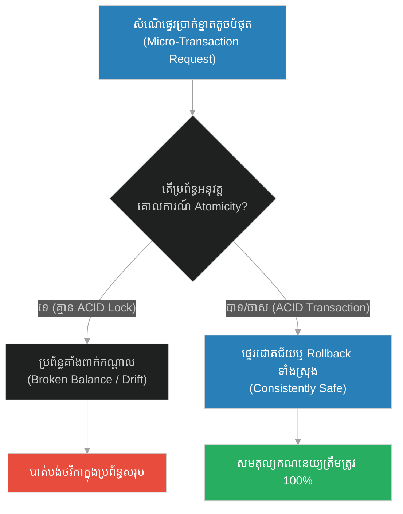
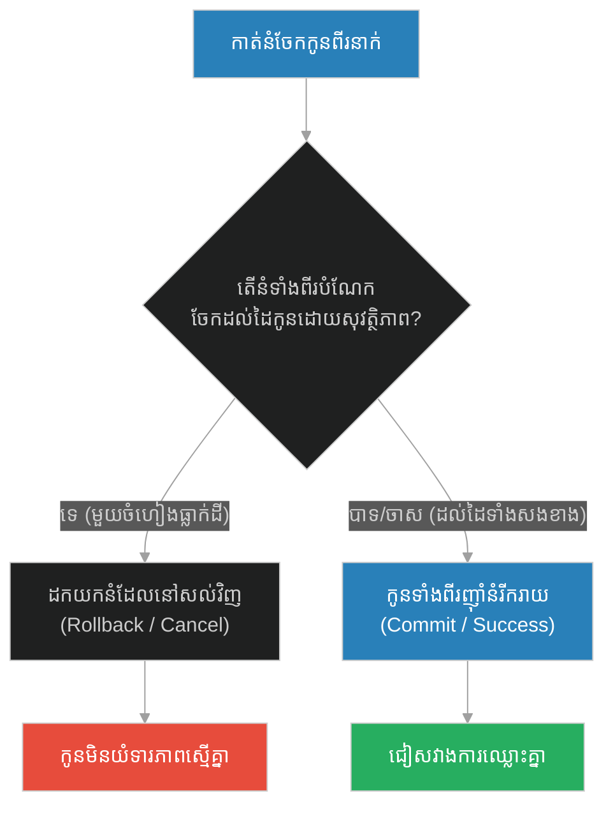
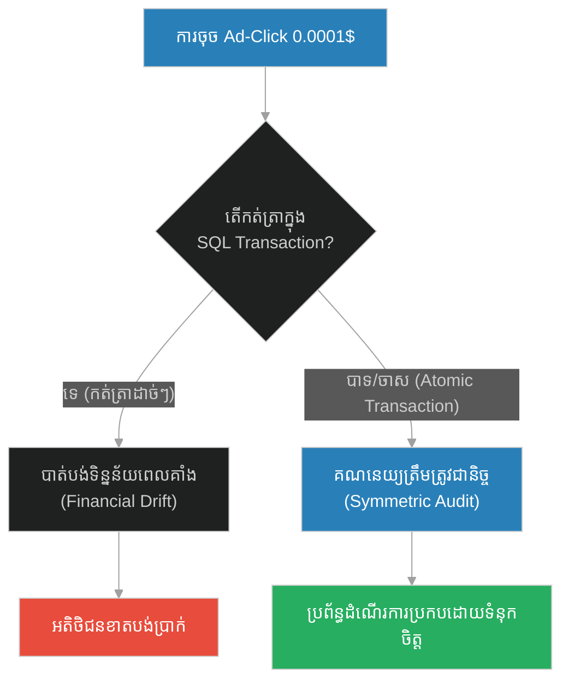
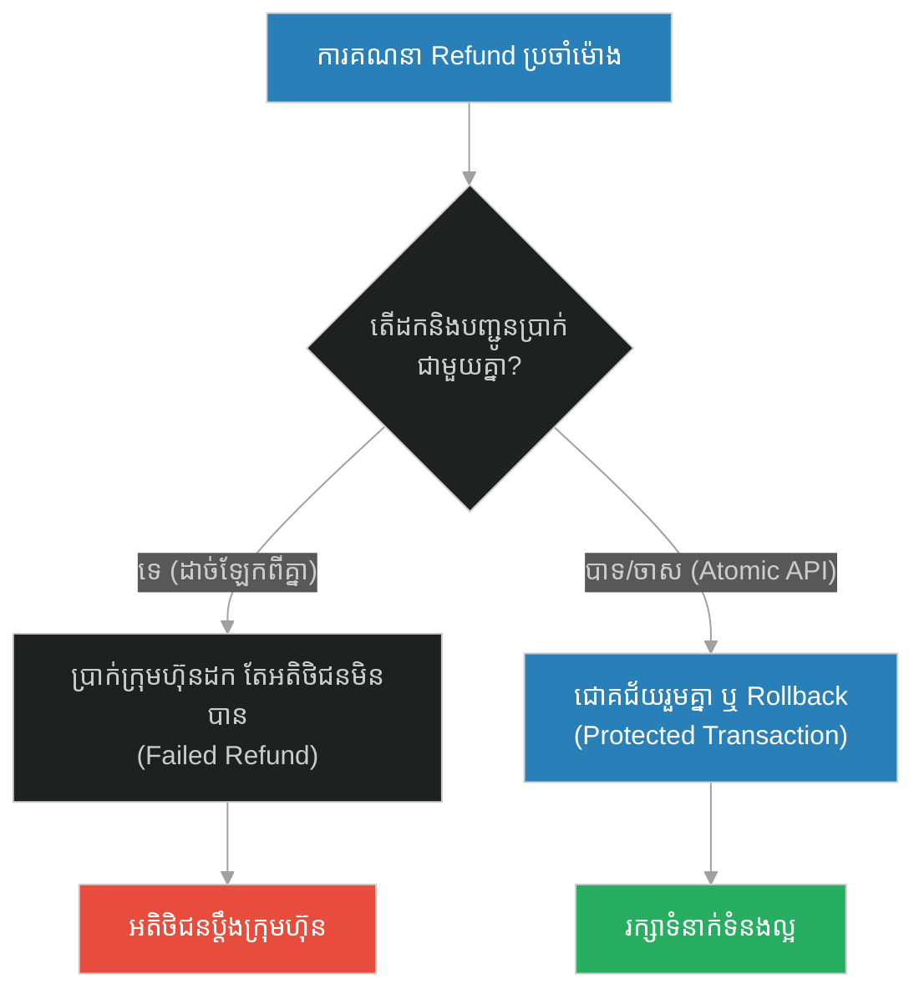
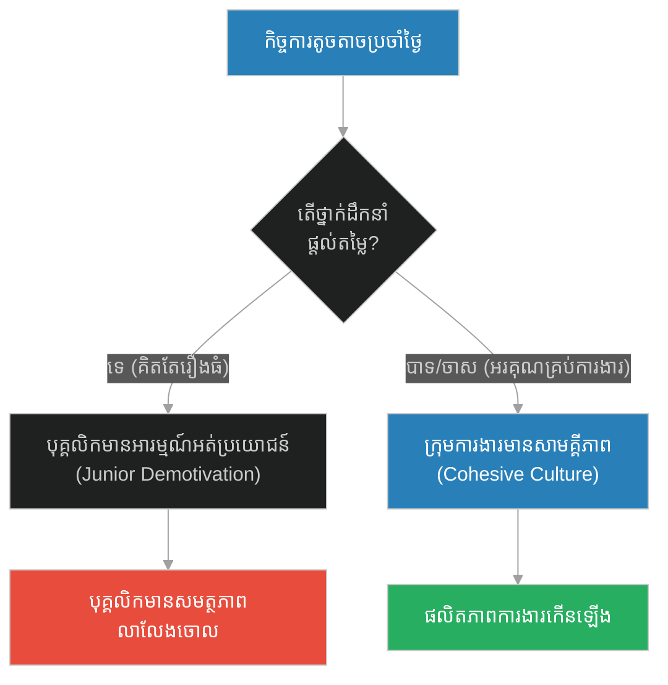
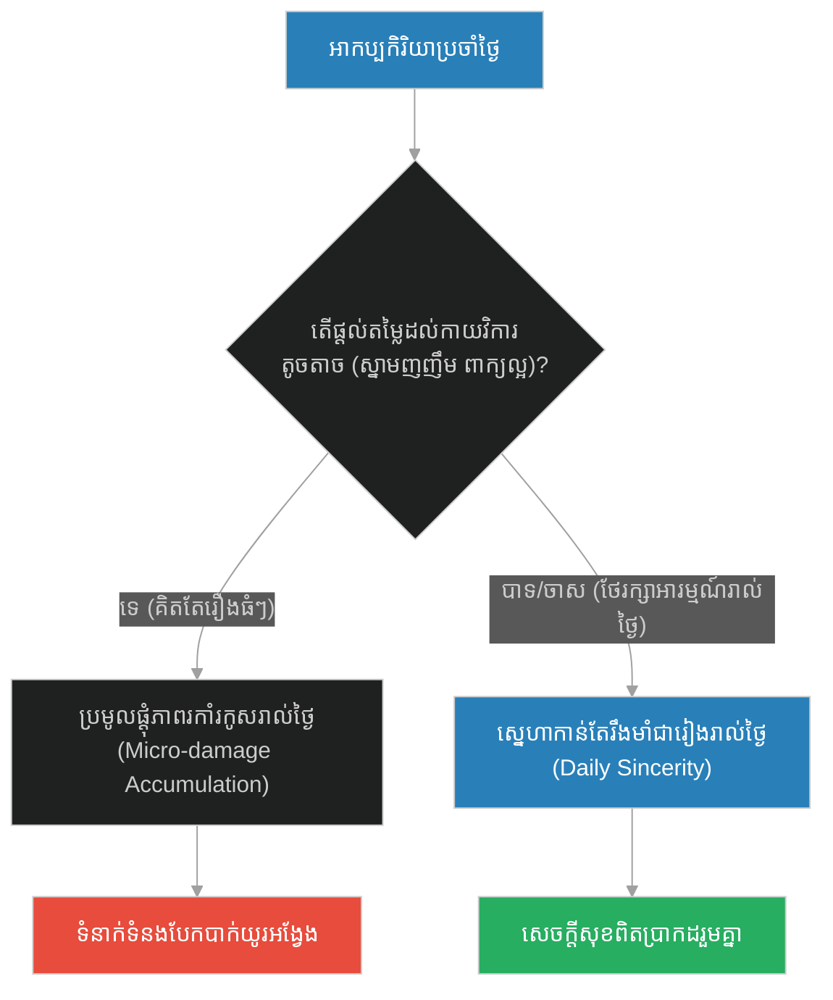
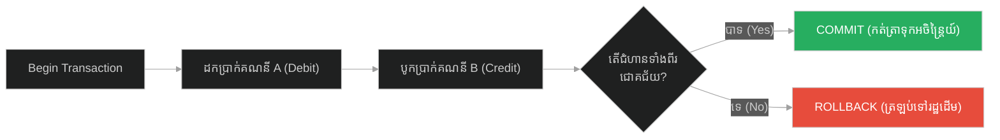

# Atomic Operations & Micro-Transactions (បរិច្ចាគផ្លែល្មើកន្លះគ្រាប់)៖ ប្រតិបត្តិការអាតូមិក និងការទូទាត់ខ្នាតតូចបំផុត (Atomic Operations & Micro-Transactions & Database Atomicity and Micro-payments Integrity & A Half Date in Charity)

**Author:** ichamrong  
**Date:** 2026-05-28  
**Tags:** #atomicity #acid-transactions #micro-transactions #database #concurrency  
**Category:** Concepts  
**Read Time:** ~15 min  

---

## 📌 មាតិកា (Table of Contents)
- [អន្ទាក់ផ្លូវចិត្ត (The Trap)](#0)
- [១. រឿងព្រេងនិទាន៖ បរិច្ចាគផ្លែល្មើកន្លះគ្រាប់ (The Legend of A Half Date in Charity)](#1)
  - [ទំហំនៃអំណោយ (The Size of the Gift)](#1-1)
- [២. បញ្ហា៖ Atomic Operations & Micro-Transactions (The Issue: Atomic Operations & Micro-Transactions)](#2)
- [៣. ឧទាហរណ៍ជាក់ស្តែងក្នុងពិភពពិត (Real World Examples)](#3)
  - [ឧទាហរណ៍ទី ១ — កម្រិតស្រាល (គ្រួសារ)៖ ការបែងចែកនំលាក់កំបាំង (The Shared Cookie Dispute)](#3-1)
  - [ឧទាហរណ៍ទី ២ — កម្រិតមធ្យម (បច្ចេកទេស)៖ ការទូទាត់ប្រាក់សម្រាប់លទ្ធផលផ្សាយពាណិជ្ជកម្ម (The Ad-Click Penny Drift)](#3-2)
  - [ឧទាហរណ៍ទី ៣ — កម្រិតមធ្យម (ធុរកិច្ច)៖ ការគណនាថ្លៃសេវាប្រចាំថ្ងៃសម្រាប់សមាជិកភាព (The Prorated Subscription Error)](#3-3)
  - [ឧទាហរណ៍ទី ៤ — កម្រិតមធ្យម (សង្គម/គ្រប់គ្រង)៖ ការមើលរំលងកិច្ចការតូចតាចរបស់បុគ្គលិក (The Junior Commit Neglect)](#3-4)
  - [ឧទាហរណ៍ទី ៥ — កម្រិតធ្ងន់ (ទំនាក់ទំនង)៖ ការធ្វេសប្រហែសលើកាយវិការតូចតាចប្រចាំថ្ងៃ (The Micro-Neglect Trap)](#3-5)
- [៤. ដំណោះស្រាយទូទៅ៖ ប្រតិបត្តិការ ACID និងការទូទាត់ប្រកបដោយសុវត្ថិភាព (The General Solution: ACID Transactions & Micro-ledger Isolation)](#4)
- [សេចក្តីសន្និដ្ឋាន (Conclusion)](#5)
- [ឯកសារយោង (References)](#6)
- [Related Posts](#7)

---

<a id="0"></a>
## អន្ទាក់ផ្លូវចិត្ត (The Trap)

នៅក្នុងប្រព័ន្ធទិន្នន័យ និងសីលធម៌នៃការរស់នៅ តើយើងងាយនឹងធ្វេសប្រហែស និងមើលរំលងប្រតិបត្តិការ "ខ្នាតតូច" (Micro-operations) ដោយគិតថាពួកវាមានតម្លៃតិចតួចពេក មិនចាំបាច់មានការការពារ ឬរៀបចំឱ្យបានត្រឹមត្រូវដែរឬទេ? នេះគឺជាអន្ទាក់នៃការបាត់បង់សុពលភាពទិន្នន័យ និងភាពមិនលំអៀង។

* **ការមើលរំលងរបស់តូច (Lax Transaction)** — អនុញ្ញាតឱ្យការទូទាត់កាក់តូចៗ ឬការសរសេរទិន្នន័យខ្លីៗដំណើរការដោយគ្មានសុវត្ថិភាព (គ្មាន Transaction Lock) ដែលបណ្តាលឱ្យទិន្នន័យលេចធ្លាយ និងមិនស្របគ្នា។
* **ភាពអាតូមិក (Atomic Integrity)** — ចាត់ទុកការផ្ទេរទិន្នន័យគ្រប់ទំហំ ទោះបីជាត្រឹមតែកន្លះកាក់ (ឬកន្លះគ្រាប់ល្មើ) ស្មើនឹងប្រតិបត្តិការលានដុល្លារ ដោយធានាថាវាត្រូវជោគជ័យទាំងអស់ ឬបរាជ័យទាំងអស់ (All-or-Nothing)។



1. **រឿងព្រេងនិទាន (The Legend)** — ព្យាការីម៉ូហាម៉ាត់ និងការបង្រៀនឱ្យការពារខ្លួនពីភ្លើងនរកទោះបីជាការធ្វើទានត្រឹមតែ "កន្លះគ្រាប់ល្មើ" ក៏ដោយ។
2. **បញ្ហា (The Issue)** — ការពន្យល់ពី Database Atomicity និងបញ្ហាកើតឡើងនៅពេលខ្វះ ACID properties លើ micro-payments។
3. **ឧទាហរណ៍ជាក់ស្តែង (Real World Examples)** — ករណីសិក្សាទាំង ៥ កម្រិត ពីការចែករំលែកនំ រហូតដល់ API Click Revenue Tracking។
4. **ដំណោះស្រាយទូទៅ (The General Solution)** — ការប្រើប្រាស់ Database Transaction Blocks និងយន្តការ Rollback។

---

<a id="1"></a>
## ១. រឿងព្រេងនិទាន៖ បរិច្ចាគផ្លែល្មើកន្លះគ្រាប់ (The Legend of A Half Date in Charity)

មនុស្សជាច្រើនគិតថា ការធ្វើទាន ឬការបរិច្ចាគ ទាល់តែមានលុយរាប់ពាន់ដុល្លារ ឬទាល់តែសាងសង់មន្ទីរពេទ្យ ទើបចាត់ទុកថាជាអំពើល្អដ៏ធំធេង និងទទួលបានបុណ្យច្រើន។ ដើម្បីលុបបំបាត់ការយល់ឃើញដ៏ខុសឆ្គងនេះ ព្យាការីម៉ូហាម៉ាត់បានបង្រៀនយ៉ាងសាមញ្ញថា៖ 

**"ចូរការពារខ្លួនអ្នករាល់គ្នាពីភ្លើងនរកចុះ (Save yourselves from Hellfire) ទោះបីជាត្រូវបរិច្ចាគត្រឹមតែ ផ្លែល្មើកន្លះគ្រាប់ (Half a Date) ក៏ដោយ!"**

<a id="1-1"></a>
### ទំហំនៃអំណោយ (The Size of the Gift)

លោកចង់បញ្ជាក់ថា ព្រះជាម្ចាស់មិនបានមើលទៅលើ "ចំនួនតួលេខ" នៃលុយដែលអ្នកបានផ្តល់ឱ្យនោះទេ ប៉ុន្តែទ្រង់មើលទៅលើ "ចេតនា និងទំហំនៃការលះបង់" របស់អ្នក។

ប្រសិនបើសេដ្ឋីម្នាក់ មានលុយមួយលានដុល្លារ ហើយគាត់បរិច្ចាគមួយម៉ឺនដុល្លារ (វាស្មើនឹង ១% ប៉ុណ្ណោះ)។ ប៉ុន្តែប្រសិនបើអ្នកក្រម្នាក់ មានផ្លែល្មើតែមួយគ្រាប់សម្រាប់ចម្អែតក្រពះខ្លួនឯង ហើយគាត់ហ៊ានកាត់វាពាក់កណ្តាល (៥០%) ទៅឱ្យអ្នកដែលកំពុងឃ្លានម្នាក់ទៀត ទង្វើនេះមានតម្លៃនិងទម្ងន់ធ្ងន់ធ្ងរជាងលុយមួយម៉ឺនដុល្លាររបស់សេដ្ឋីទៅទៀត នៅក្នុងក្រសែភ្នែករបស់សច្ចធម៌។

---

<a id="2"></a>
## ២. បញ្ហា៖ Atomic Operations & Micro-Transactions (The Issue: Atomic Operations & Micro-Transactions)

នៅក្នុងប្រព័ន្ធគ្រប់គ្រងមូលទិន្នន័យ (DBMS) **Atomicity (ភាពជាអាតូមិក)** ធានាថារាល់ប្រតិបត្តិការដែលរួមបញ្ចូលជំហានច្រើន (Multi-step Operations) ត្រូវតែដំណើរការជោគជ័យទាំងអស់ (Commit) ឬត្រូវរំសាយចោលទាំងអស់ (Rollback) ដោយមិនទុកឱ្យប្រព័ន្ធស្ថិតក្នុងស្ថានភាពមិនច្បាស់លាស់។ 

នៅក្នុងការទូទាត់ខ្នាតតូចបំផុត (Micro-transactions) ដូចជាការគិតលុយ 0.0001 សេន សម្រាប់រាល់ API requests កំហុសឆ្គងតូចៗដោយសារតែ **Race Conditions** ឬការអត់ធ្មត់ខ្ពស់ (Floating Point Rounding Errors) អាចបង្កើតឱ្យមានការលេចធ្លាយប្រាក់រាប់ម៉ឺនដុល្លារនៅក្នុងប្រព័ន្ធធំៗ។

កន្លះគ្រាប់ល្មើ ត្រូវតែចាត់ចែងដោយច្បាប់អាតូមិកដូចគ្នានឹងរទេះផ្លែឈើទាំងមូល។

### Code Example: Non-Atomic vs. Atomic Micro-Transactions

ខាងក្រោមនេះជាការប្រៀបធៀបក្នុងភាសា TypeScript រវាងប្រព័ន្ធទូទាត់ប្រាក់ខ្នាតតូចដែលមិនមានសុវត្ថិភាព និងប្រព័ន្ធធានាភាពអាតូមិក (ACID Transaction)។

```typescript
interface UserWallet {
  id: string;
  balance: number;
}

// ==========================================
// FRAGILE PATH: Non-Atomic Micro-Transaction
// ==========================================
class FragileLedger {
  public transferMicroAmount(sender: UserWallet, receiver: UserWallet, amount: number): void {
    console.log(`[Fragile Ledger] Attempting to transfer ${amount} USD...`);
    
    // Step 1: Deduct from sender
    sender.balance -= amount;
    
    // Simulate network error/crash middle-way
    if (amount === 0.0005) {
      console.error("[Fragile Ledger] CRITICAL ERROR: Network disconnected during credit!");
      // Transfer incomplete, money vanished!
      return; 
    }

    // Step 2: Credit receiver
    receiver.balance += amount;
    console.log("[Fragile Ledger] Transfer successful.");
  }
}

// ==========================================
// RESILIENT PATH: Atomic Transaction with Rollback
// ==========================================
class ResilientLedger {
  public transferMicroAmount(sender: UserWallet, receiver: UserWallet, amount: number): void {
    console.log(`\n[Resilient Ledger] Starting Atomic Transaction for ${amount} USD...`);
    
    // Save state before transaction (Create Savepoint)
    const senderInitialBalance = sender.balance;
    const receiverInitialBalance = receiver.balance;

    try {
      // Step 1: Debit sender
      sender.balance -= amount;

      // Step 2: Simulate crash condition
      if (amount === 0.0005) {
        throw new Error("Connection Interrupted during ledger write.");
      }

      // Step 3: Credit receiver
      receiver.balance += amount;
      console.log("[Resilient Ledger] COMMIT: Transaction succeeded.");
    } catch (e: any) {
      console.warn(`[Resilient Ledger] ROLLBACK: Failure detected: "${e.message}". Reverting balances...`);
      // Restore initial state (Ensure Atomicity: All or Nothing)
      sender.balance = senderInitialBalance;
      receiver.balance = receiverInitialBalance;
    }
  }
}

// Demonstration
const alice: UserWallet = { id: "Alice (Sender)", balance: 1.0000 };
const bob: UserWallet = { id: "Bob (Receiver)", balance: 0.0000 };

// 1. Run Fragile System (Money disappears)
const fragileLedger = new FragileLedger();
fragileLedger.transferMicroAmount(alice, bob, 0.0005);
console.log(`[Fragile End Balances] Alice: ${alice.balance}, Bob: ${bob.balance} (Total: ${alice.balance + bob.balance})`);

// Reset Balances
alice.balance = 1.0000;
bob.balance = 0.0000;

// 2. Run Resilient System (Balances preserved on error)
const resilientLedger = new ResilientLedger();
resilientLedger.transferMicroAmount(alice, bob, 0.0005);
console.log(`[Resilient End Balances] Alice: ${alice.balance}, Bob: ${bob.balance} (Total: ${alice.balance + bob.balance})`);
```

---

<a id="3"></a>
## ៣. ឧទាហរណ៍ជាក់ស្តែងក្នុងពិភពពិត (Real World Examples)

<a id="3-1"></a>
### ឧទាហរណ៍ទី ១ — កម្រិតស្រាល (គ្រួសារ)៖ ការបែងចែកនំលាក់កំបាំង (The Shared Cookie Dispute)
ឪពុកម្តាយដែលបែងចែកនំខូឃីតែមួយគ្រាប់ឱ្យកូនពីរនាក់ ដោយកាត់វាជាពីរចំណែកស្មើគ្នា ដើម្បីកុំឱ្យមានការឈ្លោះប្រកែកគ្នា (Atomic and Equal) ប៉ុន្តែប្រសិនបើចំណែកម្ខាងធ្លាក់ដី ពួកគេត្រូវលុបចោលការចែករំលែកនោះ រួចចាប់ផ្តើមកាត់នំថ្មីជំនួសវិញ (Rollback on failure)។



<a id="3-2"></a>
### ឧទាហរណ៍ទី ២ — កម្រិតមធ្យម (បច្ចេកទេស)៖ ការទូទាត់ប្រាក់សម្រាប់លទ្ធផលផ្សាយពាណិជ្ជកម្ម (The Ad-Click Penny Drift)
ប្រព័ន្ធតាមដានចំណូលនៃការចុចលីងផ្សាយពាណិជ្ជកម្ម (Ad-Click Aggregator) ដែលគិតប្រាក់ $0.0001 សម្រាប់រាល់ការចុច។ ប្រសិនបើប្រព័ន្ធកត់ត្រាចំនួនចុចចុះឡើង ប៉ុន្តែគាំងមិនបានសរសេរចូល Ledger វានឹងបង្កើតឱ្យមានភាពខុសគ្នាធំនៃប្រាក់ចំណូលរបស់អតិថិជន។



<a id="3-3"></a>
### ឧទាហរណ៍ទី ៣ — កម្រិតមធ្យម (ធុរកិច្ច)៖ ការគណនាថ្លៃសេវាប្រចាំថ្ងៃសម្រាប់សមាជិកភាព (The Prorated Subscription Error)
ក្រុមហ៊ុន SaaS មួយគណនាប្រាក់បង្វិលសងអតិថិជន (Prorated Refund) សម្រាប់រយៈពេល ៦ ម៉ោងចុងក្រោយនៃការឈប់ប្រើប្រាស់សេវា។ ប្រសិនបើប្រព័ន្ធគ្មានការធានាប្រតិបត្តិការអាតូមិក គណនេយ្យអាចនឹងដកប្រាក់ចេញពីគណនីក្រុមហ៊ុន ប៉ុន្តែមិនបានបញ្ជូនវាទៅដល់ធនាគាររបស់អតិថិជន។



<a id="3-4"></a>
### ឧទាហរណ៍ទី ៤ — កម្រិតមធ្យម (សង្គម/គ្រប់គ្រង)៖ ការមើលរំលងកិច្ចការតូចតាចរបស់បុគ្គលិក (The Junior Commit Neglect)
ប្រធាននាយកដ្ឋានម្នាក់ដែលយកចិត្តទុកដាក់តែលើគម្រោងធំៗរាប់លានដុល្លារ ប៉ុន្តែមិនធ្លាប់ដឹង ឬកោតសរសើរកិច្ចការតូចតាចរបស់បុគ្គលិកថ្នាក់ក្រោម (ដូចជាការជួយសម្រួលឯកសារ ឬការរៀបចំសម្ភារៈការិយាល័យ) ធ្វើឱ្យពួកគេបាក់ទឹកចិត្ត និងលាលែងពីការងារ។



<a id="3-5"></a>
### ឧទាហរណ៍ទី ៥ — កម្រិតធ្ងន់ (ទំនាក់ទំនង)៖ ការធ្វេសប្រហែសលើកាយវិការតូចតាចប្រចាំថ្ងៃ (The Micro-Neglect Trap)
គូជីវិតដែលផ្តោតការយកចិត្តទុកដាក់តែលើបុណ្យខួបកំណើត ឬការទិញកាដូថ្លៃៗឱ្យគ្នា ប៉ុន្តែធ្វេសប្រហែស និងប្រើពាក្យសម្តីអាក្រក់ៗដាក់គ្នារៀងរាល់ថ្ងៃ (Micro-neglect) ធ្វើឱ្យស្នេហាសាបរលាប និងបាក់បែកទៅវិញដោយមិនដឹងខ្លួន។



---

<a id="4"></a>
## ៤. ដំណោះស្រាយទូទៅ៖ ប្រតិបត្តិការ ACID និងការទូទាត់ប្រកបដោយសុវត្ថិភាព (The General Solution: ACID Transactions & Micro-ledger Isolation)

ដើម្បីធានាបាននូវសុពលភាពទិន្នន័យសម្រាប់គ្រប់ប្រតិបត្តិការ ទោះមានទំហំតូចប៉ុណ្ណាក៏ដោយ វិស្វករប្រព័ន្ធគួរតែអនុវត្តយន្តការដូចខាងក្រោម៖

1. **Enforce ACID Properties**: គ្រប់ការផ្ទេរថវិកា ឬការផ្លាស់ប្តូរទិន្នន័យ (State transition) ត្រូវតែប្រព្រឹត្តទៅក្នុងក្របខ័ណ្ឌ Transaction Block (ដូចជា SQL `BEGIN TRANSACTION` និង `COMMIT`) ដើម្បីធានាបាននូវភាពអាតូមិក។
2. **Decimal High-Precision Math**: ហាមប្រើប្រាស់ float ឬ double សម្រាប់គណនាលុយកាក់។ ត្រូវប្រើប្រាស់ប្រភេទ Decimal (ឬ BigInt សម្រាប់គណនាកាក់តូចៗ ដូចជា Satoshi ក្នុង Bitcoin) ដើម្បីជៀសវាងកំហុសឆ្គងនៃការបង្គត់ (Rounding Errors)។
3. **Optimistic Locking**: ប្រើប្រាស់លេខជំនាន់ (Version fields) លើទិន្នន័យគណនី ដើម្បីការពារ Race Conditions ក្នុងករណីមានសំណើខ្នាតតូចកើនឡើងខ្ពស់ក្នុងពេលតែមួយ។



---

<a id="5"></a>
## សេចក្តីសន្និដ្ឋាន (Conclusion)

> **«តម្លៃនៃទង្វើ ឬប្រតិបត្តិការទិន្នន័យ មិនឋិតនៅលើទំហំនៃបរិមាណខាងក្រៅរបស់វាឡើយ តែវាឋិតនៅលើភាពស្មោះត្រង់ និងភាពត្រឹមត្រូវដាច់ខាតនៃការអនុវត្តទង្វើនោះ។ ផ្លែល្មើកន្លះគ្រាប់ដែលផ្តល់ឱ្យដោយទឹកចិត្តបរិសុទ្ធ អាចសង្គ្រោះពិភពលោកទាំងមូលបាន។»**

ភាពល្អឥតខ្ចោះនៃប្រព័ន្ធព័ត៌មានវិទ្យា និងការរស់នៅ កើតចេញពីការយកចិត្តទុកដាក់ខ្ពស់ទៅលើព័ត៌មានលម្អិតខ្នាតតូចបំផុត។

---

<a id="6"></a>
## ឯកសារយោង (References)

*   **Charity of a Half Date Hadith (Sahih al-Bukhari 1417)** — Prophetic narration emphasizing that even the smallest size of good deed protects from ultimate doom when done with pure intention.
*   **ACID Database Transactions Standard Specification** — The foundational concept of relational database theory on transaction atomicity.
*   **The Bitcoin Whitepaper (2008)** — Discussing decentralized micro-transactions and validation systems without third-party institutions.

---

<a id="7"></a>
## Related Posts

* [[216-prophet-and-the-man-asking-for-money.md]](216-prophet-and-the-man-asking-for-money.md) — Dependency Injection & Self-Provisioning Infrastructure
* [[218-prophet-and-the-smile.md]](218-prophet-and-the-smile.md) — Zero-Cost Telemetry & Ambient System Signals

## 🐇 ធ្លាក់ចូលក្នុងរន្ធទន្សាយ (Enter the Rabbit Hole)
ដើម្បីស្វែងយល់បន្ថែមអំពី សញ្ញាសម្គាល់គ្មានថ្លៃ និងការផ្សាយសញ្ញាប្រព័ន្ធស្ងាត់ សូមបន្តដំណើរទៅកាន់៖

* 🚀 **[ចាប់ផ្តើមដំណើររុករក (Start the Journey) ➔ Zero-Cost Telemetry & Ambient System Signals (ស្នាមញញឹមគឺជាទាន)](./218-prophet-and-the-smile.md)**
