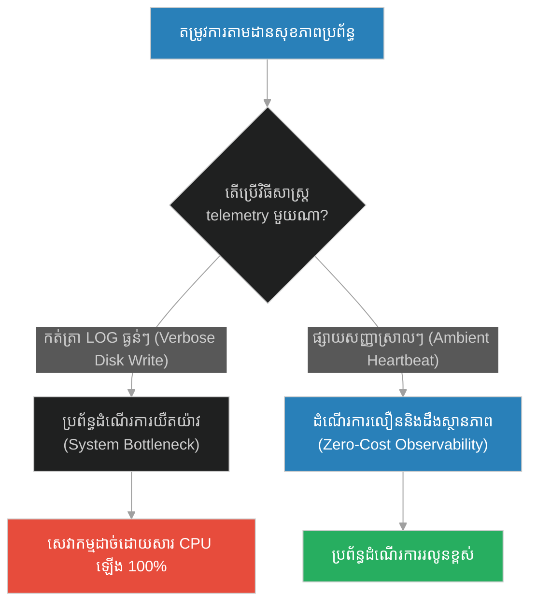
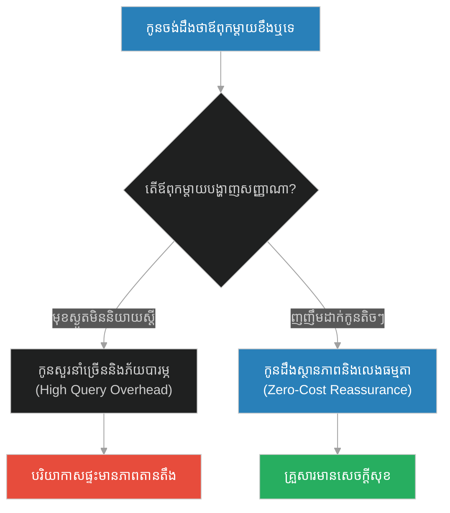
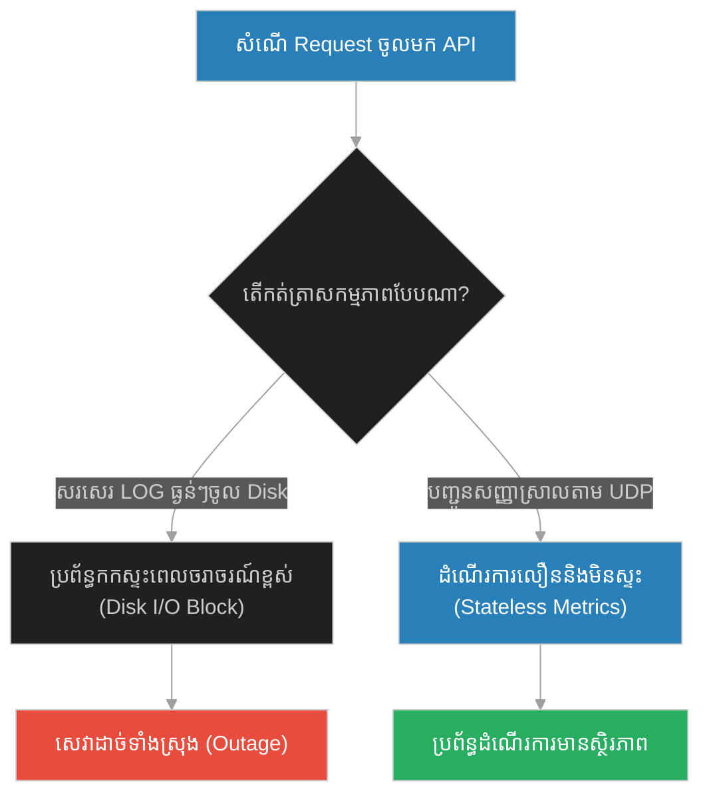
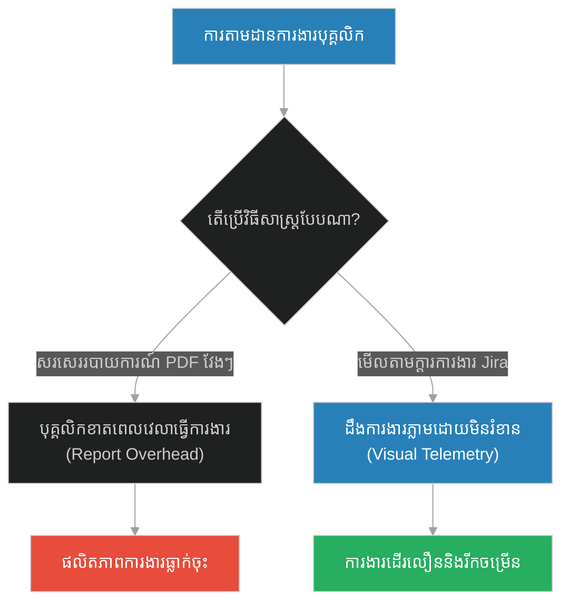
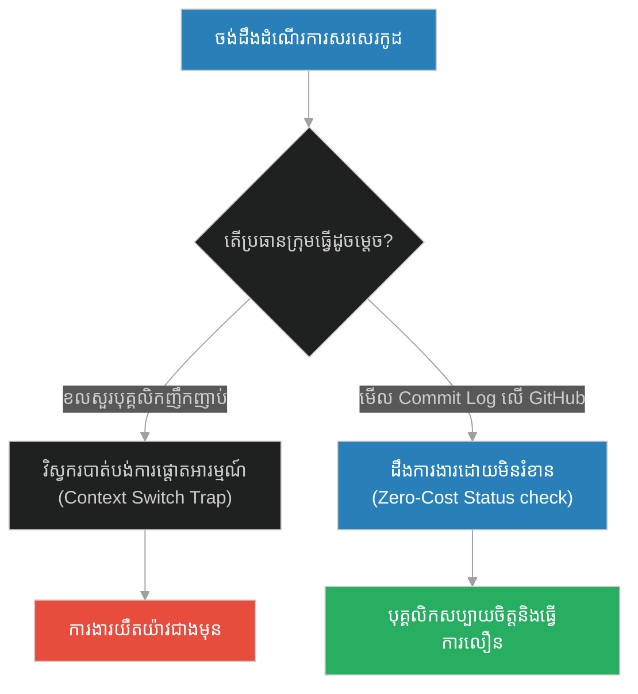
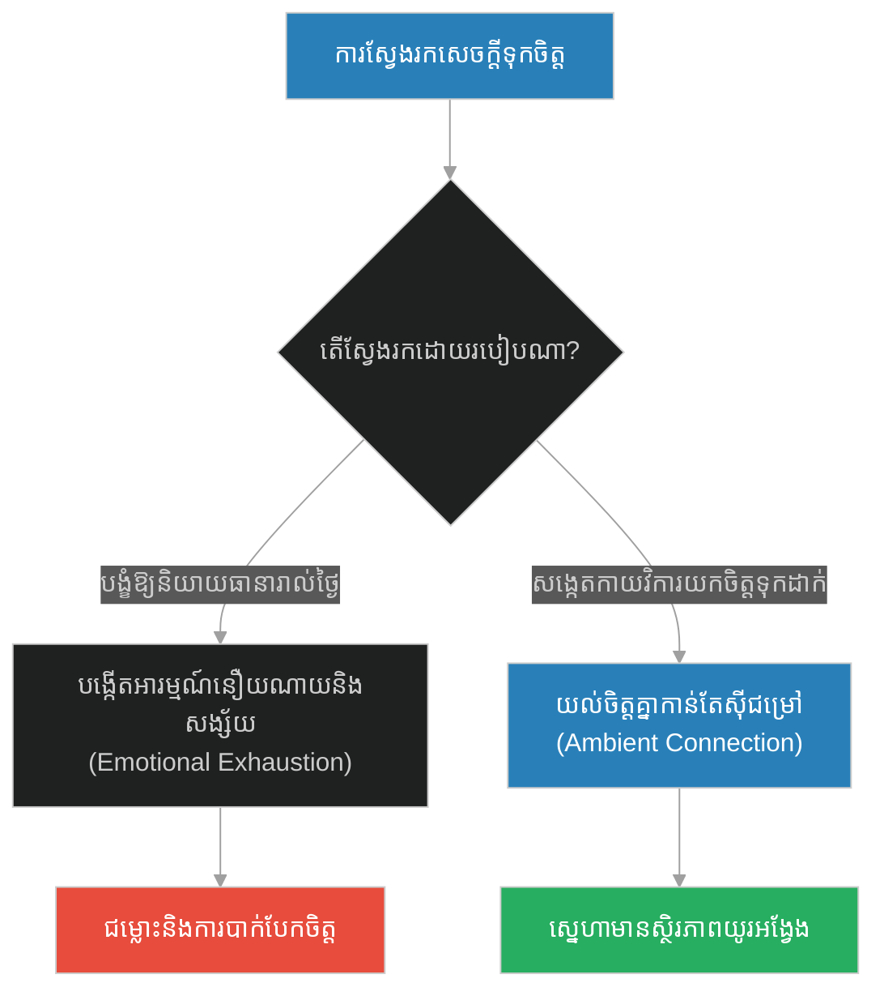
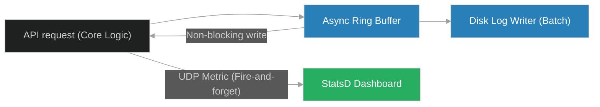

# Zero-Cost Telemetry & Ambient System Signals (ស្នាមញញឹមគឺជាទាន)៖ សញ្ញាសម្គាល់គ្មានថ្លៃ និងការផ្សាយសញ្ញាប្រព័ន្ធស្ងាត់ (Zero-Cost Telemetry & Ambient System Signals & Low-overhead Logging and Health Broadcasting & Smiling is Charity)

**Author:** ichamrong  
**Date:** 2026-05-28  
**Tags:** #telemetry #logging #low-overhead #metrics #observability  
**Category:** Concepts  
**Read Time:** ~15 min  

---

## 📌 មាតិកា (Table of Contents)
- [អន្ទាក់ផ្លូវចិត្ត (The Trap)](#0)
- [១. រឿងព្រេងនិទាន៖ ស្នាមញញឹមគឺជាទាន (The Legend of Smiling is Charity)](#1)
  - [ស្នាមញញឹមដ៏មានតម្លៃ (The Priceless Smile)](#1-1)
- [២. បញ្ហា៖ Zero-Cost Telemetry & Ambient System Signals (The Issue: Zero-Cost Telemetry & Ambient System Signals)](#2)
- [៣. ឧទាហរណ៍ជាក់ស្តែងក្នុងពិភពពិត (Real World Examples)](#3)
  - [ឧទាហរណ៍ទី ១ — កម្រិតស្រាល (គ្រួសារ)៖ សញ្ញាញញឹមរបស់ឪពុកម្តាយ (The Reassuring Smile)](#3-1)
  - [ឧទាហរណ៍ទី ២ — កម្រិតមធ្យម (បច្ចេកទេស)៖ ការកត់ត្រា LOG ធ្ងន់ៗក្នុង API (The Synchronous Disk I/O Bottleneck)](#3-2)
  - [ឧទាហរណ៍ទី ៣ — កម្រិតមធ្យម (ធុរកិច្ច)៖ របាយការណ៍ការងារប្រចាំសប្តាហ៍ និងការពិនិត្យស្ថានភាពរហ័ស (The Status Report Overload)](#3-3)
  - [ឧទាហរណ៍ទី ៤ — កម្រិតមធ្យម (សង្គម/គ្រប់គ្រង)៖ ការសាកសួរទូរស័ព្ទញឹកញាប់ និងការមើលក្តារការងារ (The Interruptive Micro-audit)](#3-4)
  - [ឧទាហរណ៍ទី ៥ — កម្រិតធ្ងន់ (ទំនាក់ទំនង)៖ ការសួររកសេចក្តីស្រឡាញ់ និងការយល់ចិត្តដោយស្ងាត់ (The Constant Verbal Assurance Trap)](#3-5)
- [៤. ដំណោះស្រាយទូទៅ៖ ការផ្សាយសញ្ញា Metric មិនទប់ស្កាត់ និង Heartbeats (The General Solution: Non-blocking UDP Metrics & Ambient Heartbeats)](#4)
- [សេចក្តីសន្និដ្ឋាន (Conclusion)](#5)
- [ឯកសារយោង (References)](#6)
- [Related Posts](#7)

---

<a id="0"></a>
## អន្ទាក់ផ្លូវចិត្ត (The Trap)

នៅក្នុងការឃ្លាំមើលប្រព័ន្ធ (System Monitoring) និងទំនាក់ទំនង តើយើងតែងតែចំណាយធនធានយ៉ាងច្រើនសន្ធឹកសន្ធាប់ និងបង្កការរំខានដល់ប្រតិបត្តិការស្នូល ដើម្បីគ្រាន់តែចង់ដឹងព័ត៌មានស្ថានភាព "ថាតើប្រព័ន្ធនៅរស់ ឬស្លាប់" ដែរឬទេ? នេះគឺជាអន្ទាក់នៃការប្រើប្រាស់ Telemetry ដែលមានតម្លៃថ្លៃ (High-Overhead Logging)។

* **ការវាស់ស្ទង់ទម្ងន់ធ្ងន់ (Verbose Audit)** — បង្ខំឱ្យប្រព័ន្ធ ឬមនុស្សចំណាយពេល និងកម្លាំងយ៉ាងច្រើនដើម្បីសរសេរ Log ឬរបាយការណ៍លម្អិតរាល់ពេលមានសកម្មភាពតូចមួយ ដែលនាំឱ្យប្រព័ន្ធដើរយឺត និងគាំង។
* **សញ្ញាគ្មានតម្លៃថ្លៃ (Ambient Signalling)** — ប្រើប្រាស់សញ្ញាសម្គាល់ស្រាលៗ (ដូចជា ស្នាមញញឹម ឬ UDP Heartbeat) ដែលមិនចំណាយធនធានអ្វីសោះ តែអាចបញ្ជាក់ភ្លាមៗថាប្រព័ន្ធកំពុងដំណើរការបានល្អ។



1. **រឿងព្រេងនិទាន (The Legend)** — ព្យាការីម៉ូហាម៉ាត់ និងការប្រកាសថា "ស្នាមញញឹមដាក់បងប្អូនរបស់អ្នក គឺជាទាន"។
2. **បញ្ហា (The Issue)** — ផលប៉ះពាល់នៃ Logging overhead និងតម្រូវការ Zero-Cost Telemetry ក្នុង Operating Systems។
3. **ឧទាហរណ៍ជាក់ស្តែង (Real World Examples)** — ករណីសិក្សាទាំង ៥ កម្រិត ពីអារម្មណ៍ក្នុងផ្ទះ រហូតដល់ API Performance metrics។
4. **ដំណោះស្រាយទូទៅ (The General Solution)** — ការប្រើប្រាស់ UDP (StatsD) និង Async Ring Buffers សម្រាប់ Logging។

---

<a id="1"></a>
## ១. រឿងព្រេងនិទាន៖ ស្នាមញញឹមគឺជាទាន (The Legend of Smiling is Charity)

នៅក្នុងសហគមន៍ សាសនាឥស្លាមតែងតែជំរុញឱ្យមនុស្សធ្វើសប្បុរសធម៌ (Charity/Sadaqah)។ ប៉ុន្តែ មានអ្នកសាវ័កក្រីក្រជាច្រើនមានការបារម្ភ ព្រោះពួកគេគ្មានប្រាក់កាក់សម្រាប់បរិច្ចាគឡើយ។ ពួកគេមានអារម្មណ៍ថា ខ្លួនគ្មានតម្លៃ និងមិនអាចជួយកសាងសង្គមបានដូចអ្នកមានឡើយ។

ដើម្បីដោះស្រាយក្តីបារម្ភនេះ និងបង្ហាញពីវិធីសាស្ត្រកសាងសហគមន៍ប្រកបដោយមេត្រីភាព ព្យាការីម៉ូហាម៉ាត់បានប្រកាសពាក្យស្លោកដ៏អស្ចារ្យមួយថា៖

**"ស្នាមញញឹមរបស់អ្នកដាក់បងប្អូនរបស់អ្នក (Your smiling in the face of your brother) គឺជា អំណោយទាន (Charity) មួយ!"**

<a id="1-1"></a>
### ស្នាមញញឹមដ៏មានតម្លៃ (The Priceless Smile)

លោកចង់បង្ហាញថា ការធ្វើទាន មិនមែនទាល់តែមានទ្រព្យសម្បត្តិស្តុកស្តម្ភនោះឡើយ។ ស្នាមញញឹម គឺជាសកម្មភាពមួយដែល៖
* **គ្មានថ្លៃដើម (Zero-Cost)** — វាមិនតម្រូវឱ្យអ្នកចំណាយប្រាក់សូម្បីតែមួយកាក់ ឬខាតបង់ថាមពលអ្វីឡើយ។
* **ផ្សាយសញ្ញាល្អ (Ambient Signal)** — វាជួយបញ្ជូនសញ្ញាភ្លាមៗទៅកាន់អ្នកដទៃថា៖ *"ខ្ញុំរាប់អានអ្នក ខ្ញុំគ្មានគំនិតអាក្រក់លើអ្នកទេ ហើយខ្ញុំនៅទីនេះដើម្បីគាំទ្រអ្នក។"*
* **កសាងសុខភាពសង្គម** — ស្នាមញញឹមដ៏សាមញ្ញមួយ អាចរំលាយភាពតានតឹង បង្កើតទំនុកចិត្ត និងពង្រឹងសាមគ្គីភាពក្នុងសហគមន៍ដោយមិនដឹងខ្លួន។

---

<a id="2"></a>
## ២. បញ្ហា៖ Zero-Cost Telemetry & Ambient System Signals (The Issue: Zero-Cost Telemetry & Ambient System Signals)

នៅក្នុងការរចនាប្រព័ន្ធព័ត៌មានវិទ្យា កំហុសឆ្គងដ៏ធំបំផុតមួយគឺការសរសេរ Log ច្រើនហួសហេតុ (Verbose Logging)។ រាល់ពេលដែលប្រព័ន្ធដំណើរការ Request វិស្វករបង្ខំឱ្យវាធ្វើសមកាលកម្មទិន្នន័យ (Synchronous Disk Write) ទៅកាន់ File System។ នេះបង្កើតឱ្យមាន **I/O Bottleneck** យ៉ាងធ្ងន់ធ្ងរ ដែលអាចធ្វើឱ្យ Application យឺតជាងមុនរហូតដល់ ១០ ដង។

ដើម្បីដោះស្រាយបញ្ហានេះ ប្រព័ន្ធទំនើបត្រូវអនុវត្ត **Zero-Cost Telemetry**។ ជំនួសឱ្យការកត់ត្រាព័ត៌មានលម្អិតធ្ងន់ៗ គេផ្សាយសញ្ញាស្រាលៗដូចជា **Heartbeat Signal** ឬ **UDP Metric Packet** (ដូចជា StatsD)។ សញ្ញាទាំងនេះប្រៀបដូចជា "ស្នាមញញឹម" ដែលមិនបង្អាក់ចរន្តការងាររបស់ Engine ស្នូលឡើយ តែអាចឱ្យប្រព័ន្ធឃ្លាំមើលដឹងថា Node នោះមានសុខភាពល្អ (Healthy)។

### Code Example: Heavy Logging vs. Zero-Cost Telemetry

ខាងក្រោមនេះជាការប្រៀបធៀបក្នុងភាសា TypeScript រវាងប្រព័ន្ធដែលមានការកត់ត្រា LOG ធ្ងន់ធ្ងរ (ទប់ស្កាត់ដំណើរការ) និងប្រព័ន្ធប្រើប្រាស់ Zero-Cost Telemetry។

```typescript
// ==========================================
// FRAGILE PATH: Heavy Synchronous Logging
// ==========================================
class FragileWorker {
  public async processRequest(requestId: string): Promise<void> {
    const startTime = Date.now();
    
    // Simulate main business logic work
    await this.sleep(5); 

    // Heavy Telemetry: Synchronous disk-write simulation (Blocking IO)
    console.log(`[Fragile Workers] REQUEST_AUDIT: ID=${requestId}, Time=${new Date().toISOString()}, CPU=Normal, Memory=OK, ThreadStatus=Active, DiskState=Clear, SessionValid=true, NetworkLatency=low, DBStatus=Connected`);
    
    const duration = Date.now() - startTime;
    console.log(`[Fragile Workers] Total processing time: ${duration}ms`);
  }

  private sleep(ms: number): Promise<void> {
    return new Promise(resolve => setTimeout(resolve, ms));
  }
}

// ==========================================
// RESILIENT PATH: Zero-Cost Async Telemetry (Ambient Smile)
// ==========================================
class ResilientWorker {
  // Simple atomic counter in-memory (No Disk Write overhead)
  private requestCount: number = 0;

  public async processRequest(requestId: string): Promise<void> {
    const startTime = Date.now();
    
    // Main business logic work
    await this.sleep(5); 

    // Zero-Cost Telemetry: Increment counter and send non-blocking metric (Fire-and-forget UDP)
    this.requestCount++;
    this.smileHeartbeat(); // Zero-cost ambient signal

    const duration = Date.now() - startTime;
    console.log(`[Resilient Workers] Processed in: ${duration}ms (Counters: ${this.requestCount})`);
  }

  private smileHeartbeat(): void {
    // Non-blocking fire-and-forget metrics update (like a smile)
    // In real systems, this sends a UDP packet to StatsD in micro-seconds
    setImmediate(() => {
      // Async emission
    });
  }

  private sleep(ms: number): Promise<void> {
    return new Promise(resolve => setTimeout(resolve, ms));
  }
}

// Demonstration
async function runDemo() {
  const fragile = new FragileWorker();
  const resilient = new ResilientWorker();

  console.log("--- Executing Fragile Worker (Heavy Telemetry) ---");
  await fragile.processRequest("req-101");
  await fragile.processRequest("req-102");

  console.log("\n--- Executing Resilient Worker (Zero-Cost Telemetry) ---");
  await resilient.processRequest("req-201");
  await resilient.processRequest("req-202");
}

runDemo();
```

---

<a id="3"></a>
## ៣. ឧទាហរណ៍ជាក់ស្តែងក្នុងពិភពពិត (Real World Examples)

<a id="3-1"></a>
### ឧទាហរណ៍ទី ១ — កម្រិតស្រាល (គ្រួសារ)៖ សញ្ញាញញឹមរបស់ឪពុកម្តាយ (The Reassuring Smile)
ឪពុកម្តាយដែលអង្គុយមុខស្ងួត ធ្វើឱ្យកូនៗមានអារម្មណ៍ភ័យខ្លាច និងត្រូវសួរនាំជារឿយៗថា *"តើប៉ាម៉ាក់ខឹងនឹងកូនមែនទេ?"* (High query overhead) ធៀបនឹង ឪពុកម្តាយដែលងាកមកមើលមុខកូន រួចញញឹមដាក់បន្តិច (Ambient Smile) ធ្វើឱ្យកូនៗដឹងភ្លាមថាពួកគេមានសុវត្ថិភាព និងលេងកម្សាន្តធម្មតា។



<a id="3-2"></a>
### ឧទាហរណ៍ទី ២ — កម្រិតមធ្យម (បច្ចេកទេស)៖ ការកត់ត្រា LOG ធ្ងន់ៗក្នុង API (The Synchronous Disk I/O Bottleneck)
API ដែលសរសេរ Logs រាល់ចំណុចលម្អិតទាំងអស់របស់ User request ទៅកាន់ local disk ធ្វើឱ្យ Disk ពេញ និងទប់ស្កាត់ដំណើរការ requests ផ្សេងទៀត ធៀបនឹង API ដែលគ្រាន់តែដំឡើង counter ក្នុង memory រួចបញ្ជូន metric តាម UDP (StatsD) ទៅកាន់ Server តាមដានដោយមិនទប់ស្កាត់ដំណើរការស្នូល។



<a id="3-3"></a>
### ឧទាហរណ៍ទី ៣ — កម្រិតមធ្យម (ធុរកិច្ច)៖ របាយការណ៍ការងារប្រចាំសប្តាហ៍ និងការពិនិត្យស្ថានភាពរហ័ស (The Status Report Overload)
ក្រុមហ៊ុនដែលតម្រូវឱ្យបុគ្គលិកចំណាយពេលកន្លះថ្ងៃរៀងរាល់ថ្ងៃសុក្រ ដើម្បីសរសេររបាយការណ៍ PDF លម្អិតពីការងារប្រចាំសប្តាហ៍ ធៀបនឹង ក្រុមហ៊ុនដែលប្រើប្រាស់ក្តារការងារឌីជីថល (Jira/Trello) និងការប្រជុំ Standup ខ្លី ១ នាទីជារៀងរាល់ព្រឹក (Ambient Sync)។



<a id="3-4"></a>
### ឧទាហរណ៍ទី ៤ — កម្រិតមធ្យម (សង្គម/គ្រប់គ្រង)៖ ការសាកសួរទូរស័ព្ទញឹកញាប់ និងការមើលក្តារការងារ (The Interruptive Micro-audit)
ប្រធានក្រុមការងារដែលខលទូរស័ព្ទសួរវិស្វកររៀងរាល់ ១ ម៉ោងម្តងថា *"តើកូដសរសេររួចរាល់ឬនៅ?"* បង្កការរំខានដល់ការផ្តោតអារម្មណ៍ការងារ ធៀបនឹង ប្រធានក្រុមដែលគ្រាន់តែមើល commit log លើ GitHub ឬ Slack Status ដើម្បីដឹងពីការវិវឌ្ឍន៍ការងារដោយស្ងប់ស្ងៀម។



<a id="3-5"></a>
### ឧទាហរណ៍ទី ៥ — កម្រិតធ្ងន់ (ទំនាក់ទំនង)៖ ការសួររកសេចក្តីស្រឡាញ់ និងការយល់ចិត្តដោយស្ងាត់ (The Constant Verbal Assurance Trap)
ដៃគូជីវិតដែលទាមទារឱ្យដៃគូម្ខាងទៀតនិយាយពាក្យ *"ស្រឡាញ់"* និង *"ស្មោះត្រង់"* រាប់សិបដងក្នុងមួយថ្ងៃ បង្កើតជាសម្ពាធផ្លូវចិត្ត ធៀបនឹង គូជីវិតដែលយល់ចិត្តគ្នា និងដឹងពីក្តីស្រឡាញ់តាមរយៈស្នាមញញឹម ការយកចិត្តទុកដាក់ និងកាយវិការស្រាលៗប្រចាំថ្ងៃ។



---

<a id="4"></a>
## ៤. ដំណោះស្រាយទូទៅ៖ ការផ្សាយសញ្ញា Metric មិនទប់ស្កាត់ និង Heartbeats (The General Solution: Non-blocking UDP Metrics & Ambient Heartbeats)

ដើម្បីទទួលបានការតាមដានប្រព័ន្ធដ៏ល្អប្រសើរដោយមិនប៉ះពាល់ដល់ការអនុវត្តការងារស្នូល វិស្វករប្រព័ន្ធគួរតែអនុវត្តយន្តការដូចខាងក្រោម៖

1. **Use UDP-Based Transport**: ប្រើប្រាស់ពិធីសារ UDP (ដូចជា StatsD) ជំនួសឱ្យ TCP សម្រាប់ការបញ្ជូន Metrics។ UDP ដំណើរការក្នុងលក្ខណៈ Fire-and-forget (ផ្ញើរួចបំភ្លេចចោល) មិនទប់ស្កាត់ដំណើរការ Engine ស្នូលឡើយ។
2. **Lightweight Ambient Heartbeats**: រៀបចំឱ្យរាល់ Node ទាំងអស់បញ្ជូន Packet ខ្លីបំផុត (Heartbeat: "200 OK") ទៅកាន់ Control Plane ជារៀងរាល់ ១០ វិនាទី ដើម្បីបញ្ជាក់ពីការរស់រានមានជីវិត (Liveness Probe)។
3. **Asynchronous Ring Buffers**: ប្រសិនបើត្រូវសរសេរ Logs ចូលក្នុង File System ត្រូវប្រើប្រាស់ប្រព័ន្ធ Async Logging (ដូចជា Winston ជាមួយ Transport Async ឬ Pino) ដែលប្រមូលផ្តុំ Log ក្នុង Memory Buffer រួចសរសេរចូល Disk ក្នុងពេលតែមួយ (Batch writing)។



---

<a id="5"></a>
## សេចក្តីសន្និដ្ឋាន (Conclusion)

> **«ស្នាមញញឹមគឺជាភាសាតែមួយគត់ ដែលមិនចំណាយប្រាក់សូម្បីតែមួយកាក់ ប៉ុន្តែវាមានអំណាចជួយសម្រាលការឈឺចាប់ និងបញ្ជាក់ពីភាពស្មោះត្រង់បានលឿនបំផុត។ ចូរឃ្លាំមើលប្រព័ន្ធ និងទំនាក់ទំនងដោយមិនបង្កើតការរំខាន។»**

ការតាមដានស្ថានភាពដោយស្ងាត់ និងសញ្ញាវិជ្ជមានសាមញ្ញ គឺជាគន្លឹះរក្សាភាពសុខសាន្ត និងស្ថិរភាពទាំងក្នុងវិស្វកម្មប្រព័ន្ធ និងទំនាក់ទំនងសង្គម។

---

<a id="6"></a>
## ឯកសារយោង (References)

*   **Smiling is Charity Hadith (Jami` at-Tirmidhi 1956)** — Prophetic validation of zero-cost interpersonal actions as valid social contributions (Sadaqah).
*   **StatsD Architecture: Etsy's Metrics Aggregator** — A case study on low-overhead distributed system observability using UDP.
*   **The 12-Factor App: Logs as Event Streams** — Decoupling applications from log-routing systems to reduce I/O overhead.

---

<a id="7"></a>
## Related Posts

* [[217-prophet-and-the-half-date.md]](217-prophet-and-the-half-date.md) — Atomic Operations & Micro-Transactions
* [[219-prophet-and-the-hypocrites.md]](219-prophet-and-the-hypocrites.md) — Fail-Secure Default State & Zero-Trust Verification

## 🐇 ធ្លាក់ចូលក្នុងរន្ធទន្សាយ (Enter the Rabbit Hole)
ដើម្បីស្វែងយល់បន្ថែមអំពី ស្ថានភាពការពារបរាជ័យ និងការផ្ទៀងផ្ទាត់គ្មានការទុកចិត្ត សូមបន្តដំណើរទៅកាន់៖

* 🚀 **[ចាប់ផ្តើមដំណើររុករក (Start the Journey) ➔ Fail-Secure Default State & Zero-Trust Verification (ការលាតត្រដាងលាក់ពុត)](./219-prophet-and-the-hypocrites.md)**
