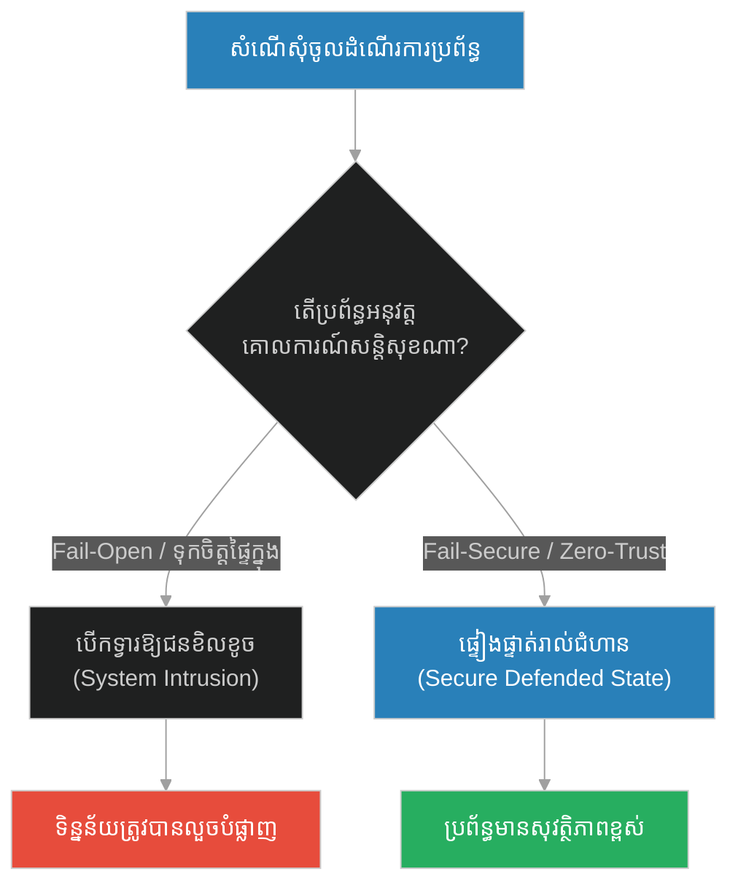
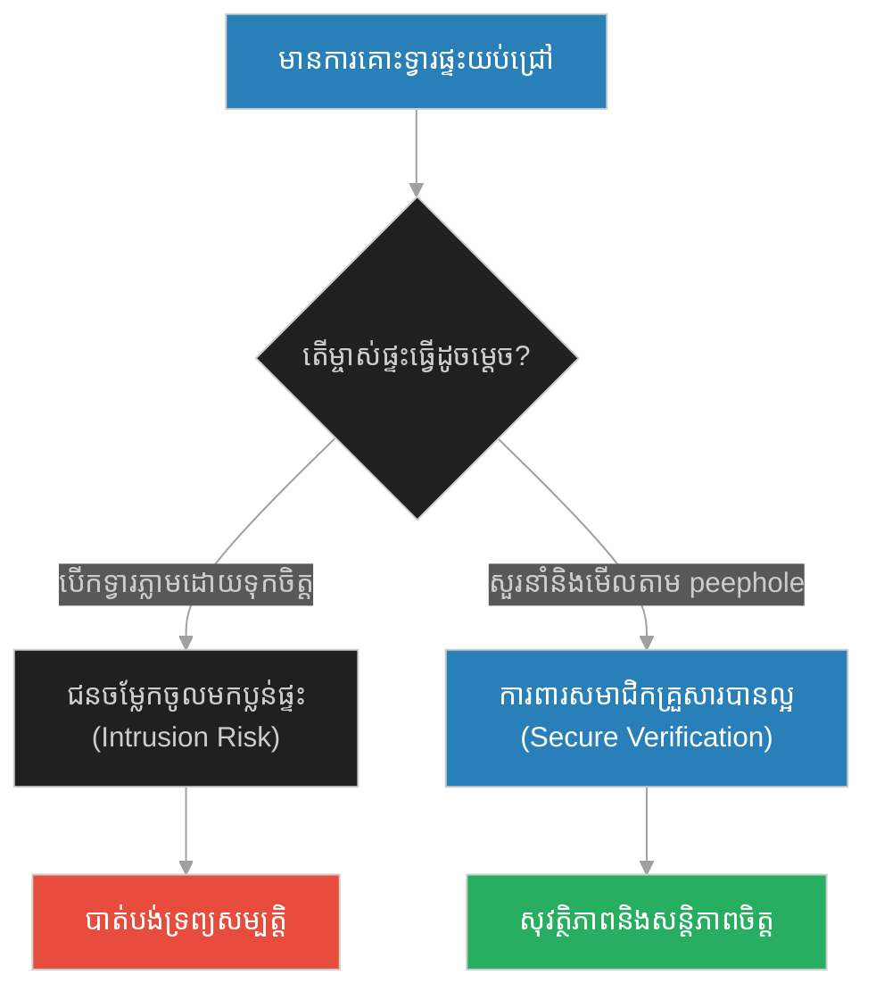
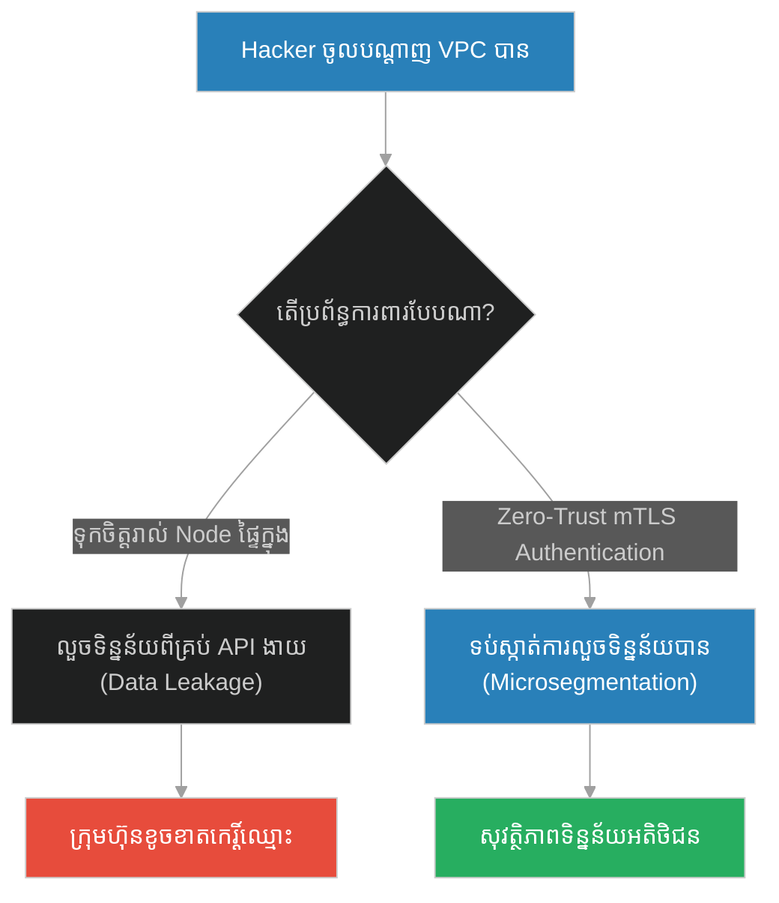
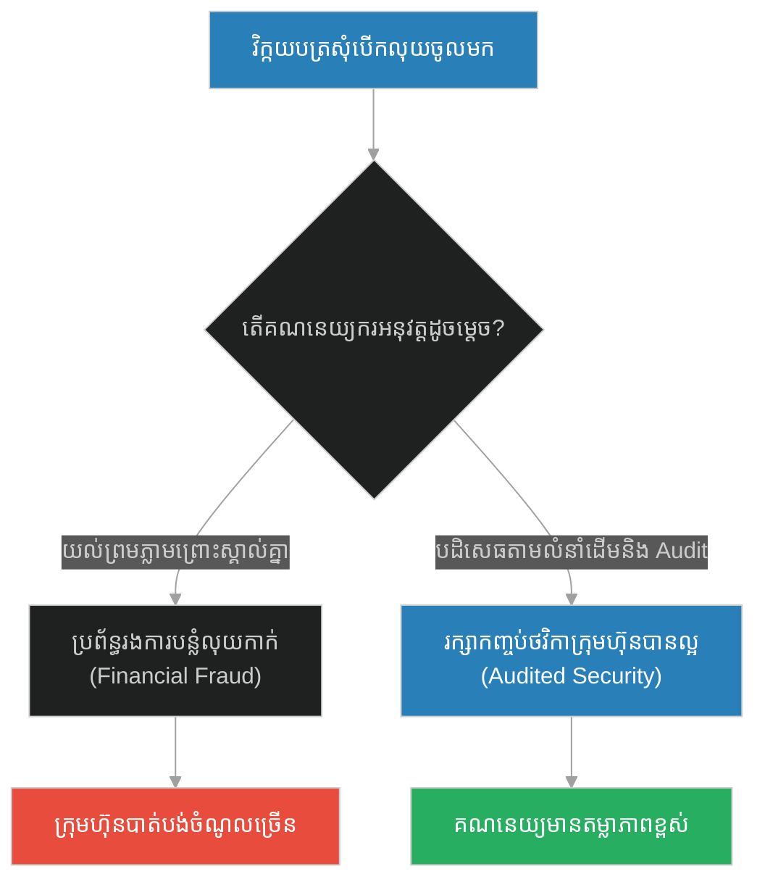
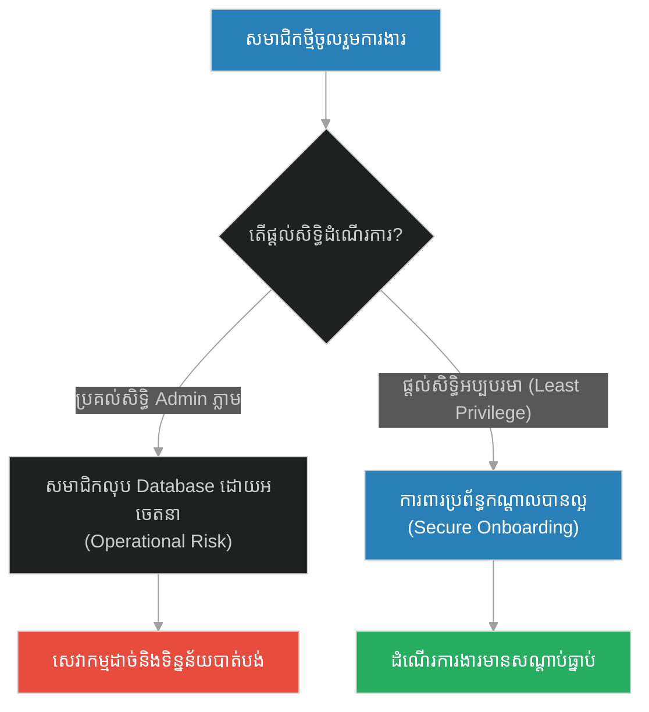
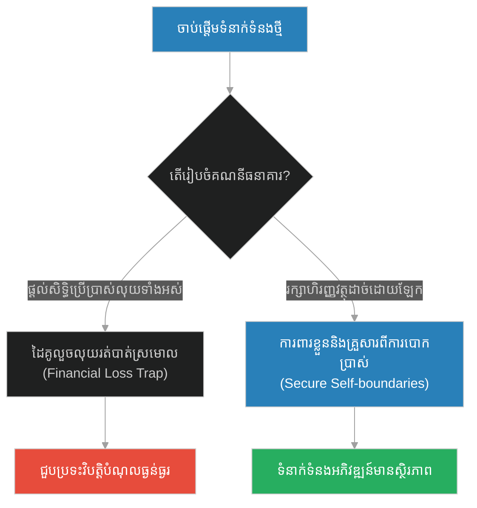
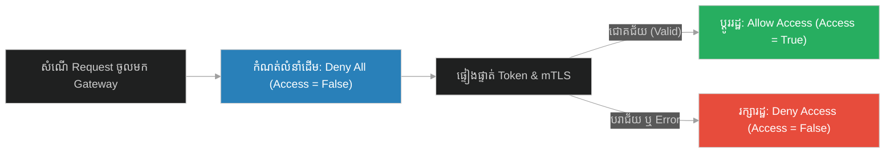

# Fail-Secure Default State & Zero-Trust Verification (ការលាតត្រដាងលាក់ពុត)៖ ស្ថានភាពការពារបរាជ័យ និងការផ្ទៀងផ្ទាត់គ្មានការទុកចិត្ត (Fail-Secure Default State & Zero-Trust Verification & Zero-Trust Architecture and Safe Defending Configurations & The Hypocrites Exposed)

**Author:** ichamrong  
**Date:** 2026-05-28  
**Tags:** #zero-trust #fail-secure #security #default-deny #least-privilege  
**Category:** Concepts  
**Read Time:** ~15 min  

---

## 📌 មាតិកា (Table of Contents)
- [អន្ទាក់ផ្លូវចិត្ត (The Trap)](#0)
- [១. រឿងព្រេងនិទាន៖ ការលាតត្រដាងលាក់ពុត (The Legend of The Hypocrites Exposed)](#1)
  - [ការដឹងគុណ និងសន្តិសុខ (Divine Warnings and Posture)](#1-1)
- [២. បញ្ហា៖ Fail-Secure Default State & Zero-Trust Verification (The Issue: Fail-Secure Default State & Zero-Trust Verification)](#2)
- [៣. ឧទាហរណ៍ជាក់ស្តែងក្នុងពិភពពិត (Real World Examples)](#3)
  - [ឧទាហរណ៍ទី ១ — កម្រិតស្រាល (គ្រួសារ)៖ ការចាក់សោរទ្វារផ្ទះពេលយប់ (The Locked Front Door)](#3-1)
  - [ឧទាហរណ៍ទី ២ — កម្រិតមធ្យម (បច្ចេកទេស)៖ ការអនុញ្ញាតចរាចរណ៍ក្នុងបណ្តាញផ្ទៃក្នុង (The Inner VPC Blind Trust)](#3-2)
  - [ឧទាហរណ៍ទី ៣ — កម្រិតមធ្យម (ធុរកិច្ច)៖ គោលការណ៍បើកទូទាត់សោហ៊ុយក្រុមហ៊ុន (The Invoice Audit Protocol)](#3-3)
  - [ឧទាហរណ៍ទី ៤ — កម្រិតមធ្យម (សង្គម/គ្រប់គ្រង)៖ ការប្រគល់សិទ្ធិគ្រប់គ្រង Server ដល់សមាជិកថ្មី (The Admin Access Handout)](#3-4)
  - [ឧទាហរណ៍ទី ៥ — កម្រិតធ្ងន់ (ទំនាក់ទំនង)៖ ការផ្តល់សិទ្ធិប្រើប្រាស់គណនីធនាគារដល់ដៃគូថ្មី (The Unverified Joint Account)](#3-5)
- [៤. ដំណោះស្រាយទូទៅ៖ ការបដិសេធតាមលំនាំដើម និងការផ្ទៀងផ្ទាត់គ្រប់ជំហាន (The General Solution: Default-Deny Posture & Mutual TLS Verification)](#4)
- [សេចក្តីសន្និដ្ឋាន (Conclusion)](#5)
- [ឯកសារយោង (References)](#6)
- [Related Posts](#7)

---

<a id="0"></a>
## អន្ទាក់ផ្លូវចិត្ត (The Trap)

នៅក្នុងប្រព័ន្ធសន្តិសុខ (Security Systems) និងទំនាក់ទំនងសង្គម តើយើងតែងតែសន្មត់ថា "ដោយសារតែវាស្ថិតនៅខាងក្នុង ឬមើលទៅគួរឱ្យទុកចិត្ត នោះគ្មានការគំរាមកំហែងទេ" (Fail-Open / Blind Trust) ដែរឬទេ? នេះគឺជាអន្ទាក់ដ៏គ្រោះថ្នាក់បំផុត ដែលអាចបណ្តាលឱ្យទិន្នន័យត្រូវលួច និងប្រព័ន្ធត្រូវដួលរលំ។

* **ការទុកចិត្តដោយងងឹតងងុល (Fail-Open Trust)** — អនុញ្ញាតឱ្យចរាចរណ៍ ឬមនុស្សចូលដំណើរការដោយស្វ័យប្រវត្តិតាមលំនាំដើម ប្រសិនបើប្រព័ន្ធត្រួតពិនិត្យសន្តិសុខជួបបញ្ហា ឬ Error។
* **គ្មានការទុកចិត្ត និងការការពារជានិច្ច (Zero-Trust / Fail-Secure)** — បដិសេធរាល់ការសុំចូលដំណើរការទាំងអស់តាមលំនាំដើម (Default-Deny) និងផ្ទៀងផ្ទាត់អត្តសញ្ញាណជានិច្ច ទោះបីជាសំណើនោះមកពីខាងក្នុងក៏ដោយ។



1. **រឿងព្រេងនិទាន (The Legend)** — ព្យាការីម៉ូហាម៉ាត់ និងការប្រឈមមុខជាមួយក្រុមលាក់ពុត (Munafiqeen) និងការសាងសង់វិហារ Masjid al-Dirar។
2. **បញ្ហា (The Issue)** — ការពន្យល់ពី Fail-Secure Default State និងគោលការណ៍ Zero-Trust Architecture (ZTA)។
3. **ឧទាហរណ៍ជាក់ស្តែង (Real World Examples)** — ករណីសិក្សាទាំង ៥ កម្រិត ពីការការពារផ្ទះរហូតដល់ API Microservices VPCs។
4. **ដំណោះស្រាយទូទៅ (The General Solution)** — ការអនុវត្ត Default-Deny, Least Privilege, និង Mutual TLS។

---

<a id="1"></a>
## ១. រឿងព្រេងនិទាន៖ ការលាតត្រដាងលាក់ពុត (The Legend of The Hypocrites Exposed)

ក្នុងអំឡុងពេលនៃការបង្កើតសហគមន៍នៅទីក្រុងម៉ាឌីណា ព្យាការីម៉ូហាម៉ាត់ មិនត្រឹមតែត្រូវប្រឈមមុខនឹងសត្រូវខាងក្រៅប៉ុណ្ណោះទេ ប៉ុន្តែលោកត្រូវដោះស្រាយបញ្ហាជាមួយ **"ក្រុមលាក់ពុត (Munafiqeen)"** នៅក្នុងសហគមន៍របស់លោកផ្ទាល់។ ពួកគេគឺជាមនុស្សដែលអះអាងខាងក្រៅថាជាអ្នកជឿ និងជាសមាជិកស្មោះត្រង់ ប៉ុន្តែនៅខាងក្នុង ពួកគេតែងតែសហការជាមួយសត្រូវ លួចផ្តល់ការសម្ងាត់ និងរង់ចាំបំផ្លាញសហគមន៍ពីខាងក្នុង។

ថ្ងៃមួយ ក្រុមលាក់ពុតទាំងនោះបានសាងសង់វិហារមួយឈ្មោះថា Masjid al-Dirar (វិហារបង្កគ្រោះថ្នាក់)។ ពួកគេបានអញ្ជើញព្យាការីម៉ូហាម៉ាត់ឱ្យទៅបន់ស្រន់នៅទីនោះ ដើម្បីទទួលបានការយល់ព្រមជាផ្លូវការ (ដូចជាការចុះឈ្មោះ Node ផ្លូវការ)។ ពួកគេបានអះអាងថា វាត្រូវបានសាងសង់ឡើងក្នុងគោលបំណងល្អ ដើម្បីជួយអ្នកទន់ខ្សោយ និងអ្នកក្រីក្រ។

<a id="1-1"></a>
### ការដឹងគុណ និងសន្តិសុខ (Divine Warnings and Posture)

ប៉ុន្តែ ព្រះជាម្ចាស់បានប្រទានព្រះបន្ទូលប្រាប់ព្យាការីម៉ូហាម៉ាត់ភ្លាមៗថា វិហារនោះមិនមែនសាងសង់ឡើងដោយការគោរពឡើយ ប៉ុន្តែវាជាមូលដ្ឋានលាក់កំបាំងសម្រាប់បំបែកសាមគ្គីភាព និងរៀបចំផែនការក្បត់ (Zero-Trust Alert)។

ព្រះជាម្ចាស់បានបញ្ជាលោកថា៖ **"កុំឈរនៅក្នុងវិហារនោះឱ្យសោះ ទោះបីជាក្នុងកាលៈទេសៈណាក៏ដោយ!"**

ព្យាការីម៉ូហាម៉ាត់ មិនបានទុកចិត្តលើ "ពាក្យសម្តីផ្អែមល្ហែមខាងក្រៅ" ឬ "ឋានៈជាសមាជិកក្នុងសហគមន៍" របស់ពួកគេឡើយ។ លោកបានបញ្ជាឱ្យវាយកម្ទេចវិហារនោះចោលភ្លាមៗ។ ចាប់ពីពេលនោះមក ទោះបីជាលោកដឹងពីឈ្មោះរបស់ក្រុមលាក់ពុតទាំងអស់តាមរយៈការបើកបង្ហាញពីព្រះជាម្ចាស់ លោកមិនបានបណ្តេញពួកគេចេញភ្លាមៗឡើយ ប៉ុន្តែលោកបានដំឡើងកម្រិតការពារសន្តិសុខជុំវិញខ្លួនជានិច្ច ដោយមិនអនុញ្ញាតឱ្យពួកគេដឹងពីការសម្ងាត់យោធា ឬទទួលបានមុខតំណែងសំខាន់ៗឡើយ។ លោកបានចាត់ទុកពួកគេជា **"វត្ថុមិនគួរទុកចិត្តតាមលំនាំដើម"**។

---

<a id="2"></a>
## ២. បញ្ហា៖ Fail-Secure Default State & Zero-Trust Verification (The Issue: Fail-Secure Default State & Zero-Trust Verification)

នៅក្នុងផ្នែកសន្តិសុខព័ត៌មានវិទ្យា (Cybersecurity) កំហុសដ៏ធំបំផុតមួយគឺស្ថាបត្យកម្ម **Fail-Open (បើកចំហពេលបរាជ័យ)**។ ប្រសិនបើប្រព័ន្ធកូដទាក់ទងនឹងសន្តិសុខ ជួបប្រទះបញ្ហា Connection timeout ឬ Error វានឹងអនុញ្ញាតឱ្យ Request ឆ្លងកាត់ដោយស្វ័យប្រវត្តិតាមលំនាំដើម ដោយសន្មត់ថា *"គ្មានបញ្ហាអ្វីទេ"*។

ផ្ទុយទៅវិញ គោលការណ៍ **Fail-Secure (សុវត្ថិភាពពេលបរាជ័យ)** ឬ **Zero-Trust (គ្មានការទុកចិត្ត)** កំណត់ថា៖
1. **Default-Deny**: សន្មត់ថារាល់សំណើទាំងអស់ គឺមានគ្រោះថ្នាក់ រហូតទាល់តែមានការផ្ទៀងផ្ទាត់ត្រឹមត្រូវ។ ប្រសិនបើប្រព័ន្ធផ្ទៀងផ្ទាត់ខូចខាត ឬ Error ត្រូវចាក់សោរ និងបដិសេធការចូលដំណើរការទាំងអស់ភ្លាមៗ។
2. **Never Trust, Always Verify**: ទោះបីជាសំណើនោះផ្ញើចេញពី microservice ផ្ទៃក្នុង ឬក្នុង VPC ដដែលក៏ដោយ ក៏ត្រូវតែមានការត្រួតពិនិត្យ Tokens និង TLS certificates គ្រប់ជំហាន។

### Code Example: Fail-Open vs. Fail-Secure Gateway

ខាងក្រោមនេះជាការប្រៀបធៀបក្នុងភាសា TypeScript រវាងប្រព័ន្ធ Gateway ដែលងាយរងគ្រោះ (Fail-Open) និងប្រព័ន្ធដែលមានសុវត្ថិភាពខ្ពស់ (Fail-Secure)។

```typescript
interface AccessRequest {
  clientId: string;
  authToken: string;
  isInternalNetwork: boolean;
}

// Mock of an Auth Service that can crash/timeout
class AuthenticationService {
  public async validateToken(token: string): Promise<boolean> {
    if (token === "EXPIRED_OR_BAD") return false;
    if (token === "CRASH_TRIGGER") {
      throw new Error("Database Connection Timeout!"); // Simulate Auth Service Down
    }
    return true;
  }
}

const authService = new AuthenticationService();

// ==========================================
// FRAGILE PATH: Fail-Open Gateway (Blind Trust)
// ==========================================
class FailOpenGateway {
  public async authorizeRequest(req: AccessRequest): Promise<boolean> {
    console.log(`[Fail-Open] Checking request for Client: ${req.clientId}`);
    
    // Blind Trust: If request comes from internal network, bypass auth check
    if (req.isInternalNetwork) {
      console.log("[Fail-Open] Request from internal network. Bypassing authorization (Trusting blind)...");
      return true;
    }

    try {
      const isValid = await authService.validateToken(req.authToken);
      return isValid;
    } catch (error) {
      // Fragile: Defaults to TRUE if the auth service fails, assuming system safety
      console.error(`[Fail-Open] Auth Service Error: "${error.message}". Allowing access as fallback!`);
      return true; 
    }
  }
}

// ==========================================
// RESILIENT PATH: Fail-Secure / Zero-Trust Gateway
// ==========================================
class FailSecureGateway {
  public async authorizeRequest(req: AccessRequest): Promise<boolean> {
    console.log(`\n[Zero-Trust] Evaluating request for Client: ${req.clientId}`);
    
    // Fail-Secure Default State: Access is denied until proven valid
    let allowAccess = false; 

    // Zero-Trust: Even if it's internal network, we DO NOT bypass authentication!
    try {
      const isValid = await authService.validateToken(req.authToken);
      if (isValid) {
        allowAccess = true;
      }
    } catch (error) {
      // Resilient: If auth service fails, remain in default secure state (Access Denied)
      console.warn(`[Zero-Trust] Auth Service Failed: "${error.message}". Keeping access BLOCKED.`);
      allowAccess = false; 
    }

    return allowAccess;
  }
}

// Demonstration
async function runDemo() {
  const badInternalRequest: AccessRequest = {
    clientId: "Internal-Spy-Node (Munafiq)",
    authToken: "EXPIRED_OR_BAD",
    isInternalNetwork: true
  };

  const crashTriggerRequest: AccessRequest = {
    clientId: "External-User",
    authToken: "CRASH_TRIGGER",
    isInternalNetwork: false
  };

  // 1. Run Fragile Gateway
  const fragile = new FailOpenGateway();
  console.log("--- Fragile System (Fail-Open) ---");
  const result1 = await fragile.authorizeRequest(badInternalRequest);
  console.log(`Access Granted? ${result1}`); // True (Security breached!)
  const result2 = await fragile.authorizeRequest(crashTriggerRequest);
  console.log(`Access Granted? ${result2}`); // True (Bypassed during service crash!)

  // 2. Run Resilient Gateway
  const resilient = new FailSecureGateway();
  console.log("\n--- Resilient System (Fail-Secure / Zero-Trust) ---");
  const result3 = await resilient.authorizeRequest(badInternalRequest);
  console.log(`Access Granted? ${result3}`); // False (Blocked!)
  const result4 = await resilient.authorizeRequest(crashTriggerRequest);
  console.log(`Access Granted? ${result4}`); // False (Blocked safely!)
}

runDemo();
```

---

<a id="3"></a>
## ៣. ឧទាហរណ៍ជាក់ស្តែងក្នុងពិភពពិត (Real World Examples)

<a id="3-1"></a>
### ឧទាហរណ៍ទី ១ — កម្រិតស្រាល (គ្រួសារ)៖ ការចាក់សោរទ្វារផ្ទះពេលយប់ (The Locked Front Door)
ការទុកទ្វារផ្ទះចោលមិនចាក់សោរនៅពេលយប់ ដោយគិតថា *"យើងរស់នៅក្នុងសង្កាត់ដែលមានសុវត្ថិភាព គ្មានចោរមកលួចទេ"* (Fail-Open / Blind Trust) ធៀបនឹង ការចាក់សោរទ្វារផ្ទះជានិច្ច និងមើលតាមកាមេរ៉ាសុវត្ថិភាពមុនពេលបើកទ្វារឱ្យនរណាម្នាក់ (Zero-Trust)។



<a id="3-2"></a>
### ឧទាហរណ៍ទី ២ — កម្រិតមធ្យម (បច្ចេកទេស)៖ ការអនុញ្ញាតចរាចរណ៍ក្នុងបណ្តាញផ្ទៃក្នុង (The Inner VPC Blind Trust)
ប្រព័ន្ធ Microservices នៅក្នុងក្រុមហ៊ុនបច្ចេកវិទ្យាមួយ ដែលអនុញ្ញាតឱ្យរាល់ APIs ទាំងអស់ប្រាស្រ័យទាក់ទងគ្នាដោយមិនបាច់ប្រើ Token ឬ SSL encryption ដោយសន្មត់ថា *"ពួកវាស្ថិតនៅក្នុងបណ្តាញផ្ទៃក្នុង VPC តែមួយ"* ធៀបនឹង ស្ថាបត្យកម្ម Zero-Trust ដែលតម្រូវឱ្យមាន mTLS (Mutual TLS) សម្រាប់រាល់ការផ្លាស់ប្តូរទិន្នន័យ។



<a id="3-3"></a>
### ឧទាហរណ៍ទី ៣ — កម្រិតមធ្យម (ធុរកិច្ច)៖ គោលការណ៍បើកទូទាត់សោហ៊ុយក្រុមហ៊ុន (The Invoice Audit Protocol)
គណនេយ្យករម្នាក់ ដែលយល់ព្រមទូទាត់ប្រាក់ភ្លាមៗរាល់ពេលទទួលបានវិក្កយបត្រសុំបើកលុយពីបុគ្គលិកជាន់ខ្ពស់ ដោយមិនបានត្រួតពិនិត្យវិក្កយបត្រ និងការអនុម័តច្បាស់លាស់ ធៀបនឹង ប្រព័ន្ធទូទាត់ប្រាក់ដែលចាក់សោរ និងច្រានចោលការទូទាត់ទាំងអស់តាមលំនាំដើម រហូតដល់មានភស្តុតាង និងការផ្ទៀងផ្ទាត់ពីរដង (Dual-Authorization)។



<a id="3-4"></a>
### ឧទាហរណ៍ទី ៤ — កម្រិតមធ្យម (សង្គម/គ្រប់គ្រង)៖ ការប្រគល់សិទ្ធិគ្រប់គ្រង Server ដល់សមាជិកថ្មី (The Admin Access Handout)
ប្រធានក្រុមការងារ ដែលផ្តល់ Username និង Password កម្រិត Admin របស់ Production Server ទៅឱ្យសមាជិកថ្មីដែលទើបចូលធ្វើការបានមួយថ្ងៃ ដោយគិតថា *"ពួកគេជាមនុស្សល្អ គ្មានបញ្ហាទេ"* ធៀបនឹង ការអនុវត្តគោលការណ៍សិទ្ធិអប្បបរមា (Least Privilege) ដោយផ្តល់ឱ្យសមាជិកថ្មីត្រឹមតែសិទ្ធិអាន (Read-Only) បណ្តោះអាសន្ន។



<a id="3-5"></a>
### ឧទាហរណ៍ទី ៥ — កម្រិតធ្ងន់ (ទំនាក់ទំនង)៖ ការផ្តល់សិទ្ធិប្រើប្រាស់គណនីធនាគារដល់ដៃគូថ្មី (The Unverified Joint Account)
ការប្រគល់កាតឥណទាន និងសិទ្ធិចាត់ចែងគណនីធនាគារទាំងអស់របស់ខ្លួនទៅឱ្យដៃគូស្នេហាថ្មីដែលទើបស្គាល់គ្នាក្នុងបណ្តាញសង្គមបានមួយសប្តាហ៍ ដោយសារតែការលង់នឹងសម្តីផ្អែមល្ហែម ធៀបនឹង ការរក្សាហិរញ្ញវត្ថុដាច់ឡែកពីគ្នា និងស្វែងយល់អត្តសញ្ញាណគ្នាឱ្យបានច្បាស់លាស់ជាមុនសិន។



---

<a id="4"></a>
## ៤. ដំណោះស្រាយទូទៅ៖ ការបដិសេធតាមលំនាំដើម និងការផ្ទៀងផ្ទាត់គ្រប់ជំហាន (The General Solution: Default-Deny Posture & Mutual TLS Verification)

ដើម្បីការពារប្រព័ន្ធពីការគំរាមកំហែងទាំងខាងក្រៅ និងខាងក្នុង វិស្វករប្រព័ន្ធគួរតែអនុវត្តយន្តការដូចខាងក្រោម៖

1. **Default-Deny Configuration**: រាល់ Firewall Rule, Access Control List (ACL), និង API Route ត្រូវតែកំណត់លំនាំដើមជា **Deny All** (បដិសេធទាំងអស់)។ សិទ្ធិចូលដំណើរការត្រូវតែបើកដោយចំហ និងដោយឡែកសម្រាប់តែសេវាកម្មដែលត្រូវបានអនុញ្ញាតជាផ្លូវការប៉ុណ្ណោះ។
2. **Mutual TLS (mTLS) for microservices**: បង្ខំឱ្យរាល់ microservice ទាំងអស់ផ្ទៀងផ្ទាត់គ្នាទៅវិញទៅមកដោយប្រើប្រាស់ cryptographic certificates។ គ្មាន service ណាអាចជឿទុកចិត្ត service ណាផ្សេងទៀតដោយគ្រាន់តែផ្អែកលើ IP Address ឡើយ។
3. **Fail-Secure Code Patterns**: ក្នុងកូដ authorization ជានិច្ចកាលត្រូវប្រកាសអថេរ `authorized = false` នៅដើម subroutine។ មានតែពេលដែលការត្រួតពិនិត្យសុពលភាពជោគជ័យពេញលេញប៉ុណ្ណោះ ទើបប្តូរវាទៅជា `true`។ ប្រសិនបើមាន exception កើតឡើង ស្ថានភាពនឹងត្រឡប់ទៅជា `false` វិញដោយស្វ័យប្រវត្តិ។



---

<a id="5"></a>
## សេចក្តីសន្និដ្ឋាន (Conclusion)

> **«កុំជឿទុកចិត្តលើសម្បកខាងក្រៅ ឬពាក្យសម្តីផ្អែមល្ហែមដោយគ្មានការផ្ទៀងផ្ទាត់ឡើយ។ សន្តិសុខនិងភាពធន់ពិតប្រាកដ កើតចេញពីការបដិសេធភាពលម្អៀង និងការអនុវត្តច្បាប់ការពារយ៉ាងតឹងរ៉ឹងចំពោះគ្រប់សំណើទាំងអស់។»**

ការរក្សាជំហរមិនទុកចិត្តតាមលំនាំដើម (Zero-Trust Posture) មិនមែនជាការស្អប់ខ្ពើមគ្នានោះទេ ប៉ុន្តែវាជាយន្តការឆ្លាតវៃបំផុតក្នុងការរក្សាសុវត្ថិភាព និងនិរន្តរភាពរបស់សហគមន៍ និងប្រព័ន្ធបច្ចេកវិទ្យា។

---

<a id="6"></a>
## ឯកសារយោង (References)

*   **Surah At-Tawbah (Quran 9:107-108)** — The historical Quranic revelation addressing the plot of Masjid al-Dirar and establishing the principle of not accepting actions with deceptive intents.
*   **NIST Special Publication 800-207: Zero Trust Architecture** — The authoritative standard for enterprise security framework planning without implicit trust.
*   **Fail-Safe and Fail-Secure Design Principles** — System engineering principles for building robust failure response architectures.

---

<a id="7"></a>
## Related Posts

* [[218-prophet-and-the-smile.md]](218-prophet-and-the-smile.md) — Zero-Cost Telemetry & Ambient System Signals
* [[220-prophet-and-the-final-sermon.md]](220-prophet-and-the-final-sermon.md) — Protocol Standardization & Universal Interfaces

## 🐇 ធ្លាក់ចូលក្នុងរន្ធទន្សាយ (Enter the Rabbit Hole)
ដើម្បីស្វែងយល់បន្ថែមអំពី ការធ្វើស្តង់ដារពិធីការ និងចំណុចប្រទាក់សកល សូមបន្តដំណើរទៅកាន់៖

* 🚀 **[ចាប់ផ្តើមដំណើររុករក (Start the Journey) ➔ Protocol Standardization & Universal Interfaces (ធម្មទេសនាចុងក្រោយ)៖ ការធ្វើស្តង់ដារពិធីការ និងចំណុចប្រទាក់សកល](./220-prophet-and-the-final-sermon.md)**

