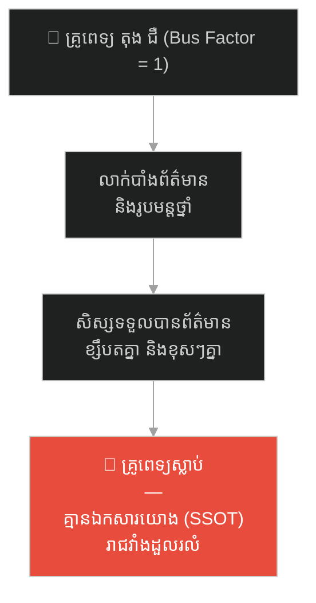
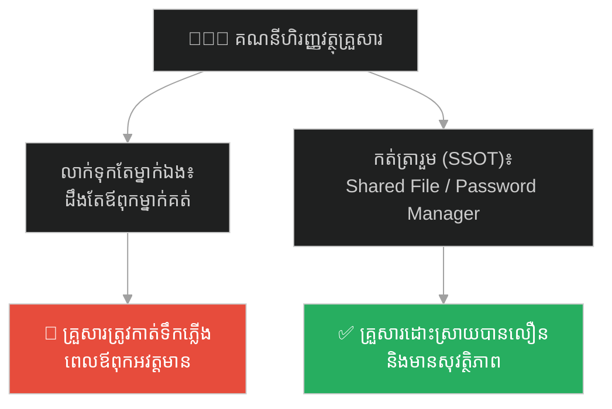
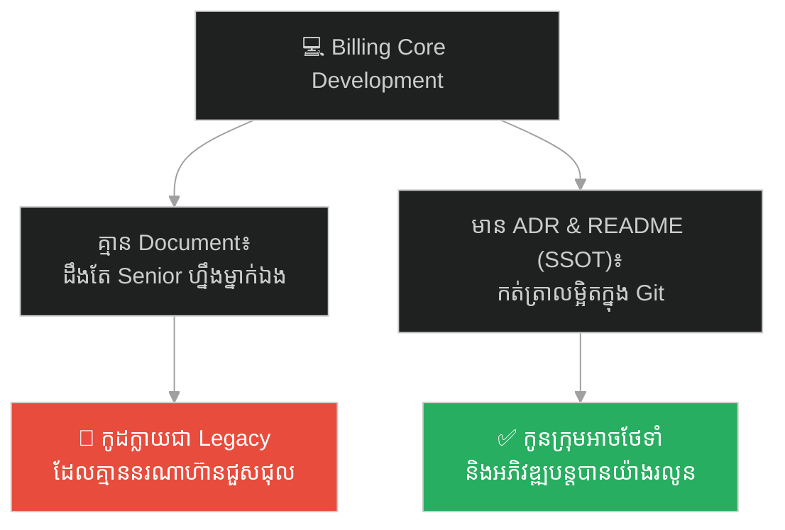
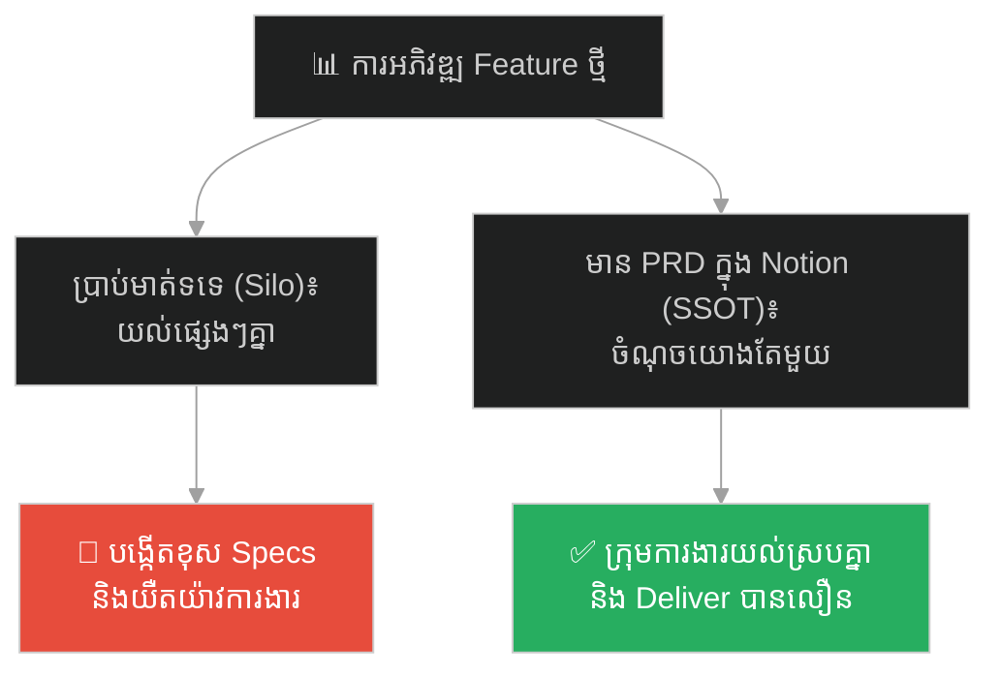
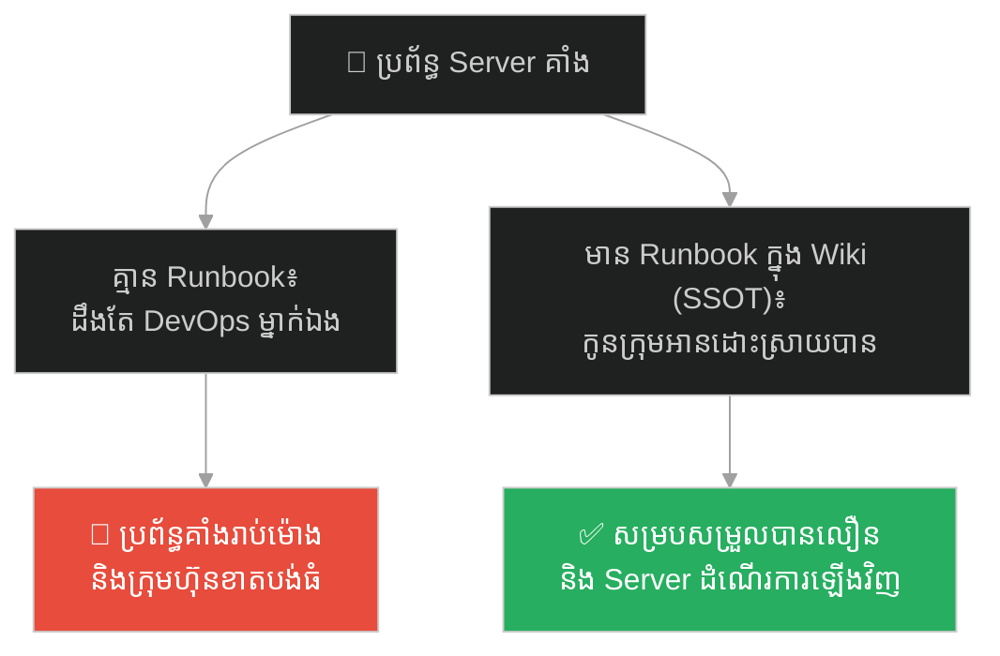
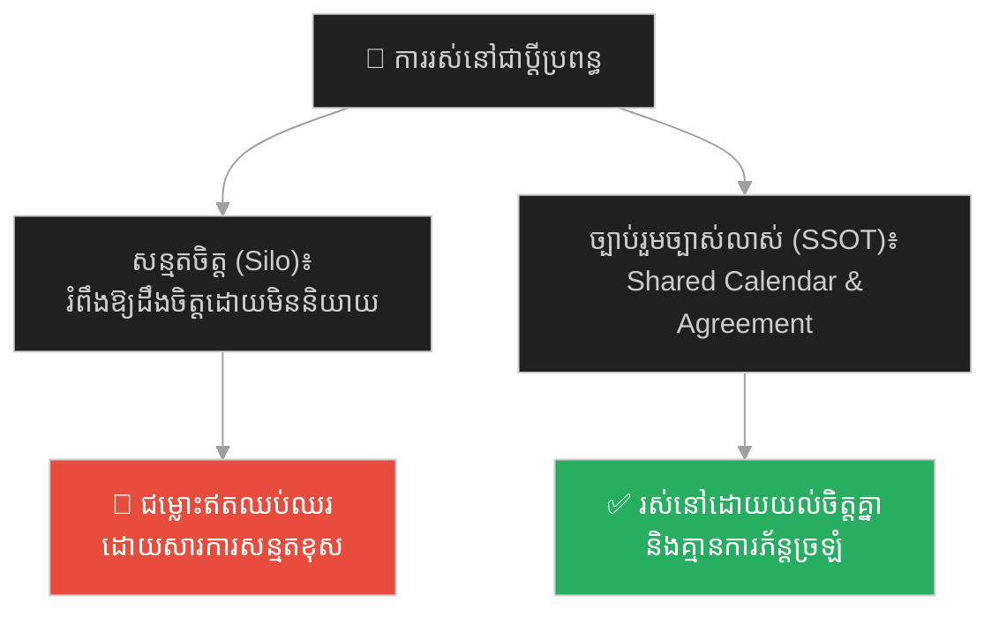
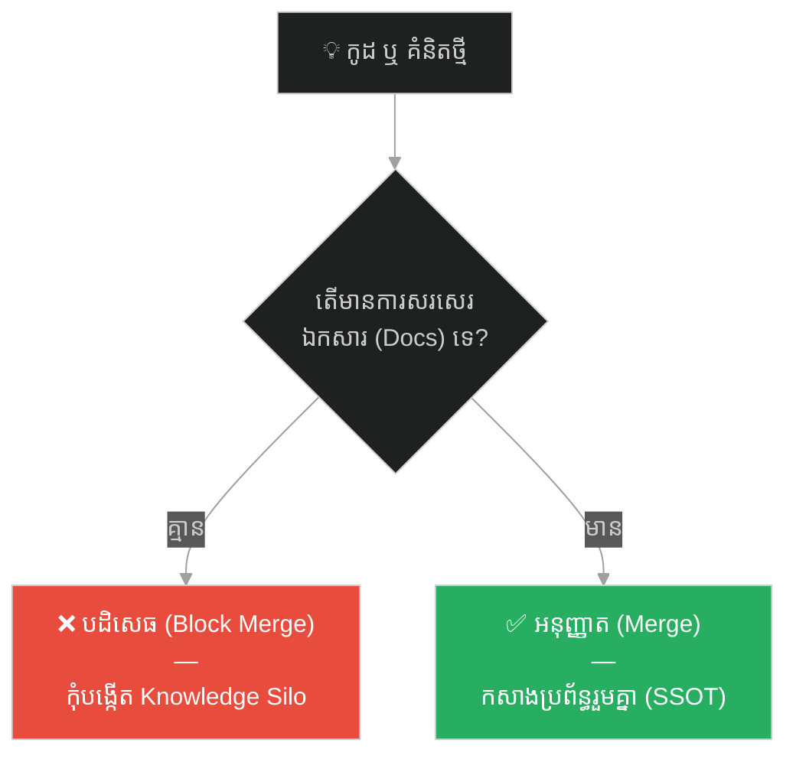

# The Royal Physician and the Undocumented Antidote (គ្រូពេទ្យហ្លួង និងឱសថគ្មានកំណត់ត្រា)៖ គ្រោះថ្នាក់នៃវប្បធម៌លាក់ទុកចំណេះដឹង និងសារៈសំខាន់នៃ Single Source of Truth

**Author:** ichamrong  
**Date:** 2026-05-27  
**Tags:** #single-source-of-truth #knowledge-silos #toxic-job-security #ancient-china #agile #documentation #bus-factor  
**Category:** Concepts / Parables  
**Read Time:** ~15 min  

---

## 📌 មាតិកា (Table of Contents)
- [អន្ទាក់ផ្លូវចិត្ត (The Trap)](#អន្ទាក់ផ្លូវចិត្ត-the-trap)
- [១. រឿងព្រេងប្រវត្តិសាស្ត្រចិន៖ គ្រូពេទ្យហ្លួង តុង ជឺ (The Legend of the Royal Physician)](#1)
  - [សិល្បៈនៃការលាក់កំបាំងរូបមន្ត (The Art of Concealment)](#1-1)
  - [ថ្ងៃដែលរាជវាំងដួលរលំ (The Fall of the Palace)](#1-2)
- [២. បញ្ហា៖ វប្បធម៌លាក់ទុកចំណេះដឹង និង Bus Factor ស្មើ ១ (The Issue: Knowledge Silos & Bus Factor = 1)](#2)
- [៣. ឧទាហរណ៍ជាក់ស្តែងក្នុងពិភពពិត (Real World Examples)](#3)
  - [ឧទាហរណ៍ទី ១ — កម្រិតស្រាល (គ្រួសារ)៖ គណនី និងលេខសម្ងាត់ហិរញ្ញវត្ថុគ្រួសារដឹងតែម្នាក់ឯង (The Lone Password Hoarder)](#3-1)
  - [ឧទាហរណ៍ទី ២ — កម្រិតមធ្យម (បច្ចេកទេស)៖ Developer ដែលសរសេរកូដ Legacy តែម្នាក់ឯង និងមិនសរសេរ Document (The Undocumented Legacy Code)](#3-2)
  - [ឧទាហរណ៍ទី ៣ — កម្រិតមធ្យម (ធុរកិច្ច)៖ Product Specs និងការសន្មតតម្រូវការដោយគ្មាន PRD ច្បាស់លាស់ (The Word-of-Mouth Product Specs)](#3-3)
  - [ឧទាហរណ៍ទី ៤ — កម្រិតមធ្យម (សង្គម/គ្រប់គ្រង)៖ ដំណើរការការងារ និង Runbook បច្ចេកទេសដឹងតែម្នាក់ឯង (The DevOps Single Point of Failure)](#3-4)
  - [ឧទាហរណ៍ទី ៥ — កម្រិតធ្ងន់ (ទំនាក់ទំនង)៖ ការសន្មតចិត្តដៃគូ និងកង្វះការចែករំលែកព័ត៌មាន (The Mind-Reading Expectation Trap)](#3-5)
- [៤. ដំណោះស្រាយទូទៅ៖ ការកសាង Single Source of Truth និងការកត់ត្រាជាប្រព័ន្ធ (The General Solution: Establishing SSOT)](#4)
- [សេចក្តីសន្និដ្ឋាន (Conclusion)](#conclusion)
- [ឯកសារយោង (References)](#references)
- [Related Posts](#related-posts)

---

## អន្ទាក់ផ្លូវចិត្ត (The Trap)

តើអ្នកធ្លាប់ជួបស្ថានភាពដែលប្រព័ន្ធការងារទាំងមូលត្រូវគាំង ឬគម្រោងត្រូវស្ទះទាំងស្រុង គ្រាន់តែដោយសារតែបុគ្គលិកម្នាក់សុំច្បាប់សម្រាក លាឈប់ ឬទៅវិស្សមកាលដែរឬទេ?

នៅក្នុងគ្រប់ស្ថាប័ន វប្បធម៌ការងារតែងតែជួបប្រទះនូវបញ្ហា៖
* **អ្នកដឹងរឿង** គិតថាការលាក់ព័ត៌មាន និងចំណេះដឹង គឺជាវិធីការពារសុវត្ថិភាពការងាររបស់ខ្លួន (Toxic Job Security)។
* **អ្នកដទៃ** ត្រូវដើរខ្សឹបតគ្នា ឬទាក់ទងសួរនាំស្វែងរកការពិតពីមនុស្សម្នាក់ទៅមនុស្សម្នាក់ (Whisper Culture)។

នៅពេលស្ថាប័នមួយគ្មានការកត់ត្រា និងចែករំលែកចំណេះដឹងជាប្រព័ន្ធ ពួកគេកំពុងរស់នៅលើគ្រាប់បែកពេលវេលាដ៏គ្រោះថ្នាក់មួយហៅថា **វប្បធម៌លាក់ទុកចំណេះដឹង (Knowledge Silos Trap)**។

ដើម្បីយល់ដឹងពីរបៀបលុបបំបាត់បញ្ហានេះ នេះជាផែនទីបង្ហាញផ្លូវសម្រាប់អត្ថបទនេះ៖
1. **រឿងព្រេងប្រវត្តិសាស្ត្រ (The Historic Legend)** — សោកនាដកម្មរបស់អធិរាជដែលសោយទិវង្គត ព្រោះតែគ្រូពេទ្យហ្លួងលាក់ទុកព័ត៌មានរូបមន្តថ្នាំតែម្នាក់ឯង។
2. **បញ្ហា (The Issue)** — តើ Bus Factor និងកង្វះ Single Source of Truth បំផ្លាញស្ថិរភាពការងារយ៉ាងដូចម្តេច?
3. **ឧទាហរណ៍ជាក់ស្តែងក្នុងពិភពពិត (Real World Examples)** — ពិនិត្យមើលឥទ្ធិពលនៃ Knowledge Silos ក្នុងកម្រិតគ្រួសារ ការងារបច្ចេកទេស ធុរកិច្ច ការគ្រប់គ្រង និងទំនាក់ទំនងស្នេហា។
4. **ដំណោះស្រាយទូទៅ (The General Solution)** — វិធីបង្កើត **Single Source of Truth (SSOT)** និងការកសាងវប្បធម៌កត់ត្រាឯកសារច្បាស់លាស់។

---

## ១. រឿងព្រេងប្រវត្តិសាស្ត្រចិន៖ គ្រូពេទ្យហ្លួង តុង ជឺ (The Legend of the Royal Physician)

នៅក្នុងរាជវង្សហាន (Han Dynasty) នៃប្រទេសចិនបុរាណ មានអធិរាជមួយអង្គដែលមានព្រះរាជកាយពលខ្សោយ និងមានជំងឺរ៉ាំរ៉ៃម្យ៉ាងដែលគ្មាននរណាម្នាក់អាចមើលជាសះស្បើយឡើយ។ មានតែគ្រូពេទ្យហ្លួងវ័យចំណាស់ម្នាក់ប៉ុណ្ណោះ ឈ្មោះ **តុង ជឺ (Dong Zhi)** ដែលដឹងពីរបៀបផ្សំឱសថទិព្វ ដើម្បីទប់ទល់នឹងជំងឺនេះមិនឱ្យរើឡើង។

ជារៀងរាល់ខែ តុង ជឺ តែងតែផ្សំថ្នាំនេះដោយសម្ងាត់នៅក្នុងបន្ទប់ងងឹតរបស់ខ្លួន។ អធិរាជតែងតែប្រទានរង្វាន់ មាសប្រាក់ និងអំណាចយ៉ាងច្រើនសន្ធឹកសន្ធាប់ដល់ តុង ជឺ ព្រោះព្រះអង្គដឹងថា ជីវិតរបស់ព្រះអង្គ គឺពឹងផ្អែកទាំងស្រុងទៅលើគ្រូពេទ្យម្នាក់នេះ។

ដោយសារតែចង់ធានាថាគ្រូពេទ្យផ្សេងៗអាចរៀនសូត្រតាម អធិរាជបានបញ្ជាឱ្យ តុង ជឺ សរសេររូបមន្តថ្នាំនោះទុកនៅក្នុងបណ្ណាល័យរាជវាំង (Royal Library) ដើម្បីជាប្រយោជន៍ដល់ជាតិ។ ប៉ុន្តែ តុង ជឺ តែងតែបដិសេធជានិច្ច ដោយយកលេសថា៖
> *«ក្រាបទូលព្រះអង្គ! សិល្បៈនៃការផ្សំឱសថនេះ គឺមានភាពស្មុគស្មាញ និងអាថ៌កំបាំងណាស់។ វាអាស្រ័យលើកម្លាំងខ្យល់ ពន្លឺថ្ងៃ និងសីតុណ្ហភាពជាក់ស្តែង។ វាមិនអាចសរសេរជាអក្សរបានទេ ទាល់តែប្រើអារម្មណ៍ផ្ទាល់ទើបដឹង។ បើទូលបង្គំសរសេរទុក ក្រែងលោគ្រូពេទ្យជំនាន់ក្រោយអានមិនយល់ ផ្សំខុស ធ្វើឱ្យគ្រោះថ្នាក់ដល់ព្រះកាយពលមិនខាន។»*

---

### សិល្បៈនៃការលាក់កំបាំងរូបមន្ត (The Art of Concealment)

តាមការពិត តុង ជឺ មិនមែនបារម្ភពីកំហុសរបស់គ្រូពេទ្យជំនាន់ក្រោយនោះទេ។ អ្វីដែលគាត់ខ្លាចបំផុតនោះគឺ **«ការបាត់បង់អំណាច និងការងារ» (Toxic Job Security)**។ គាត់គិតក្នុងចិត្តថា៖ *«បើអធិរាជដឹងពីរូបមន្តថ្នាំនេះ គាត់លែងត្រូវការខ្ញុំទៀតហើយ។ គាត់អាចនឹងប្រហារជីវិតខ្ញុំចោលពេលណាក៏បាន។»*

ដើម្បីបិទបាំងល្បិចនេះ តុង ជឺ បានទទួលយកសិស្ស ៣ នាក់។ ប៉ុន្តែជំនួសឱ្យការបង្រៀនរូបមន្តទាំងស្រុង គាត់បែរជាប្រាប់ព័ត៌មានមិនពិត និងខុសៗគ្នាទៅកាន់សិស្សម្នាក់ៗ៖
* គាត់ប្រាប់សិស្សទី ១ ថា៖ *«ថ្នាំនេះត្រូវស្ងោរជាមួយឫសឈើពណ៌ក្រហម»*។
* គាត់ប្រាប់សិស្សទី ២ ថា៖ *«ថ្នាំនេះហាមដាច់ខាតមិនឱ្យត្រូវកម្តៅភ្លើងខ្លាំង»*។
* គាត់ប្រាប់សិស្សទី ៣ ថា៖ *«ថ្នាំនេះត្រូវលាយជាមួយទឹកសន្សើម»*។

នៅពេលដែលសិស្សទាំង ៣ នាក់សាកល្បងផ្សំថ្នាំ ហើយបរាជ័យ តុង ជឺ តែងតែស្តីបន្ទោសពួកគេនៅចំពោះមុខអធិរាជថា៖ *«ពួកឯងល្ងង់ណាស់! រឿងប៉ុណ្ណឹងក៏ធ្វើមិនបាន! ព្រះអង្គទូលបង្គំសុំទោស ពួកក្មេងៗនេះពិតជាគ្មានសមត្ថភាពអាចយល់ពីសិល្បៈឱសថដ៏ជ្រាលជ្រៅរបស់ទូលបង្គំបានឡើយ។»*

---

### ថ្ងៃដែលរាជវាំងដួលរលំ (The Fall of the Palace)

ការរស់នៅដោយក្តោបក្តាប់អំណាចរបស់ តុង ជឺ មិនបានយូរអង្វែងឡើយ។ យប់មួយ ឃាតករលបឃាតពីរដ្ឋសត្រូវ បានលួចចូលមកក្នុងរាជវាំង ហើយបានធ្វើឃាត តុង ជឺ ស្លាប់ភ្លាមៗនៅក្នុងបន្ទប់របស់គាត់។

ព្រឹកឡើង អធិរាជបានធ្លាក់ខ្លួនឈឺយ៉ាងធ្ងន់ធ្ងរ។ រាជវាំងទាំងមូលមានភាពវឹកវរ។ សិស្សទាំង ៣ នាក់ត្រូវបានកោះហៅមកផ្សំថ្នាំសង្គ្រោះបន្ទាន់។ ប៉ុន្តែដោយសារតែព័ត៌មានដែលពួកគេមាន គឺជាព័ត៌មានខ្សឹបតគ្នា និងខុសៗគ្នា (Whisper Culture) ពួកគេបានឈ្លោះប្រកែកគ្នាយ៉ាងខ្លាំង៖
* សិស្សទី ១ ទាមទារឱ្យស្ងោរឫសឈើ។
* សិស្សទី ២ ស្រែកថាស្ងោរមិនបានទេ ព្រោះវានឹងក្លាយជាថ្នាំពុល។
* សិស្សទី ៣ រកទឹកសន្សើមមិនបាន ព្រោះជារដូវក្តៅ។

ដោយសារតែគ្មាន **កំណត់ត្រារូបមន្តតែមួយ (Single Source of Truth - SSOT)** នៅក្នុងបណ្ណាល័យរាជវាំង សិស្សទាំង ៣ មិនអាចផ្សំថ្នាំបានទាន់ពេលវេលាឡើយ។ ទីបំផុត អធិរាជបានសោយទិវង្គតដោយការឈឺចាប់ ហើយរាជវង្សហានក៏ត្រូវដួលរលំដោយសារការបះបោរដែលកើតឡើងបន្ទាប់ពីការស្លាប់របស់ទ្រង់។

---

## ២. បញ្ហា៖ វប្បធម៌លាក់ទុកចំណេះដឹង និង Bus Factor ស្មើ ១ (The Issue: Knowledge Silos & Bus Factor = 1)

នៅក្នុងបច្ចេកទេស និងការគ្រប់គ្រងប្រព័ន្ធ បាតុភូតនេះត្រូវបានគេហៅថា **«គ្រោះថ្នាក់នៃ Bus Factor = 1»**។
* **Bus Factor:** គឺជារង្វាស់ដែលបង្ហាញថា តើគម្រោង ឬស្ថាប័នរបស់អ្នក នឹងត្រូវគាំង ឬដួលរលំឬទេ ប្រសិនបើមានសមាជិកម្នាក់ ត្រូវបានឡានបុកស្លាប់ (ឬលាឈប់ពីការងារ) ភ្លាមៗ។
* ប្រសិនបើមានតែមនុស្សម្នាក់គត់ដែលដឹងពីរបៀប Deploy ប្រព័ន្ធ ឬផ្សំថ្នាំ នោះ Bus Factor របស់អ្នកគឺស្មើ ១។ នេះជាចំណុចខ្សោយដ៏ធំបំផុតនៅក្នុងស្ថាប័ន (Single Point of Failure - SPOF)។

---

## ៣. ឧទាហរណ៍ជាក់ស្តែងក្នុងពិភពពិត

ដើម្បីយល់ដឹងឱ្យកាន់តែស៊ីជម្រៅ ផ្លូវការសិក្សានឹងនាំអ្នកទៅពិនិត្យមើល **ឧទាហរណ៍ចំនួន ៥ កម្រិតខុសៗគ្នា** ក្នុងជីវិតរស់នៅប្រចាំថ្ងៃ៖

---

### ឧទាហរណ៍ទី ១ — កម្រិតស្រាល (គ្រួសារ)៖ គណនី និងលេខសម្ងាត់ហិរញ្ញវត្ថុគ្រួសារដឹងតែម្នាក់ឯង (The Lone Password Hoarder)

**ស្ថានភាព៖** ឪពុកជាអ្នកចាត់ចែងរាល់ការបង់ថ្លៃទឹក ភ្លើង អ៊ីនធឺណិត និងគណនីធនាគារក្នុងផ្ទះ ប៉ុន្តែមិនដែលប្រាប់ព័ត៌មានទៅកាន់សមាជិកផ្សេងទៀតឡើយ។

* **ភាគី A (លាក់បាំងព័ត៌មាន)៖** រក្សាលេខសម្ងាត់ (Passwords) និងកាលបរិច្ឆេទបង់ប្រាក់ទាំងអស់នៅក្នុងខួរក្បាលរបស់ខ្លួន។ ពេលខ្លួនឈឺធ្ងន់ ឬរវល់ធ្វើដំណើរទៅឆ្ងាយ គ្រួសារត្រូវកាត់ទឹកកាត់ភ្លើង និងមិនអាចដកលុយមកប្រើប្រាស់បាន ព្រោះគ្មាននរណាចេះប្រើគណនី។
* **ភាគី B (កសាង SSOT គ្រួសារ)៖** បង្កើតឯកសារ ឬសៀវភៅកំណត់ត្រារួមមួយ (Shared Document/Password Manager) ដែលសមាជិកគ្រួសារអាចចូលមើលបាននៅពេលមានអាសន្ន។

---

### ឧទាហរណ៍ទី ២ — កម្រិតមធ្យម (បច្ចេកទេស)៖ Developer ដែលសរសេរកូដ Legacy តែម្នាក់ឯង និងមិនសរសេរ Document (The Undocumented Legacy Code)

**ស្ថានភាព៖** Senior Developer ម្នាក់សរសេរប្រព័ន្ធកាត់លុយ (Billing Core) យ៉ាងស្មុគស្មាញ ប៉ុន្តែមិនព្រមសរសេរឯកសារណែនាំ (README) ឬ Comment ក្នុងកូដឡើយ។

* **ភាគី A (បង្កើត Knowledge Silo)៖** ជឿជាក់ថា៖ *«កូដល្អគឺមិនបាច់សរសេរ Document ទេ ឱ្យតែខ្ញុំដឹងម្នាក់ឯងគឺគ្រប់គ្រាន់ហើយ»*។ ពេលខ្លួនលាឈប់ពីការងារ ក្រុមការងារទាំងមូលគ្មាននរណាហ៊ានទៅប៉ះពាល់ ឬកែប្រែកូដនោះឡើយ ព្រោះខ្លាចធ្វើឱ្យប្រព័ន្ធទាំងមូលគាំង។
* **ភាគី B (កសាង SSOT ក្នុងកូដ)៖** សរសេរ API documentation, គូរ Mermaid diagram បញ្ជាក់ពី data flow, និងកត់ត្រាការសម្រេចចិត្តស្ថាបត្យកម្ម (Architecture Decision Record - ADR) ទុកក្នុងប្រព័ន្ធ Git យ៉ាងត្រឹមត្រូវ។

---

### ឧទាហរណ៍ទី ៣ — កម្រិតមធ្យម (ធុរកិច្ច)៖ Product Specs និងការសន្មតតម្រូវការដោយគ្មាន PRD ច្បាស់លាស់ (The Word-of-Mouth Product Specs)

**ស្ថានភាព៖** Product Owner ចង់ឱ្យក្រុមការងារអភិវឌ្ឍ Feature ថ្មី ប៉ុន្តែគ្រាន់តែប្រាប់ព័ត៌មានដោយផ្ទាល់មាត់កំឡុងពេលផឹកកាហ្វេ ឬផ្ញើសារខ្លីៗតាម Telegram។

* **ភាគី A (ព័ត៌មានខ្សឹបតគ្នា)៖** មិនបង្កើត Product Requirement Document (PRD)។ Developer យល់ផ្សេង QA យល់ផ្សេង ធ្វើឱ្យផលិតផលដែលផលិតរួចខុសពីការចង់បានរបស់អតិថិជន។
* **ភាគី B (កសាង PRD ជា SSOT)៖** សរសេរ PRD យ៉ាងលម្អិត និងច្បាស់លាស់នៅក្នុង Notion ឬ Confluence ដែលមាន User Stories, Acceptance Criteria និង Wireframes សម្រាប់គ្រប់គ្នាអានរួមគ្នា។

---

### ឧទាហរណ៍ទី ៤ — កម្រិតមធ្យម (សង្គម/គ្រប់គ្រង)៖ ដំណើរការការងារ និង Runbook បច្ចេកទេសដឹងតែម្នាក់ឯង (The DevOps Single Point of Failure)

**ស្ថានភាព៖** នៅពេលយប់ ប្រព័ន្ធ Server ជួបបញ្ហាគាំង ហើយមានតែ DevOps Engineer ម្នាក់គត់ដែលដឹងពីវិធី Restart និង Clear Cache។

* **ភាគី A (Bus Factor = 1)៖** DevOps រូបនោះមិនដែលសរសេរ Runbook ឬច្បាប់ប្រតិបត្តិការឡើយ។ ពេលទូរស័ព្ទរបស់គាត់អស់ថ្ម ឬគាត់កំពុងសម្រាកវិស្សមកាល ប្រព័ន្ធការងារទាំងមូលត្រូវគាំងរាប់ម៉ោង ធ្វើឱ្យក្រុមហ៊ុនខាតបង់ថវិការាប់ម៉ឺនដុល្លារ។
* **ភាគី B (កសាង Runbook)៖** សរសេររាល់ជំហាននៃការដោះស្រាយបញ្ហា (Incident Response Steps) ទុកក្នុង Runbook ដែលកូនក្រុមផ្សេងទៀតអាចអាន និងធ្វើតាមបានយ៉ាងងាយស្រួល។

---

### ឧទាហរណ៍ទី ៥ — កម្រិតធ្ងន់ (ទំនាក់ទំនង)៖ ការសន្មតចិត្តដៃគូ និងកង្វះការចែករំលែកព័ត៌មាន (The Mind-Reading Expectation Trap)

**ស្ថានភាព៖** ប្តីប្រពន្ធរស់នៅជាមួយគ្នា ប៉ុន្តែតែងតែមានការអាក់អន់ចិត្តរឿងការងារផ្ទះ ថ្លៃចំណាយ និងពេលវេលាផ្ទាល់ខ្លួន។

* **ភាគី A (សន្មតចិត្តគូកន)៖** មិនដែលនិយាយ ឬសរសេរច្បាប់ការងាររួមគ្នាឱ្យច្បាស់លាស់ឡើយ តែងតែរំពឹងថា៖ *«រស់នៅជាមួយគ្នាត្រូវតែដឹងចិត្តខ្ញុំថាខ្ញុំចង់បានអី!»* បង្កើតជាជម្លោះ និងការយល់ច្រឡំជាប្រចាំ។
* **ភាគី B (កសាងការយល់ស្រប)៖** ជជែកពិភាក្សា និងកត់ត្រាការបែងចែកភារកិច្ច កាលវិភាគ និងគោលដៅហិរញ្ញវត្ថុរួមគ្នាយ៉ាងច្បាស់លាស់ (Shared Calendar / Family Agreement)។

---

## ៤. ដំណោះស្រាយទូទៅ៖ ការកសាង Single Source of Truth និងការកត់ត្រាជាប្រព័ន្ធ (The General Solution: Establishing SSOT)

ដើម្បីយកឈ្នះលើរបាំងលាក់ទុកព័ត៌មាន និងការពារកុំឱ្យស្ថាប័នដួលរលំដូចរាជវាំងចូវ អ្នកត្រូវតែអនុវត្តវិធានការទាំងនេះ៖

### ១. បង្កើតប្រភពព័ត៌មានតែមួយគត់ (Establish SSOT)
រាល់ព័ត៌មាន គម្រោង បច្ចេកទេស និងរូបមន្តការងារ ត្រូវតែមាន «ចំណុចយោងតែមួយ» ដែលគ្រប់គ្នាអាចចូលអានបាន (ឧទាហរណ៍៖ Git Repository, Confluence Wiki Page, Notion Database)។ បោះចោលរាល់ព័ត៌មានខ្សឹបតគ្នា (Whisper culture)។

### ២. បង្កើន Bus Factor របស់ក្រុមការងារ (Increase Bus Factor)
លុបបំបាត់វប្បធម៌ «មានតែម្នាក់គត់ដែលចេះធ្វើ»។ អនុវត្តគោលការណ៍ **Cross-Training (ការបង្ហាត់បង្រៀនគ្នាទៅវិញទៅមក)** និង **Pair Programming** ដើម្បីធានាថា ប្រសិនបើមានសមាជិកម្នាក់អវត្តមាន គម្រោងនៅតែអាចដំណើរការទៅមុខបានដោយគ្មានបញ្ហា។

### ៣. អនុវត្តច្បាប់ "No Docs, No Merge" (Documentation Culture)
នៅក្នុងការងារសរសេរកូដ កំណត់ច្បាប់ថា៖ *«បើគ្មានការសរសេរពន្យល់ (Documentation/Comments) ឬមិនបានកែសម្រួល API Specs ទេ កូដនោះមិនត្រូវបានអនុញ្ញាតឱ្យបញ្ចូលទៅក្នុងប្រព័ន្ធឡើយ (Not Ready to Done)»*។ ប្តូរផ្នត់គំនិតពីការសរសេរកូដលឿនៗ មកជាការកសាងប្រព័ន្ធដែលមានស្ថិរភាពយូរអង្វែង។

---

## 🐇 ធ្លាក់ចូលក្នុងរន្ធទន្សាយ (Enter the Rabbit Hole)
ដើម្បីស្វែងយល់កាន់តែស៊ីជម្រៅអំពីការកត់ត្រា និងរបៀបដែលការបាត់បង់ឯកសារបញ្ជាក់ផ្លូវនាំឱ្យមានការវង្វេងទិសដៅនៅក្នុងគម្រោងធំៗ សូមបន្តដំណើររុករករបស់អ្នក៖

* 🚀 **[ចាប់ផ្តើមដំណើររុករក (Start the Journey) ➔ The Master Navigator and the Hidden Star Chart](./23-the-master-navigator-and-the-hidden-star-chart.md)**

---

## សេចក្តីសន្និដ្ឋាន (Conclusion)

> **«កុំអនុញ្ញាតឱ្យនរណាម្នាក់យក "ចំណេះដឹងបច្ចេកទេស" ធ្វើជាចំណាប់ខ្មាំងនៅក្នុងក្រុមហ៊ុនរបស់អ្នកឱ្យសោះ។ រាល់ Business Logic ទាំងអស់ ត្រូវតែសរសេរទុកនៅក្នុង Document តែមួយ ដែលគ្រប់គ្នាអាចចូលអានបាន (Single Source of Truth)។»**

ការការពារការងាររបស់ខ្លួនដោយការលាក់បាំងចំណេះដឹង ធ្វើឱ្យអ្នកមានអារម្មណ៍ថាខ្លួនសំខាន់តែមួយរយៈប៉ុណ្ណោះ។ ប៉ុន្តែនៅពេលដែលប្រព័ន្ធត្រូវជួបវិបត្តិ វានឹងដុតបំផ្លាញទំនុកចិត្ត និងកសាងជញ្ជាំងនៃការស្អប់ខ្ពើមជុំវិញខ្លួនអ្នក ដូចគំនរផេះផង់នៅលើដីរាជវាំងដែល តុង ជឺ ធ្លាប់រស់នៅ។

ចូរចែករំលែកដើម្បីកសាងប្រព័ន្ធ មិនមែនលាក់បាំងដើម្បីការពារ Ego នោះឡើយ។

---

## ឯកសារយោង (References)

* **Sima Qian (司馬遷)** — *Records of the Grand Historian (Shiji / 史記)*។ ប្រភពប្រវត្តិសាស្ត្រផ្លូវការដែលកត់ត្រាការដួលរលំ និងការផ្ទេរអំណាចក្នុងរាជវង្សហាន។
* **Humphrey, Watts S.** — *Managing Technical People: Innovation, Teamwork, and the Software Process* (1996)។ ការសិក្សាពីចំណុចខ្សោយនៃ Knowledge Silos និងរបៀបផ្ទេរចំណេះដឹងក្នុងក្រុមវិស្វករ។
* **Brooks, Frederick P.** — *The Mythical Man-Month: Essays on Software Engineering* (1975)។ សៀវភៅណែនាំស្តីពីសារៈសំខាន់នៃការកសាងច្បាប់កត់ត្រាតែមួយ (System Specification) ក្នុងគម្រោងធំៗ។

---

## Related Posts

* **[13 Single Source of Truth vs. Toxic Knowledge Silos](../articles/13-single-source-of-truth-and-knowledge-silos.md)** — អត្ថបទគោលបកស្រាយលម្អិតអំពីយុទ្ធសាស្ត្រកសាងប្រភពព័ត៌មានតែមួយ និងផលប៉ះពាល់នៃវប្បធម៌លាក់បាំង។
* **[11 Definition of Ready (DoR) and Done (DoD)](../articles/11-dor-and-dod-scrum-contracts.md)** — របៀបប្រើប្រាស់កិច្ចសន្យា DoR & DoD ដើម្បីធានាឱ្យមានឯកសារត្រឹមត្រូវមុន Deploy។
* **[21 The Duke of Zhou and the Welcoming of Scholars](./21-the-duke-of-zhou-and-the-wet-hair.md)** — ភាពរាបទាបរបស់មេដឹកនាំក្នុងការទទួលយកមតិ និងចំណេះដឹងពីសមាជិកក្រុម។

---

*Last updated: 2026-05-27*

## Related

- [💡 Concepts README](../README.md)
- [📚 Main Repository README](../../../README.md)
- [Developer Habits](../../developer-habits/README.md)
- [Mental Health & Well-being](../../mental-health/README.md)
- [Management & SDLC](../../management/README.md)
