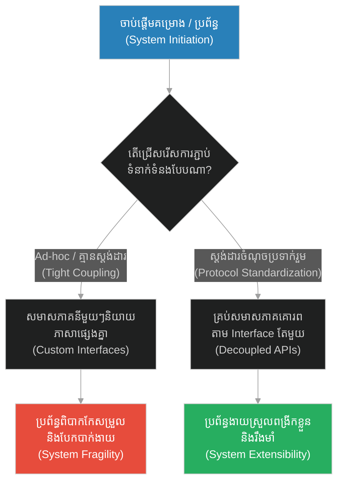
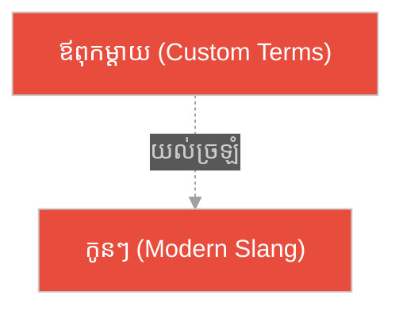
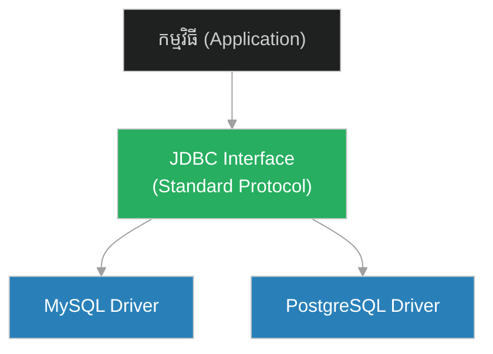
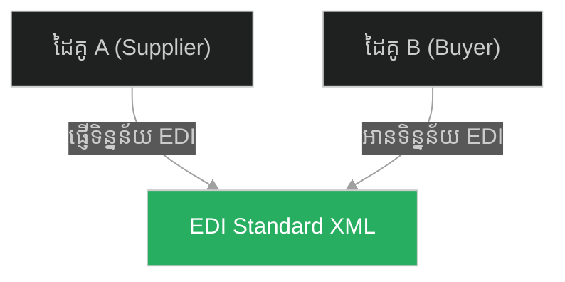
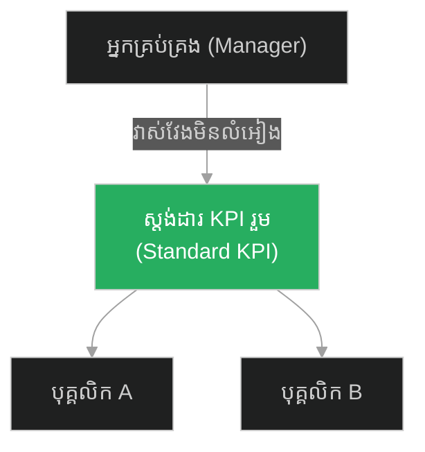
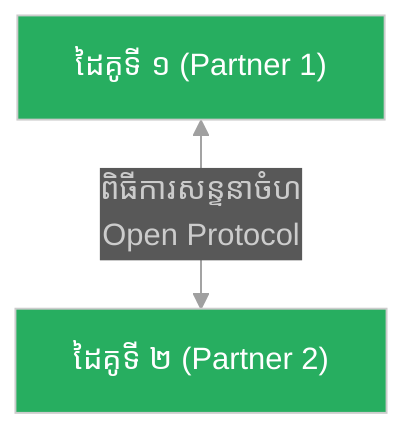
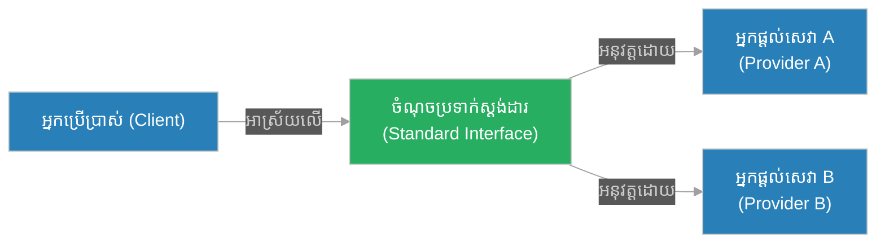

# Protocol Standardization & Universal Interfaces (ធម្មទេសនាចុងក្រោយរបស់ព្យាការី)៖ ការធ្វើស្តង់ដារពិធីការ និងចំណុចប្រទាក់សកល (Protocol Standardization & Universal Interfaces & Decoupled APIs and Common Data Contract & Prophet and the Final Sermon)

**Author:** ichamrong  
**Date:** 2026-05-28  
**Tags:** #protocol-standardization #universal-interfaces #decoupled-apis #clean-architecture #software-engineering  
**Category:** Concepts  
**Read Time:** ~15 min  

---

## 📌 មាតិកា (Table of Contents)
- [អន្ទាក់ផ្លូវចិត្ត (The Trap)](#0)
- [១. រឿងព្រេងនិទាន៖ ធម្មទេសនាចុងក្រោយរបស់ព្យាការី (The Legend of Prophet and the Final Sermon)](#1)
  - [យុគសម័យនៃការបែកបាក់ និងការបង្កើតចំណុចប្រទាក់សកល (Decoupling from Lineage to Universal Moral Contract)](#1-1)
- [២. បញ្ហា៖ ការភ្ជាប់គ្នាណែនខ្លាំង និងកង្វះស្តង់ដារ (The Issue: Tight Coupling & Lack of Standardization)](#2)
- [៣. ឧទាហរណ៍ជាក់ស្តែងក្នុងពិភពពិត (Real World Examples)](#3)
  - [ឧទាហរណ៍ទី ១ — កម្រិតស្រាល (គ្រួសារ)៖ ភាសាតំបន់ និងការប្រាស្រ័យទាក់ទង (The Family Custom Dialects vs Standard Language)](#3-1)
  - [ឧទាហរណ៍ទី ២ — កម្រិតមធ្យម (បច្ចេកទេស)៖ កង្វះកម្មវិធីជំនួយស្តង់ដារ (The Dev Custom Drivers vs JDBC/ODBC Interface)](#3-2)
  - [ឧទាហរណ៍ទី ៣ — កម្រិតមធ្យម (ធុរកិច្ច)៖ វិក្កយបត្រក្រដាសអនាធិបតេយ្យ (The Business Ad-hoc Invoicing vs EDI Standard)](#3-3)
  - [ឧទាហរណ៍ទី ៤ — កម្រិតមធ្យម (សង្គម/គ្រប់គ្រង)៖ ការវាយតម្លៃតាមខ្សែស្រឡាយ (The Management Favoritism vs Standardized KPIs)](#3-4)
  - [ឧទាហរណ៍ទី ៥ — កម្រិតធ្ងន់ (ទំនាក់ទំនង)៖ របាំងចិត្ត និងការសន្មត (The Relationship Silent Treatment vs Standard Communication Protocol)](#3-5)
- [៤. ដំណោះស្រាយទូទៅ៖ ការធ្វើស្តង់ដារ និងការកាត់ផ្តាច់ទំនាក់ទំនងផ្ទាល់ (The General Solution: Protocol Standardization & Decoupling)](#4)
- [សេចក្តីសន្និដ្ឋាន (Conclusion)](#5)
- [ឯកសារយោង (References)](#6)
- [Related Posts](#7)

---

<a id="0"></a>
## អន្ទាក់ផ្លូវចិត្ត (The Trap)

តើយើងអាចបង្កើតប្រព័ន្ធសកលដ៏ធំមួយ ដែលអនុញ្ញាតឱ្យសមាសភាគរាប់ពាន់ផ្សេងគ្នាអាចធ្វើការរួមគ្នាដោយគ្មានភាពរញ៉េរញ៉ៃដោយរបៀបណា? អន្ទាក់ផ្លូវចិត្តដ៏ធំបំផុតនៅក្នុងការរចនាប្រព័ន្ធ និងសង្គមគឺ៖
*   **ការរចនាតាមអារម្មណ៍ ឬតម្រូវការចៃដន្យ (Ad-hoc / Tight Coupling)** — ការអនុញ្ញាតឱ្យសមាសភាគនីមួយៗប្រាស្រ័យទាក់ទងគ្នាដោយប្រើច្បាប់ផ្ទាល់ខ្លួន បង្កើតឱ្យមានភាពស្មុគស្មាញ និងការពឹងផ្អែកគ្នាដែលមិនអាចគ្រប់គ្រងបាន។
*   **ការប្រើប្រាស់ពិធីការរួម (Universal Interface)** — ការបង្ខំឱ្យគ្រប់ភាគីទាំងអស់យល់ព្រមលើកិច្ចសន្យាទិន្នន័យ (Data Contract) តែមួយ ដែលធ្វើឱ្យសមាសភាគនីមួយៗអាចផ្លាស់ប្តូរ និងអភិវឌ្ឍដោយឯករាជ្យ។

1.  **រឿងព្រេងនិទាន (The Legend)** — ការបង្រួបបង្រួមពូជសាសន៍ផ្សេងៗគ្នាក្រោមក្រមសីលធម៌តែមួយដោយព្យាការីម៉ូហាម៉ាត់។
2.  **បញ្ហា (The Issue)** — ការរចនាកូដដែលគ្មានចំណុចប្រទាក់រួម (No Interfaces) ធ្វើឱ្យប្រព័ន្ធទាំងមូលផុយស្រួយ។
3.  **ឧទាហរណ៍ជាក់ស្តែង (Real World Examples)** — ករណីសិក្សាពីការអនុវត្តចំណុចប្រទាក់ស្តង់ដារក្នុងជីវិត និងបច្ចេកវិទ្យា។
4.  **ដំណោះស្រាយ (The General Solution)** — វិធីសាស្ត្ររចនាប្រព័ន្ធដោយប្រើ Interface-Driven Development និង API Contracts។



---

<a id="1"></a>
## ១. រឿងព្រេងនិទាន៖ ធម្មទេសនាចុងក្រោយរបស់ព្យាការី (The Legend of Prophet and the Final Sermon)

នៅចុងបញ្ចប់នៃជីវិតរបស់លោក (ឆ្នាំ ៦៣២ នៃគ.ស) ព្យាការីម៉ូហាម៉ាត់បានធ្វើដំណើរធម្មយាត្រាទៅកាន់ទីក្រុងម៉ក្កា (Hajj) ជាលើកចុងក្រោយ។ លោកបានឈរនៅជ្រលងភ្នំ Uranah នៃភ្នំ Arafat នៅចំពោះមុខមនុស្សជាង ១០ ម៉ឺននាក់ ដើម្បីថ្លែងសុន្ទរកថាដ៏សំខាន់បំផុតមួយក្នុងប្រវត្តិសាស្ត្រ ដែលត្រូវបានគេស្គាល់ថាជា **"The Farewell Sermon (Khutbat al-Wida)"**។

នៅក្នុងសង្គមអារ៉ាប់នាពេលនោះ មានការបែកបាក់យ៉ាងខ្លាំងដោយសារជម្លោះកុលសម្ព័ន្ធ និងវណ្ណៈពូជសាសន៍។ គ្មានច្បាប់ ឬស្តង់ដាររួមណាដែលអាចគ្រប់គ្រងអាកប្បកិរិយារបស់កុលសម្ព័ន្ធទាំងអស់នោះឡើយ។ កុលសម្ព័ន្ធនីមួយៗអនុវត្តច្បាប់ផ្ទាល់ខ្លួន ដោយចាត់ទុកខ្លួនឯងថាមានភាពឧត្តុង្គឧត្តមជាងអ្នកដទៃ។

នៅក្នុងសុន្ទរកថានោះ លោកបានប្រកាសយ៉ាងដាច់អហង្ការ លុបចោលនូវការរើសអើងពូជសាសន៍ និងការបែងចែកវណ្ណៈ ដោយបង្កើតនូវកិច្ចសន្យាសីលធម៌សកលមួយ៖

> **«ឱមនុស្សលោកទាំងឡាយ! ព្រះជាម្ចាស់របស់អ្នកមានតែមួយ ហើយបិតារបស់អ្នក (អ័ដាម) ក៏មានតែមួយដែរ។ ជនជាតិអារ៉ាប់ មិនមានសិទ្ធិពិសេសអ្វីលើសជនជាតិដែលមិនមែនជាអារ៉ាប់នោះទេ ហើយជនជាតិផ្សេង ក៏មិនមានសិទ្ធិលើសជនជាតិអារ៉ាប់ដែរ។ មនុស្សស្បែកស មិនមានភាពឧត្តុង្គឧត្តមជាងមនុស្សស្បែកខ្មៅឡើយ ហើយមនុស្សស្បែកខ្មៅ ក៏មិនឧត្តុង្គឧត្តមជាងមនុស្សស្បែកសដែរ... លើកលែងតែដោយសារ សេចក្តីល្អ និងគុណធម៌ (Piety and Good Action) របស់ពួកគេប៉ុណ្ណោះ។»**

<a id="1-1"></a>
### យុគសម័យនៃការបែកបាក់ និងការបង្កើតចំណុចប្រទាក់សកល (Decoupling from Lineage to Universal Moral Contract)

Climax នៃធម្មទេសនានេះ គឺការបង្កើត **"ចំណុចប្រទាក់រួមសកល (Universal Interface)"** សម្រាប់ឥរិយាបថមនុស្សជាតិ។ មុនពេលមានធម្មទេសនានេះ មនុស្សត្រូវបានវាយតម្លៃតាមរយៈ "Custom API" នៃប្រភពកំណើត និងកុលសម្ព័ន្ធ (Tight Coupling to Lineage)។ ព្យាការីម៉ូហាម៉ាត់ បានកាត់ផ្តាច់ (Decouple) មនុស្សជាតិពីប្រព័ន្ធចាស់នេះ ហើយជំនួសមកវិញនូវ "Standard Protocol" ថ្មីមួយ ដែលវាយតម្លៃមនុស្សលើគុណធម៌ និងទង្វើ (Standard Contract: Virtue and Actions)។ នេះមានន័យថា ទោះបីជាអ្នកមកពីប្រភពណាក៏ដោយ ដរាបណាអ្នកគោរពតាម Standard Protocol នេះ អ្នកនឹងទទួលបាននូវសិទ្ធិ និងតម្លៃស្មើៗគ្នា។

---

<a id="2"></a>
## ២. បញ្ហា៖ ការភ្ជាប់គ្នាណែនខ្លាំង និងកង្វះស្តង់ដារ (The Issue: Tight Coupling & Lack of Standardization)

នៅក្នុងវិស្វកម្មកម្មវិធី (Software Engineering) បញ្ហានេះកើតឡើងនៅពេលដែលប្រព័ន្ធត្រូវបានបង្កើតឡើងដោយគ្មានការកំណត់ Interface ឬ Protocol ច្បាស់លាស់។ សមាសភាគផ្សេងៗ (Classes, Microservices, Modules) ត្រូវបានភ្ជាប់គ្នាដោយផ្ទាល់ (Tight Coupling)។ នៅពេលដែលសមាសភាគមួយផ្លាស់ប្តូរ ឬចង់បន្ថែមសមាសភាគថ្មី វានឹងបង្កើតឱ្យមានផលប៉ះពាល់ជាខ្សែសង្វាក់ (Cascading Failure)។

### Fragile Approach: Direct Coupling without Interfaces (ការភ្ជាប់ដោយផ្ទាល់គ្មានស្តង់ដារ)
ក្នុងគំរូកូដដ៏ទន់ខ្សោយខាងក្រោម Client ត្រូវដឹងពីរបៀបដំណើរការរបស់ Database ជាក់លាក់នីមួយៗ (MySQL, MongoDB) ដោយគ្មាន Interface រួមឡើយ។ នៅពេលប្តូរ Database ត្រូវសរសេរកូដរបស់ Client ឡើងវិញទាំងអស់។

```typescript
// ❌ គ្មាន Interface រួម - Client ត្រូវដឹងព័ត៌មានលម្អិតរបស់ database នីមួយៗ
class MySQLConnection {
    connectToMySQL(): string {
        return "Connected to MySQL Database using TCP.";
    }
    executeSQL(query: string): string {
        return `Executing SQL Query: ${query}`;
    }
}

class MongoDBConnection {
    connectToMongo(): string {
        return "Connected to MongoDB using connection string.";
    }
    findDocument(query: object): string {
        return `Finding JSON Doc with query: ${JSON.stringify(query)}`;
    }
}

// Client Class ជាប់ជំពាក់យ៉ាងណែន (Tight Coupling) ជាមួយ database ទាំងពីរ
class SystemDataLogger {
    private mysqlDb?: MySQLConnection;
    private mongoDb?: MongoDBConnection;

    constructor(dbType: "mysql" | "mongo") {
        if (dbType === "mysql") {
            this.mysqlDb = new MySQLConnection();
        } else {
            this.mongoDb = new MongoDBConnection();
        }
    }

    logData(data: string) {
        if (this.mysqlDb) {
            console.log(this.mysqlDb.connectToMySQL());
            console.log(this.mysqlDb.executeSQL(`INSERT INTO logs VALUES ('${data}')`));
        } else if (this.mongoDb) {
            console.log(this.mongoDb.connectToMongo());
            console.log(this.mongoDb.findDocument({ log: data }));
        }
    }
}
```

### Resilient Approach: Interface Segregation & Common Contracts (ការប្រើចំណុចប្រទាក់រួមសកល)
ក្នុងគំរូកូដដ៏រឹងមាំនេះ យើងបង្កើត Interface រួមមួយឈ្មោះថា `DatabaseConnector`$. គ្រប់ Database ទាំងអស់ត្រូវគោរពតាមកិច្ចសន្យានេះ។ Client លែងខ្វល់ថា Database ខាងក្រោយជាអ្វីទៀតហើយ (Decoupled)។

```typescript
// ✅ បង្កើតកិច្ចសន្យារួម (Common Protocol Contract)
interface DatabaseConnector {
    connect(): string;
    save(payload: string): string;
}

// គ្រប់ database implementation ត្រូវអនុវត្តតាម interface នេះ
class ResilientMySQL implements DatabaseConnector {
    connect(): string {
        return "Resilient: Connected to MySQL Database.";
    }
    save(payload: string): string {
        return `Resilient: SQL INSERT INTO logs VALUES ('${payload}')`;
    }
}

class ResilientMongoDB implements DatabaseConnector {
    connect(): string {
        return "Resilient: Connected to MongoDB.";
    }
    save(payload: string): string {
        return `Resilient: MongoDB InsertOne({ log: '${payload}' })`;
    }
}

// Client មិនជាប់ជំពាក់នឹង database ជាក់លាក់ណាមួយឡើយ (Decoupled Client)
class ResilientDataLogger {
    private db: DatabaseConnector;

    // Dependency Injection តាមរយៈ Interface
    constructor(dbConnector: DatabaseConnector) {
        this.db = dbConnector;
    }

    logData(data: string) {
        console.log(this.db.connect());
        console.log(this.db.save(data));
    }
}

// ការប្រើប្រាស់៖ ងាយស្រួលប្តូរ database ដោយមិនបាច់ប៉ះពាល់កូដ logger
const mysqlLogger = new ResilientDataLogger(new ResilientMySQL());
mysqlLogger.logData("System boot complete.");

const mongoLogger = new ResilientDataLogger(new ResilientMongoDB());
mongoLogger.logData("User session started.");
```

---

<a id="3"></a>
## ៣. ឧទាហរណ៍ជាក់ស្តែងក្នុងពិភពពិត (Real World Examples)

<a id="3-1"></a>
### ឧទាហរណ៍ទី ១ — កម្រិតស្រាល (គ្រួសារ)៖ ភាសាតំបន់ និងការប្រាស្រ័យទាក់ទង (The Family Custom Dialects vs Standard Language)
នៅក្នុងគ្រួសារខ្លះ សមាជិកម្នាក់ៗនិយាយភាសាតំបន់ផ្សេងៗគ្នា ឬប្រើពាក្យកូដផ្ទាល់ខ្លួន (Custom Dialects) ធ្វើឱ្យមានការយល់ច្រឡំ។
*   **Failure Scenario:** ឪពុកប្រើពាក្យសម្គាល់មួយ បែបផ្សេង កូនប្រើបែបផ្សេង នាំឱ្យប្រកែកគ្នាយល់ច្រឡំពីអត្ថន័យ។
*   **Remediation:** គ្រួសារព្រមព្រៀងគ្នាប្រើប្រាស់ភាសាស្តង់ដារ និងច្បាស់លាស់ក្នុងការប្រាស្រ័យទាក់ទង។



<a id="3-2"></a>
### ឧទាហរណ៍ទី ២ — កម្រិតមធ្យម (បច្ចេកទេស)៖ កង្វះកម្មវិធីជំនួយស្តង់ដារ (The Dev Custom Drivers vs JDBC/ODBC Interface)
*   **Failure Scenario:** ប្រព័ន្ធចាស់ៗត្រូវសរសេរ Code ផ្សេងគ្នាដើម្បីភ្ជាប់ទៅកាន់ Database នីមួយៗ (MySQL, Oracle)។ ប្រសិនបើប្តូរ DB ត្រូវសរសេរ Code ឡើងវិញទម្លាយប្រព័ន្ធចាស់។
*   **Remediation:** វិស្វករបង្កើត Interface រួមដូចជា JDBC ឬ ODBC ដើម្បីភ្ជាប់ទៅកាន់ Database ណាក៏បានដោយប្រើ Standard Driver។



<a id="3-3"></a>
### ឧទាហរណ៍ទី ៣ — កម្រិតមធ្យម (ធុរកិច្ច)៖ វិក្កយបត្រក្រដាសអនាធិបតេយ្យ (The Business Ad-hoc Invoicing vs EDI Standard)
*   **Failure Scenario:** ដៃគូអាជីវកម្មផ្ញើវិក្កយបត្រតាមទម្រង់ផ្សេងៗគ្នា (PDF, ក្រដាសដៃ, Excel) ធ្វើឱ្យប្រព័ន្ធគណនេយ្យត្រូវបញ្ចូលទិន្នន័យដោយដៃ និងយឺតយ៉ាវ។
*   **Remediation:** ក្រុមហ៊ុនទាំងពីរប្រើស្តង់ដារដោះដូរទិន្នន័យអេឡិចត្រូនិក (EDI - Electronic Data Interchange) ធ្វើឱ្យការផ្ទេរវិក្កយបត្រស្វ័យប្រវត្តិនឹងគ្មានកំហុស។



<a id="3-4"></a>
### ឧទាហរណ៍ទី ៤ — កម្រិតមធ្យម (សង្គម/គ្រប់គ្រង)៖ ការវាយតម្លៃតាមខ្សែស្រឡាយ (The Management Favoritism vs Standardized KPIs)
*   **Failure Scenario:** ក្រុមហ៊ុនដំឡើងឋានៈបុគ្គលិកដោយផ្អែកលើការយល់ឃើញរបស់ប្រធាន (Nepotism/Favoritism) បង្កើតភាពអយុត្តិធម៌ និងការលាលែងពីការងាររបស់បុគ្គលិកពូកែ។
*   **Remediation:** បង្កើតប្រព័ន្ធវាស់វែង KPI ស្ដង់ដារតែមួយ ដែលអនុវត្តស្មើគ្នាចំពោះគ្រប់បុគ្គលិកទាំងអស់។



<a id="3-5"></a>
### ឧទាហរណ៍ទី ៥ — កម្រិតធ្ងន់ (ទំនាក់ទំនង)៖ របាំងចិត្ត និងការសន្មត (The Relationship Silent Treatment vs Standard Communication Protocol)
*   **Failure Scenario:** ដៃគូស្នេហាជួបបញ្ហាតែមិននិយាយគ្នា (Silent Treatment) ដោយរំពឹងឱ្យម្ខាងទៀតយល់ចិត្តខ្លួនឯងដោយស្វ័យប្រវត្តិនាំឱ្យបែកបាក់។
*   **Remediation:** បង្កើតពិធីការសន្ទនារួម (ដូចជា ការអង្គុយជជែកគ្នារាល់ល្ងាចថ្ងៃអាទិត្យដោយចំហ និងគ្មានការចោទប្រកាន់)។



---

<a id="4"></a>
## ៤. ដំណោះស្រាយទូទៅ៖ ការធ្វើស្តង់ដារ និងការកាត់ផ្តាច់ទំនាក់ទំនងផ្ទាល់ (The General Solution: Protocol Standardization & Decoupling)

ដំណោះស្រាយដ៏ល្អបំផុតចំពោះកង្វះស្តង់ដារគឺការបង្កើត **"កិច្ចសន្យាទិន្នន័យ (Data Contracts/Interfaces)"** ដែលមិនប្រែប្រួលងាយ។ នៅក្នុងការសរសេរកម្មវិធី យើងហៅវាថា **Interface-Oriented Programming**។

### ជំហានអនុវត្តជាក់ស្តែង៖
1.  **Define the Interface:** បង្កើត Contract ឬ Schema ដែលគ្រប់ភាគីយល់ព្រមប្រើប្រាស់។
2.  **Decouple Implementations:** អនុញ្ញាតឱ្យសមាសភាគនីមួយៗអភិវឌ្ឍន៍ដោយឡែកពីគ្នា ឱ្យតែគោរពតាម Interface។
3.  **Inject Dependencies:** ប្រើប្រាស់ Dependency Injection ដើម្បីបញ្ចូល Implementation ទៅក្នុង Client តាមរយៈ Interface។



---

<a id="5"></a>
## សេចក្តីសន្និដ្ឋាន (Conclusion)

> **«ភាពល្អឥតខ្ចោះនៃប្រព័ន្ធ មិនមែនកើតឡើងដោយសារវាមានសមាសភាគដូចគ្នាទាំងអស់នោះទេ ប៉ុន្តែគឺដោយសារសមាសភាគផ្សេងៗគ្នាទាំងអស់ អាចប្រាស្រ័យទាក់ទងគ្នាតាមរយៈពិធីការតែមួយដ៏មានប្រសិទ្ធភាព។»**

ការធ្វើស្តង់ដារពិធីការ (Protocol Standardization) គឺជាការបង្កើតស្ពានចម្លងទំនាក់ទំនងរវាងភាពចម្រុះ។ មិនថានៅក្នុងសង្គមជាតិ អាជីវកម្ម ឬកូដកុំព្យូទ័រនោះទេ ការកាត់ផ្តាច់ទំនាក់ទំនងផ្ទាល់ (Decoupling) និងការជំនួសមកវិញនូវចំណុចប្រទាក់រួមសកល គឺជាគោលការណ៍គ្រឹះនាំទៅរកភាពរឹងមាំ និងស្ថិរភាពយូរអង្វែង។

---

<a id="6"></a>
## ឯកសារយោង (References)

*   **The Farewell Sermon (Khutbat al-Wida)** — Delivered in 632 CE, representing one of the earliest codifications of universal human rights and equality.
*   **Dependency Inversion Principle (DIP)** — Robert C. Martin's SOLID design principle asserting that high-level modules should not depend on low-level modules, but both should depend on abstractions.
*   **API Design Patterns** — Standard methodologies for defining API contracts (OpenAPI, Protobuf) to decouple client and server applications.

---

<a id="7"></a>
## Related Posts

*   [[Socrates and the Triple Filter Test] (សូក្រាត និងតេស្តចម្រោះ ៣ ជាន់)](./221-socrates-and-the-triple-filter-test.md) — Multi-Stage Ingestion Pipeline and Data Sanitization.

## 🐇 ធ្លាក់ចូលក្នុងរន្ធទន្សាយ (Enter the Rabbit Hole)
ដើម្បីស្វែងយល់បន្ថែមអំពីការចម្រោះព័ត៌មាន និងការសម្អាតទិន្នន័យ សូមបន្តដំណើរទៅកាន់៖

* 🚀 **[ចាប់ផ្តើមដំណើររុករក (Start the Journey) ➔ Multi-Stage Ingestion Pipeline & Data Sanitization (សូក្រាត និងតេស្តចម្រោះ ៣ ជាន់)៖ បំពង់ច្រោះទិន្នន័យច្រើនជាន់ និងការសម្អាតទិន្នន័យ (Multi-Stage Ingestion Pipeline & Data Sanitization & Information Filtering and Validation & Socrates and the Triple Filter Test)](./221-socrates-and-the-triple-filter-test.md)**
