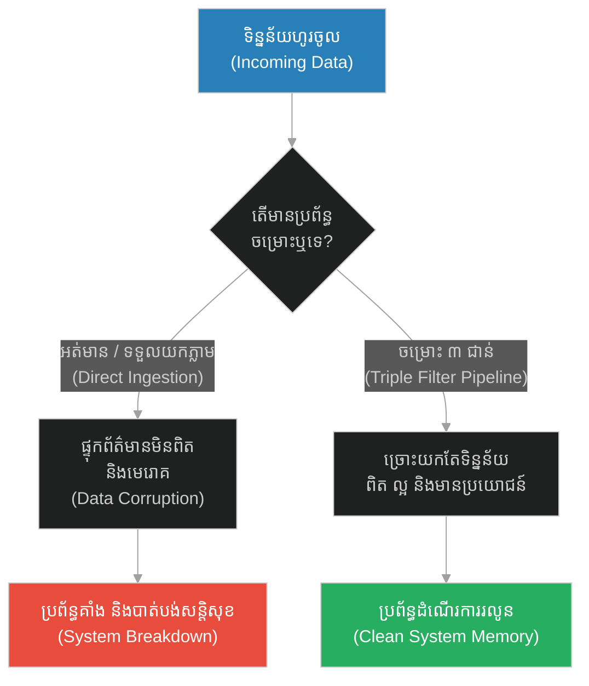
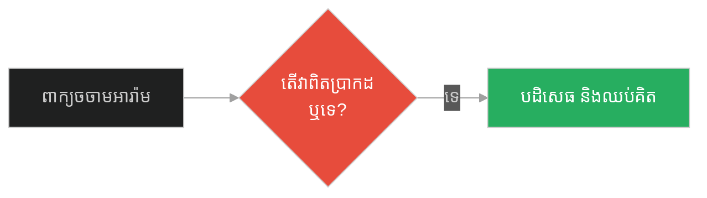
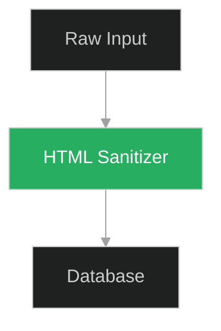
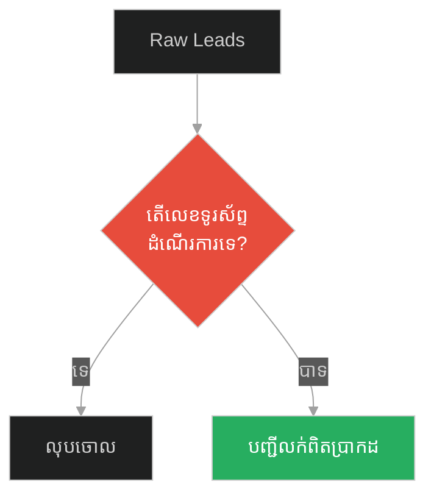
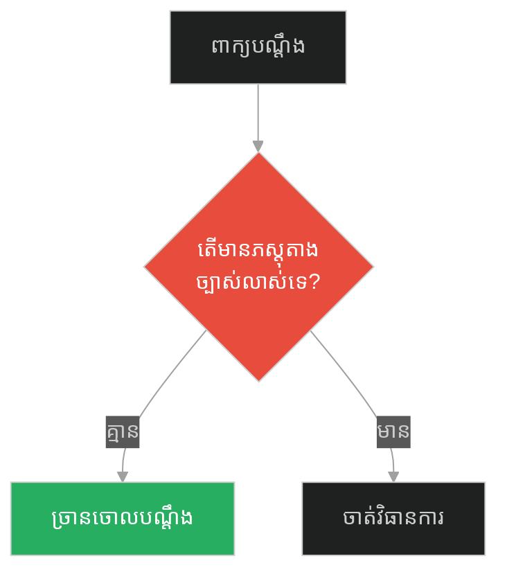
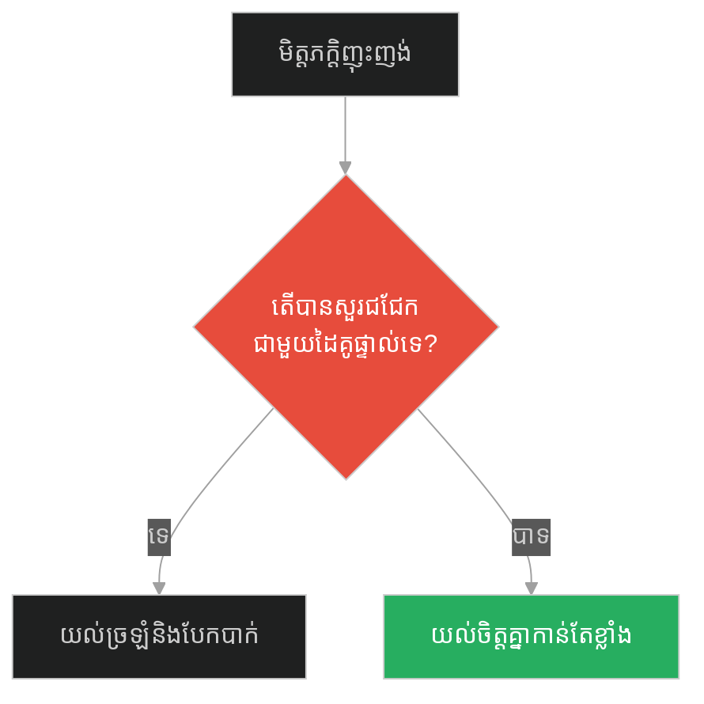
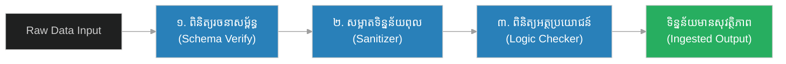

# Multi-Stage Ingestion Pipeline & Data Sanitization (សូក្រាត និងតេស្តចម្រោះ ៣ ជាន់)៖ បំពង់ច្រោះទិន្នន័យច្រើនជាន់ និងការសម្អាតទិន្នន័យ (Multi-Stage Ingestion Pipeline & Data Sanitization & Information Filtering and Validation & Socrates and the Triple Filter Test)

**Author:** ichamrong  
**Date:** 2026-05-28  
**Tags:** #data-pipeline #data-sanitization #input-validation #clean-code #software-engineering  
**Category:** Concepts  
**Read Time:** ~15 min  

---

## 📌 មាតិកា (Table of Contents)
- [អន្ទាក់ផ្លូវចិត្ត (The Trap)](#0)
- [១. រឿងព្រេងនិទាន៖ សូក្រាត និងតេស្តចម្រោះ ៣ ជាន់ (The Legend of Socrates and the Triple Filter Test)](#1)
  - [របាំងការពារស្មារតី និងការច្រោះទិន្នន័យពុល (Mental Gateway and the Rejection of Toxic Data)](#1-1)
- [២. បញ្ហា៖ ការបញ្ចូលទិន្នន័យដោយគ្មានការត្រួតពិនិត្យ (The Issue: Raw Data Ingestion Without Validation)](#2)
- [៣. ឧទាហរណ៍ជាក់ស្តែងក្នុងពិភពពិត (Real World Examples)](#3)
  - [ឧទាហរណ៍ទី ១ — កម្រិតស្រាល (គ្រួសារ)៖ ពាក្យចចាមអារ៉ាមក្នុងភូមិ (The Family Gossip vs Fact Checking)](#3-1)
  - [ឧទាហរណ៍ទី ២ — កម្រិតមធ្យម (បច្ចេកទេស)៖ ការវាយប្រហារតាមរយៈ Form (The Dev Raw Input Injection vs Sanitized Pipeline)](#3-2)
  - [ឧទាហរណ៍ទី ៣ — កម្រិតមធ្យម (ធុរកិច្ច)៖ ទិន្នន័យអតិថិជនឥតប្រយោជន៍ (The Business Raw Lead Spam vs Scrubbed Data)](#3-3)
  - [ឧទាហរណ៍ទី ៤ — កម្រិតមធ្យម (សង្គម/គ្រប់គ្រង)៖ ពាក្យបណ្តឹងអនាមិក (The Management Gossip vs Verifiable HR Inquiry)](#3-4)
  - [ឧទាហរណ៍ទី ៥ — កម្រិតធ្ងន់ (ទំនាក់ទំនង)៖ ការចោទប្រកាន់ពីមិត្តភក្តិ (The Relationship Toxic Third-Party Gossip vs Direct Validation)](#3-5)
- [៤. ដំណោះស្រាយទូទៅ៖ ការបង្កើតបំពង់ច្រោះទិន្នន័យច្រើនជាន់ (The General Solution: Multi-Stage Filtering Pipelines)](#4)
- [សេចក្តីសន្និដ្ឋាន (Conclusion)](#5)
- [ឯកសារយោង (References)](#6)
- [Related Posts](#7)

---

<a id="0"></a>
## អន្ទាក់ផ្លូវចិត្ត (The Trap)

តើយើងគួរដោះស្រាយយ៉ាងដូចម្តេចចំពោះរលកព័ត៌មាន ឬទិន្នន័យដែលហូរចូលមកប្រព័ន្ធរបស់យើងរាល់ថ្ងៃ? អន្ទាក់ផ្លូវចិត្តដ៏ធំបំផុតនៅក្នុងការដោះស្រាយបញ្ហានេះគឺ៖
*   **ការទទួលយកទិន្នន័យដោយគ្មានការរើសអើង (Unfiltered Acceptance)** — ការបើកចំហឱ្យរាល់ទិន្នន័យឆៅហូរចូលជ្រៅទៅក្នុងស្នូលប្រព័ន្ធ ឬខួរក្បាល បណ្តាលឱ្យកើនឡើងកំដៅ និងខូចខាតទិន្នន័យចាស់ៗ។
*   **ការអនុវត្តតម្រងចម្រោះច្រើនជាន់ (Multi-Stage Ingestion)** — ការសាងសង់របាំងការពារជាដំណាក់កាល ដើម្បីច្រោះរកតែទិន្នន័យដែលពិត ល្អ និងមានប្រយោជន៍មុននឹងដំណើរការរក្សាទុក។

1.  **រឿងព្រេងនិទាន (The Legend)** — ការអនុវត្តតេស្តចម្រោះ ៣ ជាន់របស់សូក្រាត ចំពោះពាក្យចចាមអារ៉ាម។
2.  **បញ្ហា (The Issue)** — ការបញ្ចូលទិន្នន័យដែលគ្មានសុវត្ថិភាព នាំឱ្យកើតមានបញ្ហាសន្តិសុខប្រព័ន្ធ (Security Vulnerabilities)។
3.  **ឧទាហរណ៍ជាក់ស្តែង (Real World Examples)** — ការយល់ច្រឡំ និងការខូចខាតដោយសារកង្វះតម្រងចម្រោះក្នុងវិស័យផ្សេងៗ។
4.  **ដំណោះស្រាយ (The General Solution)** — ការសាងសង់ Data Sanitization Pipeline និង Validation Middlewares។



---

<a id="1"></a>
## ១. រឿងព្រេងនិទាន៖ សូក្រាត និងតេស្តចម្រោះ ៣ ជាន់ (The Legend of Socrates and the Triple Filter Test)

សូក្រាត (Socrates) គឺជាទស្សនវិទូជនជាតិក្រិកដ៏អស្ចារ្យម្នាក់ ដែលត្រូវបានគេស្គាល់ថាជាបិតានៃទស្សនវិជ្ជាលោកខាងលិច។ លោកតែងតែបង្រៀនមនុស្សឱ្យចេះត្រិះរិះពិចារណាមុននឹងជឿអ្វីមួយ។

ថ្ងៃមួយ មានបុរសម្នាក់បានរត់មករកសូក្រាតដោយក្តីរំភើប ហើយនិយាយថា៖ *"សូក្រាត! លោកដឹងទេថា ខ្ញុំទើបតែឮរឿងអ្វីខ្លះអំពីសិស្សម្នាក់របស់លោកអម្បាញ់មិញនេះ? ខ្ញុំត្រូវតែប្រាប់លោកភ្លាម!"*

សូក្រាតបានលើកដៃឡើងបញ្ឈប់បុរសនោះ ហើយនិយាយថា៖ *"រង់ចាំសិន! មុននឹងអ្នកប្រាប់ខ្ញុំពីរឿងនោះ ខ្ញុំចង់ឱ្យអ្នកឆ្លងកាត់ការសាកល្បងតូចមួយសិន។ វាត្រូវបានគេហៅថា **ការសាកល្បងតេស្តចម្រោះ ៣ ជាន់ (The Triple Filter Test)**។"*

សូក្រាតចាប់ផ្តើមចោទសួរ៖
1.  **តេស្តទី ១៖ សេចក្តីពិត (Truth)**
    *"តើអ្នកអាចធានាបាន ១០០% ទេថា រឿងដែលអ្នកហៀបនឹងប្រាប់ខ្ញុំនេះ គឺជារឿងពិតប្រាកដ?"* 
    បុរសនោះឆ្លើយថា៖ *"អត់ទេ! ខ្ញុំគ្រាន់តែឮគេនិយាយតៗគ្នាពីមាត់មួយទៅមាត់មួយប៉ុណ្ណោះ។"*
2.  **តេស្តទី ២៖ សេចក្តីល្អ (Goodness)**
    *"ចុះតើរឿងដែលអ្នកចង់ប្រាប់ខ្ញុំពីសិស្សរបស់ខ្ញុំនេះ គឺជារឿងល្អ ឬរឿងអាក្រក់?"*
    បុរសនោះឆ្លើយថា៖ *"អូ វាមិនមែនជារឿងល្អទេ គឺជារឿងអាក្រក់របស់គេ។"*
3.  **តេស្តទី ៣៖ អត្ថប្រយោជន៍ (Usefulness)**
    *"ចុះតើរឿងអាក្រក់ដែលអ្នកចង់ប្រាប់ខ្ញុំនោះ វាមានប្រយោជន៍អ្វីសម្រាប់រូបខ្ញុំដែរឬទេ?"*
    បុរសនោះគិតបន្តិចរួចឆ្លើយថា៖ *"តាមពិតទៅ... វាមិនមានប្រយោជន៍អ្វីដល់លោកនោះទេ។"*

សូក្រាតក៏ញញឹម ហើយសន្និដ្ឋានថា៖ **«បើអ្វីដែលអ្នកចង់ប្រាប់ខ្ញុំ វាមិនប្រាកដថាជារឿងពិត វាមិនមែនជារឿងល្អ ហើយវាក៏គ្មានប្រយោជន៍សម្រាប់ខ្ញុំទៀត... ចុះហេតុអ្វីបានជាអ្នកចង់ប្រាប់ខ្ញុំធ្វើអ្វី?»** បុរសនោះក៏ដើរចេញទៅដោយក្តីអាម៉ាស់។

<a id="1-1"></a>
### របាំងការពារស្មារតី និងការច្រោះទិន្នន័យពុល (Mental Gateway and the Rejection of Toxic Data)

 Climax នៃតេស្តរបស់សូក្រាត គឺការកាត់ផ្តាច់ព័ត៌មានដែលគ្មានប្រភពច្បាស់លាស់នៅត្រឹម "ព្រំដែនប្រព័ន្ធ" (Request Boundary)។ ប្រសិនបើព័ត៌មាននោះធ្លាក់តេស្តណាមួយ វានឹងត្រូវបដិសេធចោលភ្លាមៗ (Fast-Fail Pattern) ដោយមិនអនុញ្ញាតឱ្យវាចូលទៅប្រើប្រាស់ថាមពលខួរក្បាលក្នុងការគិត ឬបង្កើតជាអារម្មណ៍ខឹងក្រោធឡើយ។ នេះគឺជាគំរូដំបូងបង្អស់នៃ **Multi-Stage Middleware Validation**។

---

<a id="2"></a>
## ២. បញ្ហា៖ ការបញ្ចូលទិន្នន័យដោយគ្មានការត្រួតពិនិត្យ (The Issue: Raw Data Ingestion Without Validation)

នៅក្នុងការសរសេរកូដ ប្រសិនបើប្រព័ន្ធរបស់អ្នកទទួលយកទិន្នន័យពី User មកដំណើរការភ្លាមៗដោយគ្មានតម្រងត្រួតពិនិត្យ (Sanitization/Validation) នោះប្រព័ន្ធនឹងងាយរងគ្រោះថ្នាក់ដូចជា SQL Injection, Cross-Site Scripting (XSS), ឬការបញ្ចូលសម្រាមទិន្នន័យ (Data Bloat)។

### Fragile Approach: Raw processing of requests (ការទទួលទិន្នន័យគ្មានការចម្រោះ)
កូដ Python ខាងក្រោមទទួលយកសំណើឆៅពី User រួចយកទៅរក្សាទុកក្នុង Database ផ្ទាល់។ នេះធ្វើឱ្យប្រព័ន្ធងាយរងការវាយប្រហារ។

```python
# ❌ Fragile: ប្រព័ន្ធដំណើរការសំណើឆៅដោយមិនបានចម្រោះ
class UnfilteredDataPipeline:
    def __init__(self):
        self.database = []

    def ingest_data(self, raw_payload):
        # មិនមានការផ្ទៀងផ្ទាត់សោះ (No Validation)
        # អាចមាន SQL Injection ឬ កូដពុល XSS
        print(f"Ingesting raw data: {raw_payload}")
        self.database.append(raw_payload)
        return "Success"

# ការប្រើប្រាស់
bad_pipeline = UnfilteredDataPipeline()
# អ្នកវាយប្រហារបញ្ចូលកូដពុល JavaScript (XSS attack)
bad_pipeline.ingest_data("<script>stealCookies();</script>")
```

### Resilient Approach: Multi-Stage Filtering Pipeline (បំពង់ច្រោះទិន្នន័យច្រើនដំណាក់កាល)
កូដ Python ដ៏រឹងមាំខាងក្រោមបង្កើត Pipeline មួយដែលឆ្លងកាត់ Filter ចំនួន ៣៖ `TruthFilter`, `GoodnessFilter`, និង `UsefulnessFilter` ដូចតេស្តរបស់សូក្រាតអញ្ចឹងដែរ។

```python
import html

# ✅ បង្កើត Base Filter Interface
class DataFilter:
    def process(self, data: dict) -> bool:
        raise NotImplementedError

# ១. តម្រងចម្រោះសេចក្តីពិត (Truth Filter - Schema/Source Validation)
class TruthFilter(DataFilter):
    def process(self, data: dict) -> bool:
        # ត្រួតពិនិត្យប្រភពច្បាស់លាស់ និងរចនាសម្ព័ន្ធទិន្នន័យ
        is_verified_source = data.get("verified_source", False)
        has_content = len(data.get("content", "")) > 0
        return is_verified_source and has_content

# ២. តម្រងចម្រោះសេចក្តីល្អ (Goodness Filter - Sanitization/Safety)
class GoodnessFilter(DataFilter):
    def process(self, data: dict) -> bool:
        # ការពារកូដពុល HTML/Javascript (Sanitization)
        content = data.get("content", "")
        # បំប្លែងកូដ HTML tags ឱ្យទៅជាអត្ថបទធម្មតា (Safe text)
        data["content"] = html.escape(content)
        # ត្រួតពិនិត្យពាក្យអសុរោះ ឬពាក្យជេរ
        toxic_words = ["fuck", "bastard", "scam"]
        return not any(word in content.lower() for word in toxic_words)

# ៣. តម្រងចម្រោះអត្ថប្រយោជន៍ (Usefulness Filter - Business Logic)
class UsefulnessFilter(DataFilter):
    def process(self, data: dict) -> bool:
        # តម្រងចុងក្រោយ៖ ពិនិត្យថាទិន្នន័យនោះមានប្រយោជន៍សម្រាប់ប្រព័ន្ធឬទេ
        score = data.get("usefulness_score", 0)
        return score >= 5

# Pipeline ដែលដំណើរការតម្រងជាលំដាប់ (Sequential Ingestion Pipeline)
class ResilientDataPipeline:
    def __init__(self):
        self.filters = [TruthFilter(), GoodnessFilter(), UsefulnessFilter()]
        self.clean_database = []

    def ingest_data(self, raw_data: dict) -> str:
        current_data = raw_data.copy()
        
        # ដំណើរការច្រោះម្តងមួយជាន់ (Pipeline Processing)
        for data_filter in self.filters:
            if not data_filter.process(current_data):
                print(f"❌ Data Rejected by {data_filter.__class__.__name__}")
                return "Rejected"
        
        # រក្សាទុកតែទិន្នន័យដែលស្អាត និងមានប្រយោជន៍
        self.clean_database.append(current_data)
        print(f"✅ Successfully Ingested: {current_data}")
        return "Accepted"

# ការប្រើប្រាស់៖
pipeline = ResilientDataPipeline()

# សំណើទី ១៖ ធ្លាក់តេស្តសេចក្តីពិត (មិនមែនប្រភពច្បាស់លាស់)
pipeline.ingest_data({"content": "I heard a rumor about Jack.", "verified_source": False, "usefulness_score": 10})

# សំណើទី ២៖ ធ្លាក់តេស្តសេចក្តីល្អ (មានកូដពុល/ពាក្យជេរ)
pipeline.ingest_data({"content": "Jack is a bastard", "verified_source": True, "usefulness_score": 10})

# សំណើទី ៣៖ ទិន្នន័យសុវត្ថិភាព និងមានប្រយោជន៍
pipeline.ingest_data({"content": "Fix code bug in production", "verified_source": True, "usefulness_score": 9})
```

---

<a id="3"></a>
## ៣. ឧទាហរណ៍ជាក់ស្តែងក្នុងពិភពពិត (Real World Examples)

<a id="3-1"></a>
### ឧទាហរណ៍ទី ១ — កម្រិតស្រាល (គ្រួសារ)៖ ពាក្យចចាមអារ៉ាមក្នុងភូមិ (The Family Gossip vs Fact Checking)
*   **Failure Scenario:** សមាជិកគ្រួសារជឿលើព័ត៌មានចចាមអារ៉ាមពីអ្នកជិតខាងភ្លាមៗ នាំឱ្យមានការឈ្លោះប្រកែកគ្នា។
*   **Remediation:** គ្រួសារអនុវត្តវិធីសួរបញ្ជាក់ការពិតជាមុន មុននឹងសម្រេចចិត្តជឿ ឬខឹង។



<a id="3-2"></a>
### ឧទាហរណ៍ទី ២ — កម្រិតមធ្យម (បច្ចេកទេស)៖ ការវាយប្រហារតាមរយៈ Form (The Dev Raw Input Injection vs Sanitized Pipeline)
*   **Failure Scenario:** គេហទំព័រអនុញ្ញាតឱ្យ User បញ្ចូល Comments ដោយមិនបាន Escape HTML នាំឱ្យ Hacker បញ្ចូល Script លួចយកទិន្នន័យ (XSS Attack)។
*   **Remediation:** អនុវត្តតម្រងចម្រោះអត្ថបទ HTML Escape និងសម្លាប់រាល់ Script ដែលមាននៅក្នុង input។



<a id="3-3"></a>
### ឧទាហរណ៍ទី ៣ — កម្រិតមធ្យម (ធុរកិច្ច)៖ ទិន្នន័យអតិថិជនឥតប្រយោជន៍ (The Business Raw Lead Spam vs Scrubbed Data)
*   **Failure Scenario:** ក្រុមលក់ទូរស័ព្ទទៅកាន់អតិថិជន (Cold Calling) ដោយប្រើប្រាស់បញ្ជីឈ្មោះទិញមកពីខាងក្រៅ ដែលពោរពេញដោយលេខងាប់ នាំឱ្យខាតពេល និងកម្លាំង។
*   **Remediation:** ប្រើកម្មវិធីផ្ទៀងផ្ទាត់លេខទូរស័ព្ទ និងគណនីអ៊ីមែល (Scrubbing tool) ដើម្បីលុបចោល Spam Leads។



<a id="3-4"></a>
### ឧទាហរណ៍ទី ៤ — កម្រិតមធ្យម (សង្គម/គ្រប់គ្រង)៖ ពាក្យបណ្តឹងអនាមិក (The Management Gossip vs Verifiable HR Inquiry)
*   **Failure Scenario:** ប្រធាននាយកដ្ឋានដាក់ទណ្ឌកម្មលើបុគ្គលិកភ្លាមៗ ក្រោយឮពាក្យបណ្តឹងដោយគ្មានភស្តុតាង ធ្វើឱ្យបាត់បង់សាមគ្គីភាព។
*   **Remediation:** ផ្នែកធនធានមនុស្សបង្កើតដំណើរការស៊ើបអង្កេត ៣ ជំហាន (សាកសួរដើមហេតុ ស្វែងរកភស្តុតាង និងផលប៉ះពាល់ការងារ) មុននឹងដាក់ពិន័យ។



<a id="3-5"></a>
### ឧទាហរណ៍ទី ៥ — កម្រិតធ្ងន់ (ទំនាក់ទំនង)៖ ការចោទប្រកាន់ពីមិត្តភក្តិ (The Relationship Toxic Third-Party Gossip vs Direct Validation)
*   **Failure Scenario:** គូស្នេហ៍សម្រេចចិត្តលែងលះគ្នា ក្រោយស្តាប់ពាក្យញុះញង់របស់មិត្តភក្តិដែលនិយាយអាក្រក់ពីដៃគូខ្លួន ដោយគ្មានការផ្ទៀងផ្ទាត់។
*   **Remediation:** អនុវត្តតម្រងចម្រោះ៖ "តើព័ត៌មាននេះល្អដល់ស្នេហាខ្ញុំទេ? តើវាពិតទេ?" និងជជែកជាមួយដៃគូដោយផ្ទាល់។



---

<a id="4"></a>
## ៤. ដំណោះស្រាយទូទៅ៖ ការបង្កើតបំពង់ច្រោះទិន្នន័យច្រើនជាន់ (The General Solution: Multi-Stage Filtering Pipelines)

ដំណោះស្រាយជាសកលចំពោះការទប់ស្កាត់ព័ត៌មានពុល គឺការបង្កើតប្រព័ន្ធចម្រោះជាលំដាប់លំដោយ (Pipeline Architecture)។

### ជំហានកសាងប្រព័ន្ធ៖
1.  **Ingestion & Schema Check (Truth Stage):** ផ្ទៀងផ្ទាត់ថាព័ត៌មានមានប្រភពច្បាស់លាស់ និងត្រូវទម្រង់។
2.  **Sanitization & Security (Goodness Stage):** សម្អាតជាតិពុល ឬកូដបង្កប់ទាំងឡាយចេញពីទិន្នន័យ។
3.  **Semantic Evaluation (Usefulness Stage):** វាយតម្លៃតម្លៃនៃខ្លឹមសារ បើគ្មានប្រយោជន៍ទេ មិនដំណើរការឡើយ។



---

<a id="5"></a>
## សេចក្តីសន្និដ្ឋាន (Conclusion)

> **«មុននឹងអនុញ្ញាតឱ្យព័ត៌មានណាមួយចូលមកបំពុលចិត្ត ឬប្រព័ន្ធរបស់អ្នក សូមសួរខ្លួនឯងសិនថា៖ តើវាពិតទេ? តើវាល្អទេ? តើវាមានប្រយោជន៍ទេ? បើមិនពិត មិនល្អ ហើយគ្មានប្រយោជន៍ គ្មានហេតុផលណាដែលត្រូវរក្សាទុកវាឡើយ។»**

ការការពារខួរក្បាល និងប្រព័ន្ធបច្ចេកវិទ្យារបស់យើងពីការបំពុល មិនមែនជាការបិទភ្នែកបិទត្រចៀកនោះទេ ប៉ុន្តែជាការសាងសង់តម្រងចម្រោះដ៏ឆ្លាតវៃ។ តាមរយៈការអនុវត្ត **Multi-Stage Ingestion Pipeline** យើងអាចរក្សាបាននូវភាពស្ងប់ស្ងាត់ផ្លូវចិត្ត និងស្ថិរភាពប្រព័ន្ធជានិរន្តរ៍។

---

<a id="6"></a>
## ឯកសារយោង (References)

*   **Socrates' Triple Filter Test** — An ancient Greek philosophical framework for ethical speech and information reception.
*   **Data Ingestion Patterns** — Industry best practices for designing scalable and secure data loading pipelines.
*   **OWASP Top 10 (Injection & XSS Prevention)** — Global standards for sanitizing user inputs to prevent security breaches in applications.

---

<a id="7"></a>
## Related Posts

*   [[Protocol Standardization & Universal Interfaces] (ធម្មទេសនាចុងក្រោយរបស់ព្យាការី)](./220-prophet-and-the-final-sermon.md) — Common contracts and decoupled systems.
*   [[Active Health Checks & Continuous Monitoring] (សូក្រាត និងជីវិតដែលមិនបានត្រួតពិនិត្យ)](./222-socrates-and-the-unexamined-life.md) — System Heartbeats and Liveness Probes.

## 🐇 ធ្លាក់ចូលក្នុងរន្ធទន្សាយ (Enter the Rabbit Hole)
ដើម្បីស្វែងយល់បន្ថែមអំពីការពិនិត្យសុខភាពប្រព័ន្ធ និងការត្រួតពិនិត្យសកម្ម សូមបន្តដំណើរទៅកាន់៖

* 🚀 **[ចាប់ផ្តើមដំណើររុករក (Start the Journey) ➔ Active Health Checks & Continuous Monitoring (សូក្រាត និងជីវិតដែលមិនបានត្រួតពិនិត្យ)៖ ការពិនិត្យសុខភាពសកម្ម និងការត្រួតពិនិត្យជាប្រចាំ (Active Health Checks & Continuous Monitoring & System Heartbeats and Liveness Probes & Socrates and the Unexamined Life)](./222-socrates-and-the-unexamined-life.md)**
