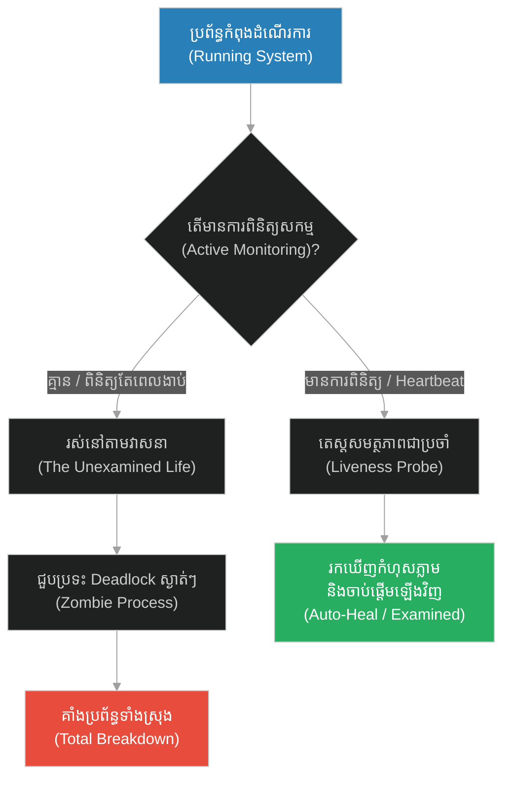
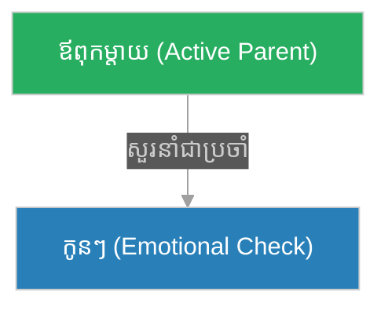
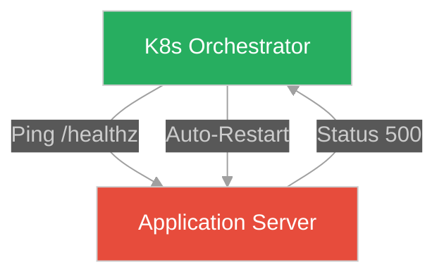
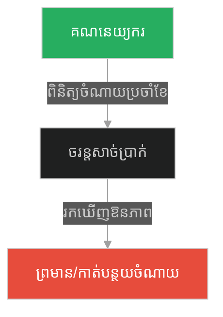
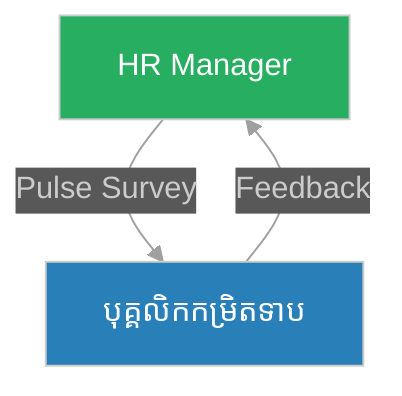
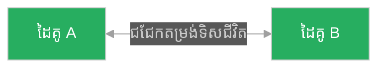
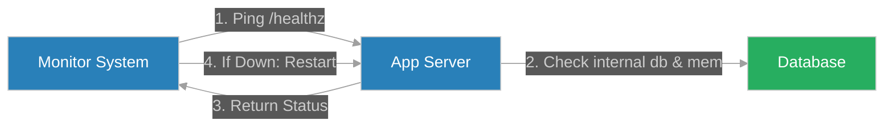

# Active Health Checks & Continuous Monitoring (សូក្រាត និងជីវិតដែលមិនបានត្រួតពិនិត្យ)៖ ការពិនិត្យសុខភាពសកម្ម និងការត្រួតពិនិត្យជាប្រចាំ (Active Health Checks & Continuous Monitoring & System Heartbeats and Liveness Probes & Socrates and the Unexamined Life)

**Author:** ichamrong  
**Date:** 2026-05-28  
**Tags:** #active-health-checks #continuous-monitoring #liveness-probes #system-reliability #software-engineering  
**Category:** Concepts  
**Read Time:** ~15 min  

---

## 📌 មាតិកា (Table of Contents)
- [អន្ទាក់ផ្លូវចិត្ត (The Trap)](#0)
- [១. រឿងព្រេងនិទាន៖ ការកាត់ក្តីសូក្រាត (The Legend of Socrates and the Unexamined Life)](#1)
  - [ជម្រើសរវាងការរស់ដោយស្វ័យប្រវត្តិ និងការត្រួតពិនិត្យសកម្ម (The Choice Between Auto-Pilot and Continuous Self-Examination)](#1-1)
- [២. បញ្ហា៖ ការបង្កកប្រព័ន្ធដោយស្ងៀមស្ងាត់ (The Issue: Silent System Hanging & Deadlocks)](#2)
- [៣. ឧទាហរណ៍ជាក់ស្តែងក្នុងពិភពពិត (Real World Examples)](#3)
  - [ឧទាហរណ៍ទី ១ — កម្រិតស្រាល (គ្រួសារ)៖ សុខភាពផ្លូវចិត្តសមាជិកគ្រួសារ (The Family Silent Suffering vs Weekly Family Check-ins)](#3-1)
  - [ឧទាហរណ៍ទី ២ — កម្រិតមធ្យម (បច្ចេកទេស)៖ ប្រព័ន្ធជាប់គាំងតែ Process នៅដំណើរការ (The Dev Process Alive vs Liveness Probe Failure)](#3-2)
  - [ឧទាហរណ៍ទី ៣ — កម្រិតមធ្យម (ធុរកិច្ច)៖ ឱនភាពហិរញ្ញវត្ថុដោយមិនដឹងខ្លួន (The Business Silent Cash Drain vs Active Financial Audits)](#3-3)
  - [ឧទាហរណ៍ទី ៤ — កម្រិតមធ្យម (សង្គម/គ្រប់គ្រង)៖ ស្មារតីក្រុមបាក់ស្រុត (The Management Silent Resignation vs Regular Pulse Surveys)](#3-4)
  - [ឧទាហរណ៍ទី ៥ — កម្រិតធ្ងន់ (ទំនាក់ទំនង)៖ ភាពត្រជាក់ស្រេបនៃស្នេហា (The Relationship Unchecked Drift vs Continuous Alignment)](#3-5)
- [៤. ដំណោះស្រាយទូទៅ៖ ការបង្កើតប្រព័ន្ធពិនិត្យសុខភាពសកម្ម (The General Solution: Active Probes & Heartbeats)](#4)
- [សេចក្តីសន្និដ្ឋាន (Conclusion)](#5)
- [ឯកសារយោង (References)](#6)
- [Related Posts](#7)

---

<a id="0"></a>
## អន្ទាក់ផ្លូវចិត្ត (The Trap)

តើយើងដឹងដោយរបៀបណាថាប្រព័ន្ធបច្ចេកវិទ្យា ឬជីវិតរបស់យើងកំពុងដំណើរការបានល្អពិតប្រាកដ ឬក៏កំពុងតែងាប់ជាបណ្តើរៗពីខាងក្នុង? អន្ទាក់ផ្លូវចិត្តដ៏គ្រោះថ្នាក់បំផុតគឺ៖
*   **ការរស់នៅដោយមិនបានត្រួតពិនិត្យ (Unexamined State / Silent Failure)** — ការសន្មតថាអ្វីៗគ្រប់យ៉ាងគ្មានបញ្ហា ដរាបណាវាមិនទាន់បែកបាក់ ឬគាំងទាំងស្រុង។ នេះហៅថាការរស់នៅលើ auto-pilot។
*   **ការពិនិត្យសុខភាពសកម្ម (Active Examination / Liveness Checking)** — ការសាកសួរ និងតេស្តសុខភាពប្រព័ន្ធជាប្រចាំ ដើម្បីរកឃើញចំណុចខូចខាត (Deadlocks, Memory Leaks) មុនពេលវាបង្កជាមហន្តរាយ។

1.  **រឿងព្រេងនិទាន (The Legend)** — ការកាត់ក្តីសូក្រាត និងទស្សនៈ "ជីវិតដែលមិនបានត្រួតពិនិត្យ មិនសមជារស់"។
2.  **បញ្ហា (The Issue)** — កូដដែលដំណើរការតែជួបប្រទះការបង្កក (Zombie Process) តែគ្មានប្រព័ន្ធណារាយការណ៍។
3.  **ឧទាហរណ៍ជាក់ស្តែង (Real World Examples)** — គ្រោះថ្នាក់នៃការខ្វះការត្រួតពិនិត្យក្នុងជីវិតការងារ និងស្នេហា។
4.  **ដំណោះស្រាយ (The General Solution)** — ការអនុវត្ត Liveness/Readiness Probes នៅក្នុងស្ថាបត្យកម្មប្រព័ន្ធទំនើប។



---

<a id="1"></a>
## ១. រឿងព្រេងនិទាន៖ ការកាត់ក្តីសូក្រាត (The Legend of Socrates and the Unexamined Life)

សូក្រាតមិនដែលសរសេរសៀវភៅសូម្បីតែមួយក្បាល។ អ្វីដែលគាត់ធ្វើពេញមួយជីវិត គឺការដើរនៅតាមទីសាធារណៈក្នុងទីក្រុងអាថែន (Athens) សួរសំណួរទៅកាន់មនុស្សទូទៅ តាំងពីអ្នកក្ររហូតដល់អ្នកនយោបាយ ដើម្បីឱ្យពួកគេចេះគិត និងសង្ស័យពីជំនឿរបស់ខ្លួនឯង។

ដោយសារតែការធ្វើបែបនេះ អ្នកនយោបាយដែលមានអំណាចមានការខឹងសម្បារយ៉ាងខ្លាំង ព្រោះសូក្រាតបានធ្វើឱ្យពួកគេបាក់មុខ និងធ្វើឱ្យយុវជនចេះមានគំនិតឯករាជ្យ។ ទីបំផុត ពួកគេបានចាប់សូក្រាតយកទៅកាត់ក្តី ដោយចោទប្រកាន់ថា "បំពុលគំនិតយុវជន និងប្រមាថព្រះ"។

នៅក្នុងតុលាការ ចៅក្រមបានផ្តល់ជម្រើសមួយឱ្យសូក្រាត គឺ៖ ប្រសិនបើគាត់ព្រមបញ្ឈប់ការដើរសួរសំណួរ និងបញ្ឈប់ការបង្រៀនទស្សនវិជ្ជា ពួកគេនឹងដោះលែងគាត់ឱ្យមានសេរីភាពវិញ។ តែបើគាត់មិនព្រម គាត់នឹងត្រូវប្រហារជីវិត។

សូក្រាតបានបដិសេធជម្រើសនោះ ដោយបញ្ចេញនូវប្រយោគដ៏ល្បីល្បាញបំផុតក្នុងប្រវត្តិសាស្ត្រទស្សនវិជ្ជាថា៖

> **«ជីវិតដែលមិនបានឆ្លងកាត់ការត្រួតពិនិត្យ គឺជាជីវិតដែលមិនស័ក្តិសមនឹងរស់នៅនោះទេ។ (The unexamined life is not worth living.)»**

លោកចង់ប្រាប់ថា ការរស់នៅដោយគ្រាន់តែដកដង្ហើម ហូបចុក និងធ្វើតាមអ្វីដែលសង្គមប្រាប់ឱ្យធ្វើ ដោយមិនដែលសួរខ្លួនឯងថា "តើខ្ញុំជានរណា? ខ្ញុំរស់នៅដើម្បីអ្វី? អ្វីទៅជាសេចក្តីល្អ?" វាប្រៀបបាននឹងការរស់នៅដូចសត្វពាហនៈអញ្ចឹង។ សម្រាប់លោក ការស្លាប់គឺប្រសើរជាងការរស់នៅដោយខ្វះការត្រិះរិះពិចារណា។

<a id="1-1"></a>
### ជម្រើសរវាងការរស់ដោយស្វ័យប្រវត្តិ និងការត្រួតពិនិត្យសកម្ម (The Choice Between Auto-Pilot and Continuous Self-Examination)

Climax នៃជីវិតរបស់សូក្រាត គឺការសុខចិត្តផឹកថ្នាំពុល (Hemlock) ជាជាងរស់នៅក្នុងជីវិតដែលត្រូវបានគេហាមឃាត់មិនឱ្យសួរសំណួរ។ លោកចាត់ទុកការរស់នៅដោយគ្មានការឆ្លុះបញ្ចាំង (Self-reflection) ថាជាភាពល្ងីល្ងើ និងជាការស្លាប់ខាងស្មារតីរួចទៅហើយ។ ការត្រួតពិនិត្យខ្លួនឯងជាប្រចាំ គឺជាឧបករណ៍តែមួយគត់សម្រាប់រក្សាគំនិតឱ្យមានសុខភាពល្អ និងរស់នៅក្នុងសច្ចធម៌។

---

<a id="2"></a>
## ២. បញ្ហា៖ ការបង្កកប្រព័ន្ធដោយស្ងៀមស្ងាត់ (The Issue: Silent System Hanging & Deadlocks)

នៅក្នុងវិស្វកម្មប្រព័ន្ធ (Systems Engineering) ប្រសិនបើយើងគ្រាន់តែពិនិត្យមើលថា Process របស់ Server កំពុងដំណើរការ (Process is Running) វាមិនទាន់គ្រប់គ្រាន់ឡើយ។ ជារឿយៗ Server អាចនឹងគាំងដោយសារ Deadlock, បញ្ហា Memory Leak ឬការបាត់បង់ការតភ្ជាប់ជាមួយ Database ខាងក្រោយ ទោះបីជា Process របស់វាបង្ហាញថា "Running" ក៏ដោយ។ នេះហៅថា **Zombie State**។

### Fragile Approach: Passive Monitoring (ការត្រួតពិនិត្យអសកម្ម)
កូដ TypeScript ខាងក្រោមបង្ហាញពី Server ដែលគាំងគន្លឹះជាប់ (Deadlock) តែប្រព័ន្ធខាងក្រៅនៅតែគិតថាវាដំណើរការ ព្រោះវាគ្មាន Endpoint សម្រាប់ពិនិត្យសុខភាពខាងក្នុងឡើយ។

```typescript
// ❌ គ្មានប្រព័ន្ធពិនិត្យសុខភាពសកម្ម
import * as http from "http";

let isSystemLocked = false;

const server = http.createServer((req, res) => {
    if (req.url === "/cause-deadlock") {
        isSystemLocked = true; // ប្រព័ន្ធជួបប្រទះការបង្កក (Deadlock)
        res.end("Deadlock initiated.");
        return;
    }

    if (isSystemLocked) {
        // ប្រព័ន្ធគាំងជាប់រហូត មិនឆ្លើយតបសំណើរបស់ User ទៀតឡើយ
        // ប៉ុន្តែ Process របស់ node.js មិនបានស្លាប់ទេ (Status: Running)
        console.log("System locked. Ignoring request...");
        return; 
    }

    res.writeHead(200, { "Content-Type": "text/plain" });
    res.end("Hello World");
});

server.listen(3000, () => {
    console.log("Server running passively on port 3000...");
});
```

### Resilient Approach: Liveness and Readiness Probes (ការត្រួតពិនិត្យសុខភាពសកម្ម)
កូដ TypeScript ដ៏រឹងមាំខាងក្រោមបន្ថែម `/healthz` endpoint សម្រាប់ពិនិត្យសុខភាពសកម្ម (Liveness Check) ដោយតេស្តមើលទាំងសមត្ថភាពឆ្លើយតប និងទំនាក់ទំនងជាមួយ Database។

```typescript
// ✅ បង្កើតប្រព័ន្ធពិនិត្យសុខភាពសកម្ម (Active Health Checking)
import * as http from "http";

let databaseConnected = true;
let isDeadlocked = false;

// មុខងារត្រួតពិនិត្យសុខភាពផ្ទៃក្នុង
function checkInternalHealth(): { status: number; message: string } {
    if (isDeadlocked) {
        return { status: 500, message: "CRITICAL: System Deadlocked" };
    }
    if (!databaseConnected) {
        return { status: 503, message: "WARN: Database Connection Down" };
    }
    return { status: 200, message: "OK: System Healthy" };
}

const resilientServer = http.createServer((req, res) => {
    // Active Health Check Endpoint (ដូចទៅនឹង Liveness Probe របស់ Kubernetes)
    if (req.url === "/healthz") {
        const health = checkInternalHealth();
        res.writeHead(health.status, { "Content-Type": "application/json" });
        res.end(JSON.stringify({ status: health.status === 200 ? "UP" : "DOWN", details: health.message }));
        return;
    }

    if (req.url === "/simulate-db-failure") {
        databaseConnected = false;
        res.end("Database connection simulated failure.");
        return;
    }

    if (req.url === "/simulate-deadlock") {
        isDeadlocked = true;
        res.end("Deadlock simulated.");
        return;
    }

    res.writeHead(200, { "Content-Type": "text/plain" });
    res.end("Resilient Server Responding.");
});

resilientServer.listen(3000, () => {
    console.log("Resilient Server running with active health check on port 3000...");
});
```

---

<a id="3"></a>
## ៣. ឧទាហរណ៍ជាក់ស្តែងក្នុងពិភពពិត (Real World Examples)

<a id="3-1"></a>
### ឧទាហរណ៍ទី ១ — កម្រិតស្រាល (គ្រួសារ)៖ សុខភាពផ្លូវចិត្តសមាជិកគ្រួសារ (The Family Silent Suffering vs Weekly Family Check-ins)
*   **Failure Scenario:** ឪពុកម្តាយគិតថាកូនៗគ្មានបញ្ហា ព្រោះពួកគេមិនដែលត្អូញត្អែរ រហូតដល់កូនកើតជំងឺបាក់ទឹកចិត្តធ្ងន់ធ្ងរ។
*   **Remediation:** បង្កើតវប្បធម៌ជួបជុំគ្នាជជែកពិភាក្សារាល់ចុងសប្តាហ៍ ដើម្បីពិនិត្យសុខភាពផ្លូវចិត្តគ្នាទៅវិញទៅមក (Emotional Health Check)។



<a id="3-2"></a>
### ឧទាហរណ៍ទី ២ — កម្រិតមធ្យម (បច្ចេកទេស)៖ ប្រព័ន្ធជាប់គាំងតែ Process នៅដំណើរការ (The Dev Process Alive vs Liveness Probe Failure)
*   **Failure Scenario:** Docker Container គាំងមិនឆ្លើយតប API តែ Docker Engine នៅតែបង្ហាញថា Container "Up" នាំឱ្យអតិថិជនប្រើប្រាស់មិនបាន។
*   **Remediation:** ប្រើប្រាស់ Kubernetes Liveness Probe ដើម្បីទាញយកទិន្នន័យពី `/healthz` រៀងរាល់ ១០វិនាទីម្តង។ បើធ្លាក់តេស្ត វានឹង Restart Container ស្វ័យប្រវត្តិ។



<a id="3-3"></a>
### ឧទាហរណ៍ទី ៣ — កម្រិតមធ្យម (ធុរកិច្ច)៖ ឱនភាពហិរញ្ញវត្ថុដោយមិនដឹងខ្លួន (The Business Silent Cash Drain vs Active Financial Audits)
*   **Failure Scenario:** អាជីវកម្មមួយខាតបង់ថវិកាបន្តិចម្តងៗលើការចំណាយលាក់កំបាំង រហូតដល់ដាច់លុយបង្វិលសងទើបដឹងខ្លួន។
*   **Remediation:** បង្កើតរបាយការណ៍ហិរញ្ញវត្ថុប្រចាំខែ (Monthly Audits) និងកំណត់កម្រិតព្រមានលើការចំណាយ (Budget Thresholds)។



<a id="3-4"></a>
### ឧទាហរណ៍ទី ៤ — កម្រិតមធ្យម (សង្គម/គ្រប់គ្រង)៖ ស្មារតីក្រុមបាក់ស្រុត (The Management Silent Resignation vs Regular Pulse Surveys)
*   **Failure Scenario:** ប្រធានក្រុមជឿជាក់ថាបុគ្គលិកសប្បាយចិត្ត ព្រោះមិនសូវមានជម្លោះ ស្រាប់តែបុគ្គលិកសំខាន់ៗលាលែងពីការងារព្រមៗគ្នា។
*   **Remediation:** បង្កើតការស្ទង់មតិសម្ងាត់ប្រចាំខែ (Pulse Surveys) និងការជជែកផ្ទាល់ម្នាក់ម្តង (One-on-One Meetings) ដើម្បីដឹងពីបញ្ហាផ្លូវចិត្តបុគ្គលិក។



<a id="3-5"></a>
### ឧទាហរណ៍ទី ៥ — កម្រិតធ្ងន់ (ទំនាក់ទំនង)៖ ភាពត្រជាក់ស្រេបនៃស្នេហា (The Relationship Unchecked Drift vs Continuous Alignment)
*   **Failure Scenario:** គូស្វាមីភរិយារស់នៅជាមួយគ្នាដោយគ្មានបញ្ហាឈ្លោះប្រកែក តែគ្មានភាពស្និទ្ធស្នាល (Silent drift) រហូតដល់ថ្ងៃមួយមានអារម្មណ៍ដូចជាអ្នកដទៃ។
*   **Remediation:** បង្កើតទម្លាប់សួរនាំគ្នា និងរៀបចំគម្រោងដើរលេងពីរនាក់ជាប្រចាំ ដើម្បីត្រួតពិនិត្យសុភមង្គលអាពាហ៍ពិពាហ៍។



---

<a id="4"></a>
## ៤. ដំណោះស្រាយទូទៅ៖ ការបង្កើតប្រព័ន្ធពិនិត្យសុខភាពសកម្ម (The General Solution: Active Probes & Heartbeats)

ដំណោះស្រាយដ៏ត្រឹមត្រូវចំពោះបញ្ហា Zombie System គឺការបង្កើតយន្តការ **Active Self-Examination (ការពិនិត្យសុខភាពដោយខ្លួនឯងជាប្រចាំ)**។

### ជំហានកសាងប្រព័ន្ធ៖
1.  **Expose Metrics:** បង្កើត endpoint ដែលបង្ហាញស្ថានភាពសុខភាពពិតប្រាកដរបស់ប្រព័ន្ធ (ល្បឿនដំណើរការ, ទំហំមេម៉ូរី, ការតភ្ជាប់)។
2.  **Define Liveness check:** កំណត់លក្ខខណ្ឌដែលចាត់ទុកថាប្រព័ន្ធលែងឆ្លើយតប (Hangs)។
3.  **Automatic Recovery:** ប្រព័ន្ធគ្រប់គ្រង (Orchestrator) ត្រូវតែមានសិទ្ធិកម្ទេច និងបង្កើតឡើងវិញ (Restart/Re-create) នៅពេលដែល Health check ធ្លាក់ចុះ។



---

<a id="5"></a>
## សេចក្តីសន្និដ្ឋាន (Conclusion)

> **«ជីវិត ឬប្រព័ន្ធដែលមិនបានឆ្លងកាត់ការត្រួតពិនិត្យជាប្រចាំ គឺជាជីវិត ឬប្រព័ន្ធដែលមិនស័ក្តិសមនឹងដំណើរការនោះឡើយ។ សន្តិសុខកើតឡើងពីការសង្កេត មិនមែនកើតឡើងពីការសន្មតដោយងងឹតងងុលនោះទេ។»**

ការរស់នៅដោយគ្មានស្មារតី និងការរចនាប្រព័ន្ធដែលគ្មាន Monitoring គឺជាហានិភ័យដ៏ធំបំផុត។ មានតែការពិនិត្យ សួរនាំ និងត្រួតពិនិត្យដោយខ្លួនឯងជាប្រចាំ (Continuous Active Health Checks) ដូចដែលសូក្រាតបានបង្រៀនប៉ុណ្ណោះ ទើបប្រព័ន្ធ និងជីវិតរបស់យើងអាចរក្សាបាននូវភាពធន់ រឹងមាំ និងអភិវឌ្ឍន៍ទៅមុខជានិរន្តរ៍។

---

<a id="6"></a>
## ឯកសារយោង (References)

*   **Plato's Apology (38a)** — The historical account of Socrates' trial and his defense of philosophical self-examination.
*   **Kubernetes Liveness and Readiness Probes** — The definitive guide on configuring active checks to ensure container reliability.
*   **SRE Book (Site Reliability Engineering by Google)** — Best practices for system monitoring, alerting, and automated recovery loops.

---

<a id="7"></a>
## Related Posts

*   [[Multi-Stage Ingestion Pipeline & Data Sanitization] (សូក្រាត និងតេស្តចម្រោះ ៣ ជាន់)](./221-socrates-and-the-triple-filter-test.md) — Multi-Stage Ingestion Pipeline and Data Sanitization.
*   [[Graceful Ignorance & Fallback Error Handling] (សូក្រាត និងការដឹងថាខ្លួនមិនដឹងអ្វីសោះ)](./223-socrates-and-knowing-nothing.md) — Fallback error handling and graceful ignorance.

## 🐇 ធ្លាក់ចូលក្នុងរន្ធទន្សាយ (Enter the Rabbit Hole)
ដើម្បីស្វែងយល់បន្ថែមអំពីការគ្រប់គ្រងកំហុសដែលមិនដឹងខ្លួន និងប្រព័ន្ធបម្រុង សូមបន្តដំណើរទៅកាន់៖

* 🚀 **[ចាប់ផ្តើមដំណើររុករក (Start the Journey) ➔ Graceful Ignorance & Fallback Error Handling (សូក្រាត និងការដឹងថាខ្លួនមិនដឹងអ្វីសោះ)៖ ភាពល្ងង់ខ្លៅដោយអនុគ្រោះ និងការដោះស្រាយកំហុសបម្រុង (Graceful Ignorance & Fallback Error Handling & Socratic Paradox and Fail-Safe Mechanisms & Socrates and Knowing Nothing)](./223-socrates-and-knowing-nothing.md)**
