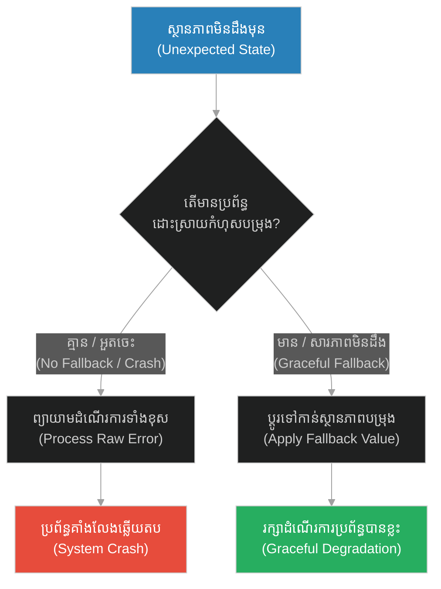
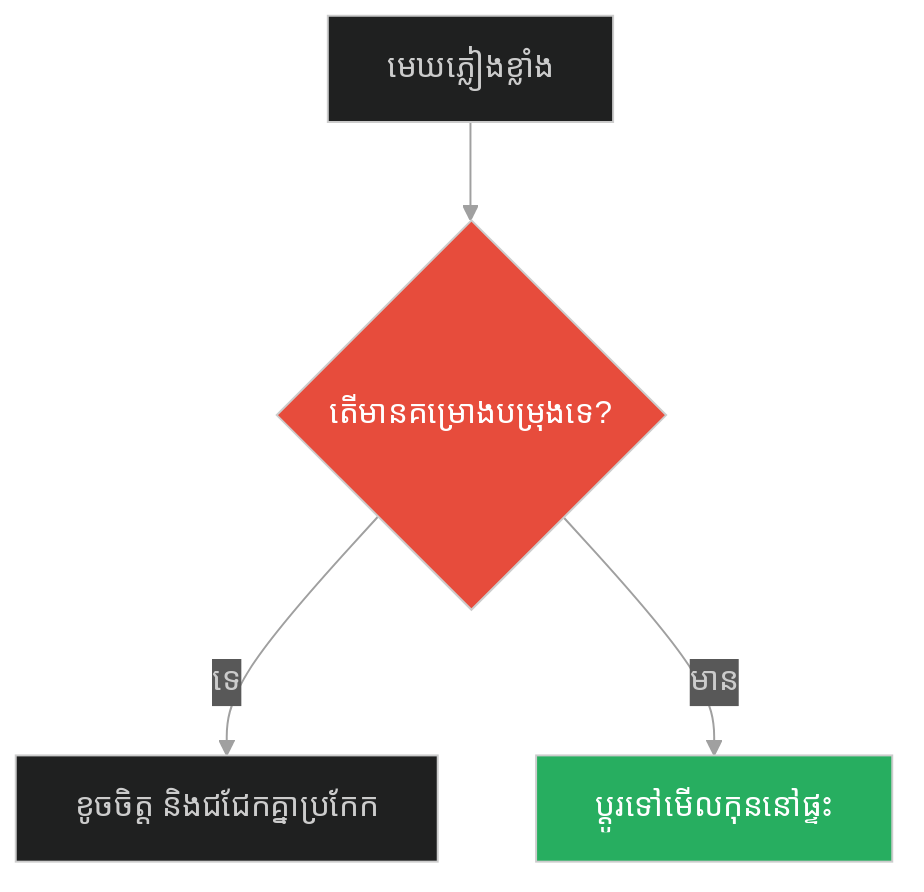
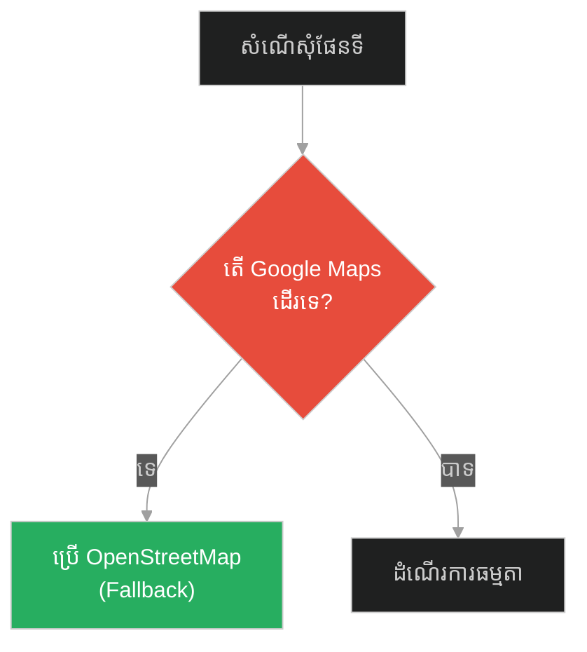
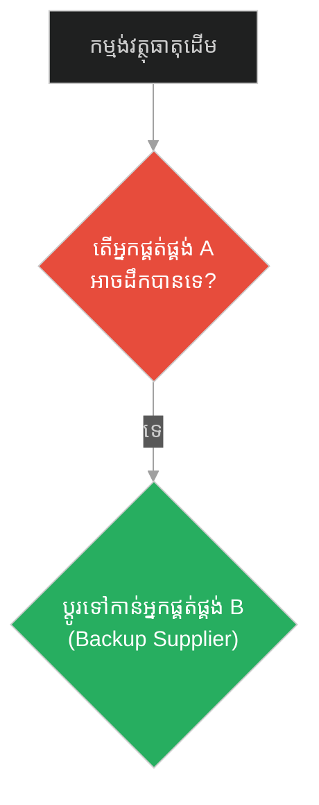
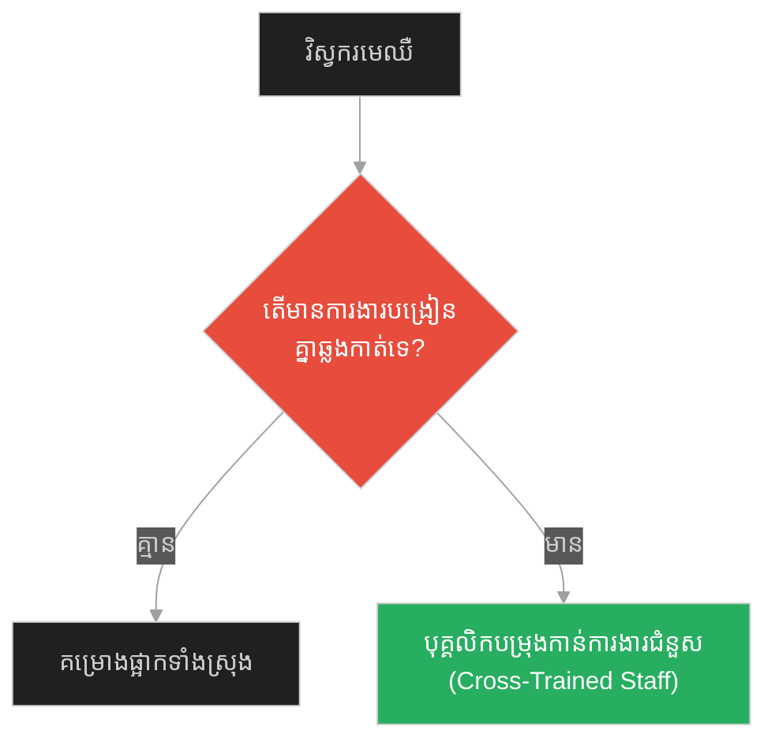
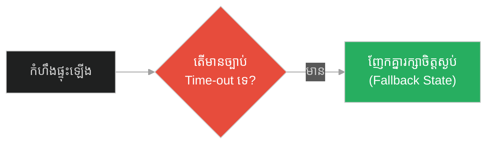
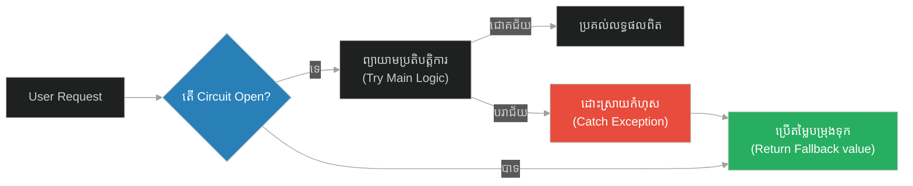

# Graceful Ignorance & Fallback Error Handling (សូក្រាត និងការដឹងថាខ្លួនមិនដឹងអ្វីសោះ)៖ ភាពល្ងង់ខ្លៅដោយអនុគ្រោះ និងការដោះស្រាយកំហុសបម្រុង (Graceful Ignorance & Fallback Error Handling & Socratic Paradox and Fail-Safe Mechanisms & Socrates and Knowing Nothing)

**Author:** ichamrong  
**Date:** 2026-05-28  
**Tags:** #graceful-ignorance #fallback-handling #fail-safe #resiliency #software-engineering  
**Category:** Concepts  
**Read Time:** ~15 min  

---

## 📌 មាតិកា (Table of Contents)
- [អន្ទាក់ផ្លូវចិត្ត (The Trap)](#0)
- [១. រឿងព្រេងនិទាន៖ សូក្រាត និងពាក្យទាយរបស់អាទិទេព (The Legend of Socrates and Knowing Nothing)](#1)
  - [ស្មារតីបើកចំហ និងការដោះស្រាយកំហុសដែលមិនដឹងមុន (Intellectual Humility and Unknown Error States)](#1-1)
- [២. បញ្ហា៖ ការគាំងប្រព័ន្ធដោយសារកំហុសដែលមិនរំពឹងទុក (The Issue: Application Crashes Due to Unexpected Errors)](#2)
- [៣. ឧទាហរណ៍ជាក់ស្តែងក្នុងពិភពពិត (Real World Examples)](#3)
  - [ឧទាហរណ៍ទី ១ — កម្រិតស្រាល (គ្រួសារ)៖ គម្រោងដើរលេងថ្ងៃសម្រាក (The Family Vacation Rain vs Movie Night Fallback)](#3-1)
  - [ឧទាហរណ៍ទី ២ — កម្រិតមធ្យម (បច្ចេកទេស)៖ API ក្រៅប្រព័ន្ធគាំង (The Dev API Failure vs Cached Fallback Data)](#3-2)
  - [ឧទាហរណ៍ទី ៣ — កម្រិតមធ្យម (ធុរកិច្ច)៖ ការផ្គត់ផ្គង់វត្ថុធាតុដើមដាច់កណ្តាលទី (The Business Single Supplier Failure vs Backup Supplier Contract)](#3-3)
  - [ឧទាហរណ៍ទី ៤ — កម្រិតមធ្យម (សង្គម/គ្រប់គ្រង)៖ កង្វះបុគ្គលិកជំនួស (The Management Lead Sick vs Cross-Trained Deputy)](#3-4)
  - [ឧទាហរណ៍ទី ៥ — កម្រិតធ្ងន់ (ទំនាក់ទំនង)៖ ជម្លោះពាក្យសម្តី (The Relationship Outburst vs Time-out Fallback Protocol)](#3-5)
- [៤. ដំណោះស្រាយទូទៅ៖ ការរចនាប្រព័ន្ធសុវត្ថិភាពបម្រុង (The General Solution: Graceful Degradation & Circuits)](#4)
- [សេចក្តីសន្និដ្ឋាន (Conclusion)](#5)
- [ឯកសារយោង (References)](#6)
- [Related Posts](#7)

---

<a id="0"></a>
## អន្ទាក់ផ្លូវចិត្ត (The Trap)

តើយើងគួរធ្វើដូចម្តេចនៅពេលដែលប្រព័ន្ធបច្ចេកវិទ្យា ឬគម្រោងជីវិតជួបប្រទះនឹងស្ថានភាព ឬព័ត៌មានដែលយើងមិនធ្លាប់ស្គាល់ ឬរៀបចំទុកជាមុន? អន្ទាក់ផ្លូវចិត្តដ៏ធំបំផុតគឺ៖
*   **ការគិតថាខ្លួនដឹងគ្រប់យ៉ាង (Overconfident Processing)** — ការសន្មតថាអ្វីៗនឹងល្អឥតខ្ចោះ ហើយនៅពេលជួបប្រទះបញ្ហាដែលមិនដឹងមុន ប្រព័ន្ធនឹងគាំងទាំងស្រុង (System Crash)។
*   **ភាពល្ងង់ខ្លៅដោយអនុគ្រោះ (Graceful Ignorance)** — ការទទួលស្គាល់ថាប្រព័ន្ធអាចនឹងជួបកំហុសដែលមិនដឹងមុន ហើយរៀបចំយន្តការបម្រុង (Fallback) ដើម្បីដំណើរការបន្តដោយសុវត្ថិភាពទោះបីជាមិនពេញលេញ។

1.  **រឿងព្រេងនិទាន (The Legend)** — ការស្វែងយល់របស់សូក្រាតពីពាក្យទាយរបស់អាទិទេព និងទស្សនៈ "ការដឹងថាខ្លួនមិនដឹង"។
2.  **បញ្ហា (The Issue)** — ការព្យាយាមប្រើទិន្នន័យដែលខូចដោយគ្មានការដោះស្រាយកំហុស ធ្វើឱ្យកម្មវិធីគាំងទាំងស្រុង។
3.  **ឧទាហរណ៍ជាក់ស្តែង (Real World Examples)** — យន្តការបម្រុងក្នុងស្ថានភាពផ្សេងៗដើម្បីទប់ស្កាត់ការបាក់ស្រុត។
4.  **ដំណោះស្រាយ (The General Solution)** — ការរចនា Try-Catch-Fallback និង Circuit Breaker Pattern។



---

<a id="1"></a>
## ១. រឿងព្រេងនិទាន៖ សូក្រាត និងពាក្យទាយរបស់អាទិទេព (The Legend of Socrates and Knowing Nothing)

មិត្តភក្តិរបស់សូក្រាតម្នាក់ បានធ្វើដំណើរទៅកាន់ទីសក្ការៈបូជា Delphi (The Oracle of Delphi) ដើម្បីសួរអាទិទេពថា៖ *"តើមាននរណាម្នាក់ដែលឆ្លាត និងមានប្រាជ្ញាជាងសូក្រាតដែរឬទេ?"*

អាទិទេព (តាមរយៈអ្នកនាំសារ) បានឆ្លើយតបយ៉ាងខ្លីថា៖ **«គ្មាននរណាម្នាក់មានប្រាជ្ញាជាងសូក្រាតនោះទេ។»**

នៅពេលមិត្តភក្តិនោះយកពាក្យនេះមកប្រាប់សូក្រាត សូក្រាតមានការងឿងឆ្ងល់យ៉ាងខ្លាំង។ គាត់គិតក្នុងចិត្តថា៖ *"ខ្ញុំដឹងច្បាស់ណាស់ថា ខ្ញុំមិនមែនជាមនុស្សឆ្លាតទេ ខ្ញុំមិនមានចំណេះដឹងអ្វីជាដុំកំភួនឡើយ។ តែអាទិទេពមិនអាចកុហកបានទេ។ តើទ្រង់ចង់មានន័យថាម៉េច?"*

ដើម្បីស្រាយចម្ងល់នេះ សូក្រាតបានដើរទៅសួរសំណួរ អ្នកនយោបាយ អ្នកនិពន្ធ និងជាងសិប្បករល្បីៗនៅក្នុងទីក្រុង ដែលអ្នកក្រុងគ្រប់គ្នាគិតថាពួកគេជា "អ្នកប្រាជ្ញ"។ 

ក្រោយពីសួរសំណួរចុះឡើង សូក្រាតបានរកឃើញការពិតមួយដ៏គួរឱ្យភ្ញាក់ផ្អើល៖
អ្នកទាំងនោះ ពិតជាមានជំនាញខាងអ្វីមួយប្រាកដមែន ប៉ុន្តែពួកគេ "អួតអាង" និងគិតថាពួកគេដឹងរឿងគ្រប់យ៉ាងនៅលើពិភពលោក ទោះបីជារឿងដែលពួកគេមិនដឹងសោះក៏ដោយ។ ពួកគេមិនដែលហ៊ានទទួលស្គាល់ភាពល្ងង់ខ្លៅរបស់ខ្លួនឡើយ។

សូក្រាតក៏បានត្រាស់ដឹងនូវអត្ថន័យរបស់អាទិទេព ហើយលោកបានសន្និដ្ឋានថា៖
**«ខ្ញុំពិតជាមានប្រាជ្ញាជាងបុរសនេះមែន។ ពួកយើងទាំងពីរនាក់ សុទ្ធតែមិនដឹងអ្វីទាំងអស់ ពីសេចក្តីពិតដ៏ជ្រាលជ្រៅនៃចក្រវាឡ... ប៉ុន្តែបុរសនេះគិតថាគាត់ដឹង ទាំងដែលគាត់មិនដឹង។ ចំណែកឯខ្ញុំវិញ ខ្ញុំមិនដឹង ហើយខ្ញុំក៏ដឹងច្បាស់ថា ខ្ញុំមិនដឹងដែរ។ (I know that I know nothing!)»**

<a id="1-1"></a>
### ស្មារតីបើកចំហ និងការដោះស្រាយកំហុសដែលមិនដឹងមុន (Intellectual Humility and Unknown Error States)

Climax នៃទស្សនវិជ្ជានេះ គឺ "ការដឹងពីព្រំដែននៃចំណេះដឹងខ្លួនឯង"។ នៅក្នុងប្រព័ន្ធកុំព្យូទ័រ កំហុសឆ្គងភាគច្រើនកើតឡើងដោយសារប្រព័ន្ធព្យាយាមដោះស្រាយទិន្នន័យដែលវា "មិនយល់" ឬ "មិនស្គាល់" (Unexpected Payload)។ សូក្រាតបានបង្ហាញឱ្យឃើញថា ប្រាជ្ញាដ៏ពិតប្រាកដគឺការត្រៀមលក្ខណៈរួចជាស្រេចដើម្បីនិយាយថា "ខ្ញុំមិនដឹង" ហើយប្តូរទិសដៅទៅកាន់ច្រកសុវត្ថិភាព។

---

<a id="2"></a>
## ២. បញ្ហា៖ ការគាំងប្រព័ន្ធដោយសារកំហុសដែលមិនរំពឹងទុក (The Issue: Application Crashes Due to Unexpected Errors)

នៅក្នុងការសរសេរកម្មវិធី បញ្ហាដែលធ្ងន់ធ្ងរបំផុតគឺកំហុសដែលមិនបានរំពឹងទុក (Unhandled Exceptions) ដូចជា ការព្យាយាមអានអថេរគ្មានតម្លៃ (Null Pointer Exception) ឬការផ្ដាច់ការតភ្ជាប់ពីសេវាកម្មក្រៅប្រព័ន្ធ (External API Failure)។ ប្រសិនបើកូដមិនបានដោះស្រាយវាដោយស្មារតី "ដឹងថាខ្លួនអាចនឹងមិនដឹង" នោះវាជិតនឹងគាំងភ្លាមៗ។

### Fragile Approach: Unhandled Network Calls (ការហៅទិន្នន័យក្រៅគ្មានការត្រៀមកំហុស)
កូដ Python ខាងក្រោមព្យាយាមទាញយកតម្លៃអត្រាប្តូរប្រាក់ពី API ខាងក្រៅ។ ប្រសិនបើ API នោះគាំង ឬផ្លាស់ប្តូរទម្រង់ទិន្នន័យ កម្មវិធីនឹងគាំងភ្លាម។

```python
# ❌ Fragile: កូដមិនបានត្រៀមខ្លួនសម្រាប់ស្ថានភាព API គាំង
import requests

class CurrencyConverter:
    def get_exchange_rate(self) -> float:
        # ប្រសិនបើ API នេះគាំង (500 Error) ឬគ្មានអ៊ីនធឺណិត
        # requests.get នឹងបោះកំហុស (Exception) ហើយកម្មវិធីនឹងគាំងភ្លាម
        response = requests.get("https://api.externalbank.com/rates")
        data = response.json()
        return data["USD_KHR"] # អាចបង្កកំហុស KeyError ប្រសិនបើរចនាសម្ព័ន្ធផ្លាស់ប្តូរ

converter = CurrencyConverter()
# ប្រសិនបើគ្មានអ៊ីនធឺណិត៖ Crash!
print(f"Rate: {converter.get_exchange_rate()}")
```

### Resilient Approach: Try-Catch-Fallback & Graceful Ignorance (ការអនុវត្តកំហុសបម្រុង)
កូដ Python ដ៏រឹងមាំខាងក្រោម ទទួលស្គាល់ថា API ខាងក្រៅអាចនឹងគាំងនៅថ្ងៃណាមួយ (Graceful Ignorance)។ ដូច្នេះវាប្រើ Try-Except និងមានតម្លៃបម្រុងទុកជាមុន (Fallback Rate) ឬទាញយកទិន្នន័យពី Cache។

```python
# ✅ Resilient: ការពារប្រព័ន្ធគាំងដោយប្រើ Fallback Mechanism
import requests
import logging

class ResilientCurrencyConverter:
    def __init__(self):
        # កំណត់តម្លៃបម្រុងទុកជាមុន (Fallback Rate) ក្នុងករណីមានគ្រោះអាសន្ន
        self.fallback_rate = 4100.0
        self.cache_rate = None

    def get_exchange_rate(self) -> float:
        try:
            # ព្យាយាមទាញយកទិន្នន័យពី API ក្រៅ
            response = requests.get("https://api.externalbank.com/rates", timeout=3)
            response.raise_for_status()
            data = response.json()
            
            # រក្សាទុកក្នុង cache ប្រសិនបើជោគជ័យ
            self.cache_rate = data.get("USD_KHR", self.fallback_rate)
            return self.cache_rate
            
        except (requests.RequestException, ValueError, KeyError) as e:
            # ទទួលស្គាល់ថាប្រព័ន្ធជួបរឿងមិនដឹងមុន (Graceful Ignorance)
            # កត់ត្រាទុកក្នុង Log (Logging error instead of crashing)
            logging.error(f"Failed to fetch live rate due to: {str(e)}. Falling back to safe rate.")
            
            # ប្រគល់តម្លៃ Cache ឬ តម្លៃបម្រុង (Fallback value)
            if self.cache_rate is not None:
                return self.cache_rate
            return self.fallback_rate

resilient_converter = ResilientCurrencyConverter()
# ទោះបីគ្មានអ៊ីនធឺណិត ឬ API គាំង កម្មវិធីនៅតែដំណើរការធម្មតា៖
print(f"Resilient Rate: {resilient_converter.get_exchange_rate()} KHR")
```

---

<a id="3"></a>
## ៣. ឧទាហរណ៍ជាក់ស្តែងក្នុងពិភពពិត (Real World Examples)

<a id="3-1"></a>
### ឧទាហរណ៍ទី ១ — កម្រិតស្រាល (គ្រួសារ)៖ គម្រោងដើរលេងថ្ងៃសម្រាក (The Family Vacation Rain vs Movie Night Fallback)
*   **Failure Scenario:** គ្រួសាររៀបចំទៅលេងឆ្នេរសមុទ្រ ស្រាប់តែមេឃភ្លៀងធ្លាក់ធ្ងន់ធ្ងរ ធ្វើឱ្យគ្រប់គ្នាកំហឹងក្រោធ និងខូចគម្រោងសម្រាក។
*   **Remediation:** បង្កើត "Fallback Plan" រួចជាស្រេច (បើភ្លៀង យើងនឹងនាំគ្នាទៅមើលកុន និងហូបអាហារសម្រន់នៅផ្ទះ)។



<a id="3-2"></a>
### ឧទាហរណ៍ទី ២ — កម្រិតមធ្យម (បច្ចេកទេស)៖ API ក្រៅប្រព័ន្ធគាំង (The Dev API Failure vs Cached Fallback Data)
*   **Failure Scenario:** កម្មវិធីដឹកជញ្ជូនគាំងភ្លាមៗ ព្រោះតែ API ផែនទី (Google Maps) គាំងប្រព័ន្ធអស់រយៈពេល ២ម៉ោង។
*   **Remediation:** នៅពេល API ផែនទីគាំង កម្មវិធីប្តូរទៅប្រើប្រព័ន្ធគណនាចម្ងាយសាមញ្ញ (Fallback calculation) ឬផែនទីជំនួស OpenStreetMap។



<a id="3-3"></a>
### ឧទាហរណ៍ទី ៣ — កម្រិតមធ្យម (ធុរកិច្ច)៖ ការផ្គត់ផ្គង់វត្ថុធាតុដើមដាច់កណ្តាលទី (The Business Single Supplier Failure vs Backup Supplier Contract)
*   **Failure Scenario:** រោងចក្រផលិតស្រាបៀរដាច់វត្ថុធាតុដើម (ស្រូវសាលី) ដោយសារតែដៃគូផ្គត់ផ្គង់តែមួយគត់ជួបវិបត្តិដឹកជញ្ជូន ធ្វើឱ្យរោងចក្រផ្អាកផលិតកម្ម។
*   **Remediation:** ចុះកិច្ចសន្យាបម្រុងជាមួយអ្នកផ្គត់ផ្គង់ទី ២ និងទី ៣ ទុកជាមុន ទោះបីជាតម្លៃថ្លៃជាងបន្តិចក៏ដោយ។



<a id="3-4"></a>
### ឧទាហរណ៍ទី ៤ — កម្រិតមធ្យម (សង្គម/គ្រប់គ្រង)៖ កង្វះបុគ្គលិកជំនួស (The Management Lead Sick vs Cross-Trained Deputy)
*   **Failure Scenario:** គម្រោងសំណង់ត្រូវយឺតយ៉ាវ ៣ សប្តាហ៍ ព្រោះតែវិស្វករមេម្នាក់គត់កើតជំងឺកូវីដ ហើយគ្មាននរណាម្នាក់ដឹងពីរបៀបអានប្លង់ និងបញ្ជាការងារឡើយ។
*   **Remediation:** អនុវត្តការបណ្តុះបណ្តាលការងារឆ្លងគ្នារវាងបុគ្គលិក (Cross-training) ដើម្បីឱ្យសមាជិកផ្សេងទៀតអាចកាន់ការងារជំនួសបណ្តោះអាសន្នបាន។



<a id="3-5"></a>
### ឧទាហរណ៍ទី ៥ — កម្រិតធ្ងន់ (ទំនាក់ទំនង)៖ ជម្លោះពាក្យសម្តី (The Relationship Outburst vs Time-out Fallback Protocol)
*   **Failure Scenario:** គូស្នេហ៍មានការប្រកែកគ្នាដោយកំហឹង បាត់បង់ការគ្រប់គ្រងខ្លួនឯង និយាយពាក្យធ្ងន់ធ្ងរធ្វើឱ្យខូចទំនាក់ទំនងទាំងស្រុង។
*   **Remediation:** បង្កើតច្បាប់បម្រុងអារម្មណ៍៖ "ប្រសិនបើភាគីណាម្នាក់មានអារម្មណ៍ខឹងកម្រិត ៨/១០ យើងនឹងសុំដកខ្លួនចេញពីការសន្ទនា (Time-out) រយៈពេល ៣០ នាទីសិន"។



---

<a id="4"></a>
## ៤. ដំណោះស្រាយទូទៅ៖ ការរចនាប្រព័ន្ធសុវត្ថិភាពបម្រុង (The General Solution: Graceful Degradation & Circuits)

ដើម្បីសាងសង់ប្រព័ន្ធដែលមិនងាយដួលរលំ យើងត្រូវបង្កើតយន្តការ **Graceful Degradation (ការចុះខ្សោយដោយអនុគ្រោះ)**។

### ជំហានកសាងប្រព័ន្ធ៖
1.  **Isolate Vulnerable Tasks:** ដាក់រាល់មុខងារដែលងាយរងគ្រោះថ្នាក់ (ដូចជា ការហៅទិន្នន័យក្រៅប្រព័ន្ធ) ទៅក្នុង Try-Catch Blocks។
2.  **Define Defaults:** កំណត់តម្លៃសុវត្ថិភាពទូទៅ (Safe Defaults) សម្រាប់រាល់ចំណុចពឹងផ្អែក។
3.  **Circuit Breaker:** បង្កើតកុងតាក់ស្វ័យប្រវត្តិ។ ប្រសិនបើសេវាកម្មក្រៅគាំងលើសពី ៥ ដង វានឹងផ្តាច់ទំនាក់ទំនង (Open Circuit) ភ្លាម ដើម្បីកុំឱ្យសំណើថ្មីៗយឺតយ៉ាវ និងប្តូរទៅប្រើ Fallback ទាំងស្រុងតែម្តង។



---

<a id="5"></a>
## សេចក្តីសន្និដ្ឋាន (Conclusion)

> **«ការដឹងថាខ្លួនឯងមិនដឹង គឺជាការបើកទ្វារទៅរកសុវត្ថិភាព។ ប្រព័ន្ធដែលឆ្លាតវៃបំផុត មិនមែនជាប្រព័ន្ធដែលមិនធ្លាប់ជួបកំហុសនោះទេ ប៉ុន្តែជាប្រព័ន្ធដែលដឹងពីរបៀបថយក្រោយមួយជំហានដើម្បីរក្សាលំនឹងដោយសុវត្ថិភាព។»**

ភាពរាបទាបខាងបញ្ញា (Intellectual Humility) របស់សូក្រាត គឺជាមូលដ្ឋានគ្រឹះនៃភាពរឹងមាំរបស់ប្រព័ន្ធបច្ចេកវិទ្យា។ នៅពេលដែលយើងសរសេរកូដដោយព្រមទទួលស្គាល់ថា "ប្រព័ន្ធរបស់យើងអាចនឹងមិនដឹងរឿងគ្រប់យ៉ាង" នោះយើងនឹងអាចបង្កើតឡើងនូវយន្តការបម្រុង (Fallback Mechanism) ដែលអាចរក្សាសុវត្ថិភាពជីវិត និងការងាររបស់យើងជារៀងរហូត។

---

<a id="6"></a>
## ឯកសារយោង (References)

*   **Plato's Apology of Socrates** — Explaining the origin of the Socratic Paradox ("I know that I know nothing").
*   **Graceful Degradation & Fault Tolerance** — Principles in Distributed System Design to ensure continued operations under failure.
*   **The Circuit Breaker Pattern (Martin Fowler)** — A software design pattern used to detect failures and encapsulate the logic of preventing a failure from constantly recurring.

---

<a id="7"></a>
## Related Posts

*   [[Active Health Checks & Continuous Monitoring] (សូក្រាត និងជីវិតដែលមិនបានត្រួតពិនិត្យ)](./222-socrates-and-the-unexamined-life.md) — System Heartbeats and Liveness Probes.
*   [[Resource Minimization & Lean Containerization] (សូក្រាត និងទ្រព្យសម្បត្តិពិតប្រាកដ)](./224-socrates-and-the-wealthy-man.md) — Resource Quotas and Lightweight Architecture.

## 🐇 ធ្លាក់ចូលក្នុងរន្ធទន្សាយ (Enter the Rabbit Hole)
ដើម្បីស្វែងយល់បន្ថែមអំពីការបង្រួញធនធាន និងការរៀបចំប្រព័ន្ធកម្រិតស្រាល សូមបន្តដំណើរទៅកាន់៖

* 🚀 **[ចាប់ផ្តើមដំណើររុករក (Start the Journey) ➔ Resource Minimization & Lean Containerization (សូក្រាត និងទ្រព្យសម្បត្តិពិតប្រាកដ)៖ ការបង្រួមធនធានអប្បបរមា និងការរៀបចំធុងផ្ទុកកម្រិតស្រាល (Resource Minimization & Lean Containerization & Resource Quotas and Lightweight Architecture & Socrates and the Wealthy Man)](./224-socrates-and-the-wealthy-man.md)**
