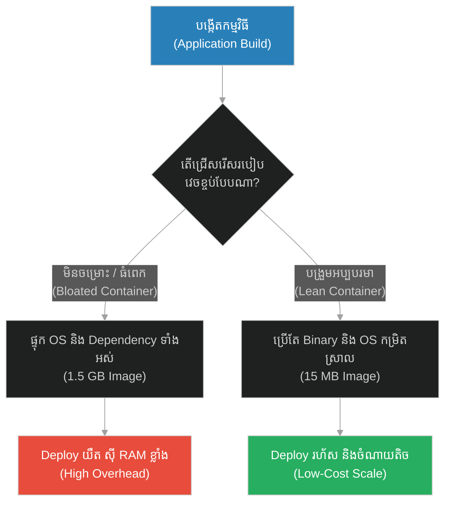
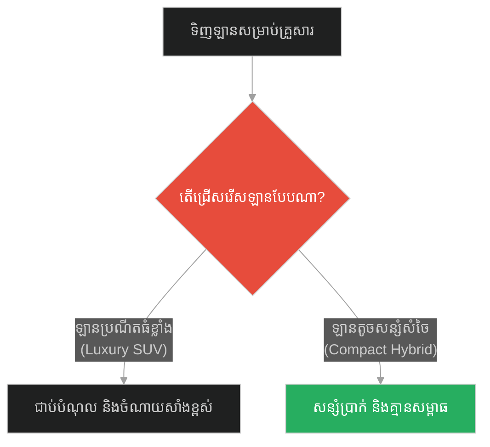
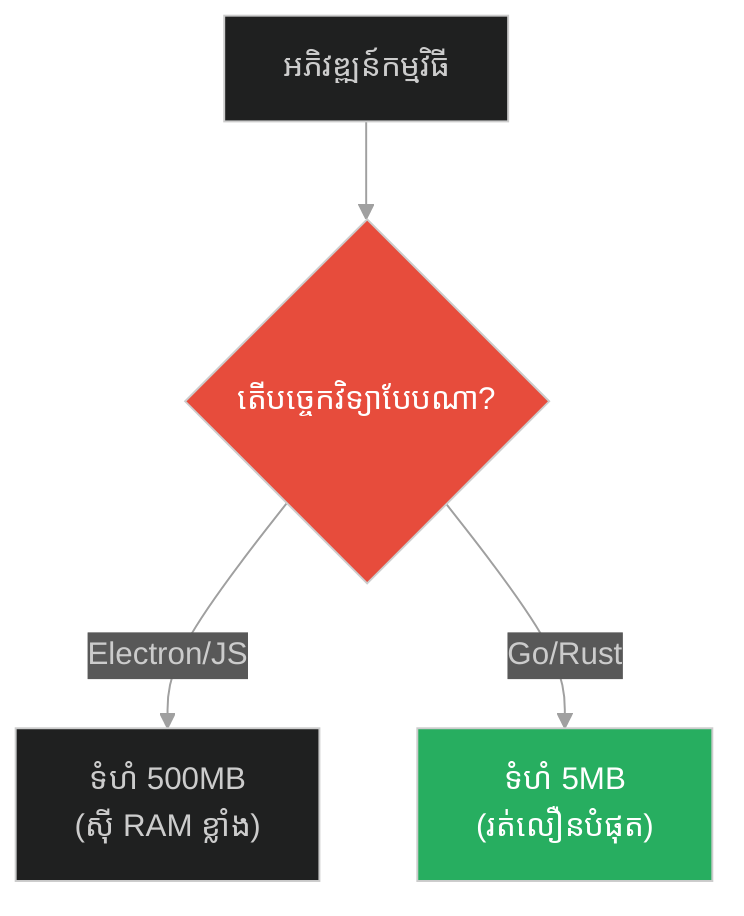
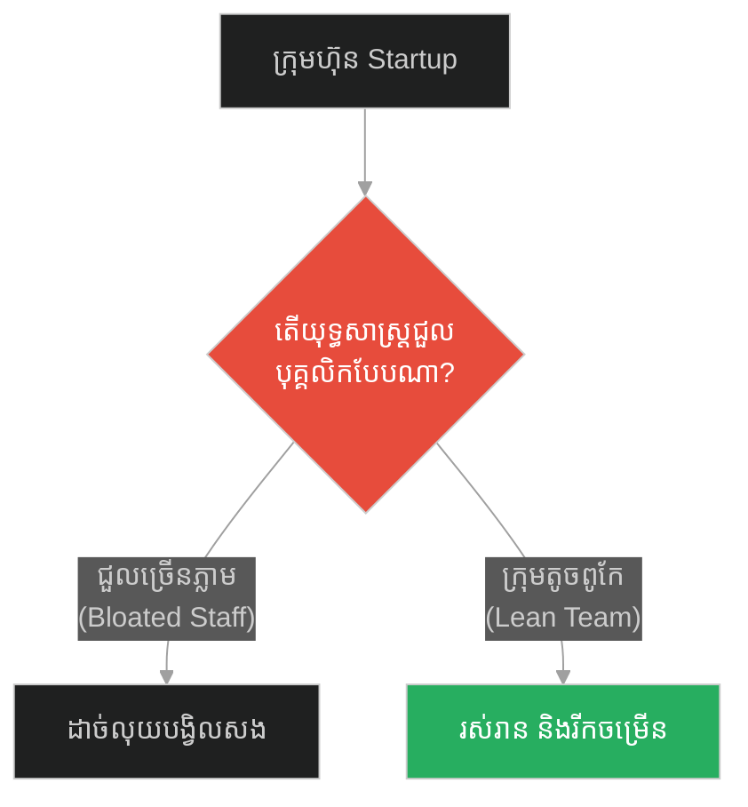
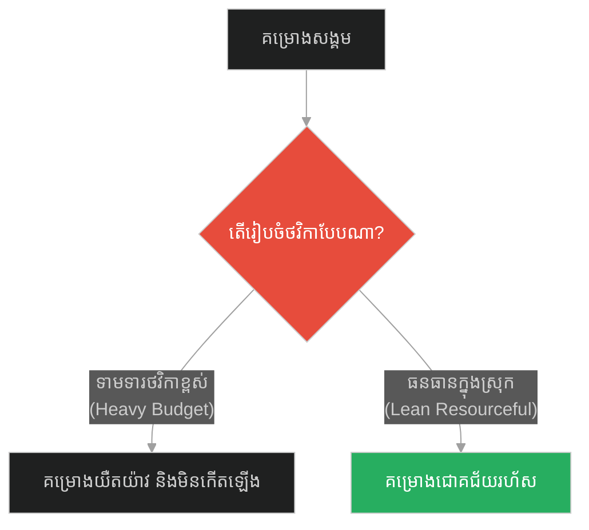
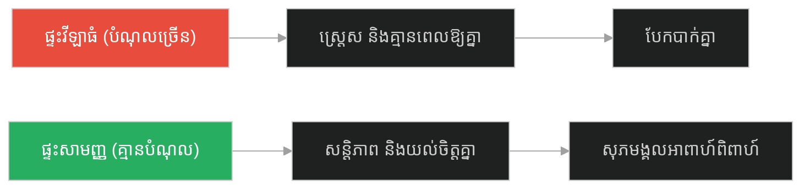

# Resource Minimization & Lean Containerization (សូក្រាត និងទ្រព្យសម្បត្តិពិតប្រាកដ)៖ ការបង្រួមធនធានអប្បបរមា និងការរៀបចំធុងផ្ទុកកម្រិតស្រាល (Resource Minimization & Lean Containerization & Resource Quotas and Lightweight Architecture & Socrates and the Wealthy Man)

**Author:** ichamrong  
**Date:** 2026-05-28  
**Tags:** #resource-minimization #lean-containerization #docker #performance #software-engineering  
**Category:** Concepts  
**Read Time:** ~15 min  

---

## 📌 មាតិកា (Table of Contents)
- [អន្ទាក់ផ្លូវចិត្ត (The Trap)](#0)
- [១. រឿងព្រេងនិទាន៖ ការត្អូញត្អែររបស់អ្នកមាន (The Legend of Socrates and the Wealthy Man)](#1)
  - [ភាពស្កប់ស្កល់ និងការបង្រួមចំណង់របស់ប្រព័ន្ធ (Contentment and System Desires)](#1-1)
- [២. បញ្ហា៖ រូបភាពប្រព័ន្ធធំ និងការស៊ីមេម៉ូរីហួសប្រមាណ (The Issue: Bloated Container Images & Memory Waste)](#2)
- [៣. ឧទាហរណ៍ជាក់ស្តែងក្នុងពិភពពិត (Real World Examples)](#3)
  - [ឧទាហរណ៍ទី ១ — កម្រិតស្រាល (គ្រួសារ)៖ ការទិញឡានធំហួសតម្រូវការ (The Family Luxury SUV vs Compact Fuel-Efficient Car)](#3-1)
  - [ឧទាហរណ៍ទី ២ — កម្រិតមធ្យម (បច្ចេកទេស)៖ កម្មវិធីជំនួយបែប Electron (The Dev Bloated Electron App vs Lean Compiled CLI)](#3-2)
  - [ឧទាហរណ៍ទី ៣ — កម្រិតមធ្យម (ធុរកិច្ច)៖ ការជួលបុគ្គលិកហួសកម្រិត (The Business Premature Hiring Scale vs Lean Multi-Talented Team)](#3-3)
  - [ឧទាហរណ៍ទី ៤ — កម្រិតមធ្យម (សង្គម/គ្រប់គ្រង)៖ ថវិការៀបចំកម្មវិធី (The Management Huge Budget Demand vs Lean Resourceful Execution)](#3-4)
  - [ឧទាហរណ៍ទី ៥ — កម្រិតធ្ងន់ (ទំនាក់ទំនង)៖ ផ្ទះវីឡាដ៏ធំស្កឹមស្កៃ (The Relationship High-Mortgage Mansion vs Cozy Stress-Free Apartment)](#3-5)
- [៤. ដំណោះស្រាយទូទៅ៖ ការបង្កើតរូបភាពកម្រិតស្រាល និង Multi-Stage (The General Solution: Multi-Stage Builds & Distroless)](#4)
- [សេចក្តីសន្និដ្ឋាន (Conclusion)](#5)
- [ឯកសារយោង (References)](#6)
- [Related Posts](#7)

---

<a id="0"></a>
## អន្ទាក់ផ្លូវចិត្ត (The Trap)

ហេតុអ្វីបានជាកម្មវិធីរបស់អ្នកត្រូវការទំហំមេម៉ូរី (RAM) និងធនធានម៉ាស៊ីន (CPU) យ៉ាងច្រើនសន្ធឹកសន្ធាប់ គ្រាន់តែដើម្បីដំណើរការមុខងារសាមញ្ញមួយ? អន្ទាក់ផ្លូវចិត្តដ៏ធំបំផុតនៅក្នុងការរចនាប្រព័ន្ធគឺ៖
*   **ការប្រើប្រាស់ធនធានហួសកម្រិត (Resource Bloat / Overprovisioning)** — ការដាក់បញ្ចូលបណ្ណាល័យ (Libraries) និង OS ចាស់ៗទាំងអស់ទៅក្នុងប្រព័ន្ធ ដោយគិតថា "ធនធានកុំព្យូទ័រថោក"។
*   **ការបង្រួមធនធានអប្បបរមា (Lean Minimization)** — ការកាត់បន្ថយបំណងប្រាថ្នានៃកូដ ឱ្យប្រើប្រាស់តែអ្វីដែលចាំបាច់បំផុត (Lightweight Containers) ធ្វើឱ្យប្រព័ន្ធចាប់ផ្តើមលឿន និងចំណាយទាប។

1.  **រឿងព្រេងនិទាន (The Legend)** — ការប្រៀបធៀបទ្រព្យសម្បត្តិ និងចំណង់រវាងសូក្រាត និងមហាសេដ្ឋី។
2.  **បញ្ហា (The Issue)** — Docker Images ដែលមានទំហំធំ (Bloated) បង្កើនពេលវេលា Deploy និងហានិភ័យសន្តិសុខ។
3.  **ឧទាហរណ៍ជាក់ស្តែង (Real World Examples)** — របៀបដែលការកាត់បន្ថយការចំណាយលើសលប់ ជួយឱ្យជីវិតមានសេរីភាព។
4.  **ដំណោះស្រាយ (The General Solution)** — ការអនុវត្ត Multi-Stage Build និងការជ្រើសរើស Base Images កម្រិតស្រាល (Alpine/Scratch)។



---

<a id="1"></a>
## ១. រឿងព្រេងនិទាន៖ ការត្អូញត្អែររបស់អ្នកមាន (The Legend of Socrates and the Wealthy Man)

ទោះបីជាសូក្រាតជាទស្សនវិទូដ៏ល្បីល្បាញ ក៏លោកតែងតែស្លៀកពាក់អាវធំចាស់មួយ (Tunic) ដើរជើងទទេ និងរស់នៅក្នុងភាពក្រីក្របំផុត។

ថ្ងៃមួយ មានបុរសមហាសេដ្ឋីម្នាក់ ដែលស្លៀកពាក់សុទ្ធតែក្រណាត់សូត្រ និងពាក់គ្រឿងអលង្ការពេញខ្លួន បានមកជួបសូក្រាត។ បុរសនោះមានទឹកមុខសោកសៅនិងស្ត្រេសយ៉ាងខ្លាំង។ គាត់បានត្អូញត្អែរប្រាប់សូក្រាតថា៖ *"ឱសូក្រាត! ខ្ញុំមានផ្ទះវីឡាធំៗ ខ្ញុំមានមាសប្រាក់រាប់មិនអស់ ប៉ុន្តែខ្ញុំនៅតែមិនមានក្តីសុខសោះ។ ខ្ញុំតែងតែបារម្ភខ្លាចគេលួច ខ្ញុំតែងតែចង់បានដីធំជាងមុន ខ្ញុំគេងមិនដែលលក់ទេ។ តើធ្វើម៉េចទើបខ្ញុំអាចមានបាន និងមានក្តីសុខដូចជាក្តីស្រមៃ?"*

សូក្រាតបានសម្លឹងមើលបុរសនោះ រួចសម្លឹងមើលសម្លៀកបំពាក់ចាស់រហែករបស់ខ្លួនឯង ហើយក៏ញញឹមឡើង។ លោកបានតបទៅបុរសមហាសេដ្ឋីនោះវិញថា៖ 

**«អ្នកមានពិតប្រាកដ មិនមែនជាអ្នកដែលមានទ្រព្យសម្បត្តិច្រើនជាងគេនោះទេ ប៉ុន្តែគឺជាអ្នកដែលត្រូវការរបស់តិចតួចបំផុត។ (He is richest who is content with the least, for content is the wealth of nature.)»**

លោកបានបន្តពន្យល់ថា៖ *"អ្នកក្រីក្រដោយសារតែបំណងប្រាថ្នារបស់អ្នក (Desires) វាធំជាងទ្រព្យសម្បត្តិរបស់អ្នក។ ចំណែកឯខ្ញុំ ខ្ញុំជាមហាសេដ្ឋី ព្រោះខ្ញុំមានអ្វីៗគ្រប់យ៉ាងដែលខ្ញុំត្រូវការរួចទៅហើយ (ព្រោះខ្ញុំត្រូវការវាតិចតួចបំផុត)។"*

<a id="1-1"></a>
### ភាពស្កប់ស្កល់ និងការបង្រួមចំណង់របស់ប្រព័ន្ធ (Contentment and System Desires)

Climax នៃដំបូន្មានសូក្រាត គឺការបង្ហាញថា "ទ្រព្យសម្បត្តិ" និង "ការប្រើប្រាស់ធនធាន" គឺជាសមាមាត្រផ្ទុយគ្នា។ ប្រសិនបើយើងកាត់បន្ថយបំណងប្រាថ្នា (Desire / Code overhead) ឱ្យមកទាបបំផុត នោះធនធានដែលយើងមានបច្ចុប្បន្ន នឹងក្លាយជាធនធានដ៏សម្បូរបែបភ្លាមៗ។ នេះគឺជាទស្សនវិជ្ជាគ្រឹះនៃ **Resource Minimization**។

---

<a id="2"></a>
## ២. បញ្ហា៖ រូបភាពប្រព័ន្ធធំ និងការស៊ីមេម៉ូរីហួសប្រមាណ (The Issue: Bloated Container Images & Memory Waste)

នៅក្នុងបច្ចេកវិទ្យា Container (ដូចជា Docker) វិស្វករជាច្រើនបង្កើតកូដដោយប្រើប្រាស់ Base Images ដែលធំធេងហួសប្រមាណ (ឧទាហរណ៍៖ ការប្រើប្រាស់ `FROM ubuntu` ឬ `FROM node:latest` ដែលផ្ទុក OS ទាំងមូល ទំហំជាង ១ ជីកាបៃ) ដើម្បីគ្រាន់តែដំណើរការកូដ Javascript ឬ Go ពីរបីបន្ទាត់។ នេះធ្វើឱ្យការទាញយករូបភាព (Pull Image) យឺតយ៉ាវ ស៊ី RAM ខ្លាំង និងពោរពេញដោយចំណុចខ្សោយសន្តិសុខ (Vulnerabilities)។

### Fragile Approach: Bloated Dockerfile (ការវេចខ្ចប់ប្រព័ន្ធធំនិងធ្ងន់)
ខាងក្រោមនេះជា Dockerfile ដ៏ខ្សោយ ដែលទាញយក Ubuntu ទាំងមូលដើម្បីរត់កម្មវិធី Go សាមញ្ញមួយ នាំឱ្យទំហំរូបភាពកើនឡើងដល់ ១.២ ជីកាបៃ។

```dockerfile
# ❌ Fragile Dockerfile: បង្កើតទំហំរូបភាពធំធេងដោយគ្មានប្រសិទ្ធភាព
FROM ubuntu:latest

# ដំឡើង dependencies ទាំងឡាយដែលមិនចាំបាច់សម្រាប់ runtime
RUN apt-get update && apt-get install -y \
    golang \
    git \
    curl \
    vim \
    && rm -rf /var/lib/apt/lists/*

WORKDIR /app
COPY . .

# Compile កូដ
RUN go build -o myapp main.go

# ដំណើរការកម្មវិធីនៅក្នុង Ubuntu OS ទាំងមូល (ស៊ី RAM និងទំហំធំ)
CMD ["./myapp"]
```

### Resilient Approach: Lean Multi-Stage Build (ការប្រើប្រាស់ Multi-Stage build កម្រិតស្រាល)
ខាងក្រោមនេះជា Dockerfile ដ៏រឹងមាំ ដែលអនុវត្តការសាងសង់ ២ ដំណាក់កាល (Multi-Stage Build)។ ដំណាក់កាលទី ១ ប្រើសម្រាប់ Compile កូដ រីឯដំណាក់កាលទី ២ ទាញយកតែ Binary ទៅរត់លើ Base Image ស្ងួត `scratch` ឬ `alpine` ដែលគ្មាន OS overhead ធ្វើឱ្យទំហំរូបភាពមានត្រឹមតែ ១០ មេហ្គាបៃប៉ុណ្ណោះ។

```dockerfile
# ✅ Stage 1: Build Environment (មជ្ឈដ្ឋានសម្រាប់តែ compile កូដ)
FROM golang:1.20-alpine AS builder

WORKDIR /src
COPY . .
# បង្កើត static binary គ្មានពឹងផ្អែកលើ OS (Statically linked binary)
RUN CGO_ENABLED=0 GOOS=linux go build -o /myapp main.go

# ✅ Stage 2: Runtime Environment (ធុងផ្ទុកស្ងួតសម្រាប់តែដំណើរការ)
# scratch គឺជា image ទទេស្អាត គ្មាន OS ទំហំ 0 bytes
FROM scratch

# ចម្លងតែ static binary ពី Stage 1 មក
COPY --from=builder /myapp /myapp

# ដំណើរការភ្លាមៗ គ្មាន OS overhead, គ្មាន security vulnerability, ទំហំតូចបំផុត
ENTRYPOINT ["/myapp"]
```

---

<a id="3"></a>
## ៣. ឧទាហរណ៍ជាក់ស្តែងក្នុងពិភពពិត (Real World Examples)

<a id="3-1"></a>
### ឧទាហរណ៍ទី ១ — កម្រិតស្រាល (គ្រួសារ)៖ ការទិញឡានធំហួសតម្រូវការ (The Family Luxury SUV vs Compact Fuel-Efficient Car)
*   **Failure Scenario:** គ្រួសារដែលមានសមាជិកតែ ៣នាក់ សម្រេចចិត្តខ្ចីបុលទិញឡានធំប្រណីត (V8 SUV) នាំឱ្យជាប់បំណុលវណ្ឌក និងពិបាករកកន្លែងចត។
*   **Remediation:** ទិញឡានតូចសន្សំសំចៃសាំង (Compact Hybrid) ដែលបំពេញតម្រូវការធ្វើដំណើរបានដូចគ្នា តែគ្មានបំណុលធ្ងន់ធ្ងរ។



<a id="3-2"></a>
### ឧទាហរណ៍ទី ២ — កម្រិតមធ្យម (បច្ចេកទេស)៖ កម្មវិធីជំនួយបែប Electron (The Dev Bloated Electron App vs Lean Compiled CLI)
*   **Failure Scenario:** ក្រុមការងារបង្កើតកម្មវិធីមើលម៉ោងសាមញ្ញមួយ តែសរសេរដោយប្រើ Electron framework ធ្វើឱ្យអ្នកប្រើប្រាស់ត្រូវទាញយក ៥០០មេហ្គាបៃ និងស៊ី RAM ៣០០មេហ្គាបៃ។
*   **Remediation:** សរសេរជាកម្មវិធី Command Line (CLI) ធម្មតាដោយប្រើប្រាស់ Go ឬ Rust ដែលមានទំហំត្រឹមតែ ៥មេហ្គាបៃ និងប្រើ RAM ៥មេហ្គាបៃ។



<a id="3-3"></a>
### ឧទាហរណ៍ទី ៣ — កម្រិតមធ្យម (ធុរកិច្ច)៖ ការជួលបុគ្គលិកហួសកម្រិត (The Business Premature Hiring Scale vs Lean Multi-Talented Team)
*   **Failure Scenario:** ក្រុមហ៊ុន Startup ទើបតែបង្កើតបានផលិតផលដំបូង សម្រេចចិត្តជួលបុគ្គលិក ៥០នាក់ភ្លាមៗ ធ្វើឱ្យក្រុមហ៊ុនអស់ថវិការហ័សរហូតដល់ក្ស័យធន។
*   **Remediation:** រក្សាក្រុមការងារតូចកម្រិតស្រាល (Lean Team) ៥នាក់ ដែលមានសមត្ថភាពចម្រុះ រហូតដល់រកឃើញទីផ្សារច្បាស់លាស់ (Product-Market Fit)។



<a id="3-4"></a>
### ឧទាហរណ៍ទី ៤ — កម្រិតមធ្យម (សង្គម/គ្រប់គ្រង)៖ ថវិការៀបចំកម្មវិធី (The Management Huge Budget Demand vs Lean Resourceful Execution)
*   **Failure Scenario:** ប្រធានគម្រោងមិនព្រមដំណើរការកម្មវិធីចែកអំណោយទេ ប្រសិនបើគ្មានថវិកា ២ម៉ឺនដុល្លារសម្រាប់ជួលសម្ភារៈទំនើបៗ និងឆាកតន្ត្រីប្រណីត។
*   **Remediation:** ដំណើរការគម្រោងដោយប្រើសម្ភារៈក្នុងស្រុក សហការជាមួយសហគមន៍ផ្ទាល់ ដោយចំណាយត្រឹមតែ ២ពាន់ដុល្លារ តែទទួលបានលទ្ធផលដូចគ្នា។



<a id="3-5"></a>
### ឧទាហរណ៍ទី ៥ — កម្រិតធ្ងន់ (ទំនាក់ទំនង)៖ ផ្ទះវីឡាដ៏ធំស្កឹមស្កៃ (The Relationship High-Mortgage Mansion vs Cozy Stress-Free Apartment)
*   **Failure Scenario:** គូស្វាមីភរិយាថ្មីថ្មោងទិញផ្ទះវីឡាដ៏ធំមួយដើម្បីបង្ហាញសមត្ថភាពដល់សាច់ញាតិ តែត្រូវធ្វើការថែមម៉ោងហួសកម្លាំងដើម្បីបង់រំលស់ ធ្វើឱ្យគ្មានពេលវេលាផ្តល់សេចក្តីសុខឱ្យគ្នា នាំឱ្យលែងលះ។
*   **Remediation:** រស់នៅក្នុងផ្ទះល្វែងសមរម្យ ឬអាផាតមិនសាមញ្ញ គ្មានសម្ពាធហិរញ្ញវត្ថុ តែពោរពេញដោយពេលវេលាផ្អែមល្ហែមជាមួយគ្នា។



---

<a id="4"></a>
## ៤. ដំណោះស្រាយទូទៅ៖ ការបង្កើតរូបភាពកម្រិតស្រាល និង Multi-Stage (The General Solution: Multi-Stage Builds & Distroless)

ដើម្បីទទួលបានប្រព័ន្ធដែលមានភាពធន់ និងសន្សំសំចៃបំផុត យើងត្រូវសាងសង់កម្មវិធីតាមលំនាំ **Minimal Dependency Design (ការរចនាការពឹងផ្អែកទាបបំផុត)**។

### ជំហានកសាងប្រព័ន្ធ៖
1.  **Use Multi-Stage Compilation:** បំបែកបរិស្ថាន Compiler (Build environment) ចេញពីបរិស្ថានរត់កម្មវិធី (Runtime environment)។
2.  **Select Minimal Base Images:** ប្រើប្រាស់ `alpine`, `distroless`, ឬ `scratch` ជា Base Image ជំនួសឱ្យ OS ពេញលេញ។
3.  **Optimize Dependencies:** លុបរាល់ packages, caches, និង source codes ទាំងឡាយណាដែលលែងប្រើប្រាស់ចេញពីកញ្ចប់ផលិតផលចុងក្រោយ។

```mermaid
%%{init: {
  'theme': 'dark',
  'themeVariables': {
    'background': '#1e1e1e',
    'primaryTextColor': '#ffffff',
    'lineColor': '#a0a0a0'
  },
  'themeCSS': 'svg { background-color: #1e1e1e !important; padding: 1rem !important; border-radius: 8px !important; } .edgeLabel rect { fill: #1e1e1e !important; } text, tspan { fill: #ffffff !important; }'
}}%%
graph LR
    Source["កូដដើម (Source Code)"] -->|1. Build in| Compiler["ធុងចងក្រងកូដ<br/>(Heavy Compiler Image)"]
    Compiler -->|2. Extract| Binary["Static Binary File"]
    Binary -->|3. Copy to| Scratch["ធុងស្ងួតទទេ<br/>(Scratch Runtime Image)"]
    Scratch --> Runtime["ប្រព័ន្ធដំណើរការស្រាលស្រទន់<br/>(Lean Production App)"]
    
    style Compiler fill:#2980b9,color:#fff
    style Scratch fill:#2980b9,color:#fff
    style Runtime fill:#27ae60,color:#fff
```



---

<a id="5"></a>
## សេចក្តីសន្និដ្ឋាន (Conclusion)

> **«អ្នកដែលមានបំផុត មិនមែនជាអ្នកដែលមានធនធានច្រើនជាងគេនោះទេ ប៉ុន្តែគឺជាអ្នកដែលត្រូវការធនធានតិចតួចបំផុតដើម្បីរស់រាន និងអភិវឌ្ឍ។»**

ការបង្រួញធនធានប្រព័ន្ធ (Resource Minimization) មិនមែនជាការរឹតត្បិតសមត្ថភាពនោះទេ ប៉ុន្តែវាគឺជាសិល្បៈនៃការបង្កើនប្រសិទ្ធភាពតាមរយៈភាពសាមញ្ញ (Lean Containerization)។ ដូចដែលសូក្រាតបានរស់នៅដោយមានសេរីភាពខាងវិញ្ញាណ ព្រោះតែលោកត្រូវការរបស់របរតិចតួចបំផុត ប្រព័ន្ធកុំព្យូទ័រដែលត្រូវបានរចនាឡើងយ៉ាងស្រាលស្រទន់ ក៏អាចដំណើរការបានលឿនបំផុត រឹងមាំបំផុត និងសន្សំសំចៃបំផុតផងដែរ។

---

<a id="6"></a>
## ឯកសារយោង (References)

*   **Diogenes Laertius' Lives of the Eminent Philosophers** — Containing the accounts of Socrates' views on minimalist lifestyle and containment of desires.
*   **Docker Multi-Stage Build Documentation** — Best practices on how to compile and package production applications with minimal sizes.
*   **Google's Distroless Images** — Documentation on using language-focused, package-manager-free container images for safety and footprint reduction.

---

<a id="7"></a>
## Related Posts

*   [[Graceful Ignorance & Fallback Error Handling] (សូក្រាត និងការដឹងថាខ្លួនមិនដឹងអ្វីសោះ)](./223-socrates-and-knowing-nothing.md) — Fallback error handling and graceful ignorance.
*   [[High Read-to-Write Ratio & Read-Optimized Databases] (សូក្រាត និងត្រចៀកពីរ មាត់មួយ)](./225-socrates-and-the-two-ears-one-mouth.md) — Read replicas and read-optimized database design.

## 🐇 ធ្លាក់ចូលក្នុងរន្ធទន្សាយ (Enter the Rabbit Hole)
ដើម្បីស្វែងយល់បន្ថែមអំពីការរៀបចំប្រព័ន្ធអានលឿន និងមូលដ្ឋានទិន្នន័យបង្កើនល្បឿន សូមបន្តដំណើរទៅកាន់៖

* 🚀 **[ចាប់ផ្តើមដំណើររុករក (Start the Journey) ➔ High Read-to-Write Ratio & Read-Optimized Databases (សូក្រាត និងត្រចៀកពីរ មាត់មួយ)៖ សមាមាត្រអានខ្ពស់ជាងសរសេរ និងមូលដ្ឋានទិន្នន័យបង្កើនល្បឿនអាន (High Read-to-Write Ratio & Read-Optimized Databases & Read Replicas and CQRS Pattern & Socrates and the Two Ears One Mouth)](./225-socrates-and-the-two-ears-one-mouth.md)**
