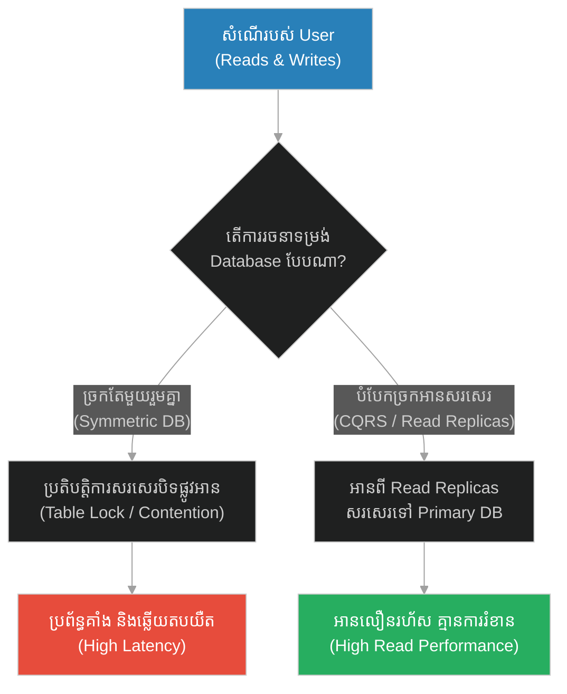
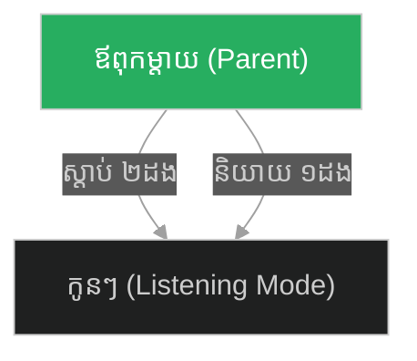
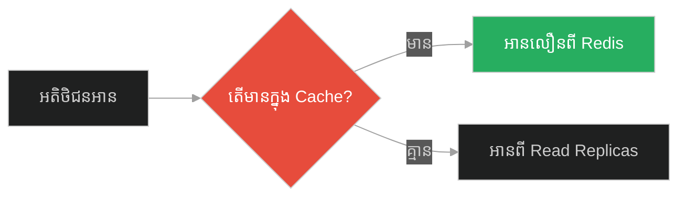
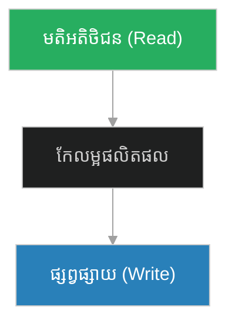
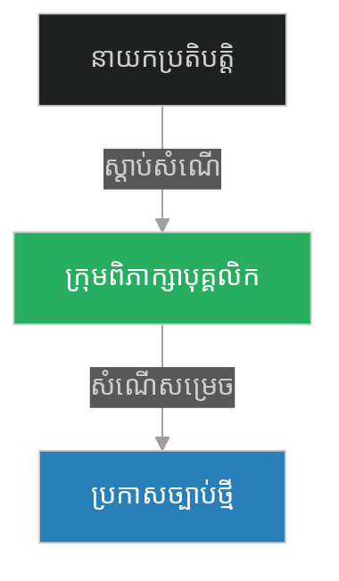
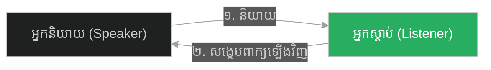
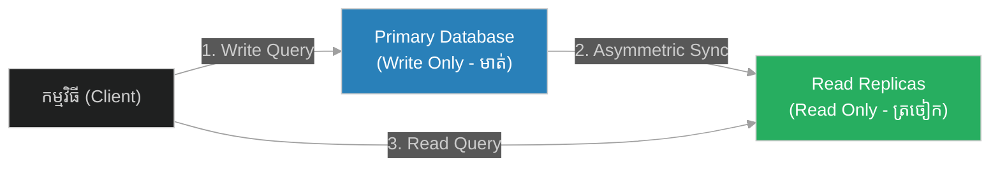

# High Read-to-Write Ratio & Read-Optimized Databases (សូក្រាត និងត្រចៀកពីរ មាត់មួយ)៖ សមាមាត្រអានខ្ពស់ជាងសរសេរ និងមូលដ្ឋានទិន្នន័យបង្កើនល្បឿនអាន (High Read-to-Write Ratio & Read-Optimized Databases & Read Replicas and CQRS Pattern & Socrates and the Two Ears One Mouth)

**Author:** ichamrong  
**Date:** 2026-05-28  
**Tags:** #read-write-ratio #read-replicas #cqrs-pattern #database-design #software-engineering  
**Category:** Concepts  
**Read Time:** ~15 min  

---

## 📌 មាតិកា (Table of Contents)
- [អន្ទាក់ផ្លូវចិត្ត (The Trap)](#0)
- [១. រឿងព្រេងនិទាន៖ សិស្សដែលពូកែនិយាយ (The Legend of Socrates and the Two Ears One Mouth)](#1)
  - [សមាមាត្រធម្មជាតិ និងស្ថាបត្យកម្មនៃការប្រមូលព័ត៌មាន (Natural Ratio and the Ingestion-Heavy Architecture)](#1-1)
- [២. បញ្ហា៖ ការកកស្ទះ Database ដោយសារការអាន និងសរសេររួមគ្នា (The Issue: Database Contention Under Symmetric Read/Write)](#2)
- [៣. ឧទាហរណ៍ជាក់ស្តែងក្នុងពិភពពិត (Real World Examples)](#3)
  - [ឧទាហរណ៍ទី ១ — កម្រិតស្រាល (គ្រួសារ)៖ ឪពុកម្តាយដែលពូកែស្តីបន្ទោស (The Family Lecture Heavy vs Active Listener Parents)](#3-1)
  - [ឧទាហរណ៍ទី ២ — កម្រិតមធ្យម (បច្ចេកទេស)៖ គេហទំព័រព័ត៌មានគាំងពេលមានអ្នកមើលច្រើន (The Dev Direct DB Reads vs Redis & Read Replicas)](#3-2)
  - [ឧទាហរណ៍ទី ៣ — កម្រិតមធ្យម (ធុរកិច្ច)៖ ការផ្សព្វផ្សាយដោយមិនស្តាប់អតិថិជន (The Business Hard Selling vs Feedback-Driven Sales)](#3-3)
  - [ឧទាហរណ៍ទី ៤ — កម្រិតមធ្យម (សង្គម/គ្រប់គ្រង)៖ របៀបដឹកនាំបែបបញ្ជា (The Management Autocratic Dictation vs Listening Focus Groups)](#3-4)
  - [ឧទាហរណ៍ទី ៥ — កម្រិតធ្ងន់ (ទំនាក់ទំនង)៖ ការកាត់មាត់គ្នានៅពេលឈ្លោះ (The Relationship Interrupting Partner vs Empathetic Mirroring)](#3-5)
- [៤. ដំណោះស្រាយទូទៅ៖ ការបំបែកបន្ទុកអាននិងសរសេរ (The General Solution: Read Replicas & CQRS Pattern)](#4)
- [សេចក្តីសន្និដ្ឋាន (Conclusion)](#5)
- [ឯកសារយោង (References)](#6)
- [Related Posts](#7)

---

<a id="0"></a>
## អន្ទាក់ផ្លូវចិត្ត (The Trap)

ហេតុអ្វីបានជាមូលដ្ឋានទិន្នន័យ (Database) របស់អ្នកដើរយឺតខ្លាំង នៅពេលដែលមានអ្នកប្រើប្រាស់ចូលមកមើលទិន្នន័យ (Read) ក្នុងពេលតែមួយជាមួយអ្នកប្រើប្រាស់ដែលកំពុងបញ្ចូលទិន្នន័យ (Write)? អន្ទាក់ផ្លូវចិត្តដ៏ធំបំផុតនៅក្នុងការរចនាប្រព័ន្ធគឺ៖
*   **ការប្រើប្រាស់ច្រកតែមួយសម្រាប់អាននិងសរសេរ (Symmetric Database)** — ការសន្មតថាការអាន និងការសរសេរមានទម្ងន់ស្មើគ្នា ធ្វើឱ្យប្រតិបត្តិការសរសេរដ៏ធ្ងន់ៗមកបិទផ្លូវ (Block) ប្រតិបត្តិការអានសាមញ្ញៗ។
*   **សមាមាត្រត្រចៀកពីរ មាត់មួយ (2:1 Read-to-Write Segregation)** — ការបង្កើតច្រកអានដាច់ដោយឡែក (Read Replicas) ឱ្យបានច្រើនជាងច្រកសរសេរ ដើម្បីសម្រួលដល់ការអានព័ត៌មានលឿនរហ័ស ដូចជាការស្តាប់មុននិយាយ។

1.  **រឿងព្រេងនិទាន (The Legend)** — ការគិតថ្លៃឈ្នួលទ្វេដងរបស់សូក្រាតចំពោះសិស្សដែលពូកែនិយាយ និងទស្សនវិជ្ជាត្រចៀកពីរ មាត់មួយ។
2.  **បញ្ហា (The Issue)** — ការទាក់ទាញទិន្នន័យដោយផ្ទាល់ពី Primary DB បង្កើតឱ្យមាន Lock Contention ធ្វើឱ្យប្រព័ន្ធយឺត។
3.  **ឧទាហរណ៍ជាក់ស្តែង (Real World Examples)** — សារៈសំខាន់នៃការស្តាប់ (អាន) ច្រើនជាងការនិយាយ (សរសេរ) ក្នុងទំនាក់ទំនង។
4.  **ដំណោះស្រាយ (The General Solution)** — ការបង្កើត Read Replicas និងការអនុវត្តស្ថាបត្យកម្ម CQRS។



---

<a id="1"></a>
## ១. រឿងព្រេងនិទាន៖ សិស្សដែលពូកែនិយាយ (The Legend of Socrates and the Two Ears One Mouth)

យុវជនម្នាក់ដែលមានមោទនភាពចំពោះវោហាស័ព្ទរបស់ខ្លួន បានមកសុំធ្វើជាសិស្សរបស់សូក្រាត ដើម្បីរៀនពីសិល្បៈនៃការនិយាយ និងទស្សនវិជ្ជា។

នៅពេលជួបសូក្រាតដំបូង យុវជននោះមិនបានទុកឱកាសឱ្យសូក្រាតនិយាយសូម្បីតែមួយម៉ាត់។ គាត់បានបន្តនិយាយរៀបរាប់ពីចំណេះដឹងរបស់គាត់ ពីគំនិតរបស់គាត់ និងពីភាពអស្ចារ្យរបស់គាត់ដោយមិនឈប់ឈរ ដើម្បីចង់អួតប្រាប់សូក្រាត។

បន្ទាប់ពីយុវជននោះនិយាយចប់ សូក្រាតបានប្រាប់គាត់ថា៖ *"ខ្ញុំយល់ព្រមទទួលយកអ្នកធ្វើជាសិស្ស។ ប៉ុន្តែសម្រាប់អ្នក ខ្ញុំត្រូវគិតថ្លៃឈ្នួល (Tuition Fee) ច្រើនជាងសិស្សដទៃ **ទ្វេដង**។"*

យុវជននោះមានការងឿងឆ្ងល់យ៉ាងខ្លាំង ក៏សួរថា៖ *"ហេតុអ្វីបានជាលោកគ្រូ គិតថ្លៃខ្ញុំទ្វេដងអញ្ចឹង? តើមកពីខ្ញុំឆ្លាតពេកមែនទេ?"*

សូក្រាតបានញញឹម រួចឆ្លើយថា៖ 
*"ទេ មិនមែនមកពីអ្នកឆ្លាតទេ។ គឺមកពីខ្ញុំត្រូវបង្រៀនអ្នកនូវមុខវិជ្ជាពីរ ខុសពីគេ។ មុខវិជ្ជាទី ១ គឺ **បង្រៀនអ្នកឱ្យចេះបិទមាត់ (How to hold your tongue)**។ ហើយមុខវិជ្ជាទី ២ ទើប **បង្រៀនអ្នកឱ្យចេះនិយាយ (How to speak)**។"*

បន្ទាប់មក សូក្រាតបានផ្តល់នូវទស្សនវិជ្ជាដ៏សាមញ្ញមួយដល់គាត់ថា៖

**«ធម្មជាតិ បានផ្តល់ឱ្យយើងនូវត្រចៀកពីរ និងមាត់តែមួយប៉ុណ្ណោះ។ នេះមានន័យថា យើងគួរតែស្តាប់ឱ្យបានច្រើនជាងការនិយាយ ទ្វេដង (We have two ears and one mouth so that we can listen twice as much as we speak)។»**

---

<a id="1-1"></a>
### សមាមាត្រធម្មជាតិ និងស្ថាបត្យកម្មនៃការប្រមូលព័ត៌មាន (Natural Ratio and the Ingestion-Heavy Architecture)

Climax នៃធម្មទេសនានេះ គឺការបង្រៀនពី "សមាមាត្រនៃការទទួលបានព័ត៌មាន (Read) ធៀបនឹងការបញ្ចេញព័ត៌មាន (Write)"។ នៅក្នុងប្រព័ន្ធព័ត៌មានវិទ្យាភាគច្រើន ដូចជា បណ្តាញសង្គម គេហទំព័រព័ត៌មាន ឬ E-commerce សមាមាត្រនៃការអានធៀបនឹងការសរសេរ គឺខ្ពស់ខ្លាំងណាស់ (ជារឿយៗ ៩៥% ជាការអាន និង ៥% ជាការសរសេរ)។ ប្រសិនបើយើងរៀបចំប្រព័ន្ធដោយគ្មានតុល្យភាពនេះទេ គឺប្រៀបដូចជាសិស្សដែលចង់តែនិយាយ (Write) ដោយមិនព្រមស្តាប់ (Read) ធ្វើឱ្យមានភាពរញ៉េរញ៉ៃកើតឡើង។

---

<a id="2"></a>
## ២. បញ្ហា៖ ការកកស្ទះ Database ដោយសារការអាន និងសរសេររួមគ្នា (The Issue: Database Contention Under Symmetric Read/Write)

នៅក្នុងប្រព័ន្ធសាមញ្ញៗ កម្មវិធីតែងតែអាន និងសរសេរទិន្នន័យនៅលើម៉ាស៊ីន Database តែមួយ (Primary Database)។ នៅពេលដែលប្រព័ន្ធមានការរីកចម្រើន ហើយមានប្រតិបត្តិការអានរាប់ម៉ឺនដងក្នុងមួយវិនាទី បូកផ្សំប្រតិបត្តិការសរសេរធំៗ (ដូចជាការកែប្រែស្ថានភាពគណនី ឬការបញ្ចូលរបាយការណ៍) វានឹងបង្កើតឱ្យមាន **Table Locks** ឬ **Row Locks**។ នេះធ្វើឱ្យសំណើអានរបស់ User ដទៃទៀត ត្រូវរង់ចាំនៅពីក្រោយប្រតិបត្តិការសរសេរ នាំឱ្យកម្មវិធីយឺតយ៉ាវ និងគាំង។

### Fragile Approach: Single Connection for Reads & Writes (ការប្រើកុងតាក់រួមគ្នា)
កូដ Python ខាងក្រោមប្រើ Database តែមួយគត់ដើម្បីដំណើរការទាំងការសរសេរ និងការអាន ដែលបង្កឱ្យមានការស្ទះនៅពេលមានការប្រើប្រាស់ច្រើន។

```python
# ❌ Fragile: ប្រព័ន្ធដំណើរការការអាន និងការសរសេរនៅលើ database instance តែមួយ
class SimpleDatabase:
    def __init__(self):
        self.data = {}

    def write_query(self, key, value):
        # ក្លែងធ្វើប្រតិបត្តិការសរសេរដ៏ធ្ងន់ (Write Operation Lock)
        print(f"[LOCK] Writing {value} to key {key}...")
        self.data[key] = value

    def read_query(self, key):
        # ប្រតិបត្តិការអាន ត្រូវរង់ចាំរហូតដល់ការសរសេរត្រូវបានបញ្ចប់
        return self.data.get(key, "Not Found")

class FragileApp:
    def __init__(self, db: SimpleDatabase):
        self.db = db

    def handle_request(self, req_type, key, value=None):
        if req_type == "WRITE":
            self.db.write_query(key, value)
        else:
            return self.db.read_query(key)
```

### Resilient Approach: Database Routing & CQRS (ការបំបែក Router អាន និងសរសេរ)
កូដ Python ដ៏រឹងមាំខាងក្រោម បង្កើត `DatabaseRouter` មួយដើម្បីបង្វែររាល់ប្រតិបត្តិការសរសេរ (Write) ទៅកាន់ Primary Database រីឯរាល់ប្រតិបត្តិការអាន (Read) ត្រូវបានបង្វែរទៅកាន់ Read Replicas (ត្រចៀកពីរ) ស្វ័យប្រវត្ត។

```python
# ✅ Resilient: បំបែកបន្ទុកអាននិងសរសេរ (CQRS Design)
import random

class PrimaryDatabase:
    def __init__(self):
        self.data = {"post_1": "Hello Socrates"}

    def save(self, key, value):
        print(f"[Primary DB] Writing {value} to key {key}")
        self.data[key] = value
        return True

class ReadReplica:
    def __init__(self, replica_id, data_source):
        self.replica_id = replica_id
        # Replica ថតចម្លងទិន្នន័យពី Primary
        self.data = data_source

    def find(self, key):
        print(f"[Replica {self.replica_id}] Reading key {key}")
        return self.data.get(key, "Not Found")

class DatabaseRouter:
    def __init__(self, primary: PrimaryDatabase, replicas: list):
        self.primary = primary
        self.replicas = replicas

    def execute_write(self, key, value):
        # រាល់ការសរសេរ (Write) ត្រូវទៅកាន់ Primary DB តែមួយគត់ (មាត់មួយ)
        return self.primary.save(key, value)

    def execute_read(self, key):
        # រាល់ការអាន (Read) ត្រូវទៅកាន់ Replicas ផ្សេងៗគ្នា (ត្រចៀកពីរ)
        selected_replica = random.choice(self.replicas)
        return selected_replica.find(key)

# ដំណើរការ៖
primary_db = PrimaryDatabase()
replicas = [
    ReadReplica(replica_id=1, data_source=primary_db.data),
    ReadReplica(replica_id=2, data_source=primary_db.data)
]

router = DatabaseRouter(primary=primary_db, replicas=replicas)

# ១. ដំណើរការសរសេរទៅ Primary
router.execute_write("post_2", "Nature gave us two ears...")

# ២. ដំណើរការអាន Balancer ទៅ Replicas ផ្សេងៗគ្នា
print(router.execute_read("post_1"))
print(router.execute_read("post_2"))
```

---

<a id="3"></a>
## ៣. ឧទាហរណ៍ជាក់ស្តែងក្នុងពិភពពិត (Real World Examples)

<a id="3-1"></a>
### ឧទាហរណ៍ទី ១ — កម្រិតស្រាល (គ្រួសារ)៖ ឪពុកម្តាយដែលពូកែស្តីបន្ទោស (The Family Lecture Heavy vs Active Listener Parents)
*   **Failure Scenario:** ឪពុកម្តាយនិយាយស្តីប្រដៅកូនរហូត មិនដែលទុកឱកាសឱ្យកូននិយាយពន្យល់ពីបញ្ហាផ្ទាល់ខ្លួន ធ្វើឱ្យកូនលាក់បាំងរឿងរ៉ាវ និងដើរខុសផ្លូវ។
*   **Remediation:** ឪពុកម្តាយអនុវត្តវិន័យ៖ "ស្តាប់កូននិយាយឱ្យបានច្រើនជាងការស្តីបន្ទោសទ្វេដង" ដើម្បីយល់ពីចិត្តកូនពិតប្រាកដ។



<a id="3-2"></a>
### ឧទាហរណ៍ទី ២ — កម្រិតមធ្យម (បច្ចេកទេស)៖ គេហទំព័រព័ត៌មានគាំងពេលមានអ្នកមើលច្រើន (The Dev Direct DB Reads vs Redis & Read Replicas)
*   **Failure Scenario:** កាសែតអនឡាញអានអត្ថបទដោយផ្ទាល់ពី Primary DB រាល់ពេលមានការចុចមើល ស្រាប់តែមានព័ត៌មានក្តៅគគុក (Breaking News) ធ្វើឱ្យ DB គាំងភ្លាមៗ។
*   **Remediation:** បន្ថែម Redis Cache សម្រាប់ព័ត៌មានក្តៅៗ និងប្រើ Read Replicas ចំនួន ៣ សម្រាប់ដំណើរការការចុចមើលរបស់អាន។



<a id="3-3"></a>
### ឧទាហរណ៍ទី ៣ — កម្រិតមធ្យម (ធុរកិច្ច)៖ ការផ្សព្វផ្សាយដោយមិនស្តាប់អតិថិជន (The Business Hard Selling vs Feedback-Driven Sales)
*   **Failure Scenario:** ក្រុមហ៊ុនចំណាយថវិកាច្រើនលើការផ្សាយពាណិជ្ជកម្មតាមទូរទស្សន៍ (មាត់ធំ) តែមិនធ្លាប់ស្ទង់មតិពីការពេញចិត្តរបស់អតិថិជន ធ្វើឱ្យផលិតផលលក់មិនដាច់។
*   **Remediation:** បង្កើតប្រព័ន្ធស្ទង់មតិអតិថិជន (Customer Feedback Loops) និងប្រើទិន្នន័យនោះមកកែលម្អផលិតផលមុននឹងផ្សព្វផ្សាយឡើងវិញ។



<a id="3-4"></a>
### ឧទាហរណ៍ទី ៤ — កម្រិតមធ្យម (សង្គម/គ្រប់គ្រង)៖ របៀបដឹកនាំបែបបញ្ជា (The Management Autocratic Dictation vs Listening Focus Groups)
*   **Failure Scenario:** នាយកប្រតិបត្តិប្រកាសគោលនយោបាយថ្មីភ្លាមៗដោយគ្មានការពិភាក្សា ធ្វើឱ្យបុគ្គលិកកើតការមិនពេញចិត្ត និងបាត់បង់ផលិតភាពការងារ។
*   **Remediation:** រៀបចំកម្មវិធីជជែកជាក្រុម (Focus Groups) ស្តាប់មតិយោបល់បុគ្គលិក ២សប្តាហ៍ មុននឹងសម្រេចចិត្តប្រកាសជាផ្លូវការ។



<a id="3-5"></a>
### ឧទាហរណ៍ទី ៥ — កម្រិតធ្ងន់ (ទំនាក់ទំនង)៖ ការកាត់មាត់គ្នានៅពេលឈ្លោះ (The Relationship Interrupting Partner vs Empathetic Mirroring)
*   **Failure Scenario:** ដៃគូរៀបការតែងតែនិយាយការពារខ្លួន និងនិយាយកាត់មាត់រាល់ពេលឈ្លោះគ្នា ធ្វើឱ្យគ្មានដំណោះស្រាយ និងមានអារម្មណ៍ស្អប់ខ្ពើមគ្នា។
*   **Remediation:** អនុវត្តបច្ចេកទេស "Empathetic Mirroring"៖ ម្នាក់និយាយ ម្នាក់ទៀតត្រូវស្តាប់ និងសង្ខេបពាក្យសម្តីនោះឡើងវិញ មុននឹងមានសិទ្ធិនាយាយតបត។



---

<a id="4"></a>
## ៤. ដំណោះស្រាយទូទៅ៖ ការបំបែកបន្ទុកអាននិងសរសេរ (The General Solution: Read Replicas & CQRS Pattern)

ដំណោះស្រាយជាសកលចំពោះការកើនឡើងនៃចរន្តទិន្នន័យអាន គឺការអនុវត្តយន្តការ **Read/Write Segregation (ការបំបែកបន្ទុកអានសរសេរ)**។

### ជំហានកសាងប្រព័ន្ធ៖
1.  **Isolate the Write Source (Primary DB):** រក្សាទុក Primary DB សម្រាប់តែប្រតិបត្តិការសរសេរ និងកែប្រែទិន្នន័យ។
2.  **Spin Up Read Replicas:** បង្កើតម៉ាស៊ីនចម្លងទិន្នន័យ (Read Replicas) ដែលទទួលបានការធ្វើបច្ចុប្បន្នភាពទិន្នន័យតាមរយៈ Asynchronous Replication។
3.  **Implement DB Router:** កម្រិតកម្មវិធីឱ្យបង្វែររាល់ Query `SELECT` ទៅកាន់ Replicas និង Query `INSERT/UPDATE` ទៅកាន់ Primary។



---

<a id="5"></a>
## សេចក្តីសន្និដ្ឋាន (Conclusion)

> **«ធម្មជាតិបង្កើតឱ្យយើងមានត្រចៀកពីរ និងមាត់មួយ ដើម្បីឱ្យយើងអាន និងស្តាប់ឱ្យបានច្រើនជាងការសរសេរ និងនិយាយទ្វេដង Preserving a 2:1 ratio។ ប្រព័ន្ធដែលជោគជ័យ គឺជាប្រព័ន្ធដែលចំណាយពេលស្វែងយល់ច្រើនជាងការអះអាង។»**

ការបំបែកការអានពីការសរសេរ (Read-Write Segregation) មិនមែនគ្រាន់តែជាការរៀបចំកូដកុំព្យូទ័រប៉ុណ្ណោះទេ ប៉ុន្តែវាជាសិល្បៈនៃការរស់នៅប្រកបដោយប្រាជ្ញា។ តាមរយៈការបង្កើនលទ្ធភាពអាន (Listening) និងការកម្រិតច្រកសរសេរ (Speaking) យើងអាចបង្កើតឡើងនូវប្រព័ន្ធការងារ ទំនាក់ទំនង និងបច្ចេកវិទ្យាដ៏រឹងមាំ និងមានប្រសិទ្ធភាពខ្ពស់។

---

<a id="6"></a>
## ឯកសារយោង (References)

*   **Epictetus' Discourses** — Highlighting the ancient Stoic roots of the "Two ears, one mouth" wisdom for intellectual development.
*   **CQRS Pattern (Command Query Responsibility Segregation)** — Explaining the architectural pattern that segregates read and write operations.
*   **Database Replication Techniques** — Guide on setting up master-slave/primary-secondary configurations for scaling database reads.

---

<a id="7"></a>
## Related Posts

*   [[Resource Minimization & Lean Containerization] (សូក្រាត និងទ្រព្យសម្បត្តិពិតប្រាកដ)](./224-socrates-and-the-wealthy-man.md) — Resource Quotas and Lightweight Architecture.
*   [[Input Rejection & Request Boundary Firewall] (សូក្រាត និងអំណោយដែលមិនត្រូវបានទទួល)](./226-socrates-and-the-insult.md) — Input Validation and Request Filtering.

## 🐇 ធ្លាក់ចូលក្នុងរន្ធទន្សាយ (Enter the Rabbit Hole)
ដើម្បីស្វែងយល់បន្ថែមអំពីការបដិសេធសំណើពុល និងរបាំងការពារដែនកំណត់ សូមបន្តដំណើរទៅកាន់៖

* 🚀 **[ចាប់ផ្តើមដំណើររុករក (Start the Journey) ➔ Input Rejection & Request Boundary Firewall (សូក្រាត និងអំណោយដែលមិនត្រូវបានទទួល)៖ ការបដិសេធសំណើពុល និងរបាំងការពារដែនកំណត់ (Input Rejection & Request Boundary Firewall & Input Validation and Rate Limiting & Socrates and the Insult)](./226-socrates-and-the-insult.md)**
