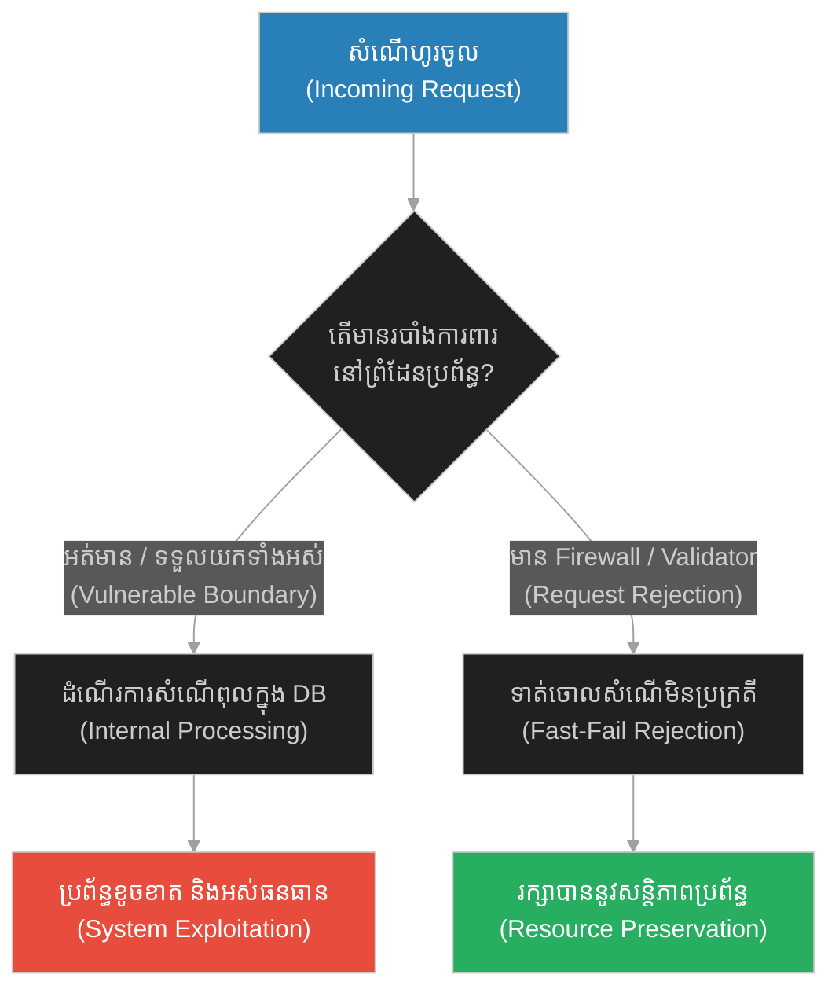
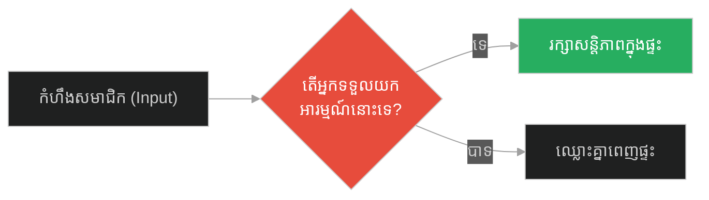
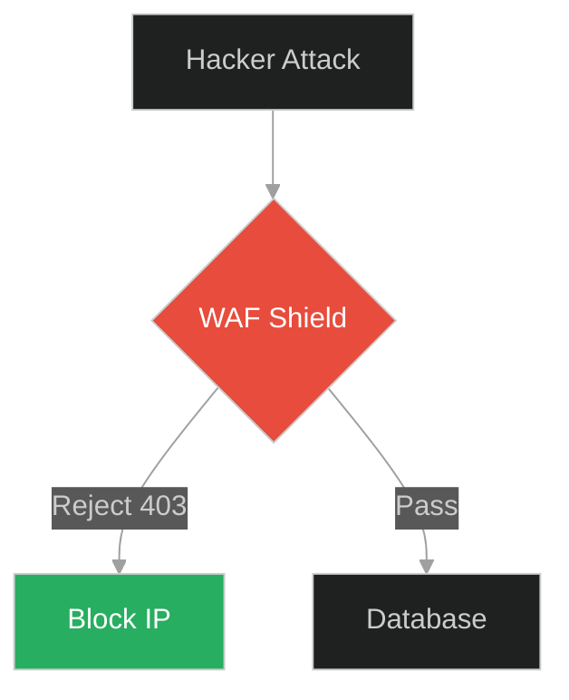
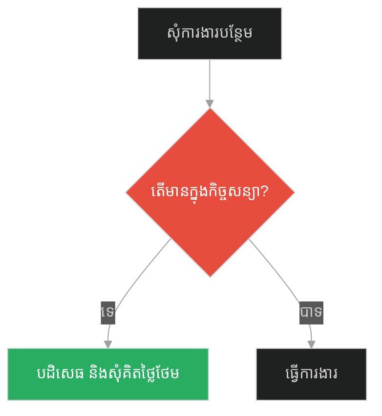
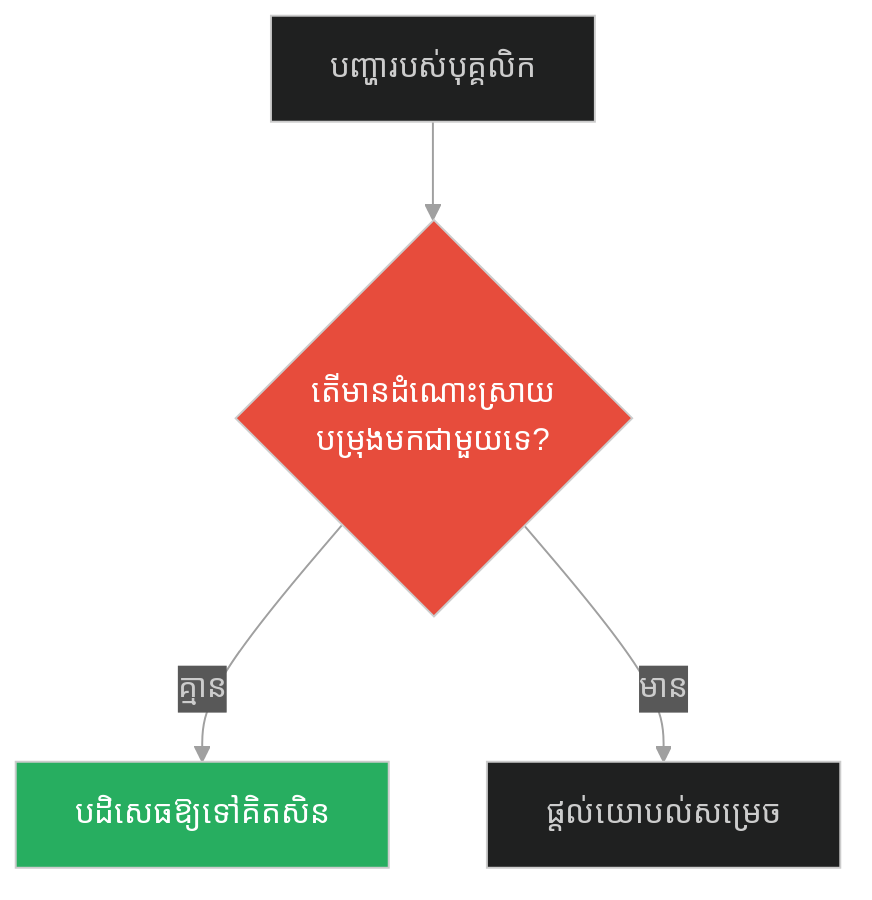
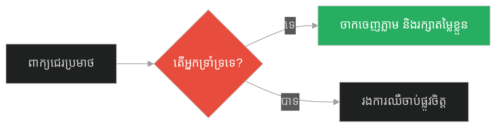
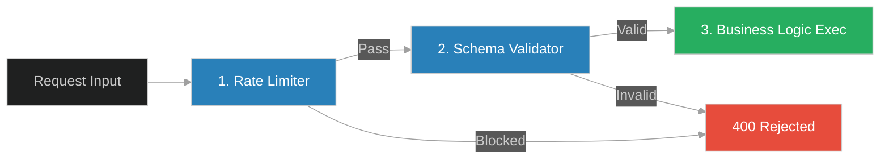

# Input Rejection & Request Boundary Firewall (សូក្រាត និងអំណោយដែលមិនត្រូវបានទទួល)៖ ការបដិសេធសំណើពុល និងរបាំងការពារដែនកំណត់ (Input Rejection & Request Boundary Firewall & Input Validation and Rate Limiting & Socrates and the Insult)

**Author:** ichamrong  
**Date:** 2026-05-28  
**Tags:** #input-rejection #boundary-firewall #security #input-validation #software-engineering  
**Category:** Concepts  
**Read Time:** ~15 min  

---

## 📌 មាតិកា (Table of Contents)
- [អន្ទាក់ផ្លូវចិត្ត (The Trap)](#0)
- [១. រឿងព្រេងនិទាន៖ បុរសដែលពូកែជេរប្រមាថ (The Legend of Socrates and the Insult)](#1)
  - [របាំងការពារព្រំដែន និងការទាត់ចោលសំណើពុល (Boundary Protection and the Refusal of Toxic Inputs)](#1-1)
- [២. បញ្ហា៖ ការអនុញ្ញាតឱ្យសំណើពុលជ្រៀតចូលស្នូលប្រព័ន្ធ (The Issue: Processing Dangerous Payloads in the Core)](#2)
- [៣. ឧទាហរណ៍ជាក់ស្តែងក្នុងពិភពពិត (Real World Examples)](#3)
  - [ឧទាហរណ៍ទី ១ — កម្រិតស្រាល (គ្រួសារ)៖ ការគប់អារម្មណ៍ដាក់គ្នា (The Family Emotional Projection vs Calm Boundary Setting)](#3-1)
  - [ឧទាហរណ៍ទី ២ — កម្រិតមធ្យម (បច្ចេកទេស)៖ ការទម្លាក់ SQL Injection តាម Form (The Dev Raw Input Attack vs Request Validation Firewall)](#3-2)
  - [ឧទាហរណ៍ទី ៣ — កម្រិតមធ្យម (ធុរកិច្ច)៖ អតិថិជនទាមទារហួសកិច្ចសន្យា (The Business Scope Creep vs Strict Contract Firewall)](#3-3)
  - [ឧទាហរណ៍ទី ៤ — កម្រិតមធ្យម (សង្គម/គ្រប់គ្រង)៖ បុគ្គលិកទម្លាក់ការងារឱ្យប្រធាន (The Management Upward Delegation vs Team Accountability)](#3-4)
  - [ឧទាហរណ៍ទី ៥ — កម្រិតធ្ងន់ (ទំនាក់ទំនង)៖ ការស្តាប់ពាក្យជេរប្រមាថរបស់ដៃគូ (The Relationship Tolerating Verbal Abuse vs Respect Boundaries)](#3-5)
- [៤. ដំណោះស្រាយទូទៅ៖ ការបង្កើតរបាំងការពារព្រំដែនប្រព័ន្ធ (The General Solution: Boundary Firewalls & Fast-Fail Middleware)](#4)
- [សេចក្តីសន្និដ្ឋាន (Conclusion)](#5)
- [ឯកសារយោង (References)](#6)
- [Related Posts](#7)

---

<a id="0"></a>
## អន្ទាក់ផ្លូវចិត្ត (The Trap)

តើយើងគួរការពារប្រព័ន្ធការងារ ជីវិត ឬកូដកុំព្យូទ័ររបស់យើងពីការយាយី និងការវាយប្រហារដោយសំណើពុលៗ (Malicious Requests/Insults) ដោយរបៀបណា? អន្ទាក់ផ្លូវចិត្តដ៏គ្រោះថ្នាក់បំផុតគឺ៖
*   **ការទទួលយក និងដំណើរការគ្រប់សំណើ (Vulnerable Ingestion)** — ការអនុញ្ញាតឱ្យរាល់អាកប្បកិរិយា ឬសំណើអាក្រក់ៗហូរចូលជ្រៅទៅក្នុងស្នូលប្រព័ន្ធ ដោយព្យាយាមដោះស្រាយវា ធ្វើឱ្យខូចខាតធនធាន និងពេលវេលា។
*   **ការទាត់ចោលនៅព្រំដែនដែនកំណត់ (Request Boundary Firewall)** — ការបង្កើតរបាំងការពារដើម្បីស្កេន និងទាត់ចោល (Reject) រាល់សំណើពុលភ្លាមៗនៅមាត់ច្រកចេញចូល ដោយមិនចំណាយធនធានផ្ទៃក្នុងសូម្បីតែបន្តិច។

1.  **រឿងព្រេងនិទាន (The Legend)** — ការបដិសេធមិនទទួលយកកំហឹង និងពាក្យជេរប្រមាថរបស់សូក្រាត (អំណោយពុល)។
2.  **បញ្ហា (The Issue)** — កូដដែលអនុញ្ញាតឱ្យ Payload គ្រោះថ្នាក់ចូលទៅដល់ Database ធ្វើឱ្យប្រព័ន្ធគាំង ឬលេចធ្លាយទិន្នន័យ។
3.  **ឧទាហរណ៍ជាក់ស្តែង (Real World Examples)** — របៀបបង្កើតខែលការពារខ្លួនពីពាក្យសម្តីអវិជ្ជមានក្នុងជីវិតរស់នៅ។
4.  **ដំណោះស្រាយ (The General Solution)** — ការអនុវត្ត API Gateways, Input Validation, និង Security Firewalls។



---

<a id="1"></a>
## ១. រឿងព្រេងនិទាន៖ បុរសដែលពូកែជេរប្រមាថ (The Legend of Socrates and the Insult)

ថ្ងៃមួយ ខណៈពេលដែលសូក្រាតកំពុងបង្រៀនសិស្សរបស់គាត់នៅទីសាធារណៈ មានបុរសម្នាក់ដែលមានគំនុំនឹងគាត់ បានដើរចូលមក ហើយចាប់ផ្តើមជេរប្រមាថសូក្រាតយ៉ាងខ្លាំងៗ។ 

បុរសនោះបានប្រើពាក្យអាក្រក់ៗ ហៅសូក្រាតថាជាមនុស្សល្ងង់ ជាមនុស្សបោកប្រាស់ និងជាមនុស្សដែលគ្មានប្រយោជន៍នៅក្នុងសង្គម។ សិស្សរបស់សូក្រាតមានការខឹងសម្បារយ៉ាងខ្លាំង ហើយរៀបនឹងស្ទុះទៅវាយបុរសនោះទៅហើយ។ 

ប៉ុន្តែសូក្រាតនៅតែឈរស្ងៀម ញញឹមយ៉ាងស្រាល ហើយមិនបាននិយាយតបតសូម្បីតែមួយម៉ាត់។ ពេលដែលបុរសនោះជេរទាល់តែហត់ និងអស់ពាក្យនិយាយ គាត់ក៏បានដើរចេញទៅដោយភាពមួរម៉ៅ ព្រោះសូក្រាតមិនមានប្រតិកម្មខឹងតបតនឹងគាត់សោះ។

សិស្សម្នាក់បានសួរទៅសូក្រាតដោយក្តីមួម៉ៅថា៖ *"លោកគ្រូ! ហេតុអ្វីបានជាលោកទ្រាំឱ្យគេជេរប្រមាថយ៉ាងធ្ងន់ធ្ងរបែបនេះ ដោយមិនព្រមតបតសោះ? តើលោកមិនមានអារម្មណ៍ឈឺចាប់ទេឬ?"*

សូក្រាតបានសួរទៅសិស្សនោះវិញថា៖ *"បើមាននរណាម្នាក់ យកអំណោយមួយមកឱ្យអ្នក ប៉ុន្តែអ្នកបដិសេធមិនព្រមទទួលយកអំណោយនោះ... តើអំណោយនោះនឹងក្លាយជារបស់នរណាវិញ?"*

សិស្សឆ្លើយថា៖ *"វាប្រាកដជានៅតែជារបស់ម្ចាស់ដើម ដែលជាអ្នកយកវាមកឱ្យនោះឯង។"*

សូក្រាតញញឹមហើយបញ្ជាក់ថា៖ 

**«ត្រឹមត្រូវហើយ! ពេលដែលបុរសនោះយក 'កំហឹង និងពាក្យជេរប្រមាថ' មកឱ្យខ្ញុំ ខ្ញុំបានបដិសេធមិនទទួលយកវាទេ។ ដូច្នេះហើយ ពាក្យជេរប្រមាថទាំងនោះ នៅតែជារបស់គាត់ដដែល។ គាត់គឺជាអ្នកដែលត្រូវរែកពុនក្តីក្តៅក្រហាយនោះ មិនមែនខ្ញុំទេ។»**

---

<a id="1-1"></a>
### របាំងការពារព្រំដែន និងការទាត់ចោលសំណើពុល (Boundary Protection and the Refusal of Toxic Inputs)

Climax នៃរឿងរ៉ាវនេះ គឺការបង្កើត "ខែលការពារផ្លូវចិត្តនៅកម្រិតព្រំដែន" (Mental Boundary Firewall)។ សូក្រាតមិនបានអនុញ្ញាតឱ្យពាក្យជេរប្រមាថ ចូលទៅដល់ការគិតក្នុងខួរក្បាលរបស់លោកឡើយ។ លោកបានទាត់វាចោលភ្លាមៗនៅច្រកចេញចូល (Refused at Input Stage)។ នៅក្នុងវិស្វកម្មសន្តិសុខប្រព័ន្ធ នេះគឺជាគោលការណ៍គ្រឹះនៃ **Request Boundary Firewall** ដែលមានតួនាទីបដិសេធសំណើពុល មុនពេលវាឆ្លងចូលទៅដល់ Logic ស្នូលរបស់ប្រព័ន្ធ។

---

<a id="2"></a>
## ២. បញ្ហា៖ ការអនុញ្ញាតឱ្យសំណើពុលជ្រៀតចូលស្នូលប្រព័ន្ធ (The Issue: Processing Dangerous Payloads in the Core)

នៅក្នុងការសរសេរកម្មវិធី បញ្ហាសន្តិសុខដ៏ធំបំផុតគឺការអនុញ្ញាតឱ្យទិន្នន័យដែលគ្មានសុវត្ថិភាព ឬការវាយប្រហារ (ដូចជា SQL Injection ឬ Malicious Scripts) ជ្រៀតចូលទៅដល់ Database ឬដំណើរការកូដស្នូល។ ប្រសិនបើប្រព័ន្ធមិនចម្រោះ ឬបដិសេធវាចោលតាំងពីដំបូង (Input Validation) ទេនោះ វានឹងធ្វើឱ្យខូចខាតប្រព័ន្ធទិន្នន័យទាំងមូល។

### Fragile Approach: Vulnerable Request Processing (ការដំណើរការសំណើដោយគ្មានការការពារ)
កូដ TypeScript ខាងក្រោមទទួលយកសំណើសុំរក្សាទុកទិន្នន័យ (POST payload) ដោយគ្មានការត្រួតពិនិត្យទំហំ និងប្រភេទសំណើ ធ្វើឱ្យងាយនឹងជួបប្រទះការវាយប្រហារ។

```typescript
// ❌ Fragile: ប្រព័ន្ធដំណើរការរាល់ទិន្នន័យដោយគ្មានខែលការពារ
import * as express from "express";

const app = express();
app.use(express.json()); // ទទួលយក JSON គ្រប់ទំហំទាំងអស់

app.post("/update-profile", (req, res) => {
    const userInput = req.body.bio;
    
    // គ្មានការឆែក Schema, គ្មានការលុបកូដពុល XSS, គ្មានការកម្រិតទំហំ
    // ដំណើរការដោយផ្ទាល់ទៅកាន់ Database (Vulnerable to DB crash or scripts)
    console.log(`Processing expensive DB write for: ${userInput}`);
    
    res.status(200).send("Profile updated successfully!");
});

app.listen(3000, () => console.log("Fragile server listening..."));
```

### Resilient Approach: Boundary Middleware & Joi Validation (ការប្រើប្រាស់ Middleware Firewall)
កូដ TypeScript ដ៏រឹងមាំខាងក្រោម បង្កើតប្រព័ន្ធការពារព្រំដែន (Firewall Middleware) ដើម្បី៖
1.  កម្រិតទំហំសំណើចូល (Payload size limit: 10kb)។
2.  ពិនិត្យរចនាសម្ព័ន្ធទិន្នន័យជាមុន (Zod/Joi Schema Validation)។
3.  ទាត់ចោលសំណើដែលធ្លាក់តេស្តភ្លាមៗ (Return 400 Bad Request) មុនពេលដំណើរការកូដស្នូល។

```typescript
// ✅ Resilient: បង្កើតរបាំងការពារដែនកំណត់ (Request Boundary Firewall)
import * as express from "express";
import { z } from "zod";

const resilientApp = express();

// ១. កម្រិតទំហំ Payload ការពារការបំពុលទំហំធំ (DOS attack protection)
resilientApp.use(express.json({ limit: "10kb" })); 

// ២. បង្កើត Schema សម្រាប់ផ្ទៀងផ្ទាត់ទិន្នន័យ
const ProfileUpdateSchema = z.object({
    userId: z.number().int().positive(),
    bio: z.string().min(3).max(200).regex(/^[a-zA-Z0-9\s.,!?]+$/) // មិនឱ្យមាន JavaScript/HTML tags
});

// ៣. Middleware Firewall (របាំងការពារព្រំដែន)
const boundaryFirewall = (req: express.Request, res: express.Response, next: express.NextFunction) => {
    const result = ProfileUpdateSchema.safeParse(req.body);
    
    if (!result.success) {
        // ទាត់ចោលសំណើពុលភ្លាមៗនៅព្រំដែនប្រព័ន្ធ (Fast-Fail Input Rejection)
        // មិនចំណាយធនធាន Database
        console.warn(`[FIREWALL BLOCK] Refused toxic input: ${JSON.stringify(result.error.format())}`);
        res.status(400).json({ error: "Invalid Request: Input rejected by firewall." });
        return;
    }
    
    next(); // ឱ្យទៅមុខទៀតបាន លុះត្រាតែមានសុវត្ថិភាព
};

resilientApp.post("/resilient-update-profile", boundaryFirewall, (req, res) => {
    // កូដស្នូលមានសុវត្ថិភាពខ្ពស់ ព្រោះទិន្នន័យត្រូវបានសម្អាតរួចរាល់
    console.log(`[CORE] Safe DB write for user: ${req.body.userId}`);
    res.status(200).send("Profile updated securely!");
});

resilientApp.listen(3000, () => console.log("Resilient server with firewall listening..."));
```

---

<a id="3"></a>
## ៣. ឧទាហរណ៍ជាក់ស្តែងក្នុងពិភពពិត (Real World Examples)

<a id="3-1"></a>
### ឧទាហរណ៍ទី ១ — កម្រិតស្រាល (គ្រួសារ)៖ ការគប់អារម្មណ៍ដាក់គ្នា (The Family Emotional Projection vs Calm Boundary Setting)
*   **Failure Scenario:** សមាជិកគ្រួសារម្នាក់ត្រឡប់មកពីធ្វើការដោយមួរម៉ៅ ហើយចាប់ផ្តើមស្រែកគំហកដាក់អ្នកដទៃ ធ្វើឱ្យគ្រប់គ្នាកំហឹងក្រោធ និងឈ្លោះប្រកែកគ្នាពេញផ្ទះ។
*   **Remediation:** សមាជិកដទៃរក្សាចិត្តស្ងប់ ប្រាប់ដោយទន់ភ្លន់ថា៖ "ខ្ញុំយល់ថាអ្នកហត់នឿយ តែខ្ញុំមិនទទួលយកសំឡេងគំហកនេះទេ" រួចដកខ្លួនចេញពីកំហឹងនោះ (បដិសេធមិនទទួលអំណោយពុល)។



<a id="3-2"></a>
### ឧទាហរណ៍ទី ២ — កម្រិតមធ្យម (បច្ចេកទេស)៖ ការទម្លាក់ SQL Injection តាម Form (The Dev Raw Input Attack vs Request Validation Firewall)
*   **Failure Scenario:** Hacker ព្យាយាមបញ្ចូលកូដ `DROP TABLE Users;` ទៅក្នុងប្រអប់ស្វែងរក ធ្វើឱ្យ Database របស់ក្រុមហ៊ុនបាត់បង់ទិន្នន័យទាំងស្រុង។
*   **Remediation:** ប្រើប្រាស់ Web Application Firewall (WAF) និង SQL parameterization ដើម្បីច្រានចោលសំណើដែលផ្ទុកកូដ SQL ភ្លាមៗ។



<a id="3-3"></a>
### ឧទាហរណ៍ទី ៣ — កម្រិតមធ្យម (ធុរកិច្ច)៖ អតិថិជនទាមទារហួសកិច្ចសន្យា (The Business Scope Creep vs Strict Contract Firewall)
*   **Failure Scenario:** អតិថិជនសុំឱ្យក្រុមហ៊ុនផ្តល់សេវាកម្មបន្ថែមឥតគិតថ្លៃក្រៅកិច្ចសន្យា ក្រុមហ៊ុនក៏យល់ព្រមរហូតដល់ខាតបង់ថវិកា និងកម្លាំងពលកម្ម។
*   **Remediation:** អនុវត្ត "កិច្ចសន្យាដែនកំណត់ច្បាស់លាស់ (Scope Contract)" បដិសេធរាល់ការសុំបន្ថែមក្រៅច្បាប់ លុះត្រាតែមានការបង់ប្រាក់បន្ថែម។



<a id="3-4"></a>
### ឧទាហរណ៍ទី ៤ — កម្រិតមធ្យម (សង្គម/គ្រប់គ្រង)៖ បុគ្គលិកទម្លាក់ការងារឱ្យប្រធាន (The Management Upward Delegation vs Team Accountability)
*   **Failure Scenario:** បុគ្គលិកជួបបញ្ហាបន្តិចបន្តួច ក៏យកបញ្ហានោះទៅបោះឱ្យប្រធានក្រុមដោះស្រាយជំនួស ធ្វើឱ្យប្រធានគ្មានពេលវេលាធ្វើការងារធំៗ។
*   **Remediation:** របាំងការពារ៖ ប្រធានមិនទទួលយកការងារដែលគ្មានសំណើដំណោះស្រាយ ២ជម្រើសជាមុនឡើយ ដើម្បីឱ្យបុគ្គលិកចេះគិតដោះស្រាយខ្លួនឯង។



<a id="3-5"></a>
### ឧទាហរណ៍ទី ៥ — កម្រិតធ្ងន់ (ទំនាក់ទំនង)៖ ការស្តាប់ពាក្យជេរប្រមាថរបស់ដៃគូ (The Relationship Tolerating Verbal Abuse vs Respect Boundaries)
*   **Failure Scenario:** ដៃគូស្នេហាជេរប្រមាថ និងប្រើពាក្យអសុរោះដាក់គ្នាជាប្រចាំ ដោយភាគីម្ខាងទៀតសុខចិត្តទ្រាំទ្រ ធ្វើឱ្យបាត់បង់តម្លៃខ្លួន និងកើតជំងឺផ្លូវចិត្ត។
*   **Remediation:** បង្កើតរបាំងការពារព្រំដែន៖ "ខ្ញុំស្រឡាញ់អ្នក តែខ្ញុំបដិសេធមិនស្តាប់ពាក្យជេរប្រមាថឡើយ" និងចាកចេញពីទីកន្លែងនោះភ្លាមៗនៅពេលមានការប្រើប្រាស់ពាក្យអសុរោះ។



---

<a id="4"></a>
## ៤. ដំណោះស្រាយទូទៅ៖ ការបង្កើតរបាំងការពារព្រំដែនប្រព័ន្ធ (The General Solution: Boundary Firewalls & Fast-Fail Middleware)

ដំណោះស្រាយដ៏ល្អបំផុតចំពោះការការពារប្រព័ន្ធ គឺការអនុវត្តវិធីសាស្ត្រ **Boundary Defense (ការការពារនៅព្រំដែន)**។

### ជំហានកសាងប្រព័ន្ធ៖
1.  **Block at Entryway (Fast-Fail):** ត្រួតពិនិត្យសំណើភ្លាមៗនៅពេលចូលមកដល់ (Middlewares)។
2.  **Rate Limiting:** កម្រិតចំនួនសំណើមកពី IP តែមួយ (ឧទាហរណ៍៖ អនុញ្ញាតឱ្យសុំត្រឹមតែ ៥ដងក្នុង១វិនាទី)។
3.  **Strict Schema Validation:** បដិសេធសំណើភ្លាមៗដោយគ្មានការលើកលែង (Return 400/403 Status) ប្រសិនបើយ៉ាងហោចណាស់មានចំណុចណាមួយមិនត្រូវតាម Schema។



---

<a id="5"></a>
## សេចក្តីសន្និដ្ឋាន (Conclusion)

> **«កុំអនុញ្ញាតឱ្យភ្លើងកំហឹង ឬសំណើពុលរបស់អ្នកដទៃ ចូលមកដុតបំផ្លាញផ្ទះរបស់អ្នកឡើយ។ ព្រំដែនដ៏រឹងមាំ គឺជាខែលការពារសន្តិភាព និងធនធានដ៏មានតម្លៃបំផុត។»**

ការដឹងពីរបៀបបដិសេធសំណើពុល (Input Rejection) គឺជាគន្លឹះរក្សាសន្តិសុខប្រព័ន្ធ និងសន្តិភាពផ្លូវចិត្ត។ នៅពេលដែលយើងយល់ព្រមអនុវត្តតេស្តរបស់សូក្រាត ដោយបដិសេធមិនទទួលយក "អំណោយពុល" ពីពិភពខាងក្រៅ យើងកំពុងតែសាងសង់របាំងការពារដែនកំណត់ (Request Boundary Firewall) ដ៏មានឥទ្ធិពលបំផុតសម្រាប់ខ្លួនយើង និងប្រព័ន្ធការងាររបស់យើង។

---

<a id="6"></a>
## ឯកសារយោង (References)

*   **Socrates on Insults (Stoic Practice)** — Philosophical records on how Socrates and Epictetus reacted to public insults with emotional boundary defenses.
*   **Web Application Firewall (WAF) Architecture** — Information security models explaining boundary request inspection and threat mitigations.
*   **Zod Schema Validation in API Gateways** — Technical specifications on building fast-fail API gateways with strict schemas.

---

<a id="7"></a>
## Related Posts

*   [[High Read-to-Write Ratio & Read-Optimized Databases] (សូក្រាត និងត្រចៀកពីរ មាត់មួយ)](./225-socrates-and-the-two-ears-one-mouth.md) — Read replicas and read-optimized database design.
*   [[Reflection API & Runtime Inspections] (សូក្រាត និងកញ្ចក់ឆ្លុះខ្លួនឯង)](./227-socrates-and-the-mirror.md) — Dynamic inspections and Reflection API.

## 🐇 ធ្លាក់ចូលក្នុងរន្ធទន្សាយ (Enter the Rabbit Hole)
ដើម្បីស្វែងយល់បន្ថែមអំពីការឆ្លុះបញ្ចាំងកូដ និងការត្រួតពិនិត្យប្រព័ន្ធពេលដំណើរការ សូមបន្តដំណើរទៅកាន់៖

* 🚀 **[ចាប់ផ្តើមដំណើររុករក (Start the Journey) ➔ Reflection API & Runtime Inspections (សូក្រាត និងកញ្ចក់ឆ្លុះខ្លួនឯង)៖ ការឆ្លុះបញ្ចាំងកូដ និងការត្រួតពិនិត្យប្រព័ន្ធពេលដំណើរការ (Reflection API & Runtime Inspections & Dynamic Inspection and Introspection & Socrates and the Mirror)](./227-socrates-and-the-mirror.md)**
