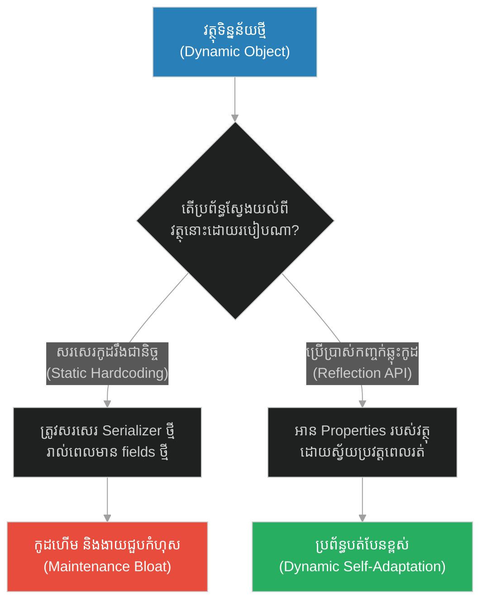
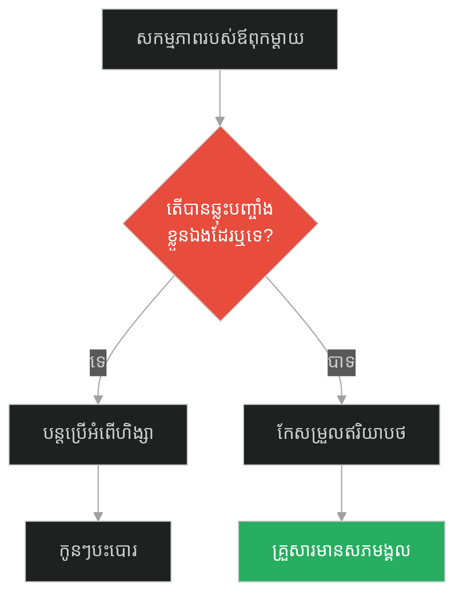
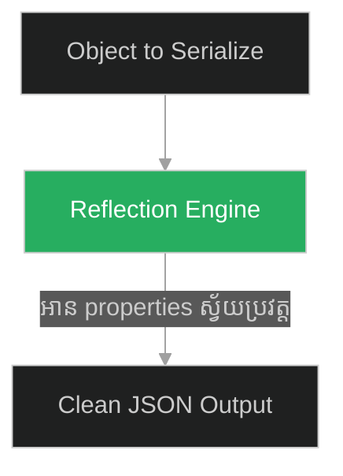
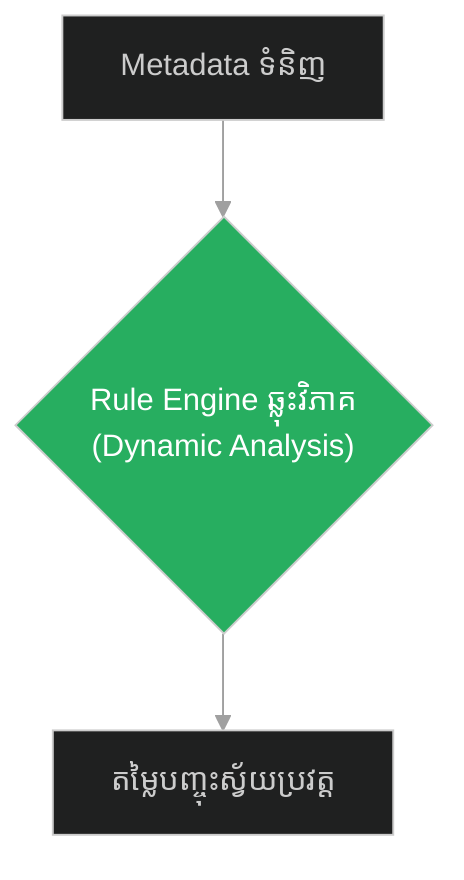
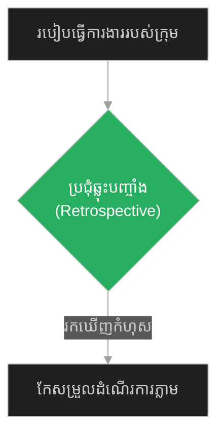
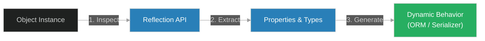

# Reflection API & Runtime Inspections (សូក្រាត និងកញ្ចក់ឆ្លុះខ្លួនឯង)៖ ការឆ្លុះបញ្ចាំងកូដ និងការត្រួតពិនិត្យប្រព័ន្ធពេលដំណើរការ (Reflection API & Runtime Inspections & Dynamic Inspection and Introspection & Socrates and the Mirror)

**Author:** ichamrong  
**Date:** 2026-05-28  
**Tags:** #reflection-api #runtime-inspection #introspection #metaprogramming #software-engineering  
**Category:** Concepts  
**Read Time:** ~15 min  

---

## 📌 មាតិកា (Table of Contents)
- [អន្ទាក់ផ្លូវចិត្ត (The Trap)](#0)
- [១. រឿងព្រេងនិទាន៖ ដំបូន្មានអំពីកញ្ចក់ (The Legend of Socrates and the Mirror)](#1)
  - [កញ្ចក់ឆ្លុះបញ្ចាំង និងការស្គាល់ខ្លួនឯងនៅពេលដំណើរការ (The Mirror of Self-Discovery and Runtime Self-Adaptation)](#1-1)
- [២. បញ្ហា៖ កូដរឹងរូសដែលមិនអាចសម្របខ្លួន (The Issue: Rigid Classes and Monolithic Typing)](#2)
- [៣. ឧទាហរណ៍ជាក់ស្តែងក្នុងពិភពពិត (Real World Examples)](#3)
  - [ឧទាហរណ៍ទី ១ — កម្រិតស្រាល (គ្រួសារ)៖ ការឆ្លុះបញ្ចាំងពីវិធីសាស្រ្តអប់រំកូន (The Family Unexamined Parenting vs Self-Reflective Audit)](#3-1)
  - [ឧទាហរណ៍ទី ២ — កម្រិតមធ្យម (បច្គេកទេស)៖ ការសរសេរកូដ Serializer ដាច់ដោយឡែក (The Dev Rigid JSON Parsing vs Generic Reflection Serializer)](#3-2)
  - [ឧទាហរណ៍ទី ៣ — កម្រិតមធ្យម (ធុរកិច្ច)៖ ប្រព័ន្ធគ្រប់គ្រងការបញ្ចុះតម្លៃ (The Business Hardcoded Rules vs Dynamic Metadata Pricing Engine)](#3-3)
  - [ឧទាហរណ៍ទី ៤ — កម្រិតមធ្យម (សង្គម/គ្រប់គ្រង)៖ ការប្រជុំតម្លៃតម្លៃឡើងវិញ (The Management Rigid Processes vs Retrospective Adjustments)](#3-4)
  - [ឧទាហរណ៍ទី ៥ — កម្រិតធ្ងន់ (ទំនាក់ទំនង)៖ ការលាក់បាំងកំហុសខ្លួនឯង (The Relationship Blame Game vs Self-Reflection Mirror)](#3-5)
- [៤. ដំណោះស្រាយទូទៅ៖ ការប្រើប្រាស់ Introspection & Metaprogramming (The General Solution: Dynamic Inspections)](#4)
- [សេចក្តីសន្និដ្ឋាន (Conclusion)](#5)
- [ឯកសារយោង (References)](#6)
- [Related Posts](#7)

---

<a id="0"></a>
## អន្ទាក់ផ្លូវចិត្ត (The Trap)

តើធ្វើដូចម្តេចដើម្បីឱ្យកម្មវិធីកុំព្យូទ័ររបស់អ្នកអាចដឹងពីរចនាសម្ព័ន្ធផ្ទៃក្នុង (Methods/Properties) របស់ខ្លួនឯង និងកែសម្រួលឥរិយាបថរត់កម្មវិធី (Runtime behavior) ដោយស្វ័យប្រវត្ត? អន្ទាក់ផ្លូវចិត្តដ៏ធំបំផុតនៅក្នុងការរចនាកូដគឺ៖
*   **ការសរសេរកូដរឹងស្តូក (Rigid / Static Hardcoding)** — ការកំណត់ឥរិយាបថរបស់វត្ថុ (Object) ជាមុនជាដាច់ខាត ដែលធ្វើឱ្យពិបាកក្នុងការបន្ថែមមុខងារថ្មីៗ និងមិនអាចបត់បែនបាន។
*   **ការឆ្លុះបញ្ចាំងកូដពេលដំណើរការ (Reflection / Introspection)** — ការអនុញ្ញាតឱ្យកូដពិនិត្យ និងវាយតម្លៃខ្លួនឯងក្នុងកំឡុងពេលកំពុងដំណើរការ (Runtime) ដូចជាការមើលកញ្ចក់ដើម្បីកែតម្រូវចលនា។

1.  **រឿងព្រេងនិទាន (The Legend)** — ការទូន្មានរបស់សូក្រាតឱ្យសិស្សមើលកញ្ចក់ដើម្បីតម្រង់ទិសដៅជីវិត។
2.  **បញ្ហា (The Issue)** — កង្វះលទ្ធភាពសង្កេតផ្ទៃក្នុង (Introspection) បង្ខំឱ្យសរសេរកូដដដែលៗ (Boilerplate code)។
3.  **ឧទាហរណ៍ជាក់ស្តែង (Real World Examples)** — របៀបដែលការស្គាល់ខ្លួនឯងជួយដោះស្រាយបញ្ហាក្នុងជីវិតការងារ និងទំនាក់ទំនង។
4.  **ដំណោះស្រាយ (The General Solution)** — ការប្រើប្រាស់ Reflection API, Attributes, និង Metadata Tags។



---

<a id="1"></a>
## ១. រឿងព្រេងនិទាន៖ ដំបូន្មានអំពីកញ្ចក់ (The Legend of Socrates and the Mirror)

សូក្រាតតែងតែទូន្មានសិស្សរបស់គាត់ និងយុវជនទាំងអស់នៅក្នុងក្រុងអាថែនឱ្យធ្វើរឿងមួយជាប្រចាំ គឺ៖ **«ការមើលកញ្ចក់ឱ្យបានញឹកញាប់»**។

ដំបូន្មាននេះបានធ្វើឱ្យមនុស្សជាច្រើនយល់ច្រឡំ។ ពួកគេគិតថា សូក្រាតចង់បង្រៀនពួកគេឱ្យក្លាយជាមនុស្សអាត្មានិយម ឬចូលចិត្តតែសម្បកក្រៅ និងសម្រស់។ ថ្ងៃមួយ សិស្សម្នាក់បានសួរថា៖ *"លោកគ្រូ ហេតុអ្វីបានជាលោកគ្រូចង់ឱ្យពួកយើងមើលកញ្ចក់ជារៀងរាល់ថ្ងៃអញ្ចឹង? តើការមើលកញ្ចក់មិនមែនជាការបង្ហាញពីភាពអំនួត និងលំអៀងទៅលើសម្រស់ទេឬ?"*

សូក្រាតបានពន្យល់ដោយស្នាមញញឹមថា៖ 
*"មិនមែនទាល់តែសោះ។ ខ្ញុំចង់ឱ្យអ្នកមើលកញ្ចក់ ដើម្បីវិភាគខ្លួនឯង និងកំណត់សកម្មភាពឱ្យបានត្រឹមត្រូវ៖*
1.  *ប្រសិនបើអ្នកមើលទៅក្នុងកញ្ចក់ ហើយឃើញថាខ្លួនឯងមាន **សម្រស់ស្អាតសង្ហា** ចូរធ្វើសកម្មភាព និងរស់នៅក្នុងជីវិតដែលសមនឹងសម្រស់របស់អ្នក។ កុំធ្វើសកម្មភាពអាក្រក់ណាដែលនាំឱ្យខូចតម្លៃនៃរូបរាងដ៏ល្អរបស់អ្នកឡើយ។*
2.  *ផ្ទុយទៅវិញ ប្រសិនបើអ្នកមើលទៅក្នុងកញ្ចក់ ហើយឃើញថាខ្លួនឯងមាន **រូបរាងអាក្រក់មិនស្អាត** ចូរខិតខំកែលម្អខ្លួនឯងតាមរយៈ 'ចំណេះដឹង និងគុណធម៌' ដើម្បីបំពេញចន្លោះខ្វះខាតនៃរូបរាងរបស់អ្នកវិញ។"*

សម្រាប់សូក្រាត កញ្ចក់មិនមែនសម្រាប់មើលដើម្បីអួតសម្រស់នោះទេ ប៉ុន្តែជាឧបករណ៍ឆ្លុះបញ្ចាំង (Reflection Instrument) ដើម្បីស្គាល់ពីស្ថានភាពពិតប្រាកដរបស់ខ្លួនឯង (Runtime Inspection) និងរៀបចំអាកប្បកិរិយាឱ្យបានត្រឹមត្រូវ។

---

<a id="1-1"></a>
### កញ្ចក់ឆ្លុះបញ្ចាំង និងការស្គាល់ខ្លួនឯងនៅពេលដំណើរការ (The Mirror of Self-Discovery and Runtime Self-Adaptation)

Climax នៃទស្សនៈនេះ គឺការបំប្លែងព័ត៌មានខាងក្រៅទៅជាសកម្មភាពខាងក្នុង។ កញ្ចក់អនុញ្ញាតឱ្យយើងស្វែងយល់ពីរចនាសម្ព័ន្ធពិតប្រាកដ (Properties) របស់ខ្លួនឯង។ នៅក្នុងការរចនាប្រព័ន្ធ គំនិតនេះត្រូវបានអនុវត្តតាមរយៈ **Reflection API** ឬ **Metadata Inspection** ដែលអនុញ្ញាតឱ្យកម្មវិធីត្រួតពិនិត្យ និងស្វែងយល់ពី "ថ្នាក់" (Classes) ឬ "មុខងារ" (Methods) របស់ខ្លួនឯង ខណៈពេលកំពុងដំណើរការ ដើម្បីសម្រេចចិត្តថាតើត្រូវចាត់ចែងសកម្មភាពបែបណាឱ្យសមស្រប។

---

<a id="2"></a>
## ២. បញ្ហា៖ កូដរឹងរូសដែលមិនអាចសម្របខ្លួន (The Issue: Rigid Classes and Monolithic Typing)

នៅក្នុងការសរសេរកម្មវិធី ប្រសិនបើប្រព័ន្ធចង់ដំណើរការទិន្នន័យ (ដូចជា បំប្លែងវត្ថុជាអក្សរ JSON ឬបង្កើតតារាង Database) តែត្រូវសរសេរកូដរឹង (Hardcoded logic) សម្រាប់រាល់ប្រភេទ Object ទាំងអស់ វានឹងធ្វើឱ្យកូដកាន់តែធំ និងពិបាកថែទាំ។ ប្រសិនបើមាន Properties ថ្មីត្រូវបានបន្ថែម យើងត្រូវកែកូដគ្រប់កន្លែង។

### Fragile Approach: Hardcoded Class Serialization (ការសរសេរកូដបំប្លែងទិន្នន័យរឹងស្តូក)
កូដ Python ខាងក្រោមបង្ហាញពីការបំប្លែង Object ទៅជា Dict ដោយត្រូវសរសេរ properties នីមួយៗដោយដៃ។ ប្រសិនបើបន្ថែម properties ថ្មី កូដ serialization នឹងខូចភ្លាម។

```python
# ❌ Fragile: កូដរឹងរូស ងាយនឹងខូចពេលមានការប្រែប្រួល properties
class User:
    def __init__(self, username, email):
        self.username = username
        self.email = email

class Product:
    def __init__(self, name, price):
        self.name = name
        self.price = price

def serialize_user(user: User) -> dict:
    # ត្រូវតែដឹងជាមុននូវ properties ទាំងអស់ (Hardcoded)
    return {
        "username": user.username,
        "email": user.email
    }

def serialize_product(product: Product) -> dict:
    return {
        "name": product.name,
        "price": product.price
    }
```

### Resilient Approach: Dynamic Serialization Using Reflection (ការប្រើប្រាស់កញ្ចក់ឆ្លុះកូដ)
កូដ Python ដ៏រឹងមាំខាងក្រោម បង្កើតកម្មវិធីបំប្លែងទិន្នន័យជាសកល (Universal Serializer) ដោយប្រើប្រាស់ Reflection (`dir()`, `getattr()`, ឬ `__dict__`) ដើម្បីស្វែងយល់ពី properties របស់ Object គ្រប់ប្រភេទដោយស្វ័យប្រវត្តពេលកំពុងរត់។

```python
# ✅ Resilient: ប្រើប្រាស់ Reflection API ដើម្បីវិភាគនិងបំប្លែងវត្ថុទិន្នន័យ
import inspect

class ReflectionSerializer:
    @staticmethod
    def serialize(obj) -> dict:
        # ១. មើលកញ្ចក់ (Introspection): ពិនិត្យមើល properties ទាំងអស់របស់ obj
        serialized_data = {}
        
        # ទទួលបាន properties និង methods ទាំងអស់របស់ object
        attributes = inspect.getmembers(obj, lambda a: not(inspect.isroutine(a)))
        
        for name, value in attributes:
            # មិនអាន properties ពិសេសរបស់ Python (ដូចជា __init__)
            if not name.startswith("_"):
                # ២. កែសម្រួលសកម្មភាព (Self-Adaptation): រក្សាទុកតម្លៃដោយស្វ័យប្រវត្ត
                serialized_data[name] = value
                
        return serialized_data

# បង្កើត Objects
class DynamicUser:
    def __init__(self, username, email, role="user"):
        self.username = username
        self.email = email
        self.role = role # បន្ថែម field ថ្មីដោយមិនបារម្ភ

class DynamicProduct:
    def __init__(self, name, price, category="electronics"):
        self.name = name
        self.price = price
        self.category = category

# ដំណើរការ៖
user = DynamicUser("socrates_dev", "socrates@philosophy.org")
product = DynamicProduct("Philosophy Book", 19.99)

# ប្រើកញ្ចក់ឆ្លុះ Serialize គ្រប់យ៉ាងបានយ៉ាងរលូន៖
print(ReflectionSerializer.serialize(user))
print(ReflectionSerializer.serialize(product))
```

---

<a id="3"></a>
## ៣. ឧទាហរណ៍ជាក់ស្តែងក្នុងពិភពពិត (Real World Examples)

<a id="3-1"></a>
### ឧទាហរណ៍ទី ១ — កម្រិតស្រាល (គ្រួសារ)៖ ការឆ្លុះបញ្ចាំងពីវិធីសាស្រ្តអប់រំកូន (The Family Unexamined Parenting vs Self-Reflective Audit)
*   **Failure Scenario:** ឪពុកម្តាយប្រើប្រាស់វិធីសាស្ត្រវាយប្រដៅកូនតឹងរឹងដូចជំនាន់មុន (Hardcoded parenting) ធ្វើឱ្យកូនៗកើតការបះបោរ និងមិនព្រមនិយាយរក។
*   **Remediation:** ឪពុកម្តាយសម្លឹងមើលកញ្ចក់ឆ្លុះបញ្ចាំងសកម្មភាពខ្លួនឯង (Self-reflect) រកឃើញចំណុចខ្វះខាត រួចកែសម្រួលវិធីសាស្ត្រមកប្រើការជជែកវែកញែកជំនួសវិញ។



<a id="3-2"></a>
### ឧទាហរណ៍ទី ២ — កម្រិតមធ្យម (បច្ចេកទេស)៖ ការសរសេរកូដ Serializer ដាច់ដោយឡែក (The Dev Rigid JSON Parsing vs Generic Reflection Serializer)
*   **Failure Scenario:** វិស្វករសរសេរកូដ JSON mapping សម្រាប់ Class ចំនួន ៥០ ដាច់ដោយឡែកពីគ្នា ធ្វើឱ្យកូដមានប្រវែងវែងរញ៉េរញ៉ៃ និងងាយខូចពេលមានការប្រែប្រួល។
*   **Remediation:** ប្រើប្រាស់ Reflection API (ដូចជា Jackson ក្នុង Java ឬ Reflect ក្នុង TS) ដើម្បីបំប្លែងរាល់ Object ទាំងអស់ដោយប្រើកូដតែមួយបន្ទាត់។



<a id="3-3"></a>
### ឧទាហរណ៍ទី ៣ — កម្រិតមធ្យម (ធុរកិច្ច)៖ ប្រព័ន្ធគ្រប់គ្រងការបញ្ចុះតម្លៃ (The Business Hardcoded Rules vs Dynamic Metadata Pricing Engine)
*   **Failure Scenario:** ហាងលក់ទំនិញអនឡាញសរសេរកូដបញ្ចុះតម្លៃរឹងនៅក្នុងប្រព័ន្ធ (Hardcoded if/else rules) ធ្វើឱ្យរាល់ពេលចង់បង្កើតប្រូម៉ូសិនថ្មី ត្រូវរង់ចាំយូររហូតដល់សប្តាហ៍ក្រោយទើបកូដ Deploy រួចរាល់។
*   **Remediation:** បង្កើត Rule Engine ដែលប្រើប្រាស់ Reflection ដើម្បីអាន Metadata របស់ទំនិញពេលដំណើរការ (Runtime) និងអនុវត្តការបញ្ចុះតម្លៃភ្លាមៗ។



<a id="3-4"></a>
### ឧទាហរណ៍ទី ៤ — កម្រិតមធ្យម (សង្គម/គ្រប់គ្រង)៖ ការប្រជុំតម្លៃតម្លៃឡើងវិញ (The Management Rigid Processes vs Retrospective Adjustments)
*   **Failure Scenario:** ក្រុមហ៊ុនបន្តអនុវត្តច្បាប់រាយការណ៍ការងារចាស់គំរិល ដែលស៊ីពេលបុគ្គលិក ២ម៉ោងរាល់ថ្ងៃ ទោះបីជាលែងមានប្រសិទ្ធភាពក៏ដោយ។
*   **Remediation:** រៀបចំការប្រជុំ Retrospective ប្រចាំខែ (កញ្ចក់ឆ្លុះរបស់ក្រុម) ដើម្បីស្វែងរកចំណុចស្ទះ និងកែសម្រួលនីតិវិធីការងារឱ្យបានរហ័ស។



<a id="3-5"></a>
### ឧទាហរណ៍ទី ៥ — កម្រិតធ្ងន់ (ទំនាក់ទំនង)៖ ការលាក់បាំងកំហុសខ្លួនឯង (The Relationship Blame Game vs Self-Reflection Mirror)
*   **Failure Scenario:** គូស្នេហ៍ចោទប្រកាន់គ្នាទៅវិញទៅមក (Blaming) រាល់ពេលមានជម្លោះ ដោយគ្មានភាគីណាម្នាក់ព្រមទទួលស្គាល់កំហុសខ្លួនឯង ធ្វើឱ្យស្នេហាកាន់តែល្អក់កករ។
*   **Remediation:** ភាគីនីមួយៗសម្លឹងមើលកញ្ចក់ឆ្លុះខ្លួនឯង (Self-reflection mirror) ទទួលស្គាល់ថាខ្លួនក៏មានកំហុស រួចចាប់ផ្តើមសុំទោសដៃគូមុន។


---

<a id="4"></a>
## ៤. ដំណោះស្រាយទូទៅ៖ ការប្រើប្រាស់ Introspection & Metaprogramming (The General Solution: Dynamic Inspections)

ដំណោះស្រាយដ៏ត្រឹមត្រូវសម្រាប់បង្កើតប្រព័ន្ធបត់បែន គឺការអនុវត្ត **Metaprogramming & Introspection (ការសរសេរកូដឆ្លាតវៃវិភាគខ្លួនឯង)**។

### ជំហានកសាងប្រព័ន្ធ៖
1.  **Expose Metadata:** ប្រើប្រាស់ Annotations, Decorators, ឬ Tags លើ Classes និង Properties ដើម្បីផ្តល់តម្រុយ (Hints)។
2.  **Runtime Inspection:** ប្រើប្រាស់ Reflection APIs ដើម្បីអានតម្រុយ និង properties ទាំងនោះពេលដំណើរការ។
3.  **Dynamic Invocation:** បង្កើត និងដំណើរការកូដជាលក្ខណៈ Dynamic ដោយផ្អែកលើការរកឃើញពីការឆ្លុះកញ្ចក់។



---

<a id="5"></a>
## សេចក្តីសន្និដ្ឋាន (Conclusion)

> **«ការសម្លឹងមើលកញ្ចក់ដើម្បីស្គាល់ខ្លួនឯង គឺជាជំហានដំបូងនៃការកែលម្អ។ កូដដែលស្គាល់រចនាសម្ព័ន្ធរបស់ខ្លួនឯង អាចកែសម្រួលដំណើរការឱ្យរលូនទៅតាមស្ថានភាពជាក់ស្តែង។»**

កញ្ចក់របស់សូក្រាត គឺជាមូលដ្ឋានគ្រឹះនៃភាពវៃឆ្លាតរបស់ប្រព័ន្ធ។ នៅពេលដែលយើងសរសេរកូដឱ្យមានលទ្ធភាពវិភាគខ្លួនឯង (Runtime Introspection) កម្មវិធីរបស់យើងនឹងមិននៅរឹងថ្កល់ឡើយ ប៉ុន្តែវានឹងអាចសម្របខ្លួន និងដំណើរការទិន្នន័យគ្រប់ប្រភេទដោយស្វ័យប្រវត្ត នាំមកនូវប្រសិទ្ធភាពការងារ និងភាពរឹងមាំជានិរន្តរ៍។

---

<a id="6"></a>
## ឯកសារយោង (References)

*   **Diogenes Laertius' Lives of the Eminent Philosophers (Book II - Socrates)** — Explaining Socrates' ethical advice on using physical mirrors for spiritual self-reflection.
*   **The Reflection API in Modern Programming Languages** — Concepts and documentations in Python (`inspect`), Java (`java.lang.reflect`), and JavaScript (`Reflect`).
*   **Metaprogramming Principles** — Software architecture design patterns on dynamic execution and introspection.

---

<a id="7"></a>
## Related Posts

*   [[Input Rejection & Request Boundary Firewall] (សូក្រាត និងអំណោយដែលមិនត្រូវបានទទួល)](./226-socrates-and-the-insult.md) — Input Validation and Request Filtering.
*   [[Lazy Loading & Just-In-Time Evaluation] (សូក្រាត និងផ្សារលក់ទំនិញ)](./228-socrates-and-the-marketplace.md) — Lazy loading and on-demand resource instantiation.

## 🐇 ធ្លាក់ចូលក្នុងរន្ធទន្សាយ (Enter the Rabbit Hole)
ដើម្បីស្វែងយល់បន្ថែមអំពីការទាញយកធនធានតាមតម្រូវការ និងការរចនាយឺតយ៉ាវដោយមានប្រយោជន៍ សូមបន្តដំណើរទៅកាន់៖

* 🚀 **[ចាប់ផ្តើមដំណើររុករក (Start the Journey) ➔ Lazy Loading & Just-In-Time Evaluation (សូក្រាត និងផ្សារលក់ទំនិញ)៖ ការទាញយកធនធានតាមតម្រូវការ និងការវាយតម្លៃទិន្នន័យទាន់ពេល (Lazy Loading & Just-In-Time Evaluation & Virtual Proxies and On-Demand Instantiation & Socrates and the Marketplace)](./228-socrates-and-the-marketplace.md)**
