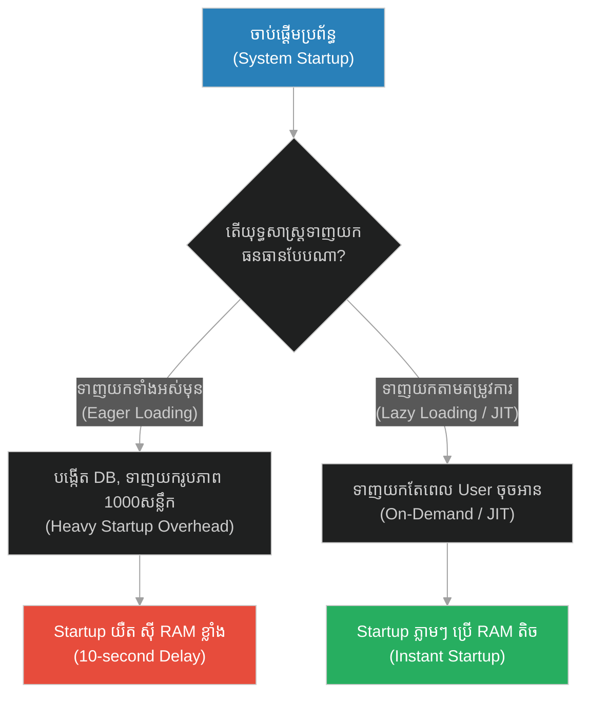
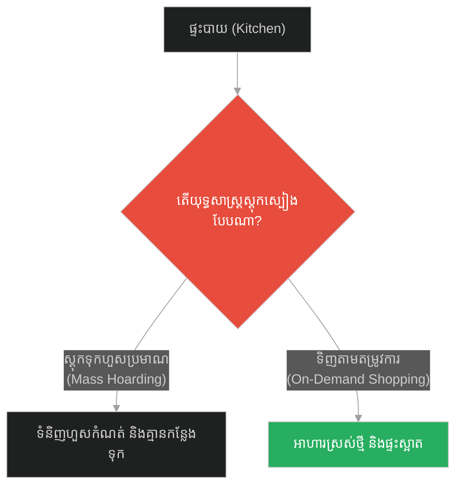
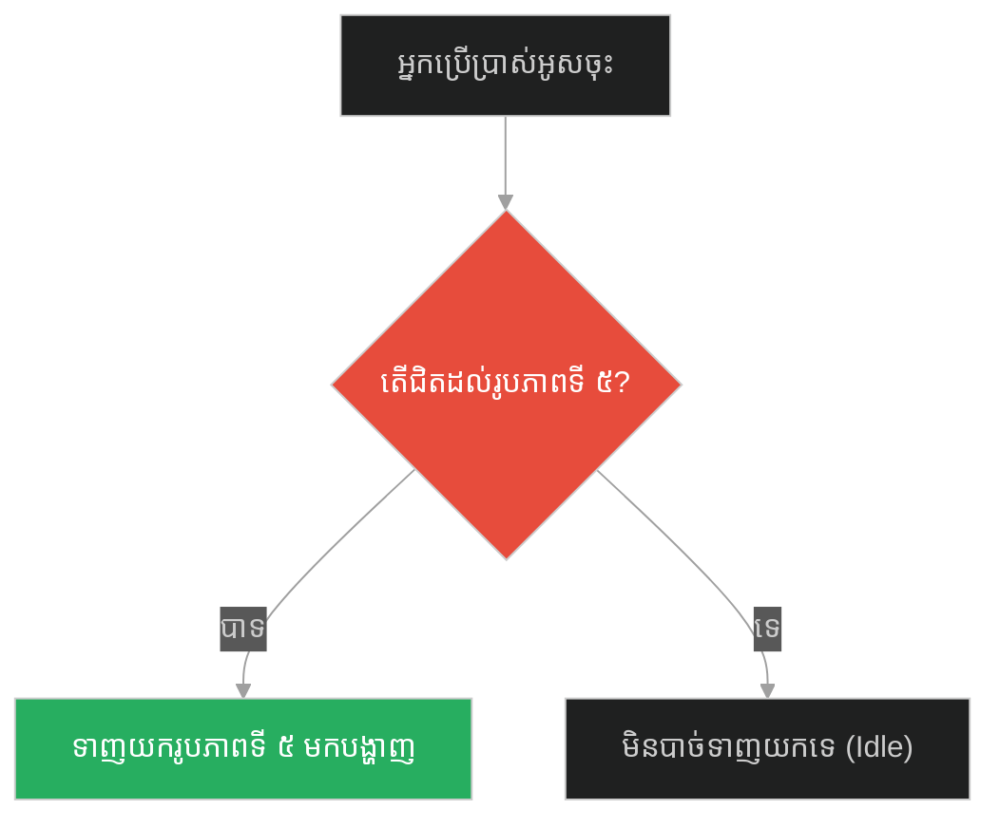
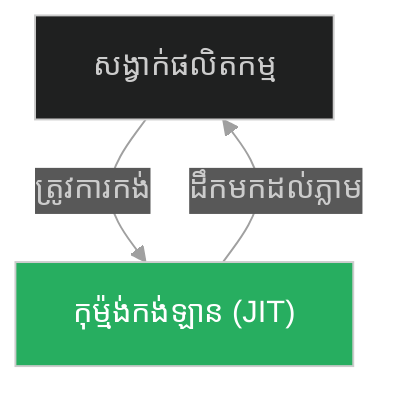
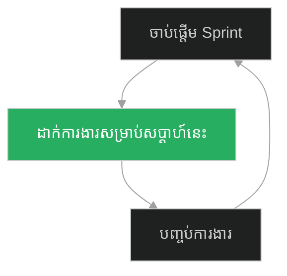

# Lazy Loading & Just-In-Time Evaluation (សូក្រាត និងផ្សារលក់ទំនិញ)៖ ការទាញយកធនធានតាមតម្រូវការ និងការវាយតម្លៃទិន្នន័យទាន់ពេល (Lazy Loading & Just-In-Time Evaluation & Virtual Proxies and On-Demand Instantiation & Socrates and the Marketplace)

**Author:** ichamrong  
**Date:** 2026-05-28  
**Tags:** #lazy-loading #just-in-time #virtual-proxy #performance #software-engineering  
**Category:** Concepts  
**Read Time:** ~15 min  

---

## 📌 មាតិកា (Table of Contents)
- [អន្ទាក់ផ្លូវចិត្ត (The Trap)](#0)
- [១. រឿងព្រេងនិទាន៖ ការដើរផ្សាររបស់សូក្រាត (The Legend of Socrates and the Marketplace)](#1)
  - [ភាពស្ងប់ស្ងៀមនៃតម្រូវការ និងការមិនផ្ទុកធនធានលើសលប់ (Serenity of Demand and Resource Abatement)](#1-1)
- [២. បញ្ហា៖ ការទាញយកធនធានតាំងពីដំបូងបង្កឱ្យប្រព័ន្ធយឺត (The Issue: Performance Bottlenecks Due to Eager Loading)](#2)
- [៣. ឧទាហរណ៍ជាក់ស្តែងក្នុងពិភពពិត (Real World Examples)](#3)
  - [ឧទាហរណ៍ទី ១ — កម្រិតស្រាល (គ្រួសារ)៖ ការទិញទំនិញស្តុកទុកហួសប្រមាណ (The Family Mass Hoarding vs On-Demand Grocery Shopping)](#3-1)
  - [ឧទាហរណ៍ទី ២ — កម្រិតមធ្យម (បច្ចេកទេស)៖ ការទាញយករូបភាពទាំងអស់ក្នុងគេហទំព័រ (The Dev Eager Image Loading vs Scroll-Based Lazy Loading)](#3-2)
  - [ឧទាហរណ៍ទី ៣ — កម្រិតមធ្យម (ធុរកិច្ច)៖ ប្រព័ន្ធគ្រប់គ្រងស្តុករបស់តូយ៉ូតា (The Business Massive Warehouse Overstock vs Toyota Just-In-Time Production)](#3-3)
  - [ឧទាហរណ៍ទី ៤ — កម្រិតមធ្យម (សង្គម/គ្រប់គ្រង)៖ ការដាក់ការងារឱ្យបុគ្គលិកមុនម៉ោង (The Management 6-Month Task Dump vs Phase-by-Phase Task Allocation)](#3-4)
  - [ឧទាហរណ៍ទី ៥ — កម្រិតធ្ងន់ (ទំនាក់ទំនង)៖ ការរៀបចំគម្រោងអនាគតលឿនពេក (The Relationship First Date Wedding Plan vs Step-by-Step Relationship Growth)](#3-5)
- [៤. ដំណោះស្រាយទូទៅ៖ ការបង្កើត Proxy តាមតម្រូវការ (The General Solution: Virtual Proxies & Code Splitting)](#4)
- [សេចក្តីសន្និដ្ឋាន (Conclusion)](#5)
- [ឯកសារយោង (References)](#6)
- [Related Posts](#7)

---

<a id="0"></a>
## អន្ទាក់ផ្លូវចិត្ត (The Trap)

ហេតុអ្វីបានជាកម្មវិធីរបស់អ្នកចំណាយពេលយូរខ្លាំងក្នុងការចាប់ផ្តើមដំណើរការ (Startup) និងស៊ីមេម៉ូរី (RAM) យ៉ាងច្រើន ទោះបីជាអ្នកប្រើប្រាស់មិនទាន់បានចុចលើប៊ូតុងអ្វីសោះក៏ដោយ? អន្ទាក់ផ្លូវចិត្តដ៏ធំបំផុតនៅក្នុងការគ្រប់គ្រងធនធានគឺ៖
*   **ការទាញយកធនធានទាំងអស់ព្រមគ្នា (Eager Loading)** — ការសន្មតថាអ្វីៗគ្រប់យ៉ាងត្រូវរៀបចំទុកជាមុន (Pre-load) នៅក្នុង constructor ដែលធ្វើឱ្យប្រព័ន្ធចាប់ផ្តើមយឺត និងខ្ជះខ្ជាយមេម៉ូរីលើរបស់ដែលមិនទាន់ប្រើ។
*   **ការទាញយកតាមតម្រូវការជាក់ស្តែង (Lazy Loading / Just-In-Time)** — ការមិនទាញយក ឬបង្កើតធនធានទាំងឡាយណាដែលមិនទាន់ត្រូវការ (ដូចជាការមិនទិញរបស់ដែលមិនទាន់ប្រើ) នាំឱ្យប្រព័ន្ធដំណើរការស្រាល និងរហ័ស។

1.  **រឿងព្រេងនិទាន (The Legend)** — ការដើរទស្សនាផ្សាររបស់សូក្រាត និងពាក្យស្លោក "របស់ដែលខ្ញុំមិនត្រូវការ"។
2.  **បញ្ហា (The Issue)** — ការបង្កើតការតភ្ជាប់ (Database Connections) ឬទាញយករូបភាពធំៗតាំងពីដំបូង ធ្វើឱ្យប្រព័ន្ធយឺត។
3.  **ឧទាហរណ៍ជាក់ស្តែង (Real World Examples)** — របៀបចាត់ចែងសង្វាក់ផលិតកម្ម Just-In-Time ដើម្បីសន្សំការចំណាយ។
4.  **ដំណោះស្រាយ (The General Solution)** — ការអនុវត្ត Virtual Proxies និង Dynamic Loading Logic។



---

<a id="1"></a>
## ១. រឿងព្រេងនិទាន៖ ការដើរផ្សាររបស់សូក្រាត (The Legend of Socrates and the Marketplace)

នៅក្នុងទីក្រុងអាថែនបុរាណ មានផ្សារធំមួយដ៏អ៊ូអរ ដែលលក់ដូរទំនិញប្រណីតៗមកពីគ្រប់ទិសទីលើពិភពលោក តាំងពីសម្លៀកបំពាក់សូត្រ គ្រឿងអលង្ការមាសប្រាក់ រហូតដល់ម្ហូបអាហារប្លែកៗ និងរបស់របរប្រើប្រាស់ថ្លៃៗ។

ថ្ងៃមួយ មិត្តភក្តិរបស់សូក្រាតបាននាំលោកទៅដើរលេងនៅក្នុងផ្សារនោះ។ ពួកគេដើរកាត់តូបលក់ដូរជាច្រើនដែលពោរពេញទៅដោយរបស់របរស្អាតៗ និងគួរឱ្យចង់បាន។ មិត្តភក្តិរបស់សូក្រាតបានគិតថា សូក្រាតប្រហែលជាមានចិត្តចង់បានរបស់ទាំងនោះ ឬក៏មានអារម្មណ៍ច្រណែននឹងអ្នកមានដែលបានទិញរបស់ទាំងនោះប្រើប្រាស់។

ផ្ទុយទៅវិញ សូក្រាតដើរសម្លឹងមើលរបស់របរប្រណីតៗទាំងនោះដោយទឹកមុខស្ងប់ស្ងាត់ និងមានស្នាមញញឹមយ៉ាងស្រស់។ លោកបានដកដង្ហើមធំ រួចលាន់មាត់និយាយទៅកាន់មិត្តភក្តិរបស់លោកថា៖ 

**«អូ! មើលចុះ! ពិតជាមានរបស់របរជាច្រើននៅលើលោកនេះណាស់ ដែលខ្ញុំមិនត្រូវការសោះឡើយ! (How many things there are that I do not need!)»**

ខណៈពេលដែលមនុស្សទូទៅ តែងតែចង់ទិញ និងប្រមូលរបស់របរទាំងនោះយកទៅទុកនៅក្នុងផ្ទះ ទោះបីជាមិនទាន់ប្រើប្រាស់ក៏ដោយ សូក្រាតបានមើលឃើញថា ការមិនពាក់ព័ន្ធ និងការមិនផ្ទុករបស់ដែលមិនចាំបាច់ គឺជាសេរីភាពដ៏ពិតប្រាកដ។ លោកនឹងទិញ ឬរៀបចំរបស់របរ លុះត្រាតែមានតម្រូវការជាក់ស្តែងមកដល់ (Just-In-Time)។

---

<a id="1-1"></a>
### ភាពស្ងប់ស្ងៀមនៃតម្រូវការ និងការមិនផ្ទុកធនធានលើសលប់ (Serenity of Demand and Resource Abatement)

Climax នៃទស្សនវិជ្ជានេះ គឺការបដិសេធ "ការផ្ទុកធនធានទុកជាមុនដោយគ្មានការប្រើប្រាស់" (Speculative Loading)។ នៅក្នុងស្ថាបត្យកម្មប្រព័ន្ធកុំព្យូទ័រ ការទាញយកទិន្នន័យ ឬការបង្កើត Object ធំៗទុកជាមុន ទាំងដែល User មិនទាន់ចុចមើល គឺជាការខ្ជះខ្ជាយធនធានមេម៉ូរី និងបណ្តាញអ៊ីនធឺណិត។ សូក្រាតបង្រៀនយើងឱ្យរស់នៅ និងរចនាប្រព័ន្ធដោយប្រើប្រាស់គោលការណ៍ **Lazy Loading**៖ កុំបង្កើត កុំទិញ កុំទាញយក អ្វីដែលមិនទាន់ត្រូវការនៅពេលនេះ។

---

<a id="2"></a>
## ២. បញ្ហា៖ ការទាញយកធនធានតាំងពីដំបូងបង្កឱ្យប្រព័ន្ធយឺត (The Issue: Performance Bottlenecks Due to Eager Loading)

នៅក្នុងការអភិវឌ្ឍន៍សូហ្វវែរ ការអនុវត្ត "Eager Loading" (ការផ្ទុកធនធានទាំងអស់ក្នុងពេលតែមួយ) បង្កជាបញ្ហាធ្ងន់ធ្ងរ។ ឧទាហរណ៍៖ Server ចំណាយពេល ១០វិនាទីដើម្បីបើកដំណើរការ ព្រោះវាបង្កើត Connection ទៅកាន់ Database ទាំង ៥ និងទាញយកទិន្នន័យកំណត់ត្រាទាំង ១ម៉ឺនជួរ ចូលក្នុងមេម៉ូរីភ្លាមៗ ទោះបីជាគ្មាន User ណាម្នាក់ផ្ញើសំណើមកក៏ដោយ។

### Fragile Approach: Eager Resource Initialization (ការបង្កើតធនធានទាំងអស់តាំងពីដំបូង)
កូដ Python ខាងក្រោមបង្ហាញពី Class មួយដែលបង្កើត Connection និងទាញយកទិន្នន័យធំភ្លាមៗនៅក្នុង `__init__` ដែលធ្វើឱ្យការបង្កើត Object យឺតយ៉ាវខ្លាំង។

```python
# ❌ Fragile: ប្រព័ន្ធទាញយកទិន្នន័យធ្ងន់ៗទាំងអស់តាំងពីចាប់ផ្តើម (Eager Loading)
import time

class HeavyDatabaseConnection:
    def __init__(self):
        print("Connecting to Database...")
        time.sleep(3) # ក្លែងធ្វើការរង់ចាំ 3 វិនាទី
        self.data = ["Record 1", "Record 2", "Record 3"]

class FragileApp:
    def __init__(self):
        # បង្កើត Connection ភ្លាមៗ ទោះបីជាមិនទាន់ប្រើប្រាស់ក៏ដោយ
        self.db = HeavyDatabaseConnection() 
        print("App initialized and ready.")

    def run_homepage(self):
        # ដំណើរការទំព័រដើមដែលមិនត្រូវការ Database ឡើយ
        return "Welcome to Homepage (Static content)"
```

### Resilient Approach: Lazy Loading with Virtual Proxy (ការទាញយកតាមតម្រូវការ)
កូដ Python ដ៏រឹងមាំខាងក្រោម ប្រើប្រាស់វិធីសាស្ត្រ **Virtual Proxy (ឬ Lazy Property)**។ ការតភ្ជាប់ទៅកាន់ Database និងការទាញយកទិន្នន័យ នឹងត្រូវពន្យារពេល រហូតដល់មានមុខងារណាមួយសួររកវាពិតប្រាកដ។

```python
# ✅ Resilient: ពន្យារពេលបង្កើតធនធានរហូតដល់មានការសួររកពិតប្រាកដ (Lazy Loading)
import time

class HeavyDatabaseConnection:
    def __init__(self):
        print("⚡ Connecting to Database (Just-In-Time)...")
        time.sleep(3)
        self.data = ["Record 1", "Record 2", "Record 3"]

class ResilientApp:
    def __init__(self):
        self._db = None # មិនទាន់បង្កើត Connection ទេ
        print("App initialized instantly!")

    @property
    def db(self):
        # បង្កើត Connection លុះត្រាតែមានការហៅប្រើជាលើកដំបូង (Lazy Loading)
        if self._db is None:
            self._db = HeavyDatabaseConnection()
        return self._db

    def run_homepage(self):
        # ដំណើរការបានលឿនភ្លាមៗ គ្មានការរង់ចាំ 3 វិនាទីសោះ
        return "Welcome to Homepage (Static content)"

    def run_admin_dashboard(self):
        # ត្រូវការ database ទើបចាប់ផ្តើមបង្កើត Connection ពេលនេះ (Just-In-Time)
        return f"Dashboard Records: {self.db.data}"

# ការប្រើប្រាស់៖
app = ResilientApp() # បើកភ្លាមៗ គ្មានយឺតយ៉ាវ
print(app.run_homepage())
# ពេល User ចូល Admin Dashboard ទើប DB Connection ដំណើរការ៖
print(app.run_admin_dashboard())
```

---

<a id="3"></a>
## ៣. ឧទាហរណ៍ជាក់ស្តែងក្នុងពិភពពិត (Real World Examples)

<a id="3-1"></a>
### ឧទាហរណ៍ទី ១ — កម្រិតស្រាល (គ្រួសារ)៖ ការទិញទំនិញស្តុកទុកហួសប្រមាណ (The Family Mass Hoarding vs On-Demand Grocery Shopping)
*   **Failure Scenario:** គ្រួសារមួយទិញត្រីខ និងអង្ករស្តុកទុកសម្រាប់រយៈពេល ២ឆ្នាំ ពេញពេញផ្ទះ ធ្វើឱ្យខូចខាតអស់គុណភាព និងគ្មានកន្លែងដើរ។
*   **Remediation:** ទិញស្បៀងអាហារត្រឹមតែសម្រាប់ ១សប្តាហ៍ម្តង ហើយទិញបន្ថែមនៅពេលដែលជិតអស់ (On-demand/Lazy)។



<a id="3-2"></a>
### ឧទាហរណ៍ទី ២ — កម្រិតមធ្យម (បច្ចេកទេស)៖ ការទាញយករូបភាពទាំងអស់ក្នុងគេហទំព័រ (The Dev Eager Image Loading vs Scroll-Based Lazy Loading)
*   **Failure Scenario:** Page វិចិត្រសាលរូបភាព (Gallery) ដែលមានរូបភាព ១០០សន្លឹក ព្យាយាមទាញយករូបភាពទាំងអស់ព្រមគ្នានៅពេលបើកដំបូង ធ្វើឱ្យ User រង់ចាំ ១៥វិនាទី និងអស់លុយកញ្ចប់អ៊ីនធឺណិត។
*   **Remediation:** ប្រើប្រាស់ `loading="lazy"` tag ក្នុង HTML ដើម្បីទាញយករូបភាព លុះត្រាតែ User អូសចុះមកក្រោម (Scroll Down) ជិតដល់រូបភាពនោះ។



<a id="3-3"></a>
### ឧទាហរណ៍ទី ៣ — កម្រិតមធ្យម (ធុរកិច្ច)៖ ប្រព័ន្ធគ្រប់គ្រងស្តុករបស់តូយ៉ូតា (The Business Massive Warehouse Overstock vs Toyota Just-In-Time Production)
*   **Failure Scenario:** ក្រុមហ៊ុនផលិតឡានជួលឃ្លាំងធំៗដើម្បីស្តុកទុកកង់ឡានរាប់ម៉ឺនគ្រឿងទុកជាមុន នាំឱ្យកើនឡើងថ្លៃជួលឃ្លាំង និងខាតបង់ថវិកា។
*   **Remediation:** អនុវត្តប្រព័ន្ធ "Just-In-Time (JIT)" របស់ក្រុមហ៊ុន Toyota៖ កង់ឡាននឹងត្រូវដឹកមកដល់រោងចក្រ លុះត្រាតែឡាននោះកំពុងដំឡើងនៅលើសង្វាក់ផលិតកម្ម។



<a id="3-4"></a>
### ឧទាហរណ៍ទី ៤ — កម្រិតមធ្យម (សង្គម/គ្រប់គ្រង)៖ ការដាក់ការងារឱ្យបុគ្គលិកមុនម៉ោង (The Management 6-Month Task Dump vs Phase-by-Phase Task Allocation)
*   **Failure Scenario:** ប្រធានគម្រោងបោះរាល់ការងារសម្រាប់រយៈពេល ៦ខែខាងមុខ ឱ្យទៅបុគ្គលិកថ្មីនៅថ្ងៃដំបូង ធ្វើឱ្យពួកគេភ័យស្លន់ស្លោ និងមានអារម្មណ៍ធុញទ្រាន់នឹងការងារ។
*   **Remediation:** បែងចែកការងារជាដំណាក់កាល (Sprints) ពន្យល់ និងដាក់ការងារឱ្យធ្វើសម្រាប់តែសប្តាហ៍នេះប៉ុណ្ណោះ (Phase-by-phase allocation)។



<a id="3-5"></a>
### ឧទាហរណ៍ទី ៥ — កម្រិតធ្ងន់ (ទំនាក់ទំនង)៖ ការរៀបចំគម្រោងអនាគតលឿនពេក (The Relationship First Date Wedding Plan vs Step-by-Step Relationship Growth)
*   **Failure Scenario:** ដៃគូសន្ទនានិយាយពីរឿងរៀបការ និងទិញផ្ទះរួមគ្នាតាំងពីថ្ងៃជួបគ្នាដំបូង (Eager Commitment) ធ្វើឱ្យភាគីម្ខាងទៀតមានអារម្មណ៍ភ័យខ្លាច និងចង់ចាកចេញ។
*   **Remediation:** ទុកឱ្យទំនាក់ទំនងរីកចម្រើនជាជំហានៗ (Just-in-Time conversations) ស្វែងយល់ចិត្តគ្នាជាមុនសិន មុននឹងសម្រេចចិត្តរឿងធំៗ។


---

<a id="4"></a>
## ៤. ដំណោះស្រាយទូទៅ៖ ការបង្កើត Proxy តាមតម្រូវការ (The General Solution: Virtual Proxies & Code Splitting)

ដំណោះស្រាយជាសកលសម្រាប់រក្សាបាននូវភាពស្រាលស្រទន់របស់ប្រព័ន្ធ គឺការអនុវត្តវិធីសាស្ត្រ **On-Demand Resource Allocation (ការបែងចែកធនធានតាមតម្រូវការ)**។

### ជំហានកសាងប្រព័ន្ធ៖
1.  **Define Placeholders (Proxies):** បង្កើតវត្ថុតំណាងតូចៗ (Proxy/Placeholder) ជំនួសឱ្យវត្ថុពិតធំៗនៅពេលចាប់ផ្តើម។
2.  **Defer Instantiation:** កំណត់លក្ខខណ្ឌបង្កើតវត្ថុពិត លុះត្រាតែមានការហៅប្រើប្រាស់ជាក់ស្តែង (Getter check)។
3.  **Implement Code Splitting:** ក្នុងកម្មវិធី Web development, បំបែកកូដជាចំណែកៗ (Bundles) និងទាញយកកូដទំព័រដទៃទៀត លុះត្រាតែ User ប្តូរទៅកាន់ទំព័រនោះ។

```mermaid
%%{init: {
  'theme': 'dark',
  'themeVariables': {
    'background': '#1e1e1e',
    'primaryTextColor': '#ffffff',
    'lineColor': '#a0a0a0'
  },
  'themeCSS': 'svg { background-color: #1e1e1e !important; padding: 1rem !important; border-radius: 8px !important; } .edgeLabel rect { fill: #1e1e1e !important; } text, tspan { fill: #ffffff !important; }'
}}%%
graph LR
    Client["Client Request"] --> Proxy["Virtual Proxy"]
    Proxy -->{"តើវត្ថុពិតត្រូវបាន<br/>បង្កើតរួចហើយ?"}
    
    {"តើវត្ថុពិតត្រូវបាន<br/>បង្កើតរួចហើយ?"} -- ទេ --> LoadReal["បង្កើតវត្ថុពិតទាន់ពេល<br/>(JIT Initialization)"]
    LoadReal --> Return["ប្រគល់លទ្ធផល"]
    {"តើវត្ថុពិតត្រូវបាន<br/>បង្កើតរួចហើយ?"} -- បាទ --> Return
    
    style Proxy fill:#2980b9,color:#fff
    style LoadReal fill:#27ae60,color:#fff
```

---

<a id="5"></a>
## សេចក្តីសន្និដ្ឋាន (Conclusion)

> **«របស់របរជាច្រើននៅលើលោកនេះ មិនត្រូវបានត្រូវការនោះទេ រហូតដល់ពេលវេលាជាក់លាក់មួយបានមកដល់។ ការមិនផ្ទុកធនធានដែលមិនទាន់ប្រើប្រាស់ គឺជាអាថ៌កំបាំងនៃភាពស្រាលស្រទន់ និងល្បឿនលឿនរហ័ស។»**

ទស្សនវិជ្ជាដើរផ្សាររបស់សូក្រាត គឺជាមេរៀនដ៏ល្អសម្រាប់ការកសាងប្រព័ន្ធដែលមានប្រសិទ្ធភាពខ្ពស់។ តាមរយៈការអនុវត្ត **Lazy Loading & Just-In-Time Evaluation** យើងអាចធានាបានថាកម្មវិធី និងជីវិតរបស់យើង មិនត្រូវបានផ្ទុកធ្ងន់ដោយរបស់របរដែលមិនចាំបាច់ ជួយឱ្យយើងរស់នៅ និងដំណើរការប្រព័ន្ធបានយ៉ាងរហ័ស លឿនស្រាល និងប្រកបដោយសេរីភាពជានិរន្តរ៍។

---

<a id="6"></a>
## ឯកសារយោង (References)

*   **Diogenes Laertius' Lives of the Eminent Philosophers (Socrates)** — Highlighting the ancient source of Socrates' quote about the marketplace and unnecessary goods.
*   **Lazy Loading Design Patterns** — Software development patterns detailing proxy structures and delayed instantiation logic.
*   **Just-In-Time Production System (Toyota Production System)** — Lean manufacturing history on how reducing inventory overhead leads to massive business success.

---

<a id="7"></a>
## Related Posts

*   [[Reflection API & Runtime Inspections] (សូក្រាត និងកញ្ចក់ឆ្លុះខ្លួនឯង)](./227-socrates-and-the-mirror.md) — Dynamic inspections and Reflection API.
*   [[Coordinated Shutdown & Connection Draining] (សូក្រាត និងការចាកចេញរបស់នាវា)](./229-socrates-and-the-boat.md) — Graceful shutdown and connection draining.

## 🐇 ធ្លាក់ចូលក្នុងរន្ធទន្សាយ (Enter the Rabbit Hole)
ដើម្បីស្វែងយល់បន្ថែមអំពីការបិទដំណើរការប្រព័ន្ធដោយសម្របសម្រួល និងការចាកចេញដោយសុវត្ថិភាព សូមបន្តដំណើរទៅកាន់៖

* 🚀 **[ចាប់ផ្តើមដំណើររុករក (Start the Journey) ➔ Coordinated Shutdown & Connection Draining (សូក្រាត និងការចាកចេញរបស់នាវា)៖ ការបិទដំណើរការប្រព័ន្ធដោយសម្របសម្រួល និងការបង្ហូរការតភ្ជាប់ (Coordinated Shutdown & Connection Draining & Graceful Shutdown and Resource Cleanup & Socrates and the Boat)](./229-socrates-and-the-boat.md)**
