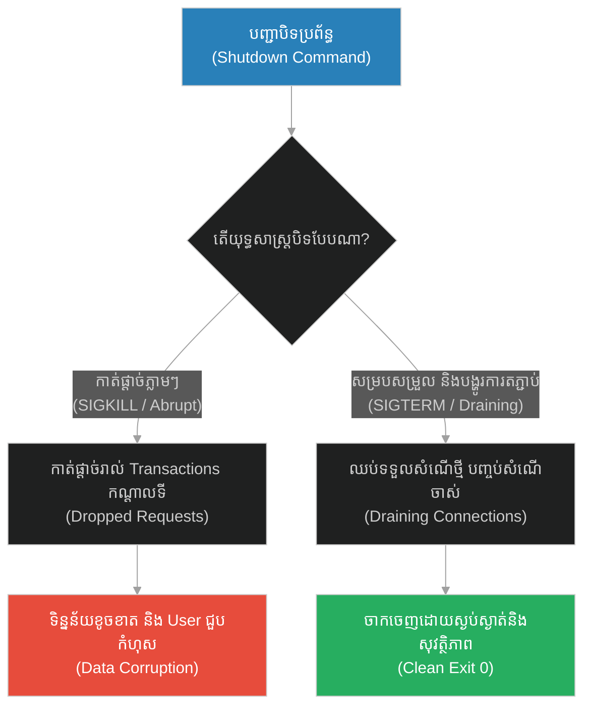
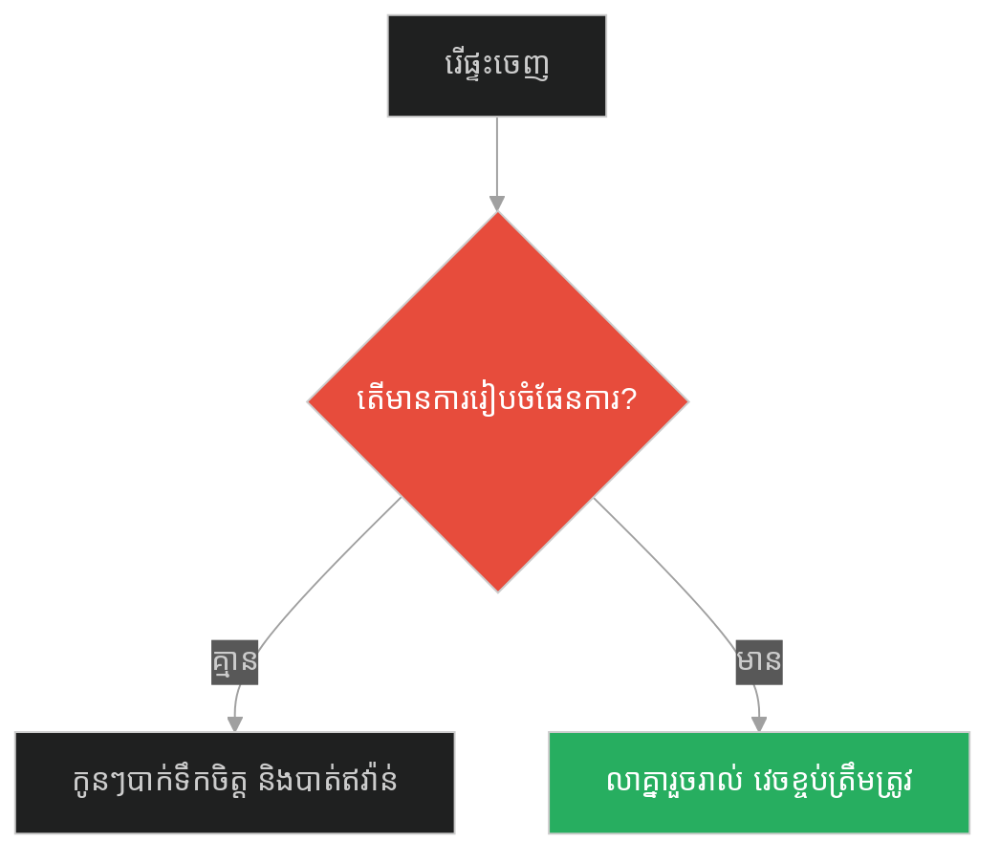
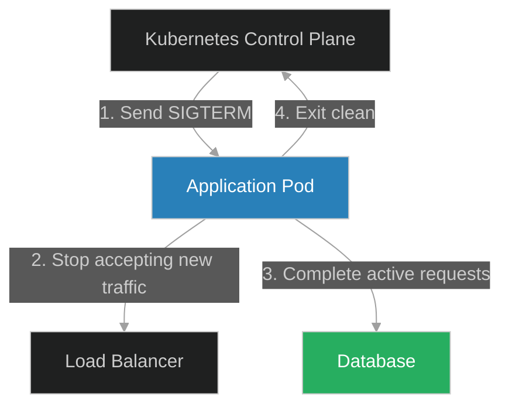
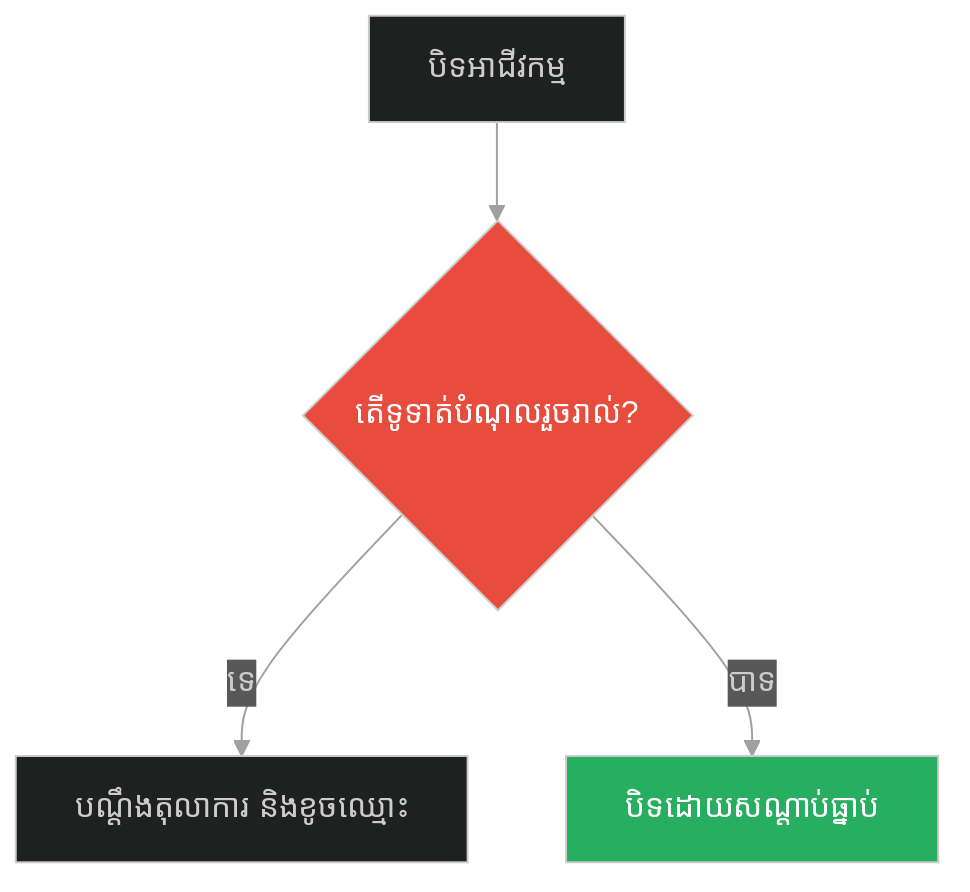
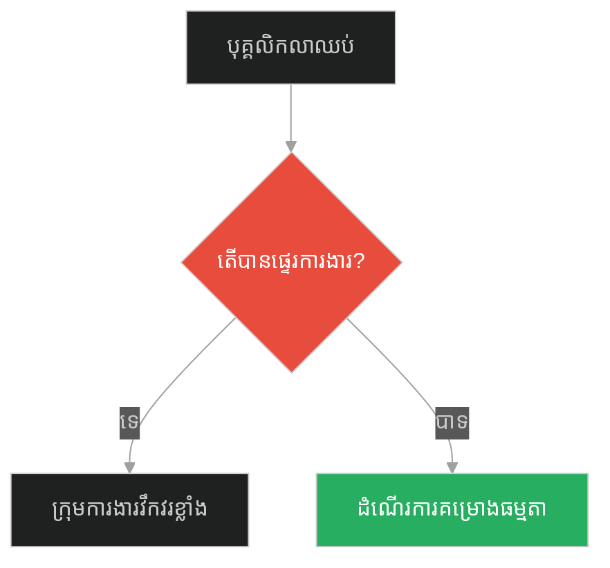
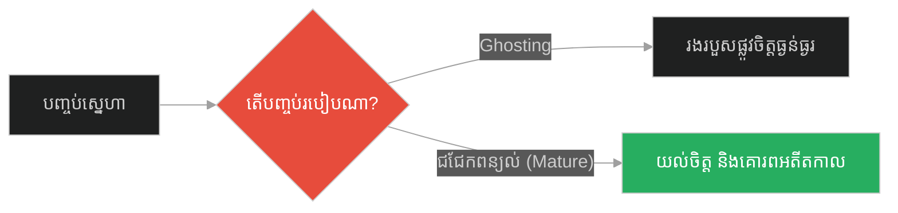

# Coordinated Shutdown & Connection Draining (សូក្រាត និងការចាកចេញរបស់នាវា)៖ ការបិទដំណើរការប្រព័ន្ធដោយសម្របសម្រួល និងការបង្ហូរការតភ្ជាប់ (Coordinated Shutdown & Connection Draining & Graceful Shutdown and Resource Cleanup & Socrates and the Boat)

**Author:** ichamrong  
**Date:** 2026-05-28  
**Tags:** #coordinated-shutdown #connection-draining #graceful-exit #kubernetes #software-engineering  
**Category:** Concepts  
**Read Time:** ~15 min  

---

## 📌 មាតិកា (Table of Contents)
- [អន្ទាក់ផ្លូវចិត្ត (The Trap)](#0)
- [១. រឿងព្រេងនិទាន៖ ការសម្រេចចិត្តមិនលួចរត់គេចខ្លួនរបស់សូក្រាត (The Legend of Socrates and the Boat)](#1)
  - [ពិធីសារនៃការចាកចេញ និងការសម្អាតកាតព្វកិច្ចចុងក្រោយ (The Protocol of Departure and Final Obligations Cleanup)](#1-1)
- [២. បញ្ហា៖ ការបិទប្រព័ន្ធភ្លាមៗបណ្តាលឱ្យខូចទិន្នន័យ (The Issue: Data Corruption & Dropped Transactions)](#2)
- [៣. ឧទាហរណ៍ជាក់ស្តែងក្នុងពិភពពិត (Real World Examples)](#3)
  - [ឧទាហរណ៍ទី ១ — កម្រិតស្រាល (គ្រួសារ)៖ ការរើផ្ទះភ្លាមៗគ្មានការត្រៀមលក្ខណៈ (The Family Sudden Moving vs Coordinated Transition)](#3-1)
  - [ឧទាហរណ៍ទី ២ — កម្រិតមធ្យម (បច្ចេកទេស)៖ ការ Deploy កូដធ្វើឱ្យដាច់ការទូទាត់លុយ (The Dev Abrupt Server Kill vs Connection Draining)](#3-2)
  - [ឧទាហរណ៍ទី ៣ — កម្រិតមធ្យម (ធុរកិច្ច)៖ ការបិទហាងអាជីវកម្មដោយគ្មានដំណឹង (The Business Sudden Closure vs Graceful Wind-down)](#3-3)
  - [ឧទាហរណ៍ទី ៤ — កម្រិតមធ្យម (សង្គម/គ្រប់គ្រង)៖ ប្រធានគម្រោងលាឈប់ភ្លាមៗ (The Management Sudden Resignation vs Handover Protocol)](#3-4)
  - [ឧទាហរណ៍ទី ៥ — កម្រិតធ្ងន់ (ទំនាក់ទំនង)៖ ការបាត់ខ្លួនដោយគ្មានមូលហេតុ (The Relationship Ghosting vs Mature Breakup)](#3-5)
- [៤. ដំណោះស្រាយទូទៅ៖ ការរៀបចំដំណាក់កាលបិទប្រព័ន្ធដោយសុវត្ថិភាព (The General Solution: Graceful Shutdown Lifecycle)](#4)
- [សេចក្តីសន្និដ្ឋាន (Conclusion)](#5)
- [ឯកសារយោង (References)](#6)
- [Related Posts](#7)

---

<a id="0"></a>
## អន្ទាក់ផ្លូវចិត្ត (The Trap)

តើមានអ្វីកើតឡើងនៅពេលដែលអ្នកធ្វើការផ្លាស់ប្តូរប្រព័ន្ធ (Deploy) ឬកាត់បន្ថយម៉ាស៊ីន (Scale Down)? តើប្រព័ន្ធរបស់អ្នកកាត់ផ្តាច់សំណើទូទាត់ប្រាក់របស់ User ទាំងកណ្តាលទី និងបន្សល់ទុកនូវទិន្នន័យខូចខាតដែរឬទេ? អន្ទាក់ផ្លូវចិត្តដ៏ធំបំផុតគឺ៖
*   **ការបិទប្រព័ន្ធភ្លាមៗដោយគ្មានសណ្តាប់ធ្នាប់ (SIGKILL / Abrupt Termination)** — ការកាត់ផ្តាច់ចរន្តអគ្គិសនី ឬសម្លាប់ process ភ្លាមៗ ធ្វើឱ្យរាល់សំណើដែលកំពុងរត់ត្រូវដាច់កណ្តាលទី និងបាត់បង់សណ្តាប់ធ្នាប់។
*   **ការចាកចេញដោយមានការសម្របសម្រួល (Coordinated Shutdown)** — ការប្រកាសឈប់ទទួលសំណើថ្មី បញ្ចប់ការងារចាស់ៗឱ្យរួចរាល់ សម្អាតធនធាន (Connection Draining) រួចទើបបិទប្រព័ន្ធដោយសុវត្ថិភាព។

1.  **រឿងព្រេងនិទាន (The Legend)** — ការបដិសេធមិនលួចរត់គេចចេញពីគុករបស់សូក្រាត និងការទទួលយកសេចក្តីស្លាប់ដោយសន្តិវិធី។
2.  **បញ្ហា (The Issue)** — ការសម្លាប់ Container ភ្លាមៗដោយមិនរង់ចាំឱ្យសំណើចាស់ៗបញ្ចប់ បង្កឱ្យកើតមានកំហុស 502 Bad Gateway។
3.  **ឧទាហរណ៍ជាក់ស្តែង (Real World Examples)** — សារៈសំខាន់នៃការប្រគល់ការងារ និងការចាកចេញដោយថ្លៃថ្នូរក្នុងអាជីវកម្ម។
4.  **ដំណោះស្រាយ (The General Solution)** — ការចាប់សញ្ញា SIGTERM, Connection Draining, និងការបិទ Connections។



---

<a id="1"></a>
## ១. រឿងព្រេងនិទាន៖ ការសម្រេចចិត្តមិនលួចរត់គេចខ្លួនរបស់សូក្រាត (The Legend of Socrates and the Boat)

បន្ទាប់ពីតុលាការក្រុងអាថែនបានកាត់ទោសប្រហារជីវិតសូក្រាតដោយការផឹកថ្នាំពុល លោកត្រូវបានគេឃុំខ្លួននៅក្នុងគុកដើម្បីរង់ចាំថ្ងៃអនុវត្តទោស។

មុនថ្ងៃប្រហារជីវិតមកដល់ គ្រីតូ (Crito) ដែលជាមិត្តភក្តិអ្នកមាន និងជាសិស្សស្មោះស្ម័គ្ររបស់សូក្រាត បានលួចចូលមកជួបលោកនៅក្នុងគុក។ គ្រីតូបានរៀបចំផែនការយ៉ាងល្អិតល្អន់ ដោយសូកប៉ាន់ឆ្មាំគុក និងរៀបចំទូកមួយដើម្បីលួចជម្លៀសសូក្រាតចេញពីទីក្រុងអាថែនទៅកាន់កន្លែងសុវត្ថិភាព។

គ្រីតូបានអង្វរថា៖ *"សូក្រាត! ចូររត់គេចខ្លួនជាមួយខ្ញុំទៅ។ ពួកយើងបានត្រៀមទូករួចរាល់ហើយ។ បើលោកមិនរត់ទេ មនុស្សគ្រប់គ្នានឹងគិតថាពួកយើងជាមិត្តភក្តិអន់ ដែលមិនព្រមចំណាយលុយសង្គ្រោះជីវិតលោក។"*

សូក្រាតបានបដិសេធផែនការនោះភ្លាម។ លោកបានពន្យល់ថា៖
*"គ្រីតូ! ពេញមួយជីវិតរបស់ខ្ញុំ ខ្ញុំបានរស់នៅក្រោមច្បាប់នៃទីក្រុងអាថែន។ ខ្ញុំបានទទួលយកអត្ថប្រយោជន៍ សន្តិសុខ និងការអប់រំពីទីក្រុងនេះ។ ច្បាប់ទាំងនេះប្រៀបដូចជាឪពុកម្តាយខ្ញុំអញ្ចឹង។ ប្រសិនបើខ្ញុំលួចរត់គេចខ្លួនដោយខុសច្បាប់ ខ្ញុំកំពុងតែបំផ្លាញ និងរំលោភលើកិច្ចសន្យាសង្គម (Social Contract) របស់ខ្ញុំជាមួយទីក្រុងនេះហើយ។"*

លោកបានបន្ថែមថា៖ *"ការចាកចេញរបស់ខ្ញុំ ត្រូវតែធ្វើឡើងតាមពិធីសារដ៏ត្រឹមត្រូវ។"*

នៅថ្ងៃអនុវត្តទោស សូក្រាតមិនមានការភិតភ័យ ឬបង្កើតភាពវឹកវរឡើយ។ លោកបានជួបជុំសិស្សានុសិស្ស និយាយទូន្មានចុងក្រោយ ងូតទឹកសម្អាតខ្លួន ផឹកថ្នាំពុលដោយស្ងប់ស្ងាត់។ មុនពេលបិទភ្នែក លោកមិនភ្លេចសម្អាតកាតព្វកិច្ចចុងក្រោយឡើយ ដោយខ្សឹបប្រាប់គ្រីតូថា៖ 

**«គ្រីតូ! ខ្ញុំជំពាក់មាន់មួយក្បាលពី អាស្កលេពៀស (Asclepius)។ ចូរជួយសងបំណុលនេះជំនួសខ្ញុំផង កុំភ្លេចឱ្យសោះ។»** 

បន្ទាប់មក លោកក៏បានលាចាកលោកទៅយ៉ាងមានសណ្តាប់ធ្នាប់បំផុត។

---

<a id="1-1"></a>
### ពិធីសារនៃការចាកចេញ និងការសម្អាតកាតព្វកិច្ចចុងក្រោយ (The Protocol of Departure and Final Obligations Cleanup)

Climax នៃទង្វើរបស់សូក្រាត គឺការចាកចេញដោយ "គោរពតាមច្បាប់ និងការទូទាត់កាតព្វកិច្ចចុងក្រោយ" (Graceful Shutdown)។ លោកមិនព្រមរត់គេចខ្លួនដោយបង្កភាពវឹកវរ (Chaotic Exit) នោះទេ ប៉ុន្តែបានជ្រើសរើសការចាកចេញដោយសម្អាតរាល់កិច្ចការដែលនៅសេសសល់ (Draining existing obligations) ដូចជាការជម្រះបំណុលមាន់មួយក្បាល។ នៅក្នុងការរចនាប្រព័ន្ធ នេះគឺជាគំរូនៃ **Coordinated Shutdown** ដែលរាល់សេវាកម្ម (Services) ត្រូវតែរំសាយខ្លួនដោយសណ្តាប់ធ្នាប់ មុននឹងបិទដំណើរការ។

---

<a id="2"></a>
## ២. បញ្ហា៖ ការបិទប្រព័ន្ធភ្លាមៗបណ្តាលឱ្យខូចទិន្នន័យ (The Issue: Data Corruption & Dropped Transactions)

នៅក្នុងស្ថាបត្យកម្ម Microservices ទំនើប (ដូចជា Kubernetes) នៅពេលយើងធ្វើការ Deploy កូដថ្មី ប្រព័ន្ធនឹងសម្លាប់ Pod ចាស់ចោល រួចជំនួសមកវិញនូវ Pod ថ្មី។ ប្រសិនបើប្រព័ន្ធចាស់ត្រូវបានសម្លាប់ភ្លាមៗ (Hard SIGKILL) នោះរាល់សំណើរបស់ User ដែលកំពុងរត់ (ដូចជាការកាត់លុយ ឬការសរសេរឯកសារចូល Disk) នឹងត្រូវកាត់ផ្តាច់ពាក់កណ្តាលទី ធ្វើឱ្យ User ជួបកំហុស និងខូចទិន្នន័យក្នុង Database។

### Fragile Approach: Hard Terminate on Signal (ការកាត់ផ្តាច់ប្រព័ន្ធភ្លាមៗ)
កូដ JavaScript (Node.js) ខាងក្រោមបង្ហាញពី Server ដែលបិទដំណើរការភ្លាមៗពេលទទួលបានសញ្ញា SIGTERM ដោយមិនខ្វល់ថាតើមាន User កំពុងទាញយកទិន្នន័យ ឬអត់ឡើយ។

```javascript
// ❌ Fragile: បិទដំណើរការភ្លាមៗ បង្កឱ្យដាច់សំណើរបស់ User កណ្តាលទី
const express = require('express');
const app = express();

app.get('/heavy-transaction', (req, res) => {
    // ក្លែងធ្វើប្រតិបត្តិការទូទាត់ប្រាក់ដែលស៊ីពេល 10 វិនាទី
    setTimeout(() => {
        res.send("Payment Processed Successfully!");
    }, 10000);
});

const server = app.listen(3000, () => console.log("Server running..."));

// ចាប់សញ្ញាបញ្ជាបិទ (SIGTERM)
process.on('SIGTERM', () => {
    console.log("SIGTERM received. Killing process immediately!");
    // សម្លាប់ process ភ្លាមៗ ធ្វើឱ្យ User ដែលកំពុងទូទាត់ប្រាក់ខាងលើ ជួបកំហុស Error!
    process.exit(1); 
});
```

### Resilient Approach: Graceful Shutdown & Connection Draining (ការចាកចេញដោយសម្របសម្រួល)
កូដ JavaScript (Node.js) ដ៏រឹងមាំខាងក្រោម ចាប់យកសញ្ញា SIGTERM រួច៖
1.  **ឈប់ទទួលសំណើថ្មី** (`server.close()`)។
2.  **រង់ចាំសំណើចាស់ៗដែលកំពុងរត់ឱ្យបញ្ចប់** (Connection Draining)។
3.  **សម្អាតធនធាន** (បិទ Database connections, clear buffers)។
4.  **បិទ Process ដោយជោគជ័យ** (`process.exit(0)`)។

```javascript
// ✅ Resilient: បិទដំណើរការប្រព័ន្ធដោយសម្របសម្រួល (Graceful Shutdown)
const express = require('express');
const app = express();

let activeConnections = 0;

app.use((req, res, next) => {
    activeConnections++;
    res.on('finish', () => {
        activeConnections--;
    });
    next();
});

app.get('/heavy-transaction', (req, res) => {
    setTimeout(() => {
        res.send("Payment Processed Gracefully!");
    }, 5000); // ស៊ីពេល 5 វិនាទី
});

const server = app.listen(3000, () => console.log("Resilient Server Running..."));

// ចាប់សញ្ញាបញ្ជាបិទ (SIGTERM)
process.on('SIGTERM', () => {
    console.log("SIGTERM received. Starting graceful shutdown...");
    
    // ១. ឈប់ទទួលសំណើថ្មីៗចូលមកទៀត (Stop accepting new requests)
    server.close(() => {
        console.log("No more HTTP requests accepted.");
        
        // ៣. សម្អាតកាតព្វកិច្ចចុងក្រោយ (បិទ Database, flush logs)
        console.log("Closing Database connections...");
        // db.close();
        
        console.log("Graceful shutdown complete. Exiting clean.");
        process.exit(0); // Exit Code 0 (ជោគជ័យ)
    });
    
    // ២. រង់ចាំបង្ហូរការតភ្ជាប់ចាស់ៗឱ្យរួចរាល់ (Connection Draining)
    setInterval(() => {
        console.log(`Waiting for ${activeConnections} active connection(s) to finish...`);
        if (activeConnections === 0) {
            process.exit(0);
        }
    }, 1000);
});
```

---

<a id="3"></a>
## ៣. ឧទាហរណ៍ជាក់ស្តែងក្នុងពិភពពិត (Real World Examples)

<a id="3-1"></a>
### ឧទាហរណ៍ទី ១ — កម្រិតស្រាល (គ្រួសារ)៖ ការរើផ្ទះភ្លាមៗគ្មានការត្រៀមលក្ខណៈ (The Family Sudden Moving vs Coordinated Transition)
*   **Failure Scenario:** ឪពុកម្តាយប្រាប់កូនៗថាត្រូវរើទៅរស់នៅខេត្តផ្សេងនៅថ្ងៃស្អែកភ្លាមៗ ធ្វើឱ្យកូនៗមិនបានលាគ្នាជាមួយមិត្តភក្តិ បាត់បង់សម្ភារៈសិក្សា និងប៉ះពាល់ផ្លូវចិត្ត។
*   **Remediation:** ជូនដំណឹងកូនៗមុន ២ខែ រៀបចំកម្មវិធីលាគ្នា វេចខ្ចប់ឥវ៉ាន់ដោយសណ្តាប់ធ្នាប់ (Coordinated moving)។



<a id="3-2"></a>
### ឧទាហរណ៍ទី ២ — កម្រិតមធ្យម (បច្ចេកទេស)៖ ការ Deploy កូដធ្វើឱ្យដាច់ការទូទាត់លុយ (The Dev Abrupt Server Kill vs Connection Draining)
*   **Failure Scenario:** ក្រុមហ៊ុនអភិវឌ្ឍន៍ Deploy App ថ្មីរៀងរាល់ម៉ោង តែរាល់ពេល Deploy គឺសម្លាប់ process ចាស់ភ្លាម ធ្វើឱ្យអតិថិជនជាច្រើនដាច់ការទូទាត់លុយ និងត្រូវកាត់លុយពីរដង។
*   **Remediation:** កំណត់ឱ្យ Kubernetes រង់ចាំរយៈពេល ៣០វិនាទី (terminationGracePeriodSeconds) ដើម្បីបង្ហូរការតភ្ជាប់ចាស់ៗឱ្យអស់ មុននឹងសម្លាប់ Pod។



<a id="3-3"></a>
### ឧទាហរណ៍ទី ៣ — កម្រិតមធ្យម (ធុរកិច្ច)៖ ការបិទហាងអាជីវកម្មដោយគ្មានដំណឹង (The Business Sudden Closure vs Graceful Wind-down)
*   **Failure Scenario:** ម្ចាស់ហាងកាហ្វេបិទទ្វារហាងរត់ចោលភ្លាមៗដោយសារខាតបង់ មិនព្រមបើកប្រាក់ខែឱ្យបុគ្គលិក និងមិនសងលុយអ្នកផ្គត់ផ្គង់ បង្កឱ្យកើតមានបណ្តឹងផ្ដល់កេរ្តិ៍ឈ្មោះអាក្រក់។
*   **Remediation:** រៀបចំការបិទហាងជាដំណាក់កាល៖ ជូនដំណឹងបុគ្គលិកមុន ១ខែ ទូទាត់ប្រាក់ខែ និងសងបំណុលអ្នកផ្គត់ផ្គង់ឱ្យរួចរាល់ទើបបិទជាផ្លូវការ។



<a id="3-4"></a>
### ឧទាហរណ៍ទី ៤ — កម្រិតមធ្យម (សង្គម/គ្រប់គ្រង)៖ ប្រធានគម្រោងលាឈប់ភ្លាមៗ (The Management Sudden Resignation vs Handover Protocol)
*   **Failure Scenario:** ប្រធានគម្រោងម្នាក់ខឹងនឹងក្រុមហ៊ុន ក៏ដើរចេញឈប់ធ្វើការភ្លាមៗដោយមិនប្រគល់ឯកសារ និងពាក្យសម្ងាត់ប្រព័ន្ធ ធ្វើឱ្យគម្រោងគាំងដំណើរការ។
*   **Remediation:** អនុវត្ត "ពិធីសារផ្ទេរការងារ (Handover Protocol)"៖ បុគ្គលិកលាលែងត្រូវចំណាយពេល ២សប្តាហ៍ដើម្បីបណ្តុះបណ្តាលអ្នកជំនួស និងរៀបចំឯកសារណែនាំ។



<a id="3-5"></a>
### ឧទាហរណ៍ទី ៥ — កម្រិតធ្ងន់ (ទំនាក់ទំនង)៖ ការបាត់ខ្លួនដោយគ្មានមូលហេតុ (The Relationship Ghosting vs Mature Breakup)
*   **Failure Scenario:** ម្នាក់ក្នុងចំណោមគូស្នេហ៍ បានផ្តាច់ទំនាក់ទំនងដោយការបិទលេខទូរស័ព្ទ និងប្លុកគណនីចោលភ្លាមៗ (Ghosting) ធ្វើឱ្យដៃគូម្ខាងទៀតរងទុក្ខវេទនាយ៉ាងខ្លាំង។
*   **Remediation:** ជួបគ្នាជជែកគ្នាដោយផ្ទាល់ ពន្យល់ពីហេតុផលច្បាស់លាស់ និងបញ្ចប់ទំនាក់ទំនងដោយក្តីគោរពគ្នា (Mature Breakup)។



---

<a id="4"></a>
## ៤. ដំណោះស្រាយទូទៅ៖ ការរៀបចំដំណាក់កាលបិទប្រព័ន្ធដោយសុវត្ថិភាព (The General Solution: Graceful Shutdown Lifecycle)

ដើម្បីធានាថាប្រព័ន្ធរបស់យើងចាកចេញដោយសុវត្ថិភាព យើងត្រូវកំណត់យន្តការ **Coordinated Shutdown Lifecycle (វដ្តជីវិតនៃការបិទប្រព័ន្ធដោយសម្របសម្រួល)**។

### ជំហានកសាងប្រព័ន្ធ៖
1.  **Intercept Termination Signal (SIGTERM):** ចាប់យកសញ្ញាបញ្ជាបិទពី OS ឬ Orchestrator។
2.  **Stop Ingress Traffic:** ប្រាប់ទៅកាន់ Load Balancer ឱ្យឈប់បញ្ជូនសំណើថ្មីៗមកកាន់ម៉ាស៊ីននេះ។
3.  **Drain Connections:** រក្សាម៉ាស៊ីនឱ្យរត់ដដែល រហូតដល់សំណើចាស់ៗទាំងអស់ដំណើរការចប់រួចរាល់។
4.  **Cleanup & Release Resources:** បិទការតភ្ជាប់ Database, Clear Cache, និងកត់ត្រា Log ចុងក្រោយ រួចទើបបញ្ចប់ process ផ្លូវការ (Exit Code 0)។

```mermaid
%%{init: {
  'theme': 'dark',
  'themeVariables': {
    'background': '#1e1e1e',
    'primaryTextColor': '#ffffff',
    'lineColor': '#a0a0a0'
  },
  'themeCSS': 'svg { background-color: #1e1e1e !important; padding: 1rem !important; border-radius: 8px !important; } .edgeLabel rect { fill: #1e1e1e !important; } text, tspan { fill: #ffffff !important; }'
}}%%
graph LR
    Signal["1. Catch SIGTERM"] --> Traffic["2. Deregister from LB"]
    Traffic --> Drain["3. Wait for Active Requests"]
    Drain --> Clean["4. Close Connections / DB"]
    Clean --> Exit["5. Process Exit 0"]
    
    style Signal fill:#2980b9,color:#fff
    style Drain fill:#2980b9,color:#fff
    style Exit fill:#27ae60,color:#fff
```



---

<a id="5"></a>
## សេចក្តីសន្និដ្ឋាន (Conclusion)

> **«ការបញ្ចប់ដោយរបៀបរៀបរយ និងការសម្អាតកាតព្វកិច្ចចុងក្រោយ គឺជាសិល្បៈនៃការចាកចេញដ៏ថ្លៃថ្នូរ។ ប្រព័ន្ធដែលចាកចេញដោយសុវត្ថិភាព នឹងមិនបន្សល់ទុកនូវកម្ទេចកម្ទីដែលបង្កការខូចខាតឡើយ។»**

សេចក្តីស្លាប់ប្រកបដោយសណ្តាប់ធ្នាប់របស់សូក្រាត គឺជាគំរូដ៏ល្អសម្រាប់ការរចនាស្ថាបត្យកម្មកុំព្យូទ័រ។ តាមរយៈការអនុវត្ត **Coordinated Shutdown & Connection Draining** យើងអាចប្រាកដបានថា រាល់ការផ្លាស់ប្តូរ និងការបិទដំណើរការប្រព័ន្ធការងារ នឹងមិនបង្កការរំខាន ឬខូចខាតទិន្នន័យឡើយ ជួយរក្សាបាននូវភាពជឿជាក់ និងនិរន្តរភាពខ្ពស់។

---

<a id="6"></a>
## ឯកសារយោង (References)

*   **Plato's Crito & Phaedo** — Historical dialogues covering Socrates' refusal to escape from prison and his final philosophical instructions on the duty of citizens to obey laws.
*   **Kubernetes Container Lifecycle Hooks** — Best practices on using preStop hooks and terminationGracePeriodSeconds to perform graceful shutdowns.
*   **Graceful Shutdown in Node.js (Express)** — Core Node.js documentation on closing HTTP servers and releasing connection handles.

---

<a id="7"></a>
## Related Posts

*   [[Lazy Loading & Just-In-Time Evaluation] (សូក្រាត និងផ្សារលក់ទំនិញ)](./228-socrates-and-the-marketplace.md) — Lazy loading and on-demand resource instantiation.
*   [[Dynamic Feature Flags & Runtime Configuration] (សូក្រាត និងអាថ៌កំបាំងនៃការផ្លាស់ប្តូរ)](./230-socrates-and-the-secret-of-change.md) — Dynamic feature flags and runtime config.

## 🐇 ធ្លាក់ចូលក្នុងរន្ធទន្សាយ (Enter the Rabbit Hole)
ដើម្បីស្វែងយល់បន្ថែមអំពីការកែប្រែប្រព័ន្ធនៅពេលដំណើរការ និងការផ្លាស់ប្តូរដោយសុវត្ថិភាព សូមបន្តដំណើរទៅកាន់៖

* 🚀 **[ចាប់ផ្តើមដំណើររុករក (Start the Journey) ➔ Dynamic Feature Flags & Runtime Configuration (សូក្រាត និងអាថ៌កំបាំងនៃការផ្លាស់ប្តូរ)៖ កុងតាក់មុខងាររស់រវើក និងការកំណត់រចនាសម្ព័ន្ធពេលដំណើរការ (Dynamic Feature Flags & Runtime Configuration & Feature Toggles and Hot Reloading & Socrates and the Secret of Change)](./230-socrates-and-the-secret-of-change.md)**
